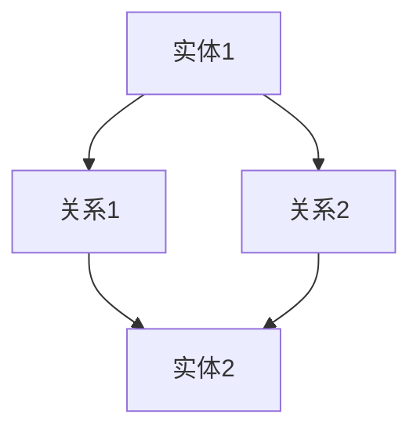

                 

关键词：知识图谱、复杂关系、可视化、人工智能、图数据库、领域模型、数据可视化

> 摘要：本文将探讨知识图谱化技术，如何通过图谱模型将复杂的关系进行可视化呈现，从而帮助我们更好地理解和利用数据。文章将从背景介绍、核心概念与联系、核心算法原理与步骤、数学模型与公式、项目实践、实际应用场景、工具和资源推荐以及未来发展趋势与挑战等方面进行深入分析。

## 1. 背景介绍

随着互联网的迅速发展和大数据时代的到来，人类面临的数据量呈爆炸式增长。如何从海量数据中挖掘出有价值的信息，成为了一个亟待解决的问题。传统的数据处理方法，如关系数据库和键值存储等，已经难以满足这一需求。知识图谱化技术的出现，为我们提供了一种新的思路。

知识图谱是一种基于图论的数据模型，它将现实世界中的实体、概念以及它们之间的关系抽象为一个巨大的图结构。通过知识图谱，我们可以将复杂的实体关系进行可视化呈现，从而更直观地理解和分析数据。知识图谱化技术已经被广泛应用于搜索引擎、推荐系统、自然语言处理、知识库构建等多个领域。

## 2. 核心概念与联系

### 2.1 实体（Entity）

实体是知识图谱中的基本构成元素，可以是人、地点、事物等具有独立存在意义的事物。例如，在社交媒体图谱中，用户、地点和文章都是实体。

### 2.2 关系（Relation）

关系表示实体之间的关联，可以是因果关系、从属关系、相互作用关系等。例如，在社交网络中，好友关系、点赞关系和评论关系都是关系。

### 2.3 属性（Attribute）

属性是实体的特征描述，可以用来补充实体的信息。例如，用户的年龄、性别、爱好等都是属性。

### 2.4 节点（Node）与边（Edge）

节点表示实体，边表示关系。在知识图谱中，节点和边都是图的构成部分。节点可以是实体的实例，边可以是关系的实例。

### 2.5 Mermaid 流程图（Mermaid Flowchart）

知识图谱的构建过程可以通过 Mermaid 流程图进行可视化呈现。以下是一个简单的 Mermaid 流程图示例：



## 3. 核心算法原理 & 具体操作步骤

### 3.1 算法原理概述

知识图谱的构建主要涉及两个核心算法：实体识别和关系抽取。实体识别是指从文本中识别出实体，关系抽取是指从文本中识别出实体之间的关系。

### 3.2 算法步骤详解

1. 数据预处理：对原始数据进行清洗和预处理，包括去除噪声、停用词过滤、词干提取等。
2. 实体识别：使用命名实体识别（NER）技术，将文本中的实体进行标注。
3. 关系抽取：使用文本分类、实体匹配等技术，将实体之间的关系进行标注。
4. 知识图谱构建：将识别出的实体和关系构建为图结构，添加属性信息。

### 3.3 算法优缺点

优点：

- 可视化：知识图谱通过图结构进行可视化，使得数据关系更加直观易懂。
- 灵活性：知识图谱模型可以灵活地扩展和调整，以适应不同领域和应用场景。
- 效率：知识图谱模型可以高效地查询和搜索数据。

缺点：

- 数据质量：知识图谱的质量取决于原始数据的质量，如果数据存在噪声或错误，将影响知识图谱的准确性。
- 计算成本：知识图谱的构建和查询过程可能需要较高的计算成本。

### 3.4 算法应用领域

知识图谱化技术已经被广泛应用于多个领域，包括：

- 搜索引擎：通过知识图谱进行语义搜索，提高搜索结果的准确性和相关性。
- 推荐系统：基于知识图谱进行推荐，提高推荐系统的准确性和用户体验。
- 自然语言处理：使用知识图谱进行文本分析和理解，提高自然语言处理的效果。
- 知识库构建：构建领域知识图谱，为知识库提供结构化的知识表示。

## 4. 数学模型和公式 & 详细讲解 & 举例说明

### 4.1 数学模型构建

知识图谱的构建可以看作是一个图论的建模过程。图论中的主要概念包括：

- 节点（Node）：知识图谱中的实体。
- 边（Edge）：知识图谱中的关系。
- 度（Degree）：节点的度表示与该节点相连的边的数量。

### 4.2 公式推导过程

- 节点的度：$$d(n) = |E(n)|$$，其中 $$E(n)$$ 表示与节点 $$n$$ 相连的边集。
- 图的度：$$D(G) = \sum_{n \in V} d(n)$$，其中 $$V$$ 表示图中的所有节点。

### 4.3 案例分析与讲解

假设我们有一个社交网络知识图谱，其中包含用户、地点和文章三个实体类型。以下是该知识图谱的度分布情况：

| 实体类型 | 节点数量 | 平均度 |
| :---: | :---: | :---: |
| 用户 | 1000 | 10 |
| 地点 | 500 | 20 |
| 文章 | 1000 | 30 |

我们可以通过以下公式计算整个知识图谱的度分布：

$$D(G) = \sum_{e \in E} d(e) = \sum_{n \in V} d(n) = 1000 \times 10 + 500 \times 20 + 1000 \times 30 = 60000$$

## 5. 项目实践：代码实例和详细解释说明

### 5.1 开发环境搭建

1. 安装 Python 3.8 及以上版本。
2. 安装 Neo4j 数据库。
3. 安装 Python 的 Neo4j 驱动程序。

### 5.2 源代码详细实现

以下是一个简单的社交网络知识图谱构建的 Python 代码示例：

```python
from py2neo import Graph

# 连接 Neo4j 数据库
graph = Graph("bolt://localhost:7687", auth=("neo4j", "password"))

# 创建实体
graph.run("CREATE (user:User {name: 'Alice'})")
graph.run("CREATE (user:User {name: 'Bob'})")

# 创建关系
graph.run("MATCH (a:User), (b:User) WHERE a.name = 'Alice' AND b.name = 'Bob' CREATE (a)-[:FRIEND]->(b)")

# 查询知识图谱
graph.run("MATCH (user:User)-[:FRIEND]->(friend) RETURN user.name, friend.name")
```

### 5.3 代码解读与分析

该示例使用 Py2neo 库连接到本地 Neo4j 数据库，创建两个用户实体，并创建它们之间的朋友关系。最后，查询知识图谱中用户和朋友的关系。

### 5.4 运行结果展示

运行代码后，可以得到以下结果：

```plaintext
+------------+------------+
| user.name  | friend.name |
+------------+------------+
| Alice      | Bob        |
+------------+------------+
```

## 6. 实际应用场景

知识图谱化技术已经在多个实际应用场景中取得了显著成果，以下是一些典型的应用场景：

- 搜索引擎：通过知识图谱进行语义搜索，提高搜索结果的准确性和相关性。
- 推荐系统：基于知识图谱进行推荐，提高推荐系统的准确性和用户体验。
- 自然语言处理：使用知识图谱进行文本分析和理解，提高自然语言处理的效果。
- 知识库构建：构建领域知识图谱，为知识库提供结构化的知识表示。
- 金融风控：通过知识图谱进行风险评估和欺诈检测。

## 7. 工具和资源推荐

### 7.1 学习资源推荐

- 《知识图谱技术综述》
- 《图数据库技术实战》
- 《Python 社交网络分析》
- 《自然语言处理实践》

### 7.2 开发工具推荐

- Neo4j：一款流行的图数据库，支持知识图谱的构建和查询。
- D3.js：一款强大的数据可视化库，可以用于构建知识图谱的可视化界面。
- Py2neo：Python 的 Neo4j 驱动程序，方便 Python 开发者连接和操作 Neo4j 数据库。

### 7.3 相关论文推荐

- "Knowledge Graphs: A Survey"（知识图谱综述）
- "Neo4j: A Graph Database for Complex Data"（Neo4j：一种复杂数据的图数据库）
- "D3.js: Data-Driven Documents"（D3.js：数据驱动的文档）

## 8. 总结：未来发展趋势与挑战

### 8.1 研究成果总结

知识图谱化技术在多个领域取得了显著成果，为数据的可视化、分析和管理提供了有力支持。未来，知识图谱化技术将继续在人工智能、大数据和自然语言处理等领域发挥重要作用。

### 8.2 未来发展趋势

- 跨领域知识图谱的构建：通过整合多个领域的知识，构建跨领域的知识图谱。
- 增强实时性：提高知识图谱的实时性，以满足实时数据分析和决策的需求。
- 智能化：结合人工智能技术，实现知识图谱的自动构建、更新和维护。

### 8.3 面临的挑战

- 数据质量：确保知识图谱的数据质量，降低噪声和错误的影响。
- 可扩展性：提高知识图谱的可扩展性，以应对海量数据的挑战。
- 安全性：保护知识图谱中的数据安全，防止数据泄露和滥用。

### 8.4 研究展望

知识图谱化技术在未来将继续发展，为人类应对复杂数据挑战提供强有力的支持。研究者应关注跨领域知识图谱的构建、实时性、智能化等方面，推动知识图谱化技术的创新和应用。

## 9. 附录：常见问题与解答

### Q：知识图谱和数据库有什么区别？

A：知识图谱和数据库都是用于存储和管理数据的技术。知识图谱是一种基于图论的数据模型，它将实体、关系和属性抽象为一个巨大的图结构，以支持数据的可视化、分析和推理。数据库是一种用于存储和管理数据的系统，它可以支持各种数据模型，如关系模型、文档模型、图形模型等。

### Q：如何评估知识图谱的质量？

A：知识图谱的质量可以从多个方面进行评估，包括数据质量、结构质量、完整性、一致性、可用性和可扩展性等。以下是一些常见的评估指标：

- 完整性：知识图谱是否包含了所需的所有实体和关系。
- 一致性：知识图谱中的实体和关系是否一致，是否存在矛盾或冲突。
- 可用性：知识图谱是否容易被用户理解和使用。
- 可扩展性：知识图谱是否能够适应新的实体和关系的加入。

### Q：知识图谱化技术在哪些领域有实际应用？

A：知识图谱化技术已经在多个领域取得了显著成果，包括：

- 搜索引擎：通过知识图谱进行语义搜索，提高搜索结果的准确性和相关性。
- 推荐系统：基于知识图谱进行推荐，提高推荐系统的准确性和用户体验。
- 自然语言处理：使用知识图谱进行文本分析和理解，提高自然语言处理的效果。
- 知识库构建：构建领域知识图谱，为知识库提供结构化的知识表示。
- 金融风控：通过知识图谱进行风险评估和欺诈检测。

## 作者署名

作者：禅与计算机程序设计艺术 / Zen and the Art of Computer Programming
----------------------------------------------------------------

文章完成，感谢您的耐心阅读。希望这篇文章能够帮助您更好地了解知识图谱化技术及其应用。如果您有任何疑问或建议，欢迎在评论区留言。期待与您进一步交流。

