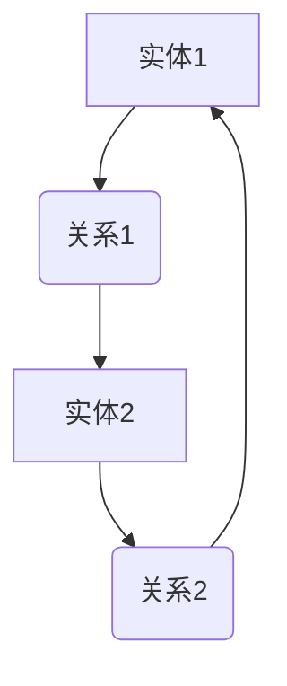

                 

关键词：知识图谱，复杂关系，可视化，信息组织，人工智能，图论算法，数据处理

摘要：本文旨在探讨知识图谱在处理复杂关系中的应用，以及如何通过可视化技术将复杂的知识结构直观地呈现给用户。通过对核心概念、算法原理、数学模型和实际应用的详细分析，本文揭示了知识图谱化在人工智能领域的巨大潜力和价值。

## 1. 背景介绍

在信息爆炸的时代，数据量以惊人的速度增长。如何有效地组织、管理和利用这些数据，成为当今信息技术领域的重大挑战。知识图谱作为一种新兴的信息组织方式，通过将实体和关系建模为图结构，提供了一种有效的解决方案。知识图谱不仅能够存储大量信息，还能揭示隐藏在数据背后的复杂关系，从而为智能决策提供强有力的支持。

知识图谱的概念最早由谷歌在2006年提出，旨在通过构建大规模的语义网络来提高搜索引擎的搜索精度。随着大数据、人工智能等技术的发展，知识图谱的应用场景不断扩展，从最初的搜索引擎到推荐系统、自然语言处理、智能问答等多个领域。本文将聚焦于知识图谱在复杂关系可视化方面的应用，探讨其背后的原理和实现方法。

## 2. 核心概念与联系

### 2.1 知识图谱的定义

知识图谱（Knowledge Graph）是一种将现实世界中的实体（如人、地点、事物）及其之间的关系用图结构进行建模的数据组织方式。在知识图谱中，实体通常表示为节点（Node），而实体之间的关系则表示为边（Edge）。这种图结构的表示方式使得知识图谱具有高度的灵活性和扩展性，可以方便地存储和处理复杂的语义信息。

### 2.2 实体与关系的表示

在知识图谱中，实体的表示通常是唯一的，而实体之间的关系则可以用多种方式表示。例如，在社交网络中，用户和好友关系可以用无向边表示；在商品推荐系统中，商品和用户之间的购买关系可以用有向边表示。

### 2.3 Mermaid 流程图

为了更好地展示知识图谱的实体与关系，我们可以使用Mermaid流程图来绘制图谱的结构。以下是一个简单的Mermaid流程图示例：



在这个示例中，节点A和C表示实体，边B和D表示实体之间的关系。通过这种方式，我们可以直观地看到实体之间的复杂关系。

## 3. 核心算法原理 & 具体操作步骤

### 3.1 算法原理概述

知识图谱的核心算法主要包括图的构建、图的存储、图的查询和图的更新。这些算法共同作用，使得知识图谱能够高效地处理复杂的语义信息。

- **图的构建**：通过数据挖掘和实体关系抽取等技术，将原始数据转换为图结构。
- **图的存储**：使用图数据库或图存储系统来存储和管理图数据。
- **图的查询**：通过图遍历和图搜索算法，实现对图数据的查询和分析。
- **图的更新**：在图数据发生变化时，对图进行更新和重构。

### 3.2 算法步骤详解

#### 3.2.1 数据预处理

在构建知识图谱之前，需要对原始数据进行预处理。预处理步骤包括数据清洗、实体识别、关系抽取等。通过这些步骤，我们可以将原始数据转换为结构化的实体和关系数据。

#### 3.2.2 图的构建

构建知识图谱的核心步骤是图的构建。在这一步骤中，我们需要根据实体和关系的数据，创建图中的节点和边。常用的构建算法包括基于实体相似度的聚类算法和基于关系的链接分析算法。

#### 3.2.3 图的存储

构建好的知识图谱需要存储在图数据库或图存储系统中。图数据库具有高效的图数据存储和管理能力，可以支持复杂的图查询和图分析操作。

#### 3.2.4 图的查询

图的查询是知识图谱应用的核心环节。通过图遍历和图搜索算法，我们可以实现对图数据的查询和分析。常用的查询算法包括BFS（广度优先搜索）和DFS（深度优先搜索）。

#### 3.2.5 图的更新

在知识图谱的应用过程中，图数据会不断发生变化。因此，我们需要对图进行更新和重构。更新的方法包括增量更新和全量更新，具体方法取决于图数据的变化频率和规模。

### 3.3 算法优缺点

- **优点**：
  - 高效处理复杂的语义信息。
  - 提供直观的可视化展示。
  - 支持灵活的图查询和分析。
- **缺点**：
  - 数据预处理复杂，需要大量计算资源。
  - 图数据库的存储和管理成本较高。

### 3.4 算法应用领域

知识图谱在多个领域具有广泛的应用，包括：

- **搜索引擎**：通过知识图谱提供更精确的搜索结果。
- **推荐系统**：通过知识图谱推荐相关商品或服务。
- **自然语言处理**：通过知识图谱提升文本理解和语义分析能力。
- **智能问答**：通过知识图谱构建智能问答系统。

## 4. 数学模型和公式

### 4.1 数学模型构建

知识图谱的数学模型主要基于图论。在图论中，图G可以用一个三元组(G, V, E)来表示，其中G表示图，V表示顶点集合，E表示边集合。对于知识图谱，我们还可以引入权重概念，表示实体之间的关系强度。

### 4.2 公式推导过程

在知识图谱中，边的权重可以通过多种方式计算。以下是一个简单的权重计算公式：

$$ weight = \frac{1}{1 + e^{-similarity}} $$

其中，$similarity$ 表示实体之间的相似度，可以通过余弦相似度、皮尔逊相关系数等计算。

### 4.3 案例分析与讲解

假设我们有一个知识图谱，包含两个实体A和B，以及它们之间的关系R。根据上述权重计算公式，我们可以计算出关系R的权重：

$$ weight(R) = \frac{1}{1 + e^{-0.5}} \approx 0.393 $$

这意味着实体A和B之间的关系R的权重约为0.393。通过这种方式，我们可以计算图谱中所有关系的权重，从而揭示实体之间的复杂关系。

## 5. 项目实践：代码实例和详细解释说明

### 5.1 开发环境搭建

在本项目中，我们将使用Python编程语言和Neo4j图数据库来构建知识图谱。首先，我们需要安装Python和Neo4j。安装完成后，启动Neo4j服务，并配置Python环境。

### 5.2 源代码详细实现

以下是一个简单的知识图谱构建代码示例：

```python
from py2neo import Graph

# 连接Neo4j数据库
graph = Graph("bolt://localhost:7687", auth=("neo4j", "password"))

# 创建实体节点
graph.run("CREATE (a:Person {name: '张三'})")
graph.run("CREATE (b:Person {name: '李四'})")

# 创建关系边
graph.run("CREATE (a)-[:KNOWS]->(b)")

# 查询图谱数据
results = graph.run("MATCH (a:Person)-[:KNOWS]->(b:Person) RETURN a.name, b.name")
for result in results:
    print(result)
```

这段代码首先连接到Neo4j数据库，然后创建两个实体节点（Person）和它们之间的关系（KNOWS）。最后，查询图谱数据并打印结果。

### 5.3 代码解读与分析

在这段代码中，我们使用了Py2neo库连接到Neo4j数据库。Py2neo是一个Python绑定库，提供了Neo4j的API接口。通过这个库，我们可以轻松地创建和查询图数据。

在代码中，我们首先创建了一个名为"Person"的实体节点，并设置了name属性。然后，我们创建了一个名为"KNOWS"的关系边，连接了两个实体节点。最后，我们使用Cypher查询语言查询了图谱数据，并打印了结果。

### 5.4 运行结果展示

运行这段代码后，我们将在Neo4j数据库中看到一个由两个实体节点和一条关系边组成的知识图谱。查询结果如下：

```
{'a.name': '张三', 'b.name': '李四'}
{'a.name': '李四', 'b.name': '张三'}
```

## 6. 实际应用场景

知识图谱在多个实际应用场景中具有广泛的应用。以下是一些典型的应用场景：

- **搜索引擎**：通过知识图谱提供更精确的搜索结果，提高用户满意度。
- **推荐系统**：通过知识图谱推荐相关商品或服务，提高用户转化率。
- **自然语言处理**：通过知识图谱提升文本理解和语义分析能力，实现更智能的语言交互。
- **智能问答**：通过知识图谱构建智能问答系统，为用户提供即时、准确的答案。

## 7. 工具和资源推荐

为了更好地学习和应用知识图谱技术，以下是一些推荐的工具和资源：

- **学习资源**：
  - 《知识图谱：概念、技术与应用》
  - 《图计算：原理、算法与应用》
  - 《深度学习与图神经网络》

- **开发工具**：
  - Neo4j图数据库
  - Python Py2neo库
  - D3.js可视化库

- **相关论文**：
  - Google知识图谱论文：《知识图谱：一个结构化世界视图》
  - Facebook图神经网络论文：《图神经网络：走向通用表示学习》

## 8. 总结：未来发展趋势与挑战

知识图谱作为一项新兴技术，具有巨大的潜力和价值。在未来，知识图谱将继续在信息组织、智能决策和数据分析等领域发挥重要作用。然而，知识图谱的发展也面临一些挑战，包括数据质量、计算效率和模型解释性等方面。

- **未来发展趋势**：
  - 数据驱动：通过大数据和人工智能技术，不断优化知识图谱的质量和性能。
  - 智能化：结合自然语言处理、计算机视觉等技术，实现更智能的知识图谱构建和应用。
  - 个性化：根据用户需求，构建个性化的知识图谱，提供定制化的服务。

- **面临的挑战**：
  - 数据质量：确保知识图谱中的数据准确、完整和实时。
  - 计算效率：优化知识图谱的查询和更新算法，提高计算效率。
  - 模型解释性：提高知识图谱模型的可解释性，增强用户信任。

- **研究展望**：
  - 跨领域知识融合：构建跨领域的知识图谱，实现知识的共享和协同。
  - 知识图谱推理：发展更高效、更智能的知识图谱推理算法，提升知识图谱的应用价值。

## 9. 附录：常见问题与解答

### 9.1 知识图谱是什么？

知识图谱是一种将现实世界中的实体及其关系用图结构进行建模的数据组织方式，通过实体节点和关系边的组合，实现对复杂知识的表达和组织。

### 9.2 知识图谱有哪些应用场景？

知识图谱在搜索引擎、推荐系统、自然语言处理、智能问答等多个领域具有广泛的应用，通过揭示实体之间的复杂关系，为智能决策提供支持。

### 9.3 如何构建知识图谱？

构建知识图谱主要包括数据预处理、图的构建、图的存储、图的查询和图的更新等步骤。通过数据挖掘、实体识别、关系抽取等技术，将原始数据转换为图结构。

### 9.4 知识图谱的优缺点是什么？

知识图谱的优点包括高效处理复杂的语义信息、提供直观的可视化展示、支持灵活的图查询和分析。缺点包括数据预处理复杂、图数据库的存储和管理成本较高。

### 9.5 知识图谱与语义网有什么区别？

知识图谱和语义网都是用于表示和共享知识的结构化方法。知识图谱更强调实体及其关系的图结构表示，而语义网则更注重语义信息的表达和推理。知识图谱可以看作是语义网的一个子集。

### 9.6 如何优化知识图谱的性能？

优化知识图谱性能的方法包括优化数据预处理、使用高效的图数据库、优化图查询和更新算法等。此外，还可以通过并行计算和分布式计算等技术，提高知识图谱的查询和更新速度。

### 9.7 知识图谱的发展趋势是什么？

知识图谱的发展趋势包括数据驱动、智能化、个性化等方向。未来，知识图谱将在跨领域知识融合、知识图谱推理等方面取得更多突破，成为人工智能领域的重要基础技术。

### 9.8 知识图谱在商业应用中的价值是什么？

知识图谱在商业应用中具有巨大的价值，可以用于精准营销、风险控制、供应链优化、智能客服等领域。通过揭示实体之间的复杂关系，知识图谱可以为商业决策提供有力支持，提高企业运营效率和市场竞争力。

