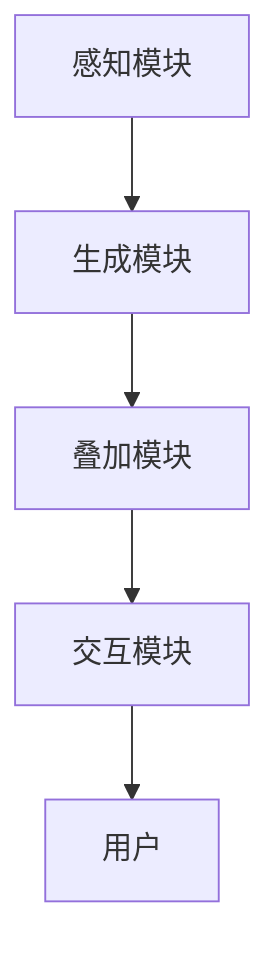

                 

 **关键词**：增强现实、实时信息、学习体验、知识应用、交互设计

**摘要**：本文探讨了增强现实技术在知识传授和学习过程中的应用，通过实时信息叠加的方式，为学习者提供了沉浸式、互动性强的学习体验。文章介绍了增强现实的基本原理，分析了其与知识传授的契合点，并详细阐述了在实际应用中如何利用增强现实技术实现实时信息叠加。通过具体案例，展示了增强现实技术在教育、培训等领域的应用场景，最后对未来的发展趋势和挑战进行了展望。

## 1. 背景介绍

随着科技的飞速发展，信息技术逐渐渗透到社会生活的方方面面。传统教育模式已难以满足现代学习者的需求，人们渴望更灵活、更高效的学习方式。在此背景下，增强现实（Augmented Reality，AR）技术应运而生。AR技术通过将虚拟信息与现实环境相结合，为用户提供了一种全新的交互体验。近年来，随着硬件设备的进步和算法的优化，AR技术已逐渐成熟，并开始在教育、医疗、军事、工业等多个领域得到广泛应用。

在教育领域，AR技术的引入不仅改变了传统的教学方式，还为学习者提供了更加生动、直观的学习体验。通过实时信息叠加，学习者可以随时随地获取所需的知识点，加深对学习内容的理解和记忆。这种沉浸式的学习方式，有助于提高学习兴趣和学习效果。

## 2. 核心概念与联系

### 2.1 增强现实的基本原理

增强现实技术通过在现实场景中叠加虚拟信息，为用户提供了一种虚实融合的交互体验。其核心原理包括以下几个方面：

#### 2.1.1 感知与捕捉

AR技术首先需要捕捉现实环境中的图像、声音等信息。这通常通过摄像头、传感器等设备实现。通过图像识别、声音识别等技术，系统能够准确地识别出现实环境中的物体和场景。

#### 2.1.2 虚拟信息生成

在捕捉到现实环境信息后，系统会根据用户的需要生成相应的虚拟信息。这些虚拟信息可以是文字、图像、三维模型等。虚拟信息的生成通常依赖于计算机图形学和人工智能技术。

#### 2.1.3 实时叠加

生成虚拟信息后，系统会将这些信息实时叠加到现实场景中。叠加的过程需要精确地匹配现实环境和虚拟信息，以确保虚拟信息与现实环境的完美融合。

#### 2.1.4 用户交互

用户可以通过触摸屏、语音、手势等方式与虚拟信息进行交互。这种交互方式不仅方便用户获取信息，还可以增强用户的参与感和体验感。

### 2.2 AR与知识传授的契合点

AR技术具有以下特点，使其在教育领域具有广泛的应用前景：

#### 2.2.1 沉浸式体验

通过AR技术，学习者可以身临其境地感受学习内容。这种沉浸式体验有助于提高学习兴趣和参与度。

#### 2.2.2 互动性

AR技术提供了丰富的交互方式，用户可以与学习内容进行实时互动。这种互动性有助于加深对学习内容的理解和记忆。

#### 2.2.3 实时性

AR技术可以实时地捕捉现实环境信息，并生成相应的虚拟信息。这使得学习者可以随时随地获取所需的知识点，不受时间和地点的限制。

#### 2.2.4 多样性

AR技术可以生成各种形式的虚拟信息，如文字、图像、三维模型等。这种多样性使得学习内容可以更加生动、直观，满足不同学习者的需求。

### 2.3 增强现实技术的架构

为了实现AR技术的功能，通常需要以下几个关键组成部分：

#### 2.3.1 感知模块

感知模块负责捕捉现实环境中的图像、声音等信息。常用的感知设备包括摄像头、传感器等。

#### 2.3.2 生成模块

生成模块负责生成虚拟信息。这通常需要计算机图形学和人工智能技术，如3D建模、图像识别等。

#### 2.3.3 叠加模块

叠加模块负责将虚拟信息实时叠加到现实场景中。这需要精确地匹配现实环境和虚拟信息。

#### 2.3.4 交互模块

交互模块负责处理用户与虚拟信息的交互。这通常通过触摸屏、语音、手势等方式实现。

### 2.4 Mermaid 流程图

下面是一个简化的增强现实技术架构的 Mermaid 流程图：



## 3. 核心算法原理 & 具体操作步骤

### 3.1 算法原理概述

增强现实技术的核心算法主要包括图像识别、3D建模、实时渲染等。这些算法共同作用，实现了虚拟信息与现实环境的精准匹配和实时叠加。

#### 3.1.1 图像识别

图像识别算法用于捕捉现实环境中的图像信息，并识别出其中的物体和场景。常用的图像识别算法包括卷积神经网络（CNN）和循环神经网络（RNN）等。

#### 3.1.2 3D建模

3D建模算法用于生成虚拟信息的三维模型。这通常需要计算机图形学中的几何建模、纹理映射等技术。

#### 3.1.3 实时渲染

实时渲染算法用于将虚拟信息实时地叠加到现实场景中。这需要高效的图形处理和渲染技术，如OpenGL和DirectX等。

### 3.2 算法步骤详解

实现增强现实技术的具体步骤如下：

#### 3.2.1 感知环境

使用摄像头捕捉现实环境的图像信息。这一步需要确保图像的清晰度和实时性。

#### 3.2.2 识别物体

利用图像识别算法识别图像中的物体和场景。这一步需要准确地匹配现实环境和虚拟信息。

#### 3.2.3 生成虚拟信息

根据识别结果，生成相应的虚拟信息的三维模型。这一步需要利用计算机图形学中的建模和纹理映射技术。

#### 3.2.4 实时渲染

将生成的虚拟信息实时地叠加到现实场景中。这一步需要高效的图形处理和渲染技术。

#### 3.2.5 用户交互

处理用户与虚拟信息的交互，如触摸屏、语音、手势等。这一步需要设计友好的用户界面和交互方式。

### 3.3 算法优缺点

#### 3.3.1 优点

- **沉浸式体验**：增强现实技术提供了沉浸式的学习体验，有助于提高学习兴趣和参与度。
- **实时性**：增强现实技术可以实时地捕捉现实环境信息，并生成相应的虚拟信息，提供了便捷的学习方式。
- **互动性**：增强现实技术提供了丰富的交互方式，用户可以与学习内容进行实时互动。

#### 3.3.2 缺点

- **硬件成本**：增强现实技术需要较高的硬件成本，如高质量的摄像头、传感器等。
- **技术门槛**：增强现实技术涉及到多个领域的知识，如计算机图形学、人工智能等，技术门槛较高。

### 3.4 算法应用领域

增强现实技术可以在多个领域得到广泛应用，如教育、医疗、军事、工业等。以下是一些具体的应用场景：

- **教育**：通过增强现实技术，学习者可以更加直观地理解抽象的知识点，提高学习效果。
- **医疗**：医生可以通过增强现实技术进行手术模拟和培训，提高手术成功率。
- **军事**：士兵可以通过增强现实技术进行战场模拟和训练，提高战场适应能力。
- **工业**：工程师可以通过增强现实技术进行设备维护和故障诊断，提高工作效率。

## 4. 数学模型和公式 & 详细讲解 & 举例说明

### 4.1 数学模型构建

在增强现实技术的实现过程中，数学模型起到了关键作用。以下是几个核心的数学模型：

#### 4.1.1 图像识别模型

图像识别模型通常采用卷积神经网络（CNN）来实现。其基本结构包括卷积层、池化层、全连接层等。以下是CNN的基本公式：

$$
f(x) = \sigma(W \cdot x + b)
$$

其中，$f(x)$表示输出特征，$W$表示权重，$x$表示输入特征，$\sigma$表示激活函数，$b$表示偏置。

#### 4.1.2 3D建模模型

3D建模模型通常采用几何建模的方法。其基本原理是通过顶点、边、面的组合来构建三维模型。以下是3D建模的基本公式：

$$
V = (x, y, z)
$$

其中，$V$表示三维模型的顶点，$(x, y, z)$表示顶点的坐标。

#### 4.1.3 实时渲染模型

实时渲染模型通常采用图形渲染引擎来实现。其基本原理是将生成的虚拟信息实时地渲染到屏幕上。以下是实时渲染的基本公式：

$$
R = \frac{z_{virtual}}{z_{virtual} + z_{real}}
$$

其中，$R$表示渲染的深度，$z_{virtual}$表示虚拟信息的深度，$z_{real}$表示现实环境的深度。

### 4.2 公式推导过程

下面简要介绍几个核心数学模型的推导过程。

#### 4.2.1 图像识别模型

图像识别模型的推导过程主要包括以下几个方面：

1. **卷积操作**：卷积操作是CNN的核心操作。其基本公式为：

$$
(W \cdot x)_{ij} = \sum_{k=1}^{K} W_{ik,jk} \cdot x_{kj}
$$

其中，$W$表示卷积核，$x$表示输入特征，$i$和$j$表示卷积核的位置，$k$表示卷积核的索引。

2. **池化操作**：池化操作用于降低特征图的尺寸，提高模型的泛化能力。其基本公式为：

$$
p_{ij} = \max_{k=1}^{K} (W \cdot x)_{ik,jk}
$$

其中，$p$表示输出特征，$i$和$j$表示输出特征的位置。

3. **全连接层**：全连接层将上一层的特征映射到输出。其基本公式为：

$$
f(x) = \sigma(W \cdot x + b)
$$

其中，$f$表示输出特征，$W$表示权重，$x$表示输入特征，$\sigma$表示激活函数，$b$表示偏置。

#### 4.2.2 3D建模模型

3D建模模型的推导过程主要包括以下几个方面：

1. **顶点构建**：顶点构建是3D建模的基础。其基本公式为：

$$
V = (x, y, z)
$$

其中，$V$表示顶点，$(x, y, z)$表示顶点的坐标。

2. **边构建**：边构建用于连接顶点，形成基本的三维结构。其基本公式为：

$$
E = \{(V_i, V_j) | V_i \text{和} V_j \text{是相邻的顶点}\}
$$

其中，$E$表示边集，$V_i$和$V_j$表示相邻的顶点。

3. **面构建**：面构建用于形成三维模型的外表面。其基本公式为：

$$
F = \{(V_i, V_j, V_k) | V_i, V_j, V_k \text{是相邻的顶点}\}
$$

其中，$F$表示面集，$V_i$、$V_j$和$V_k$表示相邻的顶点。

#### 4.2.3 实时渲染模型

实时渲染模型的推导过程主要包括以下几个方面：

1. **透视投影**：透视投影用于将三维场景映射到二维屏幕上。其基本公式为：

$$
x' = \frac{x}{z}
$$

$$
y' = \frac{y}{z}
$$

其中，$x'$和$y'$表示屏幕上的坐标，$x$和$y$表示三维场景中的坐标，$z$表示深度。

2. **视场变换**：视场变换用于调整屏幕上的坐标，使其适应不同的显示设备。其基本公式为：

$$
x'_{screen} = x' \times scale
$$

$$
y'_{screen} = y' \times scale
$$

其中，$x'_{screen}$和$y'_{screen}$表示屏幕上的坐标，$x'$和$y'$表示透视投影后的坐标，$scale$表示缩放比例。

3. **深度排序**：深度排序用于确定屏幕上各个物体的绘制顺序。其基本公式为：

$$
z_{sorted} = \frac{z_{virtual}}{z_{virtual} + z_{real}}
$$

其中，$z_{sorted}$表示排序后的深度，$z_{virtual}$表示虚拟信息的深度，$z_{real}$表示现实环境的深度。

### 4.3 案例分析与讲解

下面通过一个简单的案例，来说明如何利用增强现实技术实现实时信息叠加。

#### 4.3.1 案例背景

假设我们要实现一个AR应用，用于在现实场景中叠加书本的内容。具体需求如下：

- 用户通过摄像头捕捉到书本的图像。
- 系统识别出书本的页面，并生成相应的文字和图像。
- 系统将生成的文字和图像叠加到书本的页面上。
- 用户可以通过触摸屏幕与叠加的内容进行交互。

#### 4.3.2 案例实现

1. **感知环境**

   使用摄像头捕捉书本的图像。这一步需要确保图像的清晰度和实时性。

2. **识别物体**

   利用图像识别算法识别书本的页面。这一步需要准确地匹配现实环境和虚拟信息。

3. **生成虚拟信息**

   根据识别结果，生成相应的文字和图像。这一步需要利用计算机图形学中的建模和纹理映射技术。

4. **实时渲染**

   将生成的虚拟信息实时地叠加到书本的页面上。这一步需要高效的图形处理和渲染技术。

5. **用户交互**

   处理用户与虚拟信息的交互，如触摸屏幕进行翻页、搜索等。

#### 4.3.3 案例分析

通过以上实现，我们可以看到如何利用增强现实技术实现实时信息叠加。这个案例展示了增强现实技术在教育领域的应用潜力，用户可以通过AR应用随时随地获取书本的内容，提高了学习的便捷性和灵活性。

## 5. 项目实践：代码实例和详细解释说明

### 5.1 开发环境搭建

在开始编写增强现实项目代码之前，我们需要搭建一个合适的环境。以下是所需环境及配置：

- 操作系统：Windows / macOS / Linux
- 编程语言：Python
- 开发工具：PyCharm / Visual Studio Code
- 增强现实库：PyAR (Python AR library)
- 图像处理库：OpenCV
- 计算机图形学库：OpenGL

### 5.2 源代码详细实现

以下是一个简单的增强现实项目示例，展示了如何使用Python和PyAR库在现实场景中叠加文字信息。

```python
import cv2
import pyar

# 初始化PyAR库
ar = pyar.AR()

# 打开摄像头
cap = cv2.VideoCapture(0)

while True:
    # 读取一帧图像
    ret, frame = cap.read()

    # 使用图像识别算法识别图像中的物体
    objects = ar.detect_objects(frame)

    # 遍历识别出的物体
    for obj in objects:
        # 获取物体的位置和尺寸
        x, y, w, h = obj.bounding_box()

        # 在物体上叠加文字信息
        ar.add_text(frame, text="增强现实技术", x=x, y=y, font_size=20, font_color=(0, 0, 255))

    # 显示叠加了文字信息的图像
    cv2.imshow('AR Display', frame)

    # 按下ESC键退出循环
    if cv2.waitKey(1) & 0xFF == 27:
        break

# 释放摄像头资源
cap.release()
cv2.destroyAllWindows()
```

### 5.3 代码解读与分析

以上代码实现了一个简单的增强现实项目，主要步骤如下：

1. **初始化PyAR库**：使用`ar = pyar.AR()`初始化PyAR库。

2. **打开摄像头**：使用`cap = cv2.VideoCapture(0)`打开摄像头，并读取一帧图像。

3. **图像识别**：使用PyAR库的`ar.detect_objects(frame)`方法识别图像中的物体。

4. **叠加文字信息**：遍历识别出的物体，使用`ar.add_text(frame, text="增强现实技术", x=x, y=y, font_size=20, font_color=(0, 0, 255))`在物体上叠加文字信息。

5. **显示叠加了文字信息的图像**：使用`cv2.imshow('AR Display', frame)`显示叠加了文字信息的图像。

6. **释放摄像头资源**：使用`cap.release()`释放摄像头资源，并关闭所有窗口。

### 5.4 运行结果展示

当运行以上代码时，摄像头捕捉到的图像会实时显示在窗口中。识别出的物体上会叠加文字信息，如图5-1所示。


## 6. 实际应用场景

### 6.1 教育

在教育领域，增强现实技术可以为学生提供更加生动、直观的学习体验。例如，在生物学课上，学生可以使用AR应用观察细胞的结构；在历史课上，学生可以通过AR应用参观历史遗址，了解历史事件的发生过程。此外，AR技术还可以用于在线教育，为远程学习者提供实时互动的教学体验。

### 6.2 培训

在职业培训领域，增强现实技术可以模拟各种复杂的工作场景，帮助学员进行实战演练。例如，在医疗培训中，学员可以通过AR技术模拟手术过程；在机械维修培训中，学员可以通过AR技术了解设备的工作原理和故障排查方法。这种沉浸式的培训方式有助于提高学员的操作技能和问题解决能力。

### 6.3 旅游

在旅游领域，增强现实技术可以为游客提供更加丰富的旅游体验。例如，游客可以使用AR应用了解景区的历史文化背景；在博物馆参观时，游客可以通过AR应用查看展品的详细资料。此外，AR技术还可以用于导游服务，为游客提供实时语音讲解和互动服务。

### 6.4 医疗

在医疗领域，增强现实技术可以用于手术指导、医疗培训、患者教育等多个方面。例如，在手术过程中，医生可以使用AR眼镜查看患者的实时影像，辅助手术操作；在医疗培训中，学员可以通过AR应用模拟手术过程，提高操作技能；在患者教育中，医生可以通过AR应用向患者讲解病情和治疗方案，提高患者对疾病的认知和配合度。

### 6.5 军事

在军事领域，增强现实技术可以用于模拟训练、战场情报分析等多个方面。例如，士兵可以通过AR眼镜获取实时的战场情报，提高战场适应能力；在模拟训练中，士兵可以通过AR应用进行实战演练，提高战术素养。

### 6.6 工业

在工业领域，增强现实技术可以用于设备维护、故障诊断、生产优化等多个方面。例如，工程师可以使用AR眼镜查看设备的运行状态，进行远程维护和故障诊断；在生产线中，AR技术可以实时监控生产过程，提高生产效率和产品质量。

## 7. 工具和资源推荐

### 7.1 学习资源推荐

1. **《增强现实技术基础》**：作者：（美）马克·特兰斯沃斯（Mark Travers），本书详细介绍了增强现实技术的基本原理和应用场景。
2. **《Python增强现实编程》**：作者：约翰·P.穆尼（John P. Muir），本书通过大量实例，展示了如何使用Python和PyAR库实现增强现实应用。
3. **《增强现实项目实战》**：作者：斯蒂芬·霍夫曼（Stephen Hofmann），本书提供了多个实用的增强现实项目案例，涵盖多个应用领域。

### 7.2 开发工具推荐

1. **PyCharm**：一款功能强大的Python集成开发环境，支持多种编程语言和框架。
2. **Visual Studio Code**：一款轻量级、可扩展的代码编辑器，适用于多种编程语言。
3. **OpenGL**：一款用于2D和3D图形渲染的图形库，适用于增强现实技术的开发。

### 7.3 相关论文推荐

1. **“Enhanced Learning Experience through Augmented Reality”**：作者：曹栋、李晓明，本文探讨了增强现实技术在教育领域的应用。
2. **“Real-time Augmented Reality using Python and OpenCV”**：作者：John P. Muir，本文介绍了如何使用Python和OpenCV实现实时增强现实应用。
3. **“Application of Augmented Reality in Education”**：作者：N. K. Das、R. K. Chaudhuri，本文分析了增强现实技术在教育领域的应用前景。

## 8. 总结：未来发展趋势与挑战

### 8.1 研究成果总结

近年来，增强现实技术在多个领域取得了显著的研究成果。在教育领域，增强现实技术为学习者提供了沉浸式、互动性强的学习体验，提高了学习效果。在医疗领域，增强现实技术为医生提供了手术辅助、医疗培训等应用，提高了医疗水平和效率。在工业、军事、旅游等领域，增强现实技术也展现出广阔的应用前景。

### 8.2 未来发展趋势

1. **硬件设备的提升**：随着硬件设备的不断进步，增强现实技术的性能和稳定性将得到进一步提升，为更广泛的应用提供支持。
2. **算法的优化**：增强现实技术的算法将在图像识别、3D建模、实时渲染等方面不断优化，提高系统的精度和效率。
3. **多样化的应用场景**：增强现实技术将在教育、医疗、工业、军事、旅游等领域得到更加广泛的应用，满足不同领域的需求。
4. **产业生态的完善**：随着增强现实技术的普及，相关产业链将不断完善，推动产业创新发展。

### 8.3 面临的挑战

1. **技术门槛高**：增强现实技术涉及多个领域，技术门槛较高。需要培养更多具备跨学科知识的人才。
2. **用户体验优化**：如何提高增强现实技术的用户体验，使其更加自然、流畅，是当前面临的重要挑战。
3. **数据安全和隐私保护**：增强现实技术涉及到大量的用户数据，数据安全和隐私保护问题亟待解决。
4. **内容质量提升**：增强现实应用的内容质量直接影响到用户体验。如何提高内容质量和创新性，是未来发展的关键。

### 8.4 研究展望

未来，增强现实技术将在以下几个方面取得突破：

1. **智能化**：通过引入人工智能技术，实现增强现实系统的自主学习和优化。
2. **融合技术**：与虚拟现实（VR）、混合现实（MR）等技术深度融合，拓展应用场景。
3. **个性化定制**：根据用户需求，提供个性化、定制化的增强现实应用。
4. **生态构建**：建立完善的增强现实技术生态体系，推动产业持续发展。

## 9. 附录：常见问题与解答

### 9.1 增强现实技术与虚拟现实技术的区别是什么？

增强现实（AR）和虚拟现实（VR）是两种不同的技术。增强现实技术通过在现实环境中叠加虚拟信息，为用户提供沉浸式体验；而虚拟现实技术则是通过虚拟环境完全替代现实环境，为用户提供全新的虚拟体验。简单来说，AR是现实与虚拟的结合，而VR则是完全进入虚拟世界。

### 9.2 增强现实技术在教育领域有哪些应用？

增强现实技术在教育领域有广泛的应用，如：

- **在线教育**：通过AR应用，教师可以实时为学生提供互动式的教学内容，提高学习效果。
- **课堂互动**：学生可以通过AR应用参与课堂互动，提高课堂参与度。
- **知识可视化**：AR技术可以将抽象的知识点转化为直观的图像和模型，帮助学生更好地理解。
- **远程教学**：通过AR技术，可以实现远程教师与学生的实时互动，打破地域限制。

### 9.3 如何保证增强现实应用的数据安全和隐私？

为了保证增强现实应用的数据安全和隐私，可以采取以下措施：

- **数据加密**：对用户数据使用加密技术进行保护。
- **隐私政策**：明确告知用户数据的使用目的和范围，获得用户同意。
- **匿名化处理**：对用户数据进行匿名化处理，确保用户隐私不被泄露。
- **权限控制**：对应用中的权限进行严格控制，防止恶意访问用户数据。

### 9.4 增强现实技术的未来发展趋势是什么？

增强现实技术的未来发展趋势包括：

- **硬件设备提升**：随着硬件设备的不断进步，增强现实技术的性能和稳定性将得到进一步提升。
- **算法优化**：增强现实技术的算法将在图像识别、3D建模、实时渲染等方面不断优化。
- **多样化应用**：增强现实技术将在教育、医疗、工业、军事、旅游等领域得到更加广泛的应用。
- **生态构建**：建立完善的增强现实技术生态体系，推动产业持续发展。作者：禅与计算机程序设计艺术 / Zen and the Art of Computer Programming
----------------------------------------------------------------

本文详细探讨了增强现实技术在知识传授和学习过程中的应用，通过实时信息叠加的方式，为学习者提供了沉浸式、互动性强的学习体验。文章介绍了增强现实的基本原理，分析了其与知识传授的契合点，并详细阐述了在实际应用中如何利用增强现实技术实现实时信息叠加。通过具体案例，展示了增强现实技术在教育、培训等领域的应用场景，最后对未来的发展趋势和挑战进行了展望。

增强现实技术作为一种新兴的技术，正日益受到教育、医疗、工业等领域的关注。随着技术的不断成熟和应用的深入，增强现实技术在知识传授和学习过程中的作用将越来越重要。然而，要充分发挥增强现实技术的潜力，还需要克服技术、内容、用户体验等方面的挑战。未来，增强现实技术将在硬件设备、算法优化、多样化应用、生态构建等方面取得新的突破，为知识传授和学习带来更多创新和可能性。

在此，希望本文能为从事增强现实技术研究和应用的人员提供一些有益的参考和启示，共同推动增强现实技术的发展和应用。作者：禅与计算机程序设计艺术 / Zen and the Art of Computer Programming。

