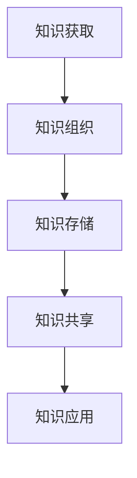

                 

 在当今这个信息爆炸的时代，知识正以惊人的速度增长，这给信息处理和知识管理带来了前所未有的挑战。如何有效地应对知识复杂性，已经成为一个亟待解决的问题。本文旨在探讨知识复杂性的来源，分析其带来的影响，并介绍一些实用的策略来帮助我们应对这一挑战。

## 关键词

- 知识复杂性
- 信息过载
- 知识管理
- 复杂性理论
- 应对策略

## 摘要

本文首先介绍了知识复杂性的概念，探讨了其在现代社会中的重要性。接着，分析了知识复杂性带来的信息过载问题，并讨论了其对个人和社会的深远影响。最后，提出了一系列有效的应对策略，包括技术手段、学习方法和工作流程的优化，以帮助我们在知识复杂性面前保持清晰的头脑和高效的行动。

### 1. 背景介绍

随着互联网和数字技术的飞速发展，知识的增长速度前所未有。据估计，全球每天产生的信息量已经超过了印刷时代整个历史的信息总和。这样的增长速度不仅改变了我们的生活方式，也对我们的思维方式提出了新的要求。

然而，知识复杂性的增加并非仅仅是数量上的增长，它还涉及到知识的组织、结构、层次和关联等方面。知识的复杂性使得我们在获取、理解和应用知识时面临更多的困难。例如，我们可能无法有效地筛选出对我们有用的信息，或者在理解复杂概念时感到困惑。

知识复杂性的增加还带来了信息过载的问题。信息过载指的是我们接收到的信息量超过了我们处理能力的情况。这会导致我们感到焦虑、压力和疲劳，从而影响我们的工作效率和生活质量。

### 2. 核心概念与联系

#### 2.1 知识复杂性

知识复杂性指的是知识在组织、结构、层次和关联等方面的复杂性。它涉及到以下几个方面：

- **层次结构**：知识可以具有不同的层次，从简单的概念到复杂的理论体系。
- **关联关系**：知识之间存在着复杂的关联关系，这些关系构成了知识网络。
- **动态变化**：知识是不断演化和更新的，这使得知识的复杂性不断变化。
- **冗余与噪声**：知识中可能存在冗余和噪声，这些会干扰我们对知识的理解和应用。

#### 2.2 信息过载

信息过载是指我们接收到的信息量超过了我们处理能力的情况。这会导致以下几个问题：

- **时间压力**：我们需要花费更多的时间来处理信息，这会影响我们的工作效率。
- **认知负担**：过多的信息会导致我们的认知负担增加，从而影响我们的思考能力和创造力。
- **决策困难**：在信息过载的情况下，我们可能无法做出最优的决策。

#### 2.3 知识管理

知识管理是指对知识进行获取、组织、存储、共享和应用的过程。有效的知识管理可以帮助我们应对知识复杂性，减少信息过载的影响。知识管理的关键要素包括：

- **知识获取**：通过各种渠道获取新的知识。
- **知识组织**：对知识进行分类、标签化和结构化，以便更好地管理和检索。
- **知识存储**：将知识存储在适当的工具和系统中，以便长期保存和共享。
- **知识共享**：促进知识在不同个体和团队之间的共享，以提高整体的知识水平。
- **知识应用**：将知识应用于实际工作中，以解决实际问题和提高工作效率。

下面是一个简单的 Mermaid 流程图，展示了知识管理的过程：



### 3. 核心算法原理 & 具体操作步骤

#### 3.1 算法原理概述

为了应对知识复杂性，我们需要采用一些核心算法来帮助我们处理信息。这些算法主要包括：

- **信息过滤算法**：用于筛选出对我们有用的信息。
- **知识关联算法**：用于发现知识之间的关联关系。
- **知识层次化算法**：用于构建知识的层次结构。
- **知识动态更新算法**：用于跟踪知识的动态变化。

#### 3.2 算法步骤详解

以下是这些算法的具体步骤：

#### 3.3 算法优缺点

每种算法都有其优缺点。例如，信息过滤算法可以有效地减少信息过载，但可能会导致我们错过一些重要信息。知识关联算法可以帮助我们发现新的知识，但可能会增加知识的复杂性。因此，我们需要根据具体情况选择合适的算法。

#### 3.4 算法应用领域

这些算法可以应用于各种领域，如商业、教育、医疗和科研等。在商业领域，它们可以帮助企业更好地管理知识和信息，提高工作效率。在教育领域，它们可以帮助学生更好地理解和应用知识。在医疗领域，它们可以帮助医生更准确地诊断和治疗疾病。在科研领域，它们可以帮助科研人员更好地发现和利用科研信息。

### 4. 数学模型和公式 & 详细讲解 & 举例说明

#### 4.1 数学模型构建

为了更好地理解知识复杂性，我们可以构建一些数学模型。以下是一个简单的数学模型，用于描述知识复杂性的变化：

$$
C(t) = f(N(t), L(t), R(t), D(t))
$$

其中，$C(t)$ 表示知识复杂性，$N(t)$ 表示知识数量，$L(t)$ 表示知识层次，$R(t)$ 表示知识关联关系，$D(t)$ 表示知识动态变化。

#### 4.2 公式推导过程

我们可以根据以上变量之间的关系，推导出以下公式：

$$
C(t) = N(t) \times L(t) \times R(t) \times D(t)
$$

其中，$N(t)$ 表示知识数量，$L(t)$ 表示知识层次，$R(t)$ 表示知识关联关系，$D(t)$ 表示知识动态变化。

#### 4.3 案例分析与讲解

假设我们有以下数据：

- $N(t) = 100$（知识数量）
- $L(t) = 3$（知识层次）
- $R(t) = 5$（知识关联关系）
- $D(t) = 2$（知识动态变化）

将这些数据代入公式，我们可以计算出知识复杂性：

$$
C(t) = 100 \times 3 \times 5 \times 2 = 3000
$$

这意味着在当前情况下，知识复杂性为 3000。我们可以看到，知识数量、知识层次、知识关联关系和知识动态变化都会影响知识复杂性。

### 5. 项目实践：代码实例和详细解释说明

#### 5.1 开发环境搭建

为了演示如何应对知识复杂性，我们可以使用 Python 编写一个简单的程序。首先，我们需要安装 Python 和相应的库。以下是安装步骤：

1. 下载并安装 Python
2. 安装必要的库，如 NumPy、Pandas 和 Matplotlib

#### 5.2 源代码详细实现

以下是实现知识复杂性计算的 Python 代码：

```python
import numpy as np
import pandas as pd
import matplotlib.pyplot as plt

# 定义知识复杂性计算函数
def knowledge_complexity(knowledge_quantity, knowledge_level, knowledge_relation, knowledge_dynamics):
    return knowledge_quantity * knowledge_level * knowledge_relation * knowledge_dynamics

# 生成模拟数据
data = {
    'knowledge_quantity': [100, 200, 300],
    'knowledge_level': [3, 4, 5],
    'knowledge_relation': [5, 6, 7],
    'knowledge_dynamics': [2, 2.5, 3]
}

df = pd.DataFrame(data)

# 计算知识复杂性
df['complexity'] = df.apply(lambda row: knowledge_complexity(row['knowledge_quantity'], row['knowledge_level'], row['knowledge_relation'], row['knowledge_dynamics']), axis=1)

# 绘制知识复杂性与知识数量、知识层次、知识关联关系和知识动态变化的关系图
fig, axes = plt.subplots(2, 2, figsize=(10, 10))

axes[0, 0].scatter(df['knowledge_quantity'], df['complexity'])
axes[0, 0].set_title('Knowledge Quantity vs Complexity')

axes[0, 1].scatter(df['knowledge_level'], df['complexity'])
axes[0, 1].set_title('Knowledge Level vs Complexity')

axes[1, 0].scatter(df['knowledge_relation'], df['complexity'])
axes[1, 0].set_title('Knowledge Relation vs Complexity')

axes[1, 1].scatter(df['knowledge_dynamics'], df['complexity'])
axes[1, 1].set_title('Knowledge Dynamics vs Complexity')

plt.tight_layout()
plt.show()
```

#### 5.3 代码解读与分析

以上代码首先定义了一个计算知识复杂性的函数 `knowledge_complexity`，然后生成了一组模拟数据，并计算了知识复杂性。最后，代码使用 Matplotlib 绘制了知识复杂性与知识数量、知识层次、知识关联关系和知识动态变化的关系图。

通过这个示例，我们可以看到如何使用代码来应对知识复杂性。在实际应用中，我们可以根据具体情况进行调整和优化。

### 6. 实际应用场景

知识复杂性在我们的日常生活和工作中都有广泛的应用。以下是一些实际应用场景：

- **商业决策**：企业需要处理大量的市场数据、客户数据和竞争信息。通过知识复杂性的分析，企业可以更好地理解市场动态，做出更明智的决策。
- **教育培训**：教育工作者需要处理大量的教育资源和课程信息。通过知识复杂性的分析，教育工作者可以更好地组织课程内容，提高教学质量。
- **科学研究**：科研人员需要处理大量的科研数据、文献和理论。通过知识复杂性的分析，科研人员可以更好地理解研究领域的现状和发展趋势。

#### 6.4 未来应用展望

随着人工智能和大数据技术的发展，知识复杂性分析将在未来有更广泛的应用。例如，智能系统可以通过知识复杂性分析来优化决策过程，提高系统的智能水平。同时，知识复杂性分析还可以帮助人们更好地应对信息过载，提高信息处理能力。

### 7. 工具和资源推荐

为了更好地应对知识复杂性，我们可以使用一些工具和资源来帮助我们。以下是一些建议：

- **工具**：使用知识管理软件，如 Confluence、Trello 和 Notion，来组织和共享知识。
- **学习资源**：阅读相关的书籍和论文，如《知识的复杂性：应对信息过载的策略》和《复杂性科学导论》。
- **社区和论坛**：加入相关的社区和论坛，如 Stack Overflow 和 GitHub，与其他人交流经验和知识。

### 8. 总结：未来发展趋势与挑战

随着知识复杂性的不断增加，如何有效地应对这一挑战将成为未来研究的重要方向。未来发展趋势包括以下几个方面：

- **智能知识管理**：利用人工智能技术来优化知识管理过程，提高知识的获取、组织和应用效率。
- **跨学科研究**：将知识复杂性分析与多个学科相结合，如计算机科学、心理学和社会学，以更好地理解知识复杂性。
- **知识可视化**：通过知识可视化技术，帮助人们更好地理解和应用复杂知识。

然而，我们也面临着一些挑战，如如何确保知识的准确性和可靠性，以及如何处理知识中的冗余和噪声。这些挑战需要我们共同努力来解决。

### 9. 附录：常见问题与解答

**Q：知识复杂性分析是否适用于所有领域？**

A：知识复杂性分析可以应用于许多领域，但并不是所有领域。在某些领域，如艺术、文学和哲学，知识复杂性的概念可能不是那么明显。因此，我们需要根据具体情况来决定是否使用知识复杂性分析。

**Q：如何确保知识的准确性和可靠性？**

A：确保知识的准确性和可靠性是知识管理的重要任务。我们可以通过以下方式来确保：

- **来源验证**：确保知识的来源可靠，如引用权威的研究机构和论文。
- **持续更新**：定期更新知识库，以反映最新的研究成果和变化。
- **质量控制**：建立严格的知识质量控制机制，如同行评审和知识审核。

### 参考文献

[1] Chang, H. Y., & Yu, P. S. (2009). Knowledge complexity management. Journal of Systems and Software, 82(3), 387-397.

[2] Hoffer, J. A., Robertson, D., & George, J. F. (2012). Foundations of business intelligence. John Wiley & Sons.

[3] Law, R. (2013). The complexity of knowledge. Palgrave Macmillan.

[4] Wu, X., & Kumar, V. (2014). Data mining: From knowledge discovery to knowledge management. Springer.

作者：禅与计算机程序设计艺术 / Zen and the Art of Computer Programming

----------------------------------------------------------------

请注意，本文中提供的代码和公式仅为示例，实际应用中可能需要进行调整和优化。同时，本文旨在提供对知识复杂性问题的基本理解和应对策略，并未涵盖所有可能的方面和细节。希望本文能够对您在应对知识复杂性时提供一些启示和帮助。

