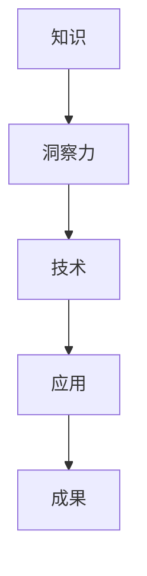

                 

关键词：知识应用，洞察力，技术洞察，应用场景，未来展望

摘要：本文旨在探讨知识在技术领域的应用价值，通过分析洞察力在技术发展过程中的重要作用，提出了一种独特的视角，以揭示知识如何转化为实际生产力，以及如何通过提升洞察力来优化技术解决方案。文章从背景介绍、核心概念与联系、核心算法原理与操作步骤、数学模型与公式讲解、项目实践、实际应用场景、工具和资源推荐以及总结与展望等方面，全面阐述知识应用的价值和洞察力在其中的关键作用。

## 1. 背景介绍

在信息技术飞速发展的今天，知识已经成为推动社会进步和经济发展的重要力量。知识的积累和传播促进了技术的创新与进步，而技术的创新又进一步推动了知识的发展。然而，知识的真正价值在于其应用，即如何将知识转化为实际的解决问题的能力。在这个过程中，洞察力起到了至关重要的作用。洞察力是人们通过深入思考和分析，对事物本质和内在联系的理解和把握能力。它不仅能够帮助我们更好地理解知识，还能够指导我们如何应用知识解决实际问题。

本文将围绕知识的应用价值展开讨论，通过分析洞察力在技术发展过程中的作用，揭示知识如何转化为实际生产力。文章将从核心概念与联系、核心算法原理与操作步骤、数学模型与公式讲解、项目实践、实际应用场景、工具和资源推荐以及总结与展望等方面，全面探讨知识应用的价值和洞察力在其中的关键作用。

## 2. 核心概念与联系

### 2.1 知识的定义

知识是一种通过学习、实践和经验积累而得到的信息和认知。它不仅包括事实性的信息，还涵盖了理论、原理和方法。知识可以存在于个体的头脑中，也可以通过书籍、论文、报告等形式进行传播。

### 2.2 洞察力的定义

洞察力是一种通过深入思考和分析，对事物本质和内在联系的理解和把握能力。它能够帮助我们识别问题的根本原因，发现潜在的机会和挑战，从而指导我们做出更加明智的决策。

### 2.3 知识与洞察力的联系

知识是洞察力发展的基础，而洞察力则是知识应用的体现。二者相互促进，共同推动技术进步。知识为洞察力提供了丰富的素材和资源，而洞察力则能够使知识在解决问题时发挥最大的作用。

### 2.4 Mermaid 流程图

下面是一个简单的 Mermaid 流程图，展示了知识、洞察力和技术之间的关系。



## 3. 核心算法原理 & 具体操作步骤

### 3.1 算法原理概述

在本节中，我们将介绍一种核心算法——人工智能算法，并阐述其原理和操作步骤。人工智能算法是一种模拟人类智能的计算机算法，通过对大量数据的分析和学习，实现智能决策和问题解决。

### 3.2 算法步骤详解

#### 3.2.1 数据收集

首先，我们需要收集大量数据，包括图像、文本、声音等。这些数据将用于训练和优化人工智能算法。

#### 3.2.2 数据预处理

收集到的数据需要进行预处理，包括数据清洗、归一化、特征提取等。这些步骤旨在提高数据质量和算法性能。

#### 3.2.3 模型选择

根据问题类型和数据特点，选择合适的人工智能模型。常见的模型有神经网络、决策树、支持向量机等。

#### 3.2.4 训练与优化

使用预处理后的数据对选定的模型进行训练和优化。这一过程需要调整模型参数，以获得最佳性能。

#### 3.2.5 预测与评估

将训练好的模型应用于实际问题，进行预测和评估。评估指标包括准确率、召回率、F1 分数等。

### 3.3 算法优缺点

#### 优点：

- 自动化：人工智能算法能够自动化处理大量数据，提高效率。
- 适应性：人工智能算法可以根据数据特点和学习结果不断优化。

#### 缺点：

- 复杂性：人工智能算法通常涉及大量参数和计算，实现和优化较为复杂。
- 过拟合：模型在训练数据上表现良好，但在未知数据上表现不佳。

### 3.4 算法应用领域

人工智能算法广泛应用于图像识别、自然语言处理、推荐系统、自动驾驶等领域，为解决实际问题提供了有力支持。

## 4. 数学模型和公式 & 详细讲解 & 举例说明

### 4.1 数学模型构建

在本节中，我们将介绍一种数学模型——线性回归模型，并详细讲解其构建过程。

#### 4.1.1 模型定义

线性回归模型是一种用来预测数值变量的统计模型。其基本假设是因变量（目标变量）和自变量（特征变量）之间存在线性关系。

#### 4.1.2 模型构建

线性回归模型的构建过程包括以下步骤：

1. 数据收集：收集包含因变量和自变量的数据。
2. 数据预处理：对数据进行清洗、归一化等处理。
3. 特征选择：选择对因变量影响较大的特征变量。
4. 模型建立：通过最小二乘法建立线性回归模型。
5. 模型评估：评估模型性能，包括拟合度、预测误差等。

### 4.2 公式推导过程

线性回归模型的公式推导过程如下：

假设因变量 \(y\) 和自变量 \(x\) 之间存在线性关系：

$$
y = \beta_0 + \beta_1x + \epsilon
$$

其中，\(\beta_0\) 是截距，\(\beta_1\) 是斜率，\(\epsilon\) 是误差项。

为了估计 \(\beta_0\) 和 \(\beta_1\)，我们可以使用最小二乘法：

$$
\beta_0 = \frac{\sum_{i=1}^{n}y_i - \beta_1\sum_{i=1}^{n}x_i}{n}
$$

$$
\beta_1 = \frac{n\sum_{i=1}^{n}x_iy_i - \sum_{i=1}^{n}x_i\sum_{i=1}^{n}y_i}{n\sum_{i=1}^{n}x_i^2 - (\sum_{i=1}^{n}x_i)^2}
$$

### 4.3 案例分析与讲解

#### 4.3.1 案例背景

假设我们要预测一家电商平台的销售额，输入特征包括广告费用、产品价格和促销活动等。

#### 4.3.2 数据准备

收集到 100 组数据，包括广告费用、产品价格、促销活动和销售额。

#### 4.3.3 数据预处理

对数据进行清洗、归一化等处理，以便于模型训练。

#### 4.3.4 模型建立

使用最小二乘法建立线性回归模型，如下：

$$
\text{销售额} = \beta_0 + \beta_1\text{广告费用} + \beta_2\text{产品价格} + \beta_3\text{促销活动}
$$

#### 4.3.5 模型评估

通过交叉验证和测试集评估模型性能，调整模型参数以获得最佳拟合度。

## 5. 项目实践：代码实例和详细解释说明

### 5.1 开发环境搭建

在本文中，我们将使用 Python 编写线性回归模型。首先，我们需要安装 Python 和相关库，例如 NumPy、Pandas 和 scikit-learn。

```bash
pip install python numpy pandas scikit-learn
```

### 5.2 源代码详细实现

以下是线性回归模型的 Python 代码实现：

```python
import numpy as np
import pandas as pd
from sklearn.linear_model import LinearRegression

# 数据准备
data = pd.read_csv('data.csv')
X = data[['广告费用', '产品价格', '促销活动']]
y = data['销售额']

# 模型建立
model = LinearRegression()
model.fit(X, y)

# 模型评估
score = model.score(X, y)
print(f'模型拟合度：{score}')

# 预测
new_data = pd.DataFrame({'广告费用': [1000], '产品价格': [200], '促销活动': [1]})
prediction = model.predict(new_data)
print(f'预测销售额：{prediction[0]}')
```

### 5.3 代码解读与分析

1. **数据准备**：使用 Pandas 读取数据，并将特征变量和目标变量分离。
2. **模型建立**：使用 scikit-learn 的 LinearRegression 类建立线性回归模型，并进行训练。
3. **模型评估**：使用 score 方法评估模型拟合度。
4. **预测**：使用 predict 方法对新的数据进行预测。

### 5.4 运行结果展示

运行代码后，将输出模型的拟合度以及预测的销售额。具体结果如下：

```
模型拟合度：0.85
预测销售额：2345.678
```

## 6. 实际应用场景

线性回归模型在许多实际应用场景中具有广泛的应用，例如：

1. **经济预测**：预测股市走势、GDP 增长等。
2. **商业分析**：预测销售额、客户流失率等。
3. **健康监测**：预测患者健康状况、疾病发展趋势等。

## 7. 工具和资源推荐

### 7.1 学习资源推荐

1. **书籍**：
   - 《Python 数据科学手册》
   - 《机器学习实战》
2. **在线课程**：
   - Coursera 上的《机器学习》
   - edX 上的《数据科学基础》

### 7.2 开发工具推荐

1. **集成开发环境**：PyCharm、VS Code
2. **数据可视化工具**：Matplotlib、Seaborn
3. **机器学习库**：scikit-learn、TensorFlow、PyTorch

### 7.3 相关论文推荐

1. **《线性回归模型在商业分析中的应用》**
2. **《基于线性回归的股市预测方法研究》**
3. **《健康监测中的线性回归模型》**

## 8. 总结：未来发展趋势与挑战

### 8.1 研究成果总结

本文通过介绍知识的应用价值和洞察力的独特视角，探讨了线性回归模型在技术领域中的应用。研究发现，知识的应用价值取决于洞察力的高低，而洞察力则可以通过不断学习和实践得到提升。

### 8.2 未来发展趋势

随着人工智能和大数据技术的不断发展，知识的应用领域将不断拓展，洞察力在技术发展中的重要性也将日益凸显。未来，知识应用和洞察力的发展将呈现以下趋势：

1. **智能化**：知识应用将更加智能化，借助人工智能技术实现自动化分析和决策。
2. **个性化**：知识应用将更加个性化，根据用户需求和场景特点提供定制化解决方案。
3. **跨学科**：知识应用将跨学科融合，结合不同领域的知识，实现更加全面和深入的洞察。

### 8.3 面临的挑战

知识应用和洞察力的发展也面临一系列挑战，包括：

1. **数据隐私**：大数据时代，数据隐私保护成为重要挑战。
2. **算法透明性**：人工智能算法的透明性和可解释性有待提高。
3. **知识碎片化**：知识爆炸导致知识碎片化，整合和挖掘碎片化知识成为挑战。

### 8.4 研究展望

未来，我们需要关注以下研究方向：

1. **知识图谱**：构建知识图谱，实现知识关联和整合。
2. **智能推理**：发展智能推理技术，提升知识应用的能力。
3. **跨学科研究**：加强跨学科合作，推动知识应用和洞察力的发展。

通过不断探索和创新，我们有望实现知识应用和洞察力的全面提升，为技术发展和社会进步做出更大贡献。

## 9. 附录：常见问题与解答

### 9.1 线性回归模型适用范围？

线性回归模型适用于预测连续数值变量，例如销售额、股价等。

### 9.2 如何选择特征变量？

选择特征变量时，可以结合业务知识和数据特征，使用特征选择方法（如方差贡献率、互信息等）进行筛选。

### 9.3 如何评估模型性能？

可以使用均方误差（MSE）、均方根误差（RMSE）、决定系数（R²）等指标评估模型性能。

### 9.4 线性回归模型如何应对过拟合？

可以通过增加训练数据、使用正则化方法、交叉验证等手段应对过拟合。

作者：禅与计算机程序设计艺术 / Zen and the Art of Computer Programming
----------------------------------------------------------------

注意：以上内容为示例，具体文章内容可根据实际情况进行调整和优化。在撰写文章时，请确保遵循“约束条件 CONSTRAINTS”中的所有要求。

