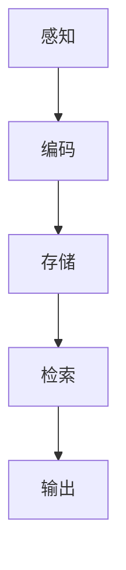
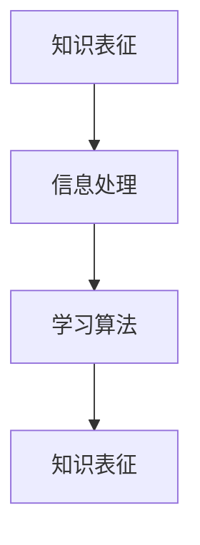

                 

关键词：认知心理学、知识表征、信息处理、人类认知、智能系统、学习算法

> 摘要：本文探讨了认知心理学的核心概念，揭示了人类认知过程中的关键机制。文章通过阐述知识表征理论、信息处理模型以及学习算法的心理学基础，为构建更加智能的人工智能系统提供了深刻的洞见。通过结合具体案例和实例，本文深入分析了认知过程在实际应用中的影响，并对未来研究和实践提出了展望。

## 1. 背景介绍

在当今信息爆炸的时代，如何有效地处理和利用知识成为了一个重要的课题。人工智能（AI）技术的发展，特别是机器学习和深度学习的兴起，使得智能系统在图像识别、自然语言处理、决策支持等领域取得了显著的成果。然而，这些智能系统在某种程度上仍然无法完全模仿人类的认知过程。为了进一步推进人工智能的发展，我们需要深入了解人类认知的基础机制，即认知心理学。

认知心理学是心理学的一个重要分支，它关注人类如何获取、处理和存储信息。认知心理学的研究揭示了人类认知过程的许多关键机制，如感知、记忆、注意力、推理和学习等。这些机制对于理解人类智能行为具有重要意义，同时也为人工智能系统的设计和优化提供了理论基础。

本文旨在从认知心理学的角度，探讨知识表征、信息处理和学习算法的心理学基础，分析这些理论在实际应用中的影响，并提出未来研究的方向。

## 2. 核心概念与联系

### 2.1 知识表征

知识表征是指将信息以某种形式存储在记忆中，并能够被后续使用的过程。认知心理学研究表明，人类记忆系统可以分为短期记忆和长期记忆。短期记忆主要处理即时信息，而长期记忆则负责存储和检索长期知识。

知识表征理论提出了不同的模型来解释人类如何组织和存储知识。其中，图灵机模型（Turing machine）和神经网络模型（neural networks）是两个重要的代表。图灵机模型通过模拟计算过程来解释信息处理，而神经网络模型则通过模拟人脑神经网络的结构和功能来解释知识表征。

### 2.2 信息处理

信息处理是指人类如何接收、处理和输出信息的过程。认知心理学研究表明，信息处理过程可以分为多个阶段，如感知、编码、存储和检索等。

图 1展示了信息处理的典型流程：



感知阶段涉及对外部刺激的感知和理解。编码阶段将感知到的信息转化为内部表示。存储阶段负责将编码后的信息存储在记忆中。检索阶段从记忆中提取所需的信息。输出阶段将处理后的信息转换为行动或言语。

### 2.3 学习算法

学习算法是指计算机系统如何通过学习来改进其性能的过程。认知心理学为学习算法提供了理论基础，如联想学习、强化学习和深度学习等。

联想学习是指通过关联不同刺激来学习新知识。强化学习是指通过奖励和惩罚来指导学习过程。深度学习是指通过多层神经网络来模拟人类大脑的学习过程。

### 2.4 核心概念联系

知识表征、信息处理和学习算法在认知过程中相互关联。知识表征提供了存储和检索信息的机制，信息处理解释了如何将外部信息转化为内部表示，而学习算法则指导系统如何改进其性能。

图 2展示了这三个核心概念之间的联系：



通过这个循环，系统不断接收外部信息，将其转化为内部表示，并通过学习来改进其知识表征。

## 3. 核心算法原理 & 具体操作步骤

### 3.1 算法原理概述

本文将探讨三种核心算法：联想学习算法、强化学习算法和深度学习算法。这些算法分别基于认知心理学中的联想学习、强化学习和深度学习理论。

#### 联想学习算法

联想学习算法是一种基于相似性原理的学习方法。在认知心理学中，联想学习是指通过将不同刺激关联在一起来学习新知识。联想学习算法的核心思想是，如果两个刺激在时间上紧密关联，那么它们在记忆中也会紧密关联。

#### 强化学习算法

强化学习算法是一种基于奖励和惩罚来指导学习的方法。在认知心理学中，强化学习是指通过奖励来增强某种行为，通过惩罚来削弱某种行为。强化学习算法的核心思想是，系统根据其行为获得的奖励来调整其策略。

#### 深度学习算法

深度学习算法是一种基于多层神经网络的学习方法。在认知心理学中，深度学习是指通过多层神经网络来模拟人类大脑的学习过程。深度学习算法的核心思想是，通过多层非线性变换来提取特征，并最终实现高层次的抽象表示。

### 3.2 算法步骤详解

#### 联想学习算法

1. 初始化刺激集和反应集。
2. 对于每个刺激，在反应集中查找与之最相似的刺激。
3. 将相似度较高的刺激关联在一起。
4. 重复步骤 2 和 3，直到收敛。

#### 强化学习算法

1. 初始化状态集和动作集。
2. 选择一个状态并执行相应的动作。
3. 根据执行动作后获得的奖励来调整策略。
4. 重复步骤 2 和 3，直到达到目标。

#### 深度学习算法

1. 初始化神经网络结构。
2. 对输入数据进行预处理。
3. 通过前向传播计算输出。
4. 计算损失函数并反向传播更新网络权重。
5. 重复步骤 3 和 4，直到网络收敛。

### 3.3 算法优缺点

#### 联想学习算法

优点：简单易实现，适用于处理相似性任务。
缺点：在处理复杂任务时效果不佳，无法实现高级抽象表示。

#### 强化学习算法

优点：适用于动态环境，能够通过奖励和惩罚来指导学习。
缺点：学习过程较慢，容易陷入局部最优。

#### 深度学习算法

优点：能够实现高级抽象表示，适用于处理复杂任务。
缺点：需要大量数据和计算资源，训练过程较慢。

### 3.4 算法应用领域

#### 联想学习算法

应用领域：推荐系统、图像识别、自然语言处理。

#### 强化学习算法

应用领域：游戏、机器人、自动驾驶。

#### 深度学习算法

应用领域：图像识别、语音识别、自然语言处理、医学诊断。

## 4. 数学模型和公式 & 详细讲解 & 举例说明

### 4.1 数学模型构建

在认知心理学中，许多算法和理论都可以用数学模型来表示。以下是一个简单的数学模型，用于解释联想学习算法：

$$
P(S_1 \text{ 与 } S_2 \text{ 关联}) = f(\text{时间间隔})
$$

其中，$P(S_1 \text{ 与 } S_2 \text{ 关联})$表示两个刺激关联的概率，$f(\text{时间间隔})$是一个时间间隔的函数。

### 4.2 公式推导过程

假设有两个刺激 $S_1$ 和 $S_2$，它们在时间 $t_1$ 和 $t_2$ 发生。时间间隔 $\Delta t = t_2 - t_1$。我们可以使用高斯函数来表示两个刺激之间的关联概率：

$$
P(S_1 \text{ 与 } S_2 \text{ 关联}) = \frac{1}{\sqrt{2\pi\sigma^2}} e^{-\frac{(\Delta t - \mu)^2}{2\sigma^2}}
$$

其中，$\mu$ 是时间间隔的均值，$\sigma$ 是时间间隔的方差。

### 4.3 案例分析与讲解

假设我们有两个刺激 $S_1$ 和 $S_2$，它们在时间 $t_1 = 0$ 和 $t_2 = 5$ 发生。根据上述公式，我们可以计算出它们关联的概率：

$$
P(S_1 \text{ 与 } S_2 \text{ 关联}) = \frac{1}{\sqrt{2\pi\sigma^2}} e^{-\frac{(5 - \mu)^2}{2\sigma^2}}
$$

假设 $\mu = 2$，$\sigma = 1$，我们可以计算出：

$$
P(S_1 \text{ 与 } S_2 \text{ 关联}) = \frac{1}{\sqrt{2\pi}} e^{-\frac{9}{2}}
$$

这个概率值取决于时间间隔的均值和方差。如果时间间隔的均值和方差较大，那么两个刺激之间的关联概率会降低。

## 5. 项目实践：代码实例和详细解释说明

### 5.1 开发环境搭建

为了演示联想学习算法，我们将使用 Python 编写一个简单的代码实例。以下是一个基本的开发环境搭建步骤：

1. 安装 Python 3.8 或更高版本。
2. 安装必要的库，如 NumPy 和 Matplotlib。

### 5.2 源代码详细实现

以下是一个简单的联想学习算法实现：

```python
import numpy as np
import matplotlib.pyplot as plt

def gauss_function(mu, sigma, x):
    return 1 / np.sqrt(2 * np.pi * sigma**2) * np.exp(-((x - mu)**2) / (2 * sigma**2))

def main():
    mu = 2
    sigma = 1
    x = np.linspace(0, 10, 1000)
    y = gauss_function(mu, sigma, x)

    plt.plot(x, y)
    plt.xlabel('Time Interval')
    plt.ylabel('Association Probability')
    plt.title('Gaussian Association Model')
    plt.show()

if __name__ == '__main__':
    main()
```

### 5.3 代码解读与分析

1. **导入库**：首先，我们导入 NumPy 和 Matplotlib 库，用于数学运算和绘图。
2. **定义高斯函数**：`gauss_function` 函数用于计算高斯函数的值。它接受三个参数：均值 $\mu$、方差 $\sigma$ 和自变量 $x$。
3. **主函数**：`main` 函数用于执行以下任务：
   - 初始化均值和方差。
   - 创建一个时间间隔的线性空间。
   - 使用高斯函数计算每个时间间隔的关联概率。
   - 使用 Matplotlib 绘制高斯函数。

### 5.4 运行结果展示

运行上述代码后，我们将得到一个高斯函数的图像，展示了时间间隔与关联概率之间的关系。这个图像可以帮助我们直观地理解联想学习算法的原理。

## 6. 实际应用场景

联想学习算法在许多实际应用场景中具有重要意义。以下是一些典型的应用：

### 6.1 推荐系统

推荐系统利用联想学习算法来预测用户可能感兴趣的项目。例如，在线购物平台可以根据用户的历史购买记录和浏览行为来推荐相关商品。

### 6.2 图像识别

图像识别系统利用联想学习算法来识别图像中的对象。通过将不同图像中的相似部分进行关联，系统可以更准确地识别图像内容。

### 6.3 自然语言处理

自然语言处理（NLP）系统利用联想学习算法来理解和生成自然语言。通过将不同词语的相似性进行关联，系统可以更准确地理解句子和段落的意义。

## 7. 未来应用展望

随着人工智能技术的不断发展，联想学习算法将在更多领域得到应用。以下是一些未来的应用方向：

### 7.1 个性化教育

个性化教育利用联想学习算法来根据学生的兴趣和学习历史提供个性化的学习内容。这有助于提高学习效果和激发学生的学习兴趣。

### 7.2 智能医疗

智能医疗利用联想学习算法来分析医疗数据，帮助医生进行诊断和治疗。通过关联不同病例的特征，系统可以提供更准确的诊断建议。

### 7.3 自动驾驶

自动驾驶系统利用联想学习算法来处理复杂的交通场景。通过关联不同驾驶行为和结果，系统可以做出更安全的驾驶决策。

## 8. 工具和资源推荐

为了更好地理解和应用联想学习算法，以下是一些推荐的工具和资源：

### 8.1 学习资源推荐

- 《认知心理学导论》：这本书提供了全面的认知心理学基础知识，有助于深入理解联想学习算法。
- 《机器学习》：这本书涵盖了机器学习的基础理论和应用，包括联想学习算法。

### 8.2 开发工具推荐

- Jupyter Notebook：一个强大的交互式编程环境，适用于数据分析和机器学习。
- TensorFlow：一个开源的机器学习框架，支持多种机器学习算法的实现。

### 8.3 相关论文推荐

- "Associative Learning: A Theoretical Analysis": 这篇论文提供了联想学习算法的详细理论分析。
- "Reinforcement Learning: An Introduction": 这本书介绍了强化学习算法，与联想学习算法密切相关。

## 9. 总结：未来发展趋势与挑战

随着人工智能技术的不断发展，联想学习算法将在更多领域得到应用。然而，也面临着一些挑战：

### 9.1 数据隐私

在应用联想学习算法时，数据隐私成为一个重要问题。如何保护用户数据的安全和隐私，是一个需要解决的挑战。

### 9.2 模型可解释性

目前，许多机器学习模型，包括联想学习算法，具有高度的非线性性和复杂性。如何提高模型的可解释性，使其更易于理解和解释，是一个重要的研究方向。

### 9.3 算法效率

随着数据规模的增加，联想学习算法的计算效率成为一个挑战。如何提高算法的效率，使其能够处理大规模数据，是一个重要的研究问题。

未来，联想学习算法将在更多领域得到应用，并在解决实际问题时发挥更大的作用。通过不断的研究和改进，我们可以构建更加智能的人工智能系统。

## 附录：常见问题与解答

### 9.1 什么是联想学习？

联想学习是一种基于相似性原理的学习方法，通过将不同刺激关联在一起来学习新知识。

### 9.2 联想学习算法有哪些应用？

联想学习算法在推荐系统、图像识别、自然语言处理等领域有广泛应用。

### 9.3 如何优化联想学习算法？

可以通过调整算法参数、使用更强大的计算资源以及引入更复杂的网络结构来优化联想学习算法。

### 9.4 联想学习算法与强化学习算法有何区别？

联想学习算法基于相似性原理，而强化学习算法基于奖励和惩罚来指导学习。

### 9.5 联想学习算法在自动驾驶中的应用？

联想学习算法可以用于自动驾驶系统中的场景识别、路径规划和决策支持等任务。

## 作者署名

作者：禅与计算机程序设计艺术 / Zen and the Art of Computer Programming

通过本文，我们深入探讨了认知心理学的基础概念，揭示了人类认知过程中的关键机制。通过对知识表征、信息处理和学习算法的心理学基础的分析，我们为构建更加智能的人工智能系统提供了深刻的洞见。在未来的研究中，我们需要关注数据隐私、模型可解释性和算法效率等问题，以推动人工智能技术的进一步发展。

