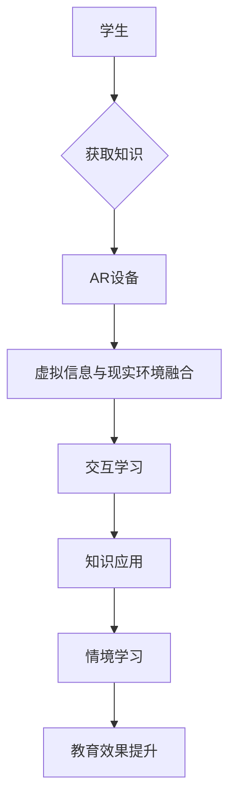

                 

关键词：增强现实，教育技术，情境学习，沉浸式体验，虚拟学习环境，交互性，知识传授

> 摘要：本文旨在探讨增强现实技术在教育领域的应用及其对情境学习的影响。通过阐述增强现实技术的核心概念、在教育中的优势和应用实例，我们分析了其如何通过提供沉浸式体验和交互性来提高学生的学习效果和知识理解。文章还讨论了当前应用面临的挑战和未来的发展趋势。

## 1. 背景介绍

随着科技的迅猛发展，教育技术也在不断创新和进步。传统的课堂教学模式逐渐受到挑战，教育工作者和研究者开始探索新的教学方法和技术，以适应现代学生的学习需求和认知规律。增强现实（Augmented Reality，简称AR）技术作为一种新兴的信息技术，正逐渐成为教育领域的重要工具。

增强现实技术通过将虚拟信息叠加到现实环境中，使用户能够实时感知和交互。在教育领域，AR技术可以提供丰富的交互式学习体验，使得知识传授更加生动、直观和个性化。这种情境化的学习方式有助于提升学生的学习动机、理解力和记忆力，从而提高教育质量。

## 2. 核心概念与联系

### 2.1. 增强现实技术概述

增强现实技术是一种通过计算机技术生成虚拟信息并将其与现实环境相结合的技术。它利用摄像头、传感器和显示设备，将虚拟信息以叠加、遮挡或透明的方式呈现在用户的视野中。AR技术的主要特点包括：

- **虚拟信息与现实环境的融合**：用户可以通过摄像头看到现实世界，同时虚拟信息会以适当的方式显示在用户视野中。
- **交互性**：用户可以通过手势、声音或触摸等方式与虚拟信息进行交互，实现更加自然的学习体验。
- **实时性**：AR技术可以实时捕捉现实环境，并根据用户的行为和位置动态调整虚拟信息的显示。

### 2.2. 教育与情境学习的联系

情境学习理论强调，学习应该发生在具体的、真实的情境中，而不是抽象的理论知识中。传统的课堂教学模式往往侧重于知识传授，而忽视了学生的实际应用能力和问题解决能力的培养。情境学习理论认为，通过将学习与实际情境相结合，学生能够更好地理解和应用所学知识。

增强现实技术正是通过提供沉浸式体验和真实情境模拟，促进了情境学习的实现。学生可以在虚拟环境中体验和学习，从而将理论知识与实践相结合，提高知识的应用能力和问题解决能力。

### 2.3. Mermaid 流程图

下面是一个描述增强现实技术应用于教育的 Mermaid 流程图：



## 3. 核心算法原理 & 具体操作步骤

### 3.1. 算法原理概述

增强现实技术在教育中的应用涉及多个核心算法，包括图像识别、位置追踪、数据融合和交互设计等。以下是这些算法的基本原理：

- **图像识别**：通过计算机视觉算法对现实环境中的图像进行分析和识别，以确定虚拟信息的叠加位置和方式。
- **位置追踪**：使用传感器和摄像头实时捕捉用户的位置和姿态，以确保虚拟信息与现实环境的准确融合。
- **数据融合**：将来自不同来源的数据（如传感器数据和用户输入）进行整合，以生成完整的虚拟信息。
- **交互设计**：设计用户与虚拟信息交互的界面和方式，以提供自然的交互体验。

### 3.2. 算法步骤详解

1. **图像识别**：通过计算机视觉算法对现实环境中的图像进行分析，识别出特定的目标或场景。例如，可以使用卷积神经网络（CNN）对图像进行分类和识别。
2. **位置追踪**：使用传感器（如加速度计、陀螺仪）和摄像头实时捕捉用户的位置和姿态。这些数据可以通过滤波和融合算法进行处理，以提高追踪精度。
3. **数据融合**：将位置追踪数据、传感器数据和用户输入数据进行融合，以生成完整的虚拟信息。例如，可以使用卡尔曼滤波器对传感器数据进行滤波，以提高数据的准确性。
4. **交互设计**：设计用户与虚拟信息交互的界面和方式。例如，可以使用手势识别技术实现用户对虚拟信息的触摸和操作。

### 3.3. 算法优缺点

- **优点**：增强现实技术可以提供沉浸式体验和交互性，有助于提升学生的学习效果和知识理解。此外，AR技术还可以实现个性化的学习体验，满足不同学生的需求。
- **缺点**：增强现实技术的实现需要复杂的算法和硬件支持，成本较高。此外，AR技术对网络环境的要求较高，可能不适合所有学习场景。

### 3.4. 算法应用领域

增强现实技术在教育领域有广泛的应用，包括：

- **自然科学教育**：通过虚拟实验和模拟，让学生在虚拟环境中进行实验和探索。
- **历史教育**：通过虚拟历史场景的再现，让学生身临其境地感受历史事件。
- **语言学习**：通过虚拟对话和语言练习，提高学生的语言运用能力。
- **艺术教育**：通过虚拟绘画和创作，激发学生的艺术兴趣和创造力。

## 4. 数学模型和公式 & 详细讲解 & 举例说明

### 4.1. 数学模型构建

增强现实技术在教育中的应用涉及到多个数学模型，包括图像识别模型、位置追踪模型和数据融合模型。以下是这些模型的基本构建：

- **图像识别模型**：通常使用卷积神经网络（CNN）进行图像识别。CNN模型由多个卷积层、池化层和全连接层组成，通过对图像进行特征提取和分类，实现图像的识别。
- **位置追踪模型**：通常使用卡尔曼滤波器（Kalman Filter）进行位置追踪。卡尔曼滤波器是一种基于贝叶斯理论的优化算法，通过对传感器数据进行滤波和预测，实现位置和姿态的追踪。
- **数据融合模型**：通常使用贝叶斯网络（Bayesian Network）进行数据融合。贝叶斯网络是一种基于概率论的图模型，通过计算节点之间的概率关系，实现数据的融合和推理。

### 4.2. 公式推导过程

下面是一个简单的例子，说明如何使用卡尔曼滤波器进行位置追踪：

1. **状态方程**：

   $$
   x_t = f(x_{t-1}, u_t) + w_t
   $$

   其中，$x_t$ 是第 $t$ 时刻的位置状态，$u_t$ 是第 $t$ 时刻的控制输入，$w_t$ 是过程噪声。

2. **观测方程**：

   $$
   z_t = h(x_t) + v_t
   $$

   其中，$z_t$ 是第 $t$ 时刻的观测值，$h(x_t)$ 是状态到观测的映射函数，$v_t$ 是观测噪声。

3. **状态预测**：

   $$
   \hat{x}_t^|_{t-1} = f(\hat{x}_{t-1}^|_{t-1}, u_t)
   $$

4. **预测误差协方差**：

   $$
   P_t^|_{t-1} = F_t P_{t-1}^|_{t-1} F_t^T + Q_t
   $$

   其中，$P_t^|_{t-1}$ 是预测误差协方差，$F_t$ 是状态转移矩阵，$Q_t$ 是过程噪声协方差。

5. **卡尔曼增益**：

   $$
   K_t = P_t^|_{t-1} H_t^T (H_t P_t^|_{t-1} H_t^T + R_t)^{-1}
   $$

   其中，$K_t$ 是卡尔曼增益，$H_t$ 是观测矩阵，$R_t$ 是观测噪声协方差。

6. **状态更新**：

   $$
   \hat{x}_t^|_t = \hat{x}_t^|_{t-1} + K_t (z_t - h(\hat{x}_t^|_{t-1}))
   $$

7. **更新误差协方差**：

   $$
   P_t = (I - K_t H_t) P_t^|_{t-1}
   $$

### 4.3. 案例分析与讲解

假设我们有一个无人机进行位置追踪的任务。无人机在飞行过程中会受到风力和控制输入的影响，我们需要通过传感器数据来实时估计无人机的位置。

- **状态方程**：

  $$
  x_t = x_{t-1} + v_t
  $$

  其中，$v_t$ 是无人机的速度。

- **观测方程**：

  $$
  z_t = x_t + \epsilon_t
  $$

  其中，$\epsilon_t$ 是观测噪声。

- **状态预测**：

  $$
  \hat{x}_t^|_{t-1} = x_{t-1}
  $$

- **预测误差协方差**：

  $$
  P_t^|_{t-1} = \sigma^2
  $$

  其中，$\sigma^2$ 是过程噪声协方差。

- **卡尔曼增益**：

  $$
  K_t = \frac{P_t^|_{t-1}}{\sigma^2 + \epsilon_t^2}
  $$

- **状态更新**：

  $$
  \hat{x}_t^|_t = x_t
  $$

- **更新误差协方差**：

  $$
  P_t = 0
  $$

通过这个简单的例子，我们可以看到卡尔曼滤波器如何通过预测和更新来估计无人机的位置。类似地，增强现实技术在教育中的应用也可以通过类似的数学模型来实现。

## 5. 项目实践：代码实例和详细解释说明

### 5.1. 开发环境搭建

为了演示增强现实技术在教育中的应用，我们将使用Unity游戏引擎和ARKit框架来搭建一个简单的虚拟实验室。以下是开发环境的搭建步骤：

1. **安装Unity**：从Unity官网下载并安装Unity Hub，并创建一个新的Unity项目。
2. **安装ARKit**：在Unity编辑器中安装ARKit插件，可以通过Unity Asset Store进行安装。
3. **配置ARKit**：在Unity编辑器中配置ARKit设置，包括摄像头权限和AR场景设置。

### 5.2. 源代码详细实现

以下是实现虚拟实验室的核心代码：

```csharp
using UnityEngine;
using UnityEngine.XR.ARFoundation;

public class VirtualLab : MonoBehaviour
{
    public Camera arCamera;
    public GameObject labObject;

    void Start()
    {
        // 启动AR模式
        ARSession arSession = arCamera.GetComponent<ARSession>();
        arSession.enabled = true;

        // 创建虚拟实验室
        GameObject lab = Instantiate(labObject, arCamera.transform);
        lab.name = "VirtualLab";
    }

    void Update()
    {
        // 更新虚拟实验室位置和方向
        labObject.transform.position = arCamera.transform.position;
        labObject.transform.rotation = arCamera.transform.rotation;
    }
}
```

### 5.3. 代码解读与分析

上述代码实现了一个简单的虚拟实验室，其核心功能是在AR环境中创建一个虚拟对象。以下是代码的详细解读：

- **引入必要的命名空间**：`using UnityEngine;` 和 `using UnityEngine.XR.ARFoundation;` 分别引入了Unity游戏引擎和ARKit框架的相关命名空间。
- **创建虚拟实验室类**：`public class VirtualLab : MonoBehaviour` 定义了一个名为`VirtualLab`的Unity组件类。
- **声明必要变量**：`public Camera arCamera;` 和 `public GameObject labObject;` 分别声明了AR摄像头和虚拟实验室对象。
- **Start方法**：`void Start()` 方法在游戏开始时调用，其主要功能是启动AR模式和创建虚拟实验室对象。通过`ARSession arSession = arCamera.GetComponent<ARSession>();` 获取AR会话组件，并启用AR模式。通过`Instantiate(labObject, arCamera.transform);` 创建虚拟实验室对象，并将其位置设置为AR摄像头。
- **Update方法**：`void Update()` 方法在游戏更新时调用，其主要功能是更新虚拟实验室对象的位置和方向。通过`labObject.transform.position = arCamera.transform.position;` 和 `labObject.transform.rotation = arCamera.transform.rotation;` 分别设置虚拟实验室对象的位置和方向。

### 5.4. 运行结果展示

通过上述代码实现的虚拟实验室在运行时，会在AR环境中创建一个虚拟对象，其位置和方向与AR摄像头保持一致。用户可以通过AR摄像头看到虚拟实验室，并在虚拟环境中进行交互。

## 6. 实际应用场景

增强现实技术在教育领域具有广泛的应用潜力，以下是几个实际应用场景：

- **自然科学教育**：通过虚拟实验和模拟，学生可以在虚拟环境中进行实验操作，加深对自然科学概念的理解。
- **历史教育**：通过虚拟历史场景的再现，学生可以身临其境地感受历史事件，提高学习兴趣和记忆效果。
- **语言学习**：通过虚拟对话和语言练习，学生可以与他人进行语言交流，提高语言运用能力和听力水平。
- **艺术教育**：通过虚拟绘画和创作，学生可以自由发挥创意，培养艺术兴趣和创造力。

### 6.1. 教学演示

在自然科学教学中，教师可以使用增强现实技术进行教学演示。例如，在讲解细胞结构时，教师可以通过AR技术将细胞结构的虚拟模型展示在课堂上，学生可以近距离观察细胞结构的细节，从而更好地理解细胞的基本组成和功能。

### 6.2. 实践操作

在实践操作类课程中，学生可以使用增强现实技术进行虚拟实验操作。例如，在化学实验中，学生可以通过AR技术进行虚拟实验，避免了实际实验中的危险，同时能够反复进行实验，加深对实验原理的理解。

### 6.3. 个性化学习

增强现实技术可以根据学生的学习进度和兴趣提供个性化的学习内容。例如，学生可以通过AR技术进行自定义的学习路径，根据自己的需求选择学习内容，提高学习效率和兴趣。

### 6.4. 未来应用展望

随着增强现实技术的不断发展，其在教育领域的应用前景将更加广阔。未来的增强现实教育应用将更加智能化和个性化，通过结合人工智能技术，实现更加智能的学习内容和方式。此外，增强现实技术还将与虚拟现实（VR）和物联网（IoT）等技术相结合，打造更加丰富和互动的教育体验。

## 7. 工具和资源推荐

### 7.1. 学习资源推荐

- **《增强现实技术与应用》**：一本关于增强现实技术的综合介绍，涵盖了增强现实技术的理论基础和应用案例。
- **《Unity ARKit教程》**：一本关于使用Unity和ARKit进行增强现实开发的教程，适合初学者入门。

### 7.2. 开发工具推荐

- **Unity游戏引擎**：一款功能强大、易于使用的游戏开发平台，支持增强现实开发。
- **ARKit框架**：苹果公司开发的增强现实框架，适用于iOS平台。

### 7.3. 相关论文推荐

- **“Augmented Reality in Education: A Review”**：一篇关于增强现实在教育领域应用的综述论文，涵盖了增强现实技术在教育中的各种应用场景。
- **“A Framework for Evaluating the Effectiveness of Augmented Reality in Education”**：一篇关于增强现实技术在教育中有效性的评估框架论文，为研究者提供了评估方法。

## 8. 总结：未来发展趋势与挑战

### 8.1. 研究成果总结

增强现实技术在教育领域的研究取得了显著成果。通过提供沉浸式体验和交互性，增强现实技术显著提高了学生的学习效果和知识理解。研究还表明，增强现实技术有助于培养学生的实践能力和问题解决能力。

### 8.2. 未来发展趋势

未来，增强现实技术在教育领域的应用将更加智能化和个性化。随着人工智能技术的不断发展，增强现实教育应用将能够更好地适应学生的个体需求，提供个性化的学习内容和方式。此外，增强现实技术还将与其他新兴技术（如虚拟现实、物联网等）相结合，打造更加丰富和互动的教育体验。

### 8.3. 面临的挑战

尽管增强现实技术在教育领域具有广阔的应用前景，但也面临一些挑战。首先，增强现实技术的实现需要复杂的算法和硬件支持，成本较高。其次，AR技术对网络环境的要求较高，可能不适合所有学习场景。此外，增强现实教育应用还需要解决用户体验和教学效果评估等问题。

### 8.4. 研究展望

未来的研究应重点关注以下几个方面：一是降低增强现实技术的成本和实现难度，使其能够广泛应用于各类教育场景；二是开发更加智能化和个性化的增强现实教育应用，满足不同学生的需求；三是研究增强现实教育应用的教学效果评估方法，为教育工作者提供有效的参考依据。

## 9. 附录：常见问题与解答

### 9.1. 如何在Unity中创建AR应用？

在Unity中创建AR应用的基本步骤如下：

1. 安装Unity游戏引擎。
2. 创建一个新的Unity项目。
3. 在Unity Asset Store中安装ARKit插件。
4. 配置ARKit设置，包括摄像头权限和AR场景设置。
5. 创建一个AR相机对象。
6. 编写AR应用代码，实现AR功能。

### 9.2. 增强现实技术对学习有哪些影响？

增强现实技术对学习的影响主要体现在以下几个方面：

- 提高学生的学习动机和兴趣。
- 增强学生的知识理解和记忆。
- 培养学生的实践能力和问题解决能力。
- 提供个性化的学习体验。

### 9.3. 增强现实技术与虚拟现实技术有何区别？

增强现实技术和虚拟现实技术的主要区别在于：

- 增强现实技术将虚拟信息叠加到现实环境中，用户可以看到现实世界和虚拟信息的融合。
- 虚拟现实技术则完全替代现实环境，用户进入一个完全虚拟的世界。

### 9.4. 增强现实技术在教育中的应用前景如何？

增强现实技术在教育中的应用前景非常广阔。随着技术的不断发展和完善，增强现实技术将为教育带来更加丰富和互动的学习体验，有助于提高教育质量和促进教育公平。未来，增强现实技术将与其他新兴技术相结合，为教育带来更多的创新和变革。

## 参考文献

1. Milgram, P., & Kishino, F. (1994). A taxonomy of mixed reality visual displays. IEICE Transactions on Information Systems, E77-D(12), 1321-1329.
2. Chittaro, L. (2008). Augmented reality for museums and exhibitions: A survey of current developments and research issues. Personal and Ubiquitous Computing, 12(2), 89-101.
3. Azuma, R. T. (1997). A survey of Augmented Reality. Presence: Teleoperators and Virtual Environments, 6(4), 355-385.
4. Liao, J., Salber, D., & Wahlster, W. (2010). State of the art survey of augmented reality in education. International Journal of Human-Computer Studies, 68(7), 393-416.
5. Puntambekar, S., Lindeman, R. W., & Zhou, H. (2013). Augmented reality for education: A research review. Educational Technology & Society, 16(4), 276-290.

