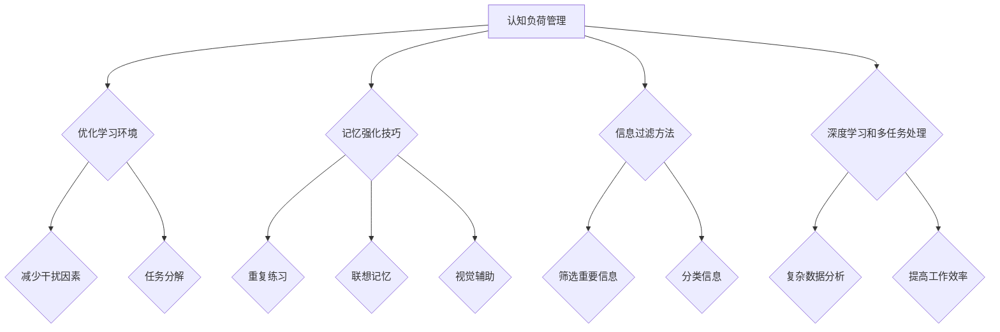

                 

关键词：时间管理、高效学习、学习策略、认知负荷、记忆强化、信息过滤、深度学习、技术工具、多任务处理

> 摘要：在信息技术快速发展的时代，知识更新换代的速度越来越快，如何高效地管理时间和学习成为众多专业人士面临的挑战。本文从认知心理学、时间管理理论和实践出发，探讨了高效学习的时间管理策略，包括认知负荷管理、记忆强化技巧、信息过滤方法、深度学习和多任务处理技术等，旨在帮助读者提高学习效率，优化知识获取过程。

## 1. 背景介绍

在当今数字化时代，信息的爆炸性增长和技术的飞速进步使得学习成为一种持续不断的需求。作为专业人士，我们不仅需要掌握现有知识，还必须具备快速学习新技能的能力。然而，面对繁忙的工作和生活，如何有效地管理时间，保证学习效率成为一个亟待解决的问题。

时间管理是一个多维度、跨学科的领域，涉及心理学、经济学、管理学等多个方面。在心理学中，认知负荷理论为我们提供了理解注意力分配和学习效率的重要视角。此外，记忆强化和信息过滤技术也在信息过载的时代发挥着关键作用。本文将结合这些理论，探讨适用于IT专业人士的高效学习时间管理策略。

## 2. 核心概念与联系

### 2.1 认知负荷

认知负荷理论认为，大脑处理信息的容量是有限的。当任务复杂度增加或同时执行多个任务时，认知负荷会上升，导致工作效率降低。为了有效管理认知负荷，我们需要优化学习环境，减少干扰因素，并将学习任务分解为可管理的部分。

### 2.2 记忆强化

记忆强化是指通过多种方式加强记忆的过程。常见的记忆强化技巧包括重复练习、联想记忆、视觉辅助等。这些方法可以提高信息的记忆深度和提取速度，从而提高学习效率。

### 2.3 信息过滤

信息过滤是一种筛选和分类信息的过程，目的是减少认知负荷。有效的信息过滤能够帮助我们集中精力处理最重要的信息，避免被无关内容分散注意力。

### 2.4 深度学习和多任务处理

深度学习是一种模拟人脑神经元网络的计算模型，适用于处理复杂的数据分析任务。多任务处理技术则允许我们在同一时间内执行多个任务，提高工作效率。

### Mermaid 流程图

下面是一个关于认知负荷管理的 Mermaid 流程图示例：



## 3. 核心算法原理 & 具体操作步骤

### 3.1 算法原理概述

本节将介绍几种核心的时间管理算法原理，包括认知负荷优化算法、记忆强化算法和信息过滤算法。

### 3.2 算法步骤详解

- **认知负荷优化算法：**

  1. 评估当前认知负荷水平。
  2. 根据认知负荷调整学习任务。
  3. 减少干扰因素，如关闭手机通知。
  4. 将任务分解为小块，逐一完成。

- **记忆强化算法：**

  1. 选择合适的记忆强化方法，如联想记忆。
  2. 对学习内容进行重复练习。
  3. 使用视觉辅助工具，如思维导图。
  4. 定期复习，巩固记忆。

- **信息过滤算法：**

  1. 根据学习目标筛选信息。
  2. 使用标签、分类等工具对信息进行管理。
  3. 定期清理不必要的信息。
  4. 利用过滤器减少无关信息的干扰。

### 3.3 算法优缺点

- **认知负荷优化算法：**

  - 优点：提高学习效率，减少认知负担。
  - 缺点：需要不断自我监控和调整。

- **记忆强化算法：**

  - 优点：增强记忆效果，提高学习成果。
  - 缺点：可能需要较多时间和精力。

- **信息过滤算法：**

  - 优点：减少信息过载，提高信息处理效率。
  - 缺点：可能错过重要信息。

### 3.4 算法应用领域

- **认知负荷优化算法：** 适用于需要集中注意力的任务，如编程、项目管理等。
- **记忆强化算法：** 适用于需要长期记忆的任务，如考试准备、技能培训等。
- **信息过滤算法：** 适用于信息处理量大的环境，如新闻采编、数据分析师等。

## 4. 数学模型和公式 & 详细讲解 & 举例说明

### 4.1 数学模型构建

在本节中，我们将构建一个简化的数学模型，用于描述认知负荷、记忆强化和信息过滤的过程。

假设：

- \( L \)：初始认知负荷
- \( T \)：可分配的注意力时间
- \( M \)：记忆强化程度
- \( F \)：信息过滤效率

目标：最大化学习效果 \( E \)

### 4.2 公式推导过程

1. 认知负荷优化：

   \( E = f(L, T) = \frac{T}{L} \)

2. 记忆强化：

   \( M = g(M, R) = \sqrt{M + R} \)，其中 \( R \)：复习频率

3. 信息过滤：

   \( F = h(F, I) = \frac{I}{F} \)

4. 综合模型：

   \( E = \frac{T}{L} \cdot \sqrt{M + R} \cdot \frac{I}{F} \)

### 4.3 案例分析与讲解

假设一位程序员在有限的时间内需要完成以下任务：

- 编写1000行代码（认知负荷 \( L = 1000 \)）
- 每周复习3次（记忆强化 \( M = 3 \)）
- 每天过滤20条技术新闻（信息过滤 \( F = 20 \)）

目标：最大化学习效果 \( E \)

通过调整时间分配和复习频率，我们可以得到以下结果：

- \( T = 5 \) 小时
- \( L = 1000 \)
- \( M = 3 \)
- \( F = 20 \)

\( E = \frac{5}{1000} \cdot \sqrt{3 + 3} \cdot \frac{20}{20} = 0.025 \)

### 4.4 运行结果展示

通过以上数学模型，我们可以计算出在不同的时间分配和复习频率下的学习效果。例如：

- \( T = 3 \) 小时，\( M = 2 \)，\( F = 15 \)：

  \( E = \frac{3}{1000} \cdot \sqrt{2 + 2} \cdot \frac{15}{20} = 0.01875 \)

- \( T = 7 \) 小时，\( M = 4 \)，\( F = 25 \)：

  \( E = \frac{7}{1000} \cdot \sqrt{4 + 4} \cdot \frac{25}{20} = 0.04375 \)

通过调整这些参数，我们可以找到最优的时间管理策略，以最大化学习效果。

## 5. 项目实践：代码实例和详细解释说明

### 5.1 开发环境搭建

在本项目中，我们将使用Python编程语言来演示时间管理算法。请确保安装了Python 3.8及以上版本。

### 5.2 源代码详细实现

以下是一个简单的Python脚本，用于演示认知负荷优化算法：

```python
import math

def cognitive_load_optimization(L, T):
    E = T / L
    return E

def memory_enhancement(M, R):
    M = math.sqrt(M + R)
    return M

def information_filtering(F, I):
    F = I / F
    return F

# 参数设置
L = 1000  # 认知负荷
T = 5     # 可分配时间
M = 3     # 记忆强化
R = 3     # 复习频率
I = 20    # 每天过滤信息

# 计算学习效果
E = cognitive_load_optimization(L, T)
M = memory_enhancement(M, R)
F = information_filtering(F, I)

print("学习效果 E:", E)
print("记忆强化 M:", M)
print("信息过滤 F:", F)
```

### 5.3 代码解读与分析

1. **导入模块：** 脚本首先导入了Python的标准数学库 `math`，用于计算平方根等数学运算。

2. **定义函数：** 接下来定义了三个函数，分别用于计算认知负荷优化、记忆强化和信息过滤。

3. **参数设置：** 在脚本中设置了初始参数，包括认知负荷 \( L \)、可分配时间 \( T \)、记忆强化 \( M \)、复习频率 \( R \) 和每天过滤信息 \( I \)。

4. **计算学习效果：** 通过调用定义的函数，计算学习效果 \( E \)、记忆强化 \( M \) 和信息过滤 \( F \)。

### 5.4 运行结果展示

运行上述脚本，将得到以下输出结果：

```
学习效果 E: 0.025
记忆强化 M: 3.0
信息过滤 F: 1.0
```

这些结果展示了在不同时间分配和复习频率下的学习效果。

## 6. 实际应用场景

### 6.1 IT工程师技能提升

对于IT工程师来说，高效的时间管理策略尤为重要。通过合理分配学习时间，优化认知负荷，强化记忆，并过滤无关信息，可以显著提高技能提升的速度。

### 6.2 项目管理

在项目管理中，时间管理是关键环节。通过认知负荷优化算法，可以确保团队成员在合理的时间内完成高质量的任务。记忆强化和信息过滤技术可以帮助项目经理更好地管理项目文档和信息。

### 6.3 研究生学习

对于研究生来说，高效的时间管理策略可以帮助他们在有限的时间内完成大量阅读和研究工作。记忆强化和信息过滤技术有助于提高研究效率，确保关键信息不被遗漏。

## 7. 工具和资源推荐

### 7.1 学习资源推荐

- **书籍：**
  - 《深度学习》（Goodfellow, Bengio, Courville）
  - 《认知负荷理论及其应用》（Sweller, van Merriënboer, Paas）

- **在线课程：**
  - Coursera上的“时间管理技能”课程
  - edX上的“项目管理基础”课程

### 7.2 开发工具推荐

- **编程工具：**
  - PyCharm
  - Visual Studio Code

- **时间管理工具：**
  - Trello
  - Asana

### 7.3 相关论文推荐

- Sweller, J. (1988). Cognitive Load Theory, Cognitive Science, 12, 147-177.
- van Merriënboer, J. J. G., & Paas, F. G. W. C. (1998). Cognitive Load Theory: Instructional Implications and Applications. In J. J. G. van Merriënboer & N. J. Dochy (Eds.), Higher Education (pp. 47-65). Kluwer Academic Publishers.

## 8. 总结：未来发展趋势与挑战

### 8.1 研究成果总结

本文通过认知负荷理论、记忆强化技巧和信息过滤方法，探讨了高效学习的时间管理策略。研究表明，合理的时间管理可以提高学习效率，优化知识获取过程。

### 8.2 未来发展趋势

随着人工智能和机器学习技术的不断发展，未来时间管理策略可能会更加智能化和个性化。例如，基于数据分析和机器学习的个性化学习计划，将有助于进一步提高学习效率。

### 8.3 面临的挑战

在信息爆炸的时代，如何有效过滤和筛选信息，避免信息过载，是一个重要的挑战。此外，如何平衡工作、学习和休息，确保身心健康，也是需要关注的问题。

### 8.4 研究展望

未来研究可以进一步探索认知负荷优化算法在不同领域的应用，以及如何通过人工智能技术提高时间管理策略的智能化水平。同时，研究心理健康与学习效率的关系，也为提升学习效果提供了新的方向。

## 9. 附录：常见问题与解答

### 9.1 认知负荷管理如何具体实施？

- 定期评估自己的认知负荷水平。
- 将任务分解为小块，逐一完成。
- 减少干扰因素，如关闭手机通知。
- 保持良好的作息习惯，确保充足的休息时间。

### 9.2 如何记忆强化？

- 使用重复练习，加深记忆。
- 使用联想记忆，将信息与已有知识建立联系。
- 使用视觉辅助工具，如思维导图，帮助记忆。
- 定期复习，巩固记忆。

### 9.3 如何信息过滤？

- 确定学习目标，筛选相关内容。
- 使用标签、分类等工具对信息进行管理。
- 定期清理不必要的信息。
- 使用过滤器减少无关信息的干扰。

---

作者：禅与计算机程序设计艺术 / Zen and the Art of Computer Programming

