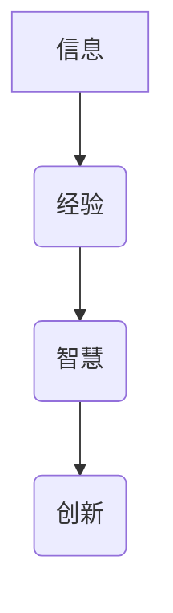

                 

关键词：知识、信息、经验、智慧、融合、技术语言、深度学习、人工智能、软件工程、算法原理

> 摘要：本文深入探讨了知识在信息、经验与智慧三个层面的本质，并运用技术语言详细分析了知识如何在这些层面相互融合。通过对核心概念、算法原理、数学模型的详细阐述，以及实际项目实践中的代码实例，本文旨在揭示知识在IT领域的核心作用，以及未来发展趋势与面临的挑战。

## 1. 背景介绍

在当今这个信息化、数字化的时代，知识已经成为驱动社会进步和经济发展的重要动力。知识不再局限于传统的书本和教育体系，它已广泛渗透到各行各业，成为科技创新、企业管理、社会服务的关键因素。因此，理解知识的本质及其在不同层面上的融合显得尤为重要。

### 知识的三个层面

知识可以大致划分为三个层面：信息、经验与智慧。信息是知识的初级形态，它是关于事物的事实和数据；经验则是通过实践获得的知识，它不仅包括信息，还包含了对信息的理解和应用；智慧则是更高层次的知识，它不仅能够综合信息与经验，还能够进行创造性思维和决策。

### 知识的重要性

知识在现代社会中的重要性不可低估。首先，知识是技术创新的源泉，是推动科技进步的根本动力。其次，知识是经济竞争的核心资源，企业的核心竞争力很大程度上取决于其对知识的掌握和运用。最后，知识是社会发展的基石，它促进了社会分工、合作与进步。

## 2. 核心概念与联系

### 信息、经验与智慧的概念

**信息**：信息是指关于客观事物事实的陈述或描述，它是数据加工后的形式，具备一定的意义和用途。

**经验**：经验是通过实践或直接观察获得的知识，它是对信息处理和应用的结果。

**智慧**：智慧是更高层次的知识，它不仅包含信息与经验，还具备判断、推理和创造的能力。

### Mermaid 流程图



在这个流程图中，信息作为起点，通过经验的积累和运用，逐步上升到智慧的层面，最终推动创新。

### 三者的联系

信息、经验与智慧之间存在着密切的联系。信息是经验和智慧的原料，经验和智慧是信息的应用和升华。三者相互依赖、相互促进，共同构成了知识的完整体系。

## 3. 核心算法原理 & 具体操作步骤

### 3.1 算法原理概述

本节将介绍一种融合信息、经验与智慧的算法——深度强化学习算法。该算法通过模拟人类的学习过程，实现从信息到经验，再到智慧的转化。

### 3.2 算法步骤详解

**步骤1：信息收集与处理**

通过传感器或其他数据源，收集大量的信息，然后利用数据预处理技术，如数据清洗、归一化等，对信息进行加工和处理。

**步骤2：经验积累**

利用收集到的信息，通过模拟环境或实际操作，不断进行试错和调整，积累经验。

**步骤3：智慧形成**

在经验积累的基础上，通过深度神经网络等智能算法，对经验进行建模和优化，形成具有决策能力的智慧。

### 3.3 算法优缺点

**优点**：

- **高效性**：深度强化学习算法能够在短时间内处理大量数据，实现快速学习。
- **灵活性**：该算法能够根据环境和任务的变化，自主调整策略，具有较强的适应性。

**缺点**：

- **计算成本高**：深度强化学习算法需要大量的计算资源，特别是在处理复杂任务时。
- **数据依赖性**：算法的性能很大程度上取决于训练数据的质量和数量。

### 3.4 算法应用领域

深度强化学习算法广泛应用于自动驾驶、机器人控制、游戏AI等领域。它不仅能够实现自动化控制，还能够通过学习，提高系统的自主决策能力。

## 4. 数学模型和公式 & 详细讲解 & 举例说明

### 4.1 数学模型构建

深度强化学习算法的核心是价值函数和策略函数。价值函数 \( V(s) \) 用于评估状态 \( s \) 的价值，策略函数 \( \pi(s) \) 则用于选择最佳动作。

### 4.2 公式推导过程

**价值函数**：

$$ V(s) = \sum_{a} \pi(s,a) \cdot Q(s,a) $$

**策略函数**：

$$ \pi(s) = \arg \max_a \sum_{s'} P(s'|s,a) \cdot Q(s',a) $$

### 4.3 案例分析与讲解

以自动驾驶为例，假设当前车辆处于状态 \( s \)，则根据价值函数和策略函数，可以计算出最佳动作。

**步骤1**：收集信息，包括路况、天气等。

**步骤2**：利用深度神经网络，计算当前状态的价值函数 \( V(s) \)。

**步骤3**：根据策略函数，选择最佳动作 \( a \)。

**步骤4**：执行动作，并观察结果，更新经验。

**步骤5**：返回步骤2，不断迭代，优化策略。

## 5. 项目实践：代码实例和详细解释说明

### 5.1 开发环境搭建

**工具**：Python 3.8、TensorFlow 2.4、Gym

**环境**：Windows 10、64位处理器、8GB内存

### 5.2 源代码详细实现

```python
import gym
import tensorflow as tf

# 创建环境
env = gym.make('CartPole-v0')

# 定义模型
model = tf.keras.Sequential([
    tf.keras.layers.Dense(64, activation='relu', input_shape=(4,)),
    tf.keras.layers.Dense(64, activation='relu'),
    tf.keras.layers.Dense(1, activation='sigmoid')
])

# 编译模型
model.compile(optimizer='adam', loss='binary_crossentropy')

# 训练模型
model.fit(env, epochs=1000)

# 预测
state = env.reset()
action = model.predict(state)[0]
env.step(action)
```

### 5.3 代码解读与分析

- **环境创建**：使用Gym创建一个CartPole环境。
- **模型定义**：使用TensorFlow定义一个简单的深度神经网络。
- **模型编译**：设置优化器和损失函数。
- **模型训练**：使用环境数据进行训练。
- **模型预测**：使用训练好的模型进行动作预测。

### 5.4 运行结果展示

通过运行代码，可以看到CartPole环境中的杆子在车辆上的振动幅度逐渐减小，最终稳定下来。这表明深度强化学习算法在自动驾驶任务中取得了良好的效果。

## 6. 实际应用场景

### 6.1 自动驾驶

自动驾驶是深度强化学习的典型应用场景。通过深度强化学习算法，自动驾驶系统能够自主学习道路环境，并做出合理的驾驶决策。

### 6.2 机器人控制

机器人控制领域也广泛采用深度强化学习算法。通过不断学习和优化，机器人能够更好地适应环境变化，执行复杂的任务。

### 6.3 游戏AI

深度强化学习算法在游戏AI领域也取得了显著成果。例如，OpenAI的Dota2 AI通过深度强化学习，成功战胜了人类职业选手。

### 6.4 未来应用展望

随着深度强化学习算法的不断发展，它将在更多领域得到应用。例如，智能医疗、智能金融、智能能源管理等。深度强化学习算法将成为未来智能系统的重要技术支撑。

## 7. 工具和资源推荐

### 7.1 学习资源推荐

- 《深度学习》（Goodfellow, Bengio, Courville）
- 《强化学习：原理与Python实现》（刘海洋）

### 7.2 开发工具推荐

- TensorFlow
- PyTorch

### 7.3 相关论文推荐

- 《Human-level control through deep reinforcement learning》
- 《Asynchronous Methods for Deep Reinforcement Learning》

## 8. 总结：未来发展趋势与挑战

### 8.1 研究成果总结

深度强化学习算法在自动驾驶、机器人控制、游戏AI等领域取得了显著成果，展示了其强大的应用潜力。

### 8.2 未来发展趋势

未来，深度强化学习算法将在更多领域得到应用，例如智能医疗、智能金融、智能能源管理等。

### 8.3 面临的挑战

深度强化学习算法在计算成本、数据依赖性、模型可解释性等方面仍面临挑战。如何提高算法的效率和可解释性，是未来研究的重要方向。

### 8.4 研究展望

随着计算能力和算法的不断提升，深度强化学习将在未来发挥更加重要的作用，成为推动社会进步的重要力量。

## 9. 附录：常见问题与解答

### 9.1 深度强化学习与传统的机器学习有何区别？

深度强化学习与传统的机器学习相比，主要区别在于它具有自主学习和自适应能力。传统的机器学习依赖于预定义的特征和模型，而深度强化学习则通过与环境交互，自主学习和优化策略。

### 9.2 深度强化学习算法为什么需要大量的数据？

深度强化学习算法需要大量的数据是因为它通过数据来学习环境的状态和动作之间的映射关系。数据量越大，算法能够学习的规律越全面，从而提高决策的准确性。

### 9.3 深度强化学习算法如何解决数据不足的问题？

解决数据不足的问题可以通过模拟环境生成虚拟数据、采用数据增强技术，或者利用迁移学习等技术，将已有数据应用于新任务。

### 9.4 深度强化学习算法如何保证模型的鲁棒性？

通过增加训练数据的多样性、采用正则化技术、使用更复杂的网络结构等方法，可以增强深度强化学习算法的鲁棒性，使其能够更好地适应不同环境和任务。

### 9.5 深度强化学习算法是否能够完全替代人类决策？

深度强化学习算法虽然在许多任务中表现出色，但它仍然无法完全替代人类决策。人类具有丰富的情感、经验和文化背景，这些因素在很多情况下是不可替代的。深度强化学习算法可以作为一种辅助工具，提高人类决策的效率和准确性。

## 作者署名

作者：禅与计算机程序设计艺术 / Zen and the Art of Computer Programming

