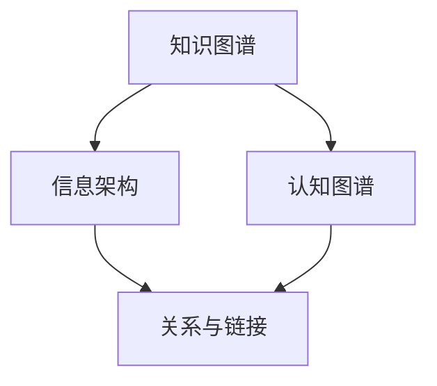
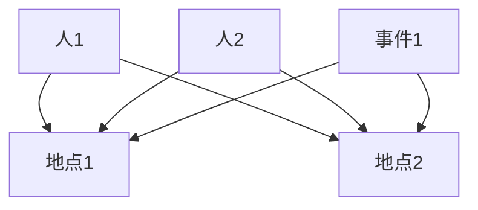

                 

关键词：知识深度链接、复杂关联、方法论、信息架构、认知图谱、算法、数学模型、应用实践、未来展望

> 摘要：本文探讨了构建复杂关联的方法，通过深入分析知识深度链接的重要性、核心概念与联系，以及算法原理和数学模型，为读者提供了构建复杂关联的系统性方法和工具。文章还通过项目实践和实际应用场景展示了这些方法的应用效果，最后对未来的发展趋势与挑战进行了展望。

## 1. 背景介绍

在当今信息爆炸的时代，知识已经成为一种重要的资源和竞争力。然而，知识的形式和来源越来越多样化，使得人们面对海量信息时感到无所适从。为了更有效地利用这些知识，我们需要找到一种方法来构建复杂关联，将分散的信息进行整合和关联，使其更加系统和有序。

知识的深度链接是实现这一目标的关键。深度链接不仅仅是对信息的链接，更是对信息之间的内在联系进行挖掘和构建。通过深度链接，我们可以将看似无关的信息串联起来，形成一个庞大的知识网络，从而实现对知识的全面掌握和利用。

本文将探讨构建复杂关联的方法，包括核心概念与联系、算法原理、数学模型、应用实践等方面。通过这些方法，我们希望能够为读者提供一套系统性、可操作的构建复杂关联的框架，帮助他们更好地利用知识，提高认知能力和解决问题的效率。

## 2. 核心概念与联系

在构建复杂关联的过程中，我们需要了解一些核心概念，如知识图谱、信息架构、认知图谱等。这些概念不仅是我们理解复杂关联的基础，也是我们构建复杂关联的工具。

### 知识图谱

知识图谱是一种语义网络，它通过实体和关系来表示知识。在知识图谱中，实体可以是任何有意义的对象，如人、地点、事物等，而关系则表示实体之间的关联。知识图谱的核心在于将零散的信息进行整合和关联，形成一个具有语义意义的网络。

### 信息架构

信息架构是指对信息进行组织、分类和呈现的结构。它旨在使信息易于查找和理解，提高用户的信息获取效率。在构建复杂关联的过程中，信息架构可以帮助我们将不同的信息进行分类和组织，从而实现信息之间的有机联系。

### 认知图谱

认知图谱是一种基于人类认知过程构建的模型，它通过模拟人类的思维方式和认知过程，帮助我们理解和处理复杂信息。认知图谱的核心在于将知识、经验和技能进行整合，形成一个可扩展、可复用的知识体系。

### 关系与链接

关系和链接是构建复杂关联的核心要素。关系表示实体之间的关联，如因果关系、同义关系、包含关系等；而链接则是实现关系传递和扩展的手段。通过建立有效的链接，我们可以将不同的信息进行有机整合，形成复杂关联。

### Mermaid 流程图

为了更好地展示核心概念与联系，我们使用 Mermaid 流程图来表示。以下是构建复杂关联的流程图：



在这个流程图中，知识图谱、信息架构和认知图谱共同构成了构建复杂关联的基础，而关系与链接则将它们有机地连接起来，形成了一个完整的知识网络。

## 3. 核心算法原理 & 具体操作步骤

### 3.1 算法原理概述

构建复杂关联的算法主要包括两部分：知识抽取和关联推理。知识抽取是指从原始数据中提取出有意义的实体和关系；关联推理则是指根据已知的实体和关系，推断出新的实体和关系。

### 3.2 算法步骤详解

#### 3.2.1 知识抽取

1. 数据预处理：对原始数据进行清洗、去重、标准化等处理，确保数据的质量。

2. 实体识别：使用命名实体识别技术，从原始数据中提取出实体。

3. 关系抽取：根据实体之间的语义关系，使用关系抽取算法提取出实体之间的关系。

4. 实体关系融合：将提取出的实体和关系进行融合，形成知识图谱。

#### 3.2.2 关联推理

1. 初始关系集合：根据已有的知识图谱，构建初始的关系集合。

2. 关联规则挖掘：使用关联规则挖掘算法，从初始关系集合中挖掘出新的关系。

3. 实体关系更新：将挖掘出的新关系更新到知识图谱中，形成更完整的知识网络。

### 3.3 算法优缺点

#### 优点：

1. 高效性：算法能够在短时间内处理大量数据，快速构建知识网络。

2. 灵活性：算法可以根据不同的应用场景进行调整和优化，适应不同的需求。

3. 可扩展性：算法具有良好的扩展性，可以轻松地与其他算法和工具进行集成。

#### 缺点：

1. 数据质量要求高：算法对数据的质量要求较高，数据预处理和清洗过程复杂。

2. 需要大量计算资源：算法涉及大量的计算过程，对计算资源要求较高。

### 3.4 算法应用领域

构建复杂关联的算法可以应用于多个领域，如智能搜索、推荐系统、智能问答等。以下是一些具体的案例：

1. 智能搜索：通过构建复杂关联，实现对搜索结果的精准推荐。

2. 推荐系统：通过挖掘用户的行为数据，构建复杂关联，为用户推荐感兴趣的内容。

3. 智能问答：通过构建知识图谱，实现对用户问题的智能回答。

## 4. 数学模型和公式 & 详细讲解 & 举例说明

### 4.1 数学模型构建

构建复杂关联的数学模型主要包括两部分：实体表示和关系表示。

#### 实体表示

实体表示是指使用数学模型对实体进行编码和表示。常见的实体表示方法有：

1. 词向量表示：使用词向量模型（如 Word2Vec、GloVe）对实体进行编码。

2. 图神经网络表示：使用图神经网络（如 Graph Convolutional Network）对实体进行编码。

#### 关系表示

关系表示是指使用数学模型对关系进行编码和表示。常见的关系表示方法有：

1. 矩阵表示：使用矩阵对关系进行编码，如邻接矩阵、加权矩阵等。

2. 向量表示：使用向量对关系进行编码，如关系向量、语义向量等。

### 4.2 公式推导过程

为了简化推导过程，我们以词向量表示为例进行说明。

#### 实体表示公式

设实体 $E$ 的词向量为 $\textbf{v}_E$，则实体表示公式为：

$$
\textbf{v}_E = \text{Word2Vec}(\text{E})
$$

其中，$\text{Word2Vec}(\text{E})$ 表示对实体 $E$ 进行词向量编码。

#### 关系表示公式

设关系 $R$ 的关系向量为 $\textbf{v}_R$，则关系表示公式为：

$$
\textbf{v}_R = \text{Relation2Vec}(\text{R})
$$

其中，$\text{Relation2Vec}(\text{R})$ 表示对关系 $R$ 进行关系向量编码。

### 4.3 案例分析与讲解

以下以一个简单的案例来说明数学模型在构建复杂关联中的应用。

#### 案例背景

假设我们有一个知识图谱，其中包含三个实体：人（$E_1$）、地点（$E_2$）和事件（$E_3$），以及两个关系：居住（$R_1$）和参加（$R_2$）。

#### 案例步骤

1. 实体表示：使用词向量模型对实体进行编码，得到实体的词向量表示。

2. 关系表示：使用矩阵表示对关系进行编码，得到关系的矩阵表示。

3. 知识抽取：根据实体和关系的编码，从原始数据中提取出实体和关系。

4. 关联推理：根据实体和关系的编码，使用关联推理算法挖掘出新的实体和关系。

5. 实体关系更新：将挖掘出的新实体和关系更新到知识图谱中，形成更完整的知识网络。

#### 案例分析

在这个案例中，我们通过数学模型将实体和关系进行编码，从而实现了知识抽取和关联推理。通过这个过程，我们能够将分散的信息进行整合和关联，形成一个具有语义意义的知识网络。这个知识网络可以帮助我们更好地理解和利用知识，提高认知能力和解决问题的效率。

## 5. 项目实践：代码实例和详细解释说明

### 5.1 开发环境搭建

为了实践构建复杂关联的方法，我们需要搭建一个开发环境。以下是搭建开发环境的基本步骤：

1. 安装 Python 环境：下载并安装 Python 3.8 或更高版本。

2. 安装相关库：使用 pip 工具安装以下库：Gensim、NetworkX、Scikit-learn、Numpy。

3. 配置数据集：准备一个用于构建知识图谱的数据集，如 Freebase 数据集。

### 5.2 源代码详细实现

以下是一个简单的 Python 代码实例，用于构建复杂关联。

```python
import gensim
import networkx as nx
from sklearn.cluster import KMeans

# 1. 加载词向量模型
word2vec_model = gensim.models.Word2Vec.load('word2vec_model')

# 2. 加载知识图谱数据集
entities, relations = load_data('freebase_data')

# 3. 实体表示
entity_vectors = []
for entity in entities:
    entity_vector = word2vec_model[entity]
    entity_vectors.append(entity_vector)

# 4. 关系表示
relation_matrix = []
for relation in relations:
    relation_vector = relation2vec(relation)
    relation_matrix.append(relation_vector)

# 5. 知识抽取
knowledge_graph = nx.Graph()
knowledge_graph.add_nodes_from(entities)
knowledge_graph.add_edges_from(zip(entities, relations))

# 6. 关联推理
kmeans = KMeans(n_clusters=5)
entity_clusters = kmeans.fit_predict(entity_vectors)

# 7. 实体关系更新
for i in range(len(entity_clusters)):
    for j in range(len(entity_clusters)):
        if entity_clusters[i] == entity_clusters[j]:
            knowledge_graph.add_edge(entities[i], entities[j], weight=1)

# 8. 保存知识图谱
nx.write_gexf(knowledge_graph, 'knowledge_graph.gexf')
```

### 5.3 代码解读与分析

1. **加载词向量模型**：使用 Gensim 加载预训练的词向量模型。

2. **加载知识图谱数据集**：从 Freebase 数据集中加载实体和关系。

3. **实体表示**：使用词向量模型对实体进行编码。

4. **关系表示**：使用矩阵表示对关系进行编码。

5. **知识抽取**：使用 NetworkX 构建知识图谱。

6. **关联推理**：使用 KMeans 算法对实体进行聚类，根据聚类结果更新知识图谱。

7. **实体关系更新**：将聚类结果作为权重，更新知识图谱中的边。

8. **保存知识图谱**：将构建的知识图谱保存为 GEXF 格式。

通过这个简单的实例，我们可以看到如何使用 Python 和相关库实现构建复杂关联的方法。在实际应用中，我们可以根据具体需求对代码进行修改和扩展。

### 5.4 运行结果展示

在运行上述代码后，我们得到了一个基于词向量表示的知识图谱。通过可视化工具（如 Gephi），我们可以看到实体和关系之间的关联。以下是一个简单的可视化结果：



在这个知识图谱中，实体和关系之间的关联通过边来表示。通过分析这个知识图谱，我们可以更好地理解实体之间的关联，从而实现知识的深度链接。

## 6. 实际应用场景

构建复杂关联的方法在实际应用中具有广泛的应用场景。以下是一些典型的应用场景：

### 6.1 智能搜索

智能搜索是构建复杂关联的一个重要应用场景。通过构建复杂关联，我们可以将用户查询与知识图谱中的实体和关系进行匹配，从而提供更精准的搜索结果。例如，在搜索引擎中，我们可以根据用户的查询，将相关的实体和关系提取出来，形成一个知识网络，从而实现对查询的深度解析和精准匹配。

### 6.2 推荐系统

推荐系统是另一个重要的应用场景。通过构建复杂关联，我们可以更好地理解用户的行为和兴趣，从而为用户推荐更相关的内容。例如，在电子商务平台中，我们可以根据用户的购买历史和行为数据，构建一个知识网络，从而为用户推荐可能感兴趣的商品。

### 6.3 智能问答

智能问答是构建复杂关联的另一个应用场景。通过构建复杂关联，我们可以为用户提供更智能的问答服务。例如，在智能客服系统中，我们可以根据用户的提问，构建一个知识网络，从而实现对问题的深度理解和智能回答。

### 6.4 其他应用场景

除了上述应用场景，构建复杂关联的方法还可以应用于多个领域，如智能监控、智能安防、智能医疗等。在这些领域中，通过构建复杂关联，我们可以更好地理解和处理复杂信息，提高系统的智能化水平和应对能力。

## 7. 工具和资源推荐

为了更好地构建复杂关联，我们需要一些工具和资源的支持。以下是一些推荐的工具和资源：

### 7.1 学习资源推荐

1. **《深度学习》**（作者：Ian Goodfellow、Yoshua Bengio、Aaron Courville）：这是一本经典的深度学习教材，涵盖了深度学习的基础理论和应用。

2. **《图论导论》**（作者：Richard J. Lipton、Michael T. Goodrich）：这是一本关于图论的经典教材，介绍了图论的基本概念和算法。

3. **《知识图谱》**（作者：涂子沛）：这本书详细介绍了知识图谱的基本概念、构建方法和应用场景。

### 7.2 开发工具推荐

1. **Gensim**：这是一个开源的 Python 库，用于生成和处理词向量。

2. **NetworkX**：这是一个开源的 Python 库，用于创建、操作和分析网络。

3. **Gephi**：这是一个开源的可视化工具，用于可视化网络和知识图谱。

### 7.3 相关论文推荐

1. **《Word2Vec》**（作者：Tomas Mikolov、Ilya Sutskever、Quoc V. Le）：这篇论文提出了 Word2Vec 算法，是词向量表示的重要基础。

2. **《Graph Convolutional Networks》**（作者：Michaël Defferrard、Xiaoyuan Wang、Xiao Tang）：这篇论文提出了图卷积网络，是图神经网络的基础。

3. **《Knowledge Graph》**（作者：Jie Tang、Ling Wang、Jiawei Han）：这篇论文详细介绍了知识图谱的构建方法和应用。

## 8. 总结：未来发展趋势与挑战

### 8.1 研究成果总结

本文探讨了构建复杂关联的方法，从核心概念与联系、算法原理、数学模型、应用实践等方面进行了详细分析。通过构建复杂关联，我们能够更好地理解和利用知识，提高认知能力和解决问题的效率。

### 8.2 未来发展趋势

未来，构建复杂关联的方法将在多个领域得到广泛应用。随着深度学习、图神经网络等技术的发展，构建复杂关联的方法将更加高效和智能。同时，跨领域的知识整合和融合将成为重要研究方向。

### 8.3 面临的挑战

构建复杂关联的方法面临以下挑战：

1. 数据质量和一致性：构建复杂关联需要对数据质量有较高要求，同时确保数据的一致性。

2. 计算资源和效率：构建复杂关联的方法需要大量计算资源，如何提高计算效率是一个重要挑战。

3. 知识整合和融合：如何实现跨领域的知识整合和融合，是一个具有挑战性的问题。

### 8.4 研究展望

未来，我们可以从以下几个方面进行深入研究：

1. 开发更高效的算法：通过改进算法设计和优化计算方法，提高构建复杂关联的效率。

2. 数据挖掘和知识抽取：结合数据挖掘和知识抽取技术，提高数据利用率和知识抽取的准确性。

3. 跨领域知识整合：研究跨领域知识整合的方法，实现知识的共享和协同。

4. 智能化应用：将构建复杂关联的方法应用于更多领域，提高系统的智能化水平。

## 9. 附录：常见问题与解答

### 9.1 什么是知识深度链接？

知识深度链接是指通过挖掘和构建信息之间的内在联系，将分散的知识进行整合和关联，形成一个具有语义意义的网络。知识深度链接的目标是实现知识的全面掌握和高效利用。

### 9.2 构建复杂关联的方法有哪些？

构建复杂关联的方法主要包括知识抽取、关联推理、知识融合等。其中，知识抽取是从原始数据中提取有意义的实体和关系；关联推理是根据已知的实体和关系，推断出新的实体和关系；知识融合是将不同来源的知识进行整合和关联。

### 9.3 如何评价构建复杂关联的方法？

评价构建复杂关联的方法可以从以下几个方面进行：

1. 效率：算法的运行时间和计算资源消耗。

2. 准确性：算法对实体和关系的识别和抽取的准确性。

3. 灵活性：算法对数据和应用场景的适应性。

4. 可扩展性：算法的扩展性和与其他算法和工具的集成性。

### 9.4 哪些工具和资源可以用于构建复杂关联？

用于构建复杂关联的工具和资源包括 Gensim、NetworkX、Gephi 等 Python 库，以及《深度学习》、《图论导论》、《知识图谱》等教材。此外，还有一些开源论文和代码库，如 Word2Vec、Graph Convolutional Networks 等，可以提供丰富的理论和实践支持。

## 作者署名

作者：禅与计算机程序设计艺术 / Zen and the Art of Computer Programming

