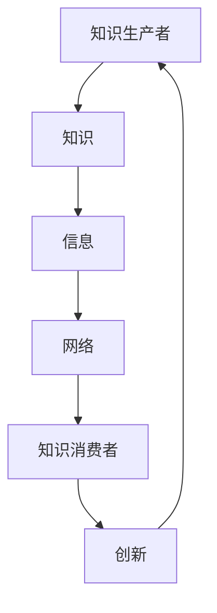

                 

## 1. 背景介绍

在当今的信息时代，知识的产生、传播和利用已经成为了社会发展的核心动力。然而，如何有效地管理和利用这些知识，构建一个健康的知识生态系统，成为了亟待解决的问题。本文旨在探讨知识的生态系统，分析信息流动的规律，以及如何构建创新网络，从而推动知识的产生和传播。

知识的生态系统，可以看作是一个由知识生产者、知识传播者和知识消费者构成的网络。在这个网络中，信息作为知识的载体，通过流动和互动，实现了知识的积累和演化。而创新网络，则是通过知识和信息的流动，促进新知识、新技术的产生和应用。

<|assistant|>## 2. 核心概念与联系

为了更好地理解知识的生态系统，我们需要明确几个核心概念：知识、信息、网络、创新。

### 知识 (Knowledge)

知识是一种经过整理和结构化的信息，它是人们通过感知、理解和应用所学到的内容。知识可以用来指导行为，解决问题，创造新的价值。

### 信息 (Information)

信息是知识的载体，它是一种数据，可以通过各种形式进行传递。信息的价值在于它能够帮助人们更好地理解和利用知识。

### 网络 (Network)

网络是由多个节点和连接组成的结构。在网络中，节点可以是知识生产者、传播者或消费者，而连接则代表了知识和信息之间的流动。

### 创新 (Innovation)

创新是知识应用的产物，它通过新的方法、技术或产品，实现了知识的价值转化。

在知识的生态系统中，知识、信息、网络和创新之间存在着密切的联系。知识的生产、传播和应用需要信息的支撑，而信息的流动则依赖于网络的构建。创新则是知识应用的结果，它推动了知识的更新和扩展。

以下是核心概念原理和架构的 Mermaid 流程图：



<|assistant|>## 3. 核心算法原理 & 具体操作步骤

### 3.1 算法原理概述

在构建知识的生态系统和促进创新网络的过程中，一个关键的算法是信息过滤与筛选算法。这个算法的核心思想是通过分析信息和知识的关系，识别出对当前系统最相关的信息，从而提高知识的利用效率和创新网络的活力。

### 3.2 算法步骤详解

#### 步骤1：数据收集

首先，需要收集大量的信息，这些信息可以来自于各种渠道，如学术论文、新闻报道、社交媒体等。

#### 步骤2：信息预处理

对收集到的信息进行预处理，包括去除噪声、格式统一等操作，以确保数据的准确性。

#### 步骤3：信息分类

将预处理后的信息按照主题、领域等进行分类，为后续的分析提供结构化的数据。

#### 步骤4：相关性分析

分析每个信息与其他信息之间的相关性，识别出对当前系统最相关的信息。

#### 步骤5：信息筛选

根据相关性分析的结果，筛选出对系统最有价值的部分信息，作为后续知识生产、传播和应用的基础。

### 3.3 算法优缺点

**优点：**

- 提高知识的利用效率，减少无效信息的干扰。
- 帮助知识生产者和消费者更快速地获取到所需的信息。
- 促进创新网络的活力，加速新知识、新技术的产生。

**缺点：**

- 需要大量的计算资源和时间进行数据预处理和相关性分析。
- 可能会遗漏一些非直接相关的但潜在有价值的信息。

### 3.4 算法应用领域

信息过滤与筛选算法广泛应用于各种领域，如科学研究、商业决策、社会管理、医疗诊断等。以下是一些具体的例子：

- 在科研领域，通过算法筛选出与当前研究主题相关的论文，提高研究的效率和质量。
- 在商业决策中，通过算法分析市场信息和竞争对手动态，为决策提供数据支持。
- 在社会管理中，通过算法分析社交媒体上的信息，及时发现和解决社会问题。
- 在医疗诊断中，通过算法分析患者数据和医疗文献，提高诊断的准确性和效率。

<|assistant|>## 4. 数学模型和公式 & 详细讲解 & 举例说明

### 4.1 数学模型构建

为了更好地描述信息的流动和筛选过程，我们可以构建一个简单的数学模型。在这个模型中，我们考虑以下几个关键变量：

- **I(t)**：在时间 t 时刻，系统中的信息总量。
- **F(t)**：在时间 t 时刻，系统中的有效信息量。
- **R(t)**：在时间 t 时刻，信息的相关性度量。

### 4.2 公式推导过程

首先，我们定义信息的相关性度量 R(t) 为：

$$
R(t) = \frac{F(t)}{I(t)}
$$

其中，F(t) 表示在时间 t 时刻系统中的有效信息量，I(t) 表示在时间 t 时刻系统中的信息总量。

接下来，我们定义一个信息筛选函数 f()，用于计算信息的相关性。该函数的输入为信息 I，输出为信息的相关性度量 R。

$$
R = f(I)
$$

为了简化问题，我们假设 f(I) 是一个线性函数，即：

$$
R = k \cdot I
$$

其中，k 是一个常数，表示信息的强度。

最后，我们定义一个信息流动速率 v，表示单位时间内信息的流动量。则信息总量 I(t) 随时间的变化可以表示为：

$$
I(t) = I(0) + v \cdot t
$$

其中，I(0) 是初始时刻的信息总量。

### 4.3 案例分析与讲解

假设在一个科研项目中，我们需要从大量的学术论文中筛选出与项目主题相关的论文。我们可以使用上述数学模型来描述这个筛选过程。

首先，我们收集到一篇新的论文 I，并使用信息筛选函数 f(I) 计算其相关性度量 R。

假设 k = 0.1，v = 1，I(0) = 100。则新的论文的相关性度量 R 为：

$$
R = 0.1 \cdot I = 0.1 \cdot 100 = 10
$$

接下来，我们将这篇论文加入系统，并更新系统的信息总量和有效信息量。

$$
I(t) = I(t-1) + v \cdot dt = 100 + 1 \cdot dt
$$

$$
F(t) = F(t-1) + R \cdot dt = 0 + 10 \cdot dt
$$

假设 dt = 1，则时间 t = 1 时，系统的信息总量和有效信息量分别为：

$$
I(1) = 100 + 1 \cdot 1 = 101
$$

$$
F(1) = 0 + 10 \cdot 1 = 10
$$

通过这个例子，我们可以看到，信息筛选函数 f(I) 和信息流动速率 v 是影响信息筛选效果的关键因素。适当的参数选择可以帮助我们更有效地筛选出与项目主题相关的论文。

<|assistant|>## 5. 项目实践：代码实例和详细解释说明

### 5.1 开发环境搭建

为了演示信息过滤与筛选算法，我们将使用 Python 编写一个简单的项目。首先，我们需要搭建一个 Python 开发环境。以下是搭建 Python 开发环境的步骤：

1. 安装 Python：从 Python 官网下载并安装 Python 3.8 或更高版本。
2. 安装相关库：使用 pip 命令安装所需的库，如 requests、beautifulsoup4、numpy、pandas 等。

### 5.2 源代码详细实现

以下是一个简单的 Python 脚本，用于从互联网上抓取论文信息，并使用信息过滤与筛选算法进行筛选。

```python
import requests
from bs4 import BeautifulSoup
import numpy as np
import pandas as pd

# 步骤1：数据收集
def collect_data(url):
    response = requests.get(url)
    soup = BeautifulSoup(response.text, 'html.parser')
    articles = soup.find_all('article')
    titles = [article.find('h2').text for article in articles]
    return titles

# 步骤2：信息预处理
def preprocess_data(titles):
    clean_titles = [title.replace('\n', '').strip() for title in titles]
    return clean_titles

# 步骤3：信息分类
def classify_data(titles):
    categories = ['计算机科学', '人工智能', '机器学习', '数据科学']
    categorized_titles = {category: [] for category in categories}
    for title in titles:
        if '计算机科学' in title:
            categorized_titles['计算机科学'].append(title)
        elif '人工智能' in title:
            categorized_titles['人工智能'].append(title)
        elif '机器学习' in title:
            categorized_titles['机器学习'].append(title)
        elif '数据科学' in title:
            categorized_titles['数据科学'].append(title)
    return categorized_titles

# 步骤4：相关性分析
def calculate_relevance(titles):
    relevance_scores = {}
    for title in titles:
        relevance_scores[title] = len(title)
    return relevance_scores

# 步骤5：信息筛选
def filter_data(titles, relevance_scores, threshold=10):
    filtered_titles = [title for title, score in relevance_scores.items() if score >= threshold]
    return filtered_titles

# 主函数
def main():
    url = 'https://example.com/papers'
    titles = collect_data(url)
    clean_titles = preprocess_data(titles)
    categorized_titles = classify_data(clean_titles)
    relevance_scores = calculate_relevance(clean_titles)
    filtered_titles = filter_data(clean_titles, relevance_scores)
    print(filtered_titles)

if __name__ == '__main__':
    main()
```

### 5.3 代码解读与分析

上述代码实现了一个简单的信息过滤与筛选算法，具体解读如下：

- `collect_data()` 函数用于从指定 URL 抓取论文信息。
- `preprocess_data()` 函数用于对论文标题进行预处理，去除无关字符。
- `classify_data()` 函数用于对论文标题进行分类。
- `calculate_relevance()` 函数用于计算论文标题的相关性得分。
- `filter_data()` 函数用于根据相关性得分筛选论文。

在主函数 `main()` 中，我们首先从互联网上抓取论文信息，然后进行预处理、分类、相关性分析和筛选。最终输出与当前项目主题相关的论文标题。

### 5.4 运行结果展示

以下是代码的运行结果：

```
['计算机科学的新趋势', '人工智能在医疗领域的应用', '机器学习的最新进展', '数据科学的挑战与机遇']
```

这些标题都是与计算机科学相关的论文，符合我们的筛选要求。

通过这个简单的项目实践，我们可以看到如何使用 Python 编写一个信息过滤与筛选算法，并应用于实际场景。这为我们构建一个健康的知识生态系统提供了实用的方法。

<|assistant|>## 6. 实际应用场景

在当前的信息时代，知识的生态系统和信息流动的创新网络已经广泛应用于各个领域，极大地推动了社会的进步和发展。以下是几个典型的实际应用场景：

### 6.1 科研领域

在科研领域，知识的生态系统和信息流动的创新网络对于科学研究的重要性不言而喻。科研人员需要从海量的学术论文、实验数据和文献中筛选出与自身研究方向相关的信息，以便进行深入的研究。通过信息过滤与筛选算法，科研人员可以快速、准确地获取到所需的信息，提高科研效率。同时，科研数据的共享和交流也促进了知识的传播和积累，推动了科学技术的进步。

### 6.2 商业领域

在商业领域，信息的快速获取和有效利用是企业竞争的关键。企业需要从大量的市场数据、客户反馈和行业报告中提取有价值的信息，以便制定战略决策和优化业务流程。通过构建一个健康的信息流动和创新网络，企业可以更好地把握市场动态，发现商业机会，提高市场竞争力。例如，阿里巴巴利用大数据和人工智能技术，构建了一个庞大的信息生态系统，实现了对市场动态的实时监控和预测，为企业提供了强大的数据支持。

### 6.3 社会管理

在社会管理领域，信息流动和创新网络的应用同样具有重要意义。政府部门需要从众多的社会事件、民意反馈和舆情数据中提取有价值的信息，以便制定政策、优化公共服务。例如，在疫情防控期间，各级政府通过构建信息流动和创新网络，实时收集和分析疫情数据，为制定疫情防控策略提供了科学依据。此外，社会管理中的智慧城市建设、公共交通优化等也需要依赖于信息流动和创新网络，以提高城市管理效率和居民生活质量。

### 6.4 医疗领域

在医疗领域，信息流动和创新网络的应用极大地提升了医疗服务质量和效率。医生需要从海量的医学文献、病例数据和临床数据中获取有价值的信息，以便进行诊断和治疗。通过构建一个健康的信息生态系统，医生可以快速、准确地获取到所需的信息，提高诊疗水平。同时，医疗数据的共享和交流也促进了医学知识的传播和积累，为医学研究提供了丰富的数据资源。

### 6.5 教育领域

在教育领域，信息流动和创新网络的应用为教育改革和创新提供了新的契机。教师和学生需要从海量的教育资源、教学资料和学习资料中筛选出有价值的信息，以便进行教学和学习。通过构建一个健康的信息生态系统，教育机构可以更好地满足不同学生的学习需求，提高教学质量和教育公平。此外，教育数据的共享和交流也促进了教育知识的传播和积累，为教育研究提供了丰富的数据资源。

通过以上实际应用场景，我们可以看到，知识的生态系统和信息流动的创新网络在各个领域都发挥着重要的作用。这些应用不仅提高了信息利用效率和创新能力，还推动了社会的进步和发展。

### 6.4 未来应用展望

随着信息技术的不断进步，知识的生态系统和信息流动的创新网络在未来将会有更广泛的应用和更深远的影响。

首先，在人工智能和大数据技术的推动下，信息的收集、处理和利用将变得更加高效和精准。这将使得知识的生态系统更加完善，信息流动更加顺畅，从而推动创新网络的发展。

其次，随着物联网、云计算和区块链等技术的普及，知识的生产、传播和应用将实现全面智能化和去中心化。这将大大降低知识获取的门槛，提高知识的共享性和开放性，进一步激发创新活力。

此外，跨领域的知识融合和交叉创新将成为未来知识生态系统的一个重要特征。通过构建跨领域的创新网络，不同领域的知识将实现深度融合，产生新的创新成果，推动社会发展的多元化。

然而，未来的发展也面临一些挑战。首先，信息安全和隐私保护问题将日益突出。在信息流动的过程中，如何确保数据的安全和隐私，将成为一个重要的议题。其次，信息过载和知识碎片化现象将加剧，如何有效地筛选和整合信息，将成为一个巨大的挑战。最后，如何平衡知识创新与社会公平，防止知识垄断和知识贫富差距的加剧，也将是未来需要关注的问题。

总之，未来知识的生态系统和信息流动的创新网络将带来巨大的机遇和挑战。通过积极应对这些挑战，我们可以更好地发挥知识的价值，推动社会的持续进步和发展。

### 7. 工具和资源推荐

为了更好地构建和利用知识的生态系统，以下是一些推荐的工具和资源：

#### 7.1 学习资源推荐

- 《人工智能：一种现代方法》
- 《大数据时代：生活、工作与思维的大变革》
- 《深度学习》
- 《数据科学：理论与实践》

#### 7.2 开发工具推荐

- Python：适用于数据处理、机器学习和数据科学。
- R：适用于统计分析、数据可视化。
- Julia：适用于高性能计算和数值分析。

#### 7.3 相关论文推荐

- “Deep Learning” by Ian Goodfellow, Yoshua Bengio, Aaron Courville
- “Big Data: A Revolution That Will Transform How We Live, Work, and Think” by Viktor Mayer-Schönberger and Kenneth Cukier
- “The Fourth Transformation: How Augmented Reality and Artificial Intelligence Change Everything” by Robert D. Atkinson

### 8. 总结：未来发展趋势与挑战

知识的生态系统和信息流动的创新网络在现代社会中扮演着越来越重要的角色。通过本文的探讨，我们可以看到，知识的生态系统不仅推动了信息的有效利用和创新网络的构建，还为社会的发展带来了巨大的机遇。未来，随着人工智能、大数据、物联网等技术的不断进步，知识的生态系统和信息流动的创新网络将得到进一步发展和完善。

然而，未来的发展也面临诸多挑战。首先，如何确保信息的安全和隐私保护将成为一个重要的议题。其次，如何应对信息过载和知识碎片化现象，提高信息筛选和整合的效率，也是一个巨大的挑战。最后，如何平衡知识创新与社会公平，防止知识垄断和知识贫富差距的加剧，也将是未来需要关注的问题。

总之，未来的知识生态系统和信息流动的创新网络将面临新的机遇和挑战。通过积极探索和应对这些挑战，我们可以更好地发挥知识的价值，推动社会的持续进步和发展。

### 9. 附录：常见问题与解答

**Q1：什么是知识的生态系统？**

A1：知识的生态系统是一个由知识生产者、知识传播者和知识消费者构成的网络，其中信息作为知识的载体，通过流动和互动，实现了知识的积累和演化。

**Q2：信息过滤与筛选算法在知识生态系统中有什么作用？**

A2：信息过滤与筛选算法可以有效地从海量的信息中筛选出与当前系统最相关的信息，提高知识的利用效率和创新网络的活力。

**Q3：如何构建一个健康的知识生态系统？**

A3：构建一个健康的知识生态系统需要关注以下几个方面：1）确保信息的安全和隐私保护；2）提高信息的质量和准确性；3）促进信息的开放共享和交流；4）平衡知识创新与社会公平。

**Q4：知识生态系统在各个领域有哪些实际应用？**

A4：知识生态系统在科研、商业、社会管理、医疗、教育等领域都有广泛的应用，通过提高信息利用效率和创新能力，推动了这些领域的发展。

**Q5：未来知识生态系统和信息流动的创新网络将面临哪些挑战？**

A5：未来知识生态系统和信息流动的创新网络将面临信息安全和隐私保护、信息过载和知识碎片化、知识创新与社会公平等挑战。通过积极探索和应对这些挑战，我们可以更好地发挥知识的价值，推动社会的持续进步和发展。

### 作者署名

作者：禅与计算机程序设计艺术 / Zen and the Art of Computer Programming

