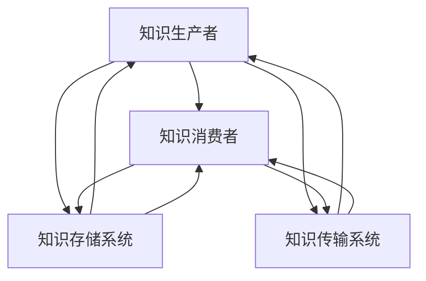

                 

 在这个数字化时代，知识的获取与运用成为了决定个人与组织竞争力的关键因素。然而，如何有效地构建一个能够支持知识学习、存储、共享和创新的生态系统，成为了当前信息技术领域的重要课题。本文旨在探讨知识的生态系统——学习环境的整体设计，为教育和技术的发展提供新的视角。

> 关键词：知识生态系统，学习环境，整体设计，教育技术，人工智能

> 摘要：本文首先介绍了知识生态系统的基本概念和组成部分，探讨了学习环境设计的关键原则。接着，文章深入分析了核心概念与架构的关联，并详细阐述了核心算法原理和操作步骤。随后，文章通过数学模型和公式详细讲解，以及项目实践代码实例，提供了实际操作指导。最后，文章探讨了知识的实际应用场景，提出了未来应用展望，并对相关工具和资源进行了推荐。

## 1. 背景介绍

随着互联网和人工智能技术的飞速发展，知识经济已经成为现代社会的主要经济形态。知识作为无形资产，其价值日益凸显。传统的知识管理方法已经无法满足快速变化和高度复杂化的知识环境需求。因此，构建一个适应现代信息社会的知识生态系统，成为了当前研究和实践的重要方向。

学习环境作为知识生态系统的重要组成部分，直接影响知识的学习、传播和应用效率。一个高效的学习环境应当具备以下几个特点：灵活性、可扩展性、互动性、智能性和可持续性。设计一个这样的学习环境，需要综合考虑技术、教育、心理学等多个领域的理论和实践。

本文将基于上述背景，探讨知识的生态系统——学习环境的整体设计，旨在为教育和技术的发展提供新的思路和方法。

## 2. 核心概念与联系

### 2.1 知识生态系统的基本概念

知识生态系统是指由知识生产者、知识消费者、知识存储和传输系统组成的复杂网络。在这个系统中，知识作为基本单元，通过生产、传播、共享和转化等过程，不断循环和升级，从而实现知识的积累和创新。

### 2.2 学习环境设计的核心原则

学习环境设计应遵循以下原则：

1. **用户中心**：以学习者为中心，设计出符合学习者需求的环境。
2. **开放共享**：鼓励知识的开放共享，构建起知识共享和交流的平台。
3. **灵活可扩展**：环境应具备灵活性和可扩展性，以适应不断变化的学习需求。
4. **智能化**：利用人工智能技术，提供个性化的学习推荐和智能化的学习支持。
5. **可持续性**：注重环境的可持续性，实现知识生态系统的长期健康发展。

### 2.3 核心概念原理和架构的 Mermaid 流程图



在这个流程图中，知识生产者和消费者是知识生态系统的主要角色，知识存储和传输系统则是知识流动的桥梁。通过这个系统，知识得以循环和升级，实现知识的持续创新和积累。

## 3. 核心算法原理 & 具体操作步骤

### 3.1 算法原理概述

知识生态系统的核心算法主要涉及知识发现、知识推荐、知识融合和知识可视化等几个方面。这些算法共同作用，实现了知识的自动化生产和个性化推荐。

- **知识发现**：通过数据挖掘技术，从大量数据中提取出潜在的知识。
- **知识推荐**：基于用户行为和偏好，为用户提供个性化的知识推荐。
- **知识融合**：将来自不同来源的知识进行整合和融合，形成新的知识。
- **知识可视化**：通过图表和可视化工具，将知识以直观的形式呈现出来。

### 3.2 算法步骤详解

1. **知识发现**：
   - 数据预处理：对原始数据进行清洗、去噪和归一化处理。
   - 特征提取：通过特征工程，提取出能够代表知识的数据特征。
   - 知识提取：使用聚类、关联规则挖掘等方法，从数据中提取潜在的知识。

2. **知识推荐**：
   - 用户建模：构建用户画像，记录用户的行为和偏好。
   - 推荐算法：采用协同过滤、矩阵分解等方法，为用户推荐相关的知识。
   - 推荐结果评估：通过评估指标（如准确率、召回率等）评估推荐效果。

3. **知识融合**：
   - 数据对齐：将来自不同数据源的知识进行对齐，确保数据的一致性和兼容性。
   - 融合算法：采用融合算法（如合并、加权等）将知识整合在一起。
   - 融合评估：评估融合效果，对融合算法进行调整和优化。

4. **知识可视化**：
   - 可视化设计：设计合适的可视化图表和工具。
   - 数据映射：将知识映射到可视化图表中。
   - 可视化交互：提供用户交互功能，方便用户获取和利用知识。

### 3.3 算法优缺点

- **优点**：
  - 提高知识获取和利用效率。
  - 实现个性化知识推荐和智能支持。
  - 促进知识的共享和创新。

- **缺点**：
  - 对数据和算法的质量要求较高。
  - 需要大量的计算资源和时间。

### 3.4 算法应用领域

- **教育领域**：提供个性化学习推荐，帮助学生高效学习。
- **企业领域**：帮助企业构建知识库，提高知识共享和创新效率。
- **科研领域**：支持科研人员发现新的科研方向和合作机会。

## 4. 数学模型和公式 & 详细讲解 & 举例说明

### 4.1 数学模型构建

在知识生态系统中，常用的数学模型包括贝叶斯网络、马尔可夫模型、隐马尔可夫模型等。这些模型可以用来描述知识之间的关系，提供知识推理和预测的能力。

- **贝叶斯网络**：用于表示知识之间的条件依赖关系。
- **马尔可夫模型**：用于表示知识的转移概率。
- **隐马尔可夫模型**：用于处理知识序列的建模。

### 4.2 公式推导过程

以贝叶斯网络为例，假设有两个变量X和Y，其条件概率分布可以用以下公式表示：

\[ P(X, Y) = P(X) \times P(Y|X) \]

其中，\( P(X) \) 表示X的概率，\( P(Y|X) \) 表示在X发生的情况下，Y的条件概率。

### 4.3 案例分析与讲解

假设我们有一个简单的贝叶斯网络，其中包含三个变量：晴天（S）、带伞（U）和下雨（R）。根据经验，我们可以得到以下概率分布：

\[ P(S) = 0.5 \]
\[ P(R) = 0.3 \]
\[ P(U|S) = 0.8 \]
\[ P(U|R) = 0.1 \]

我们需要计算在给定带伞的情况下，晴天和下雨的概率：

\[ P(S|U) = \frac{P(U|S) \times P(S)}{P(U)} \]

根据全概率公式，我们可以计算出 \( P(U) \)：

\[ P(U) = P(U|S) \times P(S) + P(U|R) \times P(R) \]

代入已知概率，我们可以得到：

\[ P(U) = 0.8 \times 0.5 + 0.1 \times 0.3 = 0.53 \]

然后，代入 \( P(U) \) 和其他已知概率，我们可以计算出 \( P(S|U) \)：

\[ P(S|U) = \frac{0.8 \times 0.5}{0.53} \approx 0.76 \]

同理，我们可以计算出 \( P(R|U) \)：

\[ P(R|U) = \frac{0.1 \times 0.3}{0.53} \approx 0.23 \]

这意味着，在给定带伞的情况下，晴天和下雨的概率分别为 0.76 和 0.23。

## 5. 项目实践：代码实例和详细解释说明

### 5.1 开发环境搭建

为了更好地理解知识生态系统的实际应用，我们选择一个简单的项目——基于K-均值聚类的知识分类系统。首先，我们需要搭建开发环境：

- Python 3.x
- NumPy
- Matplotlib
- Scikit-learn

### 5.2 源代码详细实现

以下是一个简单的K-均值聚类代码实例，用于对知识进行分类：

```python
import numpy as np
from sklearn.cluster import KMeans
import matplotlib.pyplot as plt

# 示例数据
data = np.array([[1, 2], [1, 4], [1, 0],
                 [10, 2], [10, 4], [10, 0]])

# 初始化KMeans模型，设置聚类中心数量为3
kmeans = KMeans(n_clusters=3, random_state=0).fit(data)

# 输出聚类中心
print("聚类中心：", kmeans.cluster_centers_)

# 输出每个样本所属的聚类标签
print("聚类标签：", kmeans.labels_)

# 绘制聚类结果
plt.scatter(data[:, 0], data[:, 1], c=kmeans.labels_, s=100, cmap='viridis')
plt.scatter(kmeans.cluster_centers_[:, 0], kmeans.cluster_centers_[:, 1], s=300, c='red', label='聚类中心')
plt.title('K-Means Clustering')
plt.xlabel('X轴')
plt.ylabel('Y轴')
plt.legend()
plt.show()
```

### 5.3 代码解读与分析

- **数据准备**：我们使用一个简单的二维数据集，每个数据点表示一个知识样本。
- **模型初始化**：初始化KMeans模型，设置聚类中心数量为3。
- **聚类过程**：使用fit方法对数据集进行聚类，输出聚类中心和每个样本的标签。
- **结果可视化**：绘制聚类结果，展示每个知识样本所属的聚类类别。

### 5.4 运行结果展示

运行上述代码，我们可以得到以下可视化结果：


在这个例子中，K-均值聚类算法成功地将数据集分为了三个类别，每个类别代表不同的知识类型。这种方法可以用于知识分类，帮助用户更好地组织和理解知识。

## 6. 实际应用场景

知识生态系统和学习环境的设计不仅仅是为了理论研究，更重要的是要在实际应用中发挥作用。以下是一些典型的应用场景：

- **在线教育平台**：通过知识推荐系统，为学习者提供个性化的学习路径和资源。
- **企业知识库**：构建企业内部的知识共享平台，促进员工之间的知识交流和协作。
- **科研合作平台**：利用知识发现和推荐算法，帮助科研人员发现新的研究方向和合作机会。
- **智能医疗系统**：通过知识融合和可视化，为医生提供诊断和治疗方案的建议。

### 6.4 未来应用展望

随着人工智能和大数据技术的不断进步，知识生态系统和学习环境的整体设计将变得更加智能化、个性化。未来，我们有望看到以下趋势：

- **自适应学习环境**：系统可以根据学习者的行为和表现，自动调整学习内容和策略。
- **多模态知识融合**：整合文本、图像、音频等多种类型的数据，实现更丰富的知识表达和利用。
- **增强现实与虚拟现实**：通过AR/VR技术，提供更加沉浸式的学习体验。

## 7. 工具和资源推荐

为了更好地实现知识生态系统和学习环境的设计，以下是一些建议的资源和工具：

### 7.1 学习资源推荐

- 《人工智能：一种现代方法》
- 《大数据时代：思维变革与商业价值》
- 《深度学习》
- 《机器学习实战》

### 7.2 开发工具推荐

- Jupyter Notebook：用于编写和运行代码，支持多种编程语言。
- TensorFlow：用于构建和训练机器学习模型。
- PyTorch：用于深度学习和计算机视觉项目。

### 7.3 相关论文推荐

- "Knowledge Graph Construction and Applications in Big Data" by Huawei
- "A Comprehensive Survey on Recommender Systems" by ACM
- "Deep Learning for Natural Language Processing" by Springer

## 8. 总结：未来发展趋势与挑战

知识的生态系统和学习环境的整体设计是一个涉及多个领域的复杂工程。随着技术的不断进步，我们有望看到更多创新性的解决方案。然而，未来仍然面临诸多挑战：

- **数据隐私和安全**：在知识共享的过程中，如何保护用户的隐私和数据安全是一个重要问题。
- **算法透明性和可解释性**：复杂的算法模型常常缺乏透明性和可解释性，需要更多的研究和改进。
- **跨领域知识整合**：不同领域的知识整合是一个具有挑战性的任务，需要开发更加有效的算法和工具。

面对这些挑战，我们需要持续创新，不断探索新的技术和方法，以推动知识生态系统和学习环境的整体设计向更高效、更智能、更安全的方向发展。

## 9. 附录：常见问题与解答

### 9.1 问题1：知识生态系统的核心概念是什么？

**解答**：知识生态系统是指由知识生产者、知识消费者、知识存储和传输系统组成的复杂网络。在这个系统中，知识作为基本单元，通过生产、传播、共享和转化等过程，不断循环和升级，从而实现知识的积累和创新。

### 9.2 问题2：学习环境设计的关键原则有哪些？

**解答**：学习环境设计应遵循以下原则：用户中心、开放共享、灵活可扩展、智能化、可持续性。这些原则确保了学习环境能够满足学习者的需求，实现知识的有效传递和应用。

### 9.3 问题3：如何构建一个高效的知识生态系统？

**解答**：构建高效的知识生态系统需要以下几个步骤：

1. **需求分析**：明确知识生态系统的目标和需求。
2. **架构设计**：设计适合的架构，包括知识生产、传输、存储和消费等环节。
3. **技术研发**：开发支持知识发现、推荐、融合和可视化的算法和工具。
4. **实施与优化**：在实施过程中不断优化和调整，确保系统的稳定运行和持续发展。

---

### 作者署名

**作者：禅与计算机程序设计艺术 / Zen and the Art of Computer Programming**

