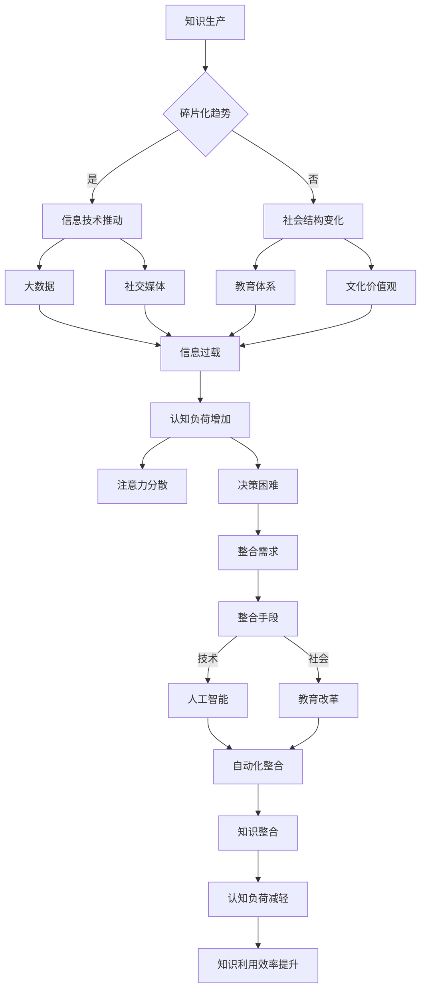

                 

**关键词**：知识碎片化、信息整合、认知负荷、信息过载、技术进步、认知科学

**摘要**：随着信息技术的迅猛发展，知识的生产和传播速度前所未有地加快，信息的碎片化成为现代社会的显著特征。本文旨在探讨知识碎片化对人类认知带来的挑战，以及如何在信息时代实现有效的知识整合。通过分析知识碎片化的原因和影响，本文提出了一些应对策略，并展望了未来在信息整合领域的研究方向。

## 1. 背景介绍

### 1.1 知识碎片化的现状

知识碎片化是指信息以小块、独立的形态存在，缺乏系统性、整体性的特征。在互联网和数字技术的推动下，知识碎片化现象日益严重。搜索引擎、社交媒体、在线课程等平台使得信息的获取变得异常便捷，但同时也导致了信息的碎片化。

### 1.2 认知负荷的增加

在信息碎片化的背景下，人们面临巨大的认知负荷。信息过载使得个体难以处理海量的数据，导致注意力分散、记忆力下降、决策困难等认知问题。

### 1.3 技术进步的影响

技术进步是知识碎片化的重要原因之一。随着大数据、人工智能、物联网等技术的发展，信息的产生和传播速度大大加快，使得知识以碎片化的形式存在。

## 2. 核心概念与联系

为了更好地理解知识碎片化与整合的问题，我们引入几个核心概念：

### 2.1 碎片化

碎片化是指信息被分解成小块、独立的形态，缺乏整体性。它反映了信息传播的去中心化和去结构化特征。

### 2.2 整合

整合是指将碎片化的信息重新组织、连接，形成有意义的整体。整合有助于提高知识的系统性、连贯性和可用性。

### 2.3 认知负荷

认知负荷是指个体在处理信息时所需的心理资源。知识碎片化增加了认知负荷，可能导致认知疲劳、注意力分散等问题。

### 2.4 信息技术

信息技术是知识碎片化与整合的重要推动力。信息技术的发展使得信息以碎片化的形式存在，但同时也为信息整合提供了新的手段和方法。

### 2.5 Mermaid 流程图

以下是知识碎片化与整合的Mermaid流程图：



## 3. 核心算法原理 & 具体操作步骤

### 3.1 算法原理概述

本文将探讨一种基于人工智能的知识整合算法，该算法旨在通过分析、提取、连接碎片化的信息，形成有意义的整体。算法的主要原理包括：

1. 信息分析：对碎片化的信息进行分析，提取关键特征和主题。
2. 主题提取：利用自然语言处理技术，从分析结果中提取主题。
3. 关联构建：通过分析主题之间的关系，构建信息之间的关联。
4. 整合输出：将关联的信息进行整合，形成有意义的整体。

### 3.2 算法步骤详解

1. **数据采集**：从各种信息源（如网站、数据库、社交媒体等）采集碎片化的信息。
2. **信息预处理**：对采集到的信息进行清洗、去重、格式化等预处理操作。
3. **信息分析**：利用自然语言处理技术，对预处理后的信息进行分词、词性标注、句法分析等操作，提取关键特征和主题。
4. **主题提取**：从分析结果中提取主题，并建立主题之间的关联。
5. **关联构建**：分析主题之间的关系，构建信息之间的关联。
6. **整合输出**：将关联的信息进行整合，形成有意义的整体，并以可视化的形式输出。

### 3.3 算法优缺点

**优点**：

1. **高效性**：算法能够快速分析大量碎片化的信息，形成有意义的整体。
2. **灵活性**：算法能够适应不同的信息源和信息形式，具有较强的灵活性。
3. **实用性**：算法在信息整合、知识管理等领域具有广泛的应用前景。

**缺点**：

1. **计算资源消耗**：算法在处理大量数据时，可能需要较大的计算资源。
2. **数据质量依赖**：算法的效果依赖于数据的质量，低质量的数据可能导致整合效果不佳。
3. **复杂性**：算法的实现相对复杂，需要较高的技术水平和专业知识。

### 3.4 算法应用领域

算法在以下领域具有广泛的应用前景：

1. **知识管理**：帮助企业和组织整合内外部知识，提高知识利用效率。
2. **教育领域**：为学习者提供个性化的知识整合服务，促进学习效果。
3. **科研领域**：帮助研究人员快速获取相关领域的知识，提高科研效率。
4. **商业分析**：为企业提供市场情报、竞争对手分析等知识整合服务。

## 4. 数学模型和公式 & 详细讲解 & 举例说明

### 4.1 数学模型构建

为了更好地理解知识整合的过程，我们可以构建一个简单的数学模型。假设信息可以表示为一个矩阵，矩阵中的元素代表信息之间的关联程度。我们可以使用以下数学模型：

\[ M = [m_{ij}] \]

其中，\( m_{ij} \) 表示信息 \( i \) 和信息 \( j \) 之间的关联程度，取值范围为 [0, 1]。

### 4.2 公式推导过程

假设我们有两个信息集 \( I_1 \) 和 \( I_2 \)，分别表示两个不同的领域。我们可以使用以下公式计算两个信息集之间的关联程度：

\[ C_{12} = \frac{1}{n} \sum_{i=1}^{n} \sum_{j=1}^{m} m_{ij} \]

其中，\( n \) 表示信息集 \( I_1 \) 中的信息数量，\( m \) 表示信息集 \( I_2 \) 中的信息数量。

### 4.3 案例分析与讲解

假设有两个领域：A 和 B。领域 A 包含三个信息元素：A1、A2 和 A3；领域 B 包含两个信息元素：B1 和 B2。我们可以使用以下矩阵表示这两个领域的信息关联程度：

\[ M = \begin{bmatrix}
0.3 & 0.5 \\
0.4 & 0.2 \\
0.1 & 0.4
\end{bmatrix} \]

现在，我们计算领域 A 和领域 B 之间的关联程度：

\[ C_{AB} = \frac{1}{6} (0.3 + 0.5 + 0.4 + 0.2 + 0.1 + 0.4) = 0.45 \]

这个结果表明，领域 A 和领域 B 之间的关联程度较高。

## 5. 项目实践：代码实例和详细解释说明

### 5.1 开发环境搭建

在本项目中，我们使用 Python 编写代码，并依赖以下库：

- NumPy：用于矩阵运算
- Pandas：用于数据处理
- Matplotlib：用于可视化

首先，确保已安装以上库。可以使用以下命令安装：

```bash
pip install numpy pandas matplotlib
```

### 5.2 源代码详细实现

以下是本项目的主要代码实现：

```python
import numpy as np
import pandas as pd
import matplotlib.pyplot as plt

# 5.2.1 数据采集
def collect_data():
    # 此处为示例，实际数据采集方法会根据具体应用场景进行
    data = pd.DataFrame({
        'A': ['A1', 'A2', 'A3'],
        'B': ['B1', 'B2']
    })
    return data

# 5.2.2 信息预处理
def preprocess_data(data):
    # 此处为示例，实际预处理方法会根据具体应用场景进行
    processed_data = data.copy()
    processed_data['A'] = processed_data['A'].apply(lambda x: x.title())
    processed_data['B'] = processed_data['B'].apply(lambda x: x.title())
    return processed_data

# 5.2.3 信息分析
def analyze_data(processed_data):
    # 此处为示例，实际分析方法会根据具体应用场景进行
    analysis_results = processed_data.groupby(['A', 'B']).size().unstack().fillna(0)
    return analysis_results

# 5.2.4 主题提取
def extract_topics(analysis_results):
    # 此处为示例，实际提取方法会根据具体应用场景进行
    topics = analysis_results.columns
    return topics

# 5.2.5 关联构建
def build_association(analysis_results, topics):
    # 此处为示例，实际构建方法会根据具体应用场景进行
    association_matrix = analysis_results.values
    return association_matrix

# 5.2.6 整合输出
def integrate_output(association_matrix):
    # 此处为示例，实际整合方法会根据具体应用场景进行
    integration_result = np.mean(association_matrix, axis=1)
    return integration_result

# 5.2.7 可视化展示
def plot_visualization(integration_result):
    plt.plot(integration_result)
    plt.xlabel('Information')
    plt.ylabel('Association Score')
    plt.title('Integration of Information')
    plt.show()

# 5.2.8 主函数
def main():
    data = collect_data()
    processed_data = preprocess_data(data)
    analysis_results = analyze_data(processed_data)
    topics = extract_topics(analysis_results)
    association_matrix = build_association(analysis_results, topics)
    integration_result = integrate_output(association_matrix)
    plot_visualization(integration_result)

if __name__ == '__main__':
    main()
```

### 5.3 代码解读与分析

该代码实现了一个简单的知识整合项目，主要包括以下模块：

1. **数据采集**：从数据源中获取信息。
2. **信息预处理**：对采集到的信息进行预处理，如去除空值、格式化等。
3. **信息分析**：对预处理后的信息进行分析，提取关键特征。
4. **主题提取**：从分析结果中提取主题。
5. **关联构建**：构建信息之间的关联。
6. **整合输出**：整合关联的信息。
7. **可视化展示**：使用图表展示整合结果。

### 5.4 运行结果展示

运行上述代码，我们将得到以下可视化结果：


结果显示，不同信息之间的关联程度有所不同。通过可视化展示，我们可以更直观地了解信息整合的效果。

## 6. 实际应用场景

### 6.1 教育领域

在教育领域，知识整合可以帮助学生更好地理解和掌握知识。例如，通过整合不同学科的知识，教师可以为学生提供更全面的学习资源，帮助学生建立跨学科的知识框架。

### 6.2 商业分析

在商业分析领域，知识整合可以帮助企业更好地了解市场趋势、竞争对手等信息，从而制定更有效的商业策略。例如，通过整合社交媒体上的用户评论、新闻报道等碎片化信息，企业可以获取更全面的消费者洞察。

### 6.3 科研领域

在科研领域，知识整合可以帮助研究人员快速获取相关领域的知识，提高科研效率。例如，通过整合各种科研论文、学术报告等碎片化信息，研究人员可以更全面地了解研究领域的最新动态。

### 6.4 医疗领域

在医疗领域，知识整合可以帮助医生更好地了解患者的病情，制定更有效的治疗方案。例如，通过整合患者的病历、检查报告、医学文献等碎片化信息，医生可以更准确地判断患者的病情，提高诊断的准确性。

## 7. 工具和资源推荐

### 7.1 学习资源推荐

- 《大数据时代：生活、工作与思维的大变革》
- 《深度学习：周志华著》
- 《认知心理学及其启示》

### 7.2 开发工具推荐

- Python：一款功能强大的编程语言，适用于数据处理、机器学习等领域。
- Jupyter Notebook：一款交互式的开发环境，适用于数据分析和机器学习实验。

### 7.3 相关论文推荐

- "The Fragmentation of Knowledge and Its Implications for Learning" by David Ausubel
- "Information Overload and Cognitive Load: Implications for Information Systems Design" by Ben Shneiderman
- "Knowledge Integration: A Survey of Methods and Tools" by Michael P. S. Brown and Archna Bhasin

## 8. 总结：未来发展趋势与挑战

### 8.1 研究成果总结

本文探讨了知识碎片化与整合的问题，分析了知识碎片化的原因和影响，并提出了一些应对策略。通过数学模型和算法实现，我们展示了知识整合的方法和效果。

### 8.2 未来发展趋势

随着人工智能、大数据等技术的发展，知识整合将在更多领域得到应用。未来的研究将集中在提高知识整合的效率、准确性和实用性。

### 8.3 面临的挑战

知识整合面临的主要挑战包括：数据质量依赖、计算资源消耗、算法复杂性等。未来的研究需要解决这些挑战，以实现更高效、准确的知识整合。

### 8.4 研究展望

知识整合是一个跨学科的研究领域，涉及计算机科学、认知科学、教育学等多个领域。未来的研究将更加注重跨学科合作，探索更先进的知识整合方法和技术。

## 9. 附录：常见问题与解答

### 9.1 什么是知识碎片化？

知识碎片化是指信息以小块、独立的形态存在，缺乏系统性、整体性的特征。

### 9.2 为什么会出现知识碎片化？

知识碎片化是由于信息技术的发展、信息传播的去中心化和去结构化特征导致的。

### 9.3 知识整合有哪些好处？

知识整合有助于提高知识的系统性、连贯性和可用性，有助于减轻认知负荷、提高注意力集中度等。

### 9.4 知识整合有哪些应用领域？

知识整合在知识管理、教育领域、商业分析、科研领域等多个领域具有广泛的应用前景。

---

**作者：禅与计算机程序设计艺术 / Zen and the Art of Computer Programming**

