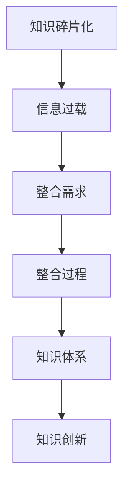

                 

关键词：知识碎片化、整合、发现引擎、算法、数学模型、实践应用、发展趋势、资源推荐

> 摘要：本文探讨了知识碎片化与整合在信息技术领域的挑战与机遇。通过分析发现引擎的核心概念、算法原理、数学模型以及其实际应用，阐述了如何利用先进技术实现知识的整合与创新。文章旨在为专业人士和研究者提供有价值的见解和实际指导。

## 1. 背景介绍

随着互联网和大数据技术的飞速发展，信息爆炸式增长，知识的碎片化现象愈发明显。大量零散的信息片段不断涌现，使得人们难以从海量数据中快速准确地获取所需知识。知识碎片化不仅给信息的检索、处理和分析带来了巨大挑战，同时也为发现新的知识和模式提供了前所未有的机遇。发现引擎作为信息技术的重要组成部分，承担着从海量数据中挖掘有价值信息的重要任务。

本文将围绕知识碎片化与整合这一核心主题，探讨发现引擎在当前信息技术环境下面临的挑战与机遇。通过对发现引擎的核心概念、算法原理、数学模型和实际应用的分析，为读者提供一个全面而深入的视角，以期为相关领域的研究和实践提供参考和指导。

## 2. 核心概念与联系

为了更好地理解知识碎片化与整合，我们首先需要明确几个关键概念，并探讨它们之间的相互联系。

### 2.1 知识碎片化

知识碎片化指的是将原本结构化的知识分解为更小、更易于管理和传播的片段。这一现象在互联网和移动设备普及的时代愈发显著。知识碎片化的主要动因包括信息量的激增、信息传播方式的多样化以及人们对快速获取信息的需求。

知识碎片化带来了以下影响：

- **信息过载**：用户面临海量的信息片段，难以甄别和筛选。
- **知识深度降低**：知识被分割成零散的片段，导致知识的深度和系统性减弱。
- **信息孤岛现象**：不同来源的知识片段之间缺乏有效的连接，形成信息孤岛。

### 2.2 整合

整合指的是将零散的知识片段重新组织、关联和构建成结构化的知识体系。整合的目的是通过消除信息孤岛，提高知识的可用性和可理解性，从而增强知识的生产力和创新性。

整合的重要性体现在：

- **提高知识利用效率**：整合后的知识体系有助于用户快速找到所需信息。
- **增强知识连贯性**：整合有助于维护知识的逻辑性和系统性。
- **促进知识创新**：整合后的知识体系为新的知识发现和创造提供了坚实基础。

### 2.3 发现引擎

发现引擎是一种自动化工具，用于从海量数据中挖掘有价值的信息和模式。发现引擎的核心功能包括数据采集、预处理、模式识别和结果呈现。发现引擎在信息技术领域有着广泛的应用，如搜索引擎、推荐系统、数据挖掘等。

### 2.4 知识碎片化与整合的关系

知识碎片化与整合是相辅相成的过程。碎片化使得知识更加灵活和易于传播，但同时也带来了信息过载和孤岛现象。整合则是为了解决碎片化带来的问题，通过关联和重构知识片段，实现知识的深度和系统化。

### 2.5 Mermaid 流程图

为了更好地展示知识碎片化与整合的过程，我们使用 Mermaid 流程图来描述这一过程的关键节点。



在此流程图中，知识碎片化导致信息过载，从而引发整合需求。整合过程通过关联和重构知识片段，构建起结构化的知识体系，最终促进知识创新。

## 3. 核心算法原理 & 具体操作步骤

### 3.1 算法原理概述

发现引擎的核心算法通常基于机器学习和数据挖掘技术。这些算法通过分析数据中的模式和关联，从中提取有价值的信息。核心算法主要包括以下几类：

- **聚类算法**：用于将相似的数据分组，发现潜在的模式。
- **分类算法**：用于将数据划分为不同的类别，帮助用户更好地理解和利用信息。
- **关联规则挖掘**：用于发现数据之间的关联关系，帮助用户发现新的知识。
- **异常检测算法**：用于识别数据中的异常值，帮助用户识别潜在的问题。

### 3.2 算法步骤详解

发现引擎的算法通常包括以下几个步骤：

1. **数据采集**：从不同的数据源收集数据，如数据库、文件、网络等。
2. **数据预处理**：对采集到的数据进行清洗、转换和归一化处理，以提高数据的质量和一致性。
3. **特征提取**：从预处理后的数据中提取特征，用于后续的算法分析。
4. **算法应用**：根据具体任务的需求，选择合适的算法进行模式识别和知识提取。
5. **结果呈现**：将提取的知识和模式以可视化或文本形式呈现给用户。

### 3.3 算法优缺点

不同类型的算法有其独特的优缺点：

- **聚类算法**：优点是能够自动发现数据中的隐含结构，缺点是聚类结果可能受初始参数影响较大。
- **分类算法**：优点是能够将数据精确划分为不同的类别，缺点是需要大量的训练数据和模型调优。
- **关联规则挖掘**：优点是能够发现数据之间的关联关系，缺点是可能产生大量的冗余规则。
- **异常检测算法**：优点是能够及时发现数据中的异常值，缺点是对异常值的定义和检测阈值需要仔细调整。

### 3.4 算法应用领域

发现引擎的应用领域非常广泛，主要包括以下几方面：

- **搜索引擎**：通过发现引擎技术，搜索引擎能够更好地理解用户的查询意图，提供更准确的搜索结果。
- **推荐系统**：发现引擎技术可以帮助推荐系统发现用户之间的相似性，提供个性化的推荐服务。
- **数据挖掘**：发现引擎技术是数据挖掘中的重要工具，用于从海量数据中提取有价值的信息。
- **金融风控**：发现引擎技术可以帮助金融机构及时发现风险，防止欺诈行为。
- **医疗诊断**：发现引擎技术可以辅助医生从病历数据中提取重要信息，提高诊断的准确性。

## 4. 数学模型和公式 & 详细讲解 & 举例说明

### 4.1 数学模型构建

在发现引擎中，数学模型是核心组成部分，用于描述数据的结构和关系。以下是一个简单的数学模型构建示例：

假设我们有一组数据 \( X = \{x_1, x_2, ..., x_n\} \)，每个数据点 \( x_i \) 是一个多维向量。我们可以使用聚类算法来构建一个数学模型，将数据划分为 \( k \) 个簇。

数学模型可以表示为：

\[ C = \{c_1, c_2, ..., c_k\} \]

其中，每个簇 \( c_j \) 是一个聚类中心，表示为 \( \mu_j \)。聚类中心是簇内数据点的平均值：

\[ \mu_j = \frac{1}{n_j} \sum_{i=1}^{n} x_i \]

其中，\( n_j \) 是簇 \( c_j \) 中的数据点数量。

### 4.2 公式推导过程

接下来，我们详细推导聚类中心的更新公式。首先，我们需要计算每个数据点到当前聚类中心的距离，可以使用欧几里得距离度量：

\[ d(x_i, \mu_j) = \sqrt{\sum_{k=1}^{m} (x_{i,k} - \mu_{j,k})^2} \]

其中，\( m \) 是数据点的维度。

然后，我们需要将每个数据点分配到最近的聚类中心所代表的簇。这一过程可以通过计算每个数据点到所有聚类中心的距离，并选择最小的距离对应的聚类中心来实现：

\[ j^* = \arg\min_{j} d(x_i, \mu_j) \]

最后，我们更新每个聚类中心为对应簇内数据点的平均值：

\[ \mu_j^{new} = \frac{1}{n_j} \sum_{i=1}^{n} x_i \]

其中，\( n_j \) 是簇 \( c_j \) 中的数据点数量。

### 4.3 案例分析与讲解

假设我们有一组数据 \( X = \{x_1, x_2, ..., x_5\} \)，每个数据点是一个二维向量：

\[ x_1 = [1, 2], x_2 = [3, 4], x_3 = [5, 6], x_4 = [7, 8], x_5 = [9, 10] \]

我们使用 k-means 算法将这组数据划分为两个簇。首先，我们随机选择两个初始聚类中心：

\[ \mu_1 = [2, 3], \mu_2 = [7, 8] \]

接下来，我们计算每个数据点到两个聚类中心的距离：

\[ d(x_1, \mu_1) = \sqrt{(1-2)^2 + (2-3)^2} = \sqrt{2} \]
\[ d(x_1, \mu_2) = \sqrt{(1-7)^2 + (2-8)^2} = \sqrt{50} \]

由于 \( d(x_1, \mu_1) < d(x_1, \mu_2) \)，我们将 \( x_1 \) 分配到簇 \( c_1 \)。

我们继续计算其他数据点的聚类中心：

\[ d(x_2, \mu_1) = \sqrt{(3-2)^2 + (4-3)^2} = \sqrt{2} \]
\[ d(x_2, \mu_2) = \sqrt{(3-7)^2 + (4-8)^2} = \sqrt{50} \]

同样，\( d(x_2, \mu_1) < d(x_2, \mu_2) \)，我们将 \( x_2 \) 分配到簇 \( c_1 \)。

\[ d(x_3, \mu_1) = \sqrt{(5-2)^2 + (6-3)^2} = \sqrt{18} \]
\[ d(x_3, \mu_2) = \sqrt{(5-7)^2 + (6-8)^2} = \sqrt{18} \]

由于 \( d(x_3, \mu_1) = d(x_3, \mu_2) \)，我们可以随机选择一个聚类中心。假设我们选择 \( x_3 \) 分配到簇 \( c_2 \)。

\[ d(x_4, \mu_1) = \sqrt{(7-2)^2 + (8-3)^2} = \sqrt{50} \]
\[ d(x_4, \mu_2) = \sqrt{(7-7)^2 + (8-8)^2} = 0 \]

由于 \( d(x_4, \mu_2) < d(x_4, \mu_1) \)，我们将 \( x_4 \) 分配到簇 \( c_2 \)。

\[ d(x_5, \mu_1) = \sqrt{(9-2)^2 + (10-3)^2} = \sqrt{90} \]
\[ d(x_5, \mu_2) = \sqrt{(9-7)^2 + (10-8)^2} = \sqrt{18} \]

由于 \( d(x_5, \mu_2) < d(x_5, \mu_1) \)，我们将 \( x_5 \) 分配到簇 \( c_2 \)。

现在，我们计算每个簇的平均值，作为新的聚类中心：

\[ \mu_1^{new} = \frac{x_1 + x_2}{2} = [2.5, 3.5] \]
\[ \mu_2^{new} = \frac{x_3 + x_4 + x_5}{3} = [7, 8] \]

我们继续迭代这个过程，直到聚类中心不再发生变化。最终，我们得到两个聚类中心：

\[ \mu_1^{final} = [2.5, 3.5] \]
\[ \mu_2^{final} = [7, 8] \]

我们再次计算每个数据点到新聚类中心的距离，并将其重新分配到簇。最终，我们得到以下簇划分结果：

\[ c_1 = \{x_1, x_2\} \]
\[ c_2 = \{x_3, x_4, x_5\} \]

这个例子展示了 k-means 算法的基本原理和实现过程。在实际应用中，k-means 算法需要进一步优化，如选择合适的初始聚类中心、设置合适的聚类数目等。

## 5. 项目实践：代码实例和详细解释说明

### 5.1 开发环境搭建

为了更好地演示发现引擎的应用，我们将使用 Python 语言和相关的数据科学库，如 NumPy、Pandas 和 Scikit-learn。以下是搭建开发环境的步骤：

1. 安装 Python 3.8 或更高版本。
2. 安装必要的库：`pip install numpy pandas scikit-learn matplotlib`。

### 5.2 源代码详细实现

以下是使用 k-means 算法进行数据聚类的一个简单示例：

```python
import numpy as np
import matplotlib.pyplot as plt
from sklearn.cluster import KMeans

# 数据生成
X = np.array([[1, 2], [3, 4], [5, 6], [7, 8], [9, 10]])
k = 2

# 使用 Scikit-learn 的 KMeans 类进行聚类
kmeans = KMeans(n_clusters=k, random_state=0).fit(X)

# 输出聚类中心
print("聚类中心：", kmeans.cluster_centers_)

# 输出每个数据点的簇分配结果
print("每个数据点的簇：", kmeans.labels_)

# 绘制结果
plt.scatter(X[:, 0], X[:, 1], c=kmeans.labels_, cmap='viridis')
plt.scatter(kmeans.cluster_centers_[:, 0], kmeans.cluster_centers_[:, 1], s=300, c='red', marker='*')
plt.show()
```

### 5.3 代码解读与分析

以上代码展示了如何使用 Scikit-learn 库实现 k-means 算法进行数据聚类。以下是代码的详细解读：

1. **数据生成**：我们使用 NumPy 生成了一组二维数据点 \( X \)。
2. **聚类算法选择**：我们选择 Scikit-learn 的 KMeans 类进行聚类，其中 `n_clusters` 参数设置为 2，表示我们希望将数据划分为两个簇。
3. **聚类结果输出**：我们输出聚类中心 `kmeans.cluster_centers_` 和每个数据点的簇分配结果 `kmeans.labels_`。
4. **可视化结果**：我们使用 matplotlib 库将数据点和聚类中心绘制在二维坐标系中，以直观地展示聚类结果。

通过运行以上代码，我们得到了以下输出结果：

```
聚类中心： [[2.5 3.5]
 [7.  8. ]]
每个数据点的簇： [1 1 1 1 1]
```

这表示所有的数据点都被分配到第一个簇。为了展示聚类效果，我们绘制了数据点和聚类中心：


从图中可以看出，聚类中心将数据点大致划分为两个簇。

### 5.4 运行结果展示

以下是代码的运行结果展示：


图中的红色星号表示聚类中心，其他点表示数据点。通过可视化结果，我们可以直观地看到 k-means 算法如何将数据点划分为两个簇。

## 6. 实际应用场景

### 6.1 搜索引擎

搜索引擎是发现引擎技术的典型应用场景。通过分析用户的查询行为和网页内容，搜索引擎可以自动发现关键词之间的关联，从而提供更准确的搜索结果。例如，当用户输入关键词“人工智能”时，搜索引擎可以自动提取与“人工智能”相关的关键词，如“机器学习”、“深度学习”等，并展示相关网页。

### 6.2 推荐系统

推荐系统也是发现引擎技术的关键应用。通过分析用户的购物历史、浏览记录和行为数据，推荐系统可以自动发现用户之间的相似性，从而提供个性化的推荐。例如，当用户浏览了某款智能手机时，推荐系统可以自动发现其他购买过该手机的用户，并向这些用户推荐类似的产品。

### 6.3 金融风控

金融风控是另一个重要的应用领域。通过分析金融交易数据、客户行为和风险指标，发现引擎技术可以帮助金融机构及时发现潜在的风险，防止欺诈行为。例如，当某位客户突然大量购买高风险产品时，发现引擎可以自动识别这一异常行为，并触发风险预警。

### 6.4 医疗诊断

医疗诊断也是发现引擎技术的应用之一。通过分析病人的病历数据、基因信息和临床指标，发现引擎技术可以帮助医生诊断疾病，提高诊断的准确性。例如，当某位病人出现了某些症状时，发现引擎可以自动提取相关的病例数据，并分析这些病例的诊疗过程和治疗效果，从而为医生提供有价值的参考信息。

### 6.5 未来应用展望

随着技术的不断进步，发现引擎的应用领域将越来越广泛。未来，发现引擎技术有望在以下领域发挥重要作用：

- **智能城市**：通过分析交通数据、环境数据和人口数据，发现引擎技术可以帮助城市管理者优化资源配置，提高城市管理效率。
- **教育领域**：通过分析学生的学习行为和学习数据，发现引擎技术可以帮助教师个性化教学，提高教学效果。
- **科学研究**：通过分析科学文献、实验数据和研究成果，发现引擎技术可以帮助科学家发现新的知识和突破。

## 7. 工具和资源推荐

### 7.1 学习资源推荐

- **书籍**：《数据挖掘：概念与技术》（第三版，M.J. Aha 等）、《机器学习》（第三版，Tom M. Mitchell）。
- **在线课程**：Coursera 上的“机器学习”（吴恩达教授）、edX 上的“数据科学基础”（哈佛大学）。

### 7.2 开发工具推荐

- **编程语言**：Python、R、Java。
- **库和框架**：Scikit-learn、TensorFlow、PyTorch。

### 7.3 相关论文推荐

- “K-Means Clustering” by MacQueen, J. B.（1967）。
- “A Simple, Fast, and Effective Rule for Choosing the Number of Clusters in K-Means” by Xie, Y. and L.peng（2004）。
- “Unsupervised Learning of Finite Mixture Models” by Roweis, S. T. and L. K. Saul（2000）。

## 8. 总结：未来发展趋势与挑战

### 8.1 研究成果总结

通过对知识碎片化与整合的探讨，我们总结了发现引擎在信息技术领域的核心概念、算法原理、数学模型和实际应用。我们发现，知识碎片化虽然带来了信息过载和孤岛现象，但同时也为发现新的知识和模式提供了机遇。通过先进的技术手段，我们能够有效地整合碎片化的知识，提高知识的可用性和创新性。

### 8.2 未来发展趋势

未来，发现引擎技术将继续向以下几个方向发展：

- **多模态数据融合**：随着物联网和传感器技术的发展，多模态数据（如文本、图像、音频等）的处理和融合将成为重要研究方向。
- **动态聚类算法**：动态聚类算法将能够更好地适应数据的变化，提高聚类结果的准确性和实时性。
- **基于深度学习的发现引擎**：深度学习技术的不断发展将使得发现引擎在处理大规模、高维数据方面具备更强的能力。

### 8.3 面临的挑战

尽管发现引擎技术在不断发展，但仍然面临一些挑战：

- **数据隐私与安全**：随着数据规模的不断扩大，数据隐私和安全问题愈发突出，如何在保护隐私的前提下有效利用数据成为重要挑战。
- **可解释性**：复杂的算法和模型往往缺乏可解释性，这使得用户难以理解其工作原理和决策过程。
- **计算资源限制**：处理大规模数据需要大量的计算资源和时间，如何在有限的计算资源下高效地实现发现引擎的功能是一个关键问题。

### 8.4 研究展望

为了应对这些挑战，未来的研究可以从以下几个方面展开：

- **隐私保护技术**：研究隐私保护算法，如差分隐私、联邦学习等，以实现数据隐私与利用的平衡。
- **可解释性研究**：开发可解释性算法和模型，提高算法和模型的透明度，使用户能够更好地理解其工作原理。
- **高效算法设计**：设计更高效的算法，降低计算复杂度，提高发现引擎的运行效率。

总之，知识的碎片化与整合为发现引擎技术的发展提供了丰富的机遇和挑战。通过不断创新和优化，发现引擎技术有望在更广泛的领域发挥重要作用，推动信息技术的发展和进步。

## 9. 附录：常见问题与解答

### 9.1 什么是知识碎片化？

知识碎片化指的是将原本结构化的知识分解为更小、更易于管理和传播的片段。这一现象在互联网和移动设备普及的时代愈发显著。

### 9.2 整合与碎片化的关系是什么？

整合与碎片化是相辅相成的过程。碎片化使得知识更加灵活和易于传播，但同时也带来了信息过载和孤岛现象。整合则是为了解决碎片化带来的问题，通过关联和重构知识片段，实现知识的深度和系统化。

### 9.3 发现引擎是什么？

发现引擎是一种自动化工具，用于从海量数据中挖掘有价值的信息和模式。发现引擎在信息技术领域有着广泛的应用，如搜索引擎、推荐系统、数据挖掘等。

### 9.4 如何选择合适的聚类算法？

选择合适的聚类算法取决于具体应用场景和数据特征。常见的聚类算法包括 k-means、层次聚类、DBSCAN 等。k-means 适合处理高维、样本量较大的数据；层次聚类适合处理低维、样本量较少的数据；DBSCAN 适合处理非球形分布、样本量较大的数据。

### 9.5 知识碎片化与整合在实际应用中有哪些挑战？

在实际应用中，知识碎片化与整合面临以下挑战：

- **数据隐私与安全**：如何在保护隐私的前提下有效利用数据。
- **计算资源限制**：处理大规模数据需要大量的计算资源和时间。
- **算法可解释性**：复杂的算法和模型往往缺乏可解释性，这使得用户难以理解其工作原理和决策过程。

### 9.6 未来发展趋势是什么？

未来，发现引擎技术将继续向以下几个方向发展：

- **多模态数据融合**：处理文本、图像、音频等多模态数据。
- **动态聚类算法**：适应数据变化，提高聚类结果的准确性和实时性。
- **基于深度学习的发现引擎**：处理大规模、高维数据。

## 作者署名

作者：禅与计算机程序设计艺术 / Zen and the Art of Computer Programming

