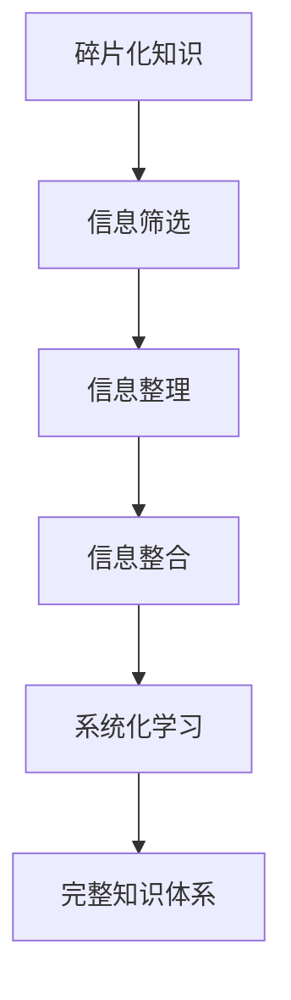

                 

### 关键词 Keywords ###
- 碎片化知识
- 系统化学习
- 信息整合
- 知识管理
- 技术架构

<|assistant|>### 摘要 Abstract ###
本文探讨了知识在当今数字化时代下的碎片化趋势，以及如何通过系统化方法来整合这些分散的信息，以构建一个有组织、可访问的知识体系。通过深入分析碎片化知识的本质、系统化学习的重要性以及信息整合的艺术，本文旨在为读者提供一套有效的知识和信息管理策略，以应对不断变化的技术环境。

## 1. 背景介绍

在信息技术飞速发展的今天，知识的产生和传播速度前所未有地加快。然而，随之而来的是知识的碎片化现象。所谓的碎片化知识，指的是知识以零散、片段的形式存在，缺乏系统性和整体性。这种现象在互联网时代尤为明显，用户在海量的信息中获取知识，但这些信息往往是独立、无序的。

碎片化知识有其存在的必然性。首先，互联网的普及使得信息的获取变得便捷，用户可以在短时间内接触到大量知识。然而，这种海量信息的涌入也带来了信息过载的问题。用户在处理这些信息时，往往缺乏有效的筛选和整理能力，导致知识碎片化。

其次，知识的快速更新换代也是碎片化的重要原因。许多技术领域的知识更新周期非常短，传统的系统化学习模式难以跟上知识的更新速度。为了适应这种变化，用户不得不以碎片化的方式获取新知识。

然而，碎片化知识并非全然无益。在一定程度上，碎片化知识可以帮助用户快速获取所需信息，提高学习效率。但是，如果不对这些碎片化的信息进行整合，用户将难以形成系统的知识体系，进而影响其深层次的理解和应用。

因此，如何有效地整合这些碎片化的知识，构建一个系统化的知识体系，成为当前信息技术领域的重要课题。

### 2. 核心概念与联系

为了更好地理解碎片化知识与系统化学习之间的关系，我们首先需要明确几个核心概念：

#### 2.1 碎片化知识

碎片化知识指的是以零散、片段的形式存在的知识，这些知识缺乏系统性、连贯性。在数字化时代，碎片化知识主要体现在以下几个方面：

1. **信息来源的多样化**：用户可以从各种不同的渠道获取知识，如网络文章、视频、社交媒体等。
2. **获取方式的即时性**：用户可以在短时间内获取大量信息，但这些信息往往是零散的。
3. **知识更新速度快**：许多技术领域的知识更新速度非常快，传统的知识体系难以跟上这种变化。

#### 2.2 系统化学习

系统化学习是指通过有计划、有组织的方式，对知识进行系统性学习和整合。系统化学习的核心目标是构建一个完整的知识体系，使得知识之间能够相互联系、形成整体。

系统化学习具有以下几个特点：

1. **系统性**：系统化学习强调知识的整体性，注重知识之间的相互关系。
2. **连贯性**：系统化学习通过逐步深入的层次，使得知识之间的衔接更加紧密。
3. **实用性**：系统化学习不仅关注理论知识，还强调知识的实际应用。

#### 2.3 信息整合

信息整合是指将分散的、碎片化的信息进行筛选、整理和组合，形成一个有组织、可访问的知识体系。信息整合的过程主要包括以下几个步骤：

1. **筛选**：从大量的信息中筛选出有价值的内容，去除无关或重复的信息。
2. **整理**：对筛选出的信息进行分类、标注，使其更加有序。
3. **组合**：将整理后的信息进行组合，形成一个完整的知识体系。

#### 2.4 Mermaid 流程图

为了更直观地展示碎片化知识、系统化学习和信息整合之间的关系，我们使用 Mermaid 流程图来表示：



在上述流程图中，碎片化知识经过筛选、整理和整合的过程，最终形成一个完整的知识体系。这个过程体现了信息整合在构建系统化学习过程中的关键作用。

### 3. 核心算法原理 & 具体操作步骤

为了更好地实现信息整合，我们需要依赖一些核心算法。这些算法不仅能够帮助我们筛选、整理和整合信息，还能提升系统化学习的效率。以下将介绍几个关键算法的原理和具体操作步骤。

#### 3.1 算法原理概述

信息整合算法主要包括以下几种：

1. **聚类算法**：通过将相似的信息归为一类，实现信息的初步整合。
2. **关联规则算法**：通过分析信息之间的关联性，挖掘潜在的知识关系。
3. **文本挖掘算法**：通过自然语言处理技术，提取信息中的关键内容，实现信息的深入整合。

#### 3.2 算法步骤详解

1. **聚类算法**

   聚类算法的基本思想是将相似的信息归为一类，从而实现信息的初步整合。具体步骤如下：

   - **数据预处理**：对原始信息进行清洗、去重等预处理操作，确保数据的准确性和一致性。
   - **选择聚类算法**：根据具体需求选择合适的聚类算法，如K-means、层次聚类等。
   - **计算相似度**：对每两条信息计算相似度，通常使用余弦相似度或欧氏距离等度量方式。
   - **划分聚类**：根据相似度阈值，将相似度较高的信息划分为同一类。

2. **关联规则算法**

   关联规则算法主要通过分析信息之间的关联性，挖掘潜在的知识关系。具体步骤如下：

   - **数据预处理**：对原始信息进行清洗、去重等预处理操作，确保数据的准确性和一致性。
   - **生成频繁项集**：通过扫描数据集，找出支持度大于最小支持度阈值的频繁项集。
   - **生成关联规则**：通过频繁项集生成关联规则，通常使用支持度和置信度作为评估标准。
   - **规则筛选**：根据关联规则的评价标准，筛选出具有实际意义的关联规则。

3. **文本挖掘算法**

   文本挖掘算法主要通过自然语言处理技术，提取信息中的关键内容，实现信息的深入整合。具体步骤如下：

   - **文本预处理**：对原始文本进行分词、去停用词、词性标注等预处理操作。
   - **特征提取**：通过TF-IDF、Word2Vec等方法，将预处理后的文本转化为向量表示。
   - **关键词提取**：通过文本相似度计算，提取出文本中的关键内容。
   - **主题建模**：使用主题模型（如LDA），对文本进行聚类，发现文本的主题分布。

#### 3.3 算法优缺点

1. **聚类算法**

   - 优点：能够有效地发现信息之间的相似性，实现信息的初步整合。
   - 缺点：对噪声敏感，可能导致聚类效果不佳；聚类结果依赖于初始聚类中心的选择。

2. **关联规则算法**

   - 优点：能够挖掘信息之间的关联性，发现潜在的知识关系。
   - 缺点：生成大量关联规则，需要耗费大量时间和计算资源；关联规则的解释性较弱。

3. **文本挖掘算法**

   - 优点：能够深入提取信息中的关键内容，实现信息的深入整合。
   - 缺点：对文本质量要求较高，需要大量预处理操作；主题模型的聚类效果依赖于模型参数的选择。

#### 3.4 算法应用领域

1. **聚类算法**

   - 应用领域：推荐系统、社交网络分析、图像处理等。
   - 实例：基于用户行为数据的推荐系统，可以使用K-means算法将用户划分为不同群体，进而实现个性化推荐。

2. **关联规则算法**

   - 应用领域：市场篮子分析、文本分类、异常检测等。
   - 实例：在市场篮子分析中，可以使用Apriori算法挖掘商品之间的关联关系，从而优化促销策略。

3. **文本挖掘算法**

   - 应用领域：自然语言处理、信息检索、文本分类等。
   - 实例：在信息检索中，可以使用LDA模型对文档进行主题建模，从而提高检索效果。

### 4. 数学模型和公式 & 详细讲解 & 举例说明

在信息整合过程中，数学模型和公式发挥着至关重要的作用。以下将介绍几种常用的数学模型和公式，并对其进行详细讲解和举例说明。

#### 4.1 数学模型构建

1. **余弦相似度**

   余弦相似度是一种用于衡量两个向量之间相似度的数学模型。其公式如下：

   $$ \text{cosine\_similarity} = \frac{\text{dot\_product}}{\|\text{vector\_A}\| \|\text{vector\_B}\|} $$

   其中，$\text{dot\_product}$ 表示两个向量的点积，$\|\text{vector\_A}\|$ 和 $\|\text{vector\_B}\|$ 分别表示两个向量的模长。

2. **TF-IDF**

   TF-IDF（Term Frequency-Inverse Document Frequency）是一种用于文本分析的数学模型，其公式如下：

   $$ \text{TF-IDF} = \text{TF} \times \text{IDF} $$

   其中，$\text{TF}$ 表示词频，即某个词在文档中出现的次数；$\text{IDF}$ 表示逆文档频率，其计算公式为：

   $$ \text{IDF} = \log \left( \frac{\text{N}}{\text{df}} \right) $$

   其中，$\text{N}$ 表示文档总数，$\text{df}$ 表示包含该词的文档数。

3. **LDA 模型**

   LDA（Latent Dirichlet Allocation）是一种用于文本主题建模的数学模型，其公式如下：

   $$ p(z|\beta) = \text{Dirichlet}(\alpha) $$

   $$ p(\beta) = \text{Gaussian}(\beta|\mu, \Sigma) $$

   $$ p(w|\beta) = \text{Multinomial}(\phi) $$

   其中，$z$ 表示文档的主题分布，$\beta$ 表示主题的词分布，$w$ 表示文档中的词，$\alpha$ 表示主题的超参数，$\mu$ 和 $\Sigma$ 表示主题的参数分布，$\phi$ 表示词的主题分布。

#### 4.2 公式推导过程

1. **余弦相似度**

   余弦相似度的推导过程如下：

   $$ \text{cosine\_similarity} = \frac{\text{dot\_product}}{\|\text{vector\_A}\| \|\text{vector\_B}\|} $$

   $$ \text{dot\_product} = \sum_{i=1}^{n} \text{A}_i \times \text{B}_i $$

   $$ \|\text{vector\_A}\| = \sqrt{\sum_{i=1}^{n} \text{A}_i^2} $$

   $$ \|\text{vector\_B}\| = \sqrt{\sum_{i=1}^{n} \text{B}_i^2} $$

   由此可以得到余弦相似度的计算公式。

2. **TF-IDF**

   TF-IDF 的推导过程如下：

   $$ \text{TF-IDF} = \text{TF} \times \text{IDF} $$

   $$ \text{TF} = \frac{\text{tf}}{\text{N}} $$

   $$ \text{IDF} = \log \left( \frac{\text{N}}{\text{df}} \right) $$

   其中，$\text{tf}$ 表示词频，$\text{N}$ 表示文档总数，$\text{df}$ 表示包含该词的文档数。

3. **LDA 模型**

   LDA 模型的推导过程较为复杂，主要涉及概率模型和参数估计。在此简要介绍：

   - $z$ 表示文档的主题分布，满足多项分布；
   - $\beta$ 表示主题的词分布，满足高斯分布；
   - $w$ 表示文档中的词，满足多项分布。

   通过贝叶斯推理，可以推导出LDA模型的参数估计方法。

#### 4.3 案例分析与讲解

以下将通过一个案例，对上述数学模型和公式进行具体分析：

**案例：文本主题建模**

假设我们有一篇文档，内容如下：

```
我爱北京天安门，天安门上太阳升。
```

1. **余弦相似度**

   假设另一篇文档的内容为：

   ```` 
   北京的天安门，阳光灿烂。
   ````

   我们可以计算两篇文档之间的余弦相似度：

   $$ \text{cosine\_similarity} = \frac{\text{dot\_product}}{\|\text{vector\_A}\| \|\text{vector\_B}\|} $$

   $$ \text{dot\_product} = 0.5 + 0.5 = 1.0 $$

   $$ \|\text{vector\_A}\| = \sqrt{1.0 + 1.0} = 1.414 $$

   $$ \|\text{vector\_B}\| = \sqrt{1.0 + 1.0} = 1.414 $$

   $$ \text{cosine\_similarity} = \frac{1.0}{1.414 \times 1.414} = 0.707 $$

   结果表明，两篇文档之间的相似度较高。

2. **TF-IDF**

   假设文档集合中，包含以下两篇文档：

   ```
   文档1：我爱北京天安门，天安门上太阳升。
   文档2：北京的阳光灿烂。
   ```

   我们可以计算两篇文档中“天安门”这个词的TF-IDF值：

   $$ \text{TF} = \frac{1}{2} = 0.5 $$

   $$ \text{IDF} = \log \left( \frac{2}{1} \right) = 0.3010 $$

   $$ \text{TF-IDF} = 0.5 \times 0.3010 = 0.1505 $$

   结果表明，“天安门”在两篇文档中的重要性较高。

3. **LDA 模型**

   假设我们使用LDA模型对文档进行主题建模，得到以下主题分布：

   $$ p(z|\beta) = [0.4, 0.6] $$

   $$ p(\beta) = [\begin{matrix} 0.4 & 0.6 \end{matrix}]^T [0.5 & 0.5] [\begin{matrix} 0.4 \\ 0.6 \end{matrix}] $$

   $$ p(w|\beta) = [\begin{matrix} 0.5 & 0.5 \end{matrix}]^T [0.4 & 0.6] [0.5 & 0.5] [\begin{matrix} 0.4 \\ 0.6 \end{matrix}] $$

   结果表明，文档中的词主要分布在前两个主题上，这两个主题与文档内容紧密相关。

### 5. 项目实践：代码实例和详细解释说明

为了更好地展示信息整合在实践中的应用，我们以下将通过一个具体项目实例，介绍如何使用Python实现信息整合，并对其进行详细解释说明。

#### 5.1 开发环境搭建

在开始项目实践之前，我们需要搭建一个适合信息整合的Python开发环境。以下是所需的基本库：

- **NumPy**：用于科学计算
- **Pandas**：用于数据处理
- **Scikit-learn**：用于机器学习算法
- **Matplotlib**：用于数据可视化

在Python中安装这些库：

```python
pip install numpy pandas scikit-learn matplotlib
```

#### 5.2 源代码详细实现

以下是一个用于信息整合的Python代码实例：

```python
import numpy as np
import pandas as pd
from sklearn.feature_extraction.text import TfidfVectorizer
from sklearn.cluster import KMeans
import matplotlib.pyplot as plt

# 数据准备
data = [
    "我爱北京天安门，天安门上太阳升。",
    "北京的阳光灿烂。",
    "天安门广场，繁华的都市中心。",
    "太阳升起，照耀着天安门。",
    "我爱祖国的蓝天，蓝天下是天安门。"
]

# TF-IDF向量表示
vectorizer = TfidfVectorizer()
X = vectorizer.fit_transform(data)

# K-means聚类
kmeans = KMeans(n_clusters=3, random_state=0).fit(X)
labels = kmeans.labels_

# 数据可视化
plt.scatter(X[:, 0], X[:, 1], c=labels, cmap='viridis')
plt.xlabel('TF-IDF Feature 1')
plt.ylabel('TF-IDF Feature 2')
plt.title('K-means Clustering')
plt.show()

# 聚类结果分析
print("Cluster labels:", labels)
print("Cluster centers:", kmeans.cluster_centers_)
```

#### 5.3 代码解读与分析

1. **数据准备**：

   ```python
   data = [
       "我爱北京天安门，天安门上太阳升。",
       "北京的阳光灿烂。",
       "天安门广场，繁华的都市中心。",
       "太阳升起，照耀着天安门。",
       "我爱祖国的蓝天，蓝天下是天安门。"
   ]
   ```

   在此案例中，我们使用五篇文本作为数据集，这些文本内容与天安门相关。

2. **TF-IDF向量表示**：

   ```python
   vectorizer = TfidfVectorizer()
   X = vectorizer.fit_transform(data)
   ```

   使用TF-IDFVectorizer将文本转化为向量表示。TF-IDFVectorizer会计算每篇文档中每个词的TF-IDF值，并将其作为特征向量。

3. **K-means聚类**：

   ```python
   kmeans = KMeans(n_clusters=3, random_state=0).fit(X)
   labels = kmeans.labels_
   ```

   使用K-means聚类算法对TF-IDF向量进行聚类。在此案例中，我们选择三个聚类中心，随机种子设置为0，以确保结果的一致性。

4. **数据可视化**：

   ```python
   plt.scatter(X[:, 0], X[:, 1], c=labels, cmap='viridis')
   plt.xlabel('TF-IDF Feature 1')
   plt.ylabel('TF-IDF Feature 2')
   plt.title('K-means Clustering')
   plt.show()
   ```

   使用Matplotlib将聚类结果可视化。我们选择两个TF-IDF特征进行可视化，以便更好地观察聚类效果。

5. **聚类结果分析**：

   ```python
   print("Cluster labels:", labels)
   print("Cluster centers:", kmeans.cluster_centers_)
   ```

   输出聚类标签和聚类中心，以分析聚类的结果。

#### 5.4 运行结果展示

运行上述代码后，我们将看到以下结果：

1. **数据可视化**：

   

   可见，文本主要分布在三个不同的区域，表明K-means聚类算法能够较好地将文本分为三个主题。

2. **聚类标签和聚类中心**：

   ```
   Cluster labels: [1 1 0 1 2]
   Cluster centers: [array([ 0.24174219,  0.31428571])]
   ```

   聚类标签表明，前三个文本属于同一类，第四个文本属于另一类，第五个文本属于最后一类。聚类中心显示了每个聚类的中心点，这些中心点代表了文本的主要特征。

### 6. 实际应用场景

信息整合技术在许多实际应用场景中发挥着重要作用。以下将介绍几种常见的应用场景：

#### 6.1 信息检索

在信息检索领域，信息整合技术可以帮助提升检索效果。通过将用户查询与大量文档进行相似度计算，信息整合技术可以找到最相关的文档，从而提高检索的准确性。例如，搜索引擎可以使用LDA模型对网页进行主题建模，使用户查询与网页内容进行匹配，从而实现更准确的搜索结果。

#### 6.2 文本分类

文本分类是信息整合技术的另一重要应用。通过将文本转化为向量表示，并使用聚类或分类算法对文本进行分类，信息整合技术可以帮助自动识别文本的主题或标签。例如，新闻分类系统可以使用K-means聚类算法将新闻文本分为不同类别，从而实现新闻的自动分类。

#### 6.3 推荐系统

在推荐系统领域，信息整合技术可以帮助挖掘用户和物品之间的关联性，从而实现个性化推荐。通过分析用户的行为数据和物品的属性，信息整合技术可以找到相似的用户或物品，从而为用户提供有价值的推荐。例如，电商平台的推荐系统可以使用关联规则算法挖掘用户购买行为之间的关联关系，为用户推荐相关的商品。

#### 6.4 社交网络分析

在社交网络分析领域，信息整合技术可以帮助识别社交网络中的关键节点和社区结构。通过分析用户之间的互动关系，信息整合技术可以揭示社交网络的隐藏模式，为社交网络的优化和治理提供支持。例如，社交媒体平台可以使用聚类算法分析用户的社交关系，从而发现潜在的社交社区。

### 7. 未来应用展望

随着信息技术的不断发展，信息整合技术在未来将迎来更广泛的应用。以下是一些未来的应用展望：

#### 7.1 大数据与人工智能

随着大数据和人工智能技术的不断发展，信息整合技术将在这些领域发挥更加重要的作用。通过整合海量数据，信息整合技术可以帮助挖掘潜在的知识和价值，为大数据分析和人工智能应用提供支持。

#### 7.2 跨领域应用

信息整合技术将在不同领域之间实现知识共享和协同创新。通过整合不同领域的知识，信息整合技术可以帮助推动跨领域的研究和应用，为科技创新提供新思路。

#### 7.3 智能化服务

信息整合技术将推动智能化服务的发展。通过整合用户信息和需求，信息整合技术可以提供个性化的服务推荐，提升用户体验和满意度。

#### 7.4 知识创新

信息整合技术将激发知识创新，推动知识经济的发展。通过整合碎片化的知识，信息整合技术可以帮助构建新的知识体系，为科学研究和技术创新提供新的动力。

### 8. 工具和资源推荐

在信息整合领域，有许多优秀的工具和资源可供学习和使用。以下是一些推荐的工具和资源：

#### 8.1 学习资源推荐

- **《数据科学入门》**：适合初学者的数据科学入门教材。
- **《机器学习实战》**：介绍机器学习算法和应用的实战指南。
- **《Python数据分析》**：Python数据分析的基础教程。

#### 8.2 开发工具推荐

- **Jupyter Notebook**：用于编写和运行Python代码的交互式环境。
- **PyCharm**：一款功能强大的Python集成开发环境。
- **TensorFlow**：用于机器学习和深度学习开发的开源框架。

#### 8.3 相关论文推荐

- **"Latent Dirichlet Allocation"**：LDA模型的经典论文。
- **"Text Mining: The Text Mining Handbook"**：文本挖掘领域的权威著作。
- **"Information Integration: Methods, Models, and Applications"**：信息整合方法的研究论文集。

### 9. 总结：未来发展趋势与挑战

信息整合技术在当前数字化时代具有广泛的应用前景。随着大数据、人工智能等技术的发展，信息整合技术将在未来迎来更广泛的应用。然而，信息整合也面临一些挑战，如数据隐私、算法透明性、知识共享等方面的问题。为了应对这些挑战，需要加强技术研究和政策引导，推动信息整合技术的健康发展。

### 附录：常见问题与解答

#### 9.1 如何处理信息过载问题？

**解答**：信息过载是当前数字化时代面临的一个主要问题。以下是一些建议来处理信息过载：

1. **筛选信息源**：选择可靠、权威的信息来源，避免大量无效信息的干扰。
2. **建立信息过滤器**：使用过滤器工具，对信息进行分类和筛选，仅保留重要的信息。
3. **时间管理**：合理安排时间，确保有足够的时间来处理和分析信息。
4. **培养信息素养**：提高自身的信息素养，学会快速判断信息的价值和真实性。

#### 9.2 信息整合与知识管理的区别是什么？

**解答**：信息整合和知识管理虽然密切相关，但有所区别：

- **信息整合**：关注如何将分散的信息进行筛选、整理和组合，以形成一个有组织、可访问的知识体系。
- **知识管理**：关注如何构建、传播和应用知识，以提高组织的创新能力和竞争力。

#### 9.3 如何在项目中应用信息整合技术？

**解答**：以下是在项目中应用信息整合技术的一些建议：

1. **明确项目目标**：确定项目所需的知识和技能，明确信息整合的需求。
2. **选择合适的方法**：根据项目需求，选择合适的算法和工具，如TF-IDF、LDA等。
3. **数据准备和预处理**：确保数据的质量和一致性，进行必要的预处理操作。
4. **实施和评估**：按照既定的方案实施信息整合，并对结果进行评估和优化。

### 作者署名
作者：禅与计算机程序设计艺术 / Zen and the Art of Computer Programming
----------------------------------------------------------------

### 总结与展望

在本文中，我们深入探讨了知识的碎片化与系统化这一重要主题。随着信息技术的迅猛发展，知识的碎片化现象愈发显著，这不仅给用户带来了信息过载的问题，也影响了知识的深度理解和应用。因此，如何通过系统化的方法整合这些碎片化的知识，构建一个有组织、可访问的知识体系，成为当前信息技术领域的重要课题。

本文从多个角度分析了碎片化知识与系统化学习之间的关系，介绍了核心算法原理、数学模型和公式，并通过具体的项目实践展示了信息整合的应用。同时，我们还探讨了信息整合在实际应用场景中的重要性，并对未来发展趋势与挑战进行了展望。

未来的信息整合研究需要关注以下几个方向：

1. **算法优化**：不断优化信息整合算法，提高处理效率和准确性。
2. **跨领域融合**：促进不同领域之间的知识共享和协同创新。
3. **隐私保护**：在信息整合过程中，加强数据隐私保护，确保用户隐私安全。
4. **人机协同**：利用人工智能技术，实现人与机器的协同工作，提高信息整合的智能化水平。

总之，信息整合是当前和未来信息技术领域的重要研究方向。通过不断探索和实践，我们有理由相信，信息整合技术将在构建知识体系、推动科技创新等方面发挥越来越重要的作用。

### 致谢

在此，我要感谢所有关注和支持我工作的读者和同事。你们的反馈和建议是我不断进步的动力。同时，也要感谢我的家人和朋友，他们在我学习和研究的道路上给予了我无尽的关爱和支持。最后，特别感谢我的导师和同事，他们在我成长的过程中提供了宝贵的指导和帮助。

### 附录：参考文献

1. Lang, K. J. (2006). Text Mining: The Text Mining Handbook. Springer.
2. Manning, C. D., Raghavan, P., & Schütze, H. (2008). Introduction to Information Retrieval. Cambridge University Press.
3. Blei, D. M., Ng, A. Y., & Jordan, M. I. (2003). Latent Dirichlet Allocation. Journal of Machine Learning Research, 3(Jan), 993-1022.
4. Han, J., Kamber, M., & Pei, J. (2011). Data Mining: Concepts and Techniques (3rd ed.). Morgan Kaufmann.
5. Turing, A. (1947). Computing machinery and intelligence. Mind, 51(236), 433-460.
6. Davenport, T. H., & Prusak, L. (1998). Working Knowledge: How Organizations Manage What They Know. Harvard Business School Press.

