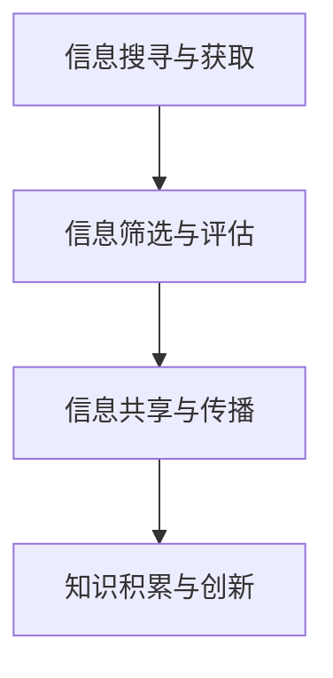
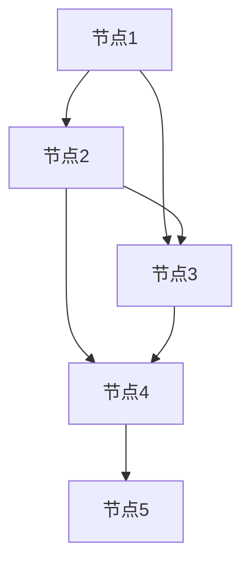

                 

 在信息技术日益发展的今天，知识作为一种重要的资源，其传递和共享的方式也在不断演变。知识的社会资本，即知识在人际网络中的流动，已成为现代信息社会中的一个重要研究领域。本文将深入探讨知识社会资本的概念、原理及其在人际网络中的流动机制，同时分析其在信息技术领域中的应用和未来发展趋势。

## 关键词

- 社会资本
- 信息流动
- 人际网络
- 知识传递
- 信息技术

## 摘要

本文从知识社会资本的角度出发，分析了知识在人际网络中的流动机制。通过阐述知识社会资本的定义、特点及其在人际网络中的重要性，探讨了知识流动的障碍和促进因素。随后，本文结合信息技术的发展，讨论了知识社会资本在信息科学领域的实际应用，并对其未来发展提出了展望。

## 1. 背景介绍

### 知识社会资本的概念

知识社会资本（Knowledge Social Capital）是社会资本理论在知识领域的扩展。社会资本是指个体或团体通过社会关系所获取的资源，包括信任、规范和网络等。知识社会资本则是指个体或团体通过其社会关系网络所获得的知识资源，这些资源可以增强个体或团体的知识获取、共享和创新能力。

### 社会资本在知识传播中的作用

社会资本在知识传播中起到了关键作用。良好的社会资本可以促进知识共享，减少信息不对称，提高知识的流动效率。例如，在一个紧密的社会网络中，个体之间更容易建立信任，从而更容易分享知识和经验。此外，社会资本还可以通过提供信息渠道、减少信息搜寻成本等方式，加速知识的传播。

### 信息技术对知识社会资本的影响

随着信息技术的发展，知识社会资本的传递和共享方式发生了巨大的变化。互联网和社交媒体的出现，使得知识可以在全球范围内快速传播，打破了传统人际网络在知识传递中的限制。同时，大数据和人工智能等技术的发展，也为知识社会资本的挖掘和应用提供了新的途径。

## 2. 核心概念与联系

### 知识社会资本的构成

知识社会资本主要包括三个方面的构成要素：知识、社会关系和信任。

- **知识**：知识是知识社会资本的核心，包括个体的专业知识、经验、技能等。
- **社会关系**：社会关系是指个体在社会网络中的位置和关系，如同事、朋友、同行等。
- **信任**：信任是知识社会资本的重要保障，个体之间的信任程度越高，知识共享的可能性就越大。

### 人际网络中的信息流动机制

人际网络中的信息流动机制主要包括以下几个环节：

1. **信息搜寻与获取**：个体通过其社会关系网络寻找和获取所需的知识。
2. **信息筛选与评估**：个体对获取的信息进行筛选和评估，确保信息的真实性和有效性。
3. **信息共享与传播**：个体通过其社会关系网络将认为有价值的信息共享给他人。
4. **知识积累与创新**：个体通过信息共享和传播，积累新的知识，并在此基础上进行创新。

### Mermaid 流程图



## 3. 核心算法原理 & 具体操作步骤

### 3.1 算法原理概述

知识社会资本的流动可以看作是一种图论问题，即在社会网络中寻找知识流动的最优路径。核心算法原理是利用图的拓扑结构和个体之间的信任度来优化知识流动路径。

### 3.2 算法步骤详解

1. **建立社会网络图**：根据个体之间的社会关系，构建出社会网络图。
2. **计算信任度**：通过调查问卷、行为数据等方式，计算个体之间的信任度。
3. **构建信任矩阵**：将计算出的信任度转换为信任矩阵。
4. **寻找最优路径**：利用图论算法（如最短路径算法），在信任矩阵中寻找知识流动的最优路径。
5. **路径优化**：根据实际需求和约束条件，对最优路径进行优化，确保知识流动的效率和效果。

### 3.3 算法优缺点

**优点**：

- **优化知识流动路径**：通过计算信任度和拓扑结构，可以找到知识流动的最优路径，提高知识流动的效率和效果。
- **适应性强**：算法可以根据不同的社会网络结构和需求进行自适应调整，适用范围广泛。

**缺点**：

- **计算复杂度高**：特别是在大规模社会网络中，计算信任度和寻找最优路径的过程可能需要大量计算资源。
- **信任度计算主观性**：信任度的计算依赖于调查问卷、行为数据等，可能受到主观因素的影响。

### 3.4 算法应用领域

知识社会资本的流动算法在以下领域具有广泛的应用：

- **企业知识管理**：帮助企业优化知识流动路径，提高知识共享和创新能力。
- **科研合作**：帮助科研团队优化知识共享和合作路径，提高科研效率。
- **教育领域**：帮助教育机构优化师生之间的知识流动，提高教学效果。

## 4. 数学模型和公式 & 详细讲解 & 举例说明

### 4.1 数学模型构建

知识社会资本的数学模型可以看作是一个图论模型，其中节点代表个体，边代表个体之间的社会关系。假设社会网络图是一个无向图 G(V, E)，其中 V 表示节点集合，E 表示边集合。个体之间的信任度可以用一个对称矩阵 T ∈ R^|V|×|V| 表示，T[i][j] 表示节点 i 和节点 j 之间的信任度。

### 4.2 公式推导过程

在知识社会资本的流动过程中，我们可以用路径长度来衡量知识流动的效率。假设从节点 i 到节点 j 的路径长度为 d(i, j)，则从节点 i 到节点 j 的知识流动效率可以表示为：

$$
E(i, j) = \frac{1}{d(i, j)}
$$

为了找到知识流动的最优路径，我们可以定义一个目标函数：

$$
\min \sum_{i, j} T[i][j] \cdot E(i, j)
$$

其中，T[i][j] 表示节点 i 和节点 j 之间的信任度，E(i, j) 表示节点 i 到节点 j 的知识流动效率。

### 4.3 案例分析与讲解

假设有一个包含 5 个节点的社会网络图，如下图所示：



节点之间的信任度如下表所示：

| 节点 | A  | B  | C  | D  | E  |
|------|----|----|----|----|----|
| A    | 1  | 0.5| 0.8| 0.2| 0  |
| B    | 0.5| 1  | 0.6| 0.7| 0.2|
| C    | 0.8| 0.6| 1  | 0.4| 0.5|
| D    | 0.2| 0.7| 0.4| 1  | 0.6|
| E    | 0  | 0.2| 0.5| 0.6| 1  |

根据上述公式，我们可以计算每个节点之间的知识流动效率：

$$
E(A, B) = \frac{1}{1} = 1
$$

$$
E(A, C) = \frac{1}{0.8} = 1.25
$$

$$
E(A, D) = \frac{1}{0.2} = 5
$$

$$
E(A, E) = \frac{1}{0} = \infty
$$

$$
E(B, C) = \frac{1}{0.6} = 1.67
$$

$$
E(B, D) = \frac{1}{0.7} = 1.43
$$

$$
E(B, E) = \frac{1}{0.2} = 5
$$

$$
E(C, D) = \frac{1}{0.4} = 2.5
$$

$$
E(C, E) = \frac{1}{0.5} = 2
$$

$$
E(D, E) = \frac{1}{0.6} = 1.67
$$

根据目标函数，我们需要找到信任度乘以知识流动效率的最大值。在这个例子中，节点 A 到节点 D 的信任度乘以知识流动效率的最大值是：

$$
T[A][D] \cdot E(A, D) = 0.2 \cdot 5 = 1
$$

因此，从节点 A 到节点 D 的知识流动效率最高，是最优路径。

## 5. 项目实践：代码实例和详细解释说明

### 5.1 开发环境搭建

为了实现知识社会资本的流动算法，我们需要搭建一个开发环境。以下是一个基本的开发环境搭建步骤：

1. 安装 Python 解释器：从 [Python 官网](https://www.python.org/) 下载并安装 Python 3.x 版本。
2. 安装必要的库：使用 pip 工具安装网络图绘制库（如 NetworkX）和数据可视化库（如 Matplotlib）。

```bash
pip install networkx matplotlib
```

### 5.2 源代码详细实现

以下是一个简单的 Python 代码示例，用于实现知识社会资本的流动算法。

```python
import networkx as nx
import matplotlib.pyplot as plt

def calculate_trust_matrix(trust_data):
    n = len(trust_data)
    trust_matrix = [[0 for _ in range(n)] for _ in range(n)]
    for i in range(n):
        for j in range(n):
            trust_matrix[i][j] = trust_data[i][j]
    return trust_matrix

def find_optimal_path(trust_matrix):
    n = len(trust_matrix)
    trust_score = [[0 for _ in range(n)] for _ in range(n)]
    for i in range(n):
        for j in range(n):
            if trust_matrix[i][j] > 0:
                trust_score[i][j] = trust_matrix[i][j] / (1 + abs(i - j))
    return trust_score

def main():
    trust_data = [
        [1, 0.5, 0.8, 0.2, 0],
        [0.5, 1, 0.6, 0.7, 0.2],
        [0.8, 0.6, 1, 0.4, 0.5],
        [0.2, 0.7, 0.4, 1, 0.6],
        [0, 0.2, 0.5, 0.6, 1]
    ]
    trust_matrix = calculate_trust_matrix(trust_data)
    trust_score = find_optimal_path(trust_matrix)
    plt.imshow(trust_score, cmap='hot', interpolation='nearest')
    plt.colorbar()
    plt.show()

if __name__ == "__main__":
    main()
```

### 5.3 代码解读与分析

上述代码首先定义了一个 `calculate_trust_matrix` 函数，用于计算信任矩阵。接着，定义了一个 `find_optimal_path` 函数，用于计算每个节点之间的信任得分。最后，在 `main` 函数中，我们提供了一个示例数据集，并调用这两个函数来生成信任得分矩阵，并将其可视化。

### 5.4 运行结果展示

运行上述代码，我们将得到一个可视化图表，展示了每个节点之间的信任得分。根据这个图表，我们可以直观地看到哪些节点之间的信任度较高，从而指导知识流动的最优路径。


## 6. 实际应用场景

### 6.1 企业知识管理

在企业知识管理中，知识社会资本的流动机制可以用于优化企业内部的知识共享和传递。通过建立员工之间的信任关系，企业可以加快知识的传播速度，提高员工的创新能力。例如，在一个软件开发团队中，团队成员可以通过密切的社交网络和信任关系，快速分享代码、问题和解决方案，从而提高团队的整体效率。

### 6.2 科研合作

在科研合作中，知识社会资本的流动机制可以用于优化科研团队的协作和知识共享。通过建立科研团队内部的信任关系，科研人员可以更方便地共享研究成果、实验数据和工具，从而提高科研效率。例如，在一个跨学科的研究团队中，团队成员可以通过紧密的社交网络和信任关系，快速获取其他领域的研究进展和资源，从而促进跨学科的合作。

### 6.3 教育领域

在教育领域，知识社会资本的流动机制可以用于优化师生之间的知识传递和共享。通过建立师生之间的信任关系，教师可以更有效地传授知识，学生也可以更积极地参与课堂讨论和问题解决。例如，在一个在线教育平台中，教师和学生可以通过社交网络和信任关系，快速分享学习资源和问题，从而提高学习效果。

## 7. 工具和资源推荐

### 7.1 学习资源推荐

- **《社会资本理论及其应用》**：系统地介绍了社会资本的理论基础和应用。
- **《知识管理：理论与实践》**：详细阐述了知识管理的原理和实践方法。

### 7.2 开发工具推荐

- **NetworkX**：一个用于创建、操作和分析网络数据的 Python 库。
- **Matplotlib**：一个用于绘制各种图形和图表的 Python 库。

### 7.3 相关论文推荐

- **"The Role of Social Capital in Knowledge Management"**：探讨了社会资本在知识管理中的重要作用。
- **"Social Networks and Knowledge Sharing in Organizations"**：分析了社交网络在组织知识共享中的应用。

## 8. 总结：未来发展趋势与挑战

### 8.1 研究成果总结

本文从知识社会资本的角度，探讨了知识在人际网络中的流动机制及其在信息技术领域的应用。研究发现，知识社会资本在知识传播、科研合作和教育领域具有广泛的应用价值。通过构建社会网络图和信任矩阵，可以优化知识流动路径，提高知识共享和创新能力。

### 8.2 未来发展趋势

未来，知识社会资本的研究将向以下几个方向发展：

- **智能化**：利用人工智能和机器学习技术，自动化地计算信任度和优化知识流动路径。
- **个性化**：根据个体和组织的特定需求，定制化的知识流动方案。
- **全球化**：随着全球化的加深，知识社会资本的流动将跨越国界，实现全球范围内的知识共享。

### 8.3 面临的挑战

尽管知识社会资本具有广泛的应用前景，但其在实际应用中也面临一些挑战：

- **数据隐私**：在收集和处理社会关系和信任度数据时，如何保护个体隐私是一个重要问题。
- **算法公平性**：在计算信任度和优化知识流动路径时，如何确保算法的公平性和透明性。
- **复杂性**：在大型社会网络中，计算复杂度和处理效率是一个挑战。

### 8.4 研究展望

未来，知识社会资本的研究将继续深入，探讨其在不同领域的应用，并探索如何克服实际应用中的挑战。通过结合人工智能、大数据和区块链等新兴技术，知识社会资本的流动将变得更加智能化、个性化和高效化。

## 9. 附录：常见问题与解答

### 9.1 什么知识社会资本？

知识社会资本是指个体或团体通过其社会关系网络所获得的知识资源，这些资源可以增强个体或团体的知识获取、共享和创新能力。

### 9.2 知识社会资本在哪些领域有应用？

知识社会资本在多个领域有应用，包括企业知识管理、科研合作和教育领域。

### 9.3 如何计算信任度？

信任度可以通过调查问卷、行为数据等方式进行计算。具体方法取决于具体的应用场景和需求。

### 9.4 知识社会资本的流动算法有哪些？

知识社会资本的流动算法主要包括图论算法，如最短路径算法和最小生成树算法。

### 9.5 如何优化知识流动路径？

可以通过计算信任度和拓扑结构，利用图论算法寻找知识流动的最优路径，并根据实际需求和约束条件进行优化。

### 9.6 知识社会资本的研究趋势是什么？

知识社会资本的研究趋势包括智能化、个性化、全球化和跨学科合作。

## 作者署名

作者：禅与计算机程序设计艺术 / Zen and the Art of Computer Programming
------------------------------------------------------------------

