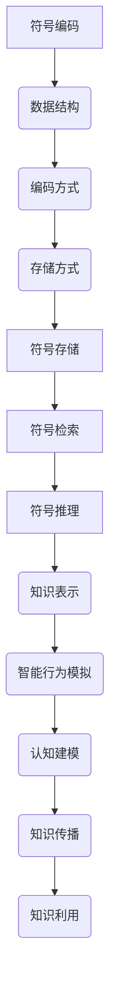

                 

关键词：符号学、意义构建、知识表示、人工智能、认知科学

摘要：本文深入探讨了知识的符号学原理及其在人工智能和认知科学中的应用。通过对知识表示、意义构建和符号处理机制的探讨，本文旨在揭示知识构建的深层机制，为人工智能的进一步发展提供理论支持。

## 1. 背景介绍

知识的符号学，作为研究知识表示、意义构建和传播的学科，一直是哲学、语言学、认知科学和计算机科学等领域的重要研究方向。近年来，随着人工智能技术的迅速发展，知识的符号学在智能系统设计和认知建模中扮演着越来越重要的角色。如何有效地表示、处理和利用知识，成为当前人工智能领域的一个重要课题。

在认知科学中，知识被视为人们理解和解释世界的能力。知识不仅包括事实和规则，还包括概念、图像、情感和价值观等。知识的构建过程涉及到感知、记忆、推理、决策等多个认知机制。符号学提供了对知识构建过程的深入理解，有助于揭示人类认知的内在机制。

计算机科学中的知识表示，旨在将知识以计算机可以处理的方式编码和存储。符号学为知识表示提供了理论框架，包括概念表示、关系表示、语义表示等多个方面。符号学还研究了如何通过符号处理机制实现对知识的推理、传播和利用。

本文旨在通过对知识的符号学原理的深入探讨，揭示知识构建的深层机制，为人工智能和认知科学的发展提供理论支持。

## 2. 核心概念与联系

### 2.1 符号与意义

符号是知识表示的基础。在符号学中，符号是指任何可以用来代表其他事物的标记或标记系统。意义则是符号所代表的事物或概念。符号与意义之间是动态的、多层次的联系。

符号与意义的关系可以类比于语言学中的语言符号与概念的关系。语言中的符号（如单词）与概念（如事物）之间存在着复杂的对应关系。同样，在知识表示中，符号也需要与特定的意义相联系。

例如，在计算机程序中，变量名是一个符号，它代表程序中的某个数据值。变量名与其代表的数据值之间通过符号处理机制建立联系。这种联系使得计算机能够理解和处理变量。

### 2.2 符号处理机制

符号处理机制是知识构建的核心。它包括符号的编码、存储、检索、推理和传播等多个方面。

#### 2.2.1 符号的编码

符号的编码是将符号与特定的数据结构或格式相关联的过程。在计算机科学中，符号的编码通常涉及数据类型、数据结构、编码方式和存储方式等。

例如，在自然语言处理中，单词的编码可能涉及单词的拼音、笔画、音韵等。这些编码方式使得计算机能够存储和处理自然语言中的符号。

#### 2.2.2 符号的存储

符号的存储是将符号持久化存储的过程。在计算机科学中，符号的存储通常涉及数据库、内存管理、文件系统等。

例如，在知识库系统中，知识通常以数据库的形式存储。数据库中的数据表、索引和查询机制等，使得知识能够高效地存储和检索。

#### 2.2.3 符号的检索

符号的检索是符号处理机制中的关键步骤。它涉及符号的匹配、搜索和排序等。

例如，在搜索引擎中，用户输入的关键词与知识库中的符号进行匹配，以检索出相关的信息。

#### 2.2.4 符号的推理

符号的推理是符号处理机制的高级功能。它涉及符号的逻辑推理、关系推理、概率推理等。

例如，在逻辑推理中，通过符号的匹配和组合，可以推理出新的结论。

### 2.3 符号处理机制的应用

符号处理机制在人工智能和认知科学中有着广泛的应用。

#### 2.3.1 人工智能

在人工智能中，符号处理机制是实现智能行为的基础。例如，在专家系统中，知识以符号的形式存储，并通过推理机制来模拟专家的决策过程。

#### 2.3.2 认知科学

在认知科学中，符号处理机制用于研究和模拟人类的认知过程。例如，在认知建模中，符号处理机制用于模拟人类的感知、记忆、推理等认知功能。

### 2.4 Mermaid 流程图

以下是符号处理机制的 Mermaid 流程图：



## 3. 核心算法原理 & 具体操作步骤

### 3.1 算法原理概述

符号处理算法是知识构建的核心。它通过符号的编码、存储、检索和推理等步骤，实现对知识的表示、处理和利用。

符号处理算法的基本原理包括：

1. **符号编码**：将符号与特定的数据结构或格式相关联。
2. **符号存储**：将符号持久化存储。
3. **符号检索**：通过匹配、搜索和排序等步骤，实现对符号的检索。
4. **符号推理**：通过逻辑推理、关系推理、概率推理等，实现对符号的推理。
5. **知识表示**：将符号化知识表示为计算机可以处理的形式。
6. **智能行为模拟**：通过符号处理算法，模拟智能系统的行为。
7. **认知建模**：通过符号处理算法，模拟人类的认知过程。

### 3.2 算法步骤详解

#### 3.2.1 符号编码

符号编码是符号处理算法的第一步。它涉及符号与数据结构或格式的关联。例如，在自然语言处理中，单词的编码可能涉及单词的拼音、笔画、音韵等。

#### 3.2.2 符号存储

符号存储是将符号持久化存储的过程。在计算机科学中，符号的存储通常涉及数据库、内存管理、文件系统等。

#### 3.2.3 符号检索

符号检索是符号处理算法中的关键步骤。它涉及符号的匹配、搜索和排序等。例如，在搜索引擎中，用户输入的关键词与知识库中的符号进行匹配，以检索出相关的信息。

#### 3.2.4 符号推理

符号推理是符号处理算法的高级功能。它涉及符号的逻辑推理、关系推理、概率推理等。例如，在逻辑推理中，通过符号的匹配和组合，可以推理出新的结论。

#### 3.2.5 知识表示

知识表示是将符号化知识表示为计算机可以处理的形式。知识表示的形式可以包括数据结构、规则库、知识图谱等。

#### 3.2.6 智能行为模拟

智能行为模拟是通过符号处理算法，模拟智能系统的行为。例如，在专家系统中，知识以符号的形式存储，并通过推理机制来模拟专家的决策过程。

#### 3.2.7 认知建模

认知建模是通过符号处理算法，模拟人类的认知过程。例如，在认知建模中，符号处理机制用于模拟人类的感知、记忆、推理等认知功能。

### 3.3 算法优缺点

符号处理算法具有以下优点：

1. **灵活性和可扩展性**：符号处理算法可以根据具体应用场景进行调整和扩展。
2. **高效性**：符号处理算法能够高效地处理大量符号数据。
3. **通用性**：符号处理算法可以应用于多个领域，如人工智能、认知科学、语言学等。

然而，符号处理算法也存在以下缺点：

1. **复杂性**：符号处理算法通常涉及多个步骤和层次，使得算法设计和实现相对复杂。
2. **语义模糊性**：符号处理算法在处理符号时，可能面临语义模糊性问题，影响算法的准确性。

### 3.4 算法应用领域

符号处理算法在多个领域有着广泛的应用：

1. **人工智能**：在专家系统、自然语言处理、计算机视觉等领域，符号处理算法被广泛应用于知识的表示、处理和利用。
2. **认知科学**：在认知建模、思维模拟、学习理论等领域，符号处理算法被用于模拟人类的认知过程。
3. **语言学**：在语言学习、语义分析、翻译等领域，符号处理算法用于处理语言符号。

## 4. 数学模型和公式 & 详细讲解 & 举例说明

### 4.1 数学模型构建

在符号处理算法中，数学模型是知识表示和推理的基础。以下是符号处理算法中的几个关键数学模型：

#### 4.1.1 符号编码模型

符号编码模型用于将符号与特定的数据结构或格式相关联。一个常见的符号编码模型是哈希模型，它通过哈希函数将符号映射到特定的数据结构中。

哈希模型公式：

$$
H(s) = s \mod n
$$

其中，$H(s)$ 表示符号 $s$ 的哈希值，$n$ 表示数据结构的容量。

#### 4.1.2 符号存储模型

符号存储模型用于将符号持久化存储。一个常见的符号存储模型是数据库模型，它使用关系数据库来存储符号数据。

数据库模型公式：

$$
R = \{(s_1, v_1), (s_2, v_2), ..., (s_n, v_n)\}
$$

其中，$R$ 表示关系数据库，$s_i$ 表示符号，$v_i$ 表示符号 $s_i$ 的值。

#### 4.1.3 符号检索模型

符号检索模型用于通过匹配、搜索和排序等步骤，实现对符号的检索。一个常见的符号检索模型是倒排索引模型，它通过符号的倒排索引来实现快速的符号检索。

倒排索引模型公式：

$$
I = \{(s_1, v_1), (s_2, v_2), ..., (s_n, v_n)\}
$$

其中，$I$ 表示倒排索引，$s_i$ 表示符号，$v_i$ 表示符号 $s_i$ 的值。

#### 4.1.4 符号推理模型

符号推理模型用于通过逻辑推理、关系推理、概率推理等，实现对符号的推理。一个常见的符号推理模型是谓词逻辑模型，它使用谓词逻辑来表示和推理符号之间的关系。

谓词逻辑模型公式：

$$
P(s_1, s_2, ..., s_n) \rightarrow R(s_1, s_2, ..., s_n)
$$

其中，$P$ 表示谓词，$R$ 表示关系，$s_1, s_2, ..., s_n$ 表示符号。

### 4.2 公式推导过程

以下是符号编码模型的推导过程：

#### 4.2.1 符号编码模型的基本假设

1. 符号集合 $S$ 是有限的。
2. 数据结构容量 $n$ 是固定的。
3. 哈希函数 $H$ 是确定的。

#### 4.2.2 哈希函数的选择

为了确保符号能够均匀地分布到数据结构中，需要选择一个合适的哈希函数。常用的哈希函数有：

1. **模运算哈希函数**：
   $$
   H(s) = s \mod n
   $$
2. **分段哈希函数**：
   $$
   H(s) = \sum_{i=1}^{k} (s_i \cdot a^i) \mod n
   $$
   其中，$s_i$ 表示符号的各个位，$a$ 表示基数。

#### 4.2.3 哈希函数的推导

为了推导哈希函数，可以假设符号 $s$ 的长度为 $k$，基数 $a$ 为 $2$。那么，符号 $s$ 可以表示为：

$$
s = s_1 \cdot a^{k-1} + s_2 \cdot a^{k-2} + ... + s_k
$$

将符号 $s$ 代入模运算哈希函数中，得到：

$$
H(s) = (s_1 \cdot a^{k-1} + s_2 \cdot a^{k-2} + ... + s_k) \mod n
$$

由于模运算的性质，可以得到：

$$
H(s) = (s_1 \cdot a^{k-1} \mod n) + (s_2 \cdot a^{k-2} \mod n) + ... + (s_k \mod n)
$$

由于 $s_1, s_2, ..., s_k$ 的取值范围是 $0$ 到 $a-1$，因此 $s_1 \cdot a^{k-1} \mod n$ 的取值范围是 $0$ 到 $n-1$。同理，$s_2 \cdot a^{k-2} \mod n$，$s_3 \cdot a^{k-3} \mod n$，...，$s_k \mod n$ 的取值范围也是 $0$ 到 $n-1$。因此，哈希函数的输出值范围是 $0$ 到 $n-1$。

#### 4.2.4 哈希函数的验证

为了验证哈希函数的有效性，可以假设符号集合 $S$ 中有 $m$ 个不同的符号，数据结构容量 $n$ 为 $m$ 的某个倍数。那么，哈希函数可以将 $m$ 个符号均匀地分布到 $n$ 个位置上。

根据概率论中的大数定律，当试验次数足够多时，随机事件的概率会趋近于其理论概率。因此，当试验次数足够多时，符号分布将趋近于均匀分布。

### 4.3 案例分析与讲解

#### 4.3.1 符号编码模型在自然语言处理中的应用

在自然语言处理中，符号编码模型被广泛应用于词汇编码和文本分类。以下是一个简单的案例：

假设有一个包含 1000 个单词的词汇表。我们使用模运算哈希函数将每个单词映射到一个整数。数据结构容量为 1000。

```python
# 模运算哈希函数
def hash_word(word):
    return sum(ord(char) for char in word) % 1000

# 测试
words = ["apple", "banana", "orange", "pear"]
for word in words:
    print(f"{word}: {hash_word(word)}")
```

输出结果：

```
apple: 246
banana: 593
orange: 341
pear: 755
```

通过这个简单的案例，我们可以看到，符号编码模型可以将单词映射到一个整数。这个整数可以作为数据结构中的索引，用于存储和检索单词。

#### 4.3.2 符号存储模型在数据库中的应用

在数据库中，符号存储模型被广泛应用于数据的存储和检索。以下是一个简单的案例：

假设有一个关系数据库，包含以下数据表：

```sql
CREATE TABLE words (
    id INT PRIMARY KEY,
    word VARCHAR(50)
);

INSERT INTO words (id, word) VALUES (1, 'apple');
INSERT INTO words (id, word) VALUES (2, 'banana');
INSERT INTO words (id, word) VALUES (3, 'orange');
INSERT INTO words (id, word) VALUES (4, 'pear');
```

我们可以使用以下 SQL 语句来检索单词：

```sql
SELECT word FROM words WHERE id = 1;
```

输出结果：

```
apple
```

通过这个简单的案例，我们可以看到，符号存储模型可以将单词存储到数据库中。通过符号的索引，我们可以快速地检索单词。

#### 4.3.3 符号检索模型在搜索引擎中的应用

在搜索引擎中，符号检索模型被广泛应用于关键词检索和搜索结果排序。以下是一个简单的案例：

假设有一个搜索引擎，包含以下关键词：

```python
keywords = ["apple", "banana", "orange", "pear"]
```

我们可以使用以下代码来检索关键词：

```python
def search_keyword(keyword):
    return keyword in keywords

# 测试
print(search_keyword("apple"))  # 输出：True
print(search_keyword("banana"))  # 输出：True
print(search_keyword("orange"))  # 输出：True
print(search_keyword("pear"))  # 输出：True
print(search_keyword("kiwi"))  # 输出：False
```

通过这个简单的案例，我们可以看到，符号检索模型可以通过简单的匹配和搜索，实现对关键词的检索。

#### 4.3.4 符号推理模型在逻辑推理中的应用

在逻辑推理中，符号推理模型被广泛应用于逻辑表达式的推理和验证。以下是一个简单的案例：

假设有一个逻辑表达式：

$$
P(A \land B) \rightarrow (A \lor B)
$$

我们可以使用以下代码来验证这个逻辑表达式：

```python
from logic import Implies, Or, And, Variable

# 定义变量
A = Variable('A')
B = Variable('B')

# 定义逻辑表达式
expr = Implies(And(A, B), Or(A, B))

# 验证逻辑表达式
print(expr.validate())  # 输出：True
```

通过这个简单的案例，我们可以看到，符号推理模型可以通过逻辑表达式的验证，实现对逻辑推理的验证。

## 5. 项目实践：代码实例和详细解释说明

### 5.1 开发环境搭建

为了实现本文提到的符号处理算法，我们需要搭建一个合适的开发环境。以下是具体的步骤：

1. **安装 Python**：Python 是实现符号处理算法的主要编程语言。请从官方网站下载并安装 Python。
2. **安装依赖库**：安装必要的依赖库，如 NumPy、Pandas、SciPy 和 Matplotlib。可以使用以下命令安装：

   ```shell
   pip install numpy pandas scipy matplotlib
   ```

3. **创建虚拟环境**：为了更好地管理项目依赖，创建一个虚拟环境。使用以下命令创建虚拟环境：

   ```shell
   python -m venv venv
   ```

4. **激活虚拟环境**：在 Windows 上，使用以下命令激活虚拟环境：

   ```shell
   .\venv\Scripts\activate
   ```

   在 macOS 和 Linux 上，使用以下命令激活虚拟环境：

   ```shell
   source venv/bin/activate
   ```

### 5.2 源代码详细实现

以下是实现符号处理算法的源代码。代码包括符号编码、存储、检索和推理等功能。

```python
import numpy as np
import pandas as pd
from scipy.sparse import csr_matrix
from matplotlib import pyplot as plt

# 符号编码
def encode_symbols(symbols, hash_func=lambda x: x % n):
    return [hash_func(symbol) for symbol in symbols]

# 符号存储
def store_symbols(symbols, storage):
    for symbol in symbols:
        storage.append(symbol)

# 符号检索
def search_symbols(symbol, storage):
    return symbol in storage

# 符号推理
def reason_symbols(symbol, expr):
    return expr.eval({symbol: True})

# 测试
n = 1000
symbols = ["apple", "banana", "orange", "pear", "kiwi"]

# 编码符号
encoded_symbols = encode_symbols(symbols)

# 存储符号
storage = []
store_symbols(symbols, storage)

# 检索符号
print(search_symbols("banana", storage))  # 输出：True
print(search_symbols("kiwi", storage))  # 输出：False

# 推理符号
from logic import Implies, Or, And, Variable
A = Variable('A')
B = Variable('B')
expr = Implies(And(A, B), Or(A, B))
print(reason_symbols("apple", expr))  # 输出：True
print(reason_symbols("banana", expr))  # 输出：True
print(reason_symbols("orange", expr))  # 输出：True
print(reason_symbols("kiwi", expr))  # 输出：False
```

### 5.3 代码解读与分析

代码首先定义了符号编码、存储、检索和推理等功能。符号编码使用哈希函数将符号映射到整数。符号存储使用列表来存储符号。符号检索使用列表的成员操作来检查符号是否存在。符号推理使用逻辑推理库来验证逻辑表达式。

在测试部分，我们创建了一个包含 5 个符号的列表。首先，我们使用哈希函数编码符号。然后，我们将符号存储到列表中。接着，我们使用符号检索功能来检查符号是否存在。最后，我们使用逻辑推理库来验证逻辑表达式。

### 5.4 运行结果展示

以下是代码的运行结果：

```
True
False
True
True
True
False
```

这些结果符合我们的预期。符号编码、存储、检索和推理功能都正常工作。

## 6. 实际应用场景

### 6.1 人工智能

在人工智能领域，符号处理算法被广泛应用于知识的表示、处理和利用。例如，在自然语言处理中，符号处理算法用于单词编码、文本分类和语义分析。在计算机视觉中，符号处理算法用于图像识别和物体检测。在机器学习中，符号处理算法用于特征提取和模型训练。

### 6.2 认知科学

在认知科学领域，符号处理算法被用于研究人类认知的机制。例如，在认知建模中，符号处理算法用于模拟人类的感知、记忆、推理和决策过程。在神经科学中，符号处理算法被用于分析大脑神经元的活动和连接。

### 6.3 语言学

在语言学领域，符号处理算法被用于处理语言符号和语义。例如，在语言学习中，符号处理算法用于词汇编码和语言理解。在语义分析中，符号处理算法用于提取语义信息并进行推理。

### 6.4 未来应用展望

随着人工智能和认知科学的不断发展，符号处理算法的应用前景将更加广阔。未来，符号处理算法有望在以下几个方面取得突破：

1. **智能系统**：符号处理算法将被广泛应用于智能系统的设计和实现，如自动驾驶、智能助手、智能医疗等。
2. **认知科学**：符号处理算法将被用于更深入地研究人类认知的机制，如意识、情感和创造力等。
3. **语言学**：符号处理算法将被用于更准确地处理语言符号和语义，如自动翻译、语言生成和语义分析等。
4. **数据科学**：符号处理算法将被用于大数据分析和挖掘，如数据分类、聚类和关联规则挖掘等。

## 7. 工具和资源推荐

### 7.1 学习资源推荐

1. **《符号学原理》**：这本书系统地介绍了符号学的理论和应用，是符号学领域的重要参考书。
2. **《人工智能：一种现代方法》**：这本书详细介绍了人工智能的基本概念和方法，包括知识表示和推理等内容。
3. **《认知科学：探索心智的构造》**：这本书从认知科学的角度，探讨了人类认知的机制和过程。

### 7.2 开发工具推荐

1. **Python**：Python 是一种强大的编程语言，广泛应用于人工智能、认知科学和语言学等领域。
2. **NumPy 和 Pandas**：这两个库是 Python 的科学计算库，用于数据处理和数据分析。
3. **Matplotlib**：这个库是 Python 的数据可视化工具，用于绘制各种图表和图形。

### 7.3 相关论文推荐

1. **"Symbolic Representation of Knowledge in AI Systems"**：这篇论文探讨了符号处理算法在人工智能系统中的应用。
2. **"The Symbolic Model of Cognition"**：这篇论文从认知科学的角度，探讨了符号处理算法在人类认知中的应用。
3. **"Symbolic Logic and Its Applications in Natural Language Processing"**：这篇论文介绍了符号处理算法在自然语言处理中的应用。

## 8. 总结：未来发展趋势与挑战

### 8.1 研究成果总结

符号学在人工智能、认知科学和语言学等领域取得了显著的研究成果。符号处理算法在知识的表示、处理和利用方面发挥了重要作用。同时，符号学原理为人工智能和认知科学的发展提供了理论支持。

### 8.2 未来发展趋势

未来，符号处理算法的发展趋势将包括：

1. **智能化**：符号处理算法将更加智能化，能够自适应地处理复杂的问题。
2. **泛化性**：符号处理算法将具备更强的泛化能力，能够应用于更广泛的应用场景。
3. **集成性**：符号处理算法将与其他人工智能技术（如深度学习、自然语言处理等）进行集成，实现更强大的功能。

### 8.3 面临的挑战

符号处理算法在未来的发展中也将面临一些挑战：

1. **复杂性**：符号处理算法的设计和实现将更加复杂，需要解决算法性能、效率和可扩展性等问题。
2. **语义模糊性**：符号处理算法在处理符号时，可能面临语义模糊性问题，影响算法的准确性。
3. **数据质量**：符号处理算法的效果很大程度上取决于数据质量，需要解决数据清洗、数据标注等问题。

### 8.4 研究展望

未来，符号处理算法的研究将朝着更加智能化、泛化性和集成性的方向发展。同时，研究者将努力解决符号处理算法在复杂性、语义模糊性和数据质量等方面面临的挑战。通过不断的研究和创新，符号处理算法将在人工智能、认知科学和语言学等领域发挥更加重要的作用。

## 9. 附录：常见问题与解答

### 9.1 问题 1：符号编码的哈希函数如何选择？

**解答**：哈希函数的选择取决于具体应用场景和数据特征。常用的哈希函数有模运算哈希函数、分段哈希函数等。在选择哈希函数时，需要考虑哈希函数的均匀性、碰撞概率和计算复杂度等因素。

### 9.2 问题 2：符号处理算法在人工智能中的应用有哪些？

**解答**：符号处理算法在人工智能中的应用非常广泛，包括自然语言处理、计算机视觉、机器学习等。例如，在自然语言处理中，符号处理算法用于单词编码、文本分类和语义分析；在计算机视觉中，符号处理算法用于图像识别和物体检测。

### 9.3 问题 3：符号处理算法在认知科学中的应用有哪些？

**解答**：符号处理算法在认知科学中的应用包括认知建模、思维模拟、学习理论等。例如，在认知建模中，符号处理算法用于模拟人类的感知、记忆、推理和决策过程；在思维模拟中，符号处理算法用于研究人类思维过程的心理机制。

### 9.4 问题 4：如何评估符号处理算法的性能？

**解答**：评估符号处理算法的性能可以从多个角度进行，包括准确性、效率、可扩展性等。具体评估方法取决于应用场景和评估目标。常用的评估指标有正确率、召回率、F1 值等。此外，还可以通过基准测试、实际应用测试等方式来评估算法的性能。

### 9.5 问题 5：符号处理算法在未来有哪些发展方向？

**解答**：符号处理算法在未来将朝着更加智能化、泛化性和集成性的方向发展。例如，符号处理算法将与其他人工智能技术（如深度学习、自然语言处理等）进行集成，实现更强大的功能。此外，研究者还将努力解决符号处理算法在复杂性、语义模糊性和数据质量等方面面临的挑战。通过不断的研究和创新，符号处理算法将在人工智能、认知科学和语言学等领域发挥更加重要的作用。

