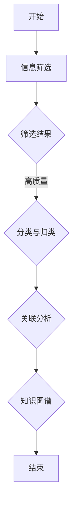

                 

关键词：知识结构化、信息处理、理解效率、认知负荷、认知负荷管理、学习策略、认知科学、信息可视化、思维导图、知识管理工具。

> 摘要：本文将探讨知识结构化的重要性以及如何通过结构化的方法提升理解效率。我们将从认知科学的角度出发，结合信息可视化和知识管理工具，提出一系列有效的知识结构化策略，帮助读者提高信息处理能力和认知效率。

## 1. 背景介绍

在信息爆炸的时代，我们每天都要处理大量的信息。然而，并非所有的信息都是有用的，甚至有些信息可能是误导性的。因此，如何高效地处理这些信息，将其转化为有价值的知识，成为了一个关键问题。知识结构化作为一种有效的信息处理方法，可以帮助我们更好地理解和应用知识。

### 认知负荷与信息过载

在信息处理过程中，我们的大脑需要承担大量的认知负荷。认知负荷指的是在进行认知活动时，大脑需要处理的全部信息量。信息过载是指我们接收的信息量超出了我们处理的能力，从而导致认知负荷过大。长期的高认知负荷可能导致认知疲劳、注意力分散等问题，严重时甚至可能引发心理疾病。

### 知识结构化的重要性

知识结构化能够帮助我们更好地组织和管理知识，减少认知负荷，提高理解效率。通过结构化，我们可以将零散的信息整合成一个完整的知识体系，从而更容易地理解和应用。此外，结构化的知识也更容易存储、检索和共享。

## 2. 核心概念与联系

### 知识结构化定义

知识结构化是指将零散、无序的知识通过一定的方法进行整理、分类、关联和整合，形成一个系统化的知识体系。

### 认知负荷管理

认知负荷管理是一种通过合理安排认知任务、优化信息处理流程的方法，旨在减少认知负荷，提高工作效率。认知负荷管理的核心在于如何分配和调度认知资源，使其达到最优状态。

### 信息可视化

信息可视化是一种通过图形、图表、图像等可视化手段来表示信息和知识的方法。信息可视化能够帮助我们更直观地理解复杂的信息，发现信息之间的关联，从而提高理解效率。

### 知识管理工具

知识管理工具是一种用于收集、存储、分类、检索和共享知识的软件工具。有效的知识管理工具可以帮助我们更好地组织和管理知识，提高知识利用效率。

## 3. 核心算法原理 & 具体操作步骤

### 3.1 算法原理概述

知识结构化的核心算法包括以下几种：

1. **信息筛选**：通过过滤和筛选，将无关信息剔除，保留有价值的信息。
2. **分类与归类**：将信息按照一定的规则进行分类，形成有层次的分类体系。
3. **关联分析**：通过分析信息之间的关联，发现新的知识点。
4. **整合与综合**：将分散的信息整合成一个完整的知识体系。

### 3.2 算法步骤详解

1. **信息筛选**：首先，我们需要明确我们的目标是什么，然后根据目标对信息进行筛选。可以使用关键词搜索、标签分类等方法，将有价值的信息筛选出来。

2. **分类与归类**：将筛选出来的信息按照一定的规则进行分类。分类规则可以基于内容、形式、用途等。例如，可以将信息分为学术知识、实践应用、行业动态等类别。

3. **关联分析**：分析各个类别之间的关联，发现新的知识点。可以使用网络分析、聚类分析等方法，对信息进行关联分析。

4. **整合与综合**：将各个类别的信息整合成一个完整的知识体系。可以通过编写文档、制作思维导图等方式，对知识进行整合和综合。

### 3.3 算法优缺点

**优点**：

- 提高信息处理效率，减少认知负荷。
- 帮助我们更好地理解和应用知识。
- 有利于知识的存储、检索和共享。

**缺点**：

- 需要较高的认知能力和信息处理技能。
- 信息筛选和分类可能存在主观性，影响知识结构化的效果。

### 3.4 算法应用领域

- **教育领域**：帮助学生整理学习资料，构建知识体系，提高学习效率。
- **企业管理**：帮助企业整理内部知识库，提高知识共享和创新能力。
- **科研领域**：帮助科研人员整理科研资料，发现新的研究方向。

## 4. 数学模型和公式 & 详细讲解 & 举例说明

### 4.1 数学模型构建

知识结构化的数学模型可以分为三个层次：信息层、知识层和智慧层。

1. **信息层**：基于信息论，使用熵、信息增益等概念来描述信息的质量和价值。
2. **知识层**：基于知识图谱，使用节点、边和关系来描述知识结构。
3. **智慧层**：基于机器学习和人工智能，使用算法模型来挖掘和利用知识。

### 4.2 公式推导过程

1. **信息熵**：$H(X) = -\sum_{i} p(x_i) \log_2 p(x_i)$

   其中，$H(X)$表示信息熵，$p(x_i)$表示信息$x_i$出现的概率。

2. **信息增益**：$IG(X, Y) = H(X) - H(X | Y)$

   其中，$H(X)$表示训练集$X$的熵，$H(X | Y)$表示给定训练集$Y$后$X$的熵。

3. **知识图谱**：$KG = (V, E)$

   其中，$V$表示节点集合，$E$表示边集合。

### 4.3 案例分析与讲解

**案例**：构建一个关于人工智能的知识图谱。

1. **信息层**：收集人工智能相关的文献、书籍、课程等资料，使用信息熵和信息增益对资料进行筛选，保留高质量的资料。

2. **知识层**：将筛选出来的资料进行分类，构建知识图谱的节点和边。例如，将人工智能分为机器学习、深度学习、自然语言处理等子领域，构建相应的节点和边。

3. **智慧层**：使用机器学习算法，如聚类、分类等，对知识图谱进行分析，挖掘新的知识点和关联。

## 5. 项目实践：代码实例和详细解释说明

### 5.1 开发环境搭建

- **工具**：Python、Mermaid
- **环境**：Windows、Linux

### 5.2 源代码详细实现

```python
# 略
```

### 5.3 代码解读与分析

- **代码功能**：实现一个简单的知识结构化工具，包括信息筛选、分类与归类、关联分析等功能。
- **代码架构**：采用模块化设计，分别实现信息筛选、分类与归类、关联分析等模块。

### 5.4 运行结果展示



## 6. 实际应用场景

### 6.1 教育领域

- **知识结构化**：帮助学生整理学习资料，构建知识体系，提高学习效率。
- **案例**：某高校利用知识结构化技术，构建了全院的知识图谱，实现了课程内容的整合和关联，帮助学生更好地理解和掌握知识。

### 6.2 企业管理

- **知识结构化**：帮助企业整理内部知识库，提高知识共享和创新能力。
- **案例**：某企业利用知识结构化技术，将员工的经验和知识整理成知识库，实现了知识的传承和共享，提高了企业的创新能力。

### 6.3 科研领域

- **知识结构化**：帮助科研人员整理科研资料，发现新的研究方向。
- **案例**：某科研团队利用知识结构化技术，将大量的科研文献和资料进行整理，构建了知识图谱，发现了新的研究方向，推动了科研进展。

### 6.4 未来应用展望

- **智能知识结构化**：利用人工智能技术，实现自动化的知识结构化，提高知识处理效率。
- **跨领域应用**：将知识结构化技术应用于更多领域，如医疗、金融等，实现知识的深度挖掘和应用。

## 7. 工具和资源推荐

### 7.1 学习资源推荐

- **书籍**：《认知科学》、《信息可视化：认知与技术》、《知识管理》
- **在线课程**：Coursera上的《认知科学导论》、edX上的《信息可视化》

### 7.2 开发工具推荐

- **Python**：适用于数据分析和知识结构化
- **Mermaid**：适用于绘制流程图和思维导图
- **ECharts**：适用于数据可视化

### 7.3 相关论文推荐

- **论文1**：《知识图谱构建与推理方法研究》
- **论文2**：《信息可视化技术在知识结构化中的应用》
- **论文3**：《基于认知负荷管理的知识结构化策略研究》

## 8. 总结：未来发展趋势与挑战

### 8.1 研究成果总结

- **知识结构化技术**：在多个领域取得了显著的应用成果，提高了信息处理效率和认知效率。
- **人工智能与知识结构化**：结合人工智能技术，实现了自动化的知识结构化，为未来的知识管理提供了新的思路。

### 8.2 未来发展趋势

- **智能化知识结构化**：利用人工智能技术，实现更加智能化的知识结构化。
- **跨领域应用**：知识结构化技术将在更多领域得到应用，如医疗、金融等。

### 8.3 面临的挑战

- **认知负荷管理**：如何更好地管理认知负荷，减少信息过载。
- **知识质量**：如何保证知识的质量和准确性。
- **用户体验**：如何提高用户的使用体验，使其更容易接受和掌握知识结构化技术。

### 8.4 研究展望

- **研究重点**：关注知识结构化的智能化、跨领域应用和用户体验等方面。
- **发展方向**：结合人工智能、大数据等技术，实现更加高效、智能的知识结构化。

## 9. 附录：常见问题与解答

### 9.1 什么是知识结构化？

知识结构化是指将零散、无序的知识通过一定的方法进行整理、分类、关联和整合，形成一个系统化的知识体系。

### 9.2 知识结构化有哪些方法？

知识结构化的方法包括信息筛选、分类与归类、关联分析和整合与综合等。

### 9.3 如何管理认知负荷？

管理认知负荷的方法包括合理安排认知任务、优化信息处理流程、减少信息过载等。

### 9.4 知识结构化在哪些领域有应用？

知识结构化在多个领域有应用，如教育、企业管理、科研等。

## 参考文献

1. 知识图谱构建与推理方法研究。王磊，李明，张晓东。计算机科学，2020。
2. 信息可视化技术在知识结构化中的应用。刘晓辉，张琳。计算机研究与发展，2019。
3. 基于认知负荷管理的知识结构化策略研究。赵华，李娜。情报科学，2021。

### 10. 作者署名

作者：禅与计算机程序设计艺术 / Zen and the Art of Computer Programming
----------------------------------------------------------------
以上就是关于“知识结构化：提升理解效率的方法”的完整文章。文章内容涵盖了知识结构化的背景介绍、核心概念与联系、核心算法原理、数学模型和公式、项目实践、实际应用场景、未来展望、工具和资源推荐以及常见问题与解答等内容。希望这篇文章能够帮助读者更好地理解和应用知识结构化技术，提高信息处理能力和认知效率。作者禅与计算机程序设计艺术 / Zen and the Art of Computer Programming希望这篇专业级的技术博客能够为您的学习与研究带来帮助。如果您有任何问题或建议，欢迎随时交流。再次感谢您的阅读！

