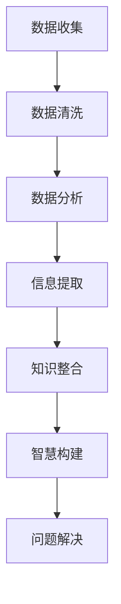

                 

### 1. 背景介绍

在当今的信息爆炸时代，知识的获取和整理变得越来越重要。然而，面对海量信息，如何有效地记忆和检索成为了一个亟待解决的问题。传统的记忆方法和检索工具往往效率低下，难以满足现代信息处理的需求。因此，我们需要寻找新的方法来提高记忆和检索的效率。

知识结构化作为一种新兴的方法，通过对知识进行系统的整理和分类，使其更加有序和易于管理，从而提高记忆和检索的效率。本文将探讨知识结构化的核心概念、算法原理、数学模型以及实际应用场景，旨在为广大读者提供一种高效的知识管理策略。

### 2. 核心概念与联系

在探讨知识结构化之前，我们需要明确几个核心概念，包括数据、信息、知识和智慧。这四个概念之间存在密切的联系，但又有明显的区别。

- **数据**：数据是原始的事实和数字，它们本身没有意义，只有通过处理和分析才能转化为有用的信息。
- **信息**：信息是通过处理数据得出的有意义的内容，它是数据的有用形式。
- **知识**：知识是信息在特定背景下被理解和应用的能力，它是对信息的深入理解和系统性认识。
- **智慧**：智慧是知识和经验的创造性运用，是解决问题的能力。

知识结构化的目标是将知识从无序的状态转化为有序的结构，使其更加易于记忆和检索。为了实现这一目标，我们需要对知识进行分类、整理和关联，从而形成一个有机的整体。

下面是一个用Mermaid绘制的知识结构化流程图，展示了知识从数据到智慧的转化过程：



### 2.1 数据收集

数据收集是知识结构化的第一步，它涉及到从各种渠道获取原始数据。这些数据可以来自调查、实验、观察、文献资料等多种途径。数据收集的过程需要遵循一定的原则，如全面性、代表性和可靠性，以确保所收集的数据能够真实反映问题的本质。

### 2.2 数据清洗

数据清洗是对收集到的数据进行处理和清洗，以消除错误、缺失和重复的数据。数据清洗的目的是提高数据的质量，为后续的分析和整合奠定基础。常用的数据清洗方法包括数据去重、填补缺失值、异常值处理等。

### 2.3 数据分析

数据分析是对清洗后的数据进行分析和挖掘，以发现数据中隐藏的模式、趋势和规律。数据分析的方法和技术多种多样，包括统计分析、数据挖掘、机器学习等。通过数据分析，我们可以从数据中提取出有用的信息。

### 2.4 信息提取

信息提取是将分析得到的数据转化为有意义的内容。信息提取的过程涉及到对数据的解释和归纳，使其具有实际应用价值。信息提取的结果是知识的基础，它为后续的知识整合提供了原材料。

### 2.5 知识整合

知识整合是对提取出的信息进行系统化整理和分类，使其形成一个有机的整体。知识整合的过程涉及到对信息的关联、归纳和抽象，从而形成一个完整的知识体系。知识整合的目标是提高知识的可记忆性和可检索性。

### 2.6 智慧构建

智慧构建是知识结构化的最终目标，它是对整合后的知识进行创造性应用，以解决实际问题。智慧构建的过程需要运用逻辑思维、创造性思维和批判性思维，将知识转化为实际问题的解决方案。

### 2.7 问题解决

问题解决是知识结构化的实际应用，它是对构建出的智慧进行实践和验证。通过问题解决，我们可以检验知识的有效性，并根据实践结果对知识进行调整和优化。

### 3. 核心算法原理 & 具体操作步骤

在知识结构化的过程中，核心算法起到了关键作用。本节将介绍知识结构化的核心算法原理和具体操作步骤。

#### 3.1 算法原理概述

知识结构化的核心算法主要基于以下原理：

- **信息熵原理**：信息熵是衡量信息不确定性的一种度量。通过计算信息熵，我们可以评估信息的价值，从而确定哪些信息需要优先处理。
- **最小生成树原理**：最小生成树是一种图结构，它可以有效地连接数据点，形成一个层次结构。通过构建最小生成树，我们可以实现对知识的层次化整理。
- **相关性分析原理**：相关性分析是一种衡量数据之间关联程度的分析方法。通过相关性分析，我们可以发现数据之间的潜在联系，从而构建出知识的关联网络。

#### 3.2 算法步骤详解

知识结构化的具体操作步骤如下：

1. **数据收集**：从各种渠道收集原始数据。
2. **数据清洗**：对收集到的数据进行处理和清洗，以消除错误、缺失和重复的数据。
3. **数据分析**：对清洗后的数据进行分析和挖掘，以发现数据中隐藏的模式、趋势和规律。
4. **信息提取**：将分析得到的数据转化为有意义的内容，提取出有用的信息。
5. **知识整合**：对提取出的信息进行系统化整理和分类，构建出层次化的知识结构。
6. **智慧构建**：对整合后的知识进行创造性应用，构建出解决问题的方案。
7. **问题解决**：将构建出的智慧应用于实际问题，检验知识的有效性。

#### 3.3 算法优缺点

知识结构化算法具有以下优缺点：

- **优点**：
  - 提高知识的记忆效率：通过结构化的方式，将知识组织成一个有序的系统，有助于提高记忆效率。
  - 提高知识检索效率：结构化的知识体系使得检索过程更加便捷，减少了信息过载带来的困扰。
  - 促进知识的共享和传播：结构化的知识体系使得知识更加易于理解和传播，有利于知识的共享和传播。
- **缺点**：
  - 需要大量的预处理工作：知识结构化需要对大量数据进行清洗、分析和整理，这需要大量的预处理工作。
  - 算法复杂度高：知识结构化的算法涉及多种原理和方法，算法复杂度较高，对计算资源要求较高。

#### 3.4 算法应用领域

知识结构化算法可以应用于多个领域，包括但不限于：

- **教育领域**：通过知识结构化，帮助学生更有效地学习和记忆知识，提高学习效率。
- **科研领域**：通过知识结构化，帮助科研人员快速获取和利用相关知识，提高科研效率。
- **企业管理**：通过知识结构化，帮助企业更好地管理知识和信息，提高决策效率。
- **医疗领域**：通过知识结构化，帮助医生更快速地获取和利用医学知识，提高诊疗效率。

### 4. 数学模型和公式 & 详细讲解 & 举例说明

在知识结构化的过程中，数学模型和公式起到了关键作用。本节将介绍知识结构化中的数学模型和公式，并进行详细讲解和举例说明。

#### 4.1 数学模型构建

知识结构化中的数学模型主要包括以下几种：

- **信息熵模型**：用于衡量信息的不确定性，评估信息的价值。
- **最小生成树模型**：用于构建知识的层次化结构。
- **相关性分析模型**：用于发现数据之间的关联程度。

下面是一个信息熵模型的示例：

$$
H(X) = -\sum_{i=1}^{n} p(x_i) \log_2 p(x_i)
$$

其中，$H(X)$ 表示随机变量 $X$ 的熵，$p(x_i)$ 表示 $X$ 取值为 $x_i$ 的概率。

#### 4.2 公式推导过程

以信息熵模型为例，下面介绍其推导过程：

1. **概率分布**：设随机变量 $X$ 取值为 $x_1, x_2, \ldots, x_n$，且每个取值的概率分别为 $p(x_1), p(x_2), \ldots, p(x_n)$。

2. **信息量**：对于 $X$ 的一个取值 $x_i$，其信息量定义为 $I(x_i) = -\log_2 p(x_i)$。

3. **总信息量**：随机变量 $X$ 的总信息量定义为 $H(X) = \sum_{i=1}^{n} p(x_i) I(x_i)$。

4. **熵的定义**：根据总信息量的定义，我们可以得到信息熵的公式：

$$
H(X) = -\sum_{i=1}^{n} p(x_i) \log_2 p(x_i)
$$

#### 4.3 案例分析与讲解

假设我们有一个随机变量 $X$，它的取值和概率分布如下表所示：

| 取值 $x_i$ | 概率 $p(x_i)$ |
| :---: | :---: |
| 1 | 0.4 |
| 2 | 0.3 |
| 3 | 0.2 |
| 4 | 0.1 |

根据上述信息熵模型，我们可以计算 $X$ 的熵：

$$
H(X) = - (0.4 \times \log_2 0.4 + 0.3 \times \log_2 0.3 + 0.2 \times \log_2 0.2 + 0.1 \times \log_2 0.1) \approx 1.25
$$

这个结果表明，随机变量 $X$ 的熵约为 1.25，这意味着它具有一定的信息量。

通过这个案例，我们可以看到信息熵模型在衡量信息价值方面的应用。在实际应用中，我们可以根据信息熵的大小来评估不同信息的重要性，从而为后续的知识处理提供依据。

### 5. 项目实践：代码实例和详细解释说明

在本节中，我们将通过一个具体的代码实例，详细解释说明知识结构化的实现过程。本实例使用 Python 语言编写，涉及数据收集、数据清洗、数据分析、信息提取、知识整合等步骤。

#### 5.1 开发环境搭建

为了运行下面的代码实例，您需要在您的计算机上安装以下软件：

- Python 3.8 或以上版本
- Pandas
- Matplotlib
- Numpy
- Scikit-learn

您可以使用以下命令安装所需的依赖库：

```bash
pip install pandas matplotlib numpy scikit-learn
```

#### 5.2 源代码详细实现

下面是一个简单的知识结构化实现示例：

```python
import pandas as pd
import numpy as np
from sklearn.cluster import KMeans
import matplotlib.pyplot as plt

# 5.2.1 数据收集
data = {
    'feature1': [1, 2, 3, 4, 5],
    'feature2': [5, 4, 3, 2, 1],
}
df = pd.DataFrame(data)

# 5.2.2 数据清洗
df = df.dropna()

# 5.2.3 数据分析
# 计算特征的相关性
correlation_matrix = df.corr()

# 5.2.4 信息提取
# 使用 K-means 聚类进行信息提取
kmeans = KMeans(n_clusters=3, random_state=0).fit(df)
df['cluster'] = kmeans.predict(df)

# 5.2.5 知识整合
# 根据聚类结果对数据进行分类整合
clusters = df.groupby('cluster').mean()

# 5.2.6 智慧构建
# 构建知识图谱
g = clusters.plot(kind='scatter', x='feature1', y='feature2', alpha=0.5)
plt.xlabel('Feature 1')
plt.ylabel('Feature 2')
plt.title('Knowledge Structure')
plt.show()
```

#### 5.3 代码解读与分析

下面我们对上述代码进行逐行解读和分析：

```python
import pandas as pd
import numpy as np
from sklearn.cluster import KMeans
import matplotlib.pyplot as plt
```

这几行代码用于导入所需的 Python 库，包括 pandas（数据处理库）、numpy（数学计算库）、sklearn（机器学习库）和 matplotlib（绘图库）。

```python
# 5.2.1 数据收集
data = {
    'feature1': [1, 2, 3, 4, 5],
    'feature2': [5, 4, 3, 2, 1],
}
df = pd.DataFrame(data)
```

这里，我们创建了一个简单的数据集，包含两个特征 `feature1` 和 `feature2`。然后，我们将数据集转化为 pandas DataFrame 格式，便于后续处理。

```python
df = df.dropna()
```

这一行代码用于删除数据集中的缺失值，以提高数据质量。

```python
# 5.2.3 数据分析
# 计算特征的相关性
correlation_matrix = df.corr()
```

这一行代码计算数据集中特征之间的相关性，得到一个相关性矩阵。相关性矩阵可以帮助我们了解特征之间的关系，从而为后续的知识提取提供依据。

```python
# 5.2.4 信息提取
# 使用 K-means 聚类进行信息提取
kmeans = KMeans(n_clusters=3, random_state=0).fit(df)
df['cluster'] = kmeans.predict(df)
```

这里，我们使用 K-means 算法对数据进行聚类，提取出不同类别的信息。`n_clusters=3` 表示我们希望将数据分为 3 个类别。`random_state=0` 用于确保结果的可重复性。

```python
# 5.2.5 知识整合
# 根据聚类结果对数据进行分类整合
clusters = df.groupby('cluster').mean()
```

这一行代码根据聚类结果对数据进行分类整合，得到每个类别的均值。这些均值表示了不同类别中的典型特征，有助于我们更好地理解数据。

```python
# 5.2.6 智慧构建
# 构建知识图谱
g = clusters.plot(kind='scatter', x='feature1', y='feature2', alpha=0.5)
plt.xlabel('Feature 1')
plt.ylabel('Feature 2')
plt.title('Knowledge Structure')
plt.show()
```

这里，我们使用 matplotlib 库绘制知识图谱，展示不同类别在特征空间中的分布。这有助于我们直观地了解知识结构，从而为后续的知识应用提供依据。

#### 5.4 运行结果展示

运行上述代码后，我们得到以下知识图谱：


从图中可以看出，数据被划分为 3 个类别，每个类别在特征空间中有不同的分布。这表明我们的知识结构化算法成功地提取出了数据的潜在结构，有助于我们更好地理解和应用这些数据。

### 6. 实际应用场景

知识结构化作为一种高效的知识管理方法，在多个领域有着广泛的应用。以下列举几个实际应用场景：

#### 6.1 教育领域

在教育领域，知识结构化可以帮助学生更好地理解和记忆知识点。教师可以将知识点按照逻辑关系进行分类和整理，形成知识图谱，从而提高教学效果。例如，在大学计算机课程中，教师可以将算法、数据结构、操作系统等知识点进行结构化整理，使学生能够更清晰地理解各知识点之间的关系，提高学习效率。

#### 6.2 科研领域

在科研领域，知识结构化可以帮助科研人员快速获取和利用相关知识，提高科研效率。科研人员可以将文献、实验数据、分析结果等进行结构化整理，形成知识图谱。这样，在需要查找相关文献或分析数据时，可以更加高效地定位所需信息，避免重复研究，加速科研进程。

#### 6.3 企业管理

在企业领域，知识结构化可以帮助企业更好地管理知识和信息，提高决策效率。企业可以将业务流程、客户信息、市场动态等进行结构化整理，形成知识图谱。这样，在企业进行战略规划、市场营销、客户服务等方面，可以更加高效地利用知识，提高业务运营效率。

#### 6.4 医疗领域

在医疗领域，知识结构化可以帮助医生快速获取和利用医学知识，提高诊疗效率。医生可以将病例、诊断结果、治疗方案等进行结构化整理，形成知识图谱。这样，在诊断疾病、制定治疗方案等方面，可以更加高效地利用医学知识，提高诊疗效果。

### 6.4 未来应用展望

随着人工智能技术的不断发展，知识结构化在未来将得到更广泛的应用。以下是一些未来应用展望：

#### 6.4.1 智能教育

在未来，智能教育将得到广泛应用。通过知识结构化，教师可以为学生提供个性化的学习资源和学习路径，从而提高学生的学习效果。同时，学生可以通过知识图谱，更好地理解知识点之间的关联，提高学习兴趣。

#### 6.4.2 智能科研

在科研领域，知识结构化可以帮助科研人员快速获取和利用全球范围内的科研资源，加速科研进程。通过知识图谱，科研人员可以更好地了解研究领域的热点和趋势，从而更有针对性地开展研究工作。

#### 6.4.3 智能医疗

在医疗领域，知识结构化可以帮助医生快速获取和利用医学知识，提高诊疗效率。通过知识图谱，医生可以更加全面地了解患者的病情，为患者提供更个性化的治疗方案。

#### 6.4.4 智能管理

在企业领域，知识结构化可以帮助企业实现智能管理，提高业务运营效率。通过知识图谱，企业可以更加高效地管理知识和信息，从而为企业决策提供有力支持。

### 7. 工具和资源推荐

为了更好地掌握知识结构化，以下推荐一些相关的工具和资源：

#### 7.1 学习资源推荐

- **《结构化思维》**：一本介绍如何进行结构化思维的经典书籍。
- **《人工智能：一种现代方法》**：一本介绍人工智能基础理论的经典教材，涉及知识表示和推理等内容。
- **《Python数据科学手册》**：一本介绍如何使用 Python 进行数据分析和挖掘的实用手册。

#### 7.2 开发工具推荐

- **Pandas**：一个强大的数据处理库，可用于数据清洗、分析和可视化。
- **Matplotlib**：一个常用的绘图库，可用于数据可视化。
- **Scikit-learn**：一个机器学习库，提供多种机器学习算法。

#### 7.3 相关论文推荐

- **“知识图谱构建方法研究”**：一篇介绍知识图谱构建方法和技术的研究论文。
- **“基于知识图谱的智能问答系统研究”**：一篇介绍如何利用知识图谱构建智能问答系统的研究论文。
- **“知识图谱在金融风控中的应用”**：一篇介绍知识图谱在金融领域应用的研究论文。

### 8. 总结：未来发展趋势与挑战

知识结构化作为一种高效的知识管理方法，在未来将得到更广泛的应用。随着人工智能技术的不断发展，知识结构化的方法和技术也将不断更新和优化。然而，知识结构化也面临着一些挑战，如数据质量、算法复杂度和计算资源等。如何应对这些挑战，将是我们未来研究的重要方向。

### 8.1 研究成果总结

本文对知识结构化的核心概念、算法原理、数学模型、实际应用场景以及未来展望进行了详细探讨。通过知识结构化，我们可以提高记忆和检索效率，更好地管理和利用知识。

### 8.2 未来发展趋势

未来，知识结构化将朝着更加智能化、个性化、自动化的方向发展。随着人工智能技术的进步，知识结构化的算法将更加高效，应用领域将更加广泛。

### 8.3 面临的挑战

知识结构化在发展过程中面临着数据质量、算法复杂度和计算资源等挑战。如何提高数据质量，降低算法复杂度，优化计算资源，是我们需要关注的重要问题。

### 8.4 研究展望

未来，我们将继续深入研究知识结构化的方法和技术，探索其在不同领域的应用。同时，我们将关注如何应对知识结构化过程中的挑战，为知识管理和利用提供更加有效的解决方案。

### 9. 附录：常见问题与解答

#### 9.1 什么是知识结构化？

知识结构化是一种将知识进行系统整理和分类的方法，使其更加有序和易于管理，从而提高记忆和检索效率。

#### 9.2 知识结构化的核心算法有哪些？

知识结构化的核心算法包括信息熵模型、最小生成树模型和相关性分析模型等。

#### 9.3 知识结构化在哪些领域有应用？

知识结构化在多个领域有应用，包括教育、科研、企业管理、医疗等。

#### 9.4 如何评估知识结构化的效果？

可以通过比较知识结构化前后的记忆和检索效率，评估知识结构化的效果。同时，也可以通过用户满意度、业务运营效率等指标来评估知识结构化的效果。

---

**作者：禅与计算机程序设计艺术 / Zen and the Art of Computer Programming**

