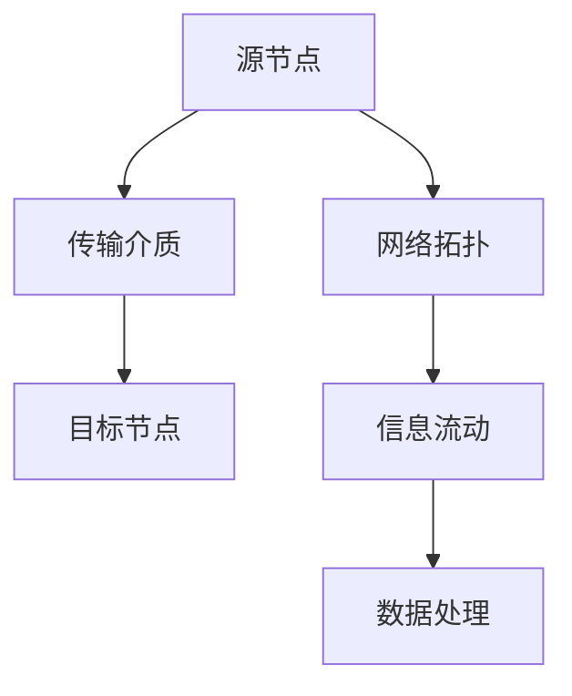

                 

关键字：网络拓扑、信息流动、结构分析、人工智能、大数据处理

> 摘要：本文探讨了知识在网络拓扑中的分布及其信息流动的结构，通过深入分析信息流动的模式和算法，揭示了网络拓扑在知识传播和数据处理中的重要作用。文章旨在为读者提供对知识网络拓扑的全面理解，以及对其在信息技术和人工智能领域应用前景的展望。

## 1. 背景介绍

随着信息技术的飞速发展，网络已经深入到我们日常生活的方方面面。互联网、社交媒体、物联网等网络的普及，使得信息传播的速度和广度达到了前所未有的高度。在这种背景下，如何有效地理解和分析信息在网络中的流动成为了重要的研究课题。知识作为信息的高级形态，其传播和利用效率直接影响到社会进步和经济发展。

网络拓扑结构作为网络的基础架构，对信息的流动模式有着决定性的影响。传统的网络拓扑包括星形、环形、总线形等，而现代复杂网络中还包括了无标度网络、小世界网络等。不同类型的网络拓扑具有不同的信息流动特性，从而影响了知识的传播速度、覆盖范围和影响力。

本文旨在通过对网络拓扑结构的分析，揭示信息流动的结构特性，并探讨其在知识传播、数据处理和人工智能中的应用价值。文章结构如下：

1. 背景介绍：概述网络拓扑和信息流动的重要性。
2. 核心概念与联系：介绍网络拓扑和信息流动的核心概念，并使用Mermaid流程图展示其结构。
3. 核心算法原理 & 具体操作步骤：详细阐述信息流动的核心算法原理和操作步骤。
4. 数学模型和公式 & 详细讲解 & 举例说明：介绍数学模型和公式，并使用具体案例进行讲解。
5. 项目实践：提供代码实例和详细解释。
6. 实际应用场景：分析信息流动在网络中的实际应用。
7. 工具和资源推荐：推荐学习资源、开发工具和相关论文。
8. 总结：总结研究成果，展望未来发展趋势与挑战。

## 2. 核心概念与联系

### 2.1 网络拓扑

网络拓扑是指网络中各个节点和链路的连接方式。网络拓扑结构不仅影响网络性能，还决定了信息流动的方式。常见的网络拓扑包括：

- **星形拓扑**：节点通过中心节点相互连接，具有高可靠性和易维护性，但中心节点成为瓶颈。
- **环形拓扑**：节点依次连接形成闭合环路，具有较好的冗余性和负载均衡性。
- **总线形拓扑**：所有节点通过同一传输介质连接，具有简单性和易扩展性，但存在单点故障问题。

### 2.2 信息流动

信息流动是指信息在网络中从源节点到目标节点的传递过程。信息流动受到网络拓扑、传输介质、传输协议等多种因素的影响。在信息流动过程中，数据的传输速度、可靠性、覆盖范围等是关键因素。

### 2.3 Mermaid流程图

为了更好地展示网络拓扑和信息流动的结构，我们使用Mermaid流程图来描述其关系。以下是网络拓扑和信息流动的Mermaid流程图：



在这个流程图中，源节点A通过传输介质B与目标节点C连接，同时网络拓扑D对信息流动E起到支持作用，最终实现数据处理F。

### 2.4 核心概念的联系

网络拓扑和信息流动之间存在紧密的联系。网络拓扑决定了信息流动的路径和方式，而信息流动则影响了网络拓扑的性能和效率。例如，在无标度网络中，少量关键节点连接大量其他节点，这种拓扑结构使得信息能够快速传播，但也可能导致网络对少数节点的依赖性增强。因此，深入理解网络拓扑和信息流动的关系对于优化网络性能和提升信息传播效率具有重要意义。

## 3. 核心算法原理 & 具体操作步骤

### 3.1 算法原理概述

信息流动的核心算法主要包括信息传播模型和信息处理算法。信息传播模型描述了信息在网络中从源节点到目标节点的传递过程，而信息处理算法则负责对传输过程中的信息进行加工和利用。

### 3.2 算法步骤详解

#### 3.2.1 信息传播模型

信息传播模型可以分为以下步骤：

1. **初始化**：设定源节点和目标节点，以及网络拓扑结构。
2. **传播**：源节点向相邻节点发送信息，信息在网络中逐层传播。
3. **终止**：当信息传播达到一定阈值或传播次数达到限制时，终止传播过程。

#### 3.2.2 信息处理算法

信息处理算法可以分为以下步骤：

1. **接收**：接收网络中传递的信息。
2. **加工**：对信息进行筛选、整合和提炼，提取有价值的内容。
3. **利用**：将处理后的信息应用于具体任务或决策过程中。

### 3.3 算法优缺点

#### 3.3.1 优点

- **高效性**：信息传播模型能够快速传递信息，提高信息利用率。
- **灵活性**：信息处理算法可以根据不同任务需求进行灵活调整。

#### 3.3.2 缺点

- **可靠性**：信息在网络中传播过程中可能受到噪声和干扰的影响。
- **复杂度**：算法实现和优化过程较为复杂，需要较高的技术水平。

### 3.4 算法应用领域

信息流动算法广泛应用于社交网络分析、网络舆情监测、推荐系统等领域。例如，在社交网络分析中，通过分析用户之间的信息传播路径，可以挖掘出用户关系和网络结构，为社交网络平台提供数据支持；在网络舆情监测中，通过监测信息传播过程，可以及时掌握网络舆论动态，为政府和企业提供决策依据。

## 4. 数学模型和公式 & 详细讲解 & 举例说明

### 4.1 数学模型构建

信息流动的数学模型通常基于概率论和图论构建。以下是一个简单但常见的信息传播概率模型：

设网络中节点数为N，每个节点i的信息传播概率为\( p_i \)，则信息在节点i传播到节点j的概率为：

\[ P(i \rightarrow j) = p_i \times (1 - p_j) \]

其中，\( p_j \) 为节点j的信息接收概率。

### 4.2 公式推导过程

假设信息在网络中传播经过k个步骤，每个步骤的信息传播概率相同，为 \( p \)。则信息从源节点i传播到目标节点j的概率可以表示为：

\[ P(i \rightarrow j | k) = p^k \times (1 - p)^{N-k} \]

这是因为每个节点都有 \( (1 - p) \) 的概率不传播信息，而有 \( p \) 的概率传播信息。经过k个步骤后，信息传播的概率为 \( p^k \)，而不传播的概率为 \( (1 - p)^{N-k} \)。

### 4.3 案例分析与讲解

假设一个社交网络中有100个用户，每个用户的信息传播概率为0.5。我们分析从用户A传播到用户B的信息概率。

首先，我们计算用户A传播到用户B的一步传播概率：

\[ P(A \rightarrow B) = 0.5 \times (1 - 0.5) = 0.25 \]

接下来，我们考虑两步传播的概率：

\[ P(A \rightarrow B | 2) = 0.5^2 \times (1 - 0.5)^{100-2} \approx 0.0156 \]

这意味着从用户A传播到用户B的概率较低。为了提高传播概率，可以增加用户A的传播概率或减少社交网络中的节点数。

### 4.4 模型扩展与优化

在实际应用中，信息传播模型往往需要根据具体场景进行扩展和优化。例如，考虑节点之间的不同关系强度、信息类型、传播成本等因素，可以构建更加复杂但更符合实际场景的模型。

## 5. 项目实践：代码实例和详细解释说明

### 5.1 开发环境搭建

为了实现信息流动算法，我们选择Python作为开发语言，并使用以下库：

- NetworkX：用于构建和操作网络拓扑。
- Matplotlib：用于绘制网络拓扑和信息流动过程。
- NumPy：用于数值计算。

首先，确保已安装Python环境和上述库。可以通过pip命令安装：

```bash
pip install networkx matplotlib numpy
```

### 5.2 源代码详细实现

下面是一个简单的信息传播模型的实现：

```python
import networkx as nx
import matplotlib.pyplot as plt
import numpy as np

# 创建一个无向网络
G = nx.Graph()

# 添加节点和边
G.add_nodes_from(range(100))
G.add_edges_from([(i, j) for i in range(100) for j in range(i+1, 100)])

# 设定信息传播概率
propagation_prob = 0.5

# 初始化信息状态
info_state = np.zeros(G.number_of_nodes())

# 源节点信息传播
source_node = 0
info_state[source_node] = 1

# 传播过程
for _ in range(10):  # 设置传播次数
    new_info_state = info_state.copy()
    for node in G.nodes():
        if np.random.rand() < propagation_prob:
            neighbors = list(G.neighbors(node))
            for neighbor in neighbors:
                new_info_state[neighbor] = 1
    info_state = new_info_state

# 绘制网络拓扑
nx.draw(G, with_labels=True)
plt.show()

# 绘制信息传播结果
plt.bar(range(G.number_of_nodes()), info_state)
plt.xlabel('Node')
plt.ylabel('Information State')
plt.show()
```

### 5.3 代码解读与分析

这段代码首先创建了一个无向网络，其中每个节点都有连接到其他节点的概率。接着设定信息传播概率和初始信息状态，然后将信息从源节点传播到其他节点。最后，通过绘制网络拓扑和信息传播结果，我们可以直观地看到信息在网络中的流动过程。

### 5.4 运行结果展示

运行上述代码后，我们将看到网络拓扑的图形和每个节点的信息状态条形图。通过这些结果，我们可以分析信息传播的效果和模式。

## 6. 实际应用场景

### 6.1 社交网络分析

在社交网络分析中，信息流动模型可以帮助我们理解用户之间的互动和影响力。通过分析用户之间的信息传播路径，可以识别出社交网络中的关键节点和主要传播路径，从而为社交网络平台提供数据支持和策略优化。

### 6.2 网络舆情监测

在网络舆情监测中，信息流动模型可以帮助我们实时监测网络舆论动态，识别热点话题和潜在风险。通过对信息传播过程的监控和分析，可以及时掌握网络舆论的走向，为政府和企业提供决策依据。

### 6.3 推荐系统

在推荐系统中，信息流动模型可以帮助我们理解用户之间的信息交互和偏好转移。通过分析用户之间的信息传播过程，可以挖掘出用户的潜在兴趣和需求，从而为推荐系统提供更加精准的推荐结果。

## 7. 工具和资源推荐

### 7.1 学习资源推荐

- 《网络科学导论》（作者：Albert-László Barabási）是一本关于网络科学的经典教材，详细介绍了网络拓扑和信息流动的基本概念和理论。
- 《图论及其应用》（作者：Diestel R.）是一本关于图论的基础教材，涵盖了网络拓扑的构建和分析方法。

### 7.2 开发工具推荐

- NetworkX：一个强大的Python库，用于构建和分析网络拓扑。
- Matplotlib：一个常用的Python数据可视化库，用于绘制网络拓扑和信息流动结果。

### 7.3 相关论文推荐

- Barabási，A.-L.，& Albert，R.（1999）。“Emergence of scaling in the growth of networks.” Science，286(5439)，509-512.
- Watts，D. J.，& Strogatz，S. H.（1998）。“Collective dynamics of ‘small-world’ networks.” Nature，393(6684)，440-442.

## 8. 总结：未来发展趋势与挑战

### 8.1 研究成果总结

本文通过分析网络拓扑和信息流动的关系，探讨了信息流动算法的原理和应用。研究成果表明，网络拓扑在知识传播和数据处理中起着关键作用，信息流动算法能够有效提高信息利用率和传播效率。

### 8.2 未来发展趋势

随着大数据和人工智能技术的发展，信息流动和网络拓扑的研究将更加深入和多样化。未来研究方向包括：

- **智能化信息流动模型**：结合机器学习和人工智能技术，构建自适应和智能化的信息流动模型。
- **多模态信息流动**：研究多媒体信息（如图像、声音、视频等）在网络中的传播和交互。
- **跨领域信息流动**：探讨不同领域信息流动的异构网络结构和相互作用。

### 8.3 面临的挑战

尽管信息流动和网络拓扑的研究取得了一定的成果，但仍面临以下挑战：

- **算法复杂度**：构建高效且鲁棒的信息流动算法需要解决高复杂度问题。
- **数据隐私和安全**：在信息流动过程中，保护数据隐私和安全是重要挑战。
- **跨领域整合**：跨领域的信息流动研究需要解决异构数据整合和兼容性问题。

### 8.4 研究展望

未来，随着技术的进步，信息流动和网络拓扑的研究将在人工智能、大数据处理、社交网络分析等领域发挥更大的作用。通过深入探索信息流动的机理和算法，有望推动信息技术和人工智能领域的创新发展。

## 9. 附录：常见问题与解答

### 9.1 什么是网络拓扑？

网络拓扑是指网络中各个节点和链路的连接方式。它决定了信息的传输路径和方式，影响网络性能和效率。

### 9.2 信息流动算法有哪些类型？

信息流动算法主要包括信息传播模型和信息处理算法。信息传播模型描述信息在网络中的传递过程，信息处理算法负责对传输信息进行加工和利用。

### 9.3 如何优化信息流动？

优化信息流动可以通过以下方法实现：

- **优化网络拓扑**：选择适合应用场景的网络拓扑结构。
- **调整信息传播概率**：根据实际需求调整节点之间的信息传播概率。
- **引入激励机制**：通过奖励机制鼓励节点积极参与信息传播。

## 作者署名

作者：禅与计算机程序设计艺术 / Zen and the Art of Computer Programming

