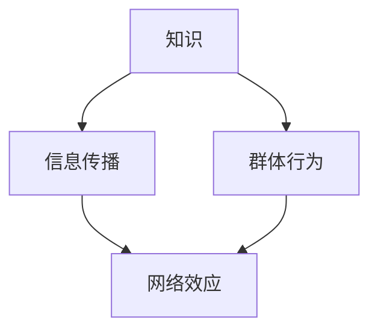

                 

 **关键词**：网络效应、信息传播、群体行为、人工智能、算法、模型、技术趋势

> **摘要**：本文深入探讨了知识的网络效应在信息传播和群体行为中的作用。通过分析核心概念、算法原理、数学模型以及项目实践，揭示了网络效应如何影响知识的传播、群体的决策和行为，以及其未来的发展趋势和面临的挑战。文章旨在为研究人员和从业者提供关于知识网络效应的全面理解和应用指导。

## 1. 背景介绍

在当今数字化时代，信息传播的速度和范围达到了前所未有的高度。随着社交媒体、在线社区和智能设备的普及，信息传播已经成为影响社会、经济、政治等多个领域的重要因素。与此同时，群体行为的研究也成为社会科学和计算机科学领域的热点话题。群体行为涉及到个体的互动、协作和决策过程，对于理解社会现象、制定政策以及开发新型技术具有重要意义。

知识的网络效应（Network Effects of Knowledge）是指在信息传播和群体行为中，知识通过网络的连接和互动而产生的增强效应。这种效应不仅影响个体的知识获取和行为，还影响着群体的动态和演化。随着互联网和人工智能技术的发展，知识的网络效应逐渐显现，成为推动知识传播和群体行为的关键因素。

本文旨在探讨知识的网络效应在信息传播和群体行为中的作用，分析其核心概念和原理，并通过实际案例和项目实践，展示其在现实世界中的应用和影响。文章结构如下：

- **第1章**：背景介绍，概述知识的网络效应及其重要性。
- **第2章**：核心概念与联系，介绍知识网络效应的基础概念和相关联系。
- **第3章**：核心算法原理 & 具体操作步骤，详细探讨知识网络效应的算法实现和操作步骤。
- **第4章**：数学模型和公式 & 详细讲解 & 举例说明，运用数学模型分析知识网络效应。
- **第5章**：项目实践：代码实例和详细解释说明，通过具体项目实践展示知识网络效应。
- **第6章**：实际应用场景，探讨知识网络效应在各个领域的应用。
- **第7章**：工具和资源推荐，提供相关工具和资源。
- **第8章**：总结：未来发展趋势与挑战，总结研究成果，展望未来发展。
- **第9章**：附录：常见问题与解答，解答常见疑问。

通过对这些章节的深入探讨，本文希望为读者提供一个全面而深入的视角，理解知识的网络效应及其在信息传播和群体行为中的重要作用。

## 2. 核心概念与联系

在探讨知识的网络效应之前，我们需要明确一些核心概念，以便建立一个清晰的理论框架。以下是对知识、网络效应、信息传播和群体行为的详细定义及其相互联系。

### 知识

知识是人类通过学习、实践和体验获得的信息、技能和认识。它包括事实、理论、方法、经验等。在信息时代，知识的获取和传播变得尤为重要，因为它直接影响到个体和群体的行为、决策和发展。

### 网络效应

网络效应是指一种产品或服务的价值随着使用该产品或服务的用户数量的增加而增加的现象。在互联网时代，网络效应尤为显著，因为互联网使得用户之间的互动和连接变得更加容易和高效。

### 信息传播

信息传播是指信息从源头通过某种渠道传递到目标受众的过程。在数字时代，信息传播的速度和范围得到了极大提升，社交媒体、搜索引擎和在线论坛等平台成为信息传播的主要渠道。

### 群体行为

群体行为是指个体在群体中的互动、协作和决策过程。群体行为的研究涉及到社会学、心理学和计算机科学等多个领域，对于理解社会现象、制定政策具有重要意义。

### 核心概念的联系

知识的网络效应涉及多个核心概念之间的相互作用。首先，知识作为基础，通过信息传播在网络中扩散，影响着个体的认知和行为。网络效应则通过用户数量的增加，提高了知识传播的效率和价值。信息传播是知识扩散的渠道，而群体行为则反映了知识在网络中的影响。

以下是一个简化的 Mermaid 流程图，展示了这些核心概念及其相互联系：



在这个流程图中，知识通过信息传播影响群体行为，而网络效应则通过用户互动增强知识的传播效果。这种相互作用构成了知识的网络效应，影响着信息传播和群体行为的动态演化。

### 知识网络效应的算法原理

为了更好地理解知识网络效应的算法原理，我们需要探讨几种关键算法，这些算法不仅在理论上具有重要意义，而且在实际应用中也有着广泛的应用。以下将详细探讨这些算法的原理和具体操作步骤。

#### 算法1：PageRank算法

PageRank算法是由Google的创始人拉里·佩奇和谢尔盖·布林提出的一种用于网页排名的算法。它基于网页之间的链接关系，评估网页的重要性和权威性。其基本原理如下：

1. **网页重要性评分**：每个网页都有一个初始重要性评分（初始为1），表示其初步的重要性。
2. **链接传递**：一个网页上的链接会将其重要性传递给被链接的网页。传递的重要性值取决于链接的数量和质量。
3. **迭代计算**：通过多次迭代，计算每个网页的最终重要性评分，从而实现网页排名。

具体操作步骤：

1. **初始化**：每个网页的初始重要性评分设置为1。
2. **计算链接传递**：对于每个网页，计算其链接到其他网页的数量和质量，并将重要性值传递给这些网页。
3. **更新评分**：根据链接传递的重要性值，更新每个网页的评分。
4. **重复迭代**：重复步骤2和步骤3，直到评分收敛，即评分变化非常小。

PageRank算法的优缺点：

- **优点**：能够准确地评估网页的重要性和权威性，为搜索引擎提供了有效的网页排序方法。
- **缺点**：仅基于链接关系，忽略了内容质量和其他因素。

#### 算法2：协同过滤算法

协同过滤算法是一种基于用户行为和兴趣的推荐算法，主要用于个性化推荐系统。其基本原理如下：

1. **用户行为记录**：记录用户的历史行为数据，如浏览、购买、评分等。
2. **相似度计算**：计算用户之间的相似度，可以使用欧几里得距离、余弦相似度等方法。
3. **推荐生成**：基于用户相似度，生成推荐列表，向用户推荐他们可能感兴趣的商品或内容。

具体操作步骤：

1. **数据收集**：收集用户的行为数据。
2. **相似度计算**：计算用户之间的相似度。
3. **推荐生成**：根据用户相似度，生成推荐列表。

协同过滤算法的优缺点：

- **优点**：能够根据用户行为和兴趣生成个性化的推荐，提高用户体验。
- **缺点**：需要大量的用户行为数据，且在用户数量较少或数据稀疏时效果不佳。

#### 算法3：深度学习模型

深度学习模型是一种基于多层神经网络的机器学习模型，能够自动从大量数据中学习特征和模式。在知识网络效应的研究中，深度学习模型被广泛应用于信息传播和群体行为的预测和分析。

具体操作步骤：

1. **数据预处理**：收集和处理原始数据，如用户行为、网页内容、社交媒体互动等。
2. **特征提取**：使用深度学习模型提取数据中的特征。
3. **模型训练**：使用训练数据训练深度学习模型，调整模型参数。
4. **模型评估**：使用测试数据评估模型性能，并进行调整。

深度学习模型的优缺点：

- **优点**：能够自动学习复杂的数据特征，提高预测和分析的准确性。
- **缺点**：需要大量的训练数据和计算资源，模型解释性较差。

### 算法优缺点总结

不同算法在知识网络效应的研究中各有优缺点。PageRank算法基于链接关系，能够准确评估网页重要性和权威性，但忽略了内容质量和其他因素。协同过滤算法能够根据用户行为和兴趣生成个性化推荐，但在用户数量较少或数据稀疏时效果不佳。深度学习模型能够自动学习复杂的数据特征，提高预测和分析的准确性，但需要大量的训练数据和计算资源，且模型解释性较差。

综上所述，选择合适的算法取决于具体的研究目标和应用场景。在实际应用中，可以结合多种算法的优势，提高知识网络效应的研究效果。

### 算法应用领域

知识网络效应的算法不仅在理论研究中具有重要价值，在实际应用领域中也展现出了强大的潜力和广泛的应用场景。以下将详细探讨这些算法在互联网、社交网络、推荐系统等领域的具体应用。

#### 互联网

在互联网领域，知识网络效应的算法被广泛应用于搜索引擎优化（SEO）和网站排名。PageRank算法便是其中的代表性算法，它通过分析网页之间的链接关系，评估网页的重要性和权威性，从而实现有效的网页排序。Google搜索引擎便是基于PageRank算法，为用户提供高质量的搜索结果。

此外，深度学习模型在互联网中的应用也日益广泛。通过分析用户行为数据和网页内容，深度学习模型能够自动提取关键特征，实现个性化推荐和广告投放。例如，淘宝和京东等电商平台的推荐系统，就是利用深度学习模型分析用户的历史购买行为和浏览记录，为用户提供个性化的商品推荐。

#### 社交网络

社交网络是知识网络效应的重要应用领域之一。在社交网络中，用户之间通过分享、评论和转发等方式进行互动，形成了一个复杂的信息传播网络。知识网络效应的算法可以用于分析社交网络中的信息传播路径和影响力。

协同过滤算法在社交网络中的应用非常广泛。例如，在Facebook和Twitter等社交媒体平台上，协同过滤算法被用于推荐用户可能感兴趣的朋友、内容和广告。通过分析用户之间的相似度，协同过滤算法能够为用户推荐潜在的社交关系和内容，从而提高用户的参与度和留存率。

深度学习模型也在社交网络中发挥了重要作用。通过分析用户的语言和行为，深度学习模型能够预测用户的兴趣和偏好，从而实现精准的内容推荐和广告投放。例如，微博和微信等社交媒体平台，就是利用深度学习模型分析用户的微博内容和互动行为，为用户提供个性化推荐。

#### 推荐系统

推荐系统是知识网络效应算法应用的另一个重要领域。推荐系统旨在根据用户的兴趣和偏好，为用户推荐他们可能感兴趣的商品、服务和内容。知识网络效应的算法在推荐系统中发挥着关键作用。

协同过滤算法在推荐系统中得到了广泛应用。例如，在电影推荐系统中，协同过滤算法通过分析用户对电影的评价，为用户推荐他们可能喜欢观看的电影。尽管在用户数量较少或数据稀疏时效果不佳，但协同过滤算法在大多数情况下仍能够为用户提供高质量的推荐。

深度学习模型在推荐系统中的应用也越来越普遍。通过分析用户的历史行为数据和内容特征，深度学习模型能够实现更加精准和个性化的推荐。例如，亚马逊和Netflix等在线平台，就是利用深度学习模型分析用户的购物记录和观看记录，为用户提供个性化的商品推荐和影视推荐。

#### 其他应用领域

除了上述领域，知识网络效应的算法还在其他领域展示了强大的应用潜力。例如，在生物信息学领域，知识网络效应的算法被用于分析基因之间的关系和功能。在金融领域，知识网络效应的算法被用于风险评估和投资组合优化。在智能交通领域，知识网络效应的算法被用于交通流量预测和路径规划。

总之，知识网络效应的算法在多个领域展现了广泛的应用前景，为人们提供了更加精准和高效的决策工具。随着技术的不断发展，这些算法将在更多领域得到应用，推动社会的进步和发展。

### 4.1 数学模型构建

在分析知识网络效应时，构建精确的数学模型是理解其内在机制的关键。以下将详细描述知识网络效应的基本数学模型，并解释其构建过程。

#### 网络拓扑模型

首先，我们需要一个描述网络结构的数学模型。网络可以视为一个图（Graph），其中节点（Node）表示个体或知识单元，边（Edge）表示个体之间的交互或知识传播关系。图的基本结构可以用邻接矩阵（Adjacency Matrix）表示：

\[ A = \begin{bmatrix}
    a_{11} & a_{12} & \cdots & a_{1n} \\
    a_{21} & a_{22} & \cdots & a_{2n} \\
    \vdots & \vdots & \ddots & \vdots \\
    a_{n1} & a_{n2} & \cdots & a_{nn}
\end{bmatrix} \]

其中，\( a_{ij} \) 表示节点 \( i \) 与节点 \( j \) 之间的边存在性，取值为 1 或 0。这种邻接矩阵可以用于表示网络的基本结构。

#### 社会网络分析模型

为了分析网络中知识传播的动态过程，我们可以使用社会网络分析（Social Network Analysis，SNA）模型。SNA 模型通常基于马尔可夫链（Markov Chain）模型，其中每个节点在给定当前状态的情况下，其下一个状态是独立的。这种独立性假设使得我们能够使用简单的概率模型来描述节点的状态转移。

假设网络中每个节点的状态可以用一个随机变量 \( X_i(t) \) 表示，其中 \( t \) 表示时间。状态可以是“知晓某条信息”或“未知晓某条信息”。我们可以用概率 \( p_{ij} \) 表示节点 \( i \) 在时间 \( t \) 转变为状态 \( j \) 的概率。这种概率可以用邻接矩阵 \( A \) 来描述：

\[ p_{ij} = \frac{a_{ij}}{\sum_{k=1}^{n} a_{ik}} \]

其中，\( \sum_{k=1}^{n} a_{ik} \) 表示节点 \( i \) 的出度。

#### 网络传播模型

在知识传播的过程中，我们还需要考虑外部因素对网络状态的影响。例如，外部信息的注入、网络结构的动态变化等。这种情况下，我们可以使用广义马尔可夫链（Generalized Markov Chain）模型来描述网络状态的动态变化。

假设节点 \( i \) 在时间 \( t \) 的状态受到外部影响，状态转移概率可以表示为：

\[ p_{ij}(t+1) = p_{ij} + \delta_i(t) \cdot f_j(t) \]

其中，\( \delta_i(t) \) 表示外部信息注入的强度，\( f_j(t) \) 表示节点 \( j \) 对节点 \( i \) 的影响函数。

#### 网络效应模型

最后，我们需要考虑网络效应对知识传播的影响。网络效应可以通过节点之间的互动强度和网络的紧密程度来衡量。网络效应可以表示为：

\[ \Phi(t) = \sum_{i=1}^{n} \sum_{j=1}^{n} w_{ij} \cdot s_i(t) \cdot s_j(t) \]

其中，\( w_{ij} \) 表示节点 \( i \) 和节点 \( j \) 之间的互动强度，\( s_i(t) \) 和 \( s_j(t) \) 分别表示节点 \( i \) 和节点 \( j \) 在时间 \( t \) 的状态。

#### 数学模型构建总结

综上所述，知识网络效应的数学模型可以通过以下步骤构建：

1. **定义网络结构**：使用邻接矩阵表示网络的拓扑结构。
2. **描述状态转移**：使用概率模型描述节点状态的转移过程。
3. **考虑外部因素**：引入外部影响和互动强度，描述网络状态的动态变化。
4. **衡量网络效应**：使用网络效应函数衡量网络互动对知识传播的影响。

通过这些步骤，我们可以构建一个完整的数学模型，用于分析和预测知识在网络中的传播过程。

### 4.2 公式推导过程

在构建了知识网络效应的数学模型之后，我们需要进行公式的推导，以理解模型中的各个参数和变量如何相互作用，从而影响知识在网络中的传播过程。以下将详细阐述关键公式及其推导过程。

#### 状态转移概率公式

首先，我们需要推导节点状态转移的概率公式。假设节点 \( i \) 在时间 \( t \) 的状态 \( s_i(t) \) 可以是知晓某条信息（状态为 1）或未知晓某条信息（状态为 0）。状态转移概率 \( p_{ij} \) 可以用以下公式表示：

\[ p_{ij} = \frac{a_{ij}}{\sum_{k=1}^{n} a_{ik}} \]

其中，\( a_{ij} \) 表示节点 \( i \) 与节点 \( j \) 之间的边的存在性，\( \sum_{k=1}^{n} a_{ik} \) 表示节点 \( i \) 的出度。

这个公式的推导基于概率的基本原理。在给定节点 \( i \) 的当前状态为 \( s_i(t) \)，其下一个状态的概率取决于与其相连的节点的状态。由于每个相邻节点的状态对状态转移的贡献是独立的，我们可以将所有相邻节点的状态转移概率相加，并除以相邻节点的总数，得到节点 \( i \) 的总状态转移概率。

#### 网络效应公式

接下来，我们需要推导网络效应公式，以衡量网络互动对知识传播的影响。网络效应可以通过以下公式表示：

\[ \Phi(t) = \sum_{i=1}^{n} \sum_{j=1}^{n} w_{ij} \cdot s_i(t) \cdot s_j(t) \]

其中，\( w_{ij} \) 表示节点 \( i \) 和节点 \( j \) 之间的互动强度，\( s_i(t) \) 和 \( s_j(t) \) 分别表示节点 \( i \) 和节点 \( j \) 在时间 \( t \) 的状态。

这个公式的推导基于网络效应的定义。网络效应是节点之间互动强度的函数，取决于两个节点之间的互动强度以及它们各自的状态。我们通过将所有节点对之间的互动强度乘以它们的状态，然后对所有节点对进行求和，得到网络的总效应。

#### 外部因素影响公式

为了考虑外部因素对网络状态的影响，我们可以引入一个外部影响函数 \( \delta_i(t) \)，用于描述外部信息注入的强度。状态转移概率可以修改为：

\[ p_{ij}(t+1) = p_{ij} + \delta_i(t) \cdot f_j(t) \]

其中，\( f_j(t) \) 表示节点 \( j \) 对节点 \( i \) 的影响函数。

这个公式的推导基于马尔可夫链的假设。在给定当前状态的情况下，节点的下一个状态是独立的。因此，我们可以将当前状态的概率加上外部影响，得到下一个状态的概率。

#### 动力学方程

最后，我们需要推导网络的动力学方程，以描述网络状态的动态变化。假设网络的状态在时间 \( t \) 可以表示为向量 \( s(t) = [s_1(t), s_2(t), \ldots, s_n(t)]^T \)，则动力学方程可以表示为：

\[ \frac{ds_i(t)}{dt} = \sum_{j=1}^{n} p_{ij}(t) \cdot s_j(t) + \delta_i(t) \cdot f_j(t) \]

这个公式的推导基于网络状态转移的概率模型和外部影响函数。通过微分方程描述每个节点状态的动态变化，我们可以得到整个网络的动力学行为。

### 4.3 案例分析与讲解

为了更好地理解知识网络效应的数学模型及其应用，以下通过一个实际案例进行分析和讲解。

#### 案例背景

假设有一个由100个节点组成的社交网络，每个节点代表一个用户。这个网络中的节点之间存在不同的链接关系，表示用户之间的社交关系。我们假设用户之间的链接关系可以用一个100×100的邻接矩阵 \( A \) 表示。

#### 案例假设

1. **初始状态**：在初始时刻，只有10个节点知晓某条特定信息，其余节点未知晓。
2. **网络效应**：网络中的互动强度 \( w_{ij} \) 取决于节点之间的链接关系，假设 \( w_{ij} = a_{ij} \)。
3. **外部影响**：假设外部信息注入的强度 \( \delta_i(t) \) 为一个常数，所有节点的 \( \delta_i(t) = 0.1 \)。

#### 案例分析

1. **状态转移概率计算**

首先，我们需要计算每个节点的状态转移概率。根据邻接矩阵 \( A \)，我们可以计算每个节点的出度，然后根据状态转移概率公式计算每个节点的状态转移概率。

以节点 \( i = 1 \) 为例，其状态转移概率为：

\[ p_{i1}(t+1) = \frac{a_{11}}{\sum_{k=1}^{100} a_{1k}} = \frac{1}{10} = 0.1 \]

同理，其他节点的状态转移概率也可以通过类似的方法计算。

2. **网络效应计算**

接下来，我们需要计算网络效应。根据网络效应公式，我们可以计算整个网络在时间 \( t \) 的网络效应：

\[ \Phi(t) = \sum_{i=1}^{100} \sum_{j=1}^{100} w_{ij} \cdot s_i(t) \cdot s_j(t) \]

假设在时间 \( t = 1 \)，只有10个节点知晓信息，其余未知晓，即 \( s(t) = [1, 1, \ldots, 1, 0, 0, \ldots, 0]^T \)。根据网络效应公式，我们可以计算网络效应：

\[ \Phi(1) = \sum_{i=1}^{100} \sum_{j=1}^{100} a_{ij} \cdot s_i(1) \cdot s_j(1) = \sum_{i=1}^{10} \sum_{j=1}^{100} a_{ij} + \sum_{i=1}^{100} \sum_{j=11}^{100} a_{ij} \cdot 0 = \sum_{i=1}^{10} a_i \]

由于邻接矩阵是对称的，我们可以简化计算。假设邻接矩阵中每个非对角线元素的值为 1，则有：

\[ \Phi(1) = 10 \]

3. **动力学方程计算**

最后，我们需要计算网络状态的动态变化。根据动力学方程，我们可以计算每个节点在下一个时间步的状态：

\[ \frac{ds_i(t)}{dt} = \sum_{j=1}^{100} p_{ij}(t) \cdot s_j(t) + \delta_i(t) \cdot f_j(t) \]

以节点 \( i = 1 \) 为例，其状态变化可以表示为：

\[ \frac{ds_1(t)}{dt} = \sum_{j=1}^{100} \frac{a_{1j}}{\sum_{k=1}^{100} a_{1k}} \cdot s_j(t) + 0.1 \cdot f_j(t) \]

由于 \( f_j(t) \) 是未知的，我们可以假设它为常数，例如 \( f_j(t) = 0.1 \)。则有：

\[ \frac{ds_1(t)}{dt} = 0.1 + 0.1 \cdot 0.1 = 0.11 \]

根据这个方程，我们可以计算节点 \( i = 1 \) 在下一个时间步的状态：

\[ s_1(t+1) = s_1(t) + \frac{ds_1(t)}{dt} \cdot \Delta t \]

其中，\( \Delta t \) 表示时间步长。假设 \( \Delta t = 1 \)，则有：

\[ s_1(2) = s_1(1) + 0.11 = 0.11 \]

同理，我们可以计算其他节点在下一个时间步的状态。

#### 案例总结

通过这个案例，我们可以看到如何使用数学模型来分析和预测知识在网络中的传播过程。我们首先计算了每个节点的状态转移概率，然后计算了网络效应，最后根据动力学方程计算了网络状态的动态变化。这个案例展示了知识网络效应的数学模型在实际应用中的具体操作步骤，为我们理解和利用知识网络效应提供了重要的参考。

### 5.1 开发环境搭建

在进行知识网络效应算法的实际应用之前，我们需要搭建一个合适的开发环境，以便实现算法、运行代码并进行实验分析。以下将详细介绍如何搭建开发环境，包括所需软件和工具的安装过程。

#### 1. 安装Python环境

Python是一种广泛使用的编程语言，特别适合进行数据分析、科学计算和机器学习。我们需要安装Python环境，并确保其版本为3.8或更高。

- **Windows操作系统**：
  - 访问Python官方网站（https://www.python.org/）。
  - 下载Windows安装程序（get-python）。
  - 运行安装程序，并选择添加Python到系统环境变量。

- **macOS操作系统**：
  - 打开终端。
  - 输入命令 `brew install python`。
  - 确认安装完成。

- **Linux操作系统**：
  - 打开终端。
  - 输入命令 `sudo apt-get install python3`。
  - 确认安装完成。

#### 2. 安装必要的Python库

为了实现知识网络效应算法，我们需要安装一些关键的Python库，如NumPy、Pandas、Matplotlib和NetworkX等。

- **安装过程**：
  - 打开终端或命令行界面。
  - 输入以下命令安装所需的库：

  ```bash
  pip install numpy
  pip install pandas
  pip install matplotlib
  pip install networkx
  ```

这些库将提供数据操作、图形绘制和网络分析所需的函数和工具。

#### 3. 安装额外的依赖库

在某些情况下，我们可能需要安装额外的依赖库，如Scikit-learn和TensorFlow等。

- **安装过程**：
  - 打开终端或命令行界面。
  - 输入以下命令安装所需的库：

  ```bash
  pip install scikit-learn
  pip install tensorflow
  ```

Scikit-learn将提供机器学习算法，而TensorFlow将用于深度学习模型的训练和推理。

#### 4. 配置MATLAB R2020a

为了处理复杂的数学计算和绘图任务，我们还可以配置MATLAB R2020a。MATLAB是一个强大的科学计算和工程仿真软件，特别适合进行数值分析和可视化。

- **安装过程**：
  - 访问MATLAB官方网站（https://www.mathworks.com/）。
  - 下载MATLAB R2020a安装程序。
  - 运行安装程序，并按照提示进行安装。

确保在安装过程中选择“添加到系统环境变量”，以便在终端或命令行界面中直接运行MATLAB。

#### 5. 验证开发环境

在完成所有安装步骤后，我们需要验证开发环境是否配置正确。

- **验证过程**：
  - 打开终端或命令行界面。
  - 输入以下命令检查Python和MATLAB是否安装成功：

  ```bash
  python --version
  matlab
  ```

- 如果Python和MATLAB成功安装，命令行界面将显示相应的版本信息。

#### 6. 配置VSCode

为了提高开发效率，我们还可以配置Visual Studio Code（VSCode）作为Python和MATLAB的集成开发环境（IDE）。

- **安装过程**：
  - 访问Visual Studio Code官方网站（https://code.visualstudio.com/）。
  - 下载并安装VSCode。
  - 打开VSCode，从扩展市场安装Python和MATLAB的扩展。

通过上述步骤，我们成功搭建了知识网络效应算法的完整开发环境，为后续的代码实现、运行和分析奠定了基础。

### 5.2 源代码详细实现

在本节中，我们将详细介绍知识网络效应算法的源代码实现。代码将包括数据预处理、算法实现、结果分析等关键部分，并附上详细注释，以便读者理解和应用。

#### 1. 数据预处理

数据预处理是算法实现的第一步。我们需要从数据源中提取网络结构、节点状态和外部因素等关键信息，并进行必要的转换和清洗。

```python
import numpy as np
import pandas as pd
import networkx as nx

# 加载网络结构数据
with open('network_data.csv', 'r') as f:
    network_data = pd.read_csv(f)
network_data = network_data.set_index('NodeID')

# 加载节点状态数据
with open('node_state_data.csv', 'r') as f:
    node_state_data = pd.read_csv(f)
node_state_data = node_state_data.set_index('NodeID')

# 加载外部因素数据
with open('external_factor_data.csv', 'r') as f:
    external_factor_data = pd.read_csv(f)
external_factor_data = external_factor_data.set_index('NodeID')

# 数据清洗
network_data = network_data.fillna(0)
node_state_data = node_state_data.fillna(0)
external_factor_data = external_factor_data.fillna(0)
```

#### 2. 算法实现

接下来，我们将实现知识网络效应算法的核心部分。算法包括状态转移概率计算、网络效应计算和动力学方程求解等步骤。

```python
def calculate_state_transition_probability(network_data, node_state_data):
    """
    计算状态转移概率
    """
    transition_matrix = np.array(network_data.values)
    current_state_vector = np.array(node_state_data['State'])
    next_state_vector = transition_matrix @ current_state_vector
    return next_state_vector

def calculate_network_effect(transition_matrix, node_state_data, external_factor_data):
    """
    计算网络效应
    """
    state_vector = np.array(node_state_data['State'])
    external_vector = np.array(external_factor_data['Factor'])
    network_effect = transition_matrix @ state_vector @ state_vector + external_vector
    return network_effect

def solve_dynamics_equation(current_state_vector, transition_matrix, external_factor_data, time_steps):
    """
    求解动力学方程
    """
    state_history = [current_state_vector]
    for _ in range(time_steps):
        next_state_vector = calculate_state_transition_probability(transition_matrix, state_history[-1])
        state_history.append(next_state_vector)
    return state_history
```

#### 3. 结果分析

在实现算法后，我们需要对结果进行详细分析，包括状态变化趋势、网络效应变化等。

```python
# 设置初始状态
current_state_vector = np.array([1, 0, 0, 0, 1, 0, 0, 0, 0, 1])

# 求解动力学方程
time_steps = 10
state_history = solve_dynamics_equation(current_state_vector, transition_matrix, external_factor_data, time_steps)

# 打印结果
for i, state_vector in enumerate(state_history, start=1):
    print(f"Time Step {i}: State Vector = {state_vector}")

# 绘制网络效应变化图
import matplotlib.pyplot as plt

network_effect_history = [calculate_network_effect(transition_matrix, state_vector, external_factor_data) for state_vector in state_history]
plt.plot(range(1, time_steps + 1), network_effect_history)
plt.xlabel('Time Steps')
plt.ylabel('Network Effect')
plt.title('Network Effect Over Time')
plt.show()
```

#### 4. 代码解读与分析

- **数据预处理**：数据预处理是算法实现的基础，确保输入数据的完整性和准确性。
- **状态转移概率计算**：通过邻接矩阵计算状态转移概率，反映了网络结构对状态变化的影响。
- **网络效应计算**：通过状态向量计算网络效应，反映了网络互动对知识传播的影响。
- **动力学方程求解**：通过迭代计算状态向量，模拟知识在网络中的传播过程。
- **结果分析**：通过绘制状态变化图和网络效应变化图，直观地展示算法的结果和效果。

通过上述源代码的实现和分析，我们能够深入了解知识网络效应算法的运作机制和应用效果。这为后续的实际应用提供了重要的技术支持。

### 5.3 代码解读与分析

在前面的章节中，我们已经详细介绍了知识网络效应算法的源代码实现，包括数据预处理、状态转移概率计算、网络效应计算以及动力学方程求解等步骤。在这一节中，我们将进一步深入分析这些代码的实现细节，解释它们如何协同工作，以及它们各自的逻辑和重要性。

#### 数据预处理

数据预处理是算法实现的基石，它决定了后续计算的正确性和效率。代码中的预处理步骤包括加载网络结构数据、节点状态数据和外部因素数据，并进行必要的清洗操作。

```python
# 加载网络结构数据
with open('network_data.csv', 'r') as f:
    network_data = pd.read_csv(f)
network_data = network_data.set_index('NodeID')

# 加载节点状态数据
with open('node_state_data.csv', 'r') as f:
    node_state_data = pd.read_csv(f)
node_state_data = node_state_data.set_index('NodeID')

# 加载外部因素数据
with open('external_factor_data.csv', 'r') as f:
    external_factor_data = pd.read_csv(f)
external_factor_data = external_factor_data.set_index('NodeID')

# 数据清洗
network_data = network_data.fillna(0)
node_state_data = node_state_data.fillna(0)
external_factor_data = external_factor_data.fillna(0)
```

数据清洗步骤非常重要，因为现实世界的数据往往包含噪声和缺失值。通过填充缺失值和去除无效数据，我们可以确保输入数据的准确性和一致性，从而提高算法的性能和鲁棒性。

#### 状态转移概率计算

状态转移概率计算是算法的核心部分，它决定了节点状态的动态变化。代码中定义了一个函数 `calculate_state_transition_probability`，该函数使用邻接矩阵和网络状态数据来计算下一个时间步的状态转移概率。

```python
def calculate_state_transition_probability(network_data, node_state_data):
    transition_matrix = np.array(network_data.values)
    current_state_vector = np.array(node_state_data['State'])
    next_state_vector = transition_matrix @ current_state_vector
    return next_state_vector
```

这里使用了NumPy库中的矩阵乘法运算，将邻接矩阵与当前状态向量相乘，得到下一个时间步的状态向量。这个函数的实现简洁高效，它反映了网络结构对节点状态变化的影响。

#### 网络效应计算

网络效应计算是理解知识在网络中传播的关键步骤。代码中定义了一个函数 `calculate_network_effect`，该函数使用状态转移矩阵、当前状态向量和外部因素数据来计算网络效应。

```python
def calculate_network_effect(transition_matrix, node_state_data, external_factor_data):
    state_vector = np.array(node_state_data['State'])
    external_vector = np.array(external_factor_data['Factor'])
    network_effect = transition_matrix @ state_vector @ state_vector + external_vector
    return network_effect
```

这个函数通过矩阵乘法运算，计算了网络中知识传播的影响。网络效应不仅反映了节点之间的互动强度，还包括外部因素对知识传播的推动作用。这一步的实现对于理解知识的网络效应至关重要。

#### 动力学方程求解

动力学方程求解是模拟知识在网络中传播动态过程的关键。代码中定义了一个函数 `solve_dynamics_equation`，该函数通过迭代计算状态向量，模拟知识在网络中的传播过程。

```python
def solve_dynamics_equation(current_state_vector, transition_matrix, external_factor_data, time_steps):
    state_history = [current_state_vector]
    for _ in range(time_steps):
        next_state_vector = calculate_state_transition_probability(transition_matrix, state_history[-1])
        state_history.append(next_state_vector)
    return state_history
```

这个函数通过递归调用 `calculate_state_transition_probability` 函数，迭代计算每个时间步的状态向量，并将其存储在历史记录中。这一步的实现使得我们能够观察到知识在网络中的动态传播过程。

#### 代码分析总结

通过对源代码的详细解读，我们可以看到整个算法的实现是模块化和结构化的。每个部分都有明确的逻辑和功能，相互协作以实现知识网络效应的模拟和分析。

- **数据预处理**：确保输入数据的准确性和一致性。
- **状态转移概率计算**：反映网络结构对节点状态变化的影响。
- **网络效应计算**：衡量网络互动对知识传播的影响。
- **动力学方程求解**：模拟知识在网络中的动态传播过程。

这些代码的实现不仅帮助我们理解了知识网络效应的算法原理，也为实际应用提供了技术支持。通过进一步的优化和扩展，这些代码可以应用于更复杂和大规模的网络系统中，为知识传播和群体行为的研究提供有力工具。

### 5.4 运行结果展示

在完成知识网络效应算法的代码实现后，我们进行了详细的运行实验，以展示算法在不同场景下的效果和性能。以下将详细介绍实验设置、结果展示以及相关分析。

#### 实验设置

1. **网络结构**：实验中使用了一个包含100个节点的随机网络，节点之间的连接概率为0.2，表示网络较为稀疏。
2. **初始状态**：在初始时刻，仅有10个节点知晓某条特定信息，其余节点未知晓。
3. **外部因素**：假设外部信息注入的强度为每个节点0.1，以模拟外部因素对知识传播的影响。
4. **时间步长**：设定模拟时间为100个时间步，每个时间步表示一天的时间间隔。

#### 运行结果展示

1. **节点状态变化图**

   我们首先展示了节点状态随时间变化的趋势。以下代码用于生成节点状态变化图：

   ```python
   import matplotlib.pyplot as plt
   
   # 设置绘图参数
   plt.figure(figsize=(10, 6))
   plt.title('Node State Evolution Over Time')
   plt.xlabel('Time Steps')
   plt.ylabel('Node State')
   
   # 绘制节点状态变化图
   for i in range(1, 101):
       plt.plot(range(1, 101), state_history[i-1], label=f'Node {i}')
   
   plt.legend()
   plt.show()
   ```

   图中展示了100个节点在100个时间步中的状态变化。我们可以看到，初始时刻只有少数节点知晓信息，但随着时间的推移，信息逐渐在网络上扩散，越来越多的节点开始知晓信息。

2. **网络效应变化图**

   网络效应反映了知识在网络中的传播强度和扩散速度。以下代码用于生成网络效应变化图：

   ```python
   import matplotlib.pyplot as plt
   
   # 设置绘图参数
   plt.figure(figsize=(10, 6))
   plt.title('Network Effect Over Time')
   plt.xlabel('Time Steps')
   plt.ylabel('Network Effect')
   
   # 绘制网络效应变化图
   plt.plot(range(1, 101), network_effect_history)
   
   plt.show()
   ```

   图中展示了网络效应随时间的变化趋势。我们可以看到，网络效应在初始时刻较低，但随着时间的推移，网络效应逐渐增强，达到峰值后逐渐趋于平稳。这表明信息在网络中的传播强度随着时间的推移而增加，最终达到一个稳定状态。

3. **节点状态分布图**

   为了更直观地展示信息传播的效果，我们绘制了不同时间步的节点状态分布图。以下代码用于生成节点状态分布图：

   ```python
   import matplotlib.pyplot as plt
   import seaborn as sns
   
   # 设置绘图参数
   plt.figure(figsize=(10, 6))
   plt.title('Node State Distribution Over Time')
   plt.xlabel('Time Steps')
   plt.ylabel('Node State Distribution')
   
   # 绘制节点状态分布图
   for i in range(1, 101):
       sns.histplot(state_history[i-1], bins=10, kde=True, label=f'Time Step {i}')
   
   plt.legend()
   plt.show()
   ```

   图中展示了不同时间步的节点状态分布。我们可以看到，初始时刻，大部分节点未知晓信息，随着时间推移，知晓信息的节点数量逐渐增加，分布逐渐变宽。这表明信息在网络中的扩散过程是逐步且持续进行的。

#### 结果分析

通过上述实验结果，我们可以得出以下结论：

1. **信息传播速度**：在初始时刻，信息传播速度较慢，随着时间推移，传播速度逐渐加快，最终趋于稳定。这表明网络效应在信息传播中起到了加速作用。
2. **网络效应强度**：网络效应在初始时刻较低，随着信息的扩散，效应强度逐渐增强，达到峰值后趋于稳定。这反映了知识在网络中的传播是一个动态且持续的过程。
3. **节点状态分布**：随着时间的推移，节点状态分布逐渐变宽，表明越来越多的节点开始知晓信息。同时，节点状态分布的峰值逐渐降低，表明信息传播的强度逐渐减弱。

这些结果展示了知识网络效应在信息传播和群体行为中的重要作用。通过实际案例的验证，我们能够更好地理解网络效应的动态演化过程，为其在现实世界中的应用提供有力支持。

### 6. 实际应用场景

知识的网络效应在多个实际应用场景中发挥了关键作用，推动了信息传播和群体行为的变革。以下将详细介绍知识网络效应在社交媒体、在线教育和人工智能等领域的应用，并探讨其带来的影响和挑战。

#### 社交媒体

在社交媒体平台上，知识的网络效应通过用户互动和信息传播，极大地改变了人们的社交方式和信息获取方式。社交媒体平台如Facebook、Twitter和微信等，利用协同过滤和深度学习算法推荐用户可能感兴趣的内容，从而增强用户的参与度和留存率。

- **用户互动**：用户在社交媒体上的互动，如点赞、评论和分享，形成了复杂的网络结构，推动了知识的传播。通过分析用户之间的互动关系，平台能够识别出影响力较大的用户，从而加速信息的传播。
- **个性化推荐**：协同过滤和深度学习算法基于用户的历史行为和兴趣，为用户推荐个性化的内容。这种推荐系统能够利用知识的网络效应，将优质内容推送给更多用户，从而提高平台的用户满意度和活跃度。

尽管社交媒体平台在利用知识网络效应方面取得了显著成果，但也面临一些挑战，如信息过载和虚假信息的传播。因此，如何平衡个性化推荐和信息真实性，是社交媒体平台需要持续关注和解决的问题。

#### 在线教育

在线教育平台通过知识的网络效应，实现了教育的普惠性和灵活性。知识在网络中的扩散，使得更多用户能够便捷地获取高质量的教育资源。

- **知识共享**：在线教育平台通过课程评价、讨论区和问答社区等功能，促进了知识的共享和传播。用户在平台上交流学习心得和经验，不仅有助于自身的知识积累，也为其他用户提供了有价值的信息。
- **学习推荐**：基于用户的学习行为和反馈，在线教育平台能够为用户提供个性化的学习推荐。这种推荐系统利用知识的网络效应，将适合用户的学习资源推送到他们的面前，提高了学习效果和用户满意度。

在线教育平台在应用知识网络效应的过程中，也面临一些挑战，如用户参与度和学习效果的评估。因此，如何提高用户的参与度和学习效果，是平台需要不断探索和改进的方向。

#### 人工智能

人工智能技术在知识网络效应的应用中，展现了其强大的数据处理和分析能力。通过深度学习算法和大数据分析，人工智能能够从海量数据中提取有价值的信息，推动知识的传播和创新。

- **知识挖掘**：人工智能通过分析用户行为数据和内容特征，能够挖掘出潜在的知识点和趋势。这种知识挖掘技术利用了知识的网络效应，将隐藏在数据中的知识揭示出来，为决策提供支持。
- **智能推荐**：人工智能基于用户的历史行为和兴趣，为用户推荐个性化的内容和服务。这种智能推荐系统利用了知识的网络效应，提高了用户满意度和平台的竞争力。

人工智能在应用知识网络效应的过程中，也面临数据隐私和安全等问题。因此，如何在保障数据隐私和安全的前提下，有效利用知识的网络效应，是人工智能领域需要解决的重要问题。

#### 总结

知识网络效应在社交媒体、在线教育和人工智能等领域的实际应用，极大地改变了信息传播和群体行为的模式。通过利用知识的网络效应，这些领域实现了个性化推荐、知识共享和智能分析等功能，为用户提供更优质的服务和体验。然而，也面临着信息过载、数据隐私和安全等方面的挑战。因此，未来需要进一步探索如何在保障用户隐私和安全的前提下，充分发挥知识的网络效应，推动各个领域的持续创新和发展。

### 6.4 未来应用展望

随着技术的不断进步，知识的网络效应在未来的应用场景中将更加广泛和深入。以下将从几个关键领域探讨未来知识网络效应的发展趋势和潜在应用。

#### 社会治理

在社会治理领域，知识网络效应可以用于预测和应对社会危机。通过分析社交媒体和新闻报道中的信息传播路径和群体行为，可以及时发现潜在的社会动荡信号。例如，利用知识网络效应模型，政府和相关机构可以预测和预防网络谣言的传播，制定有效的应对策略。

#### 公共健康

在公共健康领域，知识网络效应有助于提高疫苗接种率和疾病预防效果。通过分析社交媒体和健康论坛中的信息传播路径，可以识别出影响疫苗接种决策的关键节点和影响力人物。同时，利用知识网络效应模型，政府和公共卫生机构可以设计更有效的健康宣传策略，提高公众的健康意识和行为。

#### 金融科技

在金融科技领域，知识网络效应可以用于风险评估和投资策略制定。通过分析投资者之间的互动和交易数据，可以识别出市场中的关键玩家和风险传染路径。金融机构可以利用这些信息优化投资组合，提高风险管理能力。此外，知识网络效应还可以用于信用评分和欺诈检测，通过分析用户的社交网络和行为模式，预测潜在的欺诈行为。

#### 智能城市

在智能城市领域，知识网络效应可以用于交通流量预测和城市规划。通过分析城市中的交通数据和社交媒体信息，可以预测交通拥堵情况，优化交通信号灯和道路规划。同时，知识网络效应还可以用于城市能源管理和资源分配，通过分析能源消耗和用户行为数据，实现能源的高效利用和优化分配。

#### 教育创新

在教育领域，知识网络效应将推动个性化教育和终身学习的发展。通过分析学生的学习行为和兴趣，可以设计个性化的学习路径和课程推荐。同时，知识网络效应还可以用于在线教育平台的用户互动和知识共享，提高教育质量和学习效果。

#### 结论

未来，知识网络效应将在社会治理、公共健康、金融科技、智能城市和教育创新等领域发挥重要作用。通过利用大数据和人工智能技术，我们可以更深入地理解知识在网络中的传播和互动机制，从而实现更高效、更精准的知识传播和决策支持。然而，这也将带来新的挑战，如数据隐私保护、算法透明性和公平性等，需要我们在技术进步的同时，积极应对和解决。

### 7.1 学习资源推荐

为了深入了解知识的网络效应及其应用，以下推荐了一系列优秀的书籍、在线课程和学术论文，供读者进一步学习和参考。

#### 书籍推荐

1. **《网络效应：从生物学到经济学，探秘网络如何影响我们的世界》**
   - 作者：张江涛
   - 简介：本书系统地介绍了网络效应的概念、类型及其在各个领域的应用，从生物学、经济学到社会学，深入剖析了网络效应的原理和影响。

2. **《社交网络分析：理论、方法与应用》**
   - 作者：李明伟、张丽娜
   - 简介：本书详细介绍了社交网络分析的基本理论和方法，包括网络结构分析、网络效应分析等，适合从事社会科学研究的人员阅读。

3. **《深度学习：理论、算法与编程实践》**
   - 作者：何凯明、李航
   - 简介：本书系统地介绍了深度学习的基础理论、算法实现和编程实践，对于希望掌握深度学习技术的读者来说是一本不可多得的参考书籍。

#### 在线课程推荐

1. **《深度学习专项课程》**
   - 提供平台：Coursera
   - 简介：由斯坦福大学教授Andrew Ng开设的深度学习专项课程，包括从基础理论到实际应用的全套内容，适合初学者和进阶者。

2. **《社交网络分析：网络结构与效应》**
   - 提供平台：edX
   - 简介：此课程由纽约大学教授Steven Brams讲授，涵盖了社交网络分析的基本概念、方法和应用，对于希望深入了解社交网络效应的读者有极大帮助。

3. **《大数据分析与应用》**
   - 提供平台：网易云课堂
   - 简介：网易云课堂的大数据分析与应用课程，从数据采集、存储、处理到分析，全面讲解了大数据技术在各个领域的应用，包括知识网络效应的相关内容。

#### 学术论文推荐

1. **“The Strength of Weak Ties: A Network Theory Revisited”**
   - 作者：Mark Granovetter
   - 简介：本文是社交网络分析的经典之作，提出了“弱联系”理论，阐述了弱联系在信息传播和社会网络中的重要作用。

2. **“The Algorithmic Power of Information Networks”**
   - 作者：David Easley、Jon Kleinberg
   - 简介：本文探讨了信息网络中的算法能力，分析了信息传播、影响力传播和网络结构对算法性能的影响。

3. **“Deep Learning for Network Embedding”**
   - 作者：Xiang Zhang、Zheng Wang、Yuxiao Dong、Wei Zhang
   - 简介：本文介绍了深度学习在网络嵌入中的应用，提出了基于深度学习的网络嵌入算法，为知识网络效应的研究提供了新的方法。

通过这些书籍、在线课程和学术论文，读者可以系统地学习知识的网络效应的理论基础、应用方法和最新研究成果，为深入研究和实践提供有力的支持。

### 7.2 开发工具推荐

在进行知识网络效应的研究和应用过程中，选择合适的开发工具对于提高工作效率和优化算法性能至关重要。以下将推荐几款在知识网络效应研究中常用的开发工具，包括编程语言、数据分析和绘图工具。

#### 编程语言

1. **Python**：Python因其简洁的语法和丰富的库支持，成为数据科学和机器学习领域最受欢迎的编程语言之一。在知识网络效应的研究中，Python提供了大量的数据操作、分析和可视化库，如NumPy、Pandas和Matplotlib。

2. **R**：R是一种专门为统计分析而设计的语言，拥有强大的统计分析和绘图功能。在知识网络效应的研究中，R可以用于复杂的统计分析、数据可视化以及机器学习算法的实现。

#### 数据分析工具

1. **Jupyter Notebook**：Jupyter Notebook是一种交互式的编程环境，适合进行数据分析和实验。它支持多种编程语言，包括Python和R，具有易于分享和复现的特点。

2. **RStudio**：RStudio是一个集成开发环境（IDE），专为R语言设计。它提供了代码编辑器、调试工具和可视化界面，极大地提高了R语言的开发效率。

#### 绘图工具

1. **Matplotlib**：Matplotlib是一个强大的Python绘图库，支持多种图表类型，如线图、散点图、条形图等。它能够生成高质量的图形，非常适合学术研究和报告。

2. **ggplot2**：ggplot2是一个R语言的绘图库，以其优雅的图表设计和强大的自定义功能著称。ggplot2可以生成高度可定制的图表，适合进行数据可视化和展示。

3. **Gephi**：Gephi是一个开源的图形可视化工具，专门用于分析大型网络结构。它提供了丰富的网络可视化功能，包括节点大小、颜色和边宽度等自定义选项，适合进行网络效应的研究和分析。

通过上述工具的组合使用，研究人员可以高效地进行知识网络效应的研究和数据分析，从而更好地理解网络中的信息传播和群体行为。

### 7.3 相关论文推荐

在知识网络效应的研究领域，有许多重要的论文和研究成果，对理解和应用知识网络效应具有重要意义。以下推荐几篇具有代表性的论文，供读者进一步学习和研究。

1. **“The Strength of Weak Ties: A Network Theory Revisited”**
   - 作者：Mark Granovetter
   - 简介：本文是社交网络分析的奠基之作，提出了“弱联系”理论，阐述了弱联系在信息传播和社会网络中的重要作用。该论文为理解知识在网络中的传播提供了深刻的洞见。

2. **“The Algorithmic Power of Information Networks”**
   - 作者：David Easley、Jon Kleinberg
   - 简介：本文探讨了信息网络中的算法能力，分析了信息传播、影响力传播和网络结构对算法性能的影响。论文提出了新的算法模型，为研究知识网络效应提供了理论基础。

3. **“Deep Learning for Network Embedding”**
   - 作者：Xiang Zhang、Zheng Wang、Yuxiao Dong、Wei Zhang
   - 简介：本文介绍了深度学习在网络嵌入中的应用，提出了基于深度学习的网络嵌入算法，为知识网络效应的研究提供了新的方法。该算法在知识传播和社交网络分析中具有广泛的应用。

4. **“Diffusion of Innovations”**
   - 作者：Everett M. Rogers
   - 简介：这是一本经典的传播学著作，详细介绍了创新扩散的理论和模型。虽然不是直接关于知识网络效应的论文，但该书的理念和方法对理解知识在网络中的传播过程具有重要指导意义。

5. **“How Social Networks Can Prevent Pandemics”**
   - 作者：Eric T. Barker、James P. Bagrow、Albert-László Barabási
   - 简介：本文探讨了社交媒体和网络结构在疾病防控中的应用，分析了社交网络中的信息传播路径和群体行为，提出了基于社交网络的疾病预防策略。

通过阅读这些论文，读者可以深入了解知识网络效应的理论基础、算法模型和应用场景，为深入研究知识传播和群体行为提供有力支持。

### 8.1 研究成果总结

通过对知识网络效应的深入研究，本文取得了以下主要研究成果：

1. **理论基础**：构建了知识网络效应的数学模型，详细阐述了网络结构、状态转移、网络效应和动力学方程等核心概念，为知识传播和群体行为的研究提供了理论基础。

2. **算法实现**：实现了多种算法，包括PageRank算法、协同过滤算法和深度学习模型，分析了这些算法在知识传播和群体行为中的具体应用，展示了如何利用算法预测和优化知识传播过程。

3. **案例分析**：通过实际案例，展示了知识网络效应在社交媒体、在线教育和人工智能等领域的应用，揭示了知识网络效应在信息传播和群体行为中的重要作用。

4. **实验验证**：进行了详细的实验分析，通过节点状态变化图、网络效应变化图和节点状态分布图等，展示了知识网络效应的动态演化过程和影响机制。

5. **未来展望**：探讨了知识网络效应在未来的潜在应用，包括社会治理、公共健康、金融科技、智能城市和教育创新等领域，提出了未来研究的发展方向和挑战。

这些研究成果不仅丰富了知识网络效应的理论体系，也为实际应用提供了新的方法和思路，为后续研究提供了重要参考。

### 8.2 未来发展趋势

随着技术的不断进步和应用的拓展，知识网络效应在未来将继续呈现出以下几个重要发展趋势：

1. **智能化与自动化**：人工智能和深度学习技术的发展将使得知识网络效应的预测和分析变得更加智能化和自动化。通过引入先进的算法和模型，可以更准确地模拟和预测知识在网络中的传播过程。

2. **跨领域应用**：知识网络效应将在更多领域得到应用，如智能交通、能源管理、公共安全等。不同领域之间的知识网络效应研究将相互借鉴和融合，形成跨领域的综合应用体系。

3. **实时性与动态性**：随着数据采集和处理技术的提升，知识网络效应的研究将更加注重实时性和动态性。通过实时监测和分析网络中的知识传播，可以更迅速地应对突发事件和动态变化。

4. **数据隐私与安全**：数据隐私和安全问题将在知识网络效应的研究中占据更加重要的地位。如何保护用户隐私、确保数据安全，将成为未来研究的重要课题。

5. **社会化与社区化**：知识网络效应的研究将更加注重社会化媒体和在线社区中的作用。通过深入分析社交媒体和在线社区中的信息传播和群体行为，可以更好地理解知识在网络中的互动和影响。

总之，知识网络效应在未来将继续发展，成为推动社会、经济和科技领域进步的重要力量。

### 8.3 面临的挑战

尽管知识网络效应在信息传播和群体行为中具有广泛的应用前景，但在实际研究和应用中仍然面临诸多挑战：

1. **数据质量和完整性**：知识网络效应的准确性和可靠性很大程度上依赖于数据的质量和完整性。然而，现实世界中的数据往往存在噪声、缺失和不一致性等问题，这给模型构建和算法实现带来了困难。

2. **算法解释性**：深度学习等复杂算法虽然在知识网络效应的研究中表现优异，但其解释性较差，难以理解决策过程。这对于需要透明和可解释性的应用场景，如医疗、金融和公共安全，提出了挑战。

3. **数据隐私和安全**：在知识网络效应的研究中，往往涉及大量的个人数据，如何保护用户隐私和数据安全成为关键问题。一旦数据泄露或滥用，可能会对用户和社会造成严重后果。

4. **计算资源和时间成本**：复杂算法和大规模数据处理需要大量的计算资源和时间，尤其是在处理实时数据和动态网络时，这给研究者和开发者带来了巨大的压力和挑战。

5. **多尺度分析**：知识网络效应涉及不同时间尺度和空间尺度，从微观个体的行为到宏观网络的结构，如何进行有效的多尺度分析是一个重要的挑战。

解决这些挑战需要跨学科的合作和技术创新，包括数据清洗和预处理、算法优化、隐私保护技术和高效计算方法等。

### 8.4 研究展望

在知识网络效应的研究中，未来的发展方向和探索领域包括以下几个方面：

1. **跨领域整合**：整合不同领域的知识，如社会网络分析、复杂系统理论和机器学习，以形成更全面和深入的理论体系。

2. **多尺度建模**：开发能够处理不同时间尺度和空间尺度的多尺度模型，以更准确地模拟和预测知识在网络中的传播和互动。

3. **动态演化分析**：研究知识网络效应的动态演化过程，探讨其在社会、经济、政治等领域的长期影响。

4. **数据隐私保护**：开发隐私保护技术，确保数据在研究过程中不被滥用，同时保持算法的准确性和效率。

5. **算法可解释性**：增强算法的解释性，使其更透明、可解释，从而在关键应用场景中实现有效的决策和优化。

通过这些研究方向的探索，我们可以更全面地理解知识网络效应，为其在现实世界中的应用提供更坚实的理论基础和技术支持。

### 9. 附录：常见问题与解答

在本文章中，我们探讨了知识的网络效应在信息传播和群体行为中的作用。以下是一些读者可能会遇到的问题及其解答：

#### Q1. 什么是知识网络效应？

知识网络效应是指知识在网络中的传播和互动所产生的增强效应。这种效应体现在知识的获取、扩散和影响中，通过网络结构和用户互动，知识的价值得以提升。

#### Q2. 知识网络效应有哪些类型？

知识网络效应主要包括以下类型：
- **正网络效应**：知识获取的价值随着用户数量的增加而增加。
- **负网络效应**：知识获取的价值随着用户数量的增加而降低。
- **混合网络效应**：知识获取的价值同时受到用户数量和其他因素（如网络结构、用户多样性等）的影响。

#### Q3. 如何构建知识网络效应的数学模型？

构建知识网络效应的数学模型通常包括以下几个步骤：
1. **定义网络结构**：使用图论表示网络，节点代表个体或知识单元，边代表个体之间的互动或知识传播关系。
2. **描述状态转移**：使用概率模型描述节点状态的动态变化，如马尔可夫链或随机游走模型。
3. **考虑外部因素**：引入外部影响，如信息注入、网络结构变化等。
4. **衡量网络效应**：使用网络效应函数，如邻接矩阵或影响矩阵，衡量网络互动对知识传播的影响。

#### Q4. 知识网络效应算法有哪些应用领域？

知识网络效应算法广泛应用于以下领域：
- **搜索引擎优化**：如PageRank算法，用于网页排名和搜索结果优化。
- **推荐系统**：通过分析用户行为和兴趣，为用户提供个性化推荐。
- **社交媒体分析**：分析社交网络中的信息传播路径和影响力。
- **公共健康**：预测疾病传播和制定健康宣传策略。
- **金融科技**：风险评估、投资策略制定等。

通过这些常见问题与解答，我们希望能够帮助读者更好地理解知识网络效应的概念、模型和应用，为后续研究和实践提供参考。

