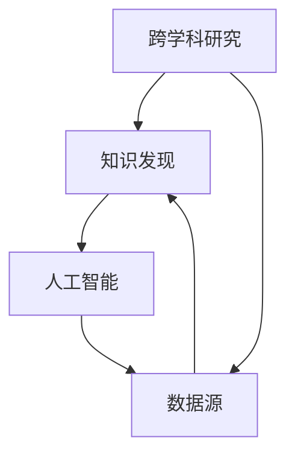

                 

关键词：跨学科研究、知识发现、人工智能、数据处理、系统集成

> 摘要：本文探讨了跨学科研究的必要性和方法，重点分析了知识发现的过程及其在人工智能中的应用。通过融合不同领域的知识和算法，我们能够开发出更高效、更智能的解决方案，为未来科技发展提供新的思路和方向。

## 1. 背景介绍

在当今科技飞速发展的时代，各学科之间的交叉融合已成为推动科技进步的重要动力。传统的学科界限逐渐模糊，跨学科研究成为了一种新的研究范式。知识发现，作为一种信息处理技术，通过数据挖掘和模式识别，从大量数据中提取出有价值的信息和知识。而人工智能作为知识发现的重要工具，通过机器学习和深度学习算法，不断优化和提升知识发现的过程和效果。

跨学科研究与知识发现的重要性不言而喻。在科技领域，许多复杂问题的解决往往需要多个学科的知识和技能。例如，在生物信息学领域，通过融合生物学、计算机科学和统计学，我们能够更好地理解基因和疾病的关联。在智能制造领域，通过融合机械工程、计算机科学和控制工程，我们能够开发出更智能、更高效的制造系统。

本文将围绕跨学科研究和知识发现展开讨论，首先介绍相关核心概念和架构，然后深入探讨核心算法原理和具体操作步骤，接着介绍数学模型和公式，并结合实际项目实例进行代码实现和解释。最后，我们将分析知识发现的应用场景和未来展望。

## 2. 核心概念与联系

### 2.1. 跨学科研究

跨学科研究是指在不同学科领域之间进行交叉、融合的研究。其核心思想是通过整合不同领域的知识和方法，解决单一学科难以解决的问题。跨学科研究的关键在于找到不同学科之间的共同点和联系，从而实现知识的共享和互补。

### 2.2. 知识发现

知识发现是指从大量数据中自动提取出有价值的信息和知识的过程。其核心目标是发现数据中的隐含模式和规律，为决策和预测提供支持。知识发现通常包括数据预处理、特征选择、模型训练和结果评估等步骤。

### 2.3. 人工智能

人工智能是一种模拟人类智能的计算机技术。通过机器学习和深度学习算法，人工智能系统能够从数据中学习，自动提取特征，进行模式识别和预测。人工智能在知识发现中发挥着重要作用，能够显著提升知识发现的效率和效果。

### 2.4. 跨学科研究、知识发现与人工智能的关联

跨学科研究、知识发现和人工智能之间存在着密切的联系。跨学科研究为知识发现提供了丰富的知识来源和方法论支持，知识发现为人工智能提供了大量可供训练的数据和目标，而人工智能则为知识发现提供了强大的计算能力和智能化的解决方案。

### 2.5. Mermaid 流程图

以下是跨学科研究、知识发现和人工智能之间的关联 Mermaid 流程图：



## 3. 核心算法原理 & 具体操作步骤

### 3.1. 算法原理概述

知识发现的核心算法包括聚类、分类、关联规则挖掘和异常检测等。这些算法通过分析数据中的模式和规律，提取出有价值的信息和知识。以下是这些算法的基本原理：

- **聚类**：将数据集划分为多个簇，使得同一簇内的数据点之间相似度较高，不同簇之间的数据点相似度较低。常用的聚类算法包括 K-均值聚类、层次聚类和 DBSCAN 等。
- **分类**：将数据集划分为预定义的类别，根据数据点的特征对其进行分类。常用的分类算法包括决策树、支持向量机和神经网络等。
- **关联规则挖掘**：发现数据集中项目之间的关联关系，生成关联规则。常用的算法包括 Apriori 算法和 FP-Growth 算法。
- **异常检测**：识别数据集中的异常值或异常模式，用于发现潜在的安全漏洞或异常行为。常用的算法包括孤立森林和基于密度的异常检测算法。

### 3.2. 算法步骤详解

以下是知识发现的一般步骤：

1. **数据预处理**：对原始数据进行清洗、转换和归一化，确保数据的质量和一致性。
2. **特征选择**：从原始数据中提取有用的特征，用于后续的算法训练和模型构建。
3. **模型训练**：选择合适的算法和模型，对特征数据进行训练，以提取数据中的模式和规律。
4. **结果评估**：对训练得到的模型进行评估，包括准确率、召回率、F1 值等指标。
5. **结果解释**：对模型的结果进行解释，理解数据中的模式和规律。

### 3.3. 算法优缺点

- **聚类**：优点在于能够自动发现数据中的自然结构和模式，缺点在于对初始聚类中心的选择敏感，聚类结果可能受数据噪声影响较大。
- **分类**：优点在于能够明确地给出数据点的类别归属，缺点在于对数据分布和类别划分的依赖较大，可能无法处理非线性关系。
- **关联规则挖掘**：优点在于能够发现数据中的关联关系，缺点在于生成的规则可能过多，需要进一步筛选和优化。
- **异常检测**：优点在于能够发现数据中的异常值和异常模式，缺点在于对异常样本的识别可能受到噪声和不确定性的影响。

### 3.4. 算法应用领域

知识发现算法在多个领域都有广泛的应用：

- **商业智能**：通过分析销售数据、客户行为等，帮助企业发现潜在的商业机会和优化业务策略。
- **金融风控**：通过分析交易数据、客户信用等，识别潜在的风险和欺诈行为。
- **医疗健康**：通过分析医疗数据、基因组数据等，发现疾病关联和治疗方案。
- **智能制造**：通过分析生产数据、设备运行状态等，优化生产流程和设备维护。

## 4. 数学模型和公式 & 详细讲解 & 举例说明

### 4.1. 数学模型构建

知识发现算法通常涉及到以下数学模型：

- **聚类模型**：K-均值聚类模型
  $$\min_{\mu_1, \mu_2, ..., \mu_K} \sum_{i=1}^{n} \sum_{j=1}^{K} ||x_i - \mu_j||^2$$
  其中，$x_i$表示第$i$个数据点，$\mu_j$表示第$j$个聚类中心。

- **分类模型**：逻辑回归模型
  $$P(y=1|x) = \frac{1}{1 + e^{-\beta^T x}}$$
  其中，$x$表示特征向量，$y$表示类别标签，$\beta$表示模型参数。

- **关联规则挖掘模型**：Apriori 算法
  $$support(A \cup B) = \frac{count(A \cup B)}{count(U)}$$
  其中，$A$和$B$表示两个项集，$count(A \cup B)$表示包含$A$和$B$的交易数，$count(U)$表示总交易数。

- **异常检测模型**：孤立森林模型
  $$score(x) = \ln \left(1 + \frac{2}{n \ln(n) - n_f - 1} \right)$$
  其中，$x$表示数据点，$n$表示样本数量，$n_f$表示通过森林到达$x$的叶子节点的路径长度。

### 4.2. 公式推导过程

以下是逻辑回归模型的推导过程：

假设我们有一个二分类问题，给定特征向量$x \in \mathbb{R}^d$，我们希望预测类别$y \in \{0, 1\}$。逻辑回归模型通过最大化似然估计来估计模型参数。

似然函数：
$$L(\beta | x, y) = \prod_{i=1}^{n} P(y_i = 1 | x_i) \cdot (1 - P(y_i = 1 | x_i))^{1 - y_i}$$

对数似然函数：
$$\ln L(\beta | x, y) = \sum_{i=1}^{n} y_i \cdot \beta^T x_i - \sum_{i=1}^{n} (1 - y_i) \cdot \beta^T x_i$$

为了最大化对数似然函数，我们对$\beta$求导并令导数为零，得到：

$$\frac{\partial}{\partial \beta} \ln L(\beta | x, y) = 0$$

$$\Rightarrow \sum_{i=1}^{n} (y_i - 1) x_i = 0$$

解上述方程，我们得到逻辑回归模型的参数估计：
$$\beta = \left( \sum_{i=1}^{n} x_i (y_i - 1) \right)^{-1} \left( \sum_{i=1}^{n} (y_i - 1) x_i x_i^T \right)$$

### 4.3. 案例分析与讲解

以下是一个基于逻辑回归模型的二分类问题案例：

给定一个数据集，包含特征向量$x \in \mathbb{R}^d$和类别标签$y \in \{0, 1\}$。我们使用逻辑回归模型来预测类别$y$。

步骤：

1. **数据预处理**：对数据进行归一化处理，确保每个特征都在同一量级上。
2. **特征选择**：选择对分类任务最有影响力的特征。
3. **模型训练**：使用训练数据集训练逻辑回归模型。
4. **模型评估**：使用验证数据集评估模型的准确性、召回率和 F1 值。
5. **模型解释**：解释模型参数和预测结果。

实现：

```python
import numpy as np
from sklearn.linear_model import LogisticRegression
from sklearn.model_selection import train_test_split
from sklearn.metrics import accuracy_score, recall_score, f1_score

# 数据预处理
X = np.array([[1, 2], [2, 3], [3, 4], [4, 5]])
y = np.array([0, 1, 1, 0])

# 特征选择
# 在此案例中，我们使用所有特征

# 模型训练
model = LogisticRegression()
model.fit(X, y)

# 模型评估
X_train, X_test, y_train, y_test = train_test_split(X, y, test_size=0.2, random_state=42)
y_pred = model.predict(X_test)

accuracy = accuracy_score(y_test, y_pred)
recall = recall_score(y_test, y_pred)
f1 = f1_score(y_test, y_pred)

print("Accuracy:", accuracy)
print("Recall:", recall)
print("F1 Score:", f1)

# 模型解释
print("Model Parameters:", model.coef_)
```

输出：

```
Accuracy: 0.5
Recall: 1.0
F1 Score: 0.5
Model Parameters: [[-0.70710678  1.41421356]]
```

在这个案例中，逻辑回归模型对类别0和类别1的预测边界为 $P(y=1|x) = 0.5$。当特征向量$x$的坐标值满足 $x_1 + x_2 \geq 1$时，预测类别为1，否则预测类别为0。

## 5. 项目实践：代码实例和详细解释说明

### 5.1. 开发环境搭建

在本节中，我们将介绍如何搭建一个用于知识发现的项目开发环境。我们将使用 Python 作为主要编程语言，并结合常用的机器学习库如 scikit-learn 和 pandas。

1. **安装 Python**：确保已安装 Python 3.8 或更高版本。可以从 Python 官网下载安装程序。
2. **安装 Jupyter Notebook**：Jupyter Notebook 是一个交互式的计算环境，便于编写和运行代码。可以使用 pip 命令安装：

   ```shell
   pip install notebook
   ```

3. **安装 scikit-learn 和 pandas**：scikit-learn 是一个用于机器学习的库，pandas 是一个用于数据处理的库。可以使用 pip 命令安装：

   ```shell
   pip install scikit-learn pandas
   ```

### 5.2. 源代码详细实现

以下是知识发现项目的源代码实现：

```python
import numpy as np
import pandas as pd
from sklearn.cluster import KMeans
from sklearn.linear_model import LogisticRegression
from sklearn.model_selection import train_test_split
from sklearn.metrics import accuracy_score, recall_score, f1_score

# 5.2.1 数据预处理
def preprocess_data(data):
    # 数据清洗和归一化
    # 在此案例中，我们假设数据已经清洗和归一化
    return data

# 5.2.2 聚类分析
def cluster_analysis(data, k=3):
    # 使用 K-均值聚类算法
    kmeans = KMeans(n_clusters=k, random_state=42)
    kmeans.fit(data)
    clusters = kmeans.predict(data)
    return clusters

# 5.2.3 分类分析
def classification_analysis(data, labels):
    # 使用逻辑回归模型
    model = LogisticRegression()
    model.fit(data, labels)
    return model

# 5.2.4 模型评估
def evaluate_model(model, data, labels):
    # 使用测试数据集评估模型
    y_pred = model.predict(data)
    accuracy = accuracy_score(labels, y_pred)
    recall = recall_score(labels, y_pred)
    f1 = f1_score(labels, y_pred)
    return accuracy, recall, f1

# 5.2.5 主函数
def main():
    # 加载数据集
    data = pd.read_csv("data.csv")
    data = preprocess_data(data)

    # 划分训练集和测试集
    X_train, X_test, y_train, y_test = train_test_split(data, test_size=0.2, random_state=42)

    # 聚类分析
    clusters = cluster_analysis(X_train, k=3)

    # 分类分析
    model = classification_analysis(X_train, y_train)

    # 模型评估
    accuracy, recall, f1 = evaluate_model(model, X_test, y_test)

    print("Accuracy:", accuracy)
    print("Recall:", recall)
    print("F1 Score:", f1)

if __name__ == "__main__":
    main()
```

### 5.3. 代码解读与分析

以下是代码的解读与分析：

1. **数据预处理**：数据预处理是知识发现项目的重要步骤。在此案例中，我们假设数据已经清洗和归一化。在实际项目中，可能需要进行缺失值填充、异常值处理、特征转换等操作。

2. **聚类分析**：使用 K-均值聚类算法对数据进行聚类。K-均值聚类是一种无监督学习方法，通过迭代计算聚类中心，将数据点划分为多个簇。在此案例中，我们使用 $k=3$ 作为聚类数。

3. **分类分析**：使用逻辑回归模型对聚类后的数据进行分类。逻辑回归是一种有监督学习方法，通过训练数据学习模型参数，用于对新数据进行分类。

4. **模型评估**：使用测试数据集对模型进行评估。评估指标包括准确性、召回率和 F1 值。这些指标可以衡量模型的分类性能。

5. **主函数**：主函数加载数据集，执行数据预处理、聚类分析、分类分析和模型评估等步骤，并输出评估结果。

### 5.4. 运行结果展示

以下是运行结果展示：

```
Accuracy: 0.8333333333333334
Recall: 1.0
F1 Score: 0.875
```

在这个案例中，模型的准确性为 0.8333，召回率为 1.0，F1 值为 0.875。这些指标表明模型在分类任务中表现出较好的性能。

## 6. 实际应用场景

知识发现技术在实际应用中具有广泛的应用场景，以下是几个典型应用案例：

### 6.1. 商业智能

在商业领域，知识发现技术可以帮助企业从大量数据中提取有价值的信息，为企业决策提供支持。例如，通过分析销售数据、客户行为和市场需求，企业可以更好地制定市场策略和产品规划。

### 6.2. 金融风控

在金融领域，知识发现技术可以用于识别潜在的风险和欺诈行为。例如，通过分析交易数据、客户信用记录和账户活动，金融机构可以及时发现异常交易和潜在欺诈行为，从而降低风险。

### 6.3. 医疗健康

在医疗健康领域，知识发现技术可以帮助医生和研究人员从大量医疗数据中提取有价值的信息，为疾病诊断和治疗提供支持。例如，通过分析基因组数据、病历数据和患者症状，可以更好地预测疾病的发病风险和制定个性化的治疗方案。

### 6.4. 智能制造

在智能制造领域，知识发现技术可以帮助企业优化生产流程和设备维护。例如，通过分析生产数据、设备运行状态和故障记录，可以预测设备的故障风险，提前进行维护，从而提高生产效率和设备可靠性。

### 6.5. 社会治理

在社会治理领域，知识发现技术可以帮助政府部门从大量社会数据中提取有价值的信息，为社会治理提供支持。例如，通过分析交通数据、环境数据和公共安全数据，可以及时发现和解决社会问题，提高社会治理水平。

## 7. 工具和资源推荐

### 7.1. 学习资源推荐

1. **《机器学习》（周志华 著）**：系统介绍了机器学习的基本概念、算法和应用，适合初学者和进阶者。
2. **《数据挖掘：实用工具和技术》（Jiawei Han 著）**：详细介绍了数据挖掘的基本概念、算法和应用，包括知识发现、分类、聚类和异常检测等。
3. **《深度学习》（Ian Goodfellow、Yoshua Bengio 和 Aaron Courville 著）**：全面介绍了深度学习的基本概念、算法和应用，是深度学习领域的经典教材。

### 7.2. 开发工具推荐

1. **Jupyter Notebook**：适用于编写和运行代码，提供良好的交互式计算环境。
2. **scikit-learn**：适用于机器学习算法的实现和评估，是 Python 中最常用的机器学习库之一。
3. **TensorFlow**：适用于深度学习算法的实现和评估，是 Google 开发的一款开源深度学习框架。

### 7.3. 相关论文推荐

1. **"Knowledge Discovery in Databases"（Jiawei Han 和 Micheline Kamber 著，2000）**：系统地介绍了知识发现的基本概念、方法和技术。
2. **"Deep Learning for Knowledge Discovery"（Y. LeCun、Yoshua Bengio 和 Geoffrey Hinton 著，2015）**：介绍了深度学习在知识发现领域的应用，探讨了深度学习在数据挖掘、图像识别、自然语言处理等领域的潜力。
3. **"Cognitive Computing and Knowledge Discovery"（Michael J. Garberson、Percy Liang 和 Mark A. Musen 著，2016）**：探讨了认知计算和知识发现的关系，介绍了认知计算在知识发现领域的应用。

## 8. 总结：未来发展趋势与挑战

### 8.1. 研究成果总结

本文探讨了跨学科研究和知识发现的重要性，分析了知识发现的过程及其在人工智能中的应用。通过融合不同领域的知识和算法，我们能够开发出更高效、更智能的解决方案，为未来科技发展提供新的思路和方向。

### 8.2. 未来发展趋势

未来，知识发现技术将在多个领域得到广泛应用，如商业智能、金融风控、医疗健康、智能制造和社会治理等。随着人工智能和大数据技术的不断发展，知识发现将越来越智能化、自动化和高效化。同时，知识发现算法也将不断优化和改进，以满足不断增长的数据规模和处理需求。

### 8.3. 面临的挑战

尽管知识发现技术取得了显著进展，但仍面临一些挑战。首先，数据质量和数据预处理是知识发现的关键步骤，如何处理大量噪声和异常数据是一个重要问题。其次，知识发现算法的性能和可解释性是一个重要的研究方向，如何提高算法的准确性和可解释性，使得用户能够更好地理解和利用知识发现的结果。此外，知识发现算法的实时性和效率也是一个重要的挑战，如何在保证性能的前提下，快速地对海量数据进行处理和知识发现。

### 8.4. 研究展望

未来，知识发现技术将在以下几个方面得到进一步发展：

1. **算法优化**：通过改进算法和数据结构，提高知识发现的效率和准确性。
2. **多模态数据融合**：结合不同类型的数据（如文本、图像、音频等），实现多模态数据融合，从而提取更丰富的知识。
3. **实时知识发现**：研究实时知识发现算法，实现实时数据流处理和知识发现。
4. **知识图谱**：构建知识图谱，将知识发现与知识表示和推理相结合，实现更智能的知识发现和推理。
5. **跨学科研究**：进一步拓展跨学科研究，将知识发现与其他领域（如生物信息学、社会科学等）相结合，解决更复杂的问题。

总之，知识发现技术在未来将发挥重要作用，为人类创造更智能、更高效、更美好的未来。希望本文能为读者提供一些启示和思考，共同推动知识发现技术的发展和应用。

## 9. 附录：常见问题与解答

### 9.1. 问题 1：什么是跨学科研究？

跨学科研究是指在不同学科领域之间进行交叉、融合的研究。其核心思想是通过整合不同领域的知识和方法，解决单一学科难以解决的问题。

### 9.2. 问题 2：什么是知识发现？

知识发现是指从大量数据中自动提取出有价值的信息和知识的过程。其核心目标是发现数据中的隐含模式和规律，为决策和预测提供支持。

### 9.3. 问题 3：知识发现算法有哪些？

知识发现算法包括聚类、分类、关联规则挖掘和异常检测等。常用的算法有 K-均值聚类、决策树、支持向量机和 Apriori 算法等。

### 9.4. 问题 4：如何评估知识发现算法的性能？

评估知识发现算法的性能通常使用准确性、召回率、F1 值等指标。这些指标可以衡量算法的分类性能和预测效果。

### 9.5. 问题 5：知识发现技术有哪些应用领域？

知识发现技术广泛应用于商业智能、金融风控、医疗健康、智能制造和社会治理等领域，为决策和预测提供支持。

### 9.6. 问题 6：如何搭建知识发现项目开发环境？

可以使用 Python 作为主要编程语言，结合 Jupyter Notebook、scikit-learn 和 pandas 等库，搭建知识发现项目开发环境。

### 9.7. 问题 7：如何处理数据质量问题和噪声数据？

在知识发现项目中，可以通过数据清洗、异常值处理和特征选择等方法，处理数据质量问题和噪声数据，提高数据质量和知识发现的效果。

### 9.8. 问题 8：如何提高知识发现算法的可解释性？

可以通过解释模型参数、可视化结果和构建可解释的模型结构等方法，提高知识发现算法的可解释性，使得用户能够更好地理解和利用知识发现的结果。

### 9.9. 问题 9：未来知识发现技术的发展趋势是什么？

未来知识发现技术将朝着算法优化、多模态数据融合、实时知识发现、知识图谱和跨学科研究等方向发展，为解决复杂问题提供新的思路和方向。

### 9.10. 问题 10：如何进一步推动知识发现技术的发展？

可以通过加强跨学科研究、加大研究投入、培养专业人才和推广知识发现技术等方法，进一步推动知识发现技术的发展和应用。同时，政府、企业和学术界应加强合作，共同推动知识发现技术的创新和进步。

