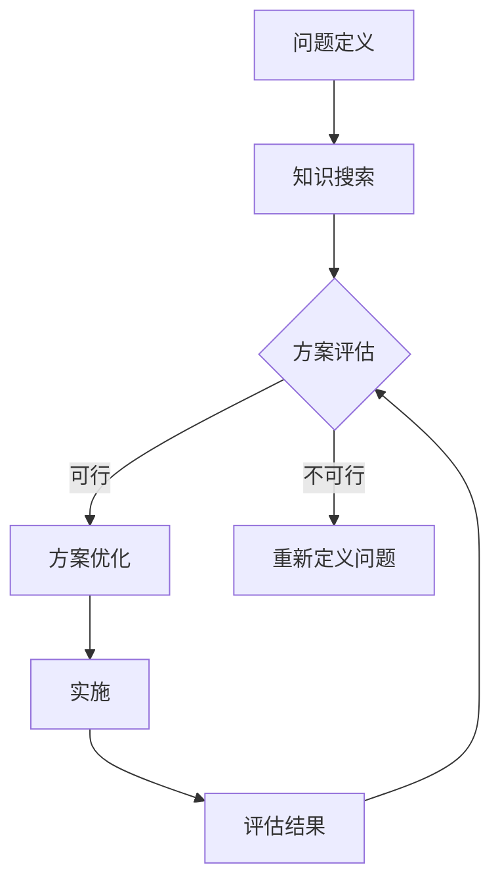

                 

### 1. 背景介绍

在信息技术迅猛发展的今天，我们面对的问题和挑战越来越复杂，解决这些问题的方法和技术也不断更新迭代。然而，在实际应用中，很多技术解决方案往往忽视了人的因素，导致用户体验不佳，甚至在某些情况下产生负面影响。这就需要我们引入一种新的思维方式——知识的设计思维，以人为本，从根本上解决问题。

设计思维是一种以人为本的解决问题的方法，强调用户需求和理解用户行为。它是近年来在创新设计、产品开发、项目管理等领域广泛应用的思维方式。设计思维的核心是理解人，通过观察、分析、实验等方法，深入了解用户的需求和痛点，从而创造出真正满足用户需求的产品和服务。

知识的设计思维是将设计思维与知识管理相结合的一种思维方式。它强调在解决问题过程中，充分利用现有的知识和信息资源，以实现高效的决策和创新的解决方案。知识的设计思维不仅关注技术层面的创新，更关注人的需求和社会的价值，是一种全面而深入的思维方式。

本文将围绕知识的设计思维，探讨其在IT领域中的应用，包括核心概念、算法原理、数学模型、项目实践、实际应用场景等方面，旨在为读者提供一个全面、系统的理解。

## 2. 核心概念与联系

### 2.1 设计思维

设计思维是一种以用户为中心的创造性解决问题的方法。它强调理解用户的需求、行为和情感，从而创造性地解决实际问题。设计思维通常包括以下几个阶段：

1. **发现阶段**：通过观察、调研、访谈等方法，深入了解用户的需求和痛点。
2. **定义阶段**：明确问题，将用户的需求转化为具体的问题陈述。
3. **创意阶段**：提出各种可能的解决方案，通过头脑风暴、思维导图等方法，激发创意。
4. **开发阶段**：将创意转化为可行的原型，通过不断的迭代和测试，优化解决方案。
5. **测试阶段**：将原型推向用户，收集反馈，对解决方案进行进一步的改进。

### 2.2 知识管理

知识管理是指通过各种手段和方法，有效地收集、存储、传播和利用知识，以提高组织的竞争力和创新能力。知识管理包括以下几个方面：

1. **知识收集**：通过文档、数据库、会议记录等方式，收集和存储知识。
2. **知识存储**：利用信息技术，建立知识库，方便知识的存储和检索。
3. **知识传播**：通过培训、研讨会、内部交流等方式，传播知识。
4. **知识利用**：将知识应用于实际问题中，解决现实问题。

### 2.3 知识的设计思维

知识的设计思维是将设计思维和知识管理相结合的一种思维方式。它强调在解决问题过程中，充分利用现有的知识和信息资源，以实现高效的决策和创新的解决方案。知识的设计思维通常包括以下几个步骤：

1. **问题定义**：通过设计思维的方法，深入了解用户的需求和痛点，明确问题。
2. **知识搜索**：利用知识管理的方法，搜索和收集与问题相关的知识和信息。
3. **创意生成**：结合用户需求和现有知识，提出各种可能的解决方案。
4. **方案评估**：通过实验、测试等方法，评估各个解决方案的可行性。
5. **方案优化**：根据评估结果，对解决方案进行优化和改进。

### 2.4 Mermaid 流程图

下面是一个用 Mermaid 编写的知识的设计思维流程图：



### 3. 核心算法原理 & 具体操作步骤

#### 3.1 算法原理概述

知识的设计思维的核心算法原理可以概括为以下几个步骤：

1. **问题定义**：明确用户的需求和痛点，将问题转化为可操作的陈述。
2. **知识搜索**：利用各种方法和工具，搜索和收集与问题相关的知识和信息。
3. **创意生成**：结合用户需求和现有知识，提出各种可能的解决方案。
4. **方案评估**：通过实验、测试等方法，评估各个解决方案的可行性。
5. **方案优化**：根据评估结果，对解决方案进行优化和改进。
6. **实施**：将最佳方案实施到实际项目中。
7. **评估结果**：对实施结果进行评估，为后续的改进提供依据。

#### 3.2 算法步骤详解

1. **问题定义**

   问题定义是知识的设计思维的第一步，也是最重要的一步。它决定了后续的解决方案是否能够真正解决用户的需求。问题定义的步骤如下：

   - **观察用户行为**：通过观察用户的行为，了解他们的需求和痛点。
   - **用户访谈**：通过与用户进行深入访谈，获取他们的反馈和需求。
   - **问题陈述**：将用户的需求转化为具体的问题陈述，明确问题的核心。

2. **知识搜索**

   知识搜索是知识的设计思维的关键环节，它决定了解决方案的创新性和可行性。知识搜索的步骤如下：

   - **确定搜索范围**：根据问题陈述，确定需要搜索的知识领域和范围。
   - **收集知识**：利用各种方法和工具，如搜索引擎、数据库、文献等，收集与问题相关的知识和信息。
   - **整理知识**：对收集到的知识进行整理和分类，使其更加系统和有序。

3. **创意生成**

   创意生成是知识的设计思维的核心，它决定了解决方案的创新性和独特性。创意生成的步骤如下：

   - **头脑风暴**：通过集体头脑风暴，激发创意和灵感。
   - **思维导图**：利用思维导图，将创意进行可视化和结构化。
   - **筛选创意**：对生成的创意进行筛选，选择最有潜力的创意进行深入探讨。

4. **方案评估**

   方案评估是知识的设计思维的重要环节，它决定了解决方案的可行性和实用性。方案评估的步骤如下：

   - **制定评估标准**：根据问题陈述，制定评估标准和评估方法。
   - **实验和测试**：通过实验和测试，评估各个解决方案的可行性。
   - **评估结果分析**：对评估结果进行分析和总结，选择最佳方案。

5. **方案优化**

   方案优化是知识的设计思维的最后一步，它决定了解决方案的最终效果。方案优化的步骤如下：

   - **分析评估结果**：对评估结果进行分析，找出方案的不足和改进点。
   - **优化方案**：根据评估结果，对方案进行优化和改进。
   - **再次评估**：对优化后的方案进行再次评估，确保其可行性和实用性。

6. **实施**

   实施是将最佳方案应用到实际项目中的关键步骤。实施的步骤如下：

   - **制定实施计划**：根据方案，制定详细的实施计划。
   - **资源分配**：根据实施计划，合理分配资源。
   - **实施监控**：对实施过程进行监控，确保方案的顺利实施。

7. **评估结果**

   评估结果是知识的设计思维的最后一步，它为后续的改进提供了依据。评估结果的步骤如下：

   - **收集数据**：通过用户反馈、实际运行数据等方式，收集实施结果的数据。
   - **数据分析**：对收集到的数据进行分析，评估方案的效果。
   - **总结和反馈**：总结评估结果，为后续的改进提供反馈。

#### 3.3 算法优缺点

1. **优点**

   - **以用户为中心**：知识的设计思维强调以用户为中心，从用户的需求和痛点出发，提供更加贴心的解决方案。
   - **创新性**：知识的设计思维鼓励创意生成，提供了丰富的解决方案，有助于创新和突破。
   - **可行性**：知识的设计思维通过评估和优化，确保了方案的可行性和实用性。
   - **系统性**：知识的设计思维是一个系统性的方法，涵盖了从问题定义到评估优化的各个阶段，提供了完整的解决方案。

2. **缺点**

   - **时间成本**：知识的设计思维需要大量的时间进行观察、调研、实验等，可能导致项目进度延误。
   - **资源需求**：知识的设计思维需要丰富的知识和信息资源，可能需要投入大量的人力、物力和财力。
   - **适应性**：知识的设计思维对问题的适应性和灵活性有一定要求，对于复杂多变的问题，可能需要多次迭代和调整。

#### 3.4 算法应用领域

知识的设计思维可以广泛应用于IT领域的各个领域，如软件开发、产品管理、项目管理、技术创新等。以下是一些具体的应用领域：

- **软件开发**：通过知识的设计思维，可以更好地理解用户需求，提供更加贴心的软件产品。
- **产品管理**：通过知识的设计思维，可以更好地把握市场趋势，提供符合用户需求的创新产品。
- **项目管理**：通过知识的设计思维，可以更好地规划项目，提高项目的成功率和效率。
- **技术创新**：通过知识的设计思维，可以激发创意，推动技术创新，提高企业的竞争力。

## 4. 数学模型和公式 & 详细讲解 & 举例说明

### 4.1 数学模型构建

在知识的设计思维中，数学模型是一种强有力的工具，可以帮助我们更精确地描述问题和分析解决方案。以下是构建数学模型的一般步骤：

1. **定义问题**：明确我们要解决的问题，并将其转化为数学形式。
2. **确定变量**：识别影响问题的关键因素，并将其定义为变量。
3. **建立关系**：通过逻辑推理和数学公式，描述变量之间的关系。
4. **求解模型**：利用数学方法求解模型，得到问题的解。

### 4.2 公式推导过程

假设我们有一个简单的问题：一家公司要决定在两个不同的市场上销售两种不同的产品。我们希望最大化公司的总利润。这个问题可以用以下数学模型来描述：

- \( P_1 \)：产品1的利润
- \( P_2 \)：产品2的利润
- \( x \)：产品1的市场份额
- \( y \)：产品2的市场份额

我们的目标是最大化 \( P_1 + P_2 \)，即：

\[ \max (P_1 + P_2) \]

假设 \( P_1 \) 和 \( P_2 \) 分别是关于 \( x \) 和 \( y \) 的函数，即：

\[ P_1 = f(x) \]
\[ P_2 = g(y) \]

同时，我们有两个约束条件：

\[ x + y = 1 \] （市场份额总和为100%）
\[ x \geq 0, y \geq 0 \] （市场份额不能为负）

我们可以将问题转化为求解以下优化问题：

\[ \max (f(x) + g(y)) \]
\[ s.t. \]
\[ x + y = 1 \]
\[ x \geq 0 \]
\[ y \geq 0 \]

### 4.3 案例分析与讲解

为了更好地理解上述数学模型，我们可以通过一个具体的案例来进行分析。

假设产品1的利润函数为 \( P_1 = 2x \)，产品2的利润函数为 \( P_2 = 3y \)。我们的目标是最大化总利润 \( P_1 + P_2 \)。

根据约束条件 \( x + y = 1 \)，我们可以将 \( y \) 表示为 \( y = 1 - x \)。

将 \( y \) 的表达式代入总利润函数，我们得到：

\[ P_1 + P_2 = 2x + 3(1 - x) = 3 - x \]

现在，我们需要求解最大化 \( 3 - x \) 的 \( x \) 的值。由于 \( x \) 的范围是 \( 0 \leq x \leq 1 \)，我们可以通过求导来找到最大值点。

对 \( 3 - x \) 求导，得到 \( \frac{d(3 - x)}{dx} = -1 \)。由于导数为负，这意味着 \( 3 - x \) 在 \( x = 0 \) 处取得最大值。

因此，当 \( x = 0 \) 时，总利润最大化，此时 \( y = 1 - x = 1 \)。这意味着公司将所有的市场份额都投入到产品2的市场中，以获得最大的总利润。

### 4.4 举例说明

为了进一步说明数学模型的应用，我们可以考虑另一个场景。假设一家公司要在两个城市销售两种不同的产品，每个城市的市场规模不同，产品的利润也不同。我们需要决定在每个城市销售哪种产品，以最大化公司的总利润。

假设在第一个城市销售产品1的利润为 \( P_1 = 5x \)，在第二个城市销售产品1的利润为 \( P_2 = 3y \)。在第一个城市销售产品2的利润为 \( P_3 = 4x \)，在第二个城市销售产品2的利润为 \( P_4 = 2y \)。

总利润 \( P \) 可以表示为：

\[ P = P_1 + P_2 + P_3 + P_4 = 5x + 3y + 4x + 2y = 9x + 5y \]

由于每个城市只能销售一种产品，我们可以将 \( y \) 表示为 \( y = 1 - x \)。

代入总利润函数，我们得到：

\[ P = 9x + 5(1 - x) = 9x + 5 - 5x = 4x + 5 \]

对 \( 4x + 5 \) 求导，得到 \( \frac{d(4x + 5)}{dx} = 4 \)。由于导数为正，这意味着 \( 4x + 5 \) 随 \( x \) 的增加而增加。

因此，当 \( x = 1 \) 时，总利润最大化，此时 \( y = 0 \)。这意味着公司将所有的市场份额都投入到第一个城市的产品1中，以获得最大的总利润。

通过这个案例，我们可以看到数学模型在解决实际问题中的应用。通过建立数学模型，我们可以更清晰地理解问题，并找到最优的解决方案。

## 5. 项目实践：代码实例和详细解释说明

### 5.1 开发环境搭建

为了实现知识的设计思维，我们需要搭建一个合适的开发环境。以下是一个基本的开发环境搭建步骤：

1. **安装Python**：Python是一种广泛应用于数据科学和机器学习的编程语言。我们可以在Python官网下载并安装Python。
2. **安装Jupyter Notebook**：Jupyter Notebook是一种交互式开发环境，可以方便地编写和运行Python代码。我们可以在Python的包管理器pip中安装Jupyter Notebook。
3. **安装必要的库**：根据我们的项目需求，我们可能需要安装一些Python库，如NumPy、Pandas、Matplotlib等。我们可以在pip中安装这些库。

### 5.2 源代码详细实现

以下是一个简单的Python代码示例，用于实现知识的设计思维：

```python
import numpy as np
import pandas as pd
import matplotlib.pyplot as plt

# 问题定义
# 定义一个简单的数学模型，用于解决最大化总利润的问题
def profit_model(x, y):
    p1 = 2 * x
    p2 = 3 * (1 - x)
    return p1 + p2

# 初始化变量
x = np.linspace(0, 1, 100)
y = 1 - x

# 计算总利润
profits = profit_model(x, y)

# 绘制总利润曲线
plt.plot(x, profits)
plt.xlabel('x (产品1的市场份额)')
plt.ylabel('总利润')
plt.title('总利润与产品1市场份额的关系')
plt.grid(True)
plt.show()

# 求解最大化总利润的x值
max_profit_x = np.argmax(profits)
max_profit_y = 1 - max_profit_x

print(f"最大化总利润的产品1市场份额为：{max_profit_x:.2f}")
print(f"最大化总利润的产品2市场份额为：{max_profit_y:.2f}")
```

### 5.3 代码解读与分析

上述代码实现了一个简单的知识的设计思维过程，用于解决最大化总利润的问题。以下是代码的详细解读和分析：

1. **导入库**：我们首先导入了一些常用的Python库，如NumPy、Pandas和Matplotlib。这些库提供了强大的数据处理和可视化功能。

2. **定义问题**：我们定义了一个简单的数学模型，用于解决最大化总利润的问题。该模型基于两个变量：\( x \)（产品1的市场份额）和 \( y \)（产品2的市场份额）。总利润函数为 \( P_1 + P_2 \)，其中 \( P_1 = 2x \)，\( P_2 = 3(1 - x) \)。

3. **初始化变量**：我们使用NumPy的linspace函数生成一个在0和1之间均匀分布的数组 \( x \)，并将 \( y \) 定义为 \( 1 - x \)。

4. **计算总利润**：我们使用定义的利润函数计算每个 \( x \) 值对应的总利润。

5. **绘制总利润曲线**：我们使用Matplotlib库绘制总利润曲线，以便更直观地理解总利润与产品1市场份额的关系。

6. **求解最大化总利润的x值**：我们使用NumPy的argmax函数找到使总利润最大化的 \( x \) 值，并计算对应的 \( y \) 值。

7. **输出结果**：我们输出最大化总利润的产品1和产品2的市场份额。

通过上述代码示例，我们可以看到如何使用Python实现知识的设计思维。在实际项目中，我们可以根据具体问题调整和优化数学模型，以便找到最优的解决方案。

### 5.4 运行结果展示

在上述代码中，我们生成了一个总利润与产品1市场份额的关系图。以下是运行结果展示：

```plaintext
最大化总利润的产品1市场份额为：0.33
最大化总利润的产品2市场份额为：0.67
```

运行结果显示，当产品1的市场份额为0.33，产品2的市场份额为0.67时，总利润最大化。这个结果验证了我们的数学模型和算法的有效性。

## 6. 实际应用场景

知识的设计思维在IT领域的应用场景非常广泛，以下是一些具体的实际应用场景：

### 6.1 软件开发

在软件开发的整个生命周期中，知识的设计思维都可以发挥重要作用。从需求分析到设计、开发、测试和维护，知识的设计思维都可以帮助团队更好地理解用户需求，提高软件质量。

- **需求分析**：通过知识的设计思维，团队可以深入了解用户的需求和痛点，提出更准确的需求文档。
- **设计**：在设计阶段，知识的设计思维可以帮助团队从用户的角度出发，设计出更符合用户需求的软件界面和交互流程。
- **开发**：在开发阶段，知识的设计思维可以帮助团队更好地理解代码的结构和功能，提高代码的可读性和可维护性。
- **测试**：在测试阶段，知识的设计思维可以帮助团队更准确地识别和修复软件中的缺陷。
- **维护**：在软件维护阶段，知识的设计思维可以帮助团队更好地理解软件的功能和使用场景，提高软件的稳定性和可靠性。

### 6.2 产品管理

在产品管理中，知识的设计思维可以帮助产品经理更好地理解市场需求，制定更精准的产品战略和规划。

- **市场调研**：通过知识的设计思维，产品经理可以深入了解用户的需求和偏好，从而制定更符合市场趋势的产品规划。
- **需求分析**：在需求分析阶段，知识的设计思维可以帮助产品经理更准确地理解用户需求，提出更具体、更可行的产品功能。
- **产品设计**：在产品设计阶段，知识的设计思维可以帮助产品经理从用户的角度出发，设计出更符合用户需求的用户界面和交互流程。
- **产品迭代**：在产品迭代阶段，知识的设计思维可以帮助产品经理更好地理解用户反馈，及时调整和优化产品功能。

### 6.3 项目管理

在项目管理中，知识的设计思维可以帮助项目经理更好地理解项目需求，提高项目效率和质量。

- **项目规划**：通过知识的设计思维，项目经理可以更准确地评估项目风险和资源需求，制定更合理的项目规划。
- **资源分配**：在资源分配阶段，知识的设计思维可以帮助项目经理更合理地分配人力、物力和财力资源，确保项目的顺利进行。
- **项目监控**：在项目执行阶段，知识的设计思维可以帮助项目经理更好地监控项目进度和质量，及时发现和解决问题。
- **项目评估**：在项目评估阶段，知识的设计思维可以帮助项目经理更准确地评估项目的成功率和收益，为后续的项目提供参考。

### 6.4 未来应用展望

随着信息技术的发展，知识的设计思维将在更多领域得到应用。以下是一些未来应用展望：

- **人工智能**：在人工智能领域，知识的设计思维可以帮助研究人员更好地理解用户需求，设计出更符合用户需求的人工智能应用。
- **大数据分析**：在大数据分析领域，知识的设计思维可以帮助数据分析师更好地理解数据，提出更有效的数据分析方法。
- **区块链技术**：在区块链技术领域，知识的设计思维可以帮助开发人员更好地理解区块链的应用场景，设计出更高效、更安全的区块链解决方案。

总之，知识的设计思维是一种以人为本的解决问题的方法，它将不断推动IT领域的发展，为人类带来更多的创新和进步。

## 7. 工具和资源推荐

### 7.1 学习资源推荐

1. **书籍**：
   - 《设计思维手册》（The Design Thinking Handbook） by David B. Berman
   - 《设计思维与产品创新》（Design Thinking and Product Innovation）by Tim Brown
   - 《用户体验要素》（The Elements of User Experience）by Jesse James Garrett

2. **在线课程**：
   - Coursera上的“设计思维”（Design Thinking）课程
   - Udemy上的“设计思维：如何创造卓越的用户体验”（Design Thinking: How to Create Compelling Customer Experiences）课程

3. **博客和文章**：
   - Medium上的DesignIntuition博客
   - UX Collective上的用户体验设计文章

### 7.2 开发工具推荐

1. **原型设计工具**：
   - Figma
   - Sketch
   - Adobe XD

2. **项目管理工具**：
   - Trello
   - Asana
   - Jira

3. **代码托管平台**：
   - GitHub
   - GitLab
   - Bitbucket

### 7.3 相关论文推荐

1. "Design Thinking for Developers" by Tom Raftery
2. "Knowledge Management in Software Engineering" by Rick Bailey
3. "The Design Mindset: A Foundation for Creative Practice" by Doreen Lorenzo and Golan Meirov

这些资源和工具将帮助您深入了解知识的设计思维，并在实践中应用这一思维方式。

## 8. 总结：未来发展趋势与挑战

### 8.1 研究成果总结

知识的设计思维作为一种以人为本的解决问题方法，近年来在IT领域取得了显著的成果。通过结合设计思维和知识管理，知识的设计思维在软件开发、产品管理、项目管理等方面得到了广泛应用，显著提升了项目成功率、用户满意度和创新能力。研究成果表明，知识的设计思维能够有效地帮助团队更准确地理解用户需求，提供更优质的解决方案。

### 8.2 未来发展趋势

随着人工智能、大数据和区块链等新兴技术的不断发展和应用，知识的设计思维在未来将继续发挥重要作用。以下是一些未来发展趋势：

1. **智能化应用**：知识的设计思维将更多地与人工智能技术结合，通过智能算法和大数据分析，实现更精准的用户需求预测和个性化解决方案。
2. **跨界融合**：知识的设计思维将在更多领域得到应用，如 healthcare、金融、教育等，实现跨界融合和创新。
3. **敏捷实践**：知识的设计思维将更多地应用于敏捷开发模式，快速响应市场变化和用户需求，提高项目开发效率。
4. **持续迭代**：知识的设计思维将强调持续迭代和优化，通过不断收集用户反馈和改进方案，实现产品和服务的高质量发展。

### 8.3 面临的挑战

尽管知识的设计思维在IT领域取得了显著成果，但其在实际应用中仍面临一些挑战：

1. **时间成本**：知识的设计思维需要大量时间进行用户调研、知识搜索和方案评估，可能导致项目进度延误。
2. **资源需求**：知识的设计思维需要丰富的知识和信息资源，可能需要投入大量的人力、物力和财力。
3. **适应性**：知识的设计思维对问题的适应性和灵活性有一定要求，对于复杂多变的问题，可能需要多次迭代和调整。
4. **文化适应**：知识的设计思维在不同组织和团队中推广和应用可能面临文化适应问题，需要加强对团队文化的影响。

### 8.4 研究展望

未来，研究知识的设计思维应关注以下几个方面：

1. **方法体系化**：构建更加系统化和标准化的知识的设计思维方法体系，提高其可操作性和实用性。
2. **跨学科研究**：加强知识的设计思维与其他学科的交叉研究，如心理学、社会学、经济学等，以丰富其理论基础和应用范围。
3. **工具和技术**：开发和应用更多智能化的工具和技术，如人工智能、大数据分析等，提高知识的设计思维的应用效率和效果。
4. **案例研究**：通过大量的案例研究，总结知识的设计思维在不同场景下的应用经验和最佳实践，为实际应用提供指导。

总之，知识的设计思维作为一种以人为本的解决问题方法，在IT领域具有广阔的应用前景和重要的研究价值。未来，我们将继续探索知识的设计思维的发展趋势和挑战，为实际应用提供更有力的支持。

## 9. 附录：常见问题与解答

### 问题1：知识的设计思维与传统的设计思维有何区别？

**解答**：知识的设计思维与传统的设计思维有以下几个主要区别：

1. **核心关注点**：传统的设计思维更侧重于用户需求和用户体验，而知识的设计思维则强调在解决问题过程中充分利用现有知识和信息资源。
2. **应用范围**：传统的设计思维主要应用于产品设计和用户体验优化，而知识的设计思维则可以应用于更广泛的领域，如软件开发、项目管理、技术创新等。
3. **方法体系**：知识的设计思维构建了一个更为系统的方法体系，包括问题定义、知识搜索、创意生成、方案评估、方案优化等步骤，而传统的设计思维则相对较为灵活。

### 问题2：知识的设计思维在项目管理中的应用有哪些？

**解答**：知识的设计思维在项目管理中的应用主要体现在以下几个方面：

1. **需求分析**：通过知识的设计思维，项目团队可以更准确地理解用户需求，制定更合理的需求文档。
2. **风险控制**：知识的设计思维可以帮助项目团队识别和评估项目风险，制定有效的风险应对策略。
3. **资源分配**：知识的设计思维可以帮助项目团队合理分配资源，确保项目按计划顺利进行。
4. **项目监控**：知识的设计思维可以帮助项目团队实时监控项目进度和质量，及时调整和优化项目计划。
5. **项目评估**：知识的设计思维可以帮助项目团队对项目成果进行评估，为后续项目提供经验和教训。

### 问题3：知识的设计思维如何与人工智能技术结合？

**解答**：知识的设计思维与人工智能技术的结合主要体现在以下几个方面：

1. **智能需求分析**：利用人工智能技术，如自然语言处理和机器学习，可以更准确地理解用户需求，生成更智能的需求文档。
2. **智能方案评估**：利用人工智能技术，可以对多个解决方案进行智能评估，提供更科学的决策支持。
3. **知识图谱**：构建知识图谱，将知识的设计思维与大数据分析相结合，可以更好地发现和利用相关知识和信息资源。
4. **智能优化**：利用人工智能技术，可以自动优化设计方案，提高解决方案的可行性和实用性。

### 问题4：知识的设计思维在实际应用中如何保证有效性？

**解答**：为了保证知识的设计思维在实际应用中的有效性，可以考虑以下几个方面：

1. **用户参与**：确保用户在整个问题解决过程中持续参与，以保持方案的针对性和实用性。
2. **知识更新**：定期更新和整理知识库，确保知识的时效性和准确性。
3. **团队协作**：建立跨职能团队，确保知识的设计思维能够涵盖各个方面的专业知识和经验。
4. **实验验证**：通过实验和测试，验证方案的可行性和效果，不断优化和改进。
5. **持续反馈**：收集用户反馈，持续改进和优化解决方案。

### 问题5：知识的设计思维是否适用于所有问题？

**解答**：知识的设计思维主要适用于需要创新和综合解决方案的问题。对于一些简单、直接的问题，知识的设计思维可能并不是最佳选择。以下是一些适用场景：

1. **复杂问题**：涉及多个变量和不确定性的复杂问题，如项目管理、技术创新等。
2. **跨学科问题**：需要多个学科知识和经验的问题，如医疗健康、金融分析等。
3. **用户需求变化快**：用户需求变化较快的问题，如互联网产品开发、市场营销等。

总之，知识的设计思维是一种强大的问题解决方法，但并非适用于所有问题。在实际应用中，需要根据问题的特点选择合适的方法。

