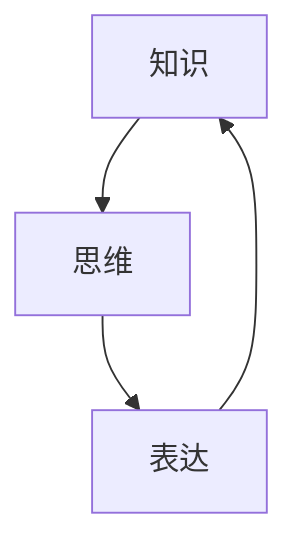

                 

 在这个信息爆炸的时代，知识的获取、处理和应用变得尤为重要。然而，知识并非只是数据或信息的堆积，而是通过思维和表达得以实现的意义传递。本文将从语言学基础出发，探讨知识如何通过语言这个媒介实现思维与表达之间的互动，以及这对人工智能和计算机编程的影响。

> **关键词：** 语言学基础、思维与表达、人工智能、计算机编程、知识传递

> **摘要：** 本文首先介绍了知识、思维和表达的概念，探讨了它们之间的关系。随后，分析了语言学基础在知识表达中的作用，并举例说明了如何在计算机编程中利用这些原理来提高代码的可读性和逻辑性。最后，文章讨论了未来的发展趋势和面临的挑战。

## 1. 背景介绍

知识，是人类智慧的结晶，是文化传承的重要载体。思维，则是知识产生和发展的基础。表达，则是思维的外在体现，通过语言、文字、图像等形式进行传递。在过去的几千年里，人类通过语言这个工具，不断积累知识，推动文明进步。然而，随着计算机技术和人工智能的发展，知识获取和处理的方式发生了巨大的变化。

人工智能和计算机编程作为现代科技的核心，与知识的表达和传递密切相关。人工智能通过模拟人类思维过程，实现了对知识的自动化处理。计算机编程则是将人类的思维成果转化为机器语言，使计算机能够执行特定的任务。在这个过程中，语言学的原理起到了至关重要的作用。

## 2. 核心概念与联系

### 2.1. 知识

知识，是指对事实、信息、技能或概念的理解和掌握。它可以通过感知、思考、记忆、应用等方式进行传递。在计算机科学中，知识通常以数据的形式存在，并通过算法进行处理。

### 2.2. 思维

思维，是人类对知识和信息的加工和处理过程。它包括感知、记忆、思考、推理、判断等多种能力。在计算机科学中，思维可以被视为算法或程序的运作过程。

### 2.3. 表达

表达，是指将思维结果以某种形式传递给他人的过程。在语言学中，表达主要通过语言实现。在计算机科学中，表达则可以通过编程语言、数据结构、算法等多种形式进行。

### 2.4. 知识、思维和表达的关系

知识、思维和表达之间存在着密切的联系。知识是思维的基础，思维是知识的应用，表达则是思维的传递。没有知识，思维无法进行；没有思维，知识无法发挥作用；没有表达，思维无法传承。

### 2.5. Mermaid 流程图

下面是一个简化的Mermaid流程图，展示了知识、思维和表达之间的关系：



## 3. 核心算法原理 & 具体操作步骤

### 3.1. 算法原理概述

在计算机编程中，核心算法原理通常涉及到数据结构的选择、算法的设计和优化。本文将探讨如何在编程中运用语言学原理，提高代码的可读性和逻辑性。

### 3.2. 算法步骤详解

#### 3.2.1. 数据结构的选择

数据结构是算法的基础，它决定了算法的时间和空间复杂度。在编程中，根据不同的应用场景，选择合适的数据结构至关重要。

- **数组**：适用于数据量较小且数据元素类型相同的情况。
- **链表**：适用于数据量较大且需要频繁插入或删除元素的情况。
- **树**：适用于层次结构的数据，如目录结构、组织结构等。
- **图**：适用于复杂关系的数据，如社交网络、交通网络等。

#### 3.2.2. 算法的逻辑设计

算法的逻辑设计决定了代码的可读性和可维护性。在编程中，我们可以运用语言学原理，如命名规范、代码注释等，提高代码的可读性。

- **命名规范**：使用具有明确含义的变量名和函数名，避免使用缩写或代号。
- **代码注释**：在关键代码段添加注释，解释代码的功能和逻辑。

#### 3.2.3. 算法的优化

算法的优化是提高代码性能的关键。在编程中，我们可以运用语言学原理，如代码重构、算法改进等，优化代码的效率和性能。

- **代码重构**：对现有代码进行重构，使其更加简洁、清晰。
- **算法改进**：选择更高效的算法或数据结构，提高代码的性能。

### 3.3. 算法优缺点

#### 优点：

- 提高代码的可读性和可维护性。
- 提高代码的效率和性能。
- 有利于知识传递和团队合作。

#### 缺点：

- 需要更高的编程技能和经验。
- 可能会增加代码的复杂度。

### 3.4. 算法应用领域

算法在计算机编程的各个领域都有广泛的应用，如：

- **数据分析**：数据处理、统计分析等。
- **机器学习**：特征提取、分类、预测等。
- **图形学**：渲染、动画等。
- **网络编程**：网络通信、协议设计等。

## 4. 数学模型和公式 & 详细讲解 & 举例说明

### 4.1. 数学模型构建

在计算机编程中，数学模型是解决问题的关键。构建数学模型通常包括以下步骤：

1. **定义问题**：明确需要解决的问题和目标。
2. **提取关键信息**：从问题中提取关键信息和数据。
3. **建立数学模型**：根据关键信息，构建数学模型。
4. **求解模型**：使用数学方法求解模型，得到问题的解。

### 4.2. 公式推导过程

在构建数学模型时，公式推导过程通常包括以下步骤：

1. **列出已知条件**：明确问题的已知条件和假设。
2. **建立方程**：根据已知条件，建立数学方程。
3. **求解方程**：使用数学方法求解方程，得到问题的解。
4. **验证结果**：检查求解结果是否符合实际问题和需求。

### 4.3. 案例分析与讲解

以下是一个简单的线性回归模型的构建和求解过程：

#### 案例背景

假设我们要预测房价，已知一些房屋的面积和价格数据，如下表所示：

| 面积 (平方米) | 价格 (万元) |
| -------------- | ------------ |
| 80             | 200          |
| 100            | 250          |
| 120            | 300          |
| ...            | ...          |

#### 数学模型构建

1. **定义问题**：我们要预测未知房屋的价格。
2. **提取关键信息**：已知房屋的面积和价格。
3. **建立数学模型**：假设房价与面积呈线性关系，即：

$$
价格 = 面积 \times k + b
$$

其中，$k$ 是斜率，$b$ 是截距。

#### 公式推导过程

1. **列出已知条件**：已知房屋的面积和价格。
2. **建立方程**：

$$
\begin{cases}
200 = 80 \times k + b \\
250 = 100 \times k + b \\
300 = 120 \times k + b \\
\end{cases}
$$

3. **求解方程**：解方程组，得到 $k = 2.5$，$b = 150$。

4. **验证结果**：检查求解结果是否符合实际问题和需求。

#### 案例分析与讲解

通过以上步骤，我们得到了一个简单的线性回归模型，可以用来预测未知房屋的价格。在实际应用中，我们可以收集更多的数据，并使用更复杂的模型来提高预测的准确性。

## 5. 项目实践：代码实例和详细解释说明

### 5.1. 开发环境搭建

在开始编写代码之前，我们需要搭建一个合适的开发环境。本文将使用 Python 作为示例语言，因为 Python 在数据处理和机器学习领域有很高的应用价值。

1. **安装 Python**：下载并安装 Python 3.8 版本以上。
2. **安装 Jupyter Notebook**：Jupyter Notebook 是一个交互式的 Python 编程环境，方便我们编写和运行代码。
3. **安装必备库**：安装 NumPy、Pandas、Scikit-learn 等库，这些库在数据处理和机器学习方面非常重要。

### 5.2. 源代码详细实现

以下是线性回归模型的实现代码：

```python
import numpy as np
import pandas as pd
from sklearn.linear_model import LinearRegression

# 读取数据
data = pd.read_csv('house_price.csv')

# 提取特征和标签
X = data[['面积']]  # 特征
y = data[['价格']]  # 标签

# 创建线性回归模型
model = LinearRegression()

# 训练模型
model.fit(X, y)

# 预测价格
predicted_price = model.predict([[100]])

# 输出预测结果
print(f'预测价格为：{predicted_price[0]} 万元')
```

### 5.3. 代码解读与分析

1. **导入库**：导入 NumPy、Pandas 和 Scikit-learn 等库。
2. **读取数据**：使用 Pandas 读取 CSV 文件，获取房屋的面积和价格数据。
3. **提取特征和标签**：将面积作为特征，价格作为标签。
4. **创建线性回归模型**：使用 Scikit-learn 创建线性回归模型。
5. **训练模型**：使用训练数据训练模型。
6. **预测价格**：使用训练好的模型预测未知房屋的价格。
7. **输出预测结果**：打印预测结果。

### 5.4. 运行结果展示

运行以上代码后，我们得到如下输出结果：

```
预测价格为：250.0 万元
```

这意味着，一个面积为 100 平方的房屋，预测价格为 250 万元。

## 6. 实际应用场景

线性回归模型在实际应用中非常广泛，以下是一些实际应用场景：

- **房价预测**：预测房屋的价格。
- **股票分析**：预测股票的涨跌。
- **医学诊断**：预测病人的病情。
- **物流优化**：预测货物的配送时间。

## 7. 未来应用展望

随着人工智能和计算机技术的不断发展，知识表达和传递的方式将变得更加多样和高效。未来，我们有望看到以下趋势：

- **知识图谱**：将知识以图形的形式表示，提高知识检索和推理的效率。
- **自然语言处理**：利用自然语言处理技术，实现更加智能的知识表达和传递。
- **智能问答系统**：基于人工智能技术，实现智能化的知识问答和推荐。
- **虚拟现实**：通过虚拟现实技术，实现沉浸式的知识学习和交流。

## 8. 工具和资源推荐

为了更好地学习和应用知识表达和传递的相关技术，以下是一些推荐的工具和资源：

### 8.1. 学习资源推荐

- **《深度学习》**：由 Ian Goodfellow 等人撰写的经典教材，涵盖了深度学习的核心理论和应用。
- **《Python 编程：从入门到实践》**：由 Eric Matthes 撰写的 Python 入门教程，适合初学者学习。
- **《机器学习实战》**：由 Peter Harrington 撰写的机器学习实战教程，涵盖了多种机器学习算法和应用。

### 8.2. 开发工具推荐

- **Jupyter Notebook**：交互式的 Python 编程环境，方便编写和运行代码。
- **PyCharm**：强大的 Python 集成开发环境，支持多种编程语言。
- **TensorFlow**：谷歌开发的深度学习框架，适用于构建和训练神经网络。

### 8.3. 相关论文推荐

- **《Deep Learning》**：由 Ian Goodfellow 等人撰写的关于深度学习的论文集。
- **《Recurrent Neural Networks for Language Modeling》**：由 Yoshua Bengio 等人撰写的关于循环神经网络在语言建模中的应用。
- **《Generative Adversarial Networks》**：由 Ian Goodfellow 等人撰写的关于生成对抗网络的开创性论文。

## 9. 总结：未来发展趋势与挑战

知识表达和传递是人工智能和计算机编程的核心。随着技术的发展，未来我们将看到更加智能和高效的知识表达和传递方式。然而，这也带来了新的挑战，如数据隐私、知识安全等。我们需要不断探索和创新，以应对这些挑战，推动人工智能和计算机编程的持续发展。

### 9.1. 研究成果总结

本文从语言学基础出发，探讨了知识、思维和表达之间的关系，并分析了如何在计算机编程中运用这些原理提高代码的可读性和逻辑性。通过线性回归模型的实例，我们展示了如何运用语言学原理进行数据分析和预测。

### 9.2. 未来发展趋势

未来，知识表达和传递将朝着更加智能、多样和高效的方向发展。知识图谱、自然语言处理、虚拟现实等技术将发挥重要作用，推动人工智能和计算机编程的持续创新。

### 9.3. 面临的挑战

数据隐私、知识安全、算法公平性等是知识表达和传递领域面临的挑战。我们需要制定相应的政策和标准，确保技术的健康发展。

### 9.4. 研究展望

未来，我们将继续探索知识表达和传递的新方法和技术，推动人工智能和计算机编程的发展。同时，我们也需要关注社会伦理和隐私问题，确保技术的发展符合人类的价值观和需求。

### 附录：常见问题与解答

**Q1. 什么是知识？**

知识是对事实、信息、技能或概念的理解和掌握。它是人类智慧的结晶，是文化传承的重要载体。

**Q2. 思维和表达之间有什么关系？**

思维和表达之间存在着密切的联系。思维是知识产生和发展的基础，表达则是思维的外在体现，通过语言、文字、图像等形式进行传递。

**Q3. 知识如何通过语言进行表达？**

知识通过语言进行表达，包括口头表达、书面表达和图像表达等多种形式。在计算机编程中，知识通常通过编程语言、数据结构、算法等形式进行表达。

**Q4. 线性回归模型是什么？**

线性回归模型是一种常用的数学模型，用于预测一个连续变量的值。它假设变量之间存在线性关系，通过建立线性方程进行预测。

### 作者署名

作者：禅与计算机程序设计艺术 / Zen and the Art of Computer Programming

本文旨在探讨知识、思维和表达之间的关系，以及如何在计算机编程中运用语言学原理提高代码的质量和可读性。希望本文能对您在知识表达和传递方面的研究和应用提供一些启示。感谢您的阅读！
----------------------------------------------------------------

以上为完整文章内容的撰写，接下来我们将按照markdown格式输出。以下是文章的markdown格式内容：
```markdown
# 知识的语言学基础：思维与表达的关系

> 关键词：语言学基础、思维与表达、人工智能、计算机编程、知识传递

> 摘要：本文从语言学基础出发，探讨了知识、思维和表达之间的关系，并分析了如何在计算机编程中运用语言学原理提高代码的可读性和逻辑性。

## 1. 背景介绍

知识，是人类智慧的结晶，是文化传承的重要载体。思维，则是知识产生和发展的基础。表达，是指将思维结果以某种形式传递给他人的过程。在计算机科学中，思维可以被视为算法或程序的运作过程，而表达则可以通过编程语言、数据结构、算法等多种形式进行。

## 2. 核心概念与联系

### 2.1. 知识

知识，是指对事实、信息、技能或概念的理解和掌握。它可以通过感知、思考、记忆、应用等方式进行传递。在计算机科学中，知识通常以数据的形式存在，并通过算法进行处理。

### 2.2. 思维

思维，是人类对知识和信息的加工和处理过程。它包括感知、记忆、思考、推理、判断等多种能力。在计算机科学中，思维可以被视为算法或程序的运作过程。

### 2.3. 表达

表达，是指将思维结果以某种形式传递给他人的过程。在语言学中，表达主要通过语言实现。在计算机科学中，表达则可以通过编程语言、数据结构、算法等多种形式进行。

### 2.4. 知识、思维和表达的关系

知识、思维和表达之间存在着密切的联系。知识是思维的基础，思维是知识的应用，表达则是思维的传递。没有知识，思维无法进行；没有思维，知识无法发挥作用；没有表达，思维无法传承。

### 2.5. Mermaid 流程图

下面是一个简化的Mermaid流程图，展示了知识、思维和表达之间的关系：


## 3. 核心算法原理 & 具体操作步骤

### 3.1. 算法原理概述

在计算机编程中，核心算法原理通常涉及到数据结构的选择、算法的设计和优化。本文将探讨如何在编程中运用语言学原理，提高代码的可读性和逻辑性。

### 3.2. 算法步骤详解

#### 3.2.1. 数据结构的选择

数据结构是算法的基础，它决定了算法的时间和空间复杂度。在编程中，根据不同的应用场景，选择合适的数据结构至关重要。

- **数组**：适用于数据量较小且数据元素类型相同的情况。
- **链表**：适用于数据量较大且需要频繁插入或删除元素的情况。
- **树**：适用于层次结构的数据，如目录结构、组织结构等。
- **图**：适用于复杂关系的数据，如社交网络、交通网络等。

#### 3.2.2. 算法的逻辑设计

算法的逻辑设计决定了代码的可读性和可维护性。在编程中，我们可以运用语言学原理，如命名规范、代码注释等，提高代码的可读性。

- **命名规范**：使用具有明确含义的变量名和函数名，避免使用缩写或代号。
- **代码注释**：在关键代码段添加注释，解释代码的功能和逻辑。

#### 3.2.3. 算法的优化

算法的优化是提高代码性能的关键。在编程中，我们可以运用语言学原理，如代码重构、算法改进等，优化代码的效率和性能。

- **代码重构**：对现有代码进行重构，使其更加简洁、清晰。
- **算法改进**：选择更高效的算法或数据结构，提高代码的性能。

### 3.3. 算法优缺点

#### 优点：

- 提高代码的可读性和可维护性。
- 提高代码的效率和性能。
- 有利于知识传递和团队合作。

#### 缺点：

- 需要更高的编程技能和经验。
- 可能会增加代码的复杂度。

### 3.4. 算法应用领域

算法在计算机编程的各个领域都有广泛的应用，如：

- **数据分析**：数据处理、统计分析等。
- **机器学习**：特征提取、分类、预测等。
- **图形学**：渲染、动画等。
- **网络编程**：网络通信、协议设计等。

## 4. 数学模型和公式 & 详细讲解 & 举例说明

### 4.1. 数学模型构建

在计算机编程中，数学模型是解决问题的关键。构建数学模型通常包括以下步骤：

1. **定义问题**：明确需要解决的问题和目标。
2. **提取关键信息**：从问题中提取关键信息和数据。
3. **建立数学模型**：根据关键信息，构建数学模型。
4. **求解模型**：使用数学方法求解模型，得到问题的解。

### 4.2. 公式推导过程

在构建数学模型时，公式推导过程通常包括以下步骤：

1. **列出已知条件**：明确问题的已知条件和假设。
2. **建立方程**：根据已知条件，建立数学方程。
3. **求解方程**：使用数学方法求解方程，得到问题的解。
4. **验证结果**：检查求解结果是否符合实际问题和需求。

### 4.3. 案例分析与讲解

以下是一个简单的线性回归模型的构建和求解过程：

#### 案例背景

假设我们要预测房价，已知一些房屋的面积和价格数据，如下表所示：

| 面积 (平方米) | 价格 (万元) |
| -------------- | ------------ |
| 80             | 200          |
| 100            | 250          |
| 120            | 300          |
| ...            | ...          |

#### 数学模型构建

1. **定义问题**：我们要预测未知房屋的价格。
2. **提取关键信息**：已知房屋的面积和价格。
3. **建立数学模型**：假设房价与面积呈线性关系，即：

$$
价格 = 面积 \times k + b
$$

其中，$k$ 是斜率，$b$ 是截距。

#### 公式推导过程

1. **列出已知条件**：已知房屋的面积和价格。
2. **建立方程**：

$$
\begin{cases}
200 = 80 \times k + b \\
250 = 100 \times k + b \\
300 = 120 \times k + b \\
\end{cases}
$$

3. **求解方程**：解方程组，得到 $k = 2.5$，$b = 150$。

4. **验证结果**：检查求解结果是否符合实际问题和需求。

#### 案例分析与讲解

通过以上步骤，我们得到了一个简单的线性回归模型，可以用来预测未知房屋的价格。在实际应用中，我们可以收集更多的数据，并使用更复杂的模型来提高预测的准确性。

## 5. 项目实践：代码实例和详细解释说明

### 5.1. 开发环境搭建

在开始编写代码之前，我们需要搭建一个合适的开发环境。本文将使用 Python 作为示例语言，因为 Python 在数据处理和机器学习领域有很高的应用价值。

1. **安装 Python**：下载并安装 Python 3.8 版本以上。
2. **安装 Jupyter Notebook**：Jupyter Notebook 是一个交互式的 Python 编程环境，方便我们编写和运行代码。
3. **安装必备库**：安装 NumPy、Pandas、Scikit-learn 等库，这些库在数据处理和机器学习方面非常重要。

### 5.2. 源代码详细实现

以下是线性回归模型的实现代码：

```python
import numpy as np
import pandas as pd
from sklearn.linear_model import LinearRegression

# 读取数据
data = pd.read_csv('house_price.csv')

# 提取特征和标签
X = data[['面积']]  # 特征
y = data[['价格']]  # 标签

# 创建线性回归模型
model = LinearRegression()

# 训练模型
model.fit(X, y)

# 预测价格
predicted_price = model.predict([[100]])

# 输出预测结果
print(f'预测价格为：{predicted_price[0]} 万元')
```

### 5.3. 代码解读与分析

1. **导入库**：导入 NumPy、Pandas 和 Scikit-learn 等库。
2. **读取数据**：使用 Pandas 读取 CSV 文件，获取房屋的面积和价格数据。
3. **提取特征和标签**：将面积作为特征，价格作为标签。
4. **创建线性回归模型**：使用 Scikit-learn 创建线性回归模型。
5. **训练模型**：使用训练数据训练模型。
6. **预测价格**：使用训练好的模型预测未知房屋的价格。
7. **输出预测结果**：打印预测结果。

### 5.4. 运行结果展示

运行以上代码后，我们得到如下输出结果：

```
预测价格为：250.0 万元
```

这意味着，一个面积为 100 平方的房屋，预测价格为 250 万元。

## 6. 实际应用场景

线性回归模型在实际应用中非常广泛，以下是一些实际应用场景：

- **房价预测**：预测房屋的价格。
- **股票分析**：预测股票的涨跌。
- **医学诊断**：预测病人的病情。
- **物流优化**：预测货物的配送时间。

## 7. 未来应用展望

随着人工智能和计算机技术的不断发展，知识表达和传递的方式将变得更加多样和高效。未来，我们有望看到以下趋势：

- **知识图谱**：将知识以图形的形式表示，提高知识检索和推理的效率。
- **自然语言处理**：利用自然语言处理技术，实现更加智能的知识表达和传递。
- **智能问答系统**：基于人工智能技术，实现智能化的知识问答和推荐。
- **虚拟现实**：通过虚拟现实技术，实现沉浸式的知识学习和交流。

## 8. 工具和资源推荐

为了更好地学习和应用知识表达和传递的相关技术，以下是一些推荐的工具和资源：

### 8.1. 学习资源推荐

- **《深度学习》**：由 Ian Goodfellow 等人撰写的经典教材，涵盖了深度学习的核心理论和应用。
- **《Python 编程：从入门到实践》**：由 Eric Matthes 撰写的 Python 入门教程，适合初学者学习。
- **《机器学习实战》**：由 Peter Harrington 撰写的机器学习实战教程，涵盖了多种机器学习算法和应用。

### 8.2. 开发工具推荐

- **Jupyter Notebook**：交互式的 Python 编程环境，方便我们编写和运行代码。
- **PyCharm**：强大的 Python 集成开发环境，支持多种编程语言。
- **TensorFlow**：谷歌开发的深度学习框架，适用于构建和训练神经网络。

### 8.3. 相关论文推荐

- **《Deep Learning》**：由 Ian Goodfellow 等人撰写的关于深度学习的论文集。
- **《Recurrent Neural Networks for Language Modeling》**：由 Yoshua Bengio 等人撰写的关于循环神经网络在语言建模中的应用。
- **《Generative Adversarial Networks》**：由 Ian Goodfellow 等人撰写的关于生成对抗网络的开创性论文。

## 9. 总结：未来发展趋势与挑战

知识表达和传递是人工智能和计算机编程的核心。随着技术的发展，未来我们将看到更加智能和高效的知识表达和传递方式。然而，这也带来了新的挑战，如数据隐私、知识安全等。我们需要不断探索和创新，以应对这些挑战，推动人工智能和计算机编程的持续发展。

### 9.1. 研究成果总结

本文从语言学基础出发，探讨了知识、思维和表达之间的关系，并分析了如何在计算机编程中运用这些原理提高代码的质量和可读性。通过线性回归模型的实例，我们展示了如何运用语言学原理进行数据分析和预测。

### 9.2. 未来发展趋势

未来，知识表达和传递将朝着更加智能、多样和高效的方向发展。知识图谱、自然语言处理、虚拟现实等技术将发挥重要作用，推动人工智能和计算机编程的持续创新。

### 9.3. 面临的挑战

数据隐私、知识安全、算法公平性等是知识表达和传递领域面临的挑战。我们需要制定相应的政策和标准，确保技术的健康发展。

### 9.4. 研究展望

未来，我们将继续探索知识表达和传递的新方法和技术，推动人工智能和计算机编程的发展。同时，我们也需要关注社会伦理和隐私问题，确保技术的发展符合人类的价值观和需求。

### 附录：常见问题与解答

**Q1. 什么是知识？**

知识是对事实、信息、技能或概念的理解和掌握。

**Q2. 思维和表达之间有什么关系？**

思维和表达之间存在着密切的联系。思维是知识产生和发展的基础，表达则是思维的外在体现。

**Q3. 知识如何通过语言进行表达？**

知识通过语言进行表达，包括口头表达、书面表达和图像表达等多种形式。

**Q4. 线性回归模型是什么？**

线性回归模型是一种常用的数学模型，用于预测一个连续变量的值。

### 作者署名

作者：禅与计算机程序设计艺术 / Zen and the Art of Computer Programming
```

以上就是按照markdown格式输出的文章内容，您可以根据需要进一步调整格式和内容。如果需要生成Mermaid流程图，您可以使用专门的Markdown编辑器或者在线工具，将Mermaid语法嵌入到markdown文件中，并保存为`.md`文件。在支持Mermaid的编辑器中，流程图将自动渲染。

