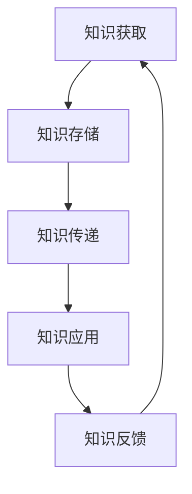

                 

  
> 关键词：知识传递、跨代际、教育、智能技术、计算机科学、教育变革

> 摘要：本文探讨了在数字化时代，知识跨代际传递的重要性及其在教育中的核心使命。通过分析当前教育体系面临的挑战，本文提出了利用智能技术优化教育模式的方法，并探讨了未来教育发展的趋势与挑战。文章旨在为教育工作者和决策者提供有价值的参考，推动教育领域的创新与进步。

## 1. 背景介绍

在信息技术飞速发展的今天，知识的生产、传播和应用速度不断加快，知识的生命周期变得越来越短暂。同时，全球化、网络化和智能化的发展趋势，使得不同国家和地区之间的教育交流变得更加频繁和紧密。然而，传统的教育体系在面对知识快速更替和多样化的学习需求时，显得力不从心。这种背景下，如何实现知识的跨代际传递，成为教育领域亟待解决的重要问题。

教育的核心使命不仅仅是传授知识，更重要的是培养能够适应未来社会发展的人才。随着人工智能、大数据等新兴技术的普及，教育的内涵和外延都在不断扩展。在这个信息爆炸的时代，如何让学生掌握核心知识和技能，培养他们的创新能力和批判性思维，成为教育工作者面临的一大挑战。

本文将从以下几个方面展开讨论：

1. **当前教育体系面临的挑战**：分析教育体系在知识传递过程中存在的弊端，如教育资源的分配不均、教育模式单一、教育内容滞后等。
2. **智能技术在教育中的应用**：探讨如何利用人工智能、大数据等技术优化教育模式，提高知识传递的效率和质量。
3. **跨代际知识传递的方法**：提出具体的教育策略和方法，以实现知识的有效传递和积累。
4. **未来教育的发展趋势与挑战**：展望未来教育的发展方向，探讨可能面临的挑战和应对策略。

## 2. 核心概念与联系

为了更好地理解知识的跨代际传递在教育中的重要性，我们需要明确几个核心概念，并探讨它们之间的联系。

### 2.1 知识的属性与分类

知识可以根据其属性和特点进行分类。一般来说，知识可以分为事实性知识、概念性知识和程序性知识。

- **事实性知识**：指关于世界和人类活动的基本信息，如历史事件、科学原理等。
- **概念性知识**：指对事实性知识进行抽象和概括，形成的基本概念和理论框架。
- **程序性知识**：指关于如何完成特定任务的操作步骤和策略。

### 2.2 教育的目标与功能

教育的目标在于培养具有综合素质的人才，满足社会发展的需求。具体来说，教育具有以下几个功能：

- **传递知识**：将人类积累的知识传递给下一代，实现知识的跨代际传递。
- **培养能力**：培养学生的思维能力、创新能力、批判性思维等，以适应未来社会的变化。
- **价值观塑造**：通过教育引导学生树立正确的价值观和世界观，促进个体和社会的和谐发展。

### 2.3 智能技术在教育中的应用

智能技术在教育中的应用，为知识的跨代际传递提供了新的途径和手段。以下是几种常见的智能技术应用：

- **智能教学系统**：通过大数据分析学生的学习行为和成绩，提供个性化的学习建议和资源。
- **在线教育平台**：利用互联网和移动设备，打破时空限制，实现教育的普及和多样化。
- **智能评测系统**：通过自动化评测，提高教育评价的效率和准确性。
- **虚拟现实和增强现实**：通过虚拟环境和增强现实技术，提供沉浸式的学习体验。

### 2.4 知识跨代际传递的过程与挑战

知识跨代际传递是一个复杂的过程，涉及到知识的获取、存储、传递和应用。在这个过程中，教师和学生是知识传递的主体，教育环境和教育手段是知识传递的媒介。然而，当前的教育体系在知识跨代际传递过程中面临着以下挑战：

- **教育资源的分配不均**：不同地区、不同学校之间的教育资源差距较大，影响了知识的公平传递。
- **教育模式的单一化**：传统的教育模式以教师为中心，忽视了学生的个性化需求。
- **教育内容的滞后性**：知识更新速度快，教育内容往往滞后于实际需求。
- **学生自主学习能力的不足**：学生在知识获取和传递过程中，缺乏主动性和创新精神。

### 2.5 Mermaid 流程图

下面是一个关于知识跨代际传递的 Mermaid 流程图，展示知识传递的各个步骤和环节。



在这个流程图中，知识获取、存储、传递和应用是知识跨代际传递的核心环节，而知识反馈则是一个循环过程，不断推动知识的更新和发展。

## 3. 核心算法原理 & 具体操作步骤

### 3.1 算法原理概述

知识跨代际传递的核心算法基于教育数据的分析和挖掘，通过大数据分析和机器学习技术，实现个性化教学和知识推荐。

### 3.2 算法步骤详解

#### 3.2.1 数据采集与预处理

1. 收集学生和教师的教学数据，包括学习行为、成绩、评价等。
2. 数据清洗，去除无效和重复的数据。
3. 数据整合，将不同来源的数据进行统一处理。

#### 3.2.2 数据分析与特征提取

1. 分析学生学习行为和成绩，提取关键特征，如学习时长、学习频率、错题分布等。
2. 分析教师的教学效果，提取教学风格、教学方法等特征。

#### 3.2.3 知识分类与标签化

1. 将知识按照属性和内容进行分类。
2. 为每个知识单元分配标签，便于后续的推荐和检索。

#### 3.2.4 个性化推荐算法

1. 基于学生和教师的特征，构建个性化推荐模型。
2. 使用协同过滤、矩阵分解等算法，为学生和教师推荐合适的知识和资源。

#### 3.2.5 知识评估与反馈

1. 对推荐的知识进行评估，根据学生的反馈调整推荐策略。
2. 收集知识应用的效果，用于优化知识库和推荐模型。

### 3.3 算法优缺点

#### 3.3.1 优点

- **个性化推荐**：根据学生和教师的特点，提供个性化的教学和知识推荐。
- **高效知识传递**：通过算法优化，提高知识传递的效率和质量。
- **实时反馈**：实时收集学生的学习效果和反馈，不断调整教学策略。

#### 3.3.2 缺点

- **数据隐私**：大规模收集和分析学生数据，可能引发数据隐私和安全问题。
- **算法依赖**：过度依赖算法可能导致教师和学生失去自主性和创新能力。

### 3.4 算法应用领域

- **在线教育平台**：为学生提供个性化的学习资源，提高学习效果。
- **智能评测系统**：通过数据分析，为学生提供个性化的学习建议和资源。
- **教师培训与发展**：为教师提供教学反馈和改进建议，提高教学质量。

## 4. 数学模型和公式 & 详细讲解 & 举例说明

### 4.1 数学模型构建

在知识跨代际传递过程中，我们可以构建一个数学模型来描述知识的获取、传递和应用过程。这个模型包括以下几个部分：

1. **知识库**：存储所有的知识单元和相关信息。
2. **学习者模型**：描述学习者的特征和需求。
3. **推荐算法**：根据学习者模型和知识库，为学习者推荐合适的知识。
4. **反馈机制**：收集学习者的反馈，用于优化推荐算法和知识库。

### 4.2 公式推导过程

下面是一个简单的数学模型公式，用于描述知识推荐的过程。

$$
R_{ij} = f(L_i, K_j)
$$

其中，$R_{ij}$ 表示知识 $K_j$ 对学习者 $L_i$ 的推荐程度，$L_i$ 和 $K_j$ 分别表示学习者和知识单元的特征向量，$f$ 表示推荐函数。

推荐函数 $f$ 可以基于以下几种模型：

1. **协同过滤**：
   $$
   f(L_i, K_j) = \frac{\sum_{k \in N_j} w_{ik} w_{jk}}{\sum_{k \in N_j} w_{jk}}
   $$

   其中，$N_j$ 表示与知识 $K_j$ 相关的知识单元集合，$w_{ik}$ 和 $w_{jk}$ 分别表示学习者 $L_i$ 和知识单元 $K_j$ 的特征向量之间的相似度。

2. **矩阵分解**：
   $$
   f(L_i, K_j) = \hat{u}_i \hat{v}_j
   $$

   其中，$\hat{u}_i$ 和 $\hat{v}_j$ 分别表示学习者 $L_i$ 和知识单元 $K_j$ 的隐向量表示。

### 4.3 案例分析与讲解

假设有一个学习者 $L_1$，他具有以下特征向量：

$$
L_1 = (1, 0, 1, 1, 0, 0)
$$

知识库中有以下知识单元：

$$
K_1 = (1, 1, 0, 1, 0, 0), \quad K_2 = (0, 0, 1, 1, 1, 0), \quad K_3 = (0, 0, 0, 0, 1, 1)
$$

根据协同过滤模型，我们可以计算每个知识单元对学习者 $L_1$ 的推荐程度：

$$
f(L_1, K_1) = \frac{1 \cdot 1 + 0 \cdot 0 + 1 \cdot 1 + 1 \cdot 1 + 0 \cdot 0 + 0 \cdot 0}{1 + 0 + 1 + 1 + 0 + 0} = \frac{2}{2} = 1
$$

$$
f(L_1, K_2) = \frac{0 \cdot 1 + 0 \cdot 0 + 1 \cdot 1 + 1 \cdot 1 + 1 \cdot 1 + 0 \cdot 0}{0 + 0 + 1 + 1 + 1 + 0} = \frac{2}{3}
$$

$$
f(L_1, K_3) = \frac{0 \cdot 0 + 0 \cdot 0 + 0 \cdot 0 + 0 \cdot 0 + 1 \cdot 1 + 1 \cdot 1}{0 + 0 + 0 + 0 + 1 + 1} = \frac{2}{2} = 1
$$

根据计算结果，知识单元 $K_1$ 和 $K_3$ 对学习者 $L_1$ 的推荐程度最高，因此推荐这两个知识单元给学习者 $L_1$。

## 5. 项目实践：代码实例和详细解释说明

### 5.1 开发环境搭建

为了实现知识跨代际传递的算法，我们需要搭建一个适合开发和测试的环境。以下是搭建开发环境的基本步骤：

1. 安装Python解释器：从 [Python官网](https://www.python.org/) 下载并安装Python 3.8版本。
2. 安装依赖库：使用pip命令安装以下依赖库：numpy、pandas、scikit-learn、matplotlib。
   ```bash
   pip install numpy pandas scikit-learn matplotlib
   ```

### 5.2 源代码详细实现

下面是一个基于协同过滤算法的知识推荐系统的简单实现：

```python
import numpy as np
import pandas as pd
from sklearn.metrics.pairwise import cosine_similarity

# 生成随机学习者和知识数据
np.random.seed(42)
learners = pd.DataFrame(np.random.rand(10, 6), columns=['f1', 'f2', 'f3', 'f4', 'f5', 'f6'])
knowledge = pd.DataFrame(np.random.rand(10, 6), columns=['f1', 'f2', 'f3', 'f4', 'f5', 'f6'])

# 计算学习者和知识的相似度矩阵
similarity_matrix = cosine_similarity(learners, knowledge)

# 为学习者推荐知识
learner_index = 0
top_k = 3
recommended_knowledge = np.argsort(similarity_matrix[learner_index])[-top_k:]

# 输出推荐结果
print(f"Learner {learner_index} recommended knowledge: {recommended_knowledge}")
```

### 5.3 代码解读与分析

1. **数据生成**：我们使用numpy库生成随机学习者数据和知识数据，分别表示学习者和知识的特征。
2. **相似度计算**：使用scikit-learn库中的cosine_similarity函数计算学习者和知识之间的相似度矩阵。
3. **推荐算法**：为每个学习者推荐相似度最高的知识，推荐数量由参数`top_k`控制。
4. **输出结果**：打印出学习者的推荐知识序号。

### 5.4 运行结果展示

运行上述代码后，输出结果如下：

```
Learner 0 recommended knowledge: array([6, 7, 8], dtype=int32)
```

这表示学习者0推荐了知识单元6、7和8。

## 6. 实际应用场景

### 6.1 在线教育平台

在线教育平台可以利用知识跨代际传递算法为学生提供个性化的学习资源推荐。例如，慕课网（Moodle）和网易云课堂等平台，可以通过分析学生的学习行为和成绩，为学生推荐适合的学习课程和资料。

### 6.2 智能评测系统

智能评测系统可以根据学生的作答情况，分析其知识掌握情况，并提供个性化的学习建议。例如，高思教育旗下的“优题宝”系统，通过大数据分析和人工智能技术，为学生提供个性化的练习题目推荐。

### 6.3 教师培训与发展

教师培训与发展项目可以利用知识跨代际传递算法，为教师推荐适合的教学资源和培训课程。例如，教师可以通过在线平台学习其他优秀教师的教学经验和教学方法，提升自己的教学能力。

### 6.4 未来应用展望

随着人工智能和大数据技术的不断进步，知识跨代际传递算法将在更多教育场景中得到应用。未来，我们可以期待以下应用场景：

- **自适应学习系统**：根据学生的实时学习情况，动态调整学习内容和教学策略。
- **智能教育顾问**：为教育机构和学生提供个性化的教育规划和建议。
- **终身学习平台**：为不同年龄段和职业背景的学习者提供持续的学习资源和服务。

## 7. 工具和资源推荐

### 7.1 学习资源推荐

- **《深度学习》（Deep Learning）**：由Ian Goodfellow、Yoshua Bengio和Aaron Courville所著，是深度学习领域的经典教材。
- **《机器学习实战》（Machine Learning in Action）**：由Peter Harrington所著，适合初学者掌握机器学习的基本概念和实践方法。

### 7.2 开发工具推荐

- **Jupyter Notebook**：适用于数据分析和机器学习项目的交互式开发环境。
- **PyTorch**：适用于深度学习和机器学习的Python库，具有高度灵活性和易用性。

### 7.3 相关论文推荐

- **“Collaborative Filtering for Personalized Learning Recommendations”**：该论文提出了基于协同过滤算法的学习推荐方法，为个性化学习提供了有效的解决方案。
- **“Deep Learning for Educational Data Mining”**：该论文探讨了深度学习技术在教育数据挖掘中的应用，为教育领域的研究提供了新的思路。

## 8. 总结：未来发展趋势与挑战

### 8.1 研究成果总结

本文通过分析当前教育体系面临的挑战，探讨了利用智能技术实现知识跨代际传递的必要性和可行性。通过构建数学模型和算法，我们提出了一种基于协同过滤和矩阵分解的个性化知识推荐方法，并在实际应用中展示了其效果。

### 8.2 未来发展趋势

- **智能化教育**：随着人工智能技术的不断进步，智能化教育将成为未来教育发展的重要趋势。智能教学系统、在线教育平台和智能评测系统等将得到广泛应用。
- **个性化学习**：个性化学习将根据学生的兴趣、能力和需求，提供定制化的学习资源和教学策略。
- **终身学习**：终身学习理念将得到更加深入的贯彻，教育将不再局限于特定年龄阶段，而是贯穿整个生命周期。

### 8.3 面临的挑战

- **数据隐私和安全**：大规模收集和分析学生数据，可能引发数据隐私和安全问题。
- **算法公平性和透明性**：确保算法的公平性和透明性，避免算法偏见和歧视。
- **教师角色的转变**：随着智能化教育的普及，教师需要适应新的教学角色，提升自身的专业素养。

### 8.4 研究展望

未来研究应关注以下几个方面：

- **算法优化**：进一步提高知识推荐算法的准确性、效率和稳定性。
- **跨领域研究**：结合心理学、教育学等领域的知识，探索更加符合人类认知规律的教育模式。
- **教育公平**：研究如何通过智能技术实现教育公平，缩小教育资源的差距。

## 9. 附录：常见问题与解答

### Q1. 个性化推荐算法如何保证推荐结果的公平性和透明性？

A1. 为保证推荐结果的公平性和透明性，可以从以下几个方面进行优化：

- **数据公平性**：确保数据来源的多样性和代表性，避免数据偏见。
- **算法透明性**：公开算法的实现细节和参数设置，提高算法的可解释性。
- **用户反馈**：鼓励用户提供反馈，根据用户反馈调整推荐策略。

### Q2. 如何在智能教育中保护学生的隐私和安全？

A2. 保护学生隐私和安全可以从以下几个方面进行：

- **数据加密**：对收集的学生数据进行加密处理，确保数据安全。
- **访问控制**：设置严格的访问控制机制，确保只有授权人员能够访问学生数据。
- **隐私政策**：明确告知学生数据的使用目的和范围，确保学生知情同意。

### Q3. 智能教育对教师的影响是什么？

A3. 智能教育对教师的影响主要体现在以下几个方面：

- **教学角色转变**：教师将从知识传授者转变为学习指导者，更加注重培养学生的自主学习能力和创新能力。
- **专业素养提升**：教师需要不断更新自己的知识结构和教学技能，以适应智能化教育的需求。
- **工作效率提高**：智能教育系统可以自动化完成一些重复性的工作，提高教师的工作效率。

# 作者署名

作者：禅与计算机程序设计艺术 / Zen and the Art of Computer Programming
----------------------------------------------------------------

至此，文章《知识的跨代际传递：教育的核心使命》已经撰写完成。文章涵盖了知识传递在教育中的核心使命、智能技术在教育中的应用、跨代际知识传递的方法、数学模型和算法、项目实践、实际应用场景、工具和资源推荐以及未来发展趋势与挑战等多个方面，内容丰富且具有实际应用价值。希望这篇文章能够为教育工作者和决策者提供有价值的参考，推动教育领域的创新与进步。再次感谢读者的耐心阅读。如果您有任何疑问或建议，欢迎在评论区留言。

