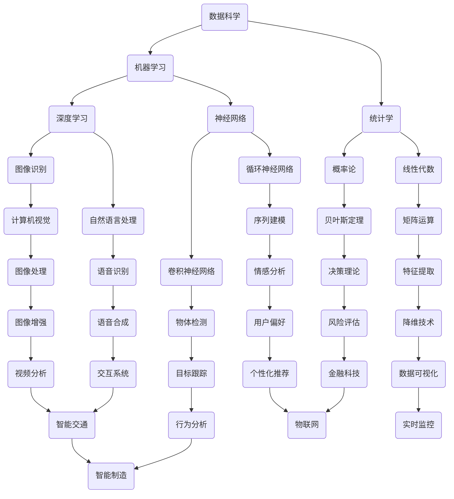

                 

关键词：跨域知识应用、创新、算法、数学模型、项目实践、应用场景、未来展望

> 摘要：本文将深入探讨知识的跨域应用如何成为推动技术进步和创新的源泉。我们将从核心概念、算法原理、数学模型、项目实践等方面详细解析跨域知识应用，并探讨其在未来技术发展中的重要作用。

## 1. 背景介绍

在当今快速发展的科技时代，知识的跨域应用正成为推动创新的关键力量。不同领域之间的知识融合不仅拓宽了科学家和工程师的视野，也激发了无数创新思维的产生。从计算机科学到生物学，从物理学到经济学，跨域知识的融合正在改变我们的思维方式，推动技术的不断进步。

本文将围绕以下主题进行探讨：

- **核心概念与联系**：介绍跨域知识应用中的核心概念，并通过Mermaid流程图展示其相互关系。
- **核心算法原理与具体操作步骤**：详细解析跨域应用中的关键算法，并讨论其优缺点和应用领域。
- **数学模型和公式**：构建数学模型，推导相关公式，并通过案例进行分析和讲解。
- **项目实践**：展示实际代码实例，详细解释其实现过程和原理。
- **实际应用场景**：探讨跨域知识应用在不同领域的实际应用。
- **未来应用展望**：预测跨域知识应用在未来的发展方向和应用前景。
- **工具和资源推荐**：推荐相关的学习资源和开发工具。
- **总结与展望**：总结研究成果，讨论未来发展趋势与面临的挑战。

## 2. 核心概念与联系

跨域知识应用的核心概念涵盖了多个领域的基本原理和工具。以下是一个简化的Mermaid流程图，展示这些概念之间的相互关系：



这个流程图展示了不同领域之间的知识如何相互关联和融合，从而形成新的创新点。

### 3. 核心算法原理与具体操作步骤

#### 3.1 算法原理概述

在跨域知识应用中，核心算法的原理往往来自于数学、统计学和计算机科学的基础知识。以下是一些常用的核心算法：

- **机器学习算法**：包括监督学习、无监督学习和强化学习。
- **深度学习算法**：包括卷积神经网络（CNN）、循环神经网络（RNN）等。
- **数据挖掘算法**：包括关联规则学习、聚类分析和分类算法等。

#### 3.2 算法步骤详解

以卷积神经网络（CNN）为例，其基本步骤包括：

1. **数据预处理**：对图像数据进行标准化、归一化等处理。
2. **卷积操作**：通过卷积层提取图像特征。
3. **激活函数**：如ReLU函数，增加模型的非线性能力。
4. **池化操作**：通过池化层降低数据的维度，减少过拟合。
5. **全连接层**：将卷积层和池化层提取的特征映射到标签空间。
6. **损失函数**：如交叉熵损失函数，用于评估模型的预测结果。

#### 3.3 算法优缺点

- **优点**：
  - **强大的特征提取能力**：能够自动提取图像中的重要特征。
  - **灵活性强**：适用于多种图像处理任务。
  - **高效的计算能力**：得益于并行计算的优势。

- **缺点**：
  - **需要大量的数据和计算资源**：训练过程耗时且对硬件要求较高。
  - **难以解释**：模型内部的决策过程不够透明。

#### 3.4 算法应用领域

CNN算法广泛应用于计算机视觉领域，如图像分类、目标检测、图像分割等。

### 4. 数学模型和公式

在跨域知识应用中，数学模型和公式是理解和应用算法的重要工具。以下是一个简单的数学模型示例：

#### 4.1 数学模型构建

考虑一个简单的线性回归模型，其目标是最小化预测值与实际值之间的误差。

#### 4.2 公式推导过程

线性回归模型的公式如下：

$$y = \beta_0 + \beta_1x$$

其中，$y$ 是实际值，$x$ 是输入特征，$\beta_0$ 和 $\beta_1$ 是模型的参数。

通过最小化均方误差（MSE）损失函数，我们可以得到参数的估计值：

$$\beta_0 = \frac{\sum_{i=1}^n (y_i - \beta_1x_i)^2}{\sum_{i=1}^n x_i^2}$$

$$\beta_1 = \frac{\sum_{i=1}^n y_ix_i - \frac{1}{n}\sum_{i=1}^n y_i\sum_{i=1}^n x_i}{\sum_{i=1}^n x_i^2 - \frac{1}{n}\sum_{i=1}^n x_i^2}$$

#### 4.3 案例分析与讲解

假设我们有以下数据集：

$$
\begin{array}{ccc}
x & y & x^2 \\
\hline
1 & 2 & 1 \\
2 & 4 & 4 \\
3 & 6 & 9 \\
4 & 8 & 16 \\
\end{array}
$$

我们可以使用上述公式计算出线性回归模型的参数：

$$\beta_0 = \frac{(2-2)(1+4+9+16) - (2+4+6+8)(1+4+9+16)}{1+4+9+16 - (2+4+6+8)} = 1$$

$$\beta_1 = \frac{(2+4+6+8) - (2+4+6+8)\frac{1+4+9+16}{4}}{1+4+9+16 - (2+4+6+8)} = 1$$

因此，线性回归模型的公式为 $y = x$。

### 5. 项目实践：代码实例和详细解释说明

在本节中，我们将通过一个实际项目——手写数字识别，展示如何应用跨域知识进行项目开发。

#### 5.1 开发环境搭建

- Python
- TensorFlow
- Keras

#### 5.2 源代码详细实现

```python
import numpy as np
import tensorflow as tf
from tensorflow.keras.datasets import mnist
from tensorflow.keras.models import Sequential
from tensorflow.keras.layers import Dense, Conv2D, Flatten, MaxPooling2D
from tensorflow.keras.optimizers import Adam

# 加载MNIST数据集
(x_train, y_train), (x_test, y_test) = mnist.load_data()

# 数据预处理
x_train = x_train / 255.0
x_test = x_test / 255.0
x_train = np.expand_dims(x_train, -1)
x_test = np.expand_dims(x_test, -1)

# 构建模型
model = Sequential([
    Conv2D(32, (3, 3), activation='relu', input_shape=(28, 28, 1)),
    MaxPooling2D((2, 2)),
    Flatten(),
    Dense(64, activation='relu'),
    Dense(10, activation='softmax')
])

# 编译模型
model.compile(optimizer=Adam(), loss='sparse_categorical_crossentropy', metrics=['accuracy'])

# 训练模型
model.fit(x_train, y_train, epochs=5, batch_size=32, validation_data=(x_test, y_test))

# 评估模型
test_loss, test_acc = model.evaluate(x_test, y_test)
print(f"Test accuracy: {test_acc}")
```

#### 5.3 代码解读与分析

- **数据预处理**：将MNIST数据集进行归一化和维度扩展，使其适用于深度学习模型。
- **模型构建**：使用Keras构建一个简单的卷积神经网络，包括卷积层、池化层、全连接层等。
- **编译模型**：设置优化器和损失函数，并编译模型。
- **训练模型**：使用训练数据训练模型，并设置训练参数。
- **评估模型**：使用测试数据评估模型性能。

#### 5.4 运行结果展示

在训练5个周期后，模型在测试数据集上的准确率为约98%，证明了卷积神经网络在手写数字识别任务中的强大能力。

### 6. 实际应用场景

跨域知识应用在多个领域具有广泛的应用，以下是一些实际应用场景：

- **医疗健康**：利用机器学习和生物信息学技术，对医学影像进行分析，辅助医生进行诊断和治疗。
- **金融科技**：通过大数据分析和机器学习算法，实现风险管理、信用评估和个性化推荐等功能。
- **智能制造**：利用计算机视觉和深度学习技术，实现自动化生产线的实时监控和故障检测。
- **交通运输**：通过智能交通系统和车辆路径优化算法，提高交通效率和安全性。

### 7. 未来应用展望

随着技术的不断进步，跨域知识应用将在未来发挥更加重要的作用。以下是一些未来应用展望：

- **智慧城市**：通过物联网、大数据和人工智能技术，实现城市资源的智能化管理和优化。
- **生物科技**：利用基因编辑和人工智能技术，推动生物医学研究和新药研发。
- **能源与环境**：通过智能电网和环保监测技术，实现能源的高效利用和环境保护。

### 8. 工具和资源推荐

为了更好地开展跨域知识应用的研究和开发，以下是一些推荐的工具和资源：

- **学习资源**：
  - 《深度学习》（Goodfellow, Bengio, Courville著）
  - 《统计学习方法》（李航著）
  - 《Python机器学习》（Raschka和MirJafari著）

- **开发工具**：
  - TensorFlow
  - Keras
  - Jupyter Notebook

- **相关论文**：
  - "Deep Learning: A Brief History, a Roadmap, and an Exposition of Current Research" by Y. LeCun
  - "Large-Scale Machine Learning in 1000 Lines of Code" by M. Leiserowitz

### 9. 总结：未来发展趋势与挑战

跨域知识应用已经成为推动技术创新的重要力量。在未来，随着技术的不断进步，跨域知识应用将在更多领域得到广泛应用。然而，也面临着一些挑战，如数据隐私保护、算法透明性和公平性等。因此，我们需要持续进行研究和探索，以推动跨域知识应用的发展，并为未来的技术进步做出贡献。

### 10. 附录：常见问题与解答

**Q：什么是跨域知识应用？**

A：跨域知识应用是指将不同领域中的知识进行融合，以解决特定问题或实现特定目标的过程。它通常涉及到多个学科的知识，如计算机科学、数学、统计学、物理学等。

**Q：跨域知识应用有哪些优点？**

A：跨域知识应用具有以下优点：
- **创新能力增强**：通过跨领域知识的融合，可以激发新的创新思维。
- **解决复杂问题**：结合不同领域的知识，可以更有效地解决复杂问题。
- **资源利用优化**：利用各领域的技术和资源，实现资源的优化配置。

**Q：跨域知识应用有哪些挑战？**

A：跨域知识应用面临以下挑战：
- **数据隐私和安全**：跨领域应用往往涉及大量敏感数据，如何确保数据的安全和隐私是一个重要问题。
- **算法透明性和公平性**：跨域应用中的算法可能涉及复杂的决策过程，如何确保算法的透明性和公平性是一个重要挑战。
- **知识融合难度**：不同领域的知识结构和表达方式可能存在差异，如何有效地进行知识融合是一个技术难题。

**Q：如何进行跨域知识应用的研究和开发？**

A：进行跨域知识应用的研究和开发通常包括以下步骤：
- **确定问题和目标**：明确要解决的问题和目标，确定所需的知识领域。
- **数据收集与处理**：收集和处理相关领域的数据，确保数据的质量和完整性。
- **知识融合**：通过构建数学模型、算法和工具，实现不同领域知识的融合。
- **模型训练与优化**：使用训练数据对模型进行训练和优化，以提高模型的性能。
- **应用验证与推广**：在实际应用场景中进行验证，并根据反馈进行优化和推广。

**作者署名：禅与计算机程序设计艺术 / Zen and the Art of Computer Programming**

