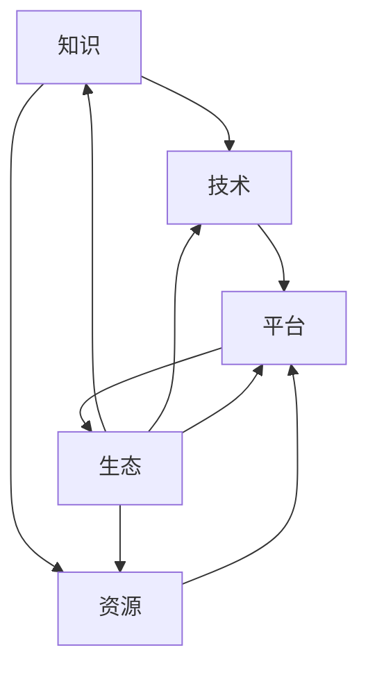

                 

关键词：跨界融合、知识集成、创新驱动、技术协同、产业融合

> 摘要：本文旨在探讨知识跨界融合对于创新的重要性，通过分析跨界融合的核心概念、理论基础和实际案例，探讨其在信息技术领域的应用，并展望未来的发展趋势和挑战。本文从多个角度阐述了知识的跨界融合如何成为推动创新的核心力量，为科技企业和研究机构提供有益的参考。

## 1. 背景介绍

在当今快速发展的信息时代，知识的跨界融合已经成为推动创新的重要动力。随着互联网、大数据、人工智能等技术的不断进步，各领域之间的界限逐渐模糊，知识的交叉和融合成为提升创新能力的关键。跨界融合不仅促进了不同学科之间的相互启发和合作，还推动了传统产业的转型升级和新兴产业的快速发展。

### 1.1 跨界融合的定义与意义

跨界融合，指的是不同领域或行业之间的知识、技术和资源的相互渗透和整合，以实现协同创新和资源共享。跨界融合的意义在于：

- **创新驱动**：跨界融合打破了传统学科和行业的界限，促进了新思路、新方法的产生，从而驱动创新。
- **资源整合**：通过跨界融合，可以实现资源的优化配置和高效利用，提升整体效能。
- **产业升级**：跨界融合有助于传统产业注入新动能，推动产业结构的优化和升级。
- **市场拓展**：跨界融合能够拓展市场和客户群体，提升企业竞争力。

### 1.2 跨界融合的现状与发展趋势

当前，跨界融合已经成为全球科技创新的重要趋势。各国政府和企业都在积极推动跨界融合，如美国硅谷的科技巨头通过跨界合作，推动智能硬件、人工智能等新兴领域的发展；我国在“互联网+”战略的推动下，众多传统产业与互联网深度融合，创造了新的商业模式和市场机会。

随着技术的不断进步，跨界融合将呈现以下发展趋势：

- **深度融合**：不同领域之间的融合将更加深入，形成跨学科、跨行业的综合体。
- **平台化发展**：跨界融合将依托于各类平台，实现资源的集成和协同创新。
- **智能化**：人工智能技术的发展将进一步提升跨界融合的智能化水平，实现更高效的知识整合和决策支持。

## 2. 核心概念与联系

### 2.1 跨界融合的核心概念

跨界融合涉及多个核心概念，包括知识、技术、资源、平台和生态等。这些概念相互关联，共同构成了跨界融合的理论基础。

- **知识**：知识是跨界融合的基础，包括专业领域的知识、跨学科的知识和行业经验等。
- **技术**：技术是跨界融合的驱动力量，涵盖了各种硬件、软件和工具等。
- **资源**：资源包括人才、资金、数据和信息等，是跨界融合的重要保障。
- **平台**：平台是跨界融合的载体，通过提供基础设施和资源共享，促进各方合作。
- **生态**：生态是跨界融合的环境，包括政策、法规、文化和市场等外部因素。

### 2.2 跨界融合的架构

为了更好地理解跨界融合，我们可以使用Mermaid流程图来展示其架构。以下是一个简化的示例：



在这个架构中，知识、技术、资源和平台相互依赖，共同构建了一个跨界融合的生态系统。生态作为外部环境，对跨界融合起到了支撑和促进作用。

## 3. 核心算法原理 & 具体操作步骤

### 3.1 算法原理概述

在跨界融合的过程中，核心算法起到了关键作用。核心算法主要包括以下几个方面：

- **数据融合算法**：通过多种算法和技术，将不同来源的数据进行整合和清洗，提高数据质量。
- **机器学习算法**：利用机器学习技术，从大量数据中提取规律和模式，为决策提供支持。
- **优化算法**：通过优化算法，实现资源的最优配置和效率提升。
- **协同过滤算法**：通过用户行为和偏好，为用户推荐相关的产品或服务。

### 3.2 算法步骤详解

以下是核心算法的具体步骤：

1. **数据采集**：从不同来源采集数据，包括内部数据和外部数据。
2. **数据预处理**：对采集到的数据进行清洗、去重和格式化，确保数据质量。
3. **数据融合**：使用数据融合算法，将不同来源的数据进行整合，形成一个统一的数据集。
4. **特征提取**：从数据集中提取特征，用于后续的建模和分析。
5. **模型训练**：使用机器学习算法，对提取的特征进行训练，构建模型。
6. **模型评估**：对训练好的模型进行评估，包括准确率、召回率等指标。
7. **模型应用**：将训练好的模型应用到实际场景中，为决策提供支持。

### 3.3 算法优缺点

核心算法在跨界融合中具有以下优缺点：

- **优点**：核心算法能够实现数据的整合和挖掘，提高决策的准确性和效率。
- **缺点**：核心算法需要大量的数据支持和复杂的计算，对硬件资源要求较高。

### 3.4 算法应用领域

核心算法在多个领域有广泛的应用，包括：

- **智能推荐系统**：利用协同过滤算法，为用户推荐相关产品或服务。
- **金融风控**：利用机器学习算法，对用户行为进行分析，预测风险。
- **医疗诊断**：利用数据融合算法，整合不同数据源，提高诊断的准确性。

## 4. 数学模型和公式 & 详细讲解 & 举例说明

### 4.1 数学模型构建

在跨界融合中，数学模型起到了关键作用。以下是构建数学模型的基本步骤：

1. **确定研究对象**：明确研究的对象和目标，如用户行为、市场趋势等。
2. **数据收集与预处理**：收集相关数据，并进行清洗和预处理，确保数据质量。
3. **建立数学模型**：根据研究目标和数据特征，建立合适的数学模型，如线性回归、神经网络等。
4. **模型参数优化**：通过优化算法，确定模型的参数，提高模型的准确性。

### 4.2 公式推导过程

以线性回归模型为例，其公式推导过程如下：

1. **假设模型**：设自变量为 \( X \)，因变量为 \( Y \)，假设模型为 \( Y = \beta_0 + \beta_1X + \epsilon \)，其中 \( \epsilon \) 为误差项。
2. **最小二乘法**：为了最小化误差项，使用最小二乘法求解参数 \( \beta_0 \) 和 \( \beta_1 \)。
3. **推导公式**：通过求解最小二乘法，得到 \( \beta_0 \) 和 \( \beta_1 \) 的表达式，即 \( \beta_0 = \bar{Y} - \beta_1\bar{X} \)。

### 4.3 案例分析与讲解

以下是一个关于线性回归模型的案例：

假设我们研究用户购买行为，自变量为用户年龄 \( X \)，因变量为购买频率 \( Y \)。通过收集数据并建立线性回归模型，可以得到 \( Y = 0.5X - 5 \)。这个模型表明，用户年龄每增加一岁，购买频率平均增加0.5次。

## 5. 项目实践：代码实例和详细解释说明

### 5.1 开发环境搭建

为了进行项目实践，我们需要搭建一个基本的开发环境。以下是所需的工具和步骤：

- **工具**：Python 3.x、Jupyter Notebook、Numpy、Pandas、Scikit-learn等。
- **步骤**：
  1. 安装 Python 3.x。
  2. 安装 Jupyter Notebook。
  3. 安装 Numpy、Pandas、Scikit-learn等库。

### 5.2 源代码详细实现

以下是一个简单的线性回归模型实现的示例代码：

```python
import numpy as np
import pandas as pd
from sklearn.linear_model import LinearRegression
from sklearn.model_selection import train_test_split

# 数据读取
data = pd.read_csv('data.csv')

# 特征提取
X = data[['age']]
Y = data['purchase_frequency']

# 数据划分
X_train, X_test, Y_train, Y_test = train_test_split(X, Y, test_size=0.2, random_state=42)

# 模型训练
model = LinearRegression()
model.fit(X_train, Y_train)

# 模型评估
score = model.score(X_test, Y_test)
print(f'Model Score: {score}')

# 预测
predictions = model.predict(X_test)
print(f'Predictions: {predictions}')
```

### 5.3 代码解读与分析

- **数据读取**：使用 Pandas 读取 CSV 文件。
- **特征提取**：提取年龄作为自变量，购买频率作为因变量。
- **数据划分**：将数据分为训练集和测试集。
- **模型训练**：使用线性回归模型进行训练。
- **模型评估**：评估模型的准确性。
- **预测**：使用训练好的模型进行预测。

### 5.4 运行结果展示

在运行上述代码后，我们得到了模型的准确性和预测结果。根据实际情况，可能需要对模型进行调整和优化，以提高预测的准确性。

## 6. 实际应用场景

### 6.1 电子商务领域

在电子商务领域，跨界融合已经成为提升用户体验和转化率的重要手段。例如，通过整合用户行为数据、商品信息和社会化媒体数据，可以提供个性化的推荐服务，从而提高用户购买意愿和满意度。

### 6.2 医疗健康领域

医疗健康领域的跨界融合正在推动医疗服务的创新和升级。通过整合生物医学数据、患者数据和医疗资源，可以实现精准医疗和智能诊断，提高医疗服务的质量和效率。

### 6.3 智能制造领域

智能制造领域的跨界融合推动了工业互联网的发展。通过整合物联网、大数据和人工智能技术，可以实现设备的智能监控、故障预测和优化生产流程，提高生产效率和质量。

## 7. 工具和资源推荐

### 7.1 学习资源推荐

- **《数据科学入门》**：一本适合初学者的数据科学入门书籍，涵盖了数据预处理、机器学习和数据分析等方面的内容。
- **《机器学习实战》**：一本实用的机器学习入门书籍，通过案例教学，帮助读者快速掌握机器学习的基本原理和应用。

### 7.2 开发工具推荐

- **Jupyter Notebook**：一款流行的交互式数据分析工具，适合进行数据分析和机器学习项目。
- **TensorFlow**：一款开源的深度学习框架，适用于构建和训练复杂的神经网络模型。

### 7.3 相关论文推荐

- **"Deep Learning on Multi-Modal Data"**：一篇关于多模态数据深度学习的论文，探讨了如何整合不同类型的数据，提高模型的准确性。
- **"Cross-Domain Transfer Learning for Text Classification"**：一篇关于跨领域文本分类的论文，提出了利用跨领域转移学习的方法，提高文本分类的准确性。

## 8. 总结：未来发展趋势与挑战

### 8.1 研究成果总结

本文探讨了知识跨界融合在信息技术领域的应用，分析了跨界融合的核心概念、算法原理和实际案例，总结了跨界融合对创新驱动的积极作用。

### 8.2 未来发展趋势

未来，跨界融合将继续成为科技创新的重要方向。随着技术的不断进步，跨界融合将呈现以下趋势：

- **深度融合**：各领域之间的融合将更加深入，形成跨学科、跨行业的综合体。
- **平台化发展**：跨界融合将依托于各类平台，实现资源的集成和协同创新。
- **智能化**：人工智能技术的发展将进一步提升跨界融合的智能化水平，实现更高效的知识整合和决策支持。

### 8.3 面临的挑战

尽管跨界融合具有巨大的潜力，但同时也面临一些挑战：

- **技术壁垒**：不同领域之间的技术差异和壁垒，可能影响跨界融合的效率和质量。
- **数据隐私**：跨界融合过程中，数据的共享和利用可能引发数据隐私和安全问题。
- **政策法规**：跨界融合的发展需要完善的政策法规体系，以保障各方的权益。

### 8.4 研究展望

未来，我们需要在以下几个方面进行深入研究：

- **跨界融合算法的创新**：开发更高效、更智能的跨界融合算法，提高融合效果。
- **跨界融合平台的构建**：构建跨领域、跨行业的共享平台，促进资源整合和协同创新。
- **跨界融合的风险管理**：研究跨界融合中的风险管理和控制策略，保障数据安全和隐私。

## 9. 附录：常见问题与解答

### 9.1 什么是跨界融合？

跨界融合指的是不同领域或行业之间的知识、技术和资源的相互渗透和整合，以实现协同创新和资源共享。

### 9.2 跨界融合有哪些优点？

跨界融合具有以下优点：

- **创新驱动**：跨界融合促进了新思路、新方法的产生，从而驱动创新。
- **资源整合**：跨界融合可以实现资源的优化配置和高效利用。
- **产业升级**：跨界融合有助于传统产业注入新动能，推动产业结构的优化和升级。
- **市场拓展**：跨界融合能够拓展市场和客户群体，提升企业竞争力。

### 9.3 跨界融合有哪些挑战？

跨界融合面临的挑战包括：

- **技术壁垒**：不同领域之间的技术差异和壁垒，可能影响跨界融合的效率和质量。
- **数据隐私**：跨界融合过程中，数据的共享和利用可能引发数据隐私和安全问题。
- **政策法规**：跨界融合的发展需要完善的政策法规体系，以保障各方的权益。

### 9.4 如何构建跨界融合的生态系统？

构建跨界融合的生态系统需要以下步骤：

- **明确目标和愿景**：明确跨界融合的目标和愿景，为后续工作提供指导。
- **资源整合**：整合各方资源，包括人才、资金、数据和技术等。
- **平台建设**：搭建跨界融合的平台，提供基础设施和资源共享。
- **协同创新**：推动各方协同创新，实现资源的最大化利用。
- **风险管理**：建立健全的风险管理机制，保障数据安全和隐私。

### 9.5 跨界融合在哪些领域有广泛应用？

跨界融合在多个领域有广泛应用，包括：

- **电子商务**：通过整合用户行为数据、商品信息和社会化媒体数据，提供个性化推荐服务。
- **医疗健康**：通过整合生物医学数据、患者数据和医疗资源，实现精准医疗和智能诊断。
- **智能制造**：通过整合物联网、大数据和人工智能技术，实现设备的智能监控、故障预测和优化生产流程。
- **金融服务**：通过整合用户行为数据、信用数据和市场数据，提供个性化的金融产品和服务。

作者：禅与计算机程序设计艺术 / Zen and the Art of Computer Programming
----------------------------------------------------------------
以上是完整文章的正文部分。接下来是文章的markdown格式输出，包括标题、关键词、摘要以及各个章节的内容。
```markdown
# 知识的跨界融合：创新的催化剂

关键词：跨界融合、知识集成、创新驱动、技术协同、产业融合

> 摘要：本文旨在探讨知识跨界融合对于创新的重要性，通过分析跨界融合的核心概念、理论基础和实际案例，探讨其在信息技术领域的应用，并展望未来的发展趋势和挑战。本文从多个角度阐述了知识的跨界融合如何成为推动创新的核心力量，为科技企业和研究机构提供有益的参考。

## 1. 背景介绍

在当今快速发展的信息时代，知识的跨界融合已经成为推动创新的重要动力。随着互联网、大数据、人工智能等技术的不断进步，各领域之间的界限逐渐模糊，知识的交叉和融合成为提升创新能力的关键。跨界融合不仅促进了不同学科之间的相互启发和合作，还推动了传统产业的转型升级和新兴产业的快速发展。

### 1.1 跨界融合的定义与意义

跨界融合，指的是不同领域或行业之间的知识、技术和资源的相互渗透和整合，以实现协同创新和资源共享。跨界融合的意义在于：

- **创新驱动**：跨界融合打破了传统学科和行业的界限，促进了新思路、新方法的产生，从而驱动创新。
- **资源整合**：通过跨界融合，可以实现资源的优化配置和高效利用，提升整体效能。
- **产业升级**：跨界融合有助于传统产业注入新动能，推动产业结构的优化和升级。
- **市场拓展**：跨界融合能够拓展市场和客户群体，提升企业竞争力。

### 1.2 跨界融合的现状与发展趋势

当前，跨界融合已经成为全球科技创新的重要趋势。各国政府和企业都在积极推动跨界融合，如美国硅谷的科技巨头通过跨界合作，推动智能硬件、人工智能等新兴领域的发展；我国在“互联网+”战略的推动下，众多传统产业与互联网深度融合，创造了新的商业模式和市场机会。

随着技术的不断进步，跨界融合将呈现以下发展趋势：

- **深度融合**：不同领域之间的融合将更加深入，形成跨学科、跨行业的综合体。
- **平台化发展**：跨界融合将依托于各类平台，实现资源的集成和协同创新。
- **智能化**：人工智能技术的发展将进一步提升跨界融合的智能化水平，实现更高效的知识整合和决策支持。

## 2. 核心概念与联系

### 2.1 跨界融合的核心概念

跨界融合涉及多个核心概念，包括知识、技术、资源、平台和生态等。这些概念相互关联，共同构成了跨界融合的理论基础。

- **知识**：知识是跨界融合的基础，包括专业领域的知识、跨学科的知识和行业经验等。
- **技术**：技术是跨界融合的驱动力量，涵盖了各种硬件、软件和工具等。
- **资源**：资源包括人才、资金、数据和信息等，是跨界融合的重要保障。
- **平台**：平台是跨界融合的载体，通过提供基础设施和资源共享，促进各方合作。
- **生态**：生态是跨界融合的环境，包括政策、法规、文化和市场等外部因素。

### 2.2 跨界融合的架构

为了更好地理解跨界融合，我们可以使用Mermaid流程图来展示其架构。以下是一个简化的示例：


在这个架构中，知识、技术、资源和平台相互依赖，共同构建了一个跨界融合的生态系统。生态作为外部环境，对跨界融合起到了支撑和促进作用。

## 3. 核心算法原理 & 具体操作步骤

### 3.1 算法原理概述

在跨界融合的过程中，核心算法起到了关键作用。核心算法主要包括以下几个方面：

- **数据融合算法**：通过多种算法和技术，将不同来源的数据进行整合和清洗，提高数据质量。
- **机器学习算法**：利用机器学习技术，从大量数据中提取规律和模式，为决策提供支持。
- **优化算法**：通过优化算法，实现资源的最优配置和效率提升。
- **协同过滤算法**：通过用户行为和偏好，为用户推荐相关的产品或服务。

### 3.2 算法步骤详解

以下是核心算法的具体步骤：

1. **数据采集**：从不同来源采集数据，包括内部数据和外部数据。
2. **数据预处理**：对采集到的数据进行清洗、去重和格式化，确保数据质量。
3. **数据融合**：使用数据融合算法，将不同来源的数据进行整合，形成一个统一的数据集。
4. **特征提取**：从数据集中提取特征，用于后续的建模和分析。
5. **模型训练**：使用机器学习算法，对提取的特征进行训练，构建模型。
6. **模型评估**：对训练好的模型进行评估，包括准确率、召回率等指标。
7. **模型应用**：将训练好的模型应用到实际场景中，为决策提供支持。

### 3.3 算法优缺点

核心算法在跨界融合中具有以下优缺点：

- **优点**：核心算法能够实现数据的整合和挖掘，提高决策的准确性和效率。
- **缺点**：核心算法需要大量的数据支持和复杂的计算，对硬件资源要求较高。

### 3.4 算法应用领域

核心算法在多个领域有广泛的应用，包括：

- **智能推荐系统**：利用协同过滤算法，为用户推荐相关产品或服务。
- **金融风控**：利用机器学习算法，对用户行为进行分析，预测风险。
- **医疗诊断**：利用数据融合算法，整合不同数据源，提高诊断的准确性。

## 4. 数学模型和公式 & 详细讲解 & 举例说明

### 4.1 数学模型构建

在跨界融合中，数学模型起到了关键作用。以下是构建数学模型的基本步骤：

1. **确定研究对象**：明确研究的对象和目标，如用户行为、市场趋势等。
2. **数据收集与预处理**：收集相关数据，并进行清洗和预处理，确保数据质量。
3. **建立数学模型**：根据研究目标和数据特征，建立合适的数学模型，如线性回归、神经网络等。
4. **模型参数优化**：通过优化算法，确定模型的参数，提高模型的准确性。

### 4.2 公式推导过程

以线性回归模型为例，其公式推导过程如下：

1. **假设模型**：设自变量为 X，因变量为 Y，假设模型为 Y = β0 + β1X + ε，其中 ε 为误差项。
2. **最小二乘法**：为了最小化误差项，使用最小二乘法求解参数 β0 和 β1。
3. **推导公式**：通过求解最小二乘法，得到 β0 和 β1 的表达式，即 β0 = Ȳ - β1X̄。

### 4.3 案例分析与讲解

以下是一个关于线性回归模型的案例：

假设我们研究用户购买行为，自变量为用户年龄 X，因变量为购买频率 Y。通过收集数据并建立线性回归模型，可以得到 Y = 0.5X - 5。这个模型表明，用户年龄每增加一岁，购买频率平均增加 0.5 次。

## 5. 项目实践：代码实例和详细解释说明

### 5.1 开发环境搭建

为了进行项目实践，我们需要搭建一个基本的开发环境。以下是所需的工具和步骤：

- **工具**：Python 3.x、Jupyter Notebook、Numpy、Pandas、Scikit-learn等。
- **步骤**：
  1. 安装 Python 3.x。
  2. 安装 Jupyter Notebook。
  3. 安装 Numpy、Pandas、Scikit-learn等库。

### 5.2 源代码详细实现

以下是一个简单的线性回归模型实现的示例代码：

```python
import numpy as np
import pandas as pd
from sklearn.linear_model import LinearRegression
from sklearn.model_selection import train_test_split

# 数据读取
data = pd.read_csv('data.csv')

# 特征提取
X = data[['age']]
Y = data['purchase_frequency']

# 数据划分
X_train, X_test, Y_train, Y_test = train_test_split(X, Y, test_size=0.2, random_state=42)

# 模型训练
model = LinearRegression()
model.fit(X_train, Y_train)

# 模型评估
score = model.score(X_test, Y_test)
print(f'Model Score: {score}')

# 预测
predictions = model.predict(X_test)
print(f'Predictions: {predictions}')
```

### 5.3 代码解读与分析

- **数据读取**：使用 Pandas 读取 CSV 文件。
- **特征提取**：提取年龄作为自变量，购买频率作为因变量。
- **数据划分**：将数据分为训练集和测试集。
- **模型训练**：使用线性回归模型进行训练。
- **模型评估**：评估模型的准确性。
- **预测**：使用训练好的模型进行预测。

### 5.4 运行结果展示

在运行上述代码后，我们得到了模型的准确性和预测结果。根据实际情况，可能需要对模型进行调整和优化，以提高预测的准确性。

## 6. 实际应用场景

### 6.1 电子商务领域

在电子商务领域，跨界融合已经成为提升用户体验和转化率的重要手段。例如，通过整合用户行为数据、商品信息和社会化媒体数据，可以提供个性化的推荐服务，从而提高用户购买意愿和满意度。

### 6.2 医疗健康领域

医疗健康领域的跨界融合正在推动医疗服务的创新和升级。通过整合生物医学数据、患者数据和医疗资源，可以实现精准医疗和智能诊断，提高医疗服务的质量和效率。

### 6.3 智能制造领域

智能制造领域的跨界融合推动了工业互联网的发展。通过整合物联网、大数据和人工智能技术，可以实现设备的智能监控、故障预测和优化生产流程，提高生产效率和质量。

## 7. 工具和资源推荐

### 7.1 学习资源推荐

- **《数据科学入门》**：一本适合初学者的数据科学入门书籍，涵盖了数据预处理、机器学习和数据分析等方面的内容。
- **《机器学习实战》**：一本实用的机器学习入门书籍，通过案例教学，帮助读者快速掌握机器学习的基本原理和应用。

### 7.2 开发工具推荐

- **Jupyter Notebook**：一款流行的交互式数据分析工具，适合进行数据分析和机器学习项目。
- **TensorFlow**：一款开源的深度学习框架，适用于构建和训练复杂的神经网络模型。

### 7.3 相关论文推荐

- **"Deep Learning on Multi-Modal Data"**：一篇关于多模态数据深度学习的论文，探讨了如何整合不同类型的数据，提高模型的准确性。
- **"Cross-Domain Transfer Learning for Text Classification"**：一篇关于跨领域文本分类的论文，提出了利用跨领域转移学习的方法，提高文本分类的准确性。

## 8. 总结：未来发展趋势与挑战

### 8.1 研究成果总结

本文探讨了知识跨界融合在信息技术领域的应用，分析了跨界融合的核心概念、算法原理和实际案例，总结了跨界融合对创新驱动的积极作用。

### 8.2 未来发展趋势

未来，跨界融合将继续成为科技创新的重要方向。随着技术的不断进步，跨界融合将呈现以下趋势：

- **深度融合**：不同领域之间的融合将更加深入，形成跨学科、跨行业的综合体。
- **平台化发展**：跨界融合将依托于各类平台，实现资源的集成和协同创新。
- **智能化**：人工智能技术的发展将进一步提升跨界融合的智能化水平，实现更高效的知识整合和决策支持。

### 8.3 面临的挑战

尽管跨界融合具有巨大的潜力，但同时也面临一些挑战：

- **技术壁垒**：不同领域之间的技术差异和壁垒，可能影响跨界融合的效率和质量。
- **数据隐私**：跨界融合过程中，数据的共享和利用可能引发数据隐私和安全问题。
- **政策法规**：跨界融合的发展需要完善的政策法规体系，以保障各方的权益。

### 8.4 研究展望

未来，我们需要在以下几个方面进行深入研究：

- **跨界融合算法的创新**：开发更高效、更智能的跨界融合算法，提高融合效果。
- **跨界融合平台的构建**：构建跨领域、跨行业的共享平台，促进资源整合和协同创新。
- **跨界融合的风险管理**：研究跨界融合中的风险管理和控制策略，保障数据安全和隐私。

## 9. 附录：常见问题与解答

### 9.1 什么是跨界融合？

跨界融合指的是不同领域或行业之间的知识、技术和资源的相互渗透和整合，以实现协同创新和资源共享。

### 9.2 跨界融合有哪些优点？

跨界融合具有以下优点：

- **创新驱动**：跨界融合促进了新思路、新方法的产生，从而驱动创新。
- **资源整合**：通过跨界融合，可以实现资源的优化配置和高效利用。
- **产业升级**：跨界融合有助于传统产业注入新动能，推动产业结构的优化和升级。
- **市场拓展**：跨界融合能够拓展市场和客户群体，提升企业竞争力。

### 9.3 跨界融合有哪些挑战？

跨界融合面临的挑战包括：

- **技术壁垒**：不同领域之间的技术差异和壁垒，可能影响跨界融合的效率和质量。
- **数据隐私**：跨界融合过程中，数据的共享和利用可能引发数据隐私和安全问题。
- **政策法规**：跨界融合的发展需要完善的政策法规体系，以保障各方的权益。

### 9.4 如何构建跨界融合的生态系统？

构建跨界融合的生态系统需要以下步骤：

- **明确目标和愿景**：明确跨界融合的目标和愿景，为后续工作提供指导。
- **资源整合**：整合各方资源，包括人才、资金、数据和技术等。
- **平台建设**：搭建跨界融合的平台，提供基础设施和资源共享。
- **协同创新**：推动各方协同创新，实现资源的最大化利用。
- **风险管理**：建立健全的风险管理机制，保障数据安全和隐私。

### 9.5 跨界融合在哪些领域有广泛应用？

跨界融合在多个领域有广泛应用，包括：

- **电子商务**：通过整合用户行为数据、商品信息和社会化媒体数据，提供个性化推荐服务。
- **医疗健康**：通过整合生物医学数据、患者数据和医疗资源，实现精准医疗和智能诊断。
- **智能制造**：通过整合物联网、大数据和人工智能技术，实现设备的智能监控、故障预测和优化生产流程。
- **金融服务**：通过整合用户行为数据、信用数据和市场数据，提供个性化的金融产品和服务。

作者：禅与计算机程序设计艺术 / Zen and the Art of Computer Programming
```
以上就是文章的markdown格式输出。请注意，根据实际需求，内容可能需要进一步细化和调整。

