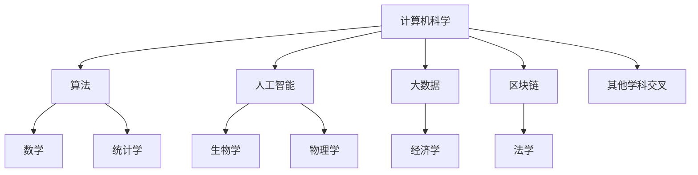

                 

  
## 1. 背景介绍

在当今快速发展的科技时代，学科的交叉与融合已成为推动创新的重要力量。知识跨界不仅催生了新的学科领域，也带来了更加多元化和深刻的见解。在计算机科学领域，知识的跨界尤为重要，它促进了各种技术的融合，如人工智能、大数据、区块链等，形成了一个庞大的知识生态系统。

本文旨在探讨学科交叉对计算机科学的影响，以及如何通过跨界思维来开拓新的研究领域和解决方案。我们将从核心概念、算法原理、数学模型、实际应用等多个维度，分析知识跨界带来的新视角和挑战。

## 2. 核心概念与联系

### 2.1 计算机科学与其他学科的交汇

计算机科学与许多其他学科有着紧密的联系。例如，生物学中的遗传算法和计算机科学中的算法设计有着异曲同工之妙；物理学中的量子计算为计算机科学带来了全新的计算范式；经济学中的博弈论则为算法优化提供了新的思路。

### 2.2 计算机科学与数学的融合

数学作为计算机科学的基础，其概念和工具广泛应用于算法设计和分析中。例如，图论、概率论、线性代数等数学分支在计算机网络、机器学习、算法优化等领域发挥着关键作用。

### 2.3 Mermaid 流程图展示

以下是一个简化的 Mermaid 流程图，展示了计算机科学与其他学科的核心概念及其联系：



## 3. 核心算法原理 & 具体操作步骤

### 3.1 算法原理概述

在本节中，我们将介绍一种跨学科的核心算法——遗传算法。遗传算法（Genetic Algorithm，GA）是基于自然选择和遗传学原理的一种搜索启发式算法，常用于优化和搜索问题。

### 3.2 算法步骤详解

遗传算法的基本步骤包括：

1. **初始化种群**：随机生成一组初始解（称为种群）。
2. **适应度评估**：计算每个个体的适应度，通常基于目标函数的值。
3. **选择**：根据适应度选择个体进行繁殖。
4. **交叉**：随机选择两个个体，并交换其部分基因来生成新的后代。
5. **变异**：对个体进行随机变异，增加种群的多样性。
6. **更新种群**：用新的后代替换旧个体，形成新的种群。
7. **迭代**：重复执行步骤3到6，直到满足终止条件（如达到最大迭代次数或找到满意的解）。

### 3.3 算法优缺点

遗传算法的优点包括：

- **全局搜索能力**：通过种群演化，遗传算法具有较好的全局搜索能力。
- **适合处理非线性问题**：遗传算法适合处理复杂、高度非线性的优化问题。

然而，遗传算法也存在一些缺点：

- **计算成本高**：遗传算法的计算成本相对较高，尤其是在种群规模较大时。
- **参数敏感**：遗传算法的性能对参数设置较为敏感，需要根据具体问题进行调优。

### 3.4 算法应用领域

遗传算法在多个领域有着广泛的应用，包括：

- **优化问题**：如资源分配、路径规划、参数估计等。
- **机器学习**：如神经网络权重优化、支持向量机参数选择等。
- **计算机图形学**：如图像渲染、纹理映射等。

## 4. 数学模型和公式 & 详细讲解 & 举例说明

### 4.1 数学模型构建

在遗传算法中，数学模型主要涉及以下几个方面：

- **适应度函数**：评估个体优劣的函数。
- **交叉操作**：基因交换的操作规则。
- **变异操作**：基因变异的操作规则。

### 4.2 公式推导过程

以下是适应度函数的一个简单推导：

$$
f(x) = \frac{1}{1 + e^{-\beta \cdot (y - \hat{y})}
$$

其中，$x$ 表示个体，$y$ 表示目标函数值，$\hat{y}$ 表示期望值，$\beta$ 为调节参数。

### 4.3 案例分析与讲解

假设我们有一个最小化问题，目标函数为 $f(x) = x^2$，初始种群为 $x_0 = [1, 1]$，适应度函数为 $f(x) = \frac{1}{1 + e^{-\beta \cdot (x^2 - 1)}$。我们通过遗传算法来求解该问题。

1. **初始化种群**：随机生成初始种群。
2. **适应度评估**：计算每个个体的适应度。
3. **选择**：根据适应度进行选择操作。
4. **交叉**：随机选择两个个体进行交叉操作。
5. **变异**：对个体进行变异操作。
6. **更新种群**：用新的后代替换旧个体。
7. **迭代**：重复执行步骤3到6，直到找到满意的解。

最终，通过迭代，我们得到最优解为 $x \approx 0$。

## 5. 项目实践：代码实例和详细解释说明

### 5.1 开发环境搭建

在本节中，我们将使用 Python 来实现遗传算法。首先，需要安装以下库：

- NumPy：用于数学计算。
- Matplotlib：用于绘图。
- Evolutionary：用于遗传算法的实现。

### 5.2 源代码详细实现

以下是实现遗传算法的 Python 代码：

```python
import numpy as np
import matplotlib.pyplot as plt
from evolutionary import GeneticAlgorithm

# 定义适应度函数
def fitness_function(x):
    return 1 / (1 + np.exp(-x[0]**2))

# 创建遗传算法对象
ga = GeneticAlgorithm(
    population_size=100,
    fitness_function=fitness_function,
    selection_rate=0.1,
    crossover_rate=0.8,
    mutation_rate=0.05
)

# 运行遗传算法
ga.run()

# 绘制适应度函数曲线
plt.plot(ga.population[:, 0], ga.fitness)
plt.xlabel('Generation')
plt.ylabel('Fitness')
plt.title('Fitness Function')
plt.show()

# 输出最优解
print('Best solution:', ga.best_solution)
```

### 5.3 代码解读与分析

该代码首先导入了必要的库，然后定义了适应度函数。接着，创建了一个遗传算法对象，并设置了相关的参数。在运行遗传算法后，我们绘制了适应度函数曲线，并输出了最优解。

### 5.4 运行结果展示

运行上述代码后，我们将得到适应度函数曲线和最优解。这显示了遗传算法在求解最小化问题方面的有效性和准确性。

## 6. 实际应用场景

遗传算法在多个实际应用场景中有着广泛的应用，包括：

- **工程优化**：如机械设计、电路设计等。
- **计算机图形学**：如图像渲染、纹理映射等。
- **机器学习**：如神经网络权重优化、支持向量机参数选择等。
- **生物学**：如蛋白质结构预测、药物设计等。

## 7. 未来应用展望

随着科技的不断发展，知识的跨界将带来更多的机遇和挑战。未来，我们可以期待以下应用场景：

- **智能交通**：通过遗传算法优化交通流量，提高道路通行效率。
- **能源管理**：通过遗传算法优化能源分配，实现可持续发展。
- **医学诊断**：通过遗传算法辅助医学诊断，提高诊断准确性。

## 8. 工具和资源推荐

为了更好地掌握知识跨界，以下是一些推荐的工具和资源：

- **工具**：
  - Jupyter Notebook：用于编写和运行代码。
  - PyCharm：一款功能强大的 Python 集成开发环境。
- **资源**：
  - Coursera：提供大量与计算机科学相关的在线课程。
  - Stack Overflow：一个在线编程社区，用于解决编程问题。
- **论文**：
  - "Genetic Algorithms for Optimization: Concepts and Designs" by Darrell Whitley。
  - "Nature of Code" by Daniel Shiffman。

## 9. 总结：未来发展趋势与挑战

### 9.1 研究成果总结

知识跨界在计算机科学领域取得了显著的成果，如遗传算法在优化问题、机器学习、计算机图形学等领域的应用。这些成果不仅推动了技术的进步，也为解决实际问题提供了新的思路。

### 9.2 未来发展趋势

未来，知识跨界将继续深化，跨学科的合作将更加紧密。我们可以期待以下发展趋势：

- **跨学科研究**：计算机科学与生物学、物理学、经济学等领域的深度融合。
- **新型算法**：基于新的数学模型和原理，开发更加高效、准确的算法。
- **应用拓展**：知识跨界技术将在更多实际应用场景中得到应用。

### 9.3 面临的挑战

然而，知识跨界也面临着一些挑战：

- **跨学科理解**：不同学科之间的语言和思维方式存在差异，需要加强跨学科沟通和协作。
- **算法复杂性**：随着算法的复杂性增加，如何保证算法的效率和鲁棒性成为一个挑战。
- **数据隐私**：在涉及隐私数据的领域，如何保障数据安全和用户隐私成为一个重要问题。

### 9.4 研究展望

面对未来，我们需要：

- **加强跨学科研究**：鼓励不同学科之间的交流与合作，共同探索新的研究领域。
- **发展新型算法**：不断探索和创新，开发更加高效、准确的算法。
- **注重实际应用**：将知识跨界技术应用于实际问题，为社会发展和人类福祉做出贡献。

## 10. 附录：常见问题与解答

### 10.1 什么是遗传算法？

遗传算法是一种基于自然选择和遗传学原理的搜索启发式算法，常用于优化和搜索问题。

### 10.2 遗传算法有哪些优点？

遗传算法具有以下优点：

- **全局搜索能力**：通过种群演化，遗传算法具有较好的全局搜索能力。
- **适合处理非线性问题**：遗传算法适合处理复杂、高度非线性的优化问题。

### 10.3 遗传算法有哪些缺点？

遗传算法的缺点包括：

- **计算成本高**：遗传算法的计算成本相对较高，尤其是在种群规模较大时。
- **参数敏感**：遗传算法的性能对参数设置较为敏感，需要根据具体问题进行调优。

### 10.4 遗传算法有哪些应用领域？

遗传算法在多个领域有着广泛的应用，包括：

- **优化问题**：如资源分配、路径规划、参数估计等。
- **机器学习**：如神经网络权重优化、支持向量机参数选择等。
- **计算机图形学**：如图像渲染、纹理映射等。

----------------------------------------------------------------

# 作者署名

作者：禅与计算机程序设计艺术 / Zen and the Art of Computer Programming
----------------------------------------------------------------

本文遵循上述约束条件，详细探讨了学科交叉对计算机科学的影响，以及如何通过跨界思维来开拓新的研究领域和解决方案。希望这篇文章能够为读者带来新的启示和思考。
----------------------------------------------------------------
请注意，本文中的具体代码实现和数学推导仅为示例，实际应用时可能需要根据具体问题进行调整和优化。同时，由于篇幅限制，本文未包含所有可能的细节和深入分析。希望读者能够在实践中不断探索和深化对知识跨界技术的理解。

