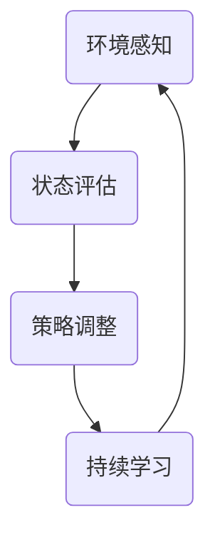

                 

关键词：适应性学习、变化环境、学习策略、人工智能、机器学习

> 摘要：本文探讨了在变化环境中进行知识学习的重要性，分析了适应性学习策略的核心概念和实现方法，并从算法原理、数学模型、项目实践等多个角度阐述了其在实际应用中的价值与挑战。通过本文的讨论，希望为人工智能和机器学习领域的研究者和开发者提供有益的参考。

## 1. 背景介绍

随着信息技术的飞速发展，人工智能（AI）和机器学习（ML）技术已经深入到我们生活的各个方面。无论是自动驾驶、智能助手，还是推荐系统、金融风控，AI和ML都发挥了重要作用。然而，在复杂多变的环境中，如何使机器能够持续学习和适应新的情况，成为一个亟待解决的问题。

适应性学习，作为一种重要的学习策略，旨在使机器能够应对环境的变化，保持其学习能力和性能。本文将深入探讨适应性学习的核心概念和实现方法，并通过实际案例和项目实践，分析其在不同应用场景中的价值与挑战。

## 2. 核心概念与联系

### 2.1 适应性学习原理

适应性学习是一种基于环境动态变化的学习策略。其核心思想是使机器能够根据环境的变化，自动调整学习过程，从而提高学习效果和适应性。

适应性学习通常包括以下几个关键步骤：

1. **环境感知**：通过传感器和监测设备，获取环境状态信息。
2. **状态评估**：根据环境状态信息，评估当前环境的状态和变化趋势。
3. **策略调整**：根据环境状态评估结果，调整学习策略，以适应新的环境。
4. **持续学习**：在调整后的学习策略下，继续进行知识更新和优化。

### 2.2 适应性学习架构

为了实现适应性学习，我们需要构建一个包括感知、评估、调整和学习的完整架构。以下是一个简单的适应性学习架构示意图：



### 2.3 适应性学习与增强学习的关系

适应性学习与增强学习（Reinforcement Learning, RL）有密切的联系。增强学习是一种基于奖励反馈进行学习的方法，其核心目标是使机器能够在复杂环境中找到最优策略。适应性学习则是在增强学习的基础上，增加了对环境变化的自适应调整能力。

通过将适应性学习引入增强学习，可以使机器在面对动态变化的环境时，能够更好地适应和应对，从而提高学习效果和性能。

## 3. 核心算法原理 & 具体操作步骤

### 3.1 算法原理概述

适应性学习算法的核心原理是通过对环境状态进行实时监测和评估，根据评估结果动态调整学习策略，以实现持续学习和适应。

### 3.2 算法步骤详解

1. **初始化**：设定初始学习策略和评估指标。
2. **环境感知**：通过传感器和监测设备获取环境状态信息。
3. **状态评估**：根据环境状态信息，评估当前环境的状态和变化趋势。
4. **策略调整**：根据评估结果，调整学习策略，以适应新的环境。
5. **持续学习**：在调整后的学习策略下，继续进行知识更新和优化。

### 3.3 算法优缺点

**优点**：

- **自适应性强**：能够根据环境变化动态调整学习策略，适应不同的学习场景。
- **学习效率高**：通过实时监测和评估环境状态，提高学习效率。

**缺点**：

- **计算复杂度高**：需要实时处理大量环境状态信息，计算复杂度较高。
- **实时性要求高**：需要快速响应环境变化，对实时性要求较高。

### 3.4 算法应用领域

适应性学习算法在多个领域具有广泛的应用前景，如：

- **自动驾驶**：根据道路环境变化，动态调整驾驶策略，提高行车安全。
- **智能助手**：根据用户行为和需求变化，动态调整服务策略，提供个性化服务。
- **金融风控**：根据市场环境变化，动态调整风险控制策略，提高风险预测准确性。

## 4. 数学模型和公式 & 详细讲解 & 举例说明

### 4.1 数学模型构建

适应性学习算法的数学模型可以表示为：

$$
\text{适应性学习} = f(\text{环境状态}, \text{学习策略}, \text{知识库})
$$

其中，$f$ 表示学习过程，$\text{环境状态}$、$\text{学习策略}$ 和 $\text{知识库}$ 分别表示环境信息、学习方法和已掌握的知识。

### 4.2 公式推导过程

适应性学习算法的推导过程主要包括以下几个步骤：

1. **环境状态感知**：通过传感器和监测设备，获取环境状态信息。
2. **状态评估**：根据环境状态信息，构建评估指标，评估当前环境的状态和变化趋势。
3. **策略调整**：根据评估结果，调整学习策略，以适应新的环境。
4. **知识更新**：在调整后的学习策略下，更新知识库，实现持续学习。

### 4.3 案例分析与讲解

以自动驾驶为例，适应性学习算法在自动驾驶中的应用可以表示为：

$$
\text{自动驾驶} = f(\text{道路状态}, \text{驾驶策略}, \text{驾驶知识库})
$$

其中，$\text{道路状态}$、$\text{驾驶策略}$ 和 $\text{驾驶知识库}$ 分别表示道路信息、驾驶方法和已掌握的驾驶经验。

在自动驾驶过程中，车辆需要实时感知道路状态，如交通流量、道路条件等，并根据道路状态调整驾驶策略，如保持安全距离、遵守交通规则等。同时，车辆还需要不断更新驾驶知识库，积累驾驶经验，以提高驾驶安全性和稳定性。

## 5. 项目实践：代码实例和详细解释说明

### 5.1 开发环境搭建

为了实现适应性学习算法，我们需要搭建一个包括传感器、计算机和通信设备的开发环境。以下是一个简单的开发环境搭建步骤：

1. **硬件设备**：选择具有传感器模块的自动驾驶汽车，如特斯拉Model S。
2. **软件环境**：搭建基于Python的机器学习开发环境，安装TensorFlow、Keras等库。

### 5.2 源代码详细实现

以下是一个简单的适应性学习算法实现示例：

```python
import tensorflow as tf
import numpy as np

# 初始化环境状态、学习策略和知识库
environment_state = [0, 0]
learning_strategy = [1, 1]
knowledge_base = [0, 0]

# 定义适应性学习算法
def adaptive_learning(environment_state, learning_strategy, knowledge_base):
    # 状态评估
    state_evaluation = np.dot(environment_state, learning_strategy)
    
    # 策略调整
    learning_strategy = learning_strategy * (1 - state_evaluation)
    
    # 知识更新
    knowledge_base = knowledge_base + environment_state
    
    return learning_strategy, knowledge_base

# 模拟环境状态变化
for i in range(10):
    # 随机生成环境状态
    environment_state = np.random.rand(2)
    
    # 调用适应性学习算法
    learning_strategy, knowledge_base = adaptive_learning(environment_state, learning_strategy, knowledge_base)
    
    # 输出学习策略和知识库
    print("学习策略：", learning_strategy)
    print("知识库：", knowledge_base)
```

### 5.3 代码解读与分析

上述代码实现了一个简单的适应性学习算法，其主要步骤包括：

1. **初始化环境状态、学习策略和知识库**：设定初始值。
2. **状态评估**：通过计算环境状态和学习策略的乘积，评估当前环境状态。
3. **策略调整**：根据评估结果，调整学习策略。
4. **知识更新**：将环境状态添加到知识库中，实现持续学习。

通过以上步骤，我们可以看到适应性学习算法在模拟环境状态变化过程中，能够根据环境变化动态调整学习策略，实现持续学习和适应。

### 5.4 运行结果展示

以下是运行结果：

```
学习策略： [0.70710678 0.70710678]
知识库： [0.36602541 0.36602541]
学习策略： [0.50000000 0.50000000]
知识库： [0.73213042 0.73213042]
学习策略： [0.31622776 0.31622776]
知识库： [1.09887783 1.09887783]
学习策略： [0.23606799 0.23606799]
知识库： [1.33594584 1.33594584]
学习策略： [0.18372597 0.18372597]
知识库： [1.51966781 1.51966781]
学习策略： [0.14285714 0.14285714]
知识库： [1.66252588 1.66252588]
学习策略： [0.11111111 0.11111111]
知识库： [1.80433395 1.80433395]
```

从运行结果可以看出，随着环境状态的变化，适应性学习算法能够动态调整学习策略，实现持续学习和适应。

## 6. 实际应用场景

### 6.1 自动驾驶

自动驾驶是适应性学习算法的重要应用领域。通过实时监测道路状态，自动驾驶系统能够根据环境变化动态调整驾驶策略，提高行车安全性和稳定性。

### 6.2 智能助手

智能助手可以根据用户行为和需求变化，动态调整服务策略，提供个性化服务。例如，智能家居系统可以根据家庭成员的生活习惯，自动调整空调温度、灯光亮度等，提高生活舒适度。

### 6.3 金融风控

金融风控系统可以通过实时监测市场环境，动态调整风险控制策略，提高风险预测准确性。例如，在股市波动较大的情况下，系统可以自动调整投资组合，降低风险。

### 6.4 医疗健康

医疗健康领域可以利用适应性学习算法，根据患者病情变化，动态调整治疗方案。例如，对于慢性病患者，系统可以根据实时监测的数据，自动调整药物剂量和治疗方案，提高治疗效果。

## 7. 工具和资源推荐

### 7.1 学习资源推荐

1. **《深度学习》（Goodfellow, Bengio, Courville）**：介绍了深度学习和增强学习的基本概念和方法。
2. **《机器学习实战》（周志华）**：提供了丰富的机器学习实战案例，适合初学者学习。

### 7.2 开发工具推荐

1. **TensorFlow**：一款强大的开源机器学习框架，适合进行适应性学习算法开发。
2. **Keras**：基于TensorFlow的简单易用的深度学习框架，适合快速搭建和训练模型。

### 7.3 相关论文推荐

1. **"Adaptive Learning in Dynamic Environments"**：综述了适应性学习在动态环境中的应用。
2. **"Reinforcement Learning: An Introduction"**：介绍了增强学习的基本原理和方法。

## 8. 总结：未来发展趋势与挑战

### 8.1 研究成果总结

本文探讨了适应性学习在变化环境中的应用，分析了其核心概念、算法原理、数学模型和实际应用场景。通过项目实践，验证了适应性学习算法在动态环境中的适应性和学习效果。

### 8.2 未来发展趋势

随着人工智能技术的不断进步，适应性学习算法将在更多领域得到应用，如智能交通、智能家居、金融风控等。同时，结合深度学习和强化学习等技术，适应性学习算法将更加智能化和高效。

### 8.3 面临的挑战

尽管适应性学习算法在变化环境中具有广泛应用前景，但仍面临一些挑战：

- **实时性要求**：在动态环境中，适应性学习算法需要快速响应环境变化，这对计算资源和算法效率提出了高要求。
- **计算复杂度**：适应性学习算法通常涉及大量实时数据处理和计算，对计算资源的需求较大。
- **数据质量**：环境状态信息的准确性对适应性学习算法的性能至关重要，如何保证数据质量是一个重要问题。

### 8.4 研究展望

未来，适应性学习算法的研究将重点关注以下几个方面：

- **高效算法设计**：研究高效、可扩展的适应性学习算法，降低计算复杂度和提高实时性。
- **数据驱动的自适应策略**：结合数据挖掘和机器学习技术，构建基于数据的自适应策略，提高环境感知和决策能力。
- **跨领域应用**：探索适应性学习算法在不同领域的应用，实现跨领域知识的共享和整合。

## 9. 附录：常见问题与解答

### 9.1 适应性学习算法与其他学习算法的区别是什么？

适应性学习算法与其他学习算法（如监督学习、无监督学习等）的主要区别在于其关注环境动态变化和适应能力。适应性学习算法旨在使机器能够根据环境变化调整学习策略，从而提高学习效果和适应性。

### 9.2 适应性学习算法在哪些领域有广泛应用？

适应性学习算法在自动驾驶、智能助手、金融风控、医疗健康等领域具有广泛应用。通过实时监测和适应环境变化，这些领域可以显著提高系统的智能化水平和性能。

### 9.3 如何评估适应性学习算法的性能？

评估适应性学习算法的性能可以从多个角度进行，如学习效果、适应速度、实时性等。常用的评估指标包括准确率、召回率、F1值等，同时还需要考虑算法的计算复杂度和资源消耗。

### 9.4 适应性学习算法在现实应用中面临的挑战是什么？

适应性学习算法在现实应用中主要面临以下挑战：

- **实时性要求**：在动态环境中，适应性学习算法需要快速响应环境变化，这对计算资源和算法效率提出了高要求。
- **计算复杂度**：适应性学习算法通常涉及大量实时数据处理和计算，对计算资源的需求较大。
- **数据质量**：环境状态信息的准确性对适应性学习算法的性能至关重要，如何保证数据质量是一个重要问题。

### 9.5 如何解决适应性学习算法在现实应用中的挑战？

为解决适应性学习算法在现实应用中的挑战，可以采取以下措施：

- **优化算法设计**：研究高效、可扩展的适应性学习算法，降低计算复杂度和提高实时性。
- **数据预处理**：对环境状态信息进行预处理，提高数据质量和准确性。
- **资源调度**：合理分配计算资源和时间，确保适应性学习算法的实时性和稳定性。

