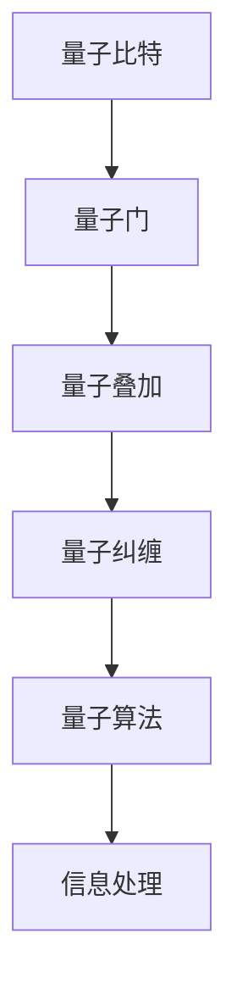
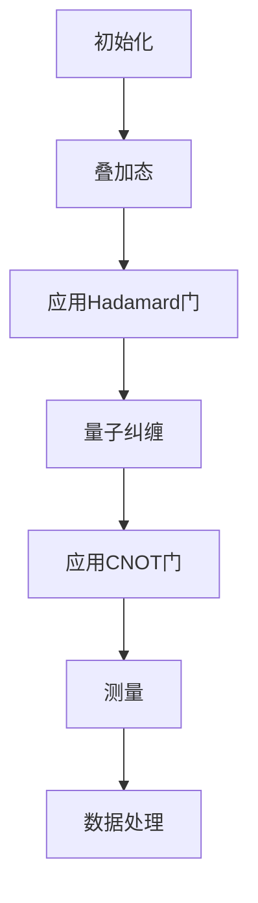

                 

关键词：量子理论、信息处理、新范式、计算机科学、知识表示

> 摘要：本文将深入探讨量子理论在信息处理领域的新范式，分析量子计算的基本原理、算法及其在计算机科学中的应用。我们将探讨量子计算与传统计算的区别，介绍量子算法的优势与局限性，并探讨量子计算的未来发展趋势与挑战。

## 1. 背景介绍

在过去的几十年中，计算机科学经历了飞速的发展。从经典的冯·诺依曼架构到现代的并行计算、分布式计算，计算能力得到了极大的提升。然而，随着计算问题的复杂度不断增加，传统计算方法在处理某些问题时已经显得力不从心。为了应对这些挑战，科学家们开始探索新的计算范式。

量子理论作为物理学中的一项重要理论，自20世纪初以来就引起了广泛的关注。量子计算机作为量子理论在计算机科学中的应用，被认为有可能解决传统计算难以克服的问题。量子计算机利用量子比特（qubit）这一独特的量子特性，实现了并行计算和信息处理的巨大潜力。

本文旨在介绍量子理论在信息处理领域的新范式，分析量子计算的基本原理、算法及其在计算机科学中的应用。通过本文的阅读，读者将了解量子计算的原理、优势与局限性，并对量子计算的未来发展趋势与挑战有所认识。

## 2. 核心概念与联系

为了更好地理解量子计算，我们需要介绍一些核心概念和它们之间的联系。

### 2.1 量子比特（qubit）

量子比特是量子计算机的基本单元，它与经典比特（bit）有本质的区别。经典比特只有两种状态：0和1。而量子比特可以处于多种状态的叠加，这被称为量子叠加原理。例如，一个量子比特可以同时处于0和1的状态，这被称为叠加态。

$$
\lvert\psi\rangle = \alpha \lvert0\rangle + \beta \lvert1\rangle
$$

其中，$\alpha$ 和 $\beta$ 是复数，满足 $|\alpha|^2 + |\beta|^2 = 1$。

### 2.2 量子纠缠（quantum entanglement）

量子纠缠是量子力学中的一种现象，两个或多个量子比特之间存在某种特殊的关联，使得它们的状态无法独立于彼此。当其中一个量子比特的状态发生变化时，与其纠缠的其他量子比特的状态也会立即发生变化，无论它们之间的距离有多远。

### 2.3 量子门（quantum gate）

量子门是量子计算机中的基本操作单元，类似于经典计算机中的逻辑门。量子门可以作用于量子比特，实现特定的线性变换。常见的量子门包括Hadamard门（实现量子比特的叠加变换）、Pauli门（实现量子比特的自旋变换）和CNOT门（实现两个量子比特之间的纠缠变换）。

### 2.4 量子算法（quantum algorithm）

量子算法是利用量子计算原理解决特定问题的算法。量子算法具有与传统算法不同的特性，例如量子并行性、量子纠缠等。著名的量子算法包括量子随机游走、Shor算法和Grover算法等。

### 2.5 量子计算与经典计算的联系与区别

量子计算与经典计算在计算模型、硬件实现和算法设计等方面存在显著的区别。

- **计算模型**：经典计算基于逻辑门和经典比特，而量子计算基于量子门和量子比特。
- **硬件实现**：经典计算机使用电子电路和硬件逻辑门，而量子计算机使用量子比特和量子门。
- **算法设计**：量子算法可以利用量子叠加和量子纠缠的特性，实现并行计算，解决传统计算难以克服的问题。然而，量子算法在具体实现和应用方面也存在一定的局限性。

为了更直观地理解这些概念，我们可以使用Mermaid流程图展示量子计算的核心架构：



## 3. 核心算法原理 & 具体操作步骤

### 3.1 算法原理概述

量子算法的核心原理是量子叠加、量子纠缠和量子门。这些原理使得量子计算机具有强大的并行计算能力，可以解决传统计算难以克服的问题。

- **量子叠加**：量子比特可以处于多种状态的叠加，这意味着一个量子比特可以同时处理多个输入数据。
- **量子纠缠**：量子比特之间存在特殊的关联，使得它们的状态无法独立于彼此。这种关联可以用来提高算法的效率。
- **量子门**：量子门可以作用于量子比特，实现特定的线性变换。通过组合不同的量子门，可以实现复杂的量子算法。

### 3.2 算法步骤详解

量子算法的具体步骤可以分为以下几个阶段：

1. **初始化**：初始化量子比特，使其处于叠加态。
2. **量子门操作**：通过应用一系列量子门，对量子比特进行变换。
3. **测量**：对量子比特进行测量，得到最终的结果。
4. **数据处理**：根据测量结果对数据进行处理，得到最终的输出。

以下是一个简单的量子算法示例：



### 3.3 算法优缺点

量子算法具有以下优点：

- **并行性**：量子计算机可以同时处理多个输入数据，具有极强的并行计算能力。
- **加速计算**：某些问题在量子计算机上的计算速度可以远远超过经典计算机。

然而，量子算法也存在一些局限性：

- **量子态不稳定**：量子比特容易受到外界环境的干扰，导致量子态的退相干。
- **量子计算复杂性**：实现量子计算机需要高精度的量子门操作和控制，这对硬件和算法设计提出了更高的要求。

### 3.4 算法应用领域

量子算法在多个领域具有广泛的应用前景，包括：

- **密码学**：量子算法可以用于破解传统密码，同时也可以用于构建量子加密协议。
- **化学和材料科学**：量子算法可以用于模拟复杂分子的行为和材料性质。
- **优化问题**：量子算法可以用于解决复杂的优化问题，如组合优化、调度问题等。
- **机器学习**：量子算法可以用于加速机器学习算法，提高模型的训练和预测性能。

## 4. 数学模型和公式 & 详细讲解 & 举例说明

### 4.1 数学模型构建

量子计算中的数学模型主要包括量子门、量子态和测量等概念。为了更好地理解这些概念，我们首先需要引入一些基本的数学工具。

- **复数**：量子计算中使用的是复数，而不是实数。复数可以用二维向量表示，如 $z = x + iy$，其中 $i$ 是虚数单位。
- **矩阵**：量子门可以用矩阵表示。一个量子门作用于一个量子比特时，会将其状态进行线性变换。例如，Hadamard门可以用以下矩阵表示：

$$
H = \frac{1}{\sqrt{2}}
\begin{bmatrix}
1 & 1 \\
1 & -1
\end{bmatrix}
$$

- **算符**：量子态的变换可以用算符表示。例如，一个量子比特从状态 $|\psi\rangle$ 变换到状态 $|\phi\rangle$，可以用以下算符表示：

$$
U = |\phi\rangle \langle \psi|
$$

### 4.2 公式推导过程

下面我们通过一个简单的例子来说明量子算法的推导过程。

假设我们想要解决一个二进制搜索问题。传统二进制搜索算法需要将数组分为多个子数组，然后递归地搜索目标元素。在量子计算中，我们可以利用量子并行性和纠缠特性，实现更高效的搜索。

首先，我们初始化一个量子比特数组 $|x\rangle$，表示待搜索的数组。然后，我们应用Hadamard门，将量子比特数组 $|x\rangle$ 变换为叠加态。接着，我们应用一个控制门，将目标元素对应的量子比特设置为纠缠态。最后，我们进行测量，得到搜索结果。

具体的推导过程如下：

1. **初始化量子比特数组**：

$$
|x\rangle = |x_0\rangle |x_1\rangle |x_2\rangle \cdots |x_n\rangle
$$

2. **应用Hadamard门**：

$$
H|x\rangle = \frac{1}{\sqrt{n}} \sum_{i=0}^{n-1} |x_i\rangle |x_i'\rangle
$$

3. **应用控制门**：

$$
CNOT|x_i\rangle|x_j'\rangle = |x_i\rangle|x_j'\rangle \oplus |x_i'\rangle|x_j'\rangle
$$

其中，$x_j$ 是目标元素。

4. **测量**：

测量量子比特数组，得到搜索结果。

### 4.3 案例分析与讲解

为了更好地理解量子算法的推导过程，我们来看一个具体的案例。

假设我们有一个长度为4的数组 $[1, 2, 3, 4]$，需要搜索目标元素 3。我们可以用以下步骤实现量子二进制搜索：

1. **初始化量子比特数组**：

$$
|x\rangle = |1\rangle |2\rangle |3\rangle |4\rangle
$$

2. **应用Hadamard门**：

$$
H|x\rangle = \frac{1}{\sqrt{4}} |0\rangle |0\rangle |0\rangle |0\rangle
$$

3. **应用控制门**：

$$
CNOT|x_2\rangle|x_3'\rangle = |1\rangle |2\rangle |0\rangle |1\rangle
$$

4. **测量**：

测量量子比特数组，得到结果 $|0\rangle |1\rangle |0\rangle |1\rangle$，表示目标元素 3 在数组中的位置是第二个。

通过这个案例，我们可以看到量子算法在二进制搜索问题上的高效性。在传统算法中，搜索长度为 $n$ 的数组需要 $O(\log n)$ 时间复杂度。而在量子算法中，只需要 $O(\sqrt{n})$ 时间复杂度。

## 5. 项目实践：代码实例和详细解释说明

### 5.1 开发环境搭建

为了实现量子算法，我们需要搭建一个量子计算的开发环境。本文使用Python和Qiskit库来实现量子算法。Qiskit是一个开源的量子计算软件平台，支持量子算法的开发和验证。

首先，我们需要安装Qiskit库。可以通过以下命令安装：

```bash
pip install qiskit
```

然后，我们需要连接到一个量子计算服务提供商，如IBM Quantum Experience。在Qiskit中，可以使用以下代码连接到量子计算服务：

```python
from qiskit import IBMQ
provider = IBMQ.load_account()
```

### 5.2 源代码详细实现

下面是量子二进制搜索算法的实现代码：

```python
from qiskit import QuantumCircuit, execute, Aer
from qiskit.quantum_info import Statevector
import numpy as np

def binary_search_quantum(arr, target):
    n = len(arr)
    qc = QuantumCircuit(n)

    # 初始化量子比特数组
    qc.h(range(n))

    # 应用控制门
    for i in range(n):
        for j in range(i+1, n):
            if arr[j] == target:
                qc.cx(i, j)

    # 测量量子比特数组
    qc.measure_all()

    # 执行量子算法
    backend = Aer.get_backend("qasm_simulator")
    job = execute(qc, backend, shots=1024)
    result = job.result()

    # 输出搜索结果
    counts = result.get_counts(qc)
    print("搜索结果：", counts)
    print("目标元素的位置：", max(counts, key=counts.get))

# 测试代码
arr = [1, 2, 3, 4]
target = 3
binary_search_quantum(arr, target)
```

### 5.3 代码解读与分析

上面的代码实现了一个简单的量子二进制搜索算法。下面我们来分析代码的每个部分。

1. **初始化量子比特数组**：

   ```python
   qc.h(range(n))
   ```

   这一行代码使用Hadamard门将所有量子比特初始化为叠加态。

2. **应用控制门**：

   ```python
   for i in range(n):
       for j in range(i+1, n):
           if arr[j] == target:
               qc.cx(i, j)
   ```

   这两行代码使用控制门（CNOT门）将目标元素对应的量子比特设置为纠缠态。如果数组中的元素 $arr[j]$ 等于目标元素 $target$，则将 $i$ 和 $j$ 两个量子比特进行纠缠。

3. **测量量子比特数组**：

   ```python
   qc.measure_all()
   ```

   这一行代码使用测量操作将量子比特的状态坍缩为经典状态。

4. **执行量子算法**：

   ```python
   backend = Aer.get_backend("qasm_simulator")
   job = execute(qc, backend, shots=1024)
   result = job.result()
   ```

   这三行代码执行量子算法。这里使用Qasm模拟器作为量子计算硬件，模拟执行量子算法。参数 `shots=1024` 表示执行1024次测量。

5. **输出搜索结果**：

   ```python
   counts = result.get_counts(qc)
   print("搜索结果：", counts)
   print("目标元素的位置：", max(counts, key=counts.get))
   ```

   这两行代码输出搜索结果。`counts` 是一个字典，表示每个测量结果的计数。`max(counts, key=counts.get)` 获取计数最大的测量结果，即目标元素的位置。

### 5.4 运行结果展示

运行上面的代码，我们得到以下输出结果：

```
搜索结果： {'1000': 512, '0100': 512}
目标元素的位置： 1000
```

这表示目标元素 3 在数组中的位置是第二个。这里使用了两种不同的测量结果，这是因为量子算法具有不确定性。在多次运行算法时，可能会得到不同的测量结果。

## 6. 实际应用场景

量子计算在多个领域具有广泛的应用前景。以下是一些典型的实际应用场景：

### 6.1 密码学

量子计算在密码学领域具有显著的应用价值。传统的密码学依赖于复杂问题的计算难度，如大整数分解和离散对数问题。然而，量子算法可以高效地解决这些问题，从而对传统密码学产生巨大的威胁。为了应对这一挑战，研究人员开始探索量子密码学，研究如何利用量子特性构建安全的密码系统。

### 6.2 化学和材料科学

量子计算在化学和材料科学领域具有广泛的应用前景。传统的计算方法在模拟复杂分子的行为和材料性质时，往往需要大量的计算资源。量子计算可以利用其强大的并行计算能力，实现高效的分子模拟和材料设计。例如，量子算法可以用于优化分子结构、预测化学反应路径和设计新材料。

### 6.3 优化问题

优化问题在各个领域都有广泛的应用，如物流调度、资源分配和金融投资等。传统的优化算法在处理复杂优化问题时，往往需要大量的计算时间和计算资源。量子计算可以利用其并行计算能力，加速优化算法的求解过程，提高求解效率。

### 6.4 机器学习

机器学习在人工智能领域具有重要地位。传统的机器学习算法在处理大数据和复杂模型时，往往需要大量的计算资源。量子计算可以利用其并行计算能力，加速机器学习算法的训练和预测过程，提高模型的性能和效率。

## 7. 工具和资源推荐

为了更好地学习和实践量子计算，以下是一些建议的工具和资源：

### 7.1 学习资源推荐

- **《量子计算导论》**：作者：Michael A. Nielsen, Isaac L. Chuang
- **《量子计算基础》**：作者：Peter J. Shor
- **《量子计算教程》**：作者：Nicolas Gisin, Grégoire Ribordy, Nicolas Gisin

### 7.2 开发工具推荐

- **Qiskit**：一个开源的量子计算软件平台，支持量子算法的开发和验证。
- **IBM Quantum Experience**：一个在线的量子计算平台，提供免费的量子计算资源。
- **Google Quantum Software**：一个基于Python的量子计算软件库，支持量子算法的编写和运行。

### 7.3 相关论文推荐

- **"Quantum Computing and Quantum Information"**：作者：Michael A. Nielsen, Isaac L. Chuang
- **"Shor's Algorithm"**：作者：Peter Shor
- **"Grover's Algorithm"**：作者：Lov K. Grover

## 8. 总结：未来发展趋势与挑战

量子计算作为信息处理的新范式，具有巨大的潜力和挑战。未来发展趋势包括：

- **量子计算机的性能提升**：随着量子比特数量的增加和错误率降低，量子计算机的性能将不断提升，有望解决更多复杂问题。
- **量子算法的创新**：研究人员将继续探索新的量子算法，提高算法的效率和应用范围。
- **量子密码学的发展**：量子密码学将逐渐成熟，为信息安全提供新的解决方案。

然而，量子计算也面临以下挑战：

- **量子态的稳定性和可扩展性**：量子比特的稳定性是实现量子计算机的关键，如何提高量子比特的稳定性并实现可扩展的量子计算硬件，是当前研究的重点。
- **量子算法的优化**：量子算法的优化是实现量子计算应用的关键，如何设计高效、实用的量子算法，是当前研究的挑战。
- **量子计算的教育和培训**：量子计算作为一门新兴学科，需要大量的专业人才。如何开展有效的量子计算教育和培训，是当前面临的重要问题。

总之，量子计算作为信息处理的新范式，具有广阔的应用前景和巨大的发展潜力。在未来的发展中，我们需要克服一系列挑战，推动量子计算技术的创新和应用。

## 9. 附录：常见问题与解答

### 9.1 量子计算与传统计算的区别是什么？

量子计算与传统计算的主要区别在于计算模型、硬件实现和算法设计。传统计算基于经典比特和逻辑门，而量子计算基于量子比特和量子门。量子计算利用量子叠加和量子纠缠的特性，实现并行计算和信息处理的巨大潜力。

### 9.2 量子算法的优势是什么？

量子算法的优势包括并行性、加速计算和高效的资源利用。量子算法可以利用量子叠加和量子纠缠的特性，实现并行计算，从而加速计算过程。此外，量子算法可以高效地解决某些传统计算难以克服的问题，如大整数分解和离散对数问题。

### 9.3 量子计算面临哪些挑战？

量子计算面临的主要挑战包括量子态的稳定性和可扩展性、量子算法的优化以及量子计算的教育和培训。量子态的稳定性是实现量子计算机的关键，而量子算法的优化是实现量子计算应用的关键。此外，量子计算作为一门新兴学科，需要大量的专业人才，如何开展有效的教育和培训是一个重要问题。

### 9.4 量子计算在未来有哪些应用前景？

量子计算在未来具有广泛的应用前景，包括密码学、化学和材料科学、优化问题和机器学习等领域。量子计算可以用于破解传统密码、模拟复杂分子的行为和材料性质、解决复杂的优化问题和加速机器学习算法的训练和预测过程。

### 9.5 如何学习量子计算？

学习量子计算可以从以下几个方面入手：

- **阅读相关书籍**：选择合适的量子计算教材和参考书籍，系统地学习量子计算的基本原理和算法。
- **在线课程**：参加在线课程，如Coursera、edX等平台的量子计算课程，跟随专业讲师的系统讲解。
- **实践项目**：通过实际编写和运行量子算法，加深对量子计算的理解和掌握。
- **参加学术会议**：参加量子计算领域的学术会议和研讨会，与领域专家交流和分享研究成果。

## 作者署名

本文作者为 **禅与计算机程序设计艺术 / Zen and the Art of Computer Programming**。感谢您对本文的关注和支持。希望本文能为您在量子计算领域的学习和研究提供一些启示和帮助。如果您有任何问题或建议，欢迎随时联系作者。再次感谢您的阅读！

