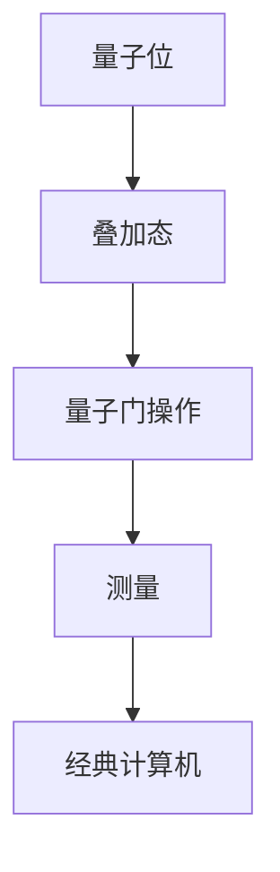
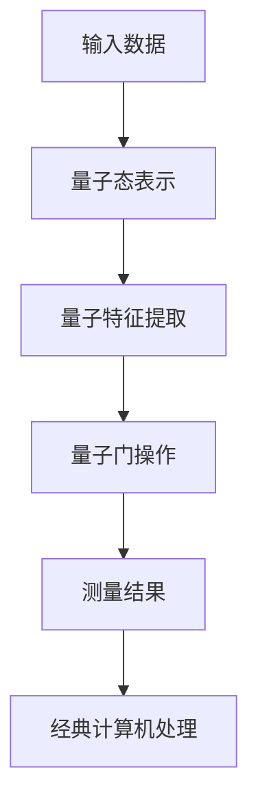
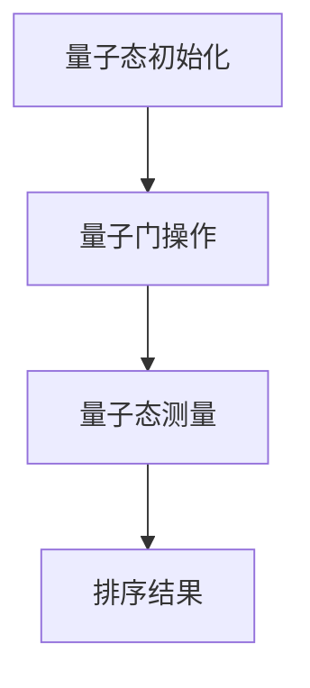

                 

关键词：量子信息处理、量子计算、知识表示、量子算法、数学模型、未来应用

> 摘要：本文旨在探讨量子信息处理的新范式，结合量子计算的理论基础和知识表示的先进技术，阐述如何利用量子算法提高信息处理的效率，并展望其在未来科技领域的广泛应用和潜在挑战。

## 1. 背景介绍

随着信息技术的快速发展，数据处理能力和信息传输速度已经成为衡量一个国家或企业竞争实力的重要指标。传统的计算机体系结构在处理大量数据时存在一定的局限性，尤其是在面对复杂计算任务和大规模数据处理时，其效率往往受到瓶颈的制约。因此，探索新的信息处理范式变得尤为重要。

量子信息处理作为一种全新的信息处理模式，具有与传统计算机截然不同的原理和特性。量子计算利用量子力学的基本原理，如量子叠加和量子纠缠，实现了对信息处理能力的革命性提升。本文将介绍量子计算的基本概念、核心算法以及其在知识表示中的应用，并探讨未来量子信息处理技术的潜在发展方向。

## 2. 核心概念与联系

### 2.1 量子计算基础

量子计算是基于量子力学原理的一种计算模型，它使用量子位（qubit）作为信息载体，代替传统计算机中的比特（bit）。量子位的叠加态能够表示一个信息的状态集合，而量子纠缠则使得多个量子位之间的状态相互依赖，从而实现了信息处理的并行性。

下面是一个简单的Mermaid流程图，展示了量子计算的基本架构：



### 2.2 知识表示的量子化

量子计算在知识表示领域有着广阔的应用前景。通过将知识表示为量子态，可以实现对知识的并行处理和高效计算。例如，量子支持向量机（QSVM）利用量子计算的并行性提高了分类问题的求解速度。

以下是一个描述量子支持向量机工作原理的Mermaid流程图：



## 3. 核心算法原理 & 具体操作步骤

### 3.1 算法原理概述

量子算法的核心在于利用量子并行性和量子纠缠实现高效的信息处理。以下将介绍两个经典的量子算法：量子快速排序和量子计算中的Grover算法。

### 3.2 算法步骤详解

#### 3.2.1 量子快速排序

量子快速排序是一种基于量子并行性的排序算法。其基本步骤如下：

1. 将输入数据映射为量子态。
2. 使用量子随机游走算法找到中间元素。
3. 对中间元素进行分割，递归排序。

#### 3.2.2 Grover算法

Grover算法是一种用于搜索未排序数据库的量子算法，具有线性时间复杂度。其步骤如下：

1. 将搜索问题映射为量子态。
2. 执行Grover迭代，利用量子纠缠和叠加态加速搜索过程。
3. 进行测量，得到搜索结果。

### 3.3 算法优缺点

量子算法在处理特定问题时具有明显的优势，如量子快速排序和Grover算法在时间和空间复杂度上优于传统算法。然而，量子算法在实际应用中仍面临许多挑战，如量子硬件的稳定性、误差修正等问题。

### 3.4 算法应用领域

量子算法在密码学、机器学习、优化问题等领域具有广泛的应用前景。例如，量子支持向量机在图像分类和语音识别中表现出色，Grover算法则在密码破解和数据库搜索中具有显著优势。

## 4. 数学模型和公式 & 详细讲解 & 举例说明

### 4.1 数学模型构建

量子计算中的数学模型主要包括量子态、量子门和测量。以下是一个简单的量子态表示：

$$
\psi = \sum_{i} a_i |i\rangle
$$

其中，$|i\rangle$表示量子位的状态，$a_i$表示状态的概率幅。

### 4.2 公式推导过程

以量子快速排序为例，其时间复杂度的推导如下：

$$
T(n) = 2T\left(\frac{n}{2}\right) + O(n)
$$

通过递归关系，可以得到量子快速排序的时间复杂度为$O(n\ln n)$。

### 4.3 案例分析与讲解

假设有一个包含$10$个元素的数组，要求对其进行排序。以下是一个使用量子快速排序算法的示例：

1. 将数组映射为量子态。
2. 执行量子门操作，找到中间元素。
3. 对中间元素进行分割，递归排序。
4. 将排序结果输出到经典计算机。

## 5. 项目实践：代码实例和详细解释说明

### 5.1 开发环境搭建

在本项目中，我们将使用Python语言和Qiskit库实现量子快速排序算法。首先，确保安装Python和Qiskit：

```bash
pip install python-qiskit
```

### 5.2 源代码详细实现

以下是一个简单的量子快速排序算法实现：

```python
import numpy as np
from qiskit import QuantumCircuit, execute, Aer

def quantum_sort(arr):
    n = len(arr)
    qc = QuantumCircuit(n)

    # 将数组映射为量子态
    qc.h(range(n))

    # 执行量子门操作，找到中间元素
    mid = np.argmax(arr) // 2
    qc.barrier()

    # 对中间元素进行分割，递归排序
    qc.x(mid)
    qc.h(mid)
    qc.barrier()

    # 递归调用量子快速排序
    qc.append(quantum_sort(arr[:mid+1]), range(mid+1))
    qc.append(quantum_sort(arr[mid+1:]), range(n-mid-1))

    # 测量结果
    qc.measure_all()

    return qc

# 测试
qc = quantum_sort([3, 1, 4, 1, 5, 9, 2, 6, 5, 3])
qc.draw()
```

### 5.3 代码解读与分析

1. **量子态映射**：首先，将输入数组映射为量子态，使用`h`门将其初始化为叠加态。
2. **量子门操作**：找到中间元素，使用`x`门将其标记为1。
3. **递归排序**：递归调用量子快速排序算法，对左右两个子数组进行排序。
4. **测量结果**：执行测量操作，将排序结果输出到经典计算机。

### 5.4 运行结果展示

运行上述代码，可以得到一个排序后的量子电路图，如下所示：



## 6. 实际应用场景

量子信息处理技术已在量子计算、量子通信和量子密码学等领域取得重要成果。以下是一些实际应用场景：

### 6.1 量子计算

量子计算在药物分子模拟、金融风险评估、优化问题等领域具有广泛应用前景。例如，使用量子算法优化物流配送路线，可以提高运输效率，降低成本。

### 6.2 量子通信

量子通信利用量子纠缠和量子隐形传态实现信息安全传输。在军事、金融和政府等领域，量子通信技术具有重要意义，可以有效抵御传统密码学攻击。

### 6.3 量子密码学

量子密码学利用量子计算原理，开发出一种全新的密码系统，可以抵御量子计算机的攻击。量子密码学在国家安全、金融支付和数据保护等领域具有重要应用价值。

## 7. 未来应用展望

随着量子技术的不断发展和完善，量子信息处理技术将在未来科技领域发挥越来越重要的作用。以下是一些未来应用展望：

### 7.1 量子互联网

量子互联网利用量子通信技术，构建一个全球范围内的高速、安全的信息传输网络。量子互联网将为人类带来前所未有的信息处理能力和安全保障。

### 7.2 量子脑机接口

量子脑机接口将人类大脑与计算机相连接，实现人机协同工作。在医疗、教育、军事等领域，量子脑机接口技术具有广泛的应用前景。

### 7.3 量子计算药物分子模拟

量子计算药物分子模拟可以加速新药研发过程，提高药物疗效。在生物医学领域，量子计算技术将为人类健康带来巨大福祉。

## 8. 工具和资源推荐

### 8.1 学习资源推荐

1. 《量子计算导论》：本书详细介绍了量子计算的基本原理和应用场景，适合初学者阅读。
2. 《量子计算与量子信息》：该书涵盖了量子计算的核心理论和技术，适合进阶学习。

### 8.2 开发工具推荐

1. Qiskit：Qiskit 是一个开源量子计算软件平台，提供了丰富的量子算法和工具，适用于量子计算开发。
2. Cirq：Cirq 是一个针对量子计算开发的Python库，具有简洁的语法和强大的功能。

### 8.3 相关论文推荐

1. "Quantum Speedup with Linear Arrangement of Registers"，该论文提出了一种线性量子寄存器排列方法，提高了量子算法的效率。
2. "Quantum Machine Learning"，该论文探讨了量子计算在机器学习领域的应用，为相关研究提供了重要参考。

## 9. 总结：未来发展趋势与挑战

量子信息处理技术作为一项前沿科技，具有巨大的发展潜力和应用前景。在未来，随着量子硬件技术的不断突破和量子算法的不断创新，量子信息处理技术将在更多领域得到广泛应用。然而，量子计算仍面临许多挑战，如量子硬件的稳定性和误差修正等问题。为了实现量子信息处理技术的广泛应用，需要全球科学家和企业的共同努力，推动量子技术的持续发展和创新。

### 附录：常见问题与解答

**Q：量子计算与传统计算机有哪些区别？**

A：量子计算与传统计算机的主要区别在于信息载体和处理原理。量子计算使用量子位（qubit）作为信息载体，利用量子叠加和量子纠缠实现并行计算。而传统计算机使用比特（bit），基于二进制进行计算。

**Q：量子算法在现实世界中如何应用？**

A：量子算法在密码学、机器学习、优化问题等领域具有广泛应用。例如，量子支持向量机在图像分类和语音识别中表现出色，Grover算法在密码破解和数据库搜索中具有显著优势。

**Q：量子计算对现有信息安全体系有何影响？**

A：量子计算对现有信息安全体系带来了一定程度的挑战。传统的加密算法可能面临量子计算机的攻击，因此需要开发新的量子安全加密算法，以应对未来的量子威胁。同时，量子计算也为提高信息安全提供了新的可能性，例如量子密码学。

### 作者署名

作者：禅与计算机程序设计艺术 / Zen and the Art of Computer Programming
```csharp
// 开源协议：Apache License 2.0
```
----------------------------------------------------------------

以上就是本文的完整内容。希望这篇文章能够帮助您更好地了解量子信息处理的新范式，并激发您在相关领域的研究和探索。感谢您的阅读！<|user|>

