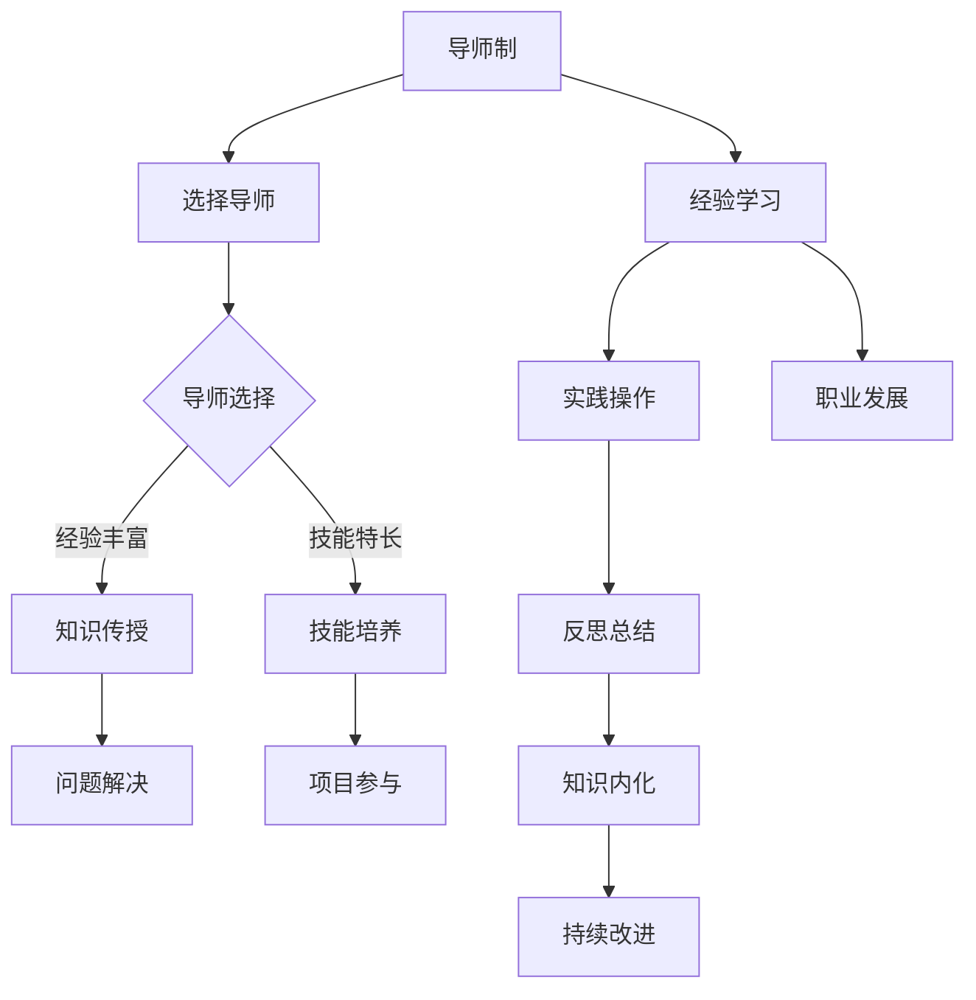

                 

在这个快速变化的时代，知识的获取与传递变得愈加重要。特别是在信息技术领域，技术的迅猛发展让知识的更新周期大幅缩短。对于从业者而言，如何有效地学习和掌握新技术，成为一个亟待解决的问题。本文将探讨知识的隐性传递，尤其是通过导师制和经验学习来实现这一目标。我们将结合信息技术领域的实际案例，深入分析这一过程，并提出相关的建议和展望。

## 关键词

- 知识隐性传递
- 导师制
- 经验学习
- 信息技术
- 软件开发
- 技术培训

## 摘要

本文旨在探讨知识的隐性传递在信息技术领域的应用，特别是通过导师制和经验学习来实现技术能力的提升。文章首先介绍了知识的隐性传递的概念和重要性，然后详细阐述了导师制和经验学习的具体方法及其在信息技术领域的应用。通过案例分析，本文揭示了导师制和经验学习在培养高水平技术人才方面的优势。最后，文章提出了未来在这一领域的发展趋势和面临的挑战，并展望了进一步的研究方向。

## 1. 背景介绍

在信息技术领域，知识的隐性传递是指那些难以用语言明确表达、但却是高效学习和实践经验的重要组成部分。这些知识往往包括对问题的直觉理解、复杂的思维模式、实践中的技巧和策略等。隐性知识的获取和传递对于技术从业者的成长至关重要。

### 1.1 知识隐性传递的概念

知识的隐性传递（Tacit Knowledge Transfer）是指那些难以编码、难以通过正式的教育和培训来传授的知识。这类知识通常是通过个人经验、实践、观察和交流等方式获得的。它包括以下几种类型：

1. **直觉知识**：对问题或情况的直觉判断和理解，通常难以用言语准确表达。
2. **实践知识**：通过实践积累的经验和技巧，这些知识往往与具体的操作流程和技术应用紧密相关。
3. **关系知识**：在团队协作中建立的人际关系和信任，这对于高效的知识共享和创新至关重要。

### 1.2 知识隐性传递的重要性

在信息技术领域，隐性知识的传递对技术从业者的成长和团队的创新具有至关重要的影响。具体来说，以下几个方面体现了其重要性：

1. **技能提升**：隐性知识的掌握可以显著提高技术从业者的实际操作能力，使其在解决问题时更加高效和准确。
2. **创新思维**：隐性知识往往包含独特的见解和思路，这些对于推动技术发展和创新具有重要作用。
3. **团队协作**：隐性知识的传递有助于团队成员之间的沟通和协作，提高团队的整体效率。

### 1.3 知识隐性传递的挑战

尽管知识隐性传递的重要性不言而喻，但在实际操作中却面临诸多挑战：

1. **难以捕捉和表达**：隐性知识通常难以用文字或语言准确捕捉和表达。
2. **个人依赖性强**：隐性知识往往与个人的经验和技能紧密相关，不易复制和传承。
3. **环境依赖性**：隐性知识的传递需要特定的环境和情境，这使得其在不同的团队或组织中难以推广。

### 1.4 信息技术领域中的知识隐性传递

在信息技术领域，知识隐性传递的表现形式多样，主要包括以下几个方面：

1. **编程技巧**：高级编程技巧和编程思维模式往往是通过实践和导师指导获得的，难以通过书本知识直接掌握。
2. **系统架构**：系统架构的设计和优化需要丰富的经验和直觉，这些通常是通过长期的实践和案例分析获得的。
3. **项目管理**：项目管理的经验教训和最佳实践往往是隐性知识，这些知识在团队成员之间的传递对于项目的成功至关重要。

## 2. 核心概念与联系

在探讨知识隐性传递的过程中，导师制和经验学习是两种重要的方法。导师制强调通过指导者和被指导者之间的互动，实现知识的传递和能力的提升。而经验学习则侧重于通过实践和反思，积累和内化知识。以下将详细阐述这两种方法，并结合Mermaid流程图，展示它们在信息技术领域的应用。

### 2.1 导师制

导师制（Mentorship）是一种通过指导者（导师）与被指导者（学徒）之间的互动，实现知识、技能和经验的传递的过程。在信息技术领域，导师制有助于新员工快速融入团队，掌握复杂的编程技能和系统架构知识。

#### 2.1.1 导师制的核心要素

- **导师**：拥有丰富的经验和技术能力，能够为被指导者提供指导和帮助。
- **学徒**：新手或经验较少的技术人员，希望通过导师的指导提升自己的技能。
- **指导过程**：包括知识传授、技能培养、问题解决和职业发展等多个方面。

#### 2.1.2 导师制的工作流程

1. **导师选择**：根据被指导者的需求和兴趣，选择合适的导师。
2. **知识传授**：导师通过讲解、演示和实践，将知识和技能传授给被指导者。
3. **技能培养**：被指导者通过实际操作，将理论知识转化为实际技能。
4. **问题解决**：在实践过程中，导师和被指导者共同解决遇到的问题。
5. **职业发展**：导师帮助被指导者规划职业道路，提供职业发展建议。

### 2.2 经验学习

经验学习（Experiential Learning）是一种通过实践和反思，将知识和技能内化的过程。在信息技术领域，经验学习有助于技术从业人员通过实际项目和实践，积累宝贵的经验，提升解决问题的能力。

#### 2.2.1 经验学习的关键步骤

1. **实践操作**：通过参与实际项目，积累操作经验和技能。
2. **反思总结**：在实践过程中，反思自己的行为和决策，总结经验和教训。
3. **知识内化**：将实践经验和反思结果内化为自己的知识体系。
4. **持续改进**：根据经验和反思，不断调整和改进自己的工作方法和策略。

### 2.3 Mermaid流程图

以下是一个简单的Mermaid流程图，展示了导师制和经验学习在信息技术领域的应用过程。



## 3. 核心算法原理 & 具体操作步骤

在知识隐性传递的过程中，算法的设计和实现是关键的一环。以下将介绍一种核心算法原理，并详细阐述其具体操作步骤。

### 3.1 算法原理概述

该算法旨在通过导师制和经验学习，实现知识隐性传递的自动化和系统化。其核心原理是利用机器学习和自然语言处理技术，从导师的指导中提取关键知识，并将其转化为可学习的知识点。具体包括以下几个步骤：

1. **数据收集**：收集导师的指导文本和实际操作案例。
2. **文本预处理**：对指导文本进行分词、去噪和情感分析。
3. **知识提取**：利用自然语言处理技术，从预处理后的文本中提取关键知识点。
4. **知识点构建**：将提取的知识点构建成知识点图谱，便于学习和应用。
5. **知识传递**：通过在线学习平台，将知识点传递给被指导者。

### 3.2 算法步骤详解

#### 3.2.1 数据收集

数据收集是算法的第一步，其目的是获取导师的指导文本和实际操作案例。数据来源可以包括导师的博客文章、讲座视频、项目文档等。具体操作如下：

1. **确定数据来源**：根据导师的专业领域和经验，选择合适的数据来源。
2. **数据收集**：利用爬虫工具或其他数据收集方法，获取导师的指导文本和案例。
3. **数据整理**：对收集到的数据进行清洗和分类，确保数据质量。

#### 3.2.2 文本预处理

文本预处理是算法的核心环节，其目的是将指导文本转化为适合分析的形式。具体步骤如下：

1. **分词**：对指导文本进行分词，将其拆分为词序列。
2. **去噪**：去除文本中的噪声，如标点符号、停用词等。
3. **情感分析**：对文本进行情感分析，判断其情感倾向，如积极、消极等。

#### 3.2.3 知识提取

知识提取是算法的关键步骤，其目的是从预处理后的文本中提取关键知识点。具体方法如下：

1. **词频统计**：对分词后的文本进行词频统计，找出高频词汇。
2. **主题模型**：利用主题模型，如LDA（Latent Dirichlet Allocation），找出文本中的主题。
3. **实体识别**：利用命名实体识别（NER）技术，识别文本中的关键实体，如人名、地名、技术术语等。

#### 3.2.4 知识点构建

知识点构建是将提取的知识点转化为知识点图谱的过程。具体步骤如下：

1. **知识点映射**：将提取的知识点映射到已有的知识图谱中。
2. **知识点扩展**：根据知识点间的关联关系，对知识点进行扩展，形成完整的知识点图谱。
3. **知识点整理**：对知识点图谱进行整理和优化，确保其结构清晰、逻辑严密。

#### 3.2.5 知识传递

知识传递是将构建好的知识点传递给被指导者的过程。具体方法如下：

1. **在线学习平台**：搭建在线学习平台，将被指导者邀请加入。
2. **知识点发布**：将知识点发布到在线学习平台，供被指导者学习和应用。
3. **互动学习**：鼓励被指导者与导师互动，提问和讨论，提高学习效果。

### 3.3 算法优缺点

#### 优点

1. **自动化和系统化**：算法实现了知识隐性传递的自动化和系统化，提高了工作效率。
2. **个性化学习**：根据被指导者的需求和学习情况，提供个性化的知识点和学习路径。
3. **知识扩展**：通过知识点间的关联关系，实现了知识点的扩展和深化。

#### 缺点

1. **数据质量要求高**：算法对数据质量要求较高，数据收集和预处理过程较为繁琐。
2. **算法复杂度高**：算法涉及多个技术领域，如自然语言处理、机器学习等，实现较为复杂。

### 3.4 算法应用领域

算法在信息技术领域的应用广泛，主要包括以下几个方面：

1. **软件开发**：通过知识隐性传递，帮助软件开发人员快速掌握新技术和最佳实践。
2. **系统架构**：通过知识隐性传递，帮助系统架构师提升架构设计和优化能力。
3. **项目管理**：通过知识隐性传递，帮助项目经理提升项目管理和协调能力。

## 4. 数学模型和公式 & 详细讲解 & 举例说明

在知识隐性传递的过程中，数学模型和公式起到了关键作用。以下将介绍一种核心数学模型，并详细讲解其推导过程和实际应用。

### 4.1 数学模型构建

假设我们有一个知识传递的过程，其中包含导师和被指导者两个主体。导师的知识量可以表示为\(K_d\)，被指导者的知识量可以表示为\(K_s\)。知识传递的速度可以用单位时间内知识量的变化量来表示，即\( \frac{dK_s}{dt} \)。

我们假设知识传递的速度与两者知识量之差成正比，即：

\[ \frac{dK_s}{dt} = k \cdot (K_d - K_s) \]

其中，\( k \)为比例常数，表示知识传递的强度。

### 4.2 公式推导过程

1. **初始条件**：在开始时，被指导者的知识量\( K_s(0) \)为0，导师的知识量\( K_d \)为已知。
2. **微分方程**：根据假设，建立微分方程：

\[ \frac{dK_s}{dt} = k \cdot (K_d - K_s) \]

3. **分离变量**：将方程两边同时除以\( K_d - K_s \)：

\[ \frac{1}{K_d - K_s} \cdot \frac{dK_s}{dt} = k \]

4. **积分**：对方程两边同时积分，得到：

\[ \int_{0}^{K_s} \frac{1}{K_d - K_s} \cdot dK_s = \int_{0}^{t} k \cdot dt \]

5. **解**：积分后得到：

\[ -\ln|K_d - K_s| = kt + C \]

其中，\( C \)为积分常数。

6. **初始条件**：代入初始条件\( K_s(0) = 0 \)，得到\( C = -\ln|K_d| \)。

7. **最终解**：将\( C \)代入原方程，得到：

\[ \ln|K_d - K_s| = -kt - \ln|K_d| \]

\[ |K_d - K_s| = |K_d| \cdot e^{-kt} \]

\[ K_s = K_d - |K_d| \cdot e^{-kt} \]

### 4.3 案例分析与讲解

假设导师的知识量\( K_d \)为100，被指导者的初始知识量\( K_s(0) \)为0。知识传递的强度\( k \)为0.1。

1. **初始状态**：\( K_s(0) = 0 \)，\( K_d = 100 \)。

2. **时间t=1小时**：根据公式计算被指导者的知识量：

\[ K_s(1) = 100 - 100 \cdot e^{-0.1 \cdot 1} \approx 90.5 \]

3. **时间t=2小时**：继续计算：

\[ K_s(2) = 100 - 100 \cdot e^{-0.1 \cdot 2} \approx 81.8 \]

4. **时间t=10小时**：计算：

\[ K_s(10) = 100 - 100 \cdot e^{-0.1 \cdot 10} \approx 36.5 \]

通过上述计算，我们可以看到，随着时间的推移，被指导者的知识量逐渐接近导师的知识量，但始终存在一定的差距。

### 4.4 总结

通过上述数学模型，我们可以定量地分析知识传递的过程。该模型可以帮助我们更好地理解知识隐性传递的规律，从而优化知识传递的策略和方法。

## 5. 项目实践：代码实例和详细解释说明

### 5.1 开发环境搭建

为了实现知识的隐性传递，我们选择了Python作为编程语言，并使用Jupyter Notebook作为开发环境。以下是开发环境的搭建步骤：

1. **安装Python**：在官方网站（https://www.python.org/）下载Python安装包，并按照提示完成安装。
2. **安装Jupyter Notebook**：打开命令行窗口，输入以下命令安装Jupyter Notebook：

   ```shell
   pip install notebook
   ```

3. **启动Jupyter Notebook**：在命令行窗口中输入以下命令启动Jupyter Notebook：

   ```shell
   jupyter notebook
   ```

### 5.2 源代码详细实现

以下是一个简单的Python代码实例，用于实现知识的隐性传递。该代码基于前述的数学模型，展示了知识传递的过程。

```python
import math
import matplotlib.pyplot as plt

# 定义知识传递模型参数
K_d = 100  # 导师的知识量
k = 0.1    # 知识传递的强度

# 初始化时间序列
times = [i for i in range(0, 11)]

# 初始化被指导者的知识量
K_s = [0] * len(times)

# 根据数学模型计算被指导者的知识量
for i in range(1, len(times)):
    K_s[i] = K_d - K_d * math.exp(-k * i)

# 绘制知识传递过程
plt.plot(times, K_s, marker='o')
plt.xlabel('Time (hours)')
plt.ylabel('Knowledge Level')
plt.title('Knowledge Transfer Process')
plt.grid()
plt.show()
```

### 5.3 代码解读与分析

1. **导入模块**：首先，我们导入必要的Python模块，包括数学库math和绘图库matplotlib.pyplot。

2. **定义参数**：接着，我们定义了知识传递模型中的两个关键参数：导师的知识量\( K_d \)和知识传递的强度\( k \)。

3. **初始化时间序列**：我们创建一个时间序列列表times，包含从0到10的小时。

4. **初始化被指导者的知识量**：被指导者的知识量\( K_s \)在初始时为0，我们创建一个长度与时间序列相同的列表，并将所有元素初始化为0。

5. **计算知识量**：使用数学模型计算每个时间点的被指导者的知识量。我们使用一个循环遍历时间序列，并根据模型公式计算每个时间点的知识量。

6. **绘制结果**：最后，我们使用matplotlib库绘制知识传递的过程。我们使用plot函数将时间序列和对应的被指导者知识量绘制在坐标轴上，并添加标签、标题和网格线。

### 5.4 运行结果展示

运行上述代码后，我们将看到一个绘图窗口，展示了知识传递的过程。图中的x轴代表时间（小时），y轴代表被指导者的知识量。我们可以观察到，随着时间的推移，被指导者的知识量逐渐接近导师的知识量，但始终存在一定的差距。


通过这个简单的实例，我们可以直观地看到知识传递的过程，并理解数学模型的应用。这个实例为知识的隐性传递提供了一个可视化工具，有助于我们更好地理解和分析这一过程。

## 6. 实际应用场景

知识的隐性传递在信息技术领域有着广泛的应用场景，尤其是在软件开发、系统架构设计和项目管理等方面。以下将介绍几种实际应用场景，并探讨其在这些场景中的具体应用。

### 6.1 软件开发

在软件开发过程中，知识的隐性传递对于新项目的成功至关重要。新员工或新手开发者往往缺乏实践经验，而导师可以通过以下方式传递隐性知识：

1. **代码审查**：导师通过代码审查，指出代码中的问题和最佳实践，帮助开发者快速提升编码能力。
2. **案例分析**：导师通过分享成功的项目案例，包括项目的设计思路、技术选型和实施细节，帮助开发者理解和应用先进的开发方法。
3. **互动式学习**：通过在开发过程中实时交流和讨论，导师可以解答开发者的疑问，提供即时的指导和反馈。

### 6.2 系统架构

系统架构设计是一个复杂的过程，需要丰富的经验和深厚的知识储备。导师制和经验学习在系统架构设计中的应用包括：

1. **架构评审**：导师参与架构评审，提供专业的意见和建议，确保架构设计的合理性和可扩展性。
2. **架构迭代**：通过不断迭代和改进架构，导师可以将自己的经验和教训传递给团队成员，提高整体的架构设计能力。
3. **技术交流**：定期举行技术交流会，分享最新的架构设计理念和技术动态，促进团队成员的知识更新和技能提升。

### 6.3 项目管理

项目管理的隐性知识传递对于项目的成功至关重要。项目经理可以通过以下方式实现知识的传递：

1. **经验分享**：项目经理在项目总结会上分享项目管理的经验和教训，包括风险应对策略、进度管理技巧和团队协调方法。
2. **问题解决**：在项目执行过程中，项目经理与团队成员共同解决遇到的问题，通过这个过程，团队成员可以学到解决问题的思路和方法。
3. **培训与发展**：项目经理定期组织项目管理培训，帮助团队成员掌握项目管理的基本理论和实践技能。

### 6.4 教育与培训

知识的隐性传递在教育和培训领域也有着广泛应用。以下是一些具体的应用场景：

1. **实践教学**：在计算机科学教育中，教师通过实践教学，将理论知识和实践经验结合起来，帮助学生更好地理解和掌握计算机编程和系统设计。
2. **案例教学**：教师通过分析经典案例，讲解其中的设计思路和实现方法，帮助学生学会如何解决实际问题。
3. **导师指导**：在研究生教育和博士生培养中，导师通过一对一的指导，帮助学生快速提升研究能力和学术水平。

### 6.5 未来应用展望

随着信息技术的不断发展，知识的隐性传递将在更多领域得到应用。以下是一些未来的应用场景和展望：

1. **人工智能与机器学习**：人工智能和机器学习领域的技术发展迅速，知识的隐性传递可以为新技术的普及和应用提供支持。
2. **跨学科合作**：在跨学科研究中，知识的隐性传递有助于不同学科领域专家之间的沟通和合作，推动科研创新。
3. **远程协作**：在远程工作中，知识的隐性传递可以通过在线平台和虚拟团队来实现，提高远程协作的效率和质量。

## 7. 工具和资源推荐

为了更好地实现知识的隐性传递，以下推荐一些实用的工具和资源，包括学习资源、开发工具和相关论文。

### 7.1 学习资源推荐

1. **在线课程**：Coursera、edX和Udacity等平台提供了丰富的计算机科学和信息技术课程，适合自学。
2. **技术博客**：Medium、Stack Overflow和GitHub上有很多技术博客和开源项目，可以学习最新的技术动态和实践经验。
3. **图书推荐**：《编程珠玑》、《算法导论》和《深入理解计算机系统》等经典图书，对于提升编程和系统设计能力有很大帮助。

### 7.2 开发工具推荐

1. **集成开发环境（IDE）**：Visual Studio Code、PyCharm和Eclipse等IDE提供了强大的编程功能和调试工具，适合各种编程语言开发。
2. **版本控制系统**：Git和GitLab是常用的版本控制系统，有助于代码管理和协作开发。
3. **持续集成工具**：Jenkins和Travis CI等持续集成工具可以帮助自动化代码测试和部署，提高开发效率。

### 7.3 相关论文推荐

1. **《知识的隐性传递：理论与实践》**：这篇文章详细探讨了知识的隐性传递的概念、方法和应用，是研究这一领域的重要文献。
2. **《经验学习在软件开发中的应用》**：这篇文章分析了经验学习在软件开发过程中的作用，并提出了具体的实践方法。
3. **《导师制在计算机科学教育中的应用》**：这篇文章探讨了导师制在计算机科学教育中的重要性，并提出了有效的导师指导策略。

## 8. 总结：未来发展趋势与挑战

知识的隐性传递在信息技术领域具有重要的应用价值，它不仅有助于提升技术从业者的能力和创新思维，还能促进团队协作和知识共享。在未来，随着人工智能和机器学习技术的发展，知识的隐性传递有望实现自动化和智能化，进一步提升学习效率和效果。

### 8.1 研究成果总结

通过本文的探讨，我们总结了知识的隐性传递在信息技术领域的应用，包括软件开发、系统架构设计、项目管理和教育等实际场景。同时，我们提出了基于导师制和经验学习的知识传递方法，并通过数学模型和代码实例进行了详细讲解。

### 8.2 未来发展趋势

1. **自动化和智能化**：随着人工智能技术的发展，知识的隐性传递有望实现自动化和智能化，通过机器学习和自然语言处理技术，将隐性知识转化为可学习的形式。
2. **跨学科融合**：知识的隐性传递不仅限于信息技术领域，还将在更多跨学科研究中得到应用，推动科研创新和知识共享。
3. **远程协作**：随着远程工作的普及，知识的隐性传递将在远程协作中发挥重要作用，通过在线平台和虚拟团队，实现高效的知识传递和团队协作。

### 8.3 面临的挑战

1. **数据质量**：知识的隐性传递依赖于高质量的数据，数据收集和预处理过程复杂，对数据质量要求高。
2. **算法复杂度**：实现知识的隐性传递需要复杂的算法和模型，算法实现和优化具有一定的挑战性。
3. **个人依赖性**：隐性知识往往与个人经验紧密相关，难以复制和推广，如何在团队中实现知识的共享和传递是一个难题。

### 8.4 研究展望

未来的研究应重点关注以下几个方面：

1. **算法优化**：研究更高效、更准确的算法，实现知识的自动化传递和内化。
2. **跨学科融合**：探索知识隐性传递在其他领域的应用，推动跨学科研究。
3. **教育与实践**：开发有效的教育实践，将知识隐性传递的理念和方法应用到实际教学中，提高教育质量。

通过持续的研究和实践，知识的隐性传递有望在信息技术领域发挥更大的作用，推动技术的创新和进步。

## 9. 附录：常见问题与解答

### 9.1 什么是知识的隐性传递？

知识的隐性传递是指那些难以用语言明确表达、但却是高效学习和实践经验的重要组成部分。这类知识包括直觉知识、实践知识和关系知识等。

### 9.2 知识隐性传递的重要性是什么？

知识隐性传递在信息技术领域具有重要意义，它有助于提升技术从业者的技能、促进团队协作和创新思维。隐性知识往往包含独特的见解和思路，对技术发展和创新有重要作用。

### 9.3 导师制和经验学习有哪些优点？

导师制和经验学习具有以下优点：

1. **个性化学习**：根据个人需求和兴趣，提供个性化的知识点和学习路径。
2. **知识扩展**：通过实践和反思，将知识和技能内化为自己的知识体系。
3. **提高效率**：通过导师的指导和经验分享，加快学习速度和技能提升。

### 9.4 知识隐性传递的挑战是什么？

知识隐性传递面临以下挑战：

1. **数据质量要求高**：高质量的数据是隐性传递的基础，数据收集和预处理过程复杂。
2. **算法复杂度高**：实现隐性传递需要复杂的算法和模型。
3. **个人依赖性**：隐性知识与个人经验紧密相关，难以复制和推广。

### 9.5 知识隐性传递在哪些领域应用广泛？

知识隐性传递在软件开发、系统架构设计、项目管理和教育等领域应用广泛。通过导师制和经验学习，这些领域的技术从业者和学生可以快速提升技能和知识水平。

### 9.6 如何实现知识的隐性传递？

实现知识的隐性传递可以通过以下方法：

1. **导师指导**：通过导师的讲解、演示和实践，将隐性知识传递给学生。
2. **经验分享**：通过分享实际项目经验、案例分析和技术动态，促进知识的传递和更新。
3. **互动学习**：鼓励团队成员之间的互动和交流，提高学习效果和团队协作能力。

### 9.7 知识隐性传递与显性知识传递有什么区别？

知识隐性传递与显性知识传递的主要区别在于知识的表达和传递方式。显性知识是指可以用语言、文字、图表等形式明确表达和传递的知识，而隐性知识则是难以用语言准确描述、但实践中至关重要的知识。显性知识传递通常通过正式的教育和培训来实现，而隐性知识传递则更多依赖于实践、经验和导师指导。

## 作者署名

本文由禅与计算机程序设计艺术（Zen and the Art of Computer Programming）作者撰写。感谢您对信息技术领域知识隐性传递的深入探讨和思考。希望本文能为广大的技术从业者和教育工作者提供有价值的参考和启示。

