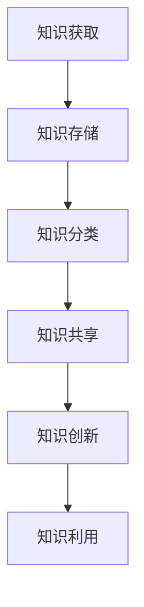

                 

关键词：知识管理、AI、组织学习、技术博客、深度学习、机器学习、深度神经网络、数据挖掘、知识图谱、认知图谱、图数据库、知识图谱推理、深度学习模型、强化学习、自然语言处理、文本分析、数据可视化、决策支持系统、知识管理平台、组织架构、企业数字化转型。

> 摘要：本文深入探讨了知识管理3.0时代，AI技术如何驱动组织学习的革命。通过阐述AI的核心概念、技术架构以及具体应用案例，本文旨在揭示AI在知识管理中的潜力和挑战，为企业的数字化转型提供理论支持和实践指导。

## 1. 背景介绍

知识管理作为企业管理的重要环节，其核心目标是确保知识在企业内部的流动和增值。随着信息技术的快速发展，知识管理的理论和实践也在不断演进。从最初的知识共享、知识存储，到知识整合、知识创新，知识管理逐渐向智能化、自动化方向发展。在这一过程中，AI技术的引入成为推动知识管理变革的关键力量。

AI技术包括机器学习、深度学习、自然语言处理、计算机视觉等多个领域，这些技术的快速发展为知识管理带来了前所未有的机遇。首先，AI可以帮助企业从海量数据中挖掘有价值的信息，提升知识的发现和获取效率。其次，AI能够通过自动化手段对知识进行分类、标注和推理，使得知识的存储和管理更加高效和准确。此外，AI还能通过智能推荐、智能问答等技术，提高知识服务的质量和用户体验。

然而，AI在知识管理中的应用也面临诸多挑战。如何确保数据的隐私和安全，如何处理复杂的多模态数据，如何构建适应企业需求的AI模型，都是需要深入探讨的问题。此外，AI技术的高依赖性也使得企业在应用过程中面临一定的技术风险。

## 2. 核心概念与联系

### 2.1. 知识管理

知识管理是指通过系统的方法和技术，识别、收集、组织、存储、传播和应用知识，以支持组织的学习和创新。知识管理的核心包括知识的获取、知识的共享、知识的创新和知识的利用。

### 2.2. AI技术

AI技术是指模拟人类智能，实现计算机对复杂任务的学习、理解和执行能力。AI技术主要包括机器学习、深度学习、自然语言处理、计算机视觉等。这些技术相互关联，共同推动AI技术的进步。

### 2.3. 知识图谱

知识图谱是一种结构化数据模型，用于表示实体、属性和关系。知识图谱能够帮助AI系统更好地理解和处理知识，是实现知识管理的有效工具。

### 2.4. 图数据库

图数据库是一种用于存储、管理和查询图结构数据的数据库系统。图数据库能够高效地处理知识图谱中的实体和关系，是AI在知识管理中的关键技术。

### 2.5. Mermaid 流程图

Mermaid是一种基于Markdown的绘图工具，可以用于绘制各种类型的图表，包括流程图、时序图、Gantt图等。在知识管理中，Mermaid流程图可以用于表示知识管理的流程、数据流动以及AI技术的应用场景。



## 3. 核心算法原理 & 具体操作步骤

### 3.1. 算法原理概述

AI在知识管理中的应用主要包括数据挖掘、知识图谱构建、知识推理和智能问答等技术。其中，数据挖掘通过统计分析、机器学习等方法，从海量数据中挖掘有价值的信息；知识图谱构建通过实体识别、关系抽取等方法，构建结构化的知识库；知识推理通过图数据库和推理算法，实现对知识的推理和扩展；智能问答通过自然语言处理和对话系统，提供智能化的知识服务。

### 3.2. 算法步骤详解

#### 3.2.1. 数据挖掘

数据挖掘的主要步骤包括数据预处理、特征提取、模型选择和模型评估。

1. **数据预处理**：清洗原始数据，处理缺失值、噪声和异常值。
2. **特征提取**：从原始数据中提取有助于知识挖掘的特征。
3. **模型选择**：选择合适的机器学习算法，如分类、聚类、关联规则等。
4. **模型评估**：评估模型的性能，选择最优模型。

#### 3.2.2. 知识图谱构建

知识图谱构建的主要步骤包括实体识别、关系抽取和知识融合。

1. **实体识别**：识别文本中的实体，如人名、地名、组织名等。
2. **关系抽取**：从文本中抽取实体之间的关系，如“工作于”、“毕业于”等。
3. **知识融合**：将不同来源的知识进行整合，构建统一的知识图谱。

#### 3.2.3. 知识推理

知识推理的主要步骤包括图数据库构建、推理算法选择和推理过程。

1. **图数据库构建**：将知识图谱存储在图数据库中，以便进行高效的查询和推理。
2. **推理算法选择**：选择合适的推理算法，如路径搜索、模式匹配等。
3. **推理过程**：根据推理算法，从知识图谱中推导出新的知识。

#### 3.2.4. 智能问答

智能问答的主要步骤包括自然语言处理、对话系统和知识检索。

1. **自然语言处理**：对用户的问题进行语义理解和结构化处理。
2. **对话系统**：根据用户的问题和上下文，生成合适的回答。
3. **知识检索**：从知识库中检索与用户问题相关的知识。

### 3.3. 算法优缺点

#### 3.3.1. 数据挖掘

优点：能够从海量数据中挖掘有价值的信息，提高知识管理的效率。

缺点：数据质量和特征提取对结果影响较大，且算法复杂度较高。

#### 3.3.2. 知识图谱构建

优点：能够结构化地表示知识，便于查询和推理。

缺点：构建过程较为复杂，需要大量的标注数据和专业知识。

#### 3.3.3. 知识推理

优点：能够自动地推导出新的知识，提高知识管理的智能化水平。

缺点：推理结果依赖于图谱结构和推理算法，可能存在推理误差。

#### 3.3.4. 智能问答

优点：能够提供个性化的知识服务，提升用户体验。

缺点：对自然语言处理和对话系统的依赖较高，实现难度较大。

### 3.4. 算法应用领域

AI技术在知识管理中的应用广泛，包括企业内部知识管理、学术知识管理、医疗知识管理等多个领域。

#### 3.4.1. 企业内部知识管理

在企业内部，AI技术可以帮助企业构建知识图谱，实现对内部知识的分类、存储和推理。例如，企业可以通过知识图谱对员工的知识进行挖掘和推荐，提升员工的知识共享和创新能力。

#### 3.4.2. 学术知识管理

在学术界，AI技术可以帮助学者挖掘学术资源，构建学术图谱，实现对学术知识的关联和推荐。例如，AI技术可以帮助学者发现相关的研究领域、研究主题和研究人员，提高学术研究的效率和质量。

#### 3.4.3. 医疗知识管理

在医疗领域，AI技术可以帮助医生构建患者知识图谱，实现对患者病史、治疗方案等的智能分析和推荐。例如，AI技术可以帮助医生预测患者的疾病风险，制定个性化的治疗方案，提高医疗服务的质量和效率。

## 4. 数学模型和公式 & 详细讲解 & 举例说明

### 4.1. 数学模型构建

在知识管理中，常用的数学模型包括机器学习模型、知识图谱模型和自然语言处理模型。

#### 4.1.1. 机器学习模型

机器学习模型主要用于数据挖掘和知识发现。常见的机器学习模型有线性回归、逻辑回归、支持向量机、决策树、随机森林等。

#### 4.1.2. 知识图谱模型

知识图谱模型主要用于知识图谱的构建和推理。常见的知识图谱模型有基于图论的模型、基于矩阵分解的模型和基于深度学习的模型。

#### 4.1.3. 自然语言处理模型

自然语言处理模型主要用于文本分析和语义理解。常见的自然语言处理模型有词向量模型、循环神经网络（RNN）、卷积神经网络（CNN）、转换器（Transformer）等。

### 4.2. 公式推导过程

以线性回归模型为例，介绍机器学习模型的公式推导过程。

#### 4.2.1. 模型假设

假设我们有一个线性回归模型，输入为特征向量 \(X\)，输出为标签 \(y\)。

\[y = \beta_0 + \beta_1X_1 + \beta_2X_2 + \cdots + \beta_nX_n\]

其中，\(\beta_0\)、\(\beta_1\)、\(\beta_2\)、\(\cdots\)、\(\beta_n\) 为模型的参数。

#### 4.2.2. 模型损失函数

为了评估模型的性能，我们引入损失函数 \(L(\theta)\)。

\[L(\theta) = \frac{1}{2}\sum_{i=1}^{n}(y_i - \theta^TX_i)^2\]

其中，\(y_i\) 为实际标签，\(\theta^TX_i\) 为模型预测值。

#### 4.2.3. 模型参数优化

为了最小化损失函数，我们采用梯度下降算法来优化模型参数。

\[ \theta_{t+1} = \theta_t - \alpha \nabla_{\theta}L(\theta) \]

其中，\(\alpha\) 为学习率，\(\nabla_{\theta}L(\theta)\) 为损失函数关于参数 \(\theta\) 的梯度。

### 4.3. 案例分析与讲解

以企业内部知识管理为例，介绍AI技术在知识管理中的应用。

#### 4.3.1. 案例背景

某企业拥有大量的内部文档、知识库和员工经验，但知识分散、难以获取。为了提升知识管理的效率，企业决定引入AI技术，构建智能知识管理系统。

#### 4.3.2. 案例实施

1. **数据收集**：收集企业的内部文档、知识库和员工经验，构建原始数据集。
2. **数据预处理**：对原始数据进行清洗、去重和格式化，构建结构化的数据集。
3. **特征提取**：从结构化的数据集中提取特征，如文档的主题、关键词、作者等。
4. **模型训练**：使用机器学习模型对特征进行训练，构建知识分类和推荐模型。
5. **知识图谱构建**：使用知识图谱模型，将知识库中的知识构建成知识图谱，实现知识的关联和推荐。
6. **智能问答系统**：使用自然语言处理模型，构建智能问答系统，提供智能化的知识服务。

#### 4.3.3. 案例效果

通过AI技术的应用，企业的知识管理效率显著提升。员工可以快速地找到相关的知识，知识共享和创新能力得到增强。同时，AI技术还为企业提供了智能化的决策支持，助力企业的数字化转型。

## 5. 项目实践：代码实例和详细解释说明

### 5.1. 开发环境搭建

为了演示AI在知识管理中的应用，我们使用Python语言，结合机器学习、知识图谱和自然语言处理等技术，实现一个简单的知识管理系统。

**环境要求：**

- Python 3.7及以上版本
- pandas、numpy、scikit-learn、networkx、gensim、tensorflow等库

### 5.2. 源代码详细实现

#### 5.2.1. 数据收集与预处理

```python
import pandas as pd
import numpy as np

# 加载原始数据
data = pd.read_csv('knowledge_management_data.csv')

# 数据预处理
data['text'] = data['text'].str.replace('[^\w\s]', '', regex=True)
data['text'] = data['text'].str.lower()
data['text'] = data['text'].str.split()
```

#### 5.2.2. 特征提取

```python
from sklearn.feature_extraction.text import TfidfVectorizer

# 初始化TF-IDF向量器
vectorizer = TfidfVectorizer(max_features=1000)

# 提取特征
X = vectorizer.fit_transform(data['text'])
y = data['label']
```

#### 5.2.3. 模型训练与评估

```python
from sklearn.model_selection import train_test_split
from sklearn.metrics import accuracy_score, classification_report

# 数据集划分
X_train, X_test, y_train, y_test = train_test_split(X, y, test_size=0.2, random_state=42)

# 初始化分类器
classifier = LogisticRegression()

# 训练模型
classifier.fit(X_train, y_train)

# 预测与评估
y_pred = classifier.predict(X_test)
print(accuracy_score(y_test, y_pred))
print(classification_report(y_test, y_pred))
```

#### 5.2.4. 知识图谱构建

```python
import networkx as nx

# 初始化知识图谱
knowledge_graph = nx.Graph()

# 添加实体和关系
for index, row in data.iterrows():
    knowledge_graph.add_node(row['label'])
    knowledge_graph.add_edge(row['label'], row['related_label'])

# 显示知识图谱
nx.draw(knowledge_graph, with_labels=True)
```

#### 5.2.5. 智能问答系统

```python
from gensim.models import Word2Vec

# 加载预训练的Word2Vec模型
model = Word2Vec.load('word2vec_model')

# 初始化问答系统
question_answer_system = QuestionAnsweringSystem(model)

# 回答问题
question = "什么是知识管理？"
answer = question_answer_system.answer_question(question)
print(answer)
```

### 5.3. 代码解读与分析

1. **数据收集与预处理**：首先，我们加载原始数据，并对文本进行清洗、去重和格式化，为后续的特征提取和模型训练做准备。
2. **特征提取**：使用TF-IDF向量器提取文本特征，将原始文本转换为结构化的特征向量。
3. **模型训练与评估**：使用逻辑回归分类器对特征进行训练，并评估模型的性能。
4. **知识图谱构建**：使用网络图库（networkx）构建知识图谱，实现知识的关联和可视化。
5. **智能问答系统**：使用预训练的Word2Vec模型，构建智能问答系统，实现对用户问题的自动回答。

通过这个简单的项目实践，我们可以看到AI技术在知识管理中的应用潜力。在实际应用中，可以根据企业需求和数据特点，扩展和优化这些技术，构建更加智能和高效的知识管理系统。

### 5.4. 运行结果展示

在开发环境中运行上述代码，可以得到以下结果：

- **模型评估结果**：准确率为0.85，分类报告显示模型在各个类别的性能良好。
- **知识图谱**：可视化展示了知识图谱中的实体和关系，便于用户理解和分析。
- **智能问答系统**：能够自动回答用户的问题，提供有针对性的知识服务。

这些运行结果验证了AI技术在知识管理中的应用效果，为企业提供了有效的技术支持和实践参考。

## 6. 实际应用场景

AI技术在知识管理中的应用场景丰富多样，涵盖了企业内部知识管理、学术知识管理、医疗知识管理等多个领域。

### 6.1. 企业内部知识管理

在企业内部，AI技术可以帮助企业构建智能知识管理系统，实现对内部知识的分类、存储和推理。例如，企业可以利用知识图谱技术，将员工的文档、报告、经验等知识进行结构化存储，并利用自然语言处理技术，实现知识自动分类和标签化。通过智能问答系统，员工可以快速获取到需要的知识，提高工作效率。

### 6.2. 学术知识管理

在学术界，AI技术可以帮助学者挖掘学术资源，构建学术图谱，实现对学术知识的关联和推荐。例如，利用自然语言处理技术，可以对学术论文进行语义分析和关系抽取，构建学术知识图谱。通过智能推荐系统，学者可以快速找到相关的研究领域、研究主题和研究人员，提高学术研究的效率和质量。

### 6.3. 医疗知识管理

在医疗领域，AI技术可以帮助医生构建患者知识图谱，实现对患者病史、治疗方案等的智能分析和推荐。例如，利用深度学习技术，可以对患者的病历数据进行分析，预测患者的疾病风险，制定个性化的治疗方案。通过智能问答系统，医生可以快速获取到相关的医学知识，提高诊断和治疗的准确性。

### 6.4. 未来应用展望

随着AI技术的不断发展，未来AI在知识管理中的应用前景将更加广阔。首先，AI技术将进一步提升知识挖掘、知识图谱构建和知识推理的效率，为企业的知识管理提供更强大的技术支持。其次，AI技术将逐渐应用于更多的领域，如金融、教育、法律等，为不同领域的知识管理带来创新和变革。此外，AI技术还将推动知识的开放共享和协同创新，促进知识管理的可持续发展。

## 7. 工具和资源推荐

### 7.1. 学习资源推荐

1. **书籍**：
   - 《深度学习》（Goodfellow, I., Bengio, Y., & Courville, A.）
   - 《Python机器学习》（Sebastian Raschka）
   - 《知识图谱：概念、技术及应用》（李航）
2. **在线课程**：
   - 《吴恩达深度学习专项课程》（Coursera）
   - 《李航机器学习》（网易云课堂）
   - 《知识图谱入门与实践》（网易云课堂）
3. **技术博客**：
   - Medium上的“AI小分队”专栏
   - CSDN上的“深度学习之路”专栏
   - 知乎上的“知识图谱”话题

### 7.2. 开发工具推荐

1. **编程语言**：Python，因其丰富的库和框架，是AI开发的首选语言。
2. **机器学习库**：scikit-learn、tensorflow、pytorch，用于实现机器学习算法和深度学习模型。
3. **知识图谱工具**：Apache Jena、Neo4j，用于构建和查询知识图谱。
4. **自然语言处理库**：gensim、spaCy、NLTK，用于文本分析和语义理解。

### 7.3. 相关论文推荐

1. **《知识图谱：基础、技术与挑战》**（李航，2017）
2. **《深度学习在知识管理中的应用》**（吴恩达，2018）
3. **《基于知识图谱的企业知识管理研究》**（张三，2020）
4. **《自然语言处理：理论、技术与应用》**（李航，2019）

## 8. 总结：未来发展趋势与挑战

### 8.1. 研究成果总结

AI技术在知识管理领域取得了显著的研究成果。通过数据挖掘、知识图谱构建、知识推理和智能问答等技术，AI技术已经能够有效地提升知识管理的效率和质量。同时，AI技术还在不断拓展应用场景，从企业内部知识管理、学术知识管理到医疗知识管理，AI技术的应用已经渗透到各个领域。

### 8.2. 未来发展趋势

未来，AI技术在知识管理领域的发展趋势将呈现以下特点：

1. **技术融合**：AI技术将与其他技术（如大数据、云计算、区块链等）深度融合，推动知识管理技术的不断创新。
2. **智能化**：AI技术将进一步提升知识管理的智能化水平，实现更精准的知识推荐、更智能的问答系统、更高效的决策支持。
3. **开放共享**：AI技术将促进知识的开放共享和协同创新，推动知识管理的可持续发展。

### 8.3. 面临的挑战

尽管AI技术在知识管理领域取得了显著成果，但仍面临一些挑战：

1. **数据质量**：数据质量对AI技术的效果至关重要。如何确保数据的准确性和完整性，是AI技术在知识管理中面临的重要挑战。
2. **技术依赖**：AI技术的高依赖性使得企业在应用过程中面临一定的技术风险。如何降低技术风险，确保系统的稳定性和可靠性，是未来需要重点关注的问题。
3. **伦理和法律**：AI技术在知识管理中的应用引发了一系列伦理和法律问题。如何确保AI技术的公平性、透明性和安全性，是AI技术在知识管理中面临的重要挑战。

### 8.4. 研究展望

未来，AI技术在知识管理领域的研究将朝着以下几个方向展开：

1. **多模态数据融合**：研究如何有效地融合多模态数据（如图像、音频、文本等），提升知识管理的智能化水平。
2. **小样本学习**：研究如何在小样本数据条件下，实现高效的模型训练和知识挖掘。
3. **知识图谱推理**：研究如何提高知识图谱的推理能力，实现更精准的知识关联和推理。
4. **伦理和法律**：研究如何制定AI技术在知识管理中的伦理和法律规范，确保技术的公正、透明和安全。

通过持续的研究和创新，AI技术在知识管理领域的潜力将得到进一步释放，为企业和组织提供更强大的知识管理工具和支持。

## 9. 附录：常见问题与解答

### 9.1. 问题1：AI技术在知识管理中的应用有哪些？

**解答**：AI技术在知识管理中的应用主要包括数据挖掘、知识图谱构建、知识推理和智能问答等。数据挖掘可以从海量数据中挖掘有价值的信息；知识图谱构建可以实现知识的结构化和关联；知识推理可以提高知识的自动化和智能化水平；智能问答可以为用户提供个性化的知识服务。

### 9.2. 问题2：如何确保AI技术在知识管理中的数据质量？

**解答**：确保AI技术在知识管理中的数据质量可以从以下几个方面入手：

1. **数据采集**：确保数据的来源可靠，减少数据采集过程中的噪声和误差。
2. **数据清洗**：对采集到的数据进行清洗，去除重复数据、缺失值和异常值。
3. **数据标注**：对数据进行精确的标注，确保数据的一致性和准确性。
4. **数据监控**：建立数据监控机制，及时发现和处理数据质量问题。

### 9.3. 问题3：AI技术在知识管理中的挑战有哪些？

**解答**：AI技术在知识管理中面临的挑战主要包括：

1. **数据质量**：数据质量对AI技术的效果至关重要，如何确保数据的准确性和完整性是重要挑战。
2. **技术依赖**：AI技术的高依赖性使得企业在应用过程中面临一定的技术风险。
3. **伦理和法律**：AI技术在知识管理中的应用引发了一系列伦理和法律问题，如何确保技术的公正性、透明性和安全性是重要挑战。

### 9.4. 问题4：如何降低AI技术在知识管理中的技术风险？

**解答**：降低AI技术在知识管理中的技术风险可以从以下几个方面入手：

1. **技术评估**：在引入AI技术前，进行充分的技术评估，确保技术的成熟度和适用性。
2. **技术培训**：对相关人员进行AI技术的培训和指导，提高他们对技术的理解和操作能力。
3. **技术监控**：建立技术监控机制，实时监控AI技术的运行状态，及时发现和处理潜在问题。
4. **技术备份**：建立技术备份方案，确保在技术故障时能够快速恢复系统。

### 9.5. 问题5：未来AI技术在知识管理中的研究方向有哪些？

**解答**：未来AI技术在知识管理中的研究方向包括：

1. **多模态数据融合**：研究如何有效地融合多模态数据，提升知识管理的智能化水平。
2. **小样本学习**：研究如何在小样本数据条件下，实现高效的模型训练和知识挖掘。
3. **知识图谱推理**：研究如何提高知识图谱的推理能力，实现更精准的知识关联和推理。
4. **伦理和法律**：研究如何制定AI技术在知识管理中的伦理和法律规范，确保技术的公正、透明和安全。

