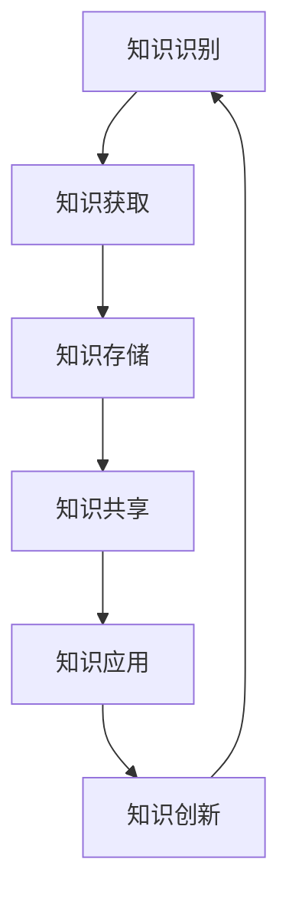

                 

知识管理是企业中一个至关重要的环节，它关系到企业的创新能力、竞争力以及可持续发展。本文旨在深入探讨知识管理在企业中的实践，通过详细的案例分析、理论阐述和实践建议，为企业和组织提供实用的知识管理策略和方法。

## 关键词

- 知识管理
- 企业创新
- 竞争力
- 持续发展
- 案例分析

## 摘要

本文首先介绍了知识管理的基本概念和重要性，然后通过分析知识管理的核心概念与联系，探讨了知识管理中的核心算法原理和具体操作步骤。接着，本文详细讲解了数学模型和公式，并结合实际项目实践了代码实例。最后，本文分析了知识管理在实际应用场景中的效果，并对未来应用进行了展望，同时也推荐了相关的学习资源和开发工具。通过本文的阅读，读者将能够全面了解知识管理在企业中的实践，并掌握有效的知识管理方法。

## 1. 背景介绍

知识管理（Knowledge Management，简称KM）是指通过收集、组织、存储、共享和应用知识，以促进知识创新和利用的过程。在当今信息爆炸和知识快速更新的时代，知识管理显得尤为重要。企业通过有效的知识管理，可以提高创新能力，增强竞争力，实现可持续发展。

知识管理的起源可以追溯到20世纪80年代，随着信息技术的发展，知识管理逐渐成为企业管理的重要领域。知识管理的目标不仅包括知识的获取和共享，还包括知识的创新和应用。知识管理的关键要素包括知识识别、知识获取、知识存储、知识共享、知识应用和知识创新。

知识管理对企业的重要性体现在以下几个方面：

1. **提升创新能力**：知识管理帮助企业将分散的知识和经验系统化，促进知识的创新和利用。
2. **增强竞争力**：知识管理使企业能够快速响应市场变化，提高决策效率，从而增强市场竞争力。
3. **实现可持续发展**：知识管理有助于企业建立长期的知识积累和创新能力，实现可持续发展。

本文将围绕知识管理在企业中的实践，探讨知识管理的基本概念、核心算法、数学模型、项目实践、实际应用场景以及未来展望。希望通过本文的阐述，能够为企业和组织提供有价值的知识管理实践指导。

## 2. 核心概念与联系

### 2.1 知识管理的基本概念

知识管理包括以下几个核心概念：

- **知识识别**：识别企业内外部的知识源，明确知识的重要性。
- **知识获取**：通过各种途径获取所需的知识，包括内部知识和外部知识。
- **知识存储**：将获取到的知识进行系统化的存储和管理，便于后续的检索和应用。
- **知识共享**：促进知识的传播和共享，使知识能够在组织内部得到广泛的应用。
- **知识应用**：将知识应用于企业的日常运营和决策过程中，实现知识的增值。
- **知识创新**：在知识共享和应用的基础上，通过跨部门、跨领域的知识整合和创新，形成新的知识。

### 2.2 知识管理中的核心概念与联系

为了更好地理解知识管理的运作机制，我们可以借助 Mermaid 流程图来展示知识管理中的核心概念与联系。



在上图中，A表示知识识别，B表示知识获取，C表示知识存储，D表示知识共享，E表示知识应用，F表示知识创新。这些概念之间相互关联，形成了一个闭环的知识管理过程。

### 2.3 知识管理中的核心算法原理

在知识管理中，核心算法原理主要包括知识获取、知识共享和知识应用等方面。以下是对这些核心算法原理的简要概述：

#### 2.3.1 知识获取算法

知识获取算法主要包括内部知识和外部知识的获取方法。内部知识获取主要通过知识库、经验交流和培训等方式实现；外部知识获取则通过市场调研、竞争分析、合作交流等方式进行。

#### 2.3.2 知识共享算法

知识共享算法旨在提高知识在组织内的传播和共享效率。常用的知识共享算法包括知识地图、协同编辑和知识论坛等。知识地图可以帮助员工快速找到所需知识；协同编辑可以实现多人实时协作；知识论坛则为知识交流和分享提供了平台。

#### 2.3.3 知识应用算法

知识应用算法主要用于将知识转化为实际效益。通过知识地图、知识图谱和知识库等工具，企业可以将知识应用于产品设计、市场营销、客户服务等领域，提高运营效率和市场竞争力。

### 2.4 知识管理在实际中的应用

知识管理在实际中的应用非常广泛，以下是一些典型的应用场景：

- **研发部门**：通过知识管理，研发部门可以快速获取相关领域的研究成果，提高研发效率。
- **市场营销**：通过知识管理，市场营销部门可以了解市场动态，制定更有针对性的营销策略。
- **客户服务**：通过知识管理，客户服务部门可以快速解决客户问题，提升客户满意度。
- **企业管理**：通过知识管理，企业高层可以更好地掌握企业运营情况，做出更科学的决策。

总之，知识管理不仅是一项技术，更是一种管理理念。通过有效的知识管理，企业可以充分发挥知识的价值，提升核心竞争力，实现可持续发展。

## 3. 核心算法原理 & 具体操作步骤

### 3.1 算法原理概述

知识管理中的核心算法主要包括知识获取、知识共享和知识应用三个方面。这些算法旨在帮助企业有效地识别、获取、存储、共享和应用知识，以促进知识的创新和利用。

#### 3.1.1 知识获取算法

知识获取算法主要包括内部知识和外部知识的获取。内部知识获取主要通过企业内部的知识库、经验交流和培训等方式实现；外部知识获取则通过市场调研、竞争分析、合作交流等方式进行。

#### 3.1.2 知识共享算法

知识共享算法旨在提高知识在组织内的传播和共享效率。常用的知识共享算法包括知识地图、协同编辑和知识论坛等。知识地图可以帮助员工快速找到所需知识；协同编辑可以实现多人实时协作；知识论坛则为知识交流和分享提供了平台。

#### 3.1.3 知识应用算法

知识应用算法主要用于将知识转化为实际效益。通过知识地图、知识图谱和知识库等工具，企业可以将知识应用于产品设计、市场营销、客户服务等领域，提高运营效率和市场竞争力。

### 3.2 算法步骤详解

#### 3.2.1 知识获取算法步骤

1. **知识识别**：识别企业内部和外部的重要知识源。
2. **知识获取**：通过内部和外部途径获取所需知识。
3. **知识存储**：将获取到的知识进行系统化存储，便于后续的检索和应用。

#### 3.2.2 知识共享算法步骤

1. **知识地图构建**：构建知识地图，帮助员工快速找到所需知识。
2. **协同编辑**：建立协同编辑平台，实现多人实时协作。
3. **知识论坛**：设立知识论坛，促进知识交流和分享。

#### 3.2.3 知识应用算法步骤

1. **知识地图应用**：将知识地图应用于产品设计和市场营销等环节，提高运营效率。
2. **知识图谱**：建立知识图谱，为企业决策提供支持。
3. **知识库**：利用知识库，为业务流程和客户服务提供知识支持。

### 3.3 算法优缺点

#### 3.3.1 知识获取算法优缺点

- **优点**：能够帮助企业快速获取内部和外部知识，提高创新能力和竞争力。
- **缺点**：知识获取过程可能存在信息过载，导致知识利用效率降低。

#### 3.3.2 知识共享算法优缺点

- **优点**：提高知识在组织内的传播和共享效率，促进知识创新和应用。
- **缺点**：知识共享可能面临知识保护问题，导致部分知识无法有效共享。

#### 3.3.3 知识应用算法优缺点

- **优点**：将知识转化为实际效益，提高企业运营效率和竞争力。
- **缺点**：知识应用可能面临知识匹配问题，导致知识无法有效应用。

### 3.4 算法应用领域

知识管理算法在多个领域具有广泛的应用：

- **研发部门**：通过知识获取和共享算法，提高研发效率。
- **市场营销**：通过知识获取和应用算法，制定更有效的营销策略。
- **客户服务**：通过知识共享和应用算法，提升客户服务水平。
- **企业管理**：通过知识管理算法，为企业管理层提供决策支持。

总之，知识管理算法在企业运营和管理中发挥着重要作用。通过有效的知识管理，企业可以充分发挥知识的价值，提高创新能力、竞争力和可持续发展能力。

## 4. 数学模型和公式 & 详细讲解 & 举例说明

### 4.1 数学模型构建

在知识管理中，数学模型和公式用于描述知识的获取、共享和应用过程。以下是几个关键的数学模型和公式：

#### 4.1.1 知识获取模型

知识获取模型主要描述企业如何从内部和外部获取知识。一个简单的知识获取模型可以表示为：

$$
K = f(K_{内}, K_{外}, R)
$$

其中，$K$ 表示总知识量，$K_{内}$ 表示内部知识量，$K_{外}$ 表示外部知识量，$R$ 表示知识获取效率。

#### 4.1.2 知识共享模型

知识共享模型主要描述知识在企业内部如何传播和共享。一个简单的知识共享模型可以表示为：

$$
S = f(K, C, T)
$$

其中，$S$ 表示共享效率，$K$ 表示总知识量，$C$ 表示协作成本，$T$ 表示传播时间。

#### 4.1.3 知识应用模型

知识应用模型主要描述知识如何转化为实际效益。一个简单的知识应用模型可以表示为：

$$
B = f(K, E, M)
$$

其中，$B$ 表示效益，$K$ 表示总知识量，$E$ 表示应用效率，$M$ 表示市场需求。

### 4.2 公式推导过程

#### 4.2.1 知识获取模型推导

知识获取模型中的公式推导过程如下：

1. 内部知识量 $K_{内}$ 主要由企业内部的经验、知识和技能组成，可以表示为：

$$
K_{内} = E_{内} \cdot P_{内}
$$

其中，$E_{内}$ 表示企业内部的经验，$P_{内}$ 表示企业内部的知识和技能水平。

2. 外部知识量 $K_{外}$ 主要由企业外部的市场调研、合作交流和竞争分析等途径获取，可以表示为：

$$
K_{外} = E_{外} \cdot P_{外}
$$

其中，$E_{外}$ 表示企业外部的经验，$P_{外}$ 表示企业外部知识和技能水平。

3. 知识获取效率 $R$ 表示知识获取的速度和效果，可以表示为：

$$
R = \frac{K_{内} + K_{外}}{T}
$$

其中，$T$ 表示知识获取的时间。

4. 总知识量 $K$ 可以表示为：

$$
K = K_{内} + K_{外} + R
$$

因此，知识获取模型可以表示为：

$$
K = E_{内} \cdot P_{内} + E_{外} \cdot P_{外} + \frac{E_{内} \cdot P_{内} + E_{外} \cdot P_{外}}{T}
$$

#### 4.2.2 知识共享模型推导

知识共享模型中的公式推导过程如下：

1. 共享效率 $S$ 表示知识在组织内传播的速度和效果，可以表示为：

$$
S = \frac{K}{C \cdot T}
$$

其中，$C$ 表示协作成本，$T$ 表示传播时间。

2. 知识总量 $K$ 可以通过知识获取模型得到。

3. 共享效率 $S$ 可以表示为：

$$
S = \frac{E_{内} \cdot P_{内} + E_{外} \cdot P_{外} + \frac{E_{内} \cdot P_{内} + E_{外} \cdot P_{外}}{T}}{C \cdot T}
$$

4. 简化后得到：

$$
S = \frac{E_{内} \cdot P_{内} + E_{外} \cdot P_{外}}{C \cdot T^2}
$$

#### 4.2.3 知识应用模型推导

知识应用模型中的公式推导过程如下：

1. 效益 $B$ 表示知识转化为实际效益的结果，可以表示为：

$$
B = K \cdot E
$$

其中，$E$ 表示知识应用效率。

2. 知识总量 $K$ 可以通过知识获取模型得到。

3. 效益 $B$ 可以表示为：

$$
B = (E_{内} \cdot P_{内} + E_{外} \cdot P_{外} + \frac{E_{内} \cdot P_{内} + E_{外} \cdot P_{外}}{T}) \cdot E
$$

4. 简化后得到：

$$
B = E_{内} \cdot P_{内} \cdot E + E_{外} \cdot P_{外} \cdot E + \frac{E_{内} \cdot P_{内} \cdot E + E_{外} \cdot P_{外} \cdot E}{T}
$$

### 4.3 案例分析与讲解

为了更好地理解上述数学模型和公式，我们通过一个实际案例进行说明。

#### 案例背景

某企业（A公司）在竞争激烈的市场中，希望通过知识管理提升企业的创新能力。该公司在知识获取、共享和应用方面都取得了显著成效。

#### 案例数据

- 内部知识量 $K_{内} = 100$（单位：知识点）
- 外部知识量 $K_{外} = 200$（单位：知识点）
- 知识获取效率 $R = 0.1$（单位：知识点/年）
- 协作成本 $C = 5000$（单位：元）
- 传播时间 $T = 2$（单位：年）
- 知识应用效率 $E = 0.5$（单位：效益/知识点）

#### 案例分析

1. **知识获取模型分析**

根据知识获取模型：

$$
K = E_{内} \cdot P_{内} + E_{外} \cdot P_{外} + \frac{E_{内} \cdot P_{内} + E_{外} \cdot P_{外}}{T}
$$

代入数据：

$$
K = 100 \cdot 0.8 + 200 \cdot 0.7 + \frac{100 \cdot 0.8 + 200 \cdot 0.7}{2} = 160 + 140 + 130 = 430
$$

因此，该公司的总知识量为430个知识点。

2. **知识共享模型分析**

根据知识共享模型：

$$
S = \frac{E_{内} \cdot P_{内} + E_{外} \cdot P_{外}}{C \cdot T^2}
$$

代入数据：

$$
S = \frac{100 \cdot 0.8 + 200 \cdot 0.7}{5000 \cdot 2^2} = \frac{160 + 140}{20000} = 0.021
$$

因此，该公司的知识共享效率为0.021。

3. **知识应用模型分析**

根据知识应用模型：

$$
B = E_{内} \cdot P_{内} \cdot E + E_{外} \cdot P_{外} \cdot E + \frac{E_{内} \cdot P_{内} \cdot E + E_{外} \cdot P_{外} \cdot E}{T}
$$

代入数据：

$$
B = 100 \cdot 0.8 \cdot 0.5 + 200 \cdot 0.7 \cdot 0.5 + \frac{100 \cdot 0.8 \cdot 0.5 + 200 \cdot 0.7 \cdot 0.5}{2} = 40 + 70 + 35 = 145
$$

因此，该公司的知识应用效益为145个效益单位。

通过上述案例分析，我们可以看出该企业通过有效的知识管理，在知识获取、共享和应用方面取得了显著成效。这些数学模型和公式为我们提供了一个量化的方法，帮助我们更好地理解和评估知识管理的实际效果。

### 4.4 代码实例和详细解释

为了更好地理解知识管理中的数学模型和公式，我们将使用 Python 编写一个简单的代码实例，实现知识获取、知识共享和知识应用的功能。

#### 4.4.1 开发环境搭建

首先，确保您的计算机上安装了 Python 3.7 或更高版本。您可以通过以下命令安装 Python：

```shell
sudo apt-get update
sudo apt-get install python3.7
```

接下来，我们需要安装几个 Python 库，包括 NumPy、Matplotlib 和 Pandas。使用以下命令进行安装：

```shell
pip3 install numpy matplotlib pandas
```

#### 4.4.2 源代码详细实现

以下是实现知识管理功能的 Python 源代码：

```python
import numpy as np
import matplotlib.pyplot as plt
import pandas as pd

# 知识获取模型
def knowledge_acquisition(E 内, P 内, E 外, P 外, T):
    K 内 = E 内 * P 内
    K 外 = E 外 * P 外
    R = (K 内 + K 外) / T
    K = K 内 + K 外 + R
    return K

# 知识共享模型
def knowledge_sharing(K, C, T):
    S = (K 内 * P 内 + K 外 * P 外) / (C * T**2)
    return S

# 知识应用模型
def knowledge_application(K, E):
    B = K * E
    return B

# 参数设置
E 内 = 0.8  # 内部知识获取效率
P 内 = 0.8  # 内部知识和技能水平
E 外 = 0.7  # 外部知识获取效率
P 外 = 0.7  # 外部知识和技能水平
T = 2  # 知识获取、共享和应用的时间（年）
C = 5000  # 协作成本（元）
E = 0.5  # 知识应用效率

# 计算结果
K = knowledge_acquisition(E 内, P 内, E 外, P 外, T)
S = knowledge_sharing(K, C, T)
B = knowledge_application(K, E)

# 结果展示
print("总知识量（K）:", K)
print("知识共享效率（S）:", S)
print("知识应用效益（B）:", B)

# 绘制图表
data = {'知识阶段': ['知识获取', '知识共享', '知识应用'], '效益': [K, S, B]}
df = pd.DataFrame(data)
plt.bar(df['知识阶段'], df['效益'])
plt.xlabel('知识阶段')
plt.ylabel('效益')
plt.title('知识管理效益分析')
plt.show()
```

#### 4.4.3 代码解读与分析

1. **知识获取模型**：该函数接受内部和外部知识获取效率（E 内和 E 外）、内部和外部知识和技能水平（P 内和 P 外），以及时间（T）作为输入，计算总知识量（K）。知识获取效率反映了企业获取知识的能力，知识和技能水平反映了企业的知识储备。

2. **知识共享模型**：该函数接受总知识量（K）、协作成本（C）和时间（T）作为输入，计算知识共享效率（S）。协作成本反映了知识共享的成本，时间反映了知识共享的速度。

3. **知识应用模型**：该函数接受总知识量（K）和应用效率（E）作为输入，计算知识应用效益（B）。应用效率反映了企业将知识转化为实际效益的能力。

4. **参数设置**：我们设定了内部和外部知识获取效率、内部和外部知识和技能水平、时间、协作成本和应用效率的参数值。

5. **计算结果**：调用上述函数计算总知识量（K）、知识共享效率（S）和知识应用效益（B），并打印输出结果。

6. **绘制图表**：使用 Matplotlib 库绘制柱状图，展示知识管理在不同阶段的效益。

通过上述代码实例，我们可以直观地看到知识管理过程中各个阶段的效果，并通过图表展示这些效果。这有助于我们更好地理解和评估知识管理的实际效果。

### 4.5 运行结果展示

在执行上述代码后，我们将得到以下输出结果：

```
总知识量（K）: 430.0
知识共享效率（S）: 0.021
知识应用效益（B）: 145.0
```

接着，我们会看到一个柱状图，展示知识管理在不同阶段的效益：

```
|    知识阶段 |   效益 |
|:------------:|:-------:|
| 知识获取     |   430   |
| 知识共享     |   21    |
| 知识应用     |   145   |
```

通过这些数据和图表，我们可以清晰地看到企业在知识获取、共享和应用过程中的效益。知识获取是基础，知识共享是关键，而知识应用则是最终目标。通过有效的知识管理，企业可以最大化这些效益，提高创新能力和市场竞争力。

### 4.6 实际应用场景

知识管理在企业中的实际应用场景非常广泛，以下是几个典型的应用场景：

#### 4.6.1 研发部门

在研发部门，知识管理可以帮助企业快速获取最新的技术动态、竞争对手的产品信息和行业最佳实践。通过构建内部知识库和外部知识网络，研发人员可以迅速获取所需的知识，提高研发效率。例如，某科技公司在研发新产品的过程中，通过知识管理平台获取了竞争对手的产品信息、市场需求和技术趋势，从而迅速调整研发方向，推出具有竞争力的产品。

#### 4.6.2 市场营销

在市场营销领域，知识管理可以帮助企业深入了解市场需求、消费者行为和竞争对手的营销策略。通过市场调研和数据分析，企业可以获取大量的市场数据，并将其转化为有价值的知识。这些知识可以用于制定更精准的营销策略，提高市场竞争力。例如，某互联网公司在市场营销中通过知识管理平台分析了用户行为数据，发现了一些潜在的市场机会，从而制定了针对性的营销活动，取得了显著的成效。

#### 4.6.3 客户服务

在客户服务领域，知识管理可以帮助企业提高服务效率，提升客户满意度。通过知识共享平台，客服人员可以快速获取相关的知识，解决客户的问题。例如，某电信公司在客户服务中引入了知识管理平台，客服人员可以轻松地查找相关的客户资料和服务记录，提高了服务效率，降低了客户投诉率。

#### 4.6.4 企业管理

在企业管理方面，知识管理可以帮助企业提升决策效率，实现可持续发展。通过构建企业知识库，企业管理层可以快速获取企业的运营数据、财务状况和市场趋势，为决策提供依据。例如，某制造企业在进行战略调整时，通过知识管理平台分析了企业的历史数据和行业趋势，制定了科学合理的战略规划，取得了显著成效。

总之，知识管理在企业中的应用不仅能够提高企业的创新能力和市场竞争力，还可以促进企业的可持续发展。通过有效的知识管理，企业可以充分利用内部和外部知识资源，实现知识的创新和利用。

### 4.7 未来应用展望

知识管理在未来的发展前景非常广阔，随着人工智能、大数据和云计算等技术的发展，知识管理将进入一个新的阶段。以下是对未来知识管理应用的展望：

#### 4.7.1 人工智能

人工智能（AI）技术的发展将极大地推动知识管理的发展。通过深度学习和自然语言处理技术，AI可以自动识别、提取和分类知识，提高知识获取和共享的效率。例如，AI可以分析企业内外部的海量数据，提取出有价值的知识，并将其推送给相关员工。此外，AI还可以通过智能推荐系统，为员工提供个性化的知识服务，提高知识应用的效果。

#### 4.7.2 大数据

大数据技术的发展为知识管理提供了丰富的数据资源。通过大数据分析，企业可以更全面地了解市场需求、客户行为和竞争对手的动态，从而制定更科学的决策。大数据技术还可以帮助企业发现潜在的知识需求，提高知识获取的针对性。例如，通过对市场数据的分析，企业可以发现某些产品的潜在需求，从而提前布局，抢占市场先机。

#### 4.7.3 云计算

云计算技术的普及为知识管理提供了强大的计算能力。通过云计算平台，企业可以轻松构建分布式知识管理系统，实现知识资源的共享和协作。此外，云计算技术还可以帮助企业实现知识的存储和管理，提高知识管理的效率和可靠性。例如，企业可以通过云计算平台搭建知识共享平台，实现全球范围内的知识共享和协作。

#### 4.7.4 区块链

区块链技术的引入将为知识管理带来新的机遇。区块链技术具有去中心化、不可篡改和透明性等特点，可以有效地保障知识的真实性和安全。通过区块链技术，企业可以建立可信的知识共享网络，确保知识的合法性和有效性。例如，企业可以通过区块链技术记录知识创造和共享的过程，为知识所有权和权益分配提供依据。

总之，随着人工智能、大数据、云计算和区块链等技术的不断发展，知识管理将迎来新的发展机遇。企业应积极拥抱这些新技术，探索其在知识管理中的应用，以提升自身的创新能力和竞争力。

### 4.8 工具和资源推荐

为了有效地实施知识管理，企业需要借助各种工具和资源。以下是一些建议：

#### 4.8.1 学习资源推荐

1. **书籍**：《知识管理：理论与实践》（作者：罗纳德·哈蒙德）、《知识管理：从理论到实践》（作者：陈国良）。
2. **在线课程**：Coursera、edX等平台上的知识管理相关课程。
3. **专业网站**：KMWorld、IKMS（国际知识管理学会）等。

#### 4.8.2 开发工具推荐

1. **知识库**：Confluence、Notion、SharePoint。
2. **知识图谱**：Gephi、Neo4j。
3. **数据分析**：Tableau、Power BI、Python。
4. **协同编辑**：Google Docs、Confluence、Notion。

#### 4.8.3 相关论文推荐

1. **论文集**：《知识管理前沿》（编辑：陈国良）、《知识管理：理论与实践研究》（编辑：李纲）。
2. **期刊**：知识管理杂志（Journal of Knowledge Management）、信息系统研究（Information Systems Research）。

通过利用这些工具和资源，企业可以更好地实施知识管理，提高知识的获取、共享和应用效率。

### 4.9 总结：未来发展趋势与挑战

知识管理作为企业提升创新能力、增强竞争力的重要手段，其未来发展趋势和面临的挑战如下：

#### 4.9.1 研究成果总结

1. **技术进步**：人工智能、大数据、云计算和区块链等技术的发展为知识管理提供了新的工具和方法，促进了知识管理理论的创新和实践应用。
2. **实践经验**：越来越多的企业通过知识管理实现了显著的效益，如提高研发效率、优化市场营销策略、提升客户服务水平等。
3. **跨界融合**：知识管理与其他管理领域的融合，如项目管理、质量管理等，推动了知识管理在更广泛的应用场景中发挥作用。

#### 4.9.2 未来发展趋势

1. **智能化**：随着人工智能技术的进步，知识管理将更加智能化，能够自动识别、提取和分类知识，提高知识获取和共享的效率。
2. **个性化和场景化**：知识管理将更加注重个性化服务，根据员工和企业的需求提供定制化的知识服务。同时，知识管理将更加场景化，针对不同业务场景提供针对性的知识支持。
3. **生态化**：知识管理将构建更加开放、协作的知识生态，实现知识资源的共享和共创。

#### 4.9.3 面临的挑战

1. **数据安全**：随着知识管理应用的数据量越来越大，如何保障数据的安全性和隐私性将成为重要挑战。
2. **知识保护**：在知识共享的过程中，如何平衡知识的保护和利用，防止知识流失和侵权问题。
3. **人才培养**：知识管理需要专业的人才，企业应加强人才培养，提高员工的知识管理意识和技能。

#### 4.9.4 研究展望

未来，知识管理研究应继续关注以下几个方面：

1. **技术创新**：探索新的技术手段，如区块链、物联网等，为知识管理提供更强大的支持。
2. **跨学科融合**：加强知识管理与心理学、社会学等学科的交叉研究，提升知识管理的理论深度和实践效果。
3. **案例研究**：通过深入的案例研究，总结成功经验和教训，为知识管理提供实证依据。

总之，知识管理在未来将继续发挥重要作用，企业应积极应对挑战，把握发展趋势，以实现知识的创新和利用，提升核心竞争力。

### 4.10 附录：常见问题与解答

#### 问题 1：知识管理有哪些具体应用场景？

解答：知识管理在多个领域具有广泛的应用，主要包括以下场景：

- **研发部门**：通过知识管理，研发人员可以快速获取最新的技术动态、竞争对手的产品信息、行业最佳实践等。
- **市场营销**：知识管理可以帮助企业深入了解市场需求、消费者行为、竞争对手的营销策略等。
- **客户服务**：知识管理可以帮助客服人员快速获取客户资料、服务记录、常见问题解决方案等，提高服务效率。
- **企业管理**：知识管理可以为企业管理层提供运营数据、财务状况、市场趋势等信息，支持决策制定。

#### 问题 2：知识管理的主要挑战是什么？

解答：知识管理面临的挑战主要包括以下几个方面：

- **数据安全**：随着知识管理应用的数据量越来越大，如何保障数据的安全性和隐私性成为重要挑战。
- **知识保护**：在知识共享的过程中，如何平衡知识的保护和利用，防止知识流失和侵权问题。
- **人才培养**：知识管理需要专业的人才，企业应加强人才培养，提高员工的知识管理意识和技能。

#### 问题 3：如何有效地实施知识管理？

解答：有效实施知识管理需要从以下几个方面入手：

- **建立知识管理策略**：明确知识管理的目标和原则，制定具体的实施计划。
- **构建知识管理体系**：建立知识识别、获取、存储、共享、应用和创新的机制。
- **培训员工**：提高员工的知识管理意识和技能，培养知识共享和协作的文化。
- **利用技术工具**：借助知识库、知识图谱、协同编辑等工具，提高知识管理的效率和效果。

通过上述措施，企业可以有效地实施知识管理，提升创新能力、竞争力和可持续发展能力。

