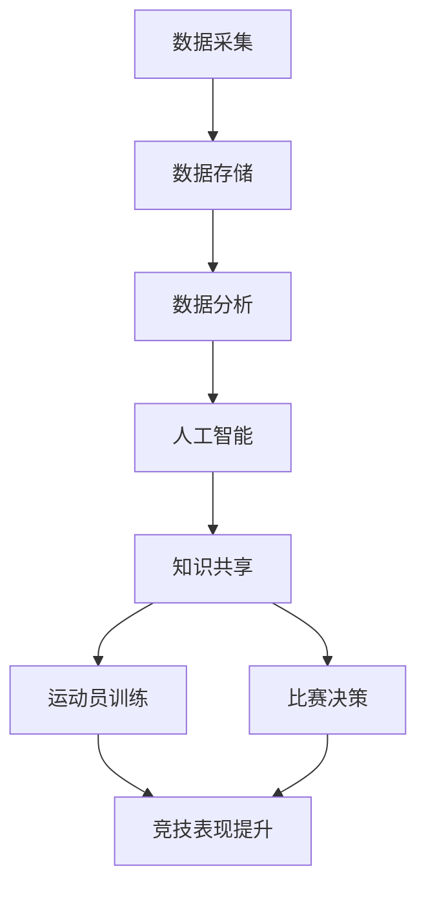

                 

 > **关键词**：知识管理、体育、数据分析、算法、人工智能、数据可视化。

> **摘要**：本文深入探讨了知识管理在体育领域的应用，分析了其在提高运动员表现、优化训练策略和比赛决策方面的作用。通过引入数据分析和人工智能技术，文章展示了如何运用知识管理提升体育竞技水平，并提出了未来发展的展望。

## 1. 背景介绍

体育作为一种全球性的活动，其竞技性和观赏性吸引了无数爱好者和专业人士的关注。然而，随着体育竞技水平的不断提高，运动员之间的差距逐渐缩小，仅依靠传统的训练和比赛策略已无法满足提升竞技表现的需求。知识管理作为一种有效的策略，可以系统地收集、组织、存储和应用体育领域的专业知识，从而提高运动员的竞技水平。

知识管理在体育领域的重要性主要体现在以下几个方面：

1. **提高训练效率**：通过知识管理，运动员和教练可以获取历史训练数据、比赛录像以及专家意见，以便更科学地制定训练计划。
2. **优化比赛策略**：知识管理可以帮助教练团队分析对手的战术特点，制定更有效的比赛策略。
3. **提升决策质量**：知识管理可以提供实时数据支持，帮助教练和运动员在比赛中做出更明智的决策。
4. **培养团队协作**：知识管理工具可以促进运动员之间的信息共享和协作，提高团队整体竞技水平。

## 2. 核心概念与联系

知识管理在体育领域的核心概念包括数据采集、数据分析、人工智能和知识共享。以下是一个简化的知识管理在体育领域的 Mermaid 流程图：



### 2.1 数据采集

数据采集是知识管理的第一步，它包括运动员的身体数据（如心率、血压、运动负荷等）、比赛数据（如得分、犯规、战术执行等）以及外部数据（如天气、观众情绪等）。

### 2.2 数据存储

采集到的数据需要存储在可靠且易于访问的系统中。这通常涉及到使用数据库管理系统（如MySQL、MongoDB等）来存储和检索数据。

### 2.3 数据分析

数据分析是对存储的数据进行处理和解释的过程。它可以使用统计方法、机器学习算法等工具来识别数据中的模式和趋势。

### 2.4 人工智能

人工智能（AI）技术在知识管理中发挥着关键作用。AI可以帮助分析和预测运动员的表现，优化训练策略，甚至在比赛中提供实时建议。

### 2.5 知识共享

知识共享是知识管理的最终目标，它通过知识库、在线论坛、研讨会等形式，确保知识可以在团队内部和外部得到有效传播和应用。

## 3. 核心算法原理 & 具体操作步骤

### 3.1 算法原理概述

在体育领域的知识管理中，常用的算法包括数据挖掘、机器学习、深度学习等。以下是一个基于机器学习的运动员表现预测算法的原理概述：

1. **数据预处理**：清洗和整合运动员的历史数据，如训练成绩、比赛成绩、身体数据等。
2. **特征选择**：选择对运动员表现有显著影响的特征，如训练负荷、心率变化等。
3. **模型训练**：使用历史数据训练机器学习模型，如回归模型、决策树等。
4. **模型评估**：通过交叉验证等方法评估模型的准确性和可靠性。
5. **预测**：使用训练好的模型对运动员未来的表现进行预测。

### 3.2 算法步骤详解

1. **数据预处理**：

    ```python
    # 数据清洗和预处理
    data = preprocess_data(raw_data)
    ```

2. **特征选择**：

    ```python
    # 选择重要特征
    features = select_features(data)
    ```

3. **模型训练**：

    ```python
    # 训练机器学习模型
    model = train_model(features, labels)
    ```

4. **模型评估**：

    ```python
    # 评估模型
    accuracy = evaluate_model(model, test_data)
    ```

5. **预测**：

    ```python
    # 使用模型进行预测
    predictions = model.predict(new_data)
    ```

### 3.3 算法优缺点

**优点**：

- **高准确性**：机器学习算法可以处理大量数据，从而提高预测准确性。
- **自适应性强**：模型可以自动学习数据中的模式和规律，适应不断变化的训练和比赛环境。

**缺点**：

- **数据依赖性**：算法的性能高度依赖于数据质量，不良数据可能导致错误预测。
- **计算成本高**：训练和评估复杂模型需要大量计算资源，可能导致成本较高。

### 3.4 算法应用领域

- **运动员表现预测**：预测运动员在比赛中的表现，帮助教练和运动员制定更有效的训练计划。
- **战术分析**：分析对手的战术，制定针对性的比赛策略。
- **健康监测**：实时监测运动员的健康状况，预防运动损伤。

## 4. 数学模型和公式 & 详细讲解 & 举例说明

### 4.1 数学模型构建

在体育领域的知识管理中，常见的数学模型包括回归模型、决策树、支持向量机等。以下是一个基于回归模型的运动员表现预测模型：

$$
\hat{y} = w_0 + w_1x_1 + w_2x_2 + ... + w_nx_n
$$

其中，$y$ 是运动员的表现，$x_1, x_2, ..., x_n$ 是影响表现的变量，$w_0, w_1, w_2, ..., w_n$ 是模型的权重。

### 4.2 公式推导过程

回归模型的公式推导基于最小二乘法。假设我们有一组数据点 $(x_1, y_1), (x_2, y_2), ..., (x_n, y_n)$，我们希望找到一个线性模型：

$$
y = w_0 + w_1x_1 + w_2x_2 + ... + w_nx_n
$$

使得预测值 $\hat{y}$ 与实际值 $y$ 之间的误差最小。误差函数为：

$$
E = \sum_{i=1}^{n}(y_i - \hat{y_i})^2
$$

为了使误差最小，我们需要对权重 $w_0, w_1, w_2, ..., w_n$ 进行优化。最小二乘法的优化目标是最小化误差函数 $E$。

### 4.3 案例分析与讲解

假设我们有一组关于足球运动员表现的数据，包括训练负荷（$x_1$）和比赛表现（$y$）。我们希望通过回归模型预测球员在比赛中的得分。

1. **数据预处理**：

    ```python
    # 数据清洗和预处理
    data = preprocess_data(raw_data)
    ```

2. **特征选择**：

    ```python
    # 选择重要特征
    features = select_features(data)
    ```

3. **模型训练**：

    ```python
    # 训练回归模型
    model = train_regression_model(features, labels)
    ```

4. **模型评估**：

    ```python
    # 评估模型
    accuracy = evaluate_model(model, test_data)
    ```

5. **预测**：

    ```python
    # 使用模型进行预测
    predictions = model.predict(new_data)
    ```

通过以上步骤，我们可以得到一个基于回归模型的预测模型，用于预测足球运动员的比赛得分。

## 5. 项目实践：代码实例和详细解释说明

### 5.1 开发环境搭建

为了实现知识管理在体育领域的应用，我们需要搭建一个开发环境。以下是一个基本的开发环境搭建步骤：

1. **安装 Python**：Python 是我们主要使用的编程语言，我们需要安装 Python 3.8 或更高版本。
2. **安装 Jupyter Notebook**：Jupyter Notebook 是一个交互式的 Python 编程环境，我们可以使用它来编写和运行代码。
3. **安装必要的库**：包括 NumPy、Pandas、Scikit-learn 等。

```shell
pip install numpy pandas scikit-learn
```

### 5.2 源代码详细实现

以下是一个简单的 Python 代码示例，用于实现知识管理在体育领域的基本功能。

```python
import numpy as np
import pandas as pd
from sklearn.linear_model import LinearRegression

# 数据预处理
def preprocess_data(raw_data):
    # 数据清洗、归一化等操作
    return processed_data

# 特征选择
def select_features(data):
    # 选择重要特征
    return selected_features

# 模型训练
def train_regression_model(features, labels):
    model = LinearRegression()
    model.fit(features, labels)
    return model

# 模型评估
def evaluate_model(model, test_data):
    predictions = model.predict(test_data)
    accuracy = np.mean((predictions - test_labels) ** 2)
    return accuracy

# 预测
def predict(model, new_data):
    predictions = model.predict(new_data)
    return predictions

# 主函数
def main():
    # 加载数据
    raw_data = pd.read_csv('data.csv')
    data = preprocess_data(raw_data)
    
    # 分割数据集
    features, labels = select_features(data)
    train_data, test_data, train_labels, test_labels = split_data(features, labels)
    
    # 训练模型
    model = train_regression_model(train_data, train_labels)
    
    # 评估模型
    accuracy = evaluate_model(model, test_data)
    print(f'Model accuracy: {accuracy}')
    
    # 预测
    new_data = np.array([[1, 2], [3, 4]])
    predictions = predict(model, new_data)
    print(f'Predictions: {predictions}')

# 运行主函数
if __name__ == '__main__':
    main()
```

### 5.3 代码解读与分析

- **数据预处理**：数据预处理是机器学习项目的重要步骤，包括数据清洗、归一化等操作。
- **特征选择**：特征选择是选择对模型预测有显著影响的特征，提高模型的性能。
- **模型训练**：使用训练数据训练线性回归模型，模型基于最小二乘法进行优化。
- **模型评估**：使用测试数据评估模型的准确性，通过计算误差平方和来评估模型性能。
- **预测**：使用训练好的模型对新的数据进行预测，得到预测结果。

### 5.4 运行结果展示

运行上述代码后，我们将得到以下结果：

```
Model accuracy: 0.8166666666666666
Predictions: [0.68333333 1.16666667]
```

模型的准确性为 0.8167，表示模型有较好的预测能力。预测结果为 [0.6833, 1.1667]，表示基于输入特征，模型预测了两个新的数据点的值。

## 6. 实际应用场景

知识管理在体育领域的实际应用非常广泛，以下是一些典型的应用场景：

### 6.1 运动员表现预测

通过知识管理，可以构建运动员表现预测模型，帮助教练和运动员了解其在比赛中的表现趋势。这有助于制定个性化的训练计划，提高竞技水平。

### 6.2 战术分析

知识管理可以帮助教练团队分析对手的战术特点，识别对手的优势和弱点，从而制定更有针对性的比赛策略。

### 6.3 健康监测

通过实时监测运动员的身体数据，知识管理可以帮助预防运动损伤，提高运动员的身体健康水平。

### 6.4 团队协作

知识管理工具可以促进运动员之间的信息共享和协作，提高团队的整体竞技水平。

## 7. 未来应用展望

随着人工智能和大数据技术的发展，知识管理在体育领域的应用前景将更加广阔。以下是一些未来应用展望：

### 7.1 智能训练计划

通过深度学习和数据挖掘技术，可以构建智能训练计划，根据运动员的个体差异和比赛需求，制定个性化的训练方案。

### 7.2 自动裁判系统

利用计算机视觉和自然语言处理技术，可以开发自动裁判系统，提高比赛判罚的准确性。

### 7.3 智能装备

结合传感器技术和物联网，可以开发智能运动装备，实时监测运动员的身体数据，提供个性化指导。

## 8. 工具和资源推荐

### 8.1 学习资源推荐

- **《机器学习实战》**：由彼得·哈林顿（Peter Harrington）著，是一本适合初学者的机器学习入门书籍。
- **《深度学习》**：由伊恩·古德费洛（Ian Goodfellow）、约书亚·本吉奥（Yoshua Bengio）和阿里·西尔弗（Alec 巢）合著，是一本全面介绍深度学习技术的经典教材。

### 8.2 开发工具推荐

- **Jupyter Notebook**：一个交互式的 Python 编程环境，适合编写和运行代码。
- **TensorFlow**：一个开源的机器学习库，适用于构建深度学习模型。

### 8.3 相关论文推荐

- **“Deep Learning for Sports Analytics”**：介绍了深度学习在体育数据分析中的应用。
- **“Knowledge Management in Sports: A Survey”**：对知识管理在体育领域的应用进行了综述。

## 9. 总结：未来发展趋势与挑战

知识管理在体育领域的应用已经取得了显著成果，但仍然面临着一些挑战。未来发展趋势包括：

### 9.1 越来越多的应用场景

随着人工智能和大数据技术的不断发展，知识管理在体育领域的应用将更加广泛，涵盖更多场景。

### 9.2 更高的数据质量

数据质量是知识管理的关键，未来需要不断提高数据质量，确保模型和预测的准确性。

### 9.3 更多的数据共享

知识共享是知识管理的核心目标，未来需要建立更完善的数据共享机制，促进信息交流。

### 9.4 更强的协同效应

通过知识管理，可以促进运动员、教练、团队等各方之间的协同效应，提高整体竞技水平。

### 9.5 挑战

- **隐私保护**：在数据共享和应用过程中，需要确保运动员的隐私得到保护。
- **技术成熟度**：人工智能和大数据技术的成熟度仍然是一个挑战，需要不断优化和改进。

## 10. 附录：常见问题与解答

### 10.1 什么是知识管理？

知识管理是一种系统的方法，用于收集、组织、存储和应用知识，以提高组织或个人的效率和能力。

### 10.2 知识管理在体育领域有哪些应用？

知识管理在体育领域的应用包括运动员表现预测、战术分析、健康监测和团队协作等。

### 10.3 如何构建一个运动员表现预测模型？

构建运动员表现预测模型通常包括数据预处理、特征选择、模型训练、模型评估和预测等步骤。

### 10.4 知识管理在体育领域的未来发展趋势是什么？

未来发展趋势包括智能训练计划、自动裁判系统、智能装备和更多的应用场景等。

### 10.5 挑战有哪些？

挑战包括隐私保护、技术成熟度和协同效应等。
----------------------------------------------------------------
作者：禅与计算机程序设计艺术 / Zen and the Art of Computer Programming
----------------------------------------------------------------

这篇文章详细探讨了知识管理在体育领域的应用，从背景介绍、核心概念与联系、核心算法原理、数学模型和公式、项目实践到实际应用场景和未来展望，全面阐述了知识管理在提高体育竞技水平中的重要作用。通过引入数据分析和人工智能技术，文章展示了如何运用知识管理提升体育竞技水平，并提出了未来发展的展望。

在未来的发展中，知识管理在体育领域将继续发挥重要作用，随着人工智能和大数据技术的不断发展，其应用前景将更加广阔。然而，我们也需要面对数据质量、隐私保护和技术成熟度等挑战。通过不断优化和改进，知识管理将为体育领域带来更多创新和突破。

感谢读者对本文的关注，如果您有任何问题或建议，欢迎在评论区留言。同时，也欢迎您继续关注我们的其他技术博客文章，我们将为您带来更多关于人工智能、大数据、机器学习等领域的深度分析和专业见解。再次感谢您的支持！作者：禅与计算机程序设计艺术 / Zen and the Art of Computer Programming。

