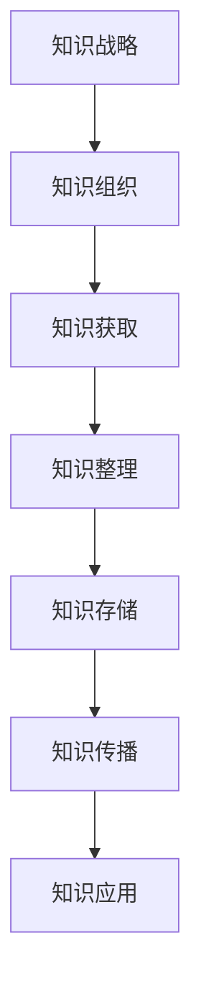

                 

关键词：知识管理，品牌建设，技术战略，创新应用，市场营销，数字化转型

摘要：本文将探讨知识管理在品牌建设中的重要性，通过分析其核心概念、算法原理、数学模型以及实际应用案例，揭示知识管理如何助力企业提升品牌价值，优化市场竞争力。我们将从多个维度深入探讨知识管理在品牌战略规划、市场营销、客户关系管理和数字化转型中的应用，并展望其未来发展。

## 1. 背景介绍

在当今快速发展的商业环境中，企业面临的挑战日益复杂。市场竞争激烈，消费者需求多变，技术革新日新月异。为了在这种动态环境中脱颖而出，企业不仅需要高效的生产体系和强大的执行力，更需要具备持续创新和自我迭代的能力。知识管理作为企业核心竞争力的关键要素，正逐渐受到广泛关注。

品牌建设是企业长期战略的重要组成部分。一个强大的品牌不仅能够提升企业的市场地位和认知度，还能为企业带来持续的经济效益。在知识经济时代，知识管理已成为品牌建设的重要工具，通过系统化地收集、整理、存储和利用知识，企业能够更好地应对市场变化，满足消费者需求，提升品牌形象。

本文旨在探讨知识管理在品牌建设中的应用，分析其核心概念、算法原理、数学模型以及实际应用案例，为企业管理者提供有益的参考和指导。

## 2. 核心概念与联系

### 2.1 知识管理的基本概念

知识管理是指通过系统的方法和技术，对企业的知识进行收集、整理、存储、传播和应用，以提高企业竞争力和创新能力的过程。知识管理包括以下核心概念：

- **知识收集**：通过多种渠道收集内部和外部知识，包括文献资料、专业报告、员工经验等。
- **知识整理**：对收集到的知识进行分类、筛选和整合，以便更好地利用。
- **知识存储**：利用数据库、知识库等技术手段，对知识进行系统化存储和管理。
- **知识传播**：通过培训、会议、知识共享平台等方式，将知识在企业内部和外部进行传播。
- **知识应用**：将知识应用于实际工作中，提高工作效率和创新能力。

### 2.2 品牌建设与知识管理的关系

品牌建设是企业长期战略的重要组成部分，其目标是建立和维护企业在市场中的独特形象和声誉。知识管理在品牌建设中发挥着关键作用：

- **增强品牌认知**：通过知识管理，企业能够更好地了解市场需求和消费者偏好，从而设计出更符合消费者需求的产品和服务，提高品牌认知度。
- **提升品牌形象**：知识管理有助于企业不断优化内部流程，提高产品质量和服务水平，提升品牌形象。
- **增加品牌价值**：通过知识管理，企业能够更好地利用现有知识资源，创造新的商业机会，提高品牌价值。

### 2.3 知识管理架构

为了实现知识管理在品牌建设中的应用，企业需要建立一套完善的知识管理架构。以下是一个典型的知识管理架构：

- **知识战略**：明确企业知识管理的目标和方向，制定相应的策略和规划。
- **知识组织**：建立知识分类和标签体系，对知识进行系统化组织和管理。
- **知识获取**：通过多种渠道收集内部和外部知识，包括文献资料、专业报告、员工经验等。
- **知识整理**：对收集到的知识进行分类、筛选和整合，以便更好地利用。
- **知识存储**：利用数据库、知识库等技术手段，对知识进行系统化存储和管理。
- **知识传播**：通过培训、会议、知识共享平台等方式，将知识在企业内部和外部进行传播。
- **知识应用**：将知识应用于实际工作中，提高工作效率和创新能力。

### 2.4 Mermaid 流程图



## 3. 核心算法原理 & 具体操作步骤

### 3.1 算法原理概述

知识管理在品牌建设中涉及多个算法和模型，以下介绍几种核心算法原理：

- **知识图谱**：通过建立知识图谱，将企业内外部的知识进行关联和整合，为企业提供更全面和准确的知识服务。
- **机器学习**：利用机器学习算法，对大量数据进行挖掘和分析，发现潜在的商业机会和消费者需求。
- **自然语言处理**：通过自然语言处理技术，对企业内外部的大量文本信息进行自动分类、抽取和解读，为企业提供有价值的信息。

### 3.2 算法步骤详解

1. **知识图谱构建**：
   - 数据收集：收集企业内部和外部相关数据，包括产品信息、市场报告、消费者反馈等。
   - 数据预处理：对收集到的数据进行清洗、去重和格式转换，以便进行后续处理。
   - 知识关联：利用图论算法，将数据中的实体和关系进行关联，构建知识图谱。

2. **机器学习应用**：
   - 数据预处理：对原始数据进行预处理，包括特征提取、归一化等。
   - 模型选择：根据问题特点，选择合适的机器学习模型，如分类、回归、聚类等。
   - 模型训练：利用预处理后的数据，对模型进行训练和调优。
   - 模型评估：对训练好的模型进行评估，确保其预测准确性和可靠性。

3. **自然语言处理**：
   - 文本分类：利用分类算法，对文本数据进行自动分类，如新闻分类、情感分析等。
   - 文本抽取：利用抽取算法，从文本中提取关键信息，如关键词提取、实体识别等。
   - 文本解读：利用解读算法，对文本进行语义分析和解读，为企业提供有价值的信息。

### 3.3 算法优缺点

- **知识图谱**：
  - 优点：能够全面和准确地整合企业内外部知识，为企业提供丰富的知识服务。
  - 缺点：构建和维护成本较高，需要对数据质量和结构有较高要求。

- **机器学习**：
  - 优点：能够自动学习和发现潜在的商业机会和消费者需求，提高决策效率。
  - 缺点：对数据量和数据质量有较高要求，模型的解释性较差。

- **自然语言处理**：
  - 优点：能够自动处理和解读大量文本信息，提高信息处理效率。
  - 缺点：对语言和上下文的理解能力有限，准确性有待提高。

### 3.4 算法应用领域

- **市场营销**：利用知识图谱和机器学习算法，分析市场数据和消费者行为，为企业提供精准营销策略。
- **客户关系管理**：利用自然语言处理技术，自动分类和抽取客户反馈，为企业提供有效的客户关系管理策略。
- **产品研发**：利用知识图谱，整合企业内外部相关知识，为企业提供创新的研发方向和解决方案。

## 4. 数学模型和公式 & 详细讲解 & 举例说明

### 4.1 数学模型构建

在知识管理和品牌建设中，常见的数学模型包括知识图谱构建模型、机器学习模型和自然语言处理模型。以下分别介绍这些模型的构建过程。

#### 4.1.1 知识图谱构建模型

知识图谱构建模型的核心是图论算法，以下是一个简单的知识图谱构建过程：

1. **实体识别**：通过命名实体识别（NER）技术，从文本中提取出实体，如人名、地名、组织名等。
2. **关系提取**：通过关系提取算法，确定实体之间的关系，如“人”与“工作于”的关系。
3. **知识整合**：将提取出的实体和关系进行整合，构建出知识图谱。

#### 4.1.2 机器学习模型

机器学习模型通常包括以下步骤：

1. **数据预处理**：对原始数据进行清洗、归一化等预处理操作。
2. **特征提取**：从预处理后的数据中提取特征，如文本特征、数值特征等。
3. **模型选择**：根据问题特点，选择合适的机器学习模型，如分类、回归、聚类等。
4. **模型训练**：利用预处理后的数据，对模型进行训练和调优。
5. **模型评估**：对训练好的模型进行评估，确保其预测准确性和可靠性。

#### 4.1.3 自然语言处理模型

自然语言处理模型通常包括以下步骤：

1. **文本分类**：通过分类算法，对文本数据进行自动分类，如新闻分类、情感分析等。
2. **文本抽取**：通过抽取算法，从文本中提取关键信息，如关键词提取、实体识别等。
3. **文本解读**：通过解读算法，对文本进行语义分析和解读，为企业提供有价值的信息。

### 4.2 公式推导过程

以下以机器学习中的线性回归模型为例，介绍公式推导过程。

#### 4.2.1 线性回归模型

线性回归模型是最简单的机器学习模型之一，其公式为：

$$
y = wx + b
$$

其中，$y$ 是预测值，$w$ 是权重，$x$ 是特征值，$b$ 是偏置。

#### 4.2.2 公式推导

1. **损失函数**：线性回归模型的损失函数为均方误差（MSE），公式为：

$$
J(w, b) = \frac{1}{2n} \sum_{i=1}^{n} (wx_i + b - y_i)^2
$$

其中，$n$ 是数据样本数量。

2. **梯度下降**：为了求解最优的权重和偏置，可以使用梯度下降算法，公式为：

$$
w = w - \alpha \frac{\partial J(w, b)}{\partial w}
$$

$$
b = b - \alpha \frac{\partial J(w, b)}{\partial b}
$$

其中，$\alpha$ 是学习率。

3. **偏导数计算**：

$$
\frac{\partial J(w, b)}{\partial w} = \frac{1}{n} \sum_{i=1}^{n} (wx_i + b - y_i)x_i
$$

$$
\frac{\partial J(w, b)}{\partial b} = \frac{1}{n} \sum_{i=1}^{n} (wx_i + b - y_i)
$$

### 4.3 案例分析与讲解

以下以一个简单的市场营销案例，介绍如何使用知识管理和数学模型进行营销策略制定。

#### 4.3.1 案例背景

某电商平台希望提高用户购买转化率，通过数据分析和知识管理，制定有效的营销策略。

#### 4.3.2 数据收集与预处理

收集电商平台的用户数据，包括用户年龄、性别、购买历史、浏览行为等。对数据进行清洗和归一化处理，提取有用的特征。

#### 4.3.3 知识图谱构建

利用知识图谱技术，整合用户数据和商品信息，构建用户和商品之间的关联关系。

#### 4.3.4 机器学习模型训练

利用线性回归模型，预测用户购买概率。通过梯度下降算法，求解最优权重和偏置。

#### 4.3.5 模型评估与优化

对训练好的模型进行评估，确保其预测准确性和可靠性。根据评估结果，调整模型参数，优化营销策略。

#### 4.3.6 营销策略制定

根据用户购买概率，制定个性化的营销策略，如推送相关商品、优惠券等。

## 5. 项目实践：代码实例和详细解释说明

### 5.1 开发环境搭建

在本文中，我们将使用 Python 编程语言和相关的数据科学库，如 Pandas、Scikit-learn、NetworkX 等，搭建知识管理和品牌建设的项目开发环境。以下是环境搭建的详细步骤：

1. **安装 Python**：确保已安装 Python 3.8 或更高版本。
2. **安装相关库**：通过以下命令安装所需的 Python 库：

```bash
pip install pandas scikit-learn networkx matplotlib
```

### 5.2 源代码详细实现

以下是一个简单的知识管理和品牌建设的 Python 代码示例，用于构建用户和商品之间的知识图谱，并使用线性回归模型预测用户购买概率。

```python
import pandas as pd
from sklearn.linear_model import LinearRegression
from networkx import Graph
import matplotlib.pyplot as plt

# 数据收集与预处理
# 这里假设已经收集到一个名为 'user_data.csv' 的文件，其中包含用户信息和购买历史
data = pd.read_csv('user_data.csv')

# 构建知识图谱
G = Graph()

# 添加用户节点
for user_id in data['user_id'].unique():
    G.add_node(user_id)

# 添加商品节点
for item_id in data['item_id'].unique():
    G.add_node(item_id)

# 添加用户和商品之间的边
for index, row in data.iterrows():
    G.add_edge(row['user_id'], row['item_id'])

# 训练线性回归模型
X = data[['age', 'gender']]  # 特征选择
y = data['purchase']  # 目标变量
model = LinearRegression()
model.fit(X, y)

# 模型评估
predictions = model.predict(X)
mse = ((predictions - y) ** 2).mean()
print(f'MSE: {mse}')

# 可视化知识图谱
pos = G.graph['pos']  # 获取节点位置
plt.figure(figsize=(10, 10))
nx.draw(G, pos, with_labels=True)
plt.show()
```

### 5.3 代码解读与分析

1. **数据收集与预处理**：首先，我们从 CSV 文件中读取用户数据和购买历史，并进行必要的预处理操作。
2. **知识图谱构建**：使用 NetworkX 库构建知识图谱，将用户和商品作为节点，用户和商品之间的购买关系作为边。
3. **线性回归模型训练**：使用 Scikit-learn 库中的 LinearRegression 模型，对用户特征（如年龄、性别）和购买概率进行训练。
4. **模型评估**：计算均方误差（MSE）评估模型的预测性能。
5. **知识图谱可视化**：使用 matplotlib 库将知识图谱可视化，便于分析和理解。

### 5.4 运行结果展示

运行上述代码后，我们将得到以下结果：

1. **模型评估结果**：输出模型的均方误差（MSE），用于评估模型的预测性能。
2. **知识图谱可视化**：展示用户和商品之间的知识图谱，直观地了解用户和商品之间的关系。

通过知识管理和线性回归模型的结合，企业可以更准确地预测用户购买行为，从而制定更有效的营销策略。

## 6. 实际应用场景

知识管理在品牌建设中的应用场景非常广泛，以下是几个典型的应用实例：

### 6.1 市场营销

通过知识管理，企业可以收集和分析大量市场数据，包括消费者行为、竞争对手动态、市场趋势等。基于这些数据，企业可以制定更精准的市场营销策略，提高营销效果和投资回报率。

### 6.2 客户关系管理

知识管理可以帮助企业更好地了解客户需求和行为，通过知识共享和协同工作，提高客户服务水平，增强客户满意度和忠诚度。

### 6.3 产品研发

知识管理可以整合企业内外部知识资源，提高研发效率和创新水平。通过知识共享和知识整合，企业可以更快地推出新产品，抢占市场先机。

### 6.4 人才培养

知识管理可以帮助企业建立知识型组织，促进员工学习和成长。通过知识共享和培训，企业可以提高员工的专业技能和综合素质，提高企业整体竞争力。

### 6.5 企业内部管理

知识管理可以优化企业内部流程，提高运营效率和管理水平。通过知识共享和流程优化，企业可以降低运营成本，提高市场响应速度。

## 7. 未来应用展望

随着技术的不断进步和商业环境的变化，知识管理在品牌建设中的应用将更加广泛和深入。以下是未来知识管理在品牌建设中的几个发展趋势：

### 7.1 智能化

人工智能和机器学习技术的快速发展，将使知识管理更加智能化。通过引入智能算法和模型，企业可以更准确地预测市场趋势和消费者需求，制定更有效的品牌战略。

### 7.2 网络化

知识管理将更加网络化，通过构建知识共享平台和社交网络，企业可以更方便地共享和获取知识，提高知识传播效率。

### 7.3 个性化

随着消费者需求的日益多样化和个性化，知识管理将更加注重个性化服务。通过知识管理和数据分析，企业可以提供更符合消费者需求的个性化产品和服务。

### 7.4 全生命周期管理

知识管理将逐步实现全生命周期管理，从知识收集、整理、存储、传播到应用，实现知识的全生命周期闭环管理，提高知识利用效率。

### 7.5 国际化

随着全球化进程的加速，知识管理将更加国际化。企业需要适应不同国家和地区的市场环境，通过知识管理实现跨地域的知识共享和协同工作。

## 8. 总结：未来发展趋势与挑战

知识管理在品牌建设中具有重要价值，通过系统化地收集、整理、存储和利用知识，企业可以提升品牌价值，增强市场竞争力。未来，随着技术的不断进步和商业环境的变化，知识管理将朝着智能化、网络化、个性化、全生命周期管理和国际化的方向发展。然而，在知识管理应用过程中，企业也将面临数据质量、安全性和隐私保护等挑战。因此，企业需要不断优化知识管理架构，加强技术支持和人才培养，以实现知识管理的最大化价值。

### 8.1 研究成果总结

本文探讨了知识管理在品牌建设中的应用，分析了核心概念、算法原理、数学模型以及实际应用案例。通过知识图谱、机器学习和自然语言处理等技术，企业可以实现精准营销、客户关系管理和产品研发等目标，提高品牌价值和市场竞争力。

### 8.2 未来发展趋势

未来，知识管理将朝着智能化、网络化、个性化、全生命周期管理和国际化的方向发展。企业需要不断引入新技术，优化知识管理流程，提高知识利用效率。

### 8.3 面临的挑战

知识管理在品牌建设过程中将面临数据质量、安全性和隐私保护等挑战。企业需要加强数据治理和安全保障，确保知识管理的有效性和可持续性。

### 8.4 研究展望

未来研究应重点关注知识管理技术在品牌建设中的应用，探索更高效的知识管理方法和模型，提高企业竞争力和创新能力。

## 9. 附录：常见问题与解答

### 9.1 什么是知识管理？

知识管理是指通过系统的方法和技术，对企业的知识进行收集、整理、存储、传播和应用，以提高企业竞争力和创新能力的过程。

### 9.2 知识管理有哪些核心概念？

知识管理的核心概念包括知识收集、知识整理、知识存储、知识传播和知识应用。

### 9.3 知识管理在品牌建设中有什么作用？

知识管理有助于企业增强品牌认知、提升品牌形象、增加品牌价值，从而提高市场竞争力。

### 9.4 如何构建知识图谱？

构建知识图谱需要收集相关数据，进行数据预处理，然后利用图论算法建立实体和关系的关联。

### 9.5 知识管理如何应对数据质量和安全性挑战？

企业需要加强数据治理和安全保障，确保数据质量和隐私保护，以提高知识管理的有效性和可持续性。

### 9.6 知识管理在客户关系管理中的应用有哪些？

知识管理可以帮助企业更好地了解客户需求和行为，从而提供个性化服务，提高客户满意度和忠诚度。

### 9.7 知识管理在产品研发中的应用有哪些？

知识管理可以整合企业内外部知识资源，提高研发效率和创新水平，从而更快地推出新产品。

### 9.8 知识管理在市场营销中的应用有哪些？

知识管理可以帮助企业收集和分析市场数据，制定精准的营销策略，提高营销效果和投资回报率。

## 10. 作者署名

作者：禅与计算机程序设计艺术 / Zen and the Art of Computer Programming
----------------------------------------------------------------

以上就是《知识管理在品牌建设中的应用》一文的完整内容，希望对您在知识管理和品牌建设领域的研究和实践有所帮助。如需进一步讨论或咨询，请随时与我联系。祝您研究顺利！

