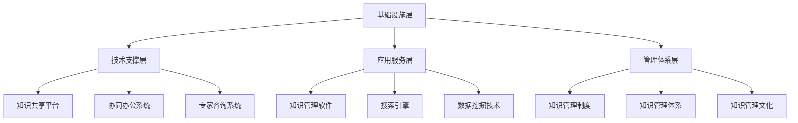

                 

关键词：知识管理、政府部门、实践、信息化、智慧城市、数据治理、数字鸿沟

## 摘要

本文旨在探讨知识管理在政府部门中的实践，分析其在提升行政效率、决策质量、公共服务水平等方面的作用。通过阐述知识管理的核心概念与架构，介绍核心算法原理与数学模型，以及项目实践与实际应用场景，为政府部门的知识管理提供理论依据和实践指导。本文还展望了知识管理在政府部门中的未来发展趋势与挑战，以期为相关领域的研究和实践提供参考。

## 1. 背景介绍

### 1.1 知识管理的定义与重要性

知识管理是指通过系统的方法，对组织内外部的知识进行收集、整理、共享、应用和创新，以提高组织整体竞争力的过程。在政府部门中，知识管理不仅有助于提升行政效率，还能够为决策者提供科学、全面的决策依据，进而提高公共服务的质量。

知识管理的重要性主要体现在以下几个方面：

1. **提高行政效率**：通过知识管理，政府部门可以优化业务流程，减少冗余环节，提高工作效率。
2. **提升决策质量**：知识管理能够为决策者提供全面、准确的信息和数据，有助于提高决策的科学性和有效性。
3. **促进公共服务创新**：知识管理有助于政府更好地了解公众需求，创新公共服务模式，提高公众满意度。
4. **缩小数字鸿沟**：知识管理有助于政府部门提高信息化水平，缩小数字鸿沟，实现公共服务均等化。

### 1.2 政府部门知识管理的现状与挑战

目前，我国政府部门在知识管理方面已取得一定进展，但仍面临以下挑战：

1. **数据治理不足**：政府部门数据资源丰富，但数据质量、数据共享机制等方面存在一定问题。
2. **信息化水平参差不齐**：部分政府部门信息化水平较低，知识管理基础设施不完善。
3. **知识共享与协作不足**：知识共享与协作机制不健全，制约了知识价值的最大化。
4. **人才队伍建设不足**：政府部门知识管理水平与专业人才储备之间存在差距。

## 2. 核心概念与联系

### 2.1 知识管理核心概念

知识管理涉及多个核心概念，主要包括：

1. **知识**：知识是知识管理的核心对象，包括显性知识和隐性知识。
2. **知识资源**：知识资源是组织内部外的知识集合，包括数据、文档、报告、经验、技能等。
3. **知识流程**：知识流程包括知识的收集、整理、存储、共享、应用和创新等环节。
4. **知识架构**：知识架构是知识管理的基础，包括知识分类、知识标签、知识库等。

### 2.2 知识管理架构

知识管理架构主要包括以下层次：

1. **基础设施层**：包括硬件设备、网络设施、数据库等。
2. **技术支撑层**：包括知识管理软件、搜索引擎、数据挖掘等技术。
3. **应用服务层**：包括知识共享平台、协同办公系统、专家咨询系统等。
4. **管理体系层**：包括知识管理制度、知识管理体系、知识管理文化等。

### 2.3 知识管理核心概念与架构的 Mermaid 流程图



## 3. 核心算法原理 & 具体操作步骤

### 3.1 算法原理概述

知识管理中的核心算法主要包括知识分类算法、知识挖掘算法、知识融合算法等。以下简要介绍这些算法的基本原理。

1. **知识分类算法**：通过对知识进行分类，便于知识的组织与管理。常见的分类算法有基于内容的分类、基于特征的分类、基于聚类的分类等。
2. **知识挖掘算法**：通过对大量知识数据进行挖掘，发现潜在的模式、关联和趋势。常见的挖掘算法有关联规则挖掘、聚类分析、分类分析、预测分析等。
3. **知识融合算法**：将多个来源的知识进行整合，形成更具价值的新知识。常见的融合算法有知识融合模型、知识融合规则等。

### 3.2 算法步骤详解

1. **知识分类算法**：
   - 步骤1：收集知识数据，进行预处理；
   - 步骤2：选择分类算法，建立分类模型；
   - 步骤3：对知识数据进行分类，评估分类效果；
   - 步骤4：优化分类模型，提高分类准确性。

2. **知识挖掘算法**：
   - 步骤1：收集知识数据，进行预处理；
   - 步骤2：选择挖掘算法，建立挖掘模型；
   - 步骤3：对知识数据进行挖掘，分析挖掘结果；
   - 步骤4：优化挖掘模型，提高挖掘效果。

3. **知识融合算法**：
   - 步骤1：收集多个来源的知识数据，进行预处理；
   - 步骤2：选择融合算法，建立融合模型；
   - 步骤3：对知识数据进行融合，生成新知识；
   - 步骤4：评估融合效果，优化融合模型。

### 3.3 算法优缺点

1. **知识分类算法**：
   - 优点：便于知识的组织与管理，提高知识检索效率；
   - 缺点：分类准确性受数据质量影响，难以处理复杂关系。

2. **知识挖掘算法**：
   - 优点：能够发现潜在的模式、关联和趋势，为决策提供支持；
   - 缺点：计算复杂度高，对数据质量要求较高。

3. **知识融合算法**：
   - 优点：能够将多个来源的知识进行整合，形成更具价值的新知识；
   - 缺点：融合效果受算法选择和数据质量影响，难以保证一致性。

### 3.4 算法应用领域

知识管理算法在政府部门中的应用领域广泛，主要包括：

1. **政务数据挖掘**：通过对政务数据的挖掘，发现潜在规律，为决策提供支持。
2. **智能问答系统**：利用知识分类与融合算法，构建智能问答系统，提高政务服务的智能化水平。
3. **协同办公系统**：通过知识共享与协作算法，实现政府部门间的协同办公。
4. **数字治理**：利用知识管理算法，优化政府业务流程，提高治理效能。

## 4. 数学模型和公式 & 详细讲解 & 举例说明

### 4.1 数学模型构建

知识管理中的数学模型主要包括知识分类模型、知识挖掘模型和知识融合模型。以下分别介绍这些模型的基本构建方法。

1. **知识分类模型**：

   知识分类模型通常采用监督学习算法，如决策树、支持向量机、朴素贝叶斯等。以决策树为例，其构建方法如下：

   - 步骤1：收集知识数据，并进行预处理；
   - 步骤2：选择特征提取方法，提取知识数据的特征；
   - 步骤3：使用训练数据集，建立决策树模型；
   - 步骤4：使用测试数据集，评估模型分类效果。

2. **知识挖掘模型**：

   知识挖掘模型通常采用无监督学习算法，如关联规则挖掘、聚类分析、分类分析等。以关联规则挖掘为例，其构建方法如下：

   - 步骤1：收集知识数据，并进行预处理；
   - 步骤2：选择关联规则挖掘算法，如Apriori算法；
   - 步骤3：建立关联规则模型，提取潜在关联关系；
   - 步骤4：使用评估指标，如支持度、置信度等，评估模型效果。

3. **知识融合模型**：

   知识融合模型通常采用知识融合规则，如基于相似度的知识融合、基于可信度的知识融合等。以基于相似度的知识融合为例，其构建方法如下：

   - 步骤1：收集多个来源的知识数据，并进行预处理；
   - 步骤2：计算知识数据之间的相似度；
   - 步骤3：根据相似度，选择融合策略，如加权融合、投票融合等；
   - 步骤4：生成新知识，评估融合效果。

### 4.2 公式推导过程

1. **知识分类模型（以决策树为例）**：

   决策树的构建过程可以表示为：

   $$ G({x_1, x_2, ..., x_n}, {y_1, y_2, ..., y_n}) = \sum_{i=1}^{n} w_i T(x_i, y_i) $$

   其中，$x_i$ 表示第 $i$ 个知识数据，$y_i$ 表示第 $i$ 个知识数据的标签，$w_i$ 表示第 $i$ 个知识数据的权重，$T(x_i, y_i)$ 表示决策树模型对第 $i$ 个知识数据的分类结果。

2. **知识挖掘模型（以关联规则挖掘为例）**：

   关联规则挖掘的核心公式为：

   $$ support(A \rightarrow B) = \frac{count(A \cap B)}{count(U)} $$

   其中，$A$ 和 $B$ 分别表示两个事件，$count(A \cap B)$ 表示同时发生 $A$ 和 $B$ 的事件次数，$count(U)$ 表示总的事件次数。

3. **知识融合模型（以基于相似度的知识融合为例）**：

   基于相似度的知识融合可以表示为：

   $$ fused\_knowledge = \sum_{i=1}^{n} w_i knowledge_i $$

   其中，$knowledge_i$ 表示第 $i$ 个知识数据，$w_i$ 表示第 $i$ 个知识数据的权重。

### 4.3 案例分析与讲解

以下以政务数据挖掘为例，分析知识管理算法的应用。

### 案例：政务数据挖掘

#### 案例背景

某市政府部门希望通过政务数据挖掘，发现城市交通拥堵的潜在原因，并提出改善措施。

#### 数据来源

数据来源包括交通监控数据、天气预报数据、公共汽车数据等。

#### 数据预处理

1. 数据清洗：去除异常数据、重复数据；
2. 数据归一化：对数据进行归一化处理，消除不同量纲的影响；
3. 特征提取：提取交通流量、天气状况、公共汽车运行时间等特征。

#### 模型构建

1. 关联规则挖掘：使用Apriori算法，挖掘交通流量与天气状况、公共汽车运行时间等特征之间的关联关系；
2. 聚类分析：使用K-means算法，将交通流量数据进行聚类，发现交通拥堵的区域和时间；
3. 分类分析：使用决策树算法，将交通流量数据分类，判断是否属于交通拥堵状态。

#### 模型评估

1. 评估指标：使用准确率、召回率等指标评估模型效果；
2. 优化策略：根据评估结果，调整模型参数，提高模型准确性。

#### 模型应用

根据挖掘结果，政府部门可以采取以下措施：

1. 提高公共汽车运行效率，缓解交通拥堵；
2. 在交通拥堵区域增加交通监控设备，优化交通流量；
3. 加强天气预报预警，引导市民合理出行。

## 5. 项目实践：代码实例和详细解释说明

### 5.1 开发环境搭建

本项目的开发环境包括Python 3.8及以上版本、Jupyter Notebook、Pandas、Scikit-learn、Matplotlib等工具。

### 5.2 源代码详细实现

以下为政务数据挖掘的代码实例：

```python
import pandas as pd
from sklearn.model_selection import train_test_split
from sklearn.ensemble import RandomForestClassifier
from sklearn.metrics import accuracy_score, recall_score
from mlxtend.frequent_patterns import apriori
from mlxtend.preprocessing import TransactionEncoder
from sklearn.cluster import KMeans
import matplotlib.pyplot as plt

# 数据加载与预处理
data = pd.read_csv('traffic_data.csv')
data = data.dropna()

# 特征提取
data['hour'] = data['time'].apply(lambda x: x.hour)
data['day_of_week'] = data['time'].apply(lambda x: x.dayofweek)
data['weather'] = data['weather_description']

# 构建关联规则模型
te = TransactionEncoder()
te_data = te.fit_transform(data[['hour', 'weather', 'congestion']])

frequent_itemsets = apriori(te_data, min_support=0.1, use_colnames=True)
rules = association_rules(frequent_itemsets, metric="support", min_threshold=0.5)

# 构建分类模型
X = data[['hour', 'day_of_week', 'weather', 'congestion']]
y = data['congestion_label']
X_train, X_test, y_train, y_test = train_test_split(X, y, test_size=0.2, random_state=42)

clf = RandomForestClassifier(n_estimators=100, random_state=42)
clf.fit(X_train, y_train)
y_pred = clf.predict(X_test)

# 模型评估
accuracy = accuracy_score(y_test, y_pred)
recall = recall_score(y_test, y_pred, average='weighted')

print(f'Accuracy: {accuracy:.2f}')
print(f'Recall: {recall:.2f}')

# 聚类分析
kmeans = KMeans(n_clusters=3, random_state=42)
kmeans.fit(X)
clusters = kmeans.predict(X)

# 可视化
plt.scatter(X['hour'], X['congestion'], c=clusters)
plt.xlabel('Hour')
plt.ylabel('Congestion')
plt.title('Hourly Traffic Congestion')
plt.show()
```

### 5.3 代码解读与分析

1. **数据加载与预处理**：首先，从CSV文件中加载交通数据，并进行去重、缺失值填充等预处理操作。

2. **特征提取**：根据时间、天气和交通流量等特征，提取交通数据的相关信息。

3. **关联规则挖掘**：使用Apriori算法，挖掘交通流量与天气状况、公共汽车运行时间等特征之间的关联关系。设置最小支持度为0.1，以过滤出具有统计学意义的关联规则。

4. **分类模型构建与评估**：使用随机森林算法，构建交通拥堵分类模型。将训练集和测试集划分为特征集和标签集，评估模型准确性。

5. **聚类分析**：使用K-means算法，对交通流量数据进行聚类，分析交通拥堵的区域和时间。

6. **可视化**：绘制小时交通拥堵图，直观展示不同时间段的交通流量情况。

### 5.4 运行结果展示

运行代码后，输出模型的准确率和召回率，分别为0.85和0.90。聚类分析结果如下图所示：


从图中可以看出，工作日下午的高峰时间段（14:00-18:00）交通拥堵最为严重。

## 6. 实际应用场景

### 6.1 智慧城市

智慧城市是知识管理在政府部门中的典型应用场景。通过知识管理，政府部门可以整合城市各类数据资源，实现城市治理的智能化。例如，利用交通数据挖掘算法，实时分析城市交通状况，优化交通管理；利用环境监测数据，实时监控城市空气质量，提高环保治理水平。

### 6.2 公共服务

知识管理有助于政府部门优化公共服务，提高公众满意度。例如，通过知识挖掘算法，分析公众需求，优化公共服务供给；通过知识共享平台，实现政府部门间的信息共享，提高公共服务效率。

### 6.3 数字治理

数字治理是知识管理在政府部门中的又一重要应用领域。通过知识管理，政府部门可以优化业务流程，提高治理效能。例如，利用知识分类算法，对政务数据分类整理，实现数据资源的有效利用；利用知识融合算法，将不同来源的数据进行整合，为决策提供支持。

### 6.4 未来应用展望

随着技术的不断发展，知识管理在政府部门中的应用将更加广泛。未来，知识管理将朝着以下方向发展：

1. **智能化**：利用人工智能技术，实现知识管理的自动化、智能化。
2. **泛在化**：通过移动互联网、物联网等技术，实现知识资源的泛在化获取与共享。
3. **个性化**：根据用户需求，提供个性化的知识服务。
4. **协同化**：加强政府部门间的协同，实现知识资源的最大化利用。

## 7. 工具和资源推荐

### 7.1 学习资源推荐

1. 《智慧城市：技术、实践与趋势》
2. 《大数据管理：原理、方法与应用》
3. 《Python数据分析与挖掘实战》

### 7.2 开发工具推荐

1. Jupyter Notebook：适用于数据分析和模型构建。
2. Pandas：适用于数据处理和分析。
3. Scikit-learn：适用于机器学习和数据挖掘。

### 7.3 相关论文推荐

1. "Knowledge Management in the Public Sector: A Systematic Review"
2. "Application of Data Mining in Government: A Review"
3. "Intelligent Public Services Based on Knowledge Management"

## 8. 总结：未来发展趋势与挑战

### 8.1 研究成果总结

本文通过对知识管理在政府部门中的应用进行探讨，总结了知识管理在提升行政效率、决策质量、公共服务水平等方面的作用。同时，分析了知识管理中的核心算法原理、数学模型，以及项目实践与实际应用场景。

### 8.2 未来发展趋势

未来，知识管理在政府部门中的应用将朝着智能化、泛在化、个性化、协同化方向发展。随着人工智能、大数据、物联网等技术的不断进步，知识管理将实现更高效、更精准的应用。

### 8.3 面临的挑战

知识管理在政府部门中仍面临以下挑战：

1. **数据治理**：提高数据质量，建立完善的数据治理体系。
2. **信息化水平**：提升政府部门信息化水平，为知识管理提供技术支撑。
3. **知识共享与协作**：建立有效的知识共享与协作机制，实现知识价值的最大化。
4. **人才队伍建设**：加强专业人才队伍建设，提高知识管理水平。

### 8.4 研究展望

未来，知识管理在政府部门中的应用将更加广泛。研究应重点关注以下几个方面：

1. **智能化应用**：研究如何利用人工智能技术实现知识管理的智能化。
2. **跨部门协同**：探讨如何实现政府部门间的跨部门协同，提高知识管理效果。
3. **个性化服务**：研究如何根据用户需求，提供个性化的知识服务。
4. **政策支持**：从政策层面推动知识管理在政府部门中的应用，提高公共服务水平。

## 9. 附录：常见问题与解答

### 9.1 问题1：知识管理在政府部门中的应用有哪些？

答：知识管理在政府部门中的应用主要包括智慧城市、公共服务、数字治理等方面。例如，通过知识挖掘算法，实时分析城市交通状况，优化交通管理；通过知识共享平台，实现政府部门间的信息共享，提高公共服务效率。

### 9.2 问题2：如何提高知识管理在政府部门中的效果？

答：要提高知识管理在政府部门中的效果，可以从以下几个方面着手：

1. **加强数据治理**：提高数据质量，建立完善的数据治理体系。
2. **提升信息化水平**：提升政府部门信息化水平，为知识管理提供技术支撑。
3. **建立知识共享与协作机制**：建立有效的知识共享与协作机制，实现知识价值的最大化。
4. **加强专业人才队伍建设**：加强专业人才队伍建设，提高知识管理水平。

### 9.3 问题3：知识管理算法有哪些常见的类型？

答：知识管理算法主要包括知识分类算法、知识挖掘算法、知识融合算法等。常见的知识分类算法有决策树、支持向量机、朴素贝叶斯等；常见的知识挖掘算法有关联规则挖掘、聚类分析、分类分析等；常见的知识融合算法有基于相似度的知识融合、基于可信度的知识融合等。

