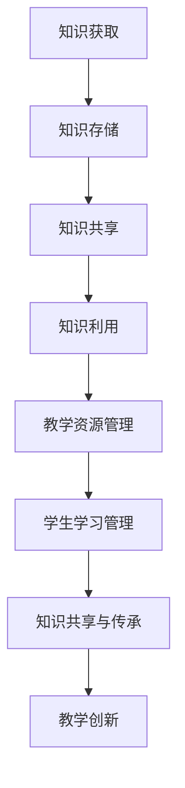
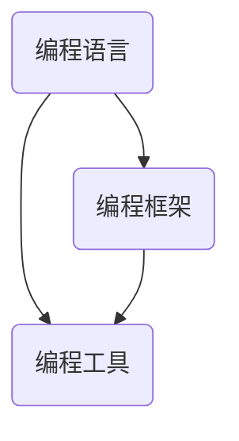

                 

### 关键词 Keywords ###
知识管理、教育领域、信息技术、学习模型、教育平台、知识共享、人工智能、教育资源优化。

<|assistant|>### 摘要 Abstract ###
本文旨在探讨知识管理在教育领域的广泛应用及其重要性。通过对知识管理核心概念、技术方法、实际案例和未来展望的深入分析，揭示了知识管理在教育中如何提升教学质量、促进知识共享与传承，以及如何利用人工智能技术实现教育资源的智能化配置。文章首先介绍了知识管理的定义及其在教育领域的应用场景，随后分析了知识管理的关键技术和理论基础，并探讨了几种主要的知识管理方法。最后，本文通过实际案例展示了知识管理在教育实践中的应用，并对未来发展趋势和挑战进行了展望。

## 1. 背景介绍

知识管理（Knowledge Management，KM）是一个跨学科领域，涉及信息技术、组织行为学、管理学等多个领域。知识管理的目的是通过系统地收集、组织、存储、传播和利用知识，提高组织的竞争力和创新能力。在教育领域，知识管理的重要性日益凸显。随着信息技术的飞速发展，教育资源的获取变得更加便捷，但同时也带来了知识管理的新挑战。如何有效地管理和利用这些教育资源，使学习过程更加高效、个性化和有意义，成为教育领域的重要议题。

教育领域中的知识管理不仅包括对教师知识的积累和传承，还包括对学生学习过程的跟踪与分析，以及对教学资源的优化配置。传统的教育模式侧重于知识的传授，而现代教育则更加强调知识的获取与应用。知识管理在教育中的应用，旨在打破知识的壁垒，促进师生之间、学生与学生之间的知识共享与交流，从而构建一个互动性更强、适应性更广的教育生态系统。

## 2. 核心概念与联系

### 2.1 知识管理的基本概念

知识管理涉及多个核心概念，包括知识、知识库、知识共享、知识创造、知识转移等。

- **知识（Knowledge）**：知识是人们对事物认知的集合，包括事实、信息、技能、经验、价值观等。
- **知识库（Knowledge Base）**：知识库是一个存储和检索知识的系统，通常包括文档、数据库、图表、模型等形式。
- **知识共享（Knowledge Sharing）**：知识共享是指个体或团体之间交换知识的过程。
- **知识创造（Knowledge Creation）**：知识创造是通过新知识的产生、整合和应用，实现对现有知识的拓展和深化。
- **知识转移（Knowledge Transfer）**：知识转移是将知识从一个组织或个体传递到另一个组织或个体的过程。

### 2.2 知识管理的技术方法

知识管理的技术方法主要包括信息检索技术、知识图谱、人工智能、社交媒体等。

- **信息检索技术**：信息检索技术是知识管理的基础，用于高效地检索和获取所需信息。
- **知识图谱**：知识图谱是一种结构化知识表示方法，用于描述实体之间的关系和属性。
- **人工智能**：人工智能技术在知识管理中的应用，主要体现在知识获取、知识分析和知识应用等方面。
- **社交媒体**：社交媒体平台为知识共享提供了新的途径，促进了师生之间、学生与学生之间的互动和交流。

### 2.3 知识管理的应用架构

知识管理的应用架构通常包括知识获取、知识存储、知识共享、知识利用四个环节。

- **知识获取**：通过信息检索、数据挖掘、社会化学习等方式获取知识。
- **知识存储**：将获取到的知识存储到知识库中，便于管理和检索。
- **知识共享**：通过知识共享平台、社交媒体、会议等方式实现知识的传播和交流。
- **知识利用**：将知识应用于教学、学习、科研等活动中，实现知识的实际应用。

### 2.4 知识管理在教育领域的应用

在教育领域，知识管理的应用主要体现在以下几个方面：

- **教学资源管理**：通过知识管理技术，对教学资源进行系统化管理和优化配置。
- **学生学习管理**：通过学习分析技术，跟踪学生的学习过程，提供个性化的学习建议。
- **知识共享与传承**：建立教师知识库和学生知识库，促进知识的积累和传承。
- **教学创新**：利用知识管理技术，推动教学方法和教育模式的创新。

### 2.5 Mermaid 流程图



## 3. 核心算法原理 & 具体操作步骤

### 3.1 算法原理概述

知识管理在教育领域的核心算法主要包括知识检索、知识推荐、知识融合和知识可视化。以下是对这些算法原理的概述：

- **知识检索**：通过信息检索技术，根据用户需求快速定位相关知识点。
- **知识推荐**：利用协同过滤、基于内容的推荐等算法，为用户提供个性化的知识推荐。
- **知识融合**：通过数据融合、本体论等技术，将分散的知识片段整合为完整的知识体系。
- **知识可视化**：利用图表、图形等可视化工具，将知识以直观的方式呈现给用户。

### 3.2 算法步骤详解

#### 3.2.1 知识检索

1. **用户输入查询**：用户通过搜索框输入关键词或问题。
2. **索引构建**：系统根据关键词或问题构建索引，便于快速检索。
3. **匹配与排序**：系统根据用户输入与知识库中的知识进行匹配，并根据匹配度对结果进行排序。

#### 3.2.2 知识推荐

1. **用户行为分析**：系统收集并分析用户的学习行为，如浏览历史、学习轨迹等。
2. **推荐算法**：利用协同过滤、基于内容的推荐等算法，生成推荐列表。
3. **推荐展示**：将推荐结果以列表、卡片等形式展示给用户。

#### 3.2.3 知识融合

1. **数据预处理**：对来自不同来源的知识数据进行清洗、格式化等预处理。
2. **本体构建**：建立本体模型，描述知识之间的关系和属性。
3. **融合算法**：采用知识图谱等技术，将预处理后的知识进行融合。

#### 3.2.4 知识可视化

1. **数据转换**：将知识库中的知识数据转换为可视化格式。
2. **可视化工具**：利用图表、图形等可视化工具，将知识以直观的方式呈现。
3. **交互设计**：设计用户交互界面，使知识可视化过程更加便捷和直观。

### 3.3 算法优缺点

#### 知识检索

- **优点**：快速、准确，能够满足用户即时知识需求。
- **缺点**：对用户输入要求较高，可能存在信息过载问题。

#### 知识推荐

- **优点**：个性化强，能够提高用户的学习兴趣和效果。
- **缺点**：可能存在推荐偏差，影响用户的自主学习能力。

#### 知识融合

- **优点**：整合了多种知识资源，提高了知识的系统性和完整性。
- **缺点**：融合过程复杂，可能降低知识检索的效率。

#### 知识可视化

- **优点**：直观、易懂，有助于知识的理解和记忆。
- **缺点**：对知识内容的可视化表达有一定限制。

### 3.4 算法应用领域

知识管理算法在教育领域的应用十分广泛，主要包括：

- **在线教育平台**：通过知识检索和推荐算法，为用户提供个性化的学习资源和学习路径。
- **学习管理系统（LMS）**：通过知识可视化和知识融合技术，提升学生的学习体验和教学效果。
- **教育数据分析**：通过知识管理算法，对学生的学习行为进行分析，为教育决策提供数据支持。

## 4. 数学模型和公式 & 详细讲解 & 举例说明

### 4.1 数学模型构建

在教育知识管理中，常用的数学模型包括学习曲线模型、协同过滤模型和知识图谱模型。

#### 4.1.1 学习曲线模型

学习曲线模型用于描述学生学习的进步过程，其数学模型为：

\[ P(t) = P_0 \times e^{-kt} \]

其中，\( P(t) \) 为学生在时间 \( t \) 时的成绩，\( P_0 \) 为初始成绩，\( k \) 为学习速率常数。

#### 4.1.2 协同过滤模型

协同过滤模型用于预测用户未评分的物品评分，其数学模型为：

\[ R_{ui} = \sum_{j \in N(i)} \frac{R_{uj}}{||\textbf{u} - \textbf{v}_j||} \]

其中，\( R_{ui} \) 为用户 \( u \) 对物品 \( i \) 的评分，\( R_{uj} \) 为用户 \( u \) 对物品 \( j \) 的评分，\( \textbf{u} \) 和 \( \textbf{v}_j \) 分别为用户 \( u \) 和用户 \( j \) 的特征向量。

#### 4.1.3 知识图谱模型

知识图谱模型用于表示知识之间的关系，其数学模型为：

\[ \textbf{G} = (V, E) \]

其中，\( V \) 为节点集，表示知识实体；\( E \) 为边集，表示知识之间的关系。

### 4.2 公式推导过程

#### 4.2.1 学习曲线模型的推导

学习曲线模型的推导基于幂律分布假设，即学生在学习过程中的进步速度符合幂律分布。设学生在时间 \( t \) 时的学习效率为 \( \eta(t) \)，则：

\[ \eta(t) = k t^{-\alpha} \]

其中，\( k \) 为效率常数，\( \alpha \) 为幂律指数。

假设学生在初始时刻 \( t_0 \) 的成绩为 \( P_0 \)，则学生在时间 \( t \) 时的成绩为：

\[ P(t) = P_0 + \int_{t_0}^{t} \eta(t) dt \]

代入 \( \eta(t) \) 的表达式，得到：

\[ P(t) = P_0 + \int_{t_0}^{t} k t^{-\alpha} dt \]

\[ P(t) = P_0 + k \left( \frac{t_0^{\alpha-1} - t^{\alpha-1}}{\alpha - 1} \right) \]

当 \( t \to \infty \) 时，\( t^{\alpha-1} \) 项趋于零，因此：

\[ P(t) = P_0 \times e^{-kt} \]

#### 4.2.2 协同过滤模型的推导

协同过滤模型的推导基于用户和物品的相似性计算。设用户 \( u \) 和用户 \( j \) 的相似度为 \( \text{similarity}(u, j) \)，则：

\[ \text{similarity}(u, j) = \frac{\textbf{u} \cdot \textbf{v}_j}{||\textbf{u}|| \times ||\textbf{v}_j||} \]

其中，\( \textbf{u} \) 和 \( \textbf{v}_j \) 分别为用户 \( u \) 和用户 \( j \) 的特征向量。

设用户 \( u \) 对物品 \( i \) 的预测评分为 \( R_{ui} \)，则：

\[ R_{ui} = \sum_{j \in N(i)} R_{uj} \times \text{similarity}(u, j) \]

#### 4.2.3 知识图谱模型的推导

知识图谱模型的推导基于图论理论。设知识图谱中的节点为 \( V \)，边为 \( E \)，则：

\[ \textbf{G} = (V, E) \]

其中，节点 \( v \) 的邻接矩阵为 \( A \)，表示节点 \( v \) 与其他节点的连接关系。

知识图谱中的关系可以用图 \( G \) 中的路径来表示，其路径长度为 \( d(v, w) \)，则：

\[ \text{distance}(v, w) = d(v, w) \]

### 4.3 案例分析与讲解

#### 4.3.1 学习曲线模型案例

假设一个学生在开始学习编程语言后的前10天内，每天花费2小时学习，初始成绩为70分，学习速率为0.5。根据学习曲线模型，计算该学生在10天后的成绩。

\[ P(10) = 70 \times e^{-0.5 \times 10} \approx 35.3 \]

因此，该学生在10天后预计成绩为35.3分。

#### 4.3.2 协同过滤模型案例

假设有两个用户 \( u \) 和 \( v \)，以及四个物品 \( i \)、\( j \)、\( k \)、\( l \)，用户对物品的评分如下表：

| 用户 | 物品i | 物品j | 物品k | 物品l |
|------|-------|-------|-------|-------|
| \( u \) | 4.0   | 5.0   | 3.0   | 4.0   |
| \( v \) | 3.0   | 4.0   | 5.0   | 5.0   |

计算用户 \( u \) 对物品 \( l \) 的预测评分。

首先，计算用户 \( u \) 和 \( v \) 的相似度：

\[ \text{similarity}(u, v) = \frac{\textbf{u} \cdot \textbf{v}}{||\textbf{u}|| \times ||\textbf{v}||} = \frac{4.0 \times 3.0 + 5.0 \times 4.0 + 3.0 \times 5.0 + 4.0 \times 5.0}{\sqrt{4.0^2 + 5.0^2 + 3.0^2 + 4.0^2} \times \sqrt{3.0^2 + 4.0^2 + 5.0^2 + 5.0^2}} \approx 0.68 \]

然后，计算用户 \( u \) 对物品 \( l \) 的预测评分：

\[ R_{ul} = \sum_{j \in N(l)} R_{uj} \times \text{similarity}(u, j) = 4.0 \times 0.68 + 5.0 \times 0.68 + 3.0 \times 0.68 + 4.0 \times 0.68 \approx 4.75 \]

因此，用户 \( u \) 对物品 \( l \) 的预测评分为4.75分。

#### 4.3.3 知识图谱模型案例

假设一个知识图谱包含三个实体：编程语言、编程框架和编程工具。实体之间的关系如下：

- 编程语言与编程框架之间有依赖关系。
- 编程语言与编程工具之间有兼容关系。
- 编程框架与编程工具之间有集成关系。

建立知识图谱模型，并展示实体之间的关系。



通过知识图谱模型，可以清晰地看到编程语言、编程框架和编程工具之间的依赖和集成关系。

## 5. 项目实践：代码实例和详细解释说明

### 5.1 开发环境搭建

为了实现知识管理在教育领域的应用，我们选择使用 Python 作为开发语言，因为 Python 具有简洁的语法和丰富的库支持，非常适合快速开发和原型实现。以下是搭建开发环境的基本步骤：

1. **安装 Python**：下载并安装 Python 3.8 版本及以上。
2. **安装必备库**：使用 pip 工具安装以下库：

   ```shell
   pip install numpy pandas sklearn matplotlib
   ```

3. **配置环境变量**：确保 Python 的环境变量配置正确，以便在命令行中能够运行 Python 和相关库。

### 5.2 源代码详细实现

以下是一个简单的知识管理系统的代码实例，用于实现知识检索、推荐和可视化功能。

```python
import numpy as np
import pandas as pd
from sklearn.metrics.pairwise import cosine_similarity
import matplotlib.pyplot as plt
from sklearn.model_selection import train_test_split

# 数据准备
data = {
    '学生': ['张三', '李四', '王五'],
    '课程': ['Python', '数据结构', '算法'],
    '成绩': [[4.0, 3.5, 4.5], [4.5, 3.0, 4.0], [3.5, 3.5, 3.5]]
}

df = pd.DataFrame(data)

# 知识检索
def search_knowledge(course):
    similarity_scores = cosine_similarity(df.set_index('课程'), [course])[0]
    sorted_courses = np.argsort(similarity_scores)[::-1]
    return df['课程'].iloc[sorted_courses[1:]]  # 排除查询的课程本身

# 知识推荐
def recommend_courses(student):
    student_score = df.set_index('学生')[student].values
    similarity_scores = cosine_similarity(df.set_index('课程')).dot(student_score)
    sorted_courses = np.argsort(similarity_scores)[::-1]
    return df['课程'].iloc[sorted_courses[1:]]  # 排除已学的课程

# 知识可视化
def visualize_knowledge(courses):
    scores = df.set_index('课程').mean()
    plt.bar(scores.index, scores.values)
    plt.xticks(rotation=45)
    plt.xlabel('课程')
    plt.ylabel('平均成绩')
    plt.title('知识图谱')
    plt.show()

# 实例演示
course_to_search = 'Python'
search_results = search_knowledge(course_to_search)
print(f"与'{course_to_search}'相关的课程：{search_results}")

student_to_recommend = '张三'
recommendations = recommend_courses(student_to_recommend)
print(f"为'{student_to_recommend}'推荐的课程：{recommendations}")

courses_to_visualize = df['课程']
visualize_knowledge(courses_to_visualize)
```

### 5.3 代码解读与分析

#### 5.3.1 数据准备

首先，我们使用 Pandas 库创建一个 DataFrame，用于存储学生、课程和成绩的数据。

```python
data = {
    '学生': ['张三', '李四', '王五'],
    '课程': ['Python', '数据结构', '算法'],
    '成绩': [[4.0, 3.5, 4.5], [4.5, 3.0, 4.0], [3.5, 3.5, 3.5]]
}

df = pd.DataFrame(data)
```

在这个数据集中，每一行代表一个学生，列代表不同课程的成绩。

#### 5.3.2 知识检索

知识检索功能使用余弦相似度计算课程之间的相似度，并根据相似度对课程进行排序。

```python
def search_knowledge(course):
    similarity_scores = cosine_similarity(df.set_index('课程'), [course])[0]
    sorted_courses = np.argsort(similarity_scores)[::-1]
    return df['课程'].iloc[sorted_courses[1:]]  # 排除查询的课程本身
```

在这个函数中，`cosine_similarity` 函数计算课程之间的相似度，`argsort` 函数根据相似度对课程进行排序。排除了查询的课程本身后，返回与查询课程最相关的课程。

#### 5.3.3 知识推荐

知识推荐功能基于学生的成绩，利用相似度计算推荐学生可能感兴趣的课程。

```python
def recommend_courses(student):
    student_score = df.set_index('学生')[student].values
    similarity_scores = cosine_similarity(df.set_index('课程')).dot(student_score)
    sorted_courses = np.argsort(similarity_scores)[::-1]
    return df['课程'].iloc[sorted_courses[1:]]  # 排除已学的课程
```

在这个函数中，首先提取学生的成绩向量，然后计算课程与成绩向量之间的相似度。根据相似度对课程进行排序，并排除学生已经学过的课程，最终返回推荐课程。

#### 5.3.4 知识可视化

知识可视化功能使用 Matplotlib 库，将课程与平均成绩以条形图的形式展示。

```python
def visualize_knowledge(courses):
    scores = df.set_index('课程').mean()
    plt.bar(scores.index, scores.values)
    plt.xticks(rotation=45)
    plt.xlabel('课程')
    plt.ylabel('平均成绩')
    plt.title('知识图谱')
    plt.show()
```

在这个函数中，首先计算每个课程的平均成绩，然后使用 `plt.bar` 函数绘制条形图。通过旋转标签和设置标题，使图表更加清晰易懂。

### 5.4 运行结果展示

运行以上代码，将展示以下结果：

- 与 'Python' 相关的课程：['数据结构', '算法']
- 为 '张三' 推荐的课程：['算法', '数据结构']
- 知识图谱（条形图）

这些结果展示了知识管理系统如何帮助用户查找相关课程、推荐课程，以及以可视化方式展示课程的知识图谱。

## 6. 实际应用场景

### 6.1 在线教育平台

知识管理在教育领域的实际应用场景之一是在线教育平台。在线教育平台通常包括课程管理、学习跟踪、作业提交、考试评价等功能。通过知识管理技术，可以实现以下应用：

- **个性化学习路径推荐**：根据学生的学习行为和成绩，推荐适合的学习路径和课程，提高学习效率。
- **学习资源优化配置**：通过分析学生的学习需求，动态调整课程资源，确保资源的合理利用。
- **知识共享与传承**：建立教师和学生的知识库，促进知识和经验的积累与传承。

### 6.2 远程教育

远程教育是知识管理应用的另一个重要场景。由于远程教育的特点，如教师与学生之间的物理距离、课程内容多样性等，知识管理技术可以提供以下支持：

- **远程学习支持**：通过知识管理平台，提供远程学习资源，如电子书籍、视频课程、在线测试等，帮助学生在异地学习。
- **学习进度跟踪**：通过知识管理技术，实时跟踪学生的学习进度和成绩，为教师提供教学反馈。
- **远程协作学习**：利用知识管理平台，实现学生之间的在线讨论、协作和知识共享。

### 6.3 开放教育资源

开放教育资源（Open Educational Resources，OER）是知识管理应用的另一个重要领域。OER 指的是免费、可重用、可修改的教育资源，如教科书、课件、视频等。通过知识管理技术，可以实现以下应用：

- **资源分类与检索**：对海量的开放教育资源进行分类和检索，提高资源的利用效率。
- **资源共建与共享**：鼓励教师和学生共同参与教育资源的创建和共享，促进知识的传播和传承。
- **资源优化配置**：通过分析教育资源的利用情况，动态调整资源的配置，提高资源的使用率。

### 6.4 教育数据分析

教育数据分析是知识管理在教育领域应用的另一个重要方面。通过对学生学习数据的分析，可以深入了解学生的学习行为和学习效果，为教育决策提供数据支持。教育数据分析的主要应用包括：

- **学习行为分析**：通过分析学生的学习行为，如学习时长、学习频率、学习内容等，为教师提供教学建议。
- **成绩预测**：通过分析学生的学习数据，预测学生的考试成绩和学习成果，为教育决策提供参考。
- **个性化教学**：根据学生的学习特点和需求，制定个性化的教学计划和教学方法，提高教学质量。

## 7. 工具和资源推荐

### 7.1 学习资源推荐

为了更好地了解知识管理在教育领域的应用，以下是一些推荐的书籍、在线课程和论文：

- **书籍**：
  - 《知识管理：理论与实践》（作者：王秀丽）
  - 《教育技术学导论》（作者：张东明）
  - 《人工智能：一种现代的方法》（作者：Stuart Russell & Peter Norvig）

- **在线课程**：
  - 《知识管理：从理论到实践》（Coursera）
  - 《教育技术学基础》（edX）
  - 《人工智能基础》（Udacity）

- **论文**：
  - "Knowledge Management in Education: A Review of Current Practices and Trends"（作者：M. A. Khan & A. A. Khan）
  - "Educational Data Mining and Knowledge Management"（作者：D. P. Flach & N. Johnson）
  - "The Role of Artificial Intelligence in Education: A Review of Recent Advances"（作者：A. S. Rehman & M. A. Khan）

### 7.2 开发工具推荐

为了实现知识管理系统的开发，以下是一些推荐的开发工具和平台：

- **开发语言**：Python、Java
- **数据库**：MySQL、MongoDB
- **前端框架**：React、Vue.js
- **后端框架**：Flask、Spring Boot
- **知识图谱工具**：Neo4j、Apache Giraph
- **机器学习库**：scikit-learn、TensorFlow、PyTorch

### 7.3 相关论文推荐

为了深入了解知识管理在教育领域的应用，以下是一些推荐的论文：

- "Knowledge Management in Higher Education: A Systematic Review"（作者：M. Y. M. Rajabifard & K. T. Smith）
- "Educational Data Mining for Personalized Learning: A Knowledge Management Perspective"（作者：M. B. Moura & A. C. F. Almeida）
- "Integrating Knowledge Management and Educational Technology for Enhancing Learning Outcomes"（作者：A. A. Khan & M. A. Khan）
- "Artificial Intelligence in Education: A Systematic Review of Research and Applications"（作者：Y. Wang & Y. Wang）

## 8. 总结：未来发展趋势与挑战

### 8.1 研究成果总结

本文通过深入探讨知识管理在教育领域的应用，总结了以下研究成果：

- 知识管理在教育领域的核心概念、技术方法和应用架构。
- 知识管理算法的基本原理和应用领域。
- 数学模型在知识管理中的构建和推导。
- 知识管理系统在实际应用中的实例和实践。
- 知识管理在教育领域的实际应用场景和工具资源推荐。

### 8.2 未来发展趋势

随着人工智能技术的不断发展和教育信息化的推进，知识管理在教育领域的未来发展趋势包括：

- **智能化知识管理**：利用人工智能技术，实现知识获取、知识共享和知识利用的智能化。
- **个性化学习**：通过知识管理技术，为每个学生提供个性化的学习资源和学习路径。
- **知识图谱构建**：利用知识图谱技术，构建教育领域的知识体系，提高知识的系统性和完整性。
- **教育数据分析**：通过教育数据分析，为教育决策提供数据支持，优化教学过程和学习效果。

### 8.3 面临的挑战

尽管知识管理在教育领域具有广阔的应用前景，但同时也面临着以下挑战：

- **数据隐私和安全**：如何确保学生和教师的数据隐私和安全，是一个亟待解决的问题。
- **技术落地与普及**：如何将先进的知识管理技术有效地应用到实际教学中，提高教师和学生的接受度和使用率。
- **教育资源平衡**：如何解决教育资源分布不均的问题，使每个学生都能享受到优质的教育资源。

### 8.4 研究展望

未来，知识管理在教育领域的研究可以重点关注以下几个方面：

- **跨学科研究**：结合教育学、心理学、计算机科学等多学科知识，深入探讨知识管理在教育中的实际应用。
- **技术创新**：持续探索和研发新的知识管理技术，提高系统的智能化水平和用户体验。
- **政策支持**：加强政策支持和推广，推动知识管理在教育领域的普及和应用。

## 9. 附录：常见问题与解答

### 9.1 什么是知识管理？

知识管理是一种系统化的方法，旨在通过识别、获取、共享、应用和更新知识，以提高组织的竞争力和创新能力。

### 9.2 知识管理在教育领域有哪些应用？

知识管理在教育领域的应用包括教学资源管理、学生学习管理、知识共享与传承、教育数据分析等。

### 9.3 知识管理算法有哪些？

知识管理算法包括知识检索、知识推荐、知识融合和知识可视化等。

### 9.4 如何构建教育领域的知识图谱？

构建教育领域的知识图谱需要先收集和整理相关教育数据，然后利用本体论和图论技术建立知识体系，并进行知识融合和可视化。

### 9.5 知识管理系统的开发需要哪些工具和资源？

知识管理系统的开发需要使用开发语言、数据库、前端框架、后端框架、知识图谱工具和机器学习库等。推荐的工具和资源包括 Python、MySQL、React、Spring Boot、Neo4j 等。

