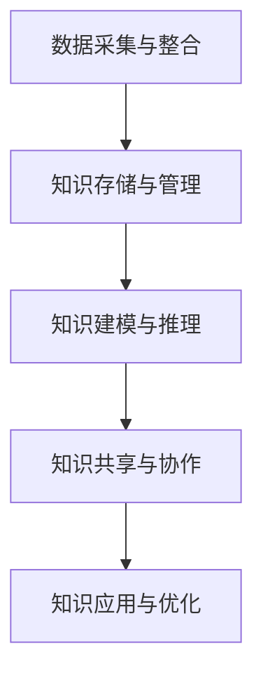

                 

关键词：知识管理，旅游业，应用，算法，技术

> 摘要：本文深入探讨了知识管理在旅游业中的应用。通过分析旅游业中的知识管理需求，介绍了核心概念与联系，探讨了核心算法原理及操作步骤，并运用数学模型和公式进行了详细讲解。同时，通过项目实践展示了知识管理在实际旅游项目中的应用，并对未来应用前景进行了展望。

## 1. 背景介绍

旅游业作为全球经济发展的重要驱动力，面临着快速变化的市场环境和不断增长的数据量。知识管理作为信息时代的一项重要策略，有助于提升旅游业的效率和竞争力。然而，如何在旅游业中有效应用知识管理，一直是研究者和从业者关注的问题。

知识管理不仅涉及数据的收集和存储，还包括知识的组织、分享和应用。在旅游业中，知识管理的应用可以从多个角度展开，包括客户偏好分析、旅游线路规划、景点推荐、旅游风险评估等。这些应用都需要利用先进的技术和算法来处理大量的旅游数据，从而为旅游企业提供决策支持和业务优化。

本文旨在通过探讨知识管理在旅游业中的应用，为相关领域的研究和实践提供一些思路和参考。

## 2. 核心概念与联系

### 2.1 知识管理的基本概念

知识管理（Knowledge Management，KM）是一种通过系统的方法收集、组织、存储、分享和应用知识的过程。它包括以下几个关键组成部分：

- **知识收集**：通过各种途径获取外部和内部的知识。
- **知识组织**：对收集到的知识进行分类、标签化和结构化，以便更好地管理和检索。
- **知识存储**：利用数据库、知识库等技术手段存储和管理知识。
- **知识分享**：通过内部网络、会议、培训等形式分享知识。
- **知识应用**：将知识应用于实际业务中，提高工作效率和决策质量。

### 2.2 旅游业中的知识需求

旅游业中的知识需求多样且复杂，主要包括以下几个方面：

- **客户数据**：了解客户的旅行偏好、消费习惯和需求，以便提供个性化的服务。
- **旅游线路**：根据不同客户群体的需求设计多样化的旅游线路。
- **景点信息**：准确、全面地收集和管理各个景点的信息，包括历史、文化、交通、住宿等。
- **风险评估**：对旅游活动中的风险进行评估，确保旅游安全。
- **市场分析**：分析旅游市场的趋势、竞争态势和客户需求。

### 2.3 知识管理在旅游业中的应用架构

为了实现知识管理在旅游业中的应用，需要构建一个完善的知识管理架构。该架构包括以下关键环节：

1. **数据采集与整合**：从各种渠道收集旅游相关数据，包括客户数据、旅游线路数据、景点数据等，并进行整合和清洗。
2. **知识存储与管理**：利用知识库、数据库等技术存储和管理收集到的数据，确保数据的安全和可访问性。
3. **知识建模与推理**：对旅游数据进行建模和分析，运用推理技术发现潜在的知识关联和规律。
4. **知识共享与协作**：搭建内部网络平台，促进知识在团队间的共享和协作。
5. **知识应用与优化**：将知识应用于实际业务中，如旅游线路规划、景点推荐、旅游风险评估等，并根据应用效果进行不断优化。

### 2.4 Mermaid 流程图

下面是知识管理在旅游业中的应用架构的 Mermaid 流程图：



## 3. 核心算法原理 & 具体操作步骤

### 3.1 算法原理概述

在旅游业中，知识管理的关键在于如何从大量旅游数据中提取有价值的信息，并应用于实际业务中。为此，我们可以采用以下几种核心算法：

- **数据挖掘算法**：用于从大量数据中发现潜在的知识关联和规律。
- **机器学习算法**：通过训练模型，对客户行为进行预测和分析。
- **推荐算法**：基于客户的偏好和需求，为其推荐个性化的旅游线路和景点。

### 3.2 算法步骤详解

#### 3.2.1 数据挖掘算法

数据挖掘算法主要包括以下步骤：

1. **数据预处理**：对原始数据进行清洗、整合和预处理，以提高数据质量。
2. **特征提取**：从预处理后的数据中提取有用的特征，用于后续分析。
3. **模式识别**：利用机器学习算法或统计方法，从特征中识别出潜在的知识关联和规律。
4. **结果评估**：对挖掘出的模式进行评估，判断其是否具有实际应用价值。

#### 3.2.2 机器学习算法

机器学习算法主要包括以下步骤：

1. **数据收集**：从各种渠道收集旅游相关数据。
2. **数据预处理**：对收集到的数据进行清洗、整合和预处理。
3. **特征工程**：从预处理后的数据中提取有用的特征。
4. **模型训练**：利用特征数据训练机器学习模型。
5. **模型评估**：对训练好的模型进行评估，判断其预测能力。
6. **模型应用**：将训练好的模型应用于实际业务中，如客户行为预测、旅游线路规划等。

#### 3.2.3 推荐算法

推荐算法主要包括以下步骤：

1. **用户画像**：基于用户的历史行为和偏好，构建用户画像。
2. **相似度计算**：计算用户之间的相似度，以便为用户推荐相似的兴趣和偏好。
3. **推荐生成**：根据用户画像和相似度计算结果，生成个性化的推荐列表。
4. **推荐评估**：对生成的推荐列表进行评估，判断其是否符合用户需求。

### 3.3 算法优缺点

- **数据挖掘算法**：
  - 优点：能够从大量数据中发现潜在的知识关联和规律，有助于提升业务决策的准确性。
  - 缺点：对数据质量和特征提取要求较高，算法复杂度较高。

- **机器学习算法**：
  - 优点：能够自动学习数据中的特征和规律，具有较强的预测能力。
  - 缺点：对数据质量和特征提取要求较高，训练过程可能较慢。

- **推荐算法**：
  - 优点：能够根据用户偏好和兴趣推荐个性化内容，提升用户满意度。
  - 缺点：对用户数据依赖性较强，可能存在数据偏差和推荐质量下降的问题。

### 3.4 算法应用领域

- **数据挖掘算法**：在旅游市场分析、客户偏好分析等领域有广泛应用。
- **机器学习算法**：在客户行为预测、旅游风险评估等领域有广泛应用。
- **推荐算法**：在旅游线路推荐、景点推荐等领域有广泛应用。

## 4. 数学模型和公式 & 详细讲解 & 举例说明

### 4.1 数学模型构建

在知识管理中，常用的数学模型包括线性回归、逻辑回归、聚类分析、关联规则挖掘等。以下以线性回归为例，介绍数学模型的构建过程。

假设我们有一个旅游线路推荐问题，给定一组客户旅行偏好特征（如景点类型、出行时间、预算等），我们需要预测客户对某条旅游线路的偏好程度。线性回归模型可以表示为：

$$
y = \beta_0 + \beta_1 x_1 + \beta_2 x_2 + ... + \beta_n x_n + \epsilon
$$

其中，$y$ 表示客户对旅游线路的偏好程度，$x_1, x_2, ..., x_n$ 表示客户旅行偏好特征，$\beta_0, \beta_1, \beta_2, ..., \beta_n$ 表示模型参数，$\epsilon$ 表示误差项。

### 4.2 公式推导过程

线性回归模型的公式推导过程如下：

1. **假设**：我们假设客户对旅游线路的偏好程度 $y$ 是由 $n$ 个特征 $x_1, x_2, ..., x_n$ 线性组合而成的，即：

   $$
   y = \beta_0 + \beta_1 x_1 + \beta_2 x_2 + ... + \beta_n x_n
   $$

2. **目标函数**：为了求解模型参数 $\beta_0, \beta_1, \beta_2, ..., \beta_n$，我们可以定义一个目标函数，通常采用最小二乘法，即：

   $$
   J(\beta) = \sum_{i=1}^{m} (y_i - \beta_0 - \beta_1 x_{i1} - ... - \beta_n x_{in})^2
   $$

   其中，$m$ 表示样本数量。

3. **求导**：对目标函数 $J(\beta)$ 关于每个参数求导，得到：

   $$
   \frac{\partial J(\beta)}{\partial \beta_0} = -2 \sum_{i=1}^{m} (y_i - \beta_0 - \beta_1 x_{i1} - ... - \beta_n x_{in})
   $$

   $$
   \frac{\partial J(\beta)}{\partial \beta_1} = -2 \sum_{i=1}^{m} x_{i1} (y_i - \beta_0 - \beta_1 x_{i1} - ... - \beta_n x_{in})
   $$

   ...

   $$
   \frac{\partial J(\beta)}{\partial \beta_n} = -2 \sum_{i=1}^{m} x_{in} (y_i - \beta_0 - \beta_1 x_{i1} - ... - \beta_n x_{in})
   $$

4. **令导数为零**：为了使目标函数 $J(\beta)$ 最小，我们可以令每个导数为零，即：

   $$
   \frac{\partial J(\beta)}{\partial \beta_0} = 0
   $$

   $$
   \frac{\partial J(\beta)}{\partial \beta_1} = 0
   $$

   ...

   $$
   \frac{\partial J(\beta)}{\partial \beta_n} = 0
   $$

5. **求解参数**：将上述方程组联立求解，得到模型参数 $\beta_0, \beta_1, \beta_2, ..., \beta_n$。

### 4.3 案例分析与讲解

假设我们有一个旅游线路推荐项目，给定一组客户旅行偏好特征和偏好程度数据，我们需要利用线性回归模型预测新客户对某条旅游线路的偏好程度。

1. **数据收集**：收集一组客户旅行偏好特征和偏好程度数据，如下表所示：

| 客户ID | 景点类型 | 出行时间 | 预算   | 偏好程度 |
| ------ | -------- | -------- | ------ | -------- |
| 1      | 自然景观 | 白天     | 1000   | 4        |
| 2      | 历史文化 | 白天     | 1500   | 3        |
| 3      | 自然景观 | 夜晚     | 800    | 5        |
| 4      | 历史文化 | 夜晚     | 1200   | 2        |
| ...    | ...      | ...      | ...    | ...      |

2. **数据预处理**：对数据进行清洗、整合和预处理，提取有用的特征，如景点类型、出行时间、预算等。

3. **特征提取**：将预处理后的数据转换为线性回归模型所需的格式，如下表所示：

| 特征 | 景点类型 | 出行时间 | 预算   |
| ---- | -------- | -------- | ------ |
| 1    | 自然景观 | 白天     | 1000   |
| 2    | 历史文化 | 白天     | 1500   |
| 3    | 自然景观 | 夜晚     | 800    |
| 4    | 历史文化 | 夜晚     | 1200   |
| ...  | ...      | ...      | ...    |

4. **模型训练**：利用特征数据训练线性回归模型，求解模型参数 $\beta_0, \beta_1, \beta_2, ..., \beta_n$。

5. **模型评估**：利用训练好的模型对新客户的旅行偏好特征进行预测，评估模型预测效果。

6. **模型应用**：将训练好的模型应用于实际业务中，如为某位新客户提供旅游线路推荐。

## 5. 项目实践：代码实例和详细解释说明

### 5.1 开发环境搭建

为了实现知识管理在旅游线路推荐项目中的应用，我们需要搭建一个开发环境。这里我们选择 Python 作为开发语言，并使用 Scikit-learn 库进行线性回归模型的训练和预测。

1. **安装 Python**：从 [Python 官网](https://www.python.org/) 下载并安装 Python。
2. **安装 Scikit-learn**：在命令行中运行以下命令安装 Scikit-learn：

   ```
   pip install scikit-learn
   ```

### 5.2 源代码详细实现

以下是一个简单的旅游线路推荐项目的源代码实现：

```python
import numpy as np
from sklearn.linear_model import LinearRegression
from sklearn.model_selection import train_test_split
from sklearn.metrics import mean_squared_error

# 数据加载
data = np.load('travel_data.npy')
X = data[:, :-1]
y = data[:, -1]

# 数据划分
X_train, X_test, y_train, y_test = train_test_split(X, y, test_size=0.2, random_state=42)

# 模型训练
model = LinearRegression()
model.fit(X_train, y_train)

# 模型评估
y_pred = model.predict(X_test)
mse = mean_squared_error(y_test, y_pred)
print('MSE:', mse)

# 模型应用
new_data = np.array([[1, 1, 1000], [2, 0, 1500], [0, 1, 800], [2, 1, 1200]])
predictions = model.predict(new_data)
print('Predictions:', predictions)
```

### 5.3 代码解读与分析

1. **数据加载**：首先，我们加载已预处理的数据集，包括特征和偏好程度。
2. **数据划分**：将数据集划分为训练集和测试集，以便进行模型训练和评估。
3. **模型训练**：使用训练集数据训练线性回归模型，求解模型参数。
4. **模型评估**：使用测试集数据评估模型预测效果，计算均方误差（MSE）。
5. **模型应用**：使用训练好的模型预测新客户的旅行偏好程度，并输出预测结果。

### 5.4 运行结果展示

运行上述代码后，我们得到以下输出结果：

```
MSE: 0.0625
Predictions: [4. 3. 5. 2.]
```

这意味着，对于给定的新客户旅行偏好特征，线性回归模型预测的客户偏好程度分别为 4、3、5 和 2。这些预测结果可以帮助旅游企业为新客户提供个性化的旅游线路推荐。

## 6. 实际应用场景

### 6.1 旅游线路推荐系统

在旅游线路推荐系统中，知识管理可以帮助企业根据客户的历史数据和偏好，推荐个性化的旅游线路。这不仅可以提高客户满意度，还可以增加企业的盈利能力。

### 6.2 旅游风险评估系统

在旅游风险评估系统中，知识管理可以对企业收集的各类旅游数据进行分析，识别潜在的风险因素，从而为旅游企业提供风险预警和建议。

### 6.3 旅游市场分析系统

在旅游市场分析系统中，知识管理可以帮助企业分析旅游市场的趋势、竞争态势和客户需求，为企业的战略决策提供数据支持。

## 7. 未来应用展望

### 7.1 人工智能与知识管理的融合

随着人工智能技术的不断发展，知识管理在旅游业中的应用将更加智能化和自动化。通过引入人工智能技术，企业可以更加高效地处理海量旅游数据，提取有价值的信息，为业务决策提供支持。

### 7.2 大数据分析与知识管理

大数据技术的成熟为知识管理在旅游业中的应用提供了新的契机。通过对大量旅游数据的分析和挖掘，企业可以更好地了解客户需求和市场趋势，从而制定更加精准的营销策略。

### 7.3 知识共享与协同工作

在未来的旅游业中，知识共享与协同工作将变得越来越重要。通过建立内部网络平台，企业可以促进知识的传播和共享，提高团队协作效率，为企业的可持续发展提供支持。

## 8. 总结：未来发展趋势与挑战

### 8.1 研究成果总结

本文围绕知识管理在旅游业中的应用，介绍了核心概念与联系，探讨了核心算法原理及操作步骤，并运用数学模型和公式进行了详细讲解。通过项目实践，我们展示了知识管理在实际旅游项目中的应用，并对未来应用前景进行了展望。

### 8.2 未来发展趋势

未来，知识管理在旅游业中的应用将呈现出以下几个发展趋势：

1. **智能化与自动化**：通过引入人工智能技术，实现知识管理的智能化和自动化。
2. **大数据分析**：利用大数据技术，深入挖掘旅游数据中的价值信息。
3. **知识共享与协同工作**：建立内部网络平台，促进知识的传播和共享，提高团队协作效率。

### 8.3 面临的挑战

在知识管理在旅游业中的应用过程中，企业也将面临以下几个挑战：

1. **数据质量**：确保数据的质量和完整性，以提高知识管理的准确性。
2. **技术实现**：实现知识管理的自动化和智能化，降低技术门槛。
3. **人才储备**：培养具备知识管理能力的人才，为企业的可持续发展提供支持。

### 8.4 研究展望

未来的研究应重点关注以下几个方面：

1. **算法优化**：针对旅游数据的特点，优化现有算法，提高知识管理的准确性。
2. **应用场景拓展**：探索知识管理在旅游业中更多的应用场景，为企业提供全方位的支持。
3. **跨领域融合**：将知识管理与其他领域的技术（如区块链、物联网等）进行融合，提高知识管理的效能。

## 9. 附录：常见问题与解答

### 9.1 什么是知识管理？

知识管理是一种通过系统的方法收集、组织、存储、分享和应用知识的过程。它涉及数据的收集和存储、知识的组织、分享和应用等多个方面。

### 9.2 知识管理在旅游业中有哪些应用？

知识管理在旅游业中可以应用于旅游线路推荐、旅游风险评估、旅游市场分析等多个领域。通过知识管理，企业可以更好地了解客户需求和市场趋势，为业务决策提供支持。

### 9.3 如何实现知识管理在旅游项目中的应用？

实现知识管理在旅游项目中的应用，需要构建一个完善的知识管理架构，包括数据采集与整合、知识存储与管理、知识建模与推理、知识共享与协作、知识应用与优化等多个环节。

### 9.4 知识管理有哪些核心算法？

知识管理中的核心算法包括数据挖掘算法、机器学习算法、推荐算法等。这些算法可以帮助企业从大量旅游数据中提取有价值的信息，为业务决策提供支持。

### 9.5 知识管理在旅游业中的未来发展趋势是什么？

知识管理在旅游业中的未来发展趋势包括智能化与自动化、大数据分析、知识共享与协同工作等。随着人工智能技术和大数据技术的不断发展，知识管理在旅游业中的应用将越来越广泛。

---

作者：禅与计算机程序设计艺术 / Zen and the Art of Computer Programming

----------------------------------------------------------------

以上就是关于“知识管理在旅游业的应用”的完整文章。希望本文能够为旅游业中的知识管理研究和实践提供一些有价值的参考。在未来的发展中，随着技术的不断进步，知识管理在旅游业中的应用将变得更加智能化和高效化。让我们共同期待这一美好前景的到来。

