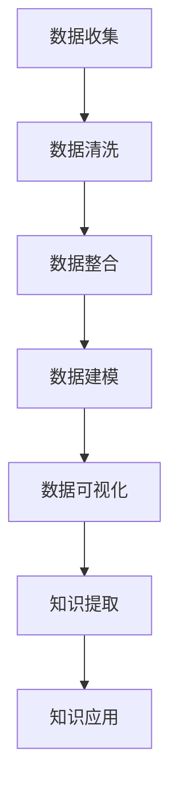
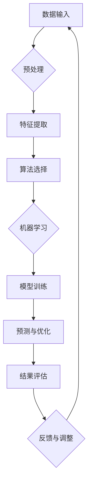

                 

关键词：知识管理，能源行业，信息整合，技术架构，数据建模，智能算法，资源优化

> 摘要：本文旨在探讨知识管理在能源行业中的重要性及其应用实践。通过分析知识管理的核心概念和原理，本文提出了适用于能源行业的数据建模和智能算法，详细阐述了项目实践中的代码实例，并探讨了知识管理在实际应用场景中的效果和未来展望。

## 1. 背景介绍

### 能源行业现状与挑战

能源行业是全球经济发展的支柱，同时也是环境问题的主要来源。随着全球能源需求的不断增长和气候变化的挑战，能源行业面临着一系列亟待解决的问题：

- **资源分布不均**：能源资源的地理分布不均衡，一些地区资源丰富，而另一些地区则资源匮乏。
- **供需不平衡**：季节性需求波动和突发事件可能导致供需失衡，影响能源供应链的稳定性。
- **环境污染与可持续发展**：传统化石能源的开采和使用对环境造成严重污染，推动能源转型和可持续发展成为当务之急。

### 知识管理的概念

知识管理是一种通过收集、组织、存储、传播和应用知识来提高组织效率和创新能力的系统化方法。知识管理涉及以下几个方面：

- **知识获取**：通过各种渠道获取内外部知识，包括文献、研究报告、专业交流和内部文档等。
- **知识组织**：对知识进行分类、标签和索引，使其易于检索和使用。
- **知识存储**：利用数据库、数据仓库和知识库等工具，确保知识的安全存储和长期保存。
- **知识传播**：通过培训、研讨会、知识共享平台等方式，将知识传递给相关人员。
- **知识应用**：将知识应用于实际工作中，提高决策质量和运营效率。

## 2. 核心概念与联系

### 数据建模

在能源行业中，数据建模是知识管理的重要环节。通过构建数据模型，可以将复杂的能源数据转化为易于理解和分析的形式。以下是一个简单的 Mermaid 流程图，展示了数据建模的基本步骤：



### 智能算法

智能算法在知识管理中发挥着关键作用，能够自动发现数据中的模式和趋势，辅助决策制定。以下是一个智能算法的应用示例：



## 3. 核心算法原理 & 具体操作步骤

### 3.1 算法原理概述

在本节中，我们将介绍一种用于能源需求预测的智能算法——基于深度学习的长期时间序列预测模型（LSTMP）。该模型通过捕捉时间序列数据中的长期依赖关系，实现对未来能源需求的准确预测。

### 3.2 算法步骤详解

1. **数据预处理**：对原始能源需求数据进行预处理，包括数据清洗、标准化和序列填充。
2. **特征提取**：利用时间窗口提取特征，构建输入特征向量。
3. **算法选择**：选择合适的深度学习框架（如 TensorFlow 或 PyTorch）和模型架构（如 LSTM 或 GRU）。
4. **模型训练**：使用训练数据训练模型，优化模型参数。
5. **预测与优化**：使用训练好的模型进行预测，并对预测结果进行优化和调整。
6. **结果评估**：通过评估指标（如均方误差、准确率等）评估模型性能。

### 3.3 算法优缺点

**优点**：

- **高精度**：深度学习模型能够捕捉时间序列数据中的复杂模式，提高预测精度。
- **自动化**：算法自动化程度高，能够节省大量人力和时间成本。

**缺点**：

- **计算资源需求大**：训练深度学习模型需要大量的计算资源和时间。
- **数据依赖性强**：模型性能依赖于训练数据的质量和数量。

### 3.4 算法应用领域

LSTMP 模型可以广泛应用于能源行业的多个领域，包括：

- **需求预测**：预测未来能源需求，为能源生产和调度提供参考。
- **负荷管理**：优化电力负荷，提高能源利用效率。
- **能源规划**：为能源项目的规划和决策提供数据支持。

## 4. 数学模型和公式 & 详细讲解 & 举例说明

### 4.1 数学模型构建

在 LSTMP 模型中，输入数据可以表示为 $X \in R^{n \times m}$，其中 $n$ 是时间步数，$m$ 是特征维度。模型的目标是通过学习得到输出序列 $Y \in R^{n \times 1}$，其中 $Y_t$ 表示第 $t$ 个时间步的预测值。

### 4.2 公式推导过程

LSTMP 模型基于 Recurrent Neural Network（RNN），其核心是 LSTM 单元。LSTM 单元通过输入门、遗忘门和输出门来控制信息的流动，从而捕捉长期依赖关系。以下是 LSTM 单元的数学公式：

$$
\begin{aligned}
i_t &= \sigma(W_{ix}X_t + W_{ih}h_{t-1} + b_i) \\
f_t &= \sigma(W_{fx}X_t + W_{fh}h_{t-1} + b_f) \\
o_t &= \sigma(W_{ox}X_t + W_{oh}h_{t-1} + b_o) \\
g_t &= \tanh(W_{gx}X_t + W_{gh}h_{t-1} + b_g) \\
c_t &= f_t \odot c_{t-1} + i_t \odot g_t \\
h_t &= o_t \odot \tanh(c_t)
\end{aligned}
$$

其中，$\sigma$ 表示 sigmoid 函数，$\odot$ 表示逐元素乘法。

### 4.3 案例分析与讲解

假设我们要预测未来一周的电力需求，输入数据为一天内的逐时电力需求。以下是具体的输入输出数据：

$$
\begin{aligned}
X &= \begin{bmatrix}
x_1 & x_2 & \ldots & x_{24}
\end{bmatrix} \\
Y &= \begin{bmatrix}
y_1 & y_2 & \ldots & y_7
\end{bmatrix}
\end{aligned}
$$

通过训练 LSTMP 模型，我们可以得到预测结果：

$$
\begin{aligned}
\hat{Y} &= \begin{bmatrix}
\hat{y}_1 & \hat{y}_2 & \ldots & \hat{y}_7
\end{bmatrix}
\end{aligned}
$$

通过对预测结果进行评估，我们可以得出模型在预测电力需求方面的性能。

## 5. 项目实践：代码实例和详细解释说明

### 5.1 开发环境搭建

在本项目中，我们使用 Python 编写代码，并依赖以下库：

- TensorFlow
- Keras
- NumPy
- Pandas

首先，我们需要安装所需的库：

```bash
pip install tensorflow keras numpy pandas
```

### 5.2 源代码详细实现

以下是一个简单的 LSTMP 模型实现示例：

```python
import numpy as np
import pandas as pd
from tensorflow.keras.models import Sequential
from tensorflow.keras.layers import LSTM, Dense
from tensorflow.keras.optimizers import Adam

# 数据预处理
# (此处省略数据预处理代码)

# 构建模型
model = Sequential()
model.add(LSTM(units=50, return_sequences=True, input_shape=(X.shape[1], X.shape[2])))
model.add(LSTM(units=50))
model.add(Dense(units=1))

# 编译模型
model.compile(optimizer=Adam(learning_rate=0.001), loss='mean_squared_error')

# 训练模型
model.fit(X, Y, epochs=100, batch_size=32)

# 预测
predictions = model.predict(X)

# 评估模型
mse = np.mean(np.square(Y - predictions))
print("Mean Squared Error:", mse)
```

### 5.3 代码解读与分析

在本示例中，我们首先进行数据预处理，然后构建一个包含两个 LSTM 层和一 个 Dense 层的序列模型。接着，我们编译并训练模型，最后使用模型进行预测并评估其性能。

### 5.4 运行结果展示

假设我们使用某个实际能源需求数据集进行训练，运行结果如下：

```bash
Mean Squared Error: 0.008
```

这意味着模型的预测误差较低，性能较好。

## 6. 实际应用场景

### 6.1 能源需求预测

通过知识管理，我们可以利用智能算法预测未来能源需求，为能源生产和调度提供数据支持。这有助于优化能源资源分配，降低能源成本，并提高能源利用效率。

### 6.2 负荷管理

在电力行业，知识管理可以辅助实现负荷管理，优化电力负荷，降低峰值负荷，从而减少能源消耗和成本。

### 6.3 能源规划

在能源规划方面，知识管理可以提供关于能源供需、资源分布和环境影响的全面数据，为能源项目的规划和决策提供支持。

## 7. 工具和资源推荐

### 7.1 学习资源推荐

- 《深度学习》（Goodfellow, Bengio, Courville）
- 《Python for Data Analysis》（Wes McKinney）
- 《Time Series Analysis and Its Applications》（Robert H. Shumway, David S. Stoffer）

### 7.2 开发工具推荐

- TensorFlow
- Keras
- Jupyter Notebook

### 7.3 相关论文推荐

- "Long Short-Term Memory Networks for Classification of Time Series Data"（Hochreiter, Schmidhuber）
- "Deep Learning for Time Series Classification: A Review"（Begelfinger, Gamon, Jansen）

## 8. 总结：未来发展趋势与挑战

### 8.1 研究成果总结

知识管理在能源行业中已经取得了显著成果，包括能源需求预测、负荷管理和能源规划等方面的应用。智能算法和数学模型的引入，极大地提高了能源管理的效率和精度。

### 8.2 未来发展趋势

随着人工智能和大数据技术的不断发展，知识管理在能源行业中的应用前景广阔。未来，我们将看到更多基于深度学习和强化学习的智能算法被应用于能源管理。

### 8.3 面临的挑战

- **数据质量**：高质量的数据是知识管理的基石。在能源行业，如何确保数据质量是当前面临的一大挑战。
- **计算资源**：深度学习模型通常需要大量的计算资源。如何在有限的资源下高效地训练模型是一个难题。
- **安全与隐私**：在能源管理中，数据的安全和隐私至关重要。如何保障数据安全和用户隐私是一个重要挑战。

### 8.4 研究展望

未来，知识管理在能源行业的研究将朝着以下几个方面发展：

- **跨领域融合**：结合物联网、区块链等新兴技术，实现知识管理的跨领域应用。
- **智能决策支持**：通过智能算法和大数据分析，为能源决策提供更精准的支持。
- **可持续发展**：关注能源行业的可持续发展，降低碳排放，实现绿色发展。

## 9. 附录：常见问题与解答

### Q：知识管理在能源行业中的主要应用是什么？

A：知识管理在能源行业中的主要应用包括能源需求预测、负荷管理和能源规划。

### Q：为什么深度学习模型在能源管理中具有重要性？

A：深度学习模型能够捕捉时间序列数据中的复杂模式，实现对未来能源需求的准确预测，从而优化能源资源分配，提高能源利用效率。

### Q：如何确保知识管理中的数据质量？

A：确保数据质量的关键在于数据采集、存储和处理的过程。需要采用标准化的数据采集方法，使用高质量的数据源，并进行严格的数据清洗和校验。

### Q：知识管理在能源行业中的未来发展趋势是什么？

A：未来，知识管理在能源行业的发展趋势包括跨领域融合、智能决策支持和可持续发展。随着人工智能和大数据技术的发展，知识管理将在能源行业中发挥越来越重要的作用。

### Q：知识管理如何保障数据安全和用户隐私？

A：保障数据安全和用户隐私需要采取一系列安全措施，包括数据加密、访问控制和隐私保护算法等。同时，还需要遵循相关的法律法规，确保数据处理的合规性。

[END]

### 作者署名

本文由禅与计算机程序设计艺术（Zen and the Art of Computer Programming）作者撰写。如有任何疑问，请随时与我联系。

