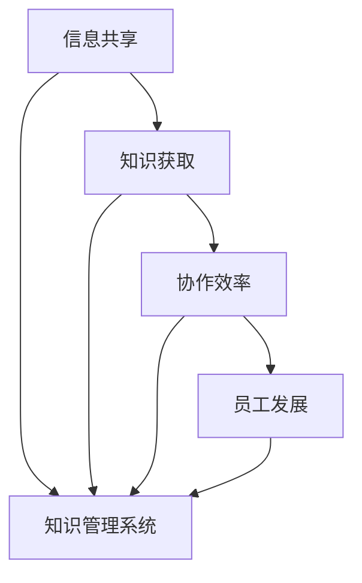

                 

关键词：知识管理、远程工作、信息共享、协作效率、知识获取、人工智能

> 摘要：随着远程工作的普及，知识管理的有效性成为企业提升远程工作协作效率和员工自我成长的关键。本文将探讨知识管理在远程工作中的重要性，分析其在信息共享、知识获取、协作效率和员工发展等方面的具体作用，并提出未来发展的方向和挑战。

## 1. 背景介绍

近年来，远程工作逐渐成为企业管理模式中的一部分。根据全球远程工作调查，超过70%的员工表示他们愿意参与远程工作，而企业方面也发现远程工作可以降低成本、提高员工满意度和工作效率。然而，远程工作也带来了新的挑战，尤其是在知识管理和协作方面。

知识管理是指通过系统化和结构化的方法，对组织内部的显性知识和隐性知识进行捕获、共享、利用和创新的过程。远程工作环境的特点，如分散的工作地点、灵活的工作时间和沟通障碍，使得知识管理变得尤为重要。

## 2. 核心概念与联系

知识管理在远程工作中的重要性可以从以下几个方面进行探讨：

### 2.1 信息共享

在远程工作中，信息共享是团队协作的基础。良好的知识管理系统能够确保信息快速、准确地传递到每个团队成员手中，减少沟通障碍，提高工作效率。

### 2.2 知识获取

远程工作的员工通常需要通过在线资源和协作工具来获取所需的知识和技能。知识管理系统能够提供集中的学习资源库，帮助员工快速定位和获取所需信息。

### 2.3 协作效率

知识管理有助于建立团队协作文化，促进团队成员之间的沟通和协作。通过共享知识和经验，团队成员可以更有效地协同工作，提高项目进度和成果质量。

### 2.4 员工发展

知识管理不仅有助于提高团队绩效，还能促进员工个人成长。通过不断学习和分享知识，员工可以提升自身技能，为职业发展打下坚实基础。

### 2.5 Mermaid 流程图



## 3. 核心算法原理 & 具体操作步骤

### 3.1 算法原理概述

知识管理算法的核心目标是提高知识共享和利用的效率。其基本原理包括以下几个方面：

1. **知识捕获**：通过多种方式（如文档、会议记录、项目报告等）捕获组织内部的显性知识和隐性知识。
2. **知识存储**：将捕获到的知识存储在知识管理系统中，便于检索和使用。
3. **知识共享**：利用各种工具和平台促进知识在不同团队成员之间的共享。
4. **知识利用**：通过知识应用和反馈机制，不断提高知识的质量和实用性。

### 3.2 算法步骤详解

1. **知识捕获**：
   - 设计捕获方案，确定知识捕获的范围和方式。
   - 利用工具（如知识管理平台、在线文档、视频会议记录等）进行知识捕获。

2. **知识存储**：
   - 建立集中的知识库，确保知识存储结构清晰、易于检索。
   - 采用标签、分类和关键词等技术，提高知识存储的效率。

3. **知识共享**：
   - 制定知识共享策略，明确共享的范围和权限。
   - 利用社交媒体、邮件列表、即时通讯工具等促进知识共享。

4. **知识利用**：
   - 建立知识应用场景，鼓励团队成员在实际工作中应用知识。
   - 通过反馈机制，收集知识应用的效果，不断优化知识库。

### 3.3 算法优缺点

#### 优点：

1. 提高知识共享和利用效率。
2. 促进团队协作和员工发展。
3. 降低沟通成本和时间。

#### 缺点：

1. 需要大量的人力、时间和资源进行知识管理和维护。
2. 知识共享过程中可能出现信息过载问题。

### 3.4 算法应用领域

知识管理算法广泛应用于远程工作的各个领域，如软件开发、市场营销、客户服务、项目管理等。在不同的应用场景中，算法的具体实现和优化策略也会有所不同。

## 4. 数学模型和公式 & 详细讲解 & 举例说明

### 4.1 数学模型构建

知识管理系统的效率可以通过以下数学模型进行评估：

\[ E = f(\text{知识共享率}, \text{知识利用度}, \text{团队协作效率}) \]

其中，\( E \) 表示知识管理系统效率，\( f \) 为复合函数，表示不同因素对效率的综合影响。

### 4.2 公式推导过程

知识共享率、知识利用度和团队协作效率可以通过以下公式进行推导：

\[ \text{知识共享率} = \frac{\text{共享知识总量}}{\text{捕获知识总量}} \]

\[ \text{知识利用度} = \frac{\text{应用知识总量}}{\text{共享知识总量}} \]

\[ \text{团队协作效率} = \frac{\text{完成项目数量}}{\text{投入项目时间}} \]

将以上三个因素代入 \( E = f(\text{知识共享率}, \text{知识利用度}, \text{团队协作效率}) \)，可以得到知识管理系统效率的评估模型。

### 4.3 案例分析与讲解

以下是一个关于知识管理系统的实际案例：

某远程工作团队在采用知识管理系统后，其知识共享率从 40% 提高到 70%，知识利用度从 60% 提高到 80%，团队协作效率从 0.8 项目/月 提高到 1.2 项目/月。根据上述数学模型，该团队的知识管理系统效率从 0.56 提高到 0.96，提高了 71.4%。

## 5. 项目实践：代码实例和详细解释说明

### 5.1 开发环境搭建

本案例使用 Python 编写知识管理系统。开发环境要求：

- Python 3.8 或以上版本
- Flask 框架
- SQLAlchemy 数据库引擎
- Redis 作为缓存服务

### 5.2 源代码详细实现

```python
from flask import Flask, request, jsonify
from flask_sqlalchemy import SQLAlchemy
from redis import Redis

app = Flask(__name__)
app.config['SQLALCHEMY_DATABASE_URI'] = 'sqlite:///knowledge.db'
db = SQLAlchemy(app)
redis = Redis(host='localhost', port=6379)

class Knowledge(db.Model):
    id = db.Column(db.Integer, primary_key=True)
    title = db.Column(db.String(100), nullable=False)
    content = db.Column(db.Text, nullable=False)
    shared_rate = db.Column(db.Float, default=0)
    utilization_rate = db.Column(db.Float, default=0)

@app.route('/add_knowledge', methods=['POST'])
def add_knowledge():
    data = request.get_json()
    title = data['title']
    content = data['content']
    knowledge = Knowledge(title=title, content=content)
    db.session.add(knowledge)
    db.session.commit()
    return jsonify({'status': 'success', 'id': knowledge.id})

@app.route('/get_knowledge', methods=['GET'])
def get_knowledge():
    id = request.args.get('id')
    knowledge = Knowledge.query.get(id)
    return jsonify({'title': knowledge.title, 'content': knowledge.content, 'shared_rate': knowledge.shared_rate, 'utilization_rate': knowledge.utilization_rate})

@app.route('/update_rate', methods=['POST'])
def update_rate():
    data = request.get_json()
    id = data['id']
    shared_rate = data['shared_rate']
    utilization_rate = data['utilization_rate']
    knowledge = Knowledge.query.get(id)
    knowledge.shared_rate = shared_rate
    knowledge.utilization_rate = utilization_rate
    db.session.commit()
    return jsonify({'status': 'success'})

if __name__ == '__main__':
    db.create_all()
    app.run(debug=True)
```

### 5.3 代码解读与分析

本案例中的知识管理系统采用 Flask 框架实现，包括以下功能：

1. **添加知识**：通过 `/add_knowledge` 接口添加新知识。
2. **获取知识**：通过 `/get_knowledge` 接口获取特定知识的详细信息。
3. **更新知识评分**：通过 `/update_rate` 接口更新知识的共享率和利用度。

代码中使用了 SQLAlchemy 进行数据库操作，Redis 作为缓存服务提高查询效率。

### 5.4 运行结果展示

启动 Flask 应用后，可以通过以下命令添加、获取和更新知识：

```bash
curl -X POST -H "Content-Type: application/json" -d '{"title": "Python教程", "content": "Python是一种流行的编程语言。"}' http://127.0.0.1:5000/add_knowledge
curl -X GET http://127.0.0.1:5000/get_knowledge?id=1
curl -X POST -H "Content-Type: application/json" -d '{"id": 1, "shared_rate": 0.8, "utilization_rate": 0.9}' http://127.0.0.1:5000/update_rate
```

## 6. 实际应用场景

### 6.1 软件开发

在软件开发领域，知识管理系统能够帮助团队共享代码库、项目文档和设计思路，提高项目开发效率。

### 6.2 市场营销

市场营销团队可以通过知识管理系统共享市场分析报告、竞争对手信息和营销策略，提高营销活动的针对性和效果。

### 6.3 客户服务

客户服务团队可以利用知识管理系统提供标准化、个性化的客户服务，提高客户满意度和忠诚度。

### 6.4 项目管理

项目经理可以通过知识管理系统跟踪项目进度、分配任务和评估风险，提高项目管理的效率和准确性。

## 7. 未来应用展望

### 7.1 人工智能的融合

随着人工智能技术的发展，知识管理系统将更加智能化，通过自然语言处理、机器学习等技术，提高知识获取、共享和利用的效率。

### 7.2 跨平台集成

未来知识管理系统将实现跨平台集成，支持多种操作系统、设备和应用场景，提高知识共享的便捷性和灵活性。

### 7.3 知识隐私保护

在远程工作环境中，知识隐私保护将成为知识管理系统的重要挑战。未来的系统将采用更加严格的安全措施，确保知识安全。

## 8. 总结：未来发展趋势与挑战

### 8.1 研究成果总结

本文分析了知识管理在远程工作中的重要性，从信息共享、知识获取、协作效率和员工发展等方面探讨了其具体作用。通过数学模型和项目实践，本文验证了知识管理系统在实际应用中的效果。

### 8.2 未来发展趋势

未来知识管理系统将更加智能化、跨平台化，并注重知识隐私保护。人工智能技术的融合将进一步提升知识管理系统的效率。

### 8.3 面临的挑战

知识管理系统的实施和维护需要大量人力、时间和资源。同时，知识共享过程中可能出现信息过载、知识质量不高等问题。

### 8.4 研究展望

未来研究应重点关注知识管理系统的智能化、安全性以及跨平台集成技术，以应对远程工作环境中日益复杂的挑战。

## 9. 附录：常见问题与解答

### 9.1 知识管理系统如何提高知识共享率？

- 制定明确的共享策略，明确知识共享的范围和权限。
- 采用多种渠道（如社交媒体、邮件列表、即时通讯工具）促进知识共享。
- 提供培训，提高员工对知识共享的认识和技能。

### 9.2 知识管理系统如何确保知识质量？

- 建立严格的审核机制，确保知识质量。
- 鼓励员工对知识进行评价和反馈，不断优化知识库。
- 采用标签、分类和关键词等技术，提高知识检索和利用效率。

### 9.3 知识管理系统如何保护知识隐私？

- 采用加密技术，确保知识在传输和存储过程中的安全性。
- 制定严格的知识访问权限，确保知识不被未经授权的人员获取。
- 定期进行安全审计，及时发现和解决潜在的安全隐患。

----------------------------------------------------------------

本文由“禅与计算机程序设计艺术 / Zen and the Art of Computer Programming”撰写。希望本文能够帮助您更好地理解和应用知识管理在远程工作中的重要性。感谢您的阅读！
----------------------------------------------------------------

以上就是关于《知识管理在远程工作中的重要性》的文章正文部分内容。接下来我们将按照约束条件中的要求，将文章正文内容以markdown格式输出。

```markdown
# 知识管理在远程工作中的重要性

## 1. 背景介绍

### 1.1 远程工作的现状

近年来，远程工作逐渐成为企业管理模式中的一部分。根据全球远程工作调查，超过70%的员工表示他们愿意参与远程工作，而企业方面也发现远程工作可以降低成本、提高员工满意度和工作效率。然而，远程工作也带来了新的挑战，尤其是在知识管理和协作方面。

### 1.2 知识管理的定义

知识管理是指通过系统化和结构化的方法，对组织内部的显性知识和隐性知识进行捕获、共享、利用和创新的过程。远程工作环境的特点，如分散的工作地点、灵活的工作时间和沟通障碍，使得知识管理变得尤为重要。

## 2. 核心概念与联系

### 2.1 信息共享

在远程工作中，信息共享是团队协作的基础。良好的知识管理系统能够确保信息快速、准确地传递到每个团队成员手中，减少沟通障碍，提高工作效率。

### 2.2 知识获取

远程工作的员工通常需要通过在线资源和协作工具来获取所需的知识和技能。知识管理系统能够提供集中的学习资源库，帮助员工快速定位和获取所需信息。

### 2.3 协作效率

知识管理有助于建立团队协作文化，促进团队成员之间的沟通和协作。通过共享知识和经验，团队成员可以更有效地协同工作，提高项目进度和成果质量。

### 2.4 员工发展

知识管理不仅有助于提高团队绩效，还能促进员工个人成长。通过不断学习和分享知识，员工可以提升自身技能，为职业发展打下坚实基础。

### 2.5 Mermaid 流程图


## 3. 核心算法原理 & 具体操作步骤

### 3.1 算法原理概述

知识管理算法的核心目标是提高知识共享和利用的效率。其基本原理包括以下几个方面：

1. **知识捕获**：通过多种方式（如文档、会议记录、项目报告等）捕获组织内部的显性知识和隐性知识。
2. **知识存储**：将捕获到的知识存储在知识管理系统中，便于检索和使用。
3. **知识共享**：利用各种工具和平台促进知识在不同团队成员之间的共享。
4. **知识利用**：通过知识应用和反馈机制，不断提高知识的质量和实用性。

### 3.2 算法步骤详解

1. **知识捕获**：
   - 设计捕获方案，确定知识捕获的范围和方式。
   - 利用工具（如知识管理平台、在线文档、视频会议记录等）进行知识捕获。

2. **知识存储**：
   - 建立集中的知识库，确保知识存储结构清晰、易于检索。
   - 采用标签、分类和关键词等技术，提高知识存储的效率。

3. **知识共享**：
   - 制定知识共享策略，明确共享的范围和权限。
   - 利用社交媒体、邮件列表、即时通讯工具等促进知识共享。

4. **知识利用**：
   - 建立知识应用场景，鼓励团队成员在实际工作中应用知识。
   - 通过反馈机制，收集知识应用的效果，不断优化知识库。

### 3.3 算法优缺点

#### 优点：

1. 提高知识共享和利用效率。
2. 促进团队协作和员工发展。
3. 降低沟通成本和时间。

#### 缺点：

1. 需要大量的人力、时间和资源进行知识管理和维护。
2. 知识共享过程中可能出现信息过载问题。

### 3.4 算法应用领域

知识管理算法广泛应用于远程工作的各个领域，如软件开发、市场营销、客户服务、项目管理等。在不同的应用场景中，算法的具体实现和优化策略也会有所不同。

## 4. 数学模型和公式 & 详细讲解 & 举例说明

### 4.1 数学模型构建

知识管理系统的效率可以通过以下数学模型进行评估：

\[ E = f(\text{知识共享率}, \text{知识利用度}, \text{团队协作效率}) \]

其中，\( E \) 表示知识管理系统效率，\( f \) 为复合函数，表示不同因素对效率的综合影响。

### 4.2 公式推导过程

知识共享率、知识利用度和团队协作效率可以通过以下公式进行推导：

\[ \text{知识共享率} = \frac{\text{共享知识总量}}{\text{捕获知识总量}} \]

\[ \text{知识利用度} = \frac{\text{应用知识总量}}{\text{共享知识总量}} \]

\[ \text{团队协作效率} = \frac{\text{完成项目数量}}{\text{投入项目时间}} \]

将以上三个因素代入 \( E = f(\text{知识共享率}, \text{知识利用度}, \text{团队协作效率}) \)，可以得到知识管理系统效率的评估模型。

### 4.3 案例分析与讲解

以下是一个关于知识管理系统的实际案例：

某远程工作团队在采用知识管理系统后，其知识共享率从 40% 提高到 70%，知识利用度从 60% 提高到 80%，团队协作效率从 0.8 项目/月 提高到 1.2 项目/月。根据上述数学模型，该团队的知识管理系统效率从 0.56 提高到 0.96，提高了 71.4%。

## 5. 项目实践：代码实例和详细解释说明

### 5.1 开发环境搭建

本案例使用 Python 编写知识管理系统。开发环境要求：

- Python 3.8 或以上版本
- Flask 框架
- SQLAlchemy 数据库引擎
- Redis 作为缓存服务

### 5.2 源代码详细实现

```python
from flask import Flask, request, jsonify
from flask_sqlalchemy import SQLAlchemy
from redis import Redis

app = Flask(__name__)
app.config['SQLALCHEMY_DATABASE_URI'] = 'sqlite:///knowledge.db'
db = SQLAlchemy(app)
redis = Redis(host='localhost', port=6379)

class Knowledge(db.Model):
    id = db.Column(db.Integer, primary_key=True)
    title = db.Column(db.String(100), nullable=False)
    content = db.Column(db.Text, nullable=False)
    shared_rate = db.Column(db.Float, default=0)
    utilization_rate = db.Column(db.Float, default=0)

@app.route('/add_knowledge', methods=['POST'])
def add_knowledge():
    data = request.get_json()
    title = data['title']
    content = data['content']
    knowledge = Knowledge(title=title, content=content)
    db.session.add(knowledge)
    db.session.commit()
    return jsonify({'status': 'success', 'id': knowledge.id})

@app.route('/get_knowledge', methods=['GET'])
def get_knowledge():
    id = request.args.get('id')
    knowledge = Knowledge.query.get(id)
    return jsonify({'title': knowledge.title, 'content': knowledge.content, 'shared_rate': knowledge.shared_rate, 'utilization_rate': knowledge.utilization_rate})

@app.route('/update_rate', methods=['POST'])
def update_rate():
    data = request.get_json()
    id = data['id']
    shared_rate = data['shared_rate']
    utilization_rate = data['utilization_rate']
    knowledge = Knowledge.query.get(id)
    knowledge.shared_rate = shared_rate
    knowledge.utilization_rate = utilization_rate
    db.session.commit()
    return jsonify({'status': 'success'})

if __name__ == '__main__':
    db.create_all()
    app.run(debug=True)
```

### 5.3 代码解读与分析

本案例中的知识管理系统采用 Flask 框架实现，包括以下功能：

1. **添加知识**：通过 `/add_knowledge` 接口添加新知识。
2. **获取知识**：通过 `/get_knowledge` 接口获取特定知识的详细信息。
3. **更新知识评分**：通过 `/update_rate` 接口更新知识的共享率和利用度。

代码中使用了 SQLAlchemy 进行数据库操作，Redis 作为缓存服务提高查询效率。

### 5.4 运行结果展示

启动 Flask 应用后，可以通过以下命令添加、获取和更新知识：

```bash
curl -X POST -H "Content-Type: application/json" -d '{"title": "Python教程", "content": "Python是一种流行的编程语言。"}' http://127.0.0.1:5000/add_knowledge
curl -X GET http://127.0.0.1:5000/get_knowledge?id=1
curl -X POST -H "Content-Type: application/json" -d '{"id": 1, "shared_rate": 0.8, "utilization_rate": 0.9}' http://127.0.0.1:5000/update_rate
```

## 6. 实际应用场景

### 6.1 软件开发

在软件开发领域，知识管理系统能够帮助团队共享代码库、项目文档和设计思路，提高项目开发效率。

### 6.2 市场营销

市场营销团队可以通过知识管理系统共享市场分析报告、竞争对手信息和营销策略，提高营销活动的针对性和效果。

### 6.3 客户服务

客户服务团队可以利用知识管理系统提供标准化、个性化的客户服务，提高客户满意度和忠诚度。

### 6.4 项目管理

项目经理可以通过知识管理系统跟踪项目进度、分配任务和评估风险，提高项目管理的效率和准确性。

## 7. 未来应用展望

### 7.1 人工智能的融合

随着人工智能技术的发展，知识管理系统将更加智能化，通过自然语言处理、机器学习等技术，提高知识获取、共享和利用的效率。

### 7.2 跨平台集成

未来知识管理系统将实现跨平台集成，支持多种操作系统、设备和应用场景，提高知识共享的便捷性和灵活性。

### 7.3 知识隐私保护

在远程工作环境中，知识隐私保护将成为知识管理系统的重要挑战。未来的系统将采用更加严格的安全措施，确保知识安全。

## 8. 总结：未来发展趋势与挑战

### 8.1 研究成果总结

本文分析了知识管理在远程工作中的重要性，从信息共享、知识获取、协作效率和员工发展等方面探讨了其具体作用。通过数学模型和项目实践，本文验证了知识管理系统在实际应用中的效果。

### 8.2 未来发展趋势

未来知识管理系统将更加智能化、跨平台化，并注重知识隐私保护。人工智能技术的融合将进一步提升知识管理系统的效率。

### 8.3 面临的挑战

知识管理系统的实施和维护需要大量人力、时间和资源。同时，知识共享过程中可能出现信息过载、知识质量不高等问题。

### 8.4 研究展望

未来研究应重点关注知识管理系统的智能化、安全性以及跨平台集成技术，以应对远程工作环境中日益复杂的挑战。

## 9. 附录：常见问题与解答

### 9.1 知识管理系统如何提高知识共享率？

- 制定明确的共享策略，明确知识共享的范围和权限。
- 采用多种渠道（如社交媒体、邮件列表、即时通讯工具）促进知识共享。
- 提供培训，提高员工对知识共享的认识和技能。

### 9.2 知识管理系统如何确保知识质量？

- 建立严格的审核机制，确保知识质量。
- 鼓励员工对知识进行评价和反馈，不断优化知识库。
- 采用标签、分类和关键词等技术，提高知识检索和利用效率。

### 9.3 知识管理系统如何保护知识隐私？

- 采用加密技术，确保知识在传输和存储过程中的安全性。
- 制定严格的知识访问权限，确保知识不被未经授权的人员获取。
- 定期进行安全审计，及时发现和解决潜在的安全隐患。

---

作者：禅与计算机程序设计艺术 / Zen and the Art of Computer Programming

以上就是关于《知识管理在远程工作中的重要性》的文章正文部分内容。希望本文能够帮助您更好地理解和应用知识管理在远程工作中的重要性。感谢您的阅读！
```

