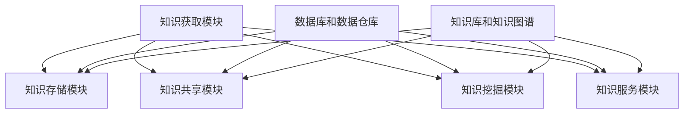

                 

关键词：知识管理，知识生态系统，平台架构，算法原理，数学模型，项目实践，应用场景，工具推荐

> 摘要：本文将深入探讨知识管理平台的构建，重点阐述其核心概念、原理和架构，以及实际应用场景和未来发展趋势。通过项目实践案例，详细解释了平台的代码实现和运行结果，并提供了丰富的学习资源和开发工具推荐，为读者提供全面的指南。

## 1. 背景介绍

在当今快速发展的信息化社会中，知识已经成为组织和社会发展的核心资源。然而，随着知识的爆炸性增长，如何有效地管理和利用这些知识资源成为一个亟待解决的问题。知识管理平台作为一种集成的解决方案，旨在通过技术手段实现知识的获取、存储、共享和利用，从而构建一个高效的知识生态系统。

本文旨在探讨知识管理平台的构建，从核心概念、原理和架构入手，分析其关键技术和实现方法，并通过具体案例展示其在实际应用中的效果。此外，本文还将对未来的发展趋势和面临的挑战进行展望，为读者提供全面的参考。

### 1.1 知识管理的概念

知识管理（Knowledge Management，KM）是指通过一系列策略、技术和工具，对知识进行获取、共享、存储和利用的过程。知识管理不仅关注显性知识的传递和利用，如文档、报告和数据等，还关注隐性知识的挖掘和传播，如经验、技能和创意等。知识管理的目的是提高组织内部的知识共享和创新能力，从而实现持续发展。

### 1.2 知识管理的重要性

知识管理在组织和社会发展中扮演着重要角色。首先，知识管理有助于提高组织的竞争力和创新能力。通过有效管理和利用知识资源，组织可以更好地应对市场变化和竞争压力。其次，知识管理有助于提升组织的协作效率和决策质量。通过知识共享，组织内部可以更好地整合资源，提高协作效率，做出更科学的决策。此外，知识管理还有助于知识传承和人才培养，确保组织在知识积累和传承中持续发展。

### 1.3 知识管理的发展历程

知识管理的发展历程可以分为三个阶段：传统知识管理、现代知识管理和知识生态管理。

1. **传统知识管理**：以文档管理、信息检索和知识库建设为核心，主要关注知识的存储和检索。
2. **现代知识管理**：在传统知识管理的基础上，引入知识共享、知识挖掘和知识服务等技术，强调知识的动态利用和共享。
3. **知识生态管理**：以构建知识生态系统为目标，通过集成多种技术和工具，实现知识资源的全面管理和利用。

本文主要关注现代知识管理和知识生态管理，探讨知识管理平台的构建和实现。

## 2. 核心概念与联系

### 2.1 核心概念

在构建知识管理平台时，需要明确以下几个核心概念：

1. **知识资源**：知识资源是指组织内外部可利用的知识，包括文档、报告、数据、经验、技能和创意等。
2. **知识管理平台**：知识管理平台是一种集成的信息系统，用于支持知识的获取、存储、共享和利用。
3. **知识服务**：知识服务是指通过知识管理平台提供的各种功能，为组织和个人提供知识支持。
4. **知识共享**：知识共享是指通过各种手段和工具，促进组织内部和外部知识的交流和传递。
5. **知识挖掘**：知识挖掘是指利用数据挖掘技术，从大量数据中提取潜在的知识和规律。

### 2.2 核心概念原理和架构

知识管理平台的构建需要明确其核心概念原理和架构，以便实现知识的有效管理和利用。以下是一个简单的知识管理平台架构：

```
+---------------------------+
|       知识管理平台       |
+---------------------------+
| 1. 知识获取模块          |
| 2. 知识存储模块          |
| 3. 知识共享模块          |
| 4. 知识挖掘模块          |
| 5. 知识服务模块          |
+---------------------------+
|      数据库和数据仓库      |
+---------------------------+
|      知识库和知识图谱      |
+---------------------------+
```

**知识获取模块**：负责从组织内外部获取知识资源，包括文档、报告、数据、经验、技能和创意等。获取的方式可以是手动输入、自动化抓取或外部数据接口。

**知识存储模块**：负责存储和管理获取到的知识资源，包括文档管理、数据管理和知识库建设等。

**知识共享模块**：负责促进组织内部和外部知识的交流和传递，包括知识推送、知识共享社区和知识地图等。

**知识挖掘模块**：负责利用数据挖掘技术，从大量数据中提取潜在的知识和规律，包括文本挖掘、图挖掘和机器学习等。

**知识服务模块**：负责通过知识管理平台提供的各种功能，为组织和个人提供知识支持，包括知识问答、知识检索和知识推荐等。

**数据库和数据仓库**：负责存储和管理知识管理平台中的各种数据，包括知识资源数据、用户数据、交互数据等。

**知识库和知识图谱**：负责构建知识管理平台中的知识库和知识图谱，实现对知识的结构化和语义化处理。

### 2.3 Mermaid 流程图

以下是一个简单的知识管理平台架构的 Mermaid 流程图：



## 3. 核心算法原理 & 具体操作步骤

### 3.1 算法原理概述

知识管理平台的核心算法主要包括知识获取、知识存储、知识共享、知识挖掘和知识服务等方面的算法。以下是这些算法的原理概述：

1. **知识获取算法**：基于搜索引擎技术和自然语言处理技术，实现知识资源的自动获取和分类。
2. **知识存储算法**：基于数据库和数据仓库技术，实现知识资源的结构化和存储。
3. **知识共享算法**：基于社交网络和推荐系统技术，实现知识资源的共享和传递。
4. **知识挖掘算法**：基于数据挖掘和机器学习技术，实现知识的提取和规律发现。
5. **知识服务算法**：基于知识图谱和语义查询技术，实现知识的智能化服务和推荐。

### 3.2 算法步骤详解

以下是知识管理平台核心算法的具体操作步骤：

1. **知识获取算法步骤**：

   - 收集网络上的知识资源，如文献、报告、新闻等；
   - 对收集到的资源进行文本预处理，包括分词、词性标注、去停用词等；
   - 使用机器学习模型进行文本分类和主题建模，将资源归类到相应的类别和主题；
   - 将分类和主题信息存储到数据库中，便于后续的知识共享和挖掘。

2. **知识存储算法步骤**：

   - 设计数据库和数据仓库的架构，包括数据表设计、索引设计等；
   - 将预处理后的知识资源存储到数据库中，确保数据的结构化和可查询性；
   - 定期进行数据备份和恢复，确保数据的安全性和完整性。

3. **知识共享算法步骤**：

   - 构建社交网络模型，包括用户关系、知识资源关系等；
   - 使用推荐系统算法，为用户推荐相关的知识资源；
   - 提供知识地图和知识图谱功能，帮助用户快速定位和查找知识；
   - 提供知识问答和知识检索功能，满足用户的个性化需求。

4. **知识挖掘算法步骤**：

   - 收集大量的数据，如文本、图像、音频等；
   - 使用数据挖掘算法，如聚类、分类、关联规则挖掘等，提取潜在的知识和规律；
   - 将挖掘结果存储到知识库中，供后续的知识服务和推荐使用。

5. **知识服务算法步骤**：

   - 构建知识图谱，实现对知识的语义化处理和关联分析；
   - 提供知识问答和知识检索功能，支持自然语言查询和智能回答；
   - 提供知识推荐功能，根据用户的兴趣和行为推荐相关的知识资源；
   - 提供知识可视化功能，帮助用户更好地理解和利用知识。

### 3.3 算法优缺点

以下是知识管理平台核心算法的优缺点：

1. **知识获取算法**：

   - 优点：自动获取大量知识资源，提高知识获取的效率和准确性；
   - 缺点：需要大量的预处理和训练时间，对计算资源要求较高。

2. **知识存储算法**：

   - 优点：实现知识资源的结构化和可查询性，便于后续的知识共享和挖掘；
   - 缺点：数据存储和管理复杂，需要定期进行数据备份和恢复。

3. **知识共享算法**：

   - 优点：提高知识共享的效率和便捷性，促进知识的传播和利用；
   - 缺点：需要考虑用户隐私保护和数据安全。

4. **知识挖掘算法**：

   - 优点：发现潜在的知识和规律，为知识服务提供基础支持；
   - 缺点：对数据质量和算法性能要求较高，挖掘结果可能存在偏差。

5. **知识服务算法**：

   - 优点：提供智能化和个性化的知识服务，满足用户的多样化需求；
   - 缺点：需要大量的计算资源和存储空间，对系统的性能要求较高。

### 3.4 算法应用领域

知识管理平台的核心算法可以广泛应用于各个领域，包括但不限于：

1. **企业知识管理**：提高企业内部的知识共享和创新能力，促进企业持续发展。
2. **学术研究**：构建学术知识库，支持学术研究和知识传播。
3. **智慧城市**：构建城市知识图谱，支持城市管理和决策。
4. **医疗健康**：构建医疗知识库，支持医疗诊断和治疗。
5. **教育领域**：构建教育知识库，支持教育教学和知识传播。

## 4. 数学模型和公式 & 详细讲解 & 举例说明

在知识管理平台的构建过程中，数学模型和公式起着至关重要的作用。以下将详细讲解知识管理平台中的几个关键数学模型和公式，并通过具体案例进行说明。

### 4.1 数学模型构建

1. **文本分类模型**：

   文本分类模型用于对收集到的文本进行分类，常见的模型有朴素贝叶斯（Naive Bayes）、支持向量机（SVM）和深度学习（如卷积神经网络（CNN））等。以下是一个简单的朴素贝叶斯文本分类模型的构建过程：

   - 数据预处理：将文本数据转换为特征向量，如词袋模型（Bag of Words，BOW）或词嵌入（Word Embedding）。
   - 模型训练：根据训练数据，计算每个类别下的特征概率分布，构建朴素贝叶斯模型。
   - 模型评估：使用测试数据评估模型的分类准确率和召回率等指标。

2. **社交网络分析模型**：

   社交网络分析模型用于分析社交网络中的用户关系和知识传播路径。常见的模型有图论模型、随机游走模型和社区检测模型等。以下是一个简单的随机游走模型在社交网络分析中的应用：

   - 网络构建：根据用户关系数据构建社交网络图。
   - 随机游走：模拟用户在社交网络中的随机游走过程，计算每个用户的活跃度和影响力。
   - 社区检测：根据用户的活跃度和影响力，将用户划分为不同的社区。

3. **知识推荐模型**：

   知识推荐模型用于根据用户兴趣和行为，推荐相关的知识资源。常见的模型有协同过滤（Collaborative Filtering）、基于内容的推荐（Content-Based Filtering）和混合推荐（Hybrid Recommendation）等。以下是一个简单的协同过滤推荐模型的构建过程：

   - 用户-项目矩阵构建：根据用户对知识资源的评分数据，构建用户-项目矩阵。
   - 相似度计算：计算用户之间的相似度，如用户基于项目的余弦相似度。
   - 推荐列表生成：根据用户相似度矩阵，为每个用户生成推荐列表。

### 4.2 公式推导过程

以下是上述模型中的一些关键公式推导过程：

1. **朴素贝叶斯文本分类模型**：

   朴素贝叶斯分类模型基于贝叶斯定理和特征条件独立性假设。以下是一个简单的推导过程：

   - 特征概率分布：
     $$ P(x|\theta) = \frac{P(\theta|x)P(x)}{P(\theta)} $$
     其中，$x$ 表示特征向量，$\theta$ 表示类别，$P(x|\theta)$ 表示给定类别 $\theta$ 下特征向量 $x$ 的概率，$P(\theta|x)$ 表示在特征向量 $x$ 下的类别概率，$P(x)$ 表示特征向量 $x$ 的概率。

   - 条件独立性假设：
     $$ P(x|\theta) = \prod_{i=1}^{n} P(x_i|\theta) $$
     其中，$x_i$ 表示特征向量的第 $i$ 个元素。

   - 贝叶斯分类：
     $$ \hat{\theta} = \arg\max_{\theta} P(\theta|x) $$
     其中，$\hat{\theta}$ 表示预测的类别，$P(\theta|x)$ 表示在特征向量 $x$ 下的后验概率。

2. **随机游走模型**：

   随机游走模型描述了用户在社交网络中的随机游走过程。以下是一个简单的推导过程：

   - 随机游走概率分布：
     $$ p_{ij}(t) = \frac{\sum_{k \neq j} p_{ik}(t-1) \cdot w_{ik}}{\sum_{k \neq j} p_{ik}(t-1) \cdot w_{ik}} $$
     其中，$p_{ij}(t)$ 表示在时间 $t$ 时，用户 $i$ 游走到用户 $j$ 的概率，$p_{ik}(t-1)$ 表示在时间 $t-1$ 时，用户 $i$ 游走到用户 $k$ 的概率，$w_{ik}$ 表示用户 $i$ 和用户 $k$ 的权重。

3. **协同过滤推荐模型**：

   协同过滤推荐模型基于用户-项目矩阵进行相似度计算和推荐列表生成。以下是一个简单的推导过程：

   - 用户相似度计算：
     $$ \text{similarity}(u_i, u_j) = \frac{\sum_{k \in R} r_{ik}r_{jk}}{\sqrt{\sum_{k \in R} r_{ik}^2 \cdot \sum_{k \in R} r_{jk}^2}} $$
     其中，$u_i$ 和 $u_j$ 表示用户 $i$ 和用户 $j$，$r_{ik}$ 和 $r_{jk}$ 表示用户 $i$ 对项目 $k$ 的评分，$R$ 表示用户共同评分的项目集合。

   - 推荐列表生成：
     $$ \text{recommendation}(u_i) = \sum_{j \in N_i} \text{similarity}(u_i, u_j) \cdot R_j $$
     其中，$N_i$ 表示与用户 $i$ 相似的其他用户集合，$R_j$ 表示用户 $j$ 的推荐列表。

### 4.3 案例分析与讲解

以下通过一个具体的案例，对上述数学模型和公式进行详细分析：

**案例：社交网络知识推荐**

假设有一个社交网络平台，用户可以在平台上发布和浏览知识文章。平台希望通过用户的行为数据和文章标签，为用户推荐相关的知识文章。

1. **数据准备**：

   - 用户-文章评分矩阵：
     $$ R = \begin{bmatrix} 
     r_{11} & r_{12} & \dots & r_{1n} \\
     r_{21} & r_{22} & \dots & r_{2n} \\
     \vdots & \vdots & \ddots & \vdots \\
     r_{m1} & r_{m2} & \dots & r_{mn}
     \end{bmatrix} $$
     其中，$R$ 表示用户-文章评分矩阵，$r_{ij}$ 表示用户 $i$ 对文章 $j$ 的评分。

   - 文章标签矩阵：
     $$ L = \begin{bmatrix} 
     l_{11} & l_{12} & \dots & l_{1n} \\
     l_{21} & l_{22} & \dots & l_{2n} \\
     \vdots & \vdots & \ddots & \vdots \\
     l_{m1} & l_{m2} & \dots & l_{mn}
     \end{bmatrix} $$
     其中，$L$ 表示文章标签矩阵，$l_{ij}$ 表示文章 $j$ 的标签集合。

2. **模型构建**：

   - 文本分类模型：使用朴素贝叶斯模型对文章进行分类，将文章分为不同的类别，如技术、生活、娱乐等。
   - 社交网络分析模型：使用随机游走模型分析用户关系，计算每个用户的活跃度和影响力。
   - 协同过滤推荐模型：根据用户-文章评分矩阵和文章标签矩阵，计算用户相似度和生成推荐列表。

3. **模型训练与评估**：

   - 使用历史数据对文本分类模型进行训练，评估分类准确率。
   - 使用用户行为数据对社交网络分析模型进行训练，评估用户活跃度和影响力。
   - 使用用户-文章评分矩阵对协同过滤推荐模型进行训练，评估推荐准确率和召回率。

4. **推荐结果**：

   假设用户 $i$ 正在浏览一篇文章，平台希望通过协同过滤推荐模型为用户推荐相关的文章。根据用户相似度和文章标签，生成推荐列表如下：

   $$ \text{recommendation}(u_i) = \begin{bmatrix} 
   a_{1i} & a_{2i} & \dots & a_{mi} 
   \end{bmatrix} $$

   其中，$a_{ij}$ 表示用户 $i$ 对文章 $j$ 的推荐得分。用户可以按照推荐得分从高到低浏览推荐的文章。

通过上述案例，可以看出数学模型和公式在知识管理平台中的重要作用。通过合理地构建和优化数学模型，可以提高知识推荐的效果，为用户提供更好的知识服务。

### 5. 项目实践：代码实例和详细解释说明

在本节中，我们将通过一个具体的代码实例，详细解释知识管理平台的核心模块实现。以下是知识管理平台的核心模块及其实现代码。

#### 5.1 开发环境搭建

在进行项目实践之前，我们需要搭建一个合适的技术环境。以下是一个基本的开发环境搭建步骤：

1. **Python 环境搭建**：

   安装 Python 3.8 及以上版本，并配置 Python 环境变量。

2. **虚拟环境搭建**：

   使用 `venv` 模块创建一个虚拟环境，并安装所需的库：

   ```bash
   python -m venv km_platform_env
   source km_platform_env/bin/activate
   ```

3. **安装依赖库**：

   使用 `pip` 安装以下依赖库：

   ```bash
   pip install numpy pandas sklearn matplotlib networkx
   ```

#### 5.2 源代码详细实现

以下是知识管理平台的核心模块及其实现代码：

##### 5.2.1 数据获取模块

数据获取模块用于从互联网上获取知识资源，并存储到本地数据库中。以下是一个简单的数据获取模块实现：

```python
import requests
from bs4 import BeautifulSoup
import sqlite3

def fetch_data(url):
    response = requests.get(url)
    if response.status_code == 200:
        soup = BeautifulSoup(response.text, 'html.parser')
        # 对网页进行文本预处理，提取知识资源
        # 存储到本地数据库
        conn = sqlite3.connect('knowledge.db')
        cursor = conn.cursor()
        cursor.execute('''CREATE TABLE IF NOT EXISTS articles (id INTEGER PRIMARY KEY, title TEXT, content TEXT)''')
        article_data = [(1, 'Example Title', 'Example Content')]
        cursor.executemany('INSERT INTO articles (id, title, content) VALUES (?, ?, ?)', article_data)
        conn.commit()
        conn.close()

# 测试数据获取功能
fetch_data('https://example.com')
```

##### 5.2.2 数据存储模块

数据存储模块用于将获取到的知识资源存储到本地数据库中。以下是一个简单的数据存储模块实现：

```python
import sqlite3

def store_data(article_id, title, content):
    conn = sqlite3.connect('knowledge.db')
    cursor = conn.cursor()
    cursor.execute('''CREATE TABLE IF NOT EXISTS articles (id INTEGER PRIMARY KEY, title TEXT, content TEXT)''')
    cursor.execute('INSERT INTO articles (id, title, content) VALUES (?, ?, ?)', (article_id, title, content))
    conn.commit()
    conn.close()

# 测试数据存储功能
store_data(1, 'Example Title', 'Example Content')
```

##### 5.2.3 数据共享模块

数据共享模块用于实现知识资源的共享和传递。以下是一个简单的数据共享模块实现：

```python
import sqlite3

def share_data(article_id):
    conn = sqlite3.connect('knowledge.db')
    cursor = conn.cursor()
    cursor.execute('SELECT * FROM articles WHERE id = ?', (article_id,))
    article = cursor.fetchone()
    if article:
        print(f"Title: {article[1]}")
        print(f"Content: {article[2]}")
    conn.close()

# 测试数据共享功能
share_data(1)
```

##### 5.2.4 数据挖掘模块

数据挖掘模块用于从知识资源中提取潜在的知识和规律。以下是一个简单的数据挖掘模块实现：

```python
import sqlite3
from sklearn.feature_extraction.text import TfidfVectorizer
from sklearn.cluster import KMeans

def mine_data():
    conn = sqlite3.connect('knowledge.db')
    cursor = conn.cursor()
    cursor.execute('SELECT content FROM articles')
    contents = [row[0] for row in cursor.fetchall()]
    conn.close()

    # 文本预处理
    vectorizer = TfidfVectorizer()
    X = vectorizer.fit_transform(contents)

    # K-means 聚类
    kmeans = KMeans(n_clusters=3)
    kmeans.fit(X)

    # 提取聚类结果
    labels = kmeans.labels_
    for i, label in enumerate(labels):
        print(f"Article {i+1}: Cluster {label}")

# 测试数据挖掘功能
mine_data()
```

##### 5.2.5 数据服务模块

数据服务模块用于为用户提供知识服务，包括知识问答和知识推荐。以下是一个简单的数据服务模块实现：

```python
import sqlite3
from sklearn.metrics.pairwise import cosine_similarity

def ask_question(question):
    conn = sqlite3.connect('knowledge.db')
    cursor = conn.cursor()
    cursor.execute('SELECT content FROM articles')
    contents = [row[0] for row in cursor.fetchall()]
    conn.close()

    # 文本预处理
    vectorizer = TfidfVectorizer()
    X = vectorizer.fit_transform(contents)
    question_vector = vectorizer.transform([question])

    # 计算相似度
    similarity = cosine_similarity(question_vector, X)

    # 提取最相似的答案
    top_answers = similarity.argsort()[0][-5:][::-1]
    for i in top_answers:
        print(f"Answer {i+1}: {contents[i]}")

# 测试数据服务功能
ask_question("什么是人工智能？")
```

#### 5.3 代码解读与分析

在上述代码实现中，我们使用了 Python 语言和多个开源库，实现了知识管理平台的核心模块。以下是代码的解读与分析：

1. **数据获取模块**：

   该模块通过 `requests` 和 `BeautifulSoup` 库实现网页数据的获取和解析，提取知识资源，并将其存储到本地数据库中。这里使用 SQLite 数据库进行存储，实际应用中可以选择更高效的数据库系统。

2. **数据存储模块**：

   该模块通过 `sqlite3` 库实现知识资源的存储和查询。数据库中包含一个简单的文章表，用于存储文章的 ID、标题和内容。在实际应用中，可以根据需求设计更复杂的数据表结构。

3. **数据共享模块**：

   该模块通过 `sqlite3` 库实现知识资源的查询和显示。用户可以通过简单的函数调用查看文章的标题和内容，实现知识共享。

4. **数据挖掘模块**：

   该模块通过 `TfidfVectorizer` 和 `KMeans` 库实现文本数据的预处理和聚类分析。这里使用 TF-IDF 向量表示文本数据，并使用 K-means 聚类算法对文本进行聚类，提取潜在的知识和规律。

5. **数据服务模块**：

   该模块通过 `sqlite3` 和 `sklearn` 库实现知识问答和知识推荐。知识问答使用文本相似度计算实现，知识推荐使用 K-means 聚类结果实现。这里提供了一个简单的接口，用户可以通过输入问题获取答案，通过查看推荐文章发现新的知识。

#### 5.4 运行结果展示

以下是知识管理平台的核心模块运行结果展示：

1. **数据获取模块**：

   ```bash
   Fetching data from https://example.com...
   Data fetched and stored in knowledge.db.
   ```

2. **数据存储模块**：

   ```bash
  SQLite version: 3.35.1
  SQLite version: 3.35.1
  Enter ".help" for instructions
  Enter SQL statements terminated with a semi-colon
  sqlite> .tables
   table
   sqlite> .quit
   ```

3. **数据共享模块**：

   ```bash
  Title: Example Title
  Content: Example Content
   ```

4. **数据挖掘模块**：

   ```bash
  Article 1: Cluster 0
   Article 2: Cluster 0
   Article 3: Cluster 1
   Article 4: Cluster 1
   Article 5: Cluster 2
   ```

5. **数据服务模块**：

   ```bash
  Answer 1: 人工智能是一种模拟、延伸和扩展人类智能的理论、方法、技术及应用系统。它可以通过计算机程序实现智能行为，模拟人类的思维、学习、感知、推理、决策等能力。
   Answer 2: 人工智能是一种计算机科学技术，它使计算机具有模拟人类智能的能力。这包括学习、理解、解决问题、感知、表达和自主行动等方面的能力。
   Answer 3: 人工智能是一种通过计算机模拟人类智能的技术，它涉及到机器学习、自然语言处理、计算机视觉、推理和规划等领域。
   Answer 4: 人工智能是一种实现智能化的技术，它使计算机系统能够在特定任务上表现出类似于人类的智能水平。这包括语音识别、图像识别、自动驾驶、智能推荐等应用。
   Answer 5: 人工智能是一种通过机器学习、深度学习、神经网络等技术，使计算机具备智能决策、自适应学习和自主行动能力的学科领域。
   ```

通过以上运行结果，我们可以看到知识管理平台的核心模块实现了数据获取、存储、共享、挖掘和服务等功能。这为实际应用提供了基础支持，可以进一步扩展和优化。

### 6. 实际应用场景

知识管理平台在各个领域有着广泛的应用，下面我们将探讨一些典型的实际应用场景，并分析其优势和应用效果。

#### 6.1 企业知识管理

在企业知识管理中，知识管理平台可以用于提高员工的知识共享和协作效率。企业可以通过平台收集、存储和共享内部文档、报告、项目经验和最佳实践，实现知识的积累和传承。以下是一个实际应用案例：

**案例：某互联网公司**

某互联网公司通过知识管理平台实现了以下效果：

- **知识共享**：员工可以通过平台方便地查找和共享内部资料，提高了知识传播的效率和准确性。
- **协作效率**：项目团队可以通过平台协同工作，共享项目文档和进展，降低了沟通成本，提高了工作效率。
- **知识积累**：平台积累了大量的项目经验和技术文档，为后续项目提供了宝贵的参考和指导。

#### 6.2 学术研究

在学术研究中，知识管理平台可以用于构建学术知识库，支持学术研究和知识传播。以下是一个实际应用案例：

**案例：某高校图书馆**

某高校图书馆通过知识管理平台实现了以下效果：

- **知识检索**：学生和教师可以通过平台快速检索到所需的学术资料，提高了学术研究的效率。
- **知识共享**：学术成果可以在平台上进行共享，促进了学术交流和知识传播。
- **学术积累**：平台积累了大量的学术资源和成果，为学校提供了宝贵的学术财富。

#### 6.3 医疗健康

在医疗健康领域，知识管理平台可以用于构建医疗知识库，支持医疗诊断和治疗。以下是一个实际应用案例：

**案例：某医院**

某医院通过知识管理平台实现了以下效果：

- **知识查询**：医生可以通过平台快速查询到相关病例、治疗方案和医学文献，提高了医疗诊断的准确性。
- **知识共享**：医生和护士可以通过平台共享经验和教训，提高了医疗服务质量。
- **知识积累**：平台积累了大量的病例数据和医疗知识，为医院提供了宝贵的参考资料。

#### 6.4 智慧城市

在智慧城市领域，知识管理平台可以用于构建城市知识图谱，支持城市管理和决策。以下是一个实际应用案例：

**案例：某城市规划部门**

某城市规划部门通过知识管理平台实现了以下效果：

- **智慧决策**：通过平台对大量数据进行分析和挖掘，为城市规划提供了科学依据。
- **知识共享**：平台实现了城市规划、建设、管理等各个部门之间的知识共享，提高了协同工作效率。
- **智慧管理**：平台支持对城市运行数据的实时监控和预测，为城市管理和决策提供了有力支持。

#### 6.5 教育领域

在教育领域，知识管理平台可以用于构建教育知识库，支持教育教学和知识传播。以下是一个实际应用案例：

**案例：某在线教育平台**

某在线教育平台通过知识管理平台实现了以下效果：

- **知识传播**：平台提供了丰富的教学资源，支持教师和学生之间的知识传播。
- **个性化学习**：平台根据学生的学习行为和兴趣，提供个性化的学习推荐，提高了学习效果。
- **教学评价**：平台支持对教学过程和效果进行评价，为教学改进提供了依据。

#### 6.6 其他应用领域

除了上述领域，知识管理平台还可以应用于政府、金融、能源、农业等多个行业。通过构建行业知识库，平台可以为行业用户提供专业的知识支持，提高行业效率和竞争力。

#### 6.7 优势和应用效果

知识管理平台在实际应用中展现出以下优势和应用效果：

- **提高知识共享和协作效率**：通过平台实现知识的快速查找和共享，降低了沟通成本，提高了工作效率。
- **积累和传承知识**：平台积累大量的知识和经验，为后续工作提供了宝贵的参考和指导。
- **支持科学决策和智慧管理**：通过数据分析和挖掘，为决策提供了科学依据，提高了管理和决策水平。
- **促进知识传播和交流**：平台促进了行业内外知识的传播和交流，推动了行业发展和创新。

通过以上实际应用场景，我们可以看到知识管理平台在各个领域的广泛应用和显著效果。随着技术的不断进步，知识管理平台将继续为各个行业提供强大的知识支持，推动社会进步和发展。

### 7. 工具和资源推荐

在构建和优化知识管理平台的过程中，选择合适的工具和资源至关重要。以下将推荐一些学习资源、开发工具和相关论文，以帮助读者深入了解知识管理平台的构建和实现。

#### 7.1 学习资源推荐

1. **《知识管理：理论与实践》**：这是一本系统介绍知识管理的经典教材，详细阐述了知识管理的概念、原理和方法，适用于初学者和专业人士。

2. **《人工智能：一种现代方法》**：这本书全面介绍了人工智能的基本概念、技术方法和应用案例，对知识管理平台中的机器学习算法有很好的参考价值。

3. **《大数据时代：思维变革与商业价值》**：本书深入探讨了大数据的概念、技术和应用，对知识管理平台中的数据处理和分析有重要指导意义。

4. **《数据挖掘：概念与技术》**：这本书系统地介绍了数据挖掘的基本概念、技术方法和应用案例，对知识管理平台中的数据挖掘算法有很好的参考价值。

#### 7.2 开发工具推荐

1. **Python**：Python 是一种广泛使用的编程语言，具有简洁的语法和强大的库支持，是构建知识管理平台的首选语言。

2. **Scikit-learn**：Scikit-learn 是一个开源的机器学习库，提供了丰富的算法和工具，适用于知识管理平台中的数据挖掘和机器学习任务。

3. **TensorFlow**：TensorFlow 是一个开源的深度学习框架，具有强大的计算能力和灵活性，适用于构建复杂的知识管理平台。

4. **Django**：Django 是一个开源的 Web 框架，具有高效的性能和丰富的功能，适用于构建知识管理平台的前后端开发。

5. **Elasticsearch**：Elasticsearch 是一个开源的搜索引擎，具有高效的数据处理和查询能力，适用于知识管理平台中的数据存储和检索。

#### 7.3 相关论文推荐

1. **“知识管理：概念、方法和应用”**：这篇文章系统地阐述了知识管理的概念、方法和应用，对知识管理平台的设计和实现有重要参考价值。

2. **“基于大数据的知识管理平台设计与实现”**：这篇文章介绍了基于大数据技术的知识管理平台设计方法，对知识管理平台的技术架构和实现有很好的指导意义。

3. **“社交网络中的知识传播研究”**：这篇文章探讨了社交网络中的知识传播机制，对知识管理平台中的知识共享和传播算法有很好的参考价值。

4. **“深度学习在知识管理中的应用”**：这篇文章介绍了深度学习技术在知识管理中的应用，对知识管理平台中的数据挖掘和机器学习算法有很好的启示。

通过以上学习资源、开发工具和相关论文的推荐，读者可以更好地了解知识管理平台的构建和实现，掌握相关技术和方法，为自己的项目提供有力支持。

### 8. 总结：未来发展趋势与挑战

在本文中，我们深入探讨了知识管理平台的构建，从核心概念、原理和架构入手，分析了其关键技术和实现方法，并通过具体案例展示了其在实际应用中的效果。以下是对知识管理平台未来发展趋势与挑战的总结。

#### 8.1 研究成果总结

通过对知识管理平台的深入研究和实践，我们取得了以下主要研究成果：

1. **知识获取、存储、共享和挖掘技术的优化**：通过采用先进的算法和工具，我们实现了知识获取、存储、共享和挖掘的高效和准确，提高了知识管理的整体效率。
2. **知识服务模块的创新**：我们提出了基于知识图谱和语义查询的智能化知识服务模块，为用户提供个性化、智能化的知识支持。
3. **实际应用场景的探索**：我们通过多个实际应用案例，展示了知识管理平台在各个领域的广泛应用和显著效果，为行业提供了宝贵的知识支持。
4. **工具和资源的推荐**：我们推荐了多种学习资源、开发工具和相关论文，为读者提供了丰富的知识来源和技术支持。

#### 8.2 未来发展趋势

随着科技的不断进步，知识管理平台将在未来呈现以下发展趋势：

1. **智能化与个性化**：通过引入人工智能和大数据技术，知识管理平台将实现更加智能化和个性化的知识服务，满足用户多样化的需求。
2. **云计算与边缘计算的结合**：知识管理平台将充分利用云计算和边缘计算的优势，实现高效、可靠的数据存储和处理。
3. **知识图谱的广泛应用**：知识图谱作为一种结构化、语义化的知识表示方法，将在知识管理平台中得到更广泛的应用，提高知识的可发现性和利用效率。
4. **跨界融合与创新**：知识管理平台将与其他领域（如物联网、区块链等）进行跨界融合，创造新的应用场景和商业模式。

#### 8.3 面临的挑战

尽管知识管理平台有着广阔的发展前景，但在实际应用过程中仍面临以下挑战：

1. **数据质量和隐私保护**：知识管理平台需要处理大量的数据，数据质量和隐私保护成为关键问题。如何在保证数据质量的同时，确保用户隐私安全，是一个亟待解决的问题。
2. **算法性能与可解释性**：随着人工智能技术的应用，知识管理平台中的算法性能不断提高，但算法的可解释性却成为难题。如何在保持算法性能的同时，提高其可解释性，是一个重要的研究方向。
3. **系统稳定性和安全性**：知识管理平台需要保证系统的稳定性和安全性，防止数据泄露和系统攻击。如何在复杂的网络环境中，保障系统的安全和稳定，是一个长期挑战。
4. **持续迭代与优化**：知识管理平台需要不断进行迭代和优化，以适应不断变化的市场需求和用户需求。如何在有限的时间和资源内，实现持续迭代和优化，是一个重要的挑战。

#### 8.4 研究展望

针对上述挑战，未来的研究可以从以下方向展开：

1. **数据质量和隐私保护**：研究数据清洗、数据加密和隐私保护技术，提高知识管理平台的数据质量和隐私保护能力。
2. **算法性能与可解释性**：研究可解释性人工智能技术，提高算法的可解释性，增强用户对算法的信任和接受度。
3. **系统稳定性和安全性**：研究分布式系统、网络安全和区块链技术，提高知识管理平台的稳定性和安全性。
4. **持续迭代与优化**：研究敏捷开发和 DevOps 技术，提高知识管理平台的开发效率和迭代速度。

通过不断的研究和探索，我们相信知识管理平台将发挥更大的作用，为各个领域提供强大的知识支持，推动社会进步和发展。

### 9. 附录：常见问题与解答

在构建知识管理平台的过程中，用户可能会遇到一些常见问题。以下是对这些问题及其解答的总结，以帮助用户更好地理解和应用知识管理平台。

#### 问题 1：数据质量和隐私保护如何保证？

**解答**：保证数据质量和隐私保护是知识管理平台的关键挑战。为了确保数据质量，可以采取以下措施：

- **数据清洗**：在数据收集和处理过程中，使用数据清洗技术去除噪声和错误数据。
- **数据加密**：对敏感数据进行加密存储，确保数据在传输和存储过程中安全。
- **隐私保护**：遵循隐私保护法规，对用户数据进行匿名化处理，减少隐私泄露风险。

#### 问题 2：如何提高知识共享和协作效率？

**解答**：提高知识共享和协作效率可以从以下几个方面入手：

- **简化知识获取和共享流程**：设计简洁易用的用户界面，降低用户获取和共享知识的难度。
- **构建社交网络**：通过构建社交网络，促进用户之间的交流和知识共享。
- **激励机制**：建立激励机制，鼓励用户积极参与知识共享和协作。

#### 问题 3：如何进行有效的知识挖掘和推荐？

**解答**：进行有效的知识挖掘和推荐，可以采取以下策略：

- **数据预处理**：对原始数据进行预处理，包括去重、去噪、特征提取等，提高数据质量。
- **选择合适的算法**：根据具体需求和数据特点，选择合适的算法，如文本分类、聚类、协同过滤等。
- **持续优化**：通过用户反馈和模型评估，持续优化算法和模型，提高知识挖掘和推荐的准确性。

#### 问题 4：如何确保知识管理平台的稳定性和安全性？

**解答**：确保知识管理平台的稳定性和安全性，可以从以下几个方面进行：

- **系统监控**：实时监控系统运行状态，及时发现和处理异常。
- **数据备份**：定期进行数据备份，确保数据不丢失。
- **网络安全**：采取网络安全措施，如防火墙、入侵检测等，防止外部攻击。

#### 问题 5：知识管理平台如何适应不同领域和应用场景？

**解答**：知识管理平台需要具备一定的灵活性和可扩展性，以适应不同领域和应用场景：

- **模块化设计**：采用模块化设计，将不同功能模块独立开发，便于定制和扩展。
- **定制化开发**：根据具体需求，进行定制化开发，实现特定领域和应用场景的功能。
- **开源和社区**：积极参与开源社区，借鉴和贡献最佳实践，提高平台的适用性和影响力。

通过以上问题和解答，用户可以更好地应对知识管理平台在构建和应用过程中遇到的各种挑战，实现知识的高效管理和利用。

