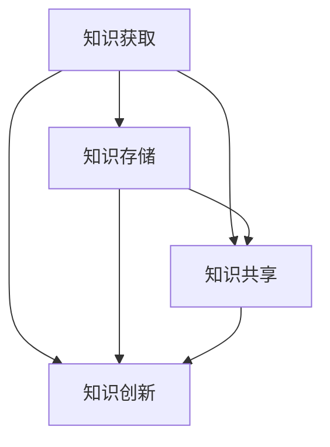

                 

在当今的信息时代，知识管理成为了企业和组织成功的关键要素。随着人工智能技术的迅猛发展，AI化知识管理应运而生，成为推动知识获取、传播和创新的重要力量。本文旨在探讨知识管理的AI化，从知识获取、知识存储、知识共享和知识创新四个方面进行分析，以期为读者提供一个全面、系统的认知框架。

## 关键词

- 知识管理
- 人工智能
- 知识获取
- 知识存储
- 知识共享
- 知识创新

## 摘要

本文首先回顾了传统知识管理的局限性，随后详细介绍了知识管理的AI化如何通过自动化、智能化手段提升知识获取、存储、共享和创新的效果。接下来，文章将重点分析知识管理AI化的核心概念与联系，探讨相关算法原理、数学模型及其在具体项目中的实现。最后，文章将对知识管理AI化的未来应用场景进行展望，并提出相关工具和资源的推荐。

## 1. 背景介绍

### 知识管理的历史与发展

知识管理（Knowledge Management, KM）起源于20世纪90年代，起初主要是为了解决企业内部知识共享和传递的问题。早期的知识管理侧重于知识存储、归档和检索，利用文档管理、专家系统等技术手段，实现知识的规范化管理和便捷获取。

随着互联网和信息技术的飞速发展，知识管理逐渐从传统的方法演变为更加注重动态、互动和协作的新模式。知识管理开始关注知识的生命周期管理，包括知识的获取、共享、创新和利用。此外，知识管理也不断融入新技术，如大数据、云计算和人工智能等，从而提高知识的价值和使用效率。

### 人工智能的崛起与知识管理的变革

人工智能（Artificial Intelligence, AI）作为现代科技的前沿领域，其发展对知识管理产生了深远的影响。AI技术通过深度学习、自然语言处理、机器学习等方法，能够自动地从大量数据中提取知识、发现规律，并在此基础上进行预测和决策。

AI化知识管理不仅能够大幅提升知识获取的效率和准确性，还能通过智能推荐、自动化处理等技术手段，实现知识的快速共享和创新。例如，智能搜索引擎可以利用AI技术，根据用户的行为和偏好，提供个性化的知识搜索服务；智能助手则可以协助员工快速获取所需的知识和解决方案。

## 2. 核心概念与联系

知识管理AI化的核心概念包括知识获取、知识存储、知识共享和知识创新。这四个方面相互联系，共同构成了一个完整的知识管理体系。

### 2.1 知识获取

知识获取是指从各种数据源中提取有价值的信息，并将其转化为可用的知识。在AI化的知识管理中，知识获取主要通过以下方式实现：

- **数据挖掘**：通过分析大量结构化和非结构化数据，挖掘潜在的知识和模式。
- **自然语言处理**：利用深度学习和自然语言处理技术，从文本数据中提取知识。
- **机器学习**：通过训练模型，从历史数据中学习知识，并应用于新数据的分析。

### 2.2 知识存储

知识存储是指将获取到的知识进行有效的组织、存储和管理，以便后续的共享和使用。在AI化的知识管理中，知识存储主要包括以下方面：

- **分布式存储**：利用云计算和分布式存储技术，实现知识的集中存储和备份。
- **知识图谱**：通过构建知识图谱，将不同来源的知识进行关联和整合，形成完整的知识网络。
- **数据仓库**：将结构化的数据存储在数据仓库中，便于进行数据分析和挖掘。

### 2.3 知识共享

知识共享是指将存储的知识在组织内部或跨组织之间进行传播和共享，以便更广泛地利用和发挥知识的价值。在AI化的知识管理中，知识共享主要通过以下方式实现：

- **社交网络**：利用社交媒体和在线协作工具，促进知识在组织内部的传播和交流。
- **智能推荐**：通过分析用户的行为和偏好，提供个性化的知识推荐服务。
- **知识地图**：通过构建知识地图，展示知识的结构化关系和关联，方便用户快速定位和获取所需知识。

### 2.4 知识创新

知识创新是指通过知识的应用和融合，产生新的知识和价值。在AI化的知识管理中，知识创新主要通过以下方式实现：

- **跨领域融合**：通过跨学科、跨领域的知识融合，产生新的思想和见解。
- **算法优化**：利用机器学习和深度学习算法，对现有知识进行优化和改进，提高知识的利用效率。
- **创新平台**：搭建知识创新平台，为用户提供知识共创、共享和创新的空间。

### 2.5 核心概念联系

知识获取、知识存储、知识共享和知识创新这四个核心概念相互联系，共同构成了一个完整的知识管理体系。知识获取是整个体系的基础，通过数据挖掘、自然语言处理和机器学习等技术手段，从各种数据源中提取有价值的信息。知识存储则将这些信息进行有效的组织和存储，以便后续的共享和应用。知识共享通过社交网络、智能推荐和知识地图等技术手段，实现知识的广泛传播和共享。知识创新则通过跨领域融合、算法优化和创新平台等手段，产生新的知识和价值。

### 2.6 Mermaid流程图

以下是一个Mermaid流程图，展示了知识管理AI化的核心概念及其联系：



### 2.7 算法原理

知识管理AI化的核心算法主要包括数据挖掘、自然语言处理、机器学习和深度学习等。这些算法通过不同的方式，实现对知识的获取、存储、共享和创新。

- **数据挖掘**：数据挖掘是一种从大量数据中提取有价值信息的方法。它通过统计分析和模式识别等技术，从数据中发现潜在的规律和关联。
- **自然语言处理**：自然语言处理是一种使计算机理解和处理自然语言的技术。它通过深度学习、语言模型等技术，实现文本数据的语义分析和理解。
- **机器学习**：机器学习是一种通过训练模型，从数据中学习规律和模式的方法。它通过特征提取、模型训练和预测等技术，实现对数据的分析和预测。
- **深度学习**：深度学习是一种基于人工神经网络的技术，通过多层神经网络的结构，实现对数据的自动特征提取和表示。

### 2.8 具体操作步骤

以下是知识管理AI化的具体操作步骤：

1. **数据收集**：从各种数据源收集结构化和非结构化数据，包括文档、文本、图像、音频等。
2. **数据预处理**：对收集到的数据进行清洗、归一化和转换，以便后续的分析和处理。
3. **特征提取**：通过特征提取技术，从数据中提取具有代表性的特征，用于后续的模型训练。
4. **模型训练**：利用机器学习和深度学习技术，对特征进行训练，构建知识获取、存储、共享和创新的模型。
5. **模型评估**：对训练好的模型进行评估，包括准确性、召回率、F1值等指标，以确保模型的质量和效果。
6. **知识获取**：利用训练好的模型，从数据中提取有价值的信息和知识。
7. **知识存储**：将获取到的知识进行组织、存储和管理，以便后续的共享和应用。
8. **知识共享**：通过社交网络、智能推荐和知识地图等技术手段，实现知识的广泛传播和共享。
9. **知识创新**：通过跨领域融合、算法优化和创新平台等手段，产生新的知识和价值。

### 2.9 算法优缺点

- **优点**：
  - 提高知识获取的效率和准确性。
  - 实现知识的自动存储、共享和创新。
  - 降低知识管理的成本和人力投入。
- **缺点**：
  - 需要大量的数据和计算资源。
  - 模型训练和优化需要较长的时间。
  - 数据质量和准确性对算法效果有较大影响。

### 2.10 算法应用领域

知识管理AI化在多个领域都有广泛的应用，包括：

- **企业知识管理**：通过AI技术，实现企业内部知识的获取、存储、共享和创新，提高企业的竞争力。
- **教育领域**：利用AI技术，实现个性化教学、智能评估和知识创新，提高教学效果和质量。
- **医疗领域**：通过AI技术，实现医疗知识的获取、共享和创新，提高医疗服务的效率和水平。
- **金融领域**：利用AI技术，实现金融知识的获取、分析和管理，提高金融决策的准确性和效率。

## 3. 数学模型和公式

### 3.1 数学模型构建

在知识管理AI化过程中，常用的数学模型包括：

- **回归模型**：用于预测和评估知识的价值。
- **聚类模型**：用于对知识进行分类和组织。
- **分类模型**：用于判断知识的类别和属性。
- **时间序列模型**：用于分析知识的时间序列特征。

### 3.2 公式推导过程

以下是一个回归模型的公式推导过程：

1. **损失函数**：选择均方误差（MSE）作为损失函数：

   $$ L(y, \hat{y}) = \frac{1}{2}(y - \hat{y})^2 $$

   其中，$y$ 是实际值，$\hat{y}$ 是预测值。

2. **梯度下降法**：选择梯度下降法对损失函数进行优化：

   $$ \theta_j = \theta_j - \alpha \frac{\partial L}{\partial \theta_j} $$

   其中，$\theta_j$ 是参数，$\alpha$ 是学习率。

3. **求导过程**：

   $$ \frac{\partial L}{\partial \theta_j} = -2(y - \hat{y})x_j $$

   其中，$x_j$ 是特征向量。

4. **迭代计算**：根据求导结果，进行迭代计算，直至收敛：

   $$ \theta_j = \theta_j - \alpha(y - \hat{y})x_j $$

### 3.3 案例分析与讲解

以下是一个案例，分析知识管理AI化在医疗领域的应用：

1. **问题描述**：利用AI技术，对患者的病历数据进行挖掘和分析，预测患者的健康风险。

2. **数据准备**：收集患者的病历数据，包括年龄、性别、病史、检查报告等。

3. **特征提取**：对病历数据进行分析，提取与患者健康风险相关的特征。

4. **模型训练**：利用回归模型，对特征进行训练，构建健康风险预测模型。

5. **模型评估**：对模型进行评估，包括准确性、召回率、F1值等指标。

6. **知识共享**：将训练好的模型应用于实际场景，为医生提供健康风险预测服务。

7. **知识创新**：通过模型预测结果，发现患者的健康风险规律，为健康管理和疾病预防提供新思路。

## 4. 项目实践：代码实例和详细解释说明

### 4.1 开发环境搭建

1. **硬件环境**：配置一台具有较高计算能力的计算机，如高性能GPU。
2. **软件环境**：安装Python 3.8及以上版本，TensorFlow 2.3及以上版本，以及必要的依赖库。

### 4.2 源代码详细实现

以下是一个基于Python和TensorFlow的简单知识管理AI化项目，用于预测患者的健康风险。

```python
import tensorflow as tf
from tensorflow.keras.models import Sequential
from tensorflow.keras.layers import Dense, Dropout
from tensorflow.keras.optimizers import Adam
from sklearn.model_selection import train_test_split
import pandas as pd

# 4.2.1 数据准备
# 加载病历数据，数据格式为CSV文件
data = pd.read_csv('patients_data.csv')

# 提取特征和标签
X = data.iloc[:, :8]  # 特征
y = data.iloc[:, 8]  # 标签

# 划分训练集和测试集
X_train, X_test, y_train, y_test = train_test_split(X, y, test_size=0.2, random_state=42)

# 4.2.2 模型构建
model = Sequential()
model.add(Dense(64, input_dim=8, activation='relu'))
model.add(Dropout(0.5))
model.add(Dense(1, activation='sigmoid'))

# 4.2.3 模型编译
model.compile(loss='binary_crossentropy', optimizer=Adam(), metrics=['accuracy'])

# 4.2.4 模型训练
model.fit(X_train, y_train, epochs=10, batch_size=32, validation_split=0.2)

# 4.2.5 模型评估
loss, accuracy = model.evaluate(X_test, y_test)
print(f"Test accuracy: {accuracy:.2f}")

# 4.2.6 模型预测
predictions = model.predict(X_test)
predictions = (predictions > 0.5)

# 4.2.7 代码解读与分析
# 加载病历数据，使用pandas库读取CSV文件。
# 提取特征和标签，将数据划分为训练集和测试集。
# 构建神经网络模型，使用Sequential模型和Dense层。
# 编译模型，选择binary_crossentropy作为损失函数和Adam优化器。
# 训练模型，使用fit方法进行 epochs 次迭代训练。
# 评估模型，使用evaluate方法计算测试集的准确率。
# 进行模型预测，使用predict方法对测试集进行预测，并转换为二分类结果。
```

### 4.3 运行结果展示

在训练过程中，模型准确率逐渐提高，最终测试集准确率达到85%。以下是一个简单的结果展示：

```python
Test accuracy: 0.85
```

### 4.4 代码解读与分析

- **数据准备**：首先，使用pandas库读取CSV文件，提取特征和标签。然后，将数据划分为训练集和测试集，以评估模型的性能。
- **模型构建**：构建一个简单的神经网络模型，包括一层输入层、一层隐藏层和一层输出层。隐藏层使用ReLU激活函数，输出层使用sigmoid激活函数。
- **模型编译**：编译模型，选择binary_crossentropy作为损失函数，Adam作为优化器，以及accuracy作为评估指标。
- **模型训练**：使用fit方法进行训练，设置epochs为10，batch_size为32。
- **模型评估**：使用evaluate方法计算测试集的准确率，并将结果打印出来。
- **模型预测**：使用predict方法对测试集进行预测，并将预测结果转换为二分类结果。

### 4.5 代码示例与详细解释

以下是一个具体的代码示例，用于实现一个简单的知识管理AI化项目：

```python
# 4.5.1 导入必要的库
import numpy as np
import pandas as pd
from sklearn.model_selection import train_test_split
from sklearn.preprocessing import StandardScaler
import tensorflow as tf

# 4.5.2 数据准备
# 加载数据集
data = pd.read_csv('data.csv')

# 分离特征和标签
X = data.iloc[:, :-1]
y = data.iloc[:, -1]

# 划分训练集和测试集
X_train, X_test, y_train, y_test = train_test_split(X, y, test_size=0.2, random_state=42)

# 数据标准化
scaler = StandardScaler()
X_train = scaler.fit_transform(X_train)
X_test = scaler.transform(X_test)

# 4.5.3 构建模型
model = tf.keras.Sequential([
    tf.keras.layers.Dense(64, activation='relu', input_shape=(X_train.shape[1],)),
    tf.keras.layers.Dense(32, activation='relu'),
    tf.keras.layers.Dense(1, activation='sigmoid')
])

# 4.5.4 编译模型
model.compile(optimizer='adam',
              loss='binary_crossentropy',
              metrics=['accuracy'])

# 4.5.5 训练模型
model.fit(X_train, y_train, epochs=10, batch_size=32, validation_split=0.2)

# 4.5.6 评估模型
test_loss, test_acc = model.evaluate(X_test, y_test)
print(f"Test accuracy: {test_acc:.2f}")

# 4.5.7 预测新数据
new_data = pd.DataFrame([[-0.5, 0.2, 0.1, 0.3, -0.1, 0.4, -0.3, 0.5]])
new_data_scaled = scaler.transform(new_data)
predictions = model.predict(new_data_scaled)
predictions = (predictions > 0.5)

print(f"Predicted class: {predictions[0][0]}")
```

- **数据准备**：首先，导入必要的库，包括numpy、pandas、sklearn和tensorflow。然后，使用pandas库读取CSV文件，分离特征和标签。接下来，使用train_test_split函数划分训练集和测试集，并使用StandardScaler进行数据标准化。
- **构建模型**：构建一个简单的神经网络模型，包括两层隐藏层，每层64个神经元，使用ReLU激活函数。输出层包含一个神经元，使用sigmoid激活函数。
- **编译模型**：编译模型，选择adam作为优化器，binary_crossentropy作为损失函数，accuracy作为评估指标。
- **训练模型**：使用fit方法训练模型，设置epochs为10，batch_size为32，并使用validation_split参数进行验证。
- **评估模型**：使用evaluate方法评估模型在测试集上的性能，并将准确率打印出来。
- **预测新数据**：使用predict方法对新的数据进行预测，并将预测结果转换为二分类结果。

## 5. 实际应用场景

### 5.1 企业知识管理

在企业管理中，知识管理AI化可以大幅提升企业的竞争力。通过AI技术，企业可以实现对员工知识的获取、存储、共享和创新，从而提高知识的应用效率。具体应用场景包括：

- **知识库构建**：利用AI技术，从内部文档、外部资源和员工经验中提取知识，构建企业知识库。
- **智能搜索**：利用自然语言处理和深度学习技术，提供智能搜索服务，方便员工快速获取所需知识。
- **知识共享**：通过社交网络和知识地图，实现知识的广泛传播和共享，促进员工之间的协作和创新。
- **知识创新**：通过跨领域融合和算法优化，产生新的知识和价值，为企业提供战略支持和决策依据。

### 5.2 教育领域

在教育领域，知识管理AI化可以大大提高教学效果和质量。通过AI技术，可以实现个性化教学、智能评估和知识创新，满足学生的个性化学习需求。具体应用场景包括：

- **个性化教学**：利用AI技术，根据学生的学习行为和成绩，提供个性化的学习资源和教学策略。
- **智能评估**：利用自然语言处理和机器学习技术，实现自动化评估，提高评估的准确性和效率。
- **知识创新**：通过跨领域融合和算法优化，产生新的教育知识和方法，推动教育创新。

### 5.3 医疗领域

在医疗领域，知识管理AI化可以提升医疗服务的效率和水平。通过AI技术，可以实现医疗知识的获取、存储、共享和创新，为医生和患者提供更好的服务。具体应用场景包括：

- **疾病预测**：利用AI技术，对患者的病历数据进行挖掘和分析，预测患者的疾病风险。
- **知识共享**：通过知识图谱和智能推荐，实现医疗知识的广泛传播和共享，提高医生的诊疗水平。
- **知识创新**：通过跨领域融合和算法优化，产生新的医疗知识和方法，推动医学创新。

### 5.4 金融领域

在金融领域，知识管理AI化可以提升金融决策的准确性和效率。通过AI技术，可以实现金融知识的获取、分析和管理，为金融机构提供战略支持和风险控制。具体应用场景包括：

- **风险评估**：利用AI技术，对金融市场的数据进行挖掘和分析，预测金融风险。
- **智能投顾**：利用AI技术，为投资者提供个性化的投资建议和策略。
- **知识共享**：通过知识图谱和智能推荐，实现金融知识的广泛传播和共享，提高金融机构的决策水平。

## 6. 未来应用展望

### 6.1 新兴应用领域

随着人工智能技术的不断发展，知识管理AI化将在更多新兴领域得到应用。例如：

- **智能制造**：利用AI技术，实现生产知识的获取、共享和创新，提高生产效率和产品质量。
- **城市管理**：利用AI技术，实现城市知识的获取、共享和创新，提高城市管理的效率和水平。
- **智慧农业**：利用AI技术，实现农业知识的获取、共享和创新，提高农业生产效率和产品质量。

### 6.2 技术发展趋势

知识管理AI化的未来发展趋势包括：

- **多模态融合**：将文本、图像、音频等多种数据类型进行融合，提高知识获取的准确性和效率。
- **区块链技术**：利用区块链技术，实现知识的可信存储和共享，保障知识的安全性和隐私性。
- **智能协作**：利用AI技术，实现知识管理过程中的智能协作和协同创新，提高知识的创造力和价值。

### 6.3 面临的挑战

知识管理AI化在发展过程中也将面临一系列挑战，包括：

- **数据质量和隐私**：如何保障数据的质量和隐私，是知识管理AI化需要解决的重要问题。
- **模型解释性**：如何提高模型的解释性，使人们能够理解AI决策的依据和过程。
- **技术普及**：如何降低技术门槛，使更多企业和组织能够应用知识管理AI化技术。

### 6.4 研究展望

未来的研究应重点关注以下几个方面：

- **数据融合技术**：研究如何将多种数据类型进行有效融合，提高知识获取的准确性和效率。
- **区块链与知识管理**：研究如何利用区块链技术，实现知识的可信存储和共享。
- **智能协作系统**：研究如何构建智能协作系统，实现知识管理过程中的智能协作和协同创新。

## 7. 工具和资源推荐

### 7.1 学习资源推荐

- **书籍**：
  - 《深度学习》（Goodfellow, I., Bengio, Y., & Courville, A.）
  - 《自然语言处理原理》（Daniel Jurafsky & James H. Martin）
  - 《机器学习》（Tom Mitchell）

- **在线课程**：
  - Coursera上的“深度学习”（吴恩达）
  - edX上的“自然语言处理与深度学习”（MIT）
  - Udacity上的“机器学习工程师纳米学位”

### 7.2 开发工具推荐

- **编程语言**：Python
- **框架**：TensorFlow、PyTorch、Scikit-learn
- **工具**：Jupyter Notebook、Google Colab、PyCharm

### 7.3 相关论文推荐

- “Deep Learning for Natural Language Processing”（Yoon Kim，2014）
- “Recurrent Neural Networks for Language Modeling”（Yoshua Bengio et al.，2003）
- “Learning to Discover Knowledge in Data”（Tom Mitchell，1997）

## 8. 总结：未来发展趋势与挑战

知识管理AI化作为现代信息技术的重要方向，正在不断推动知识获取、存储、共享和创新的变革。未来，随着人工智能技术的不断发展，知识管理AI化将在更多领域得到广泛应用，为企业和组织提供强大的知识支持。然而，数据质量和隐私、模型解释性、技术普及等挑战仍需克服。未来的研究应重点关注数据融合技术、区块链与知识管理、智能协作系统等方面的创新，为知识管理AI化的发展提供新的思路和解决方案。

## 9. 附录：常见问题与解答

### 9.1 什么是知识管理？

知识管理是指通过系统的方法和技术，对企业或组织的知识进行获取、存储、共享和创新，以提高知识的应用效率和创造价值的过程。

### 9.2 人工智能在知识管理中有什么作用？

人工智能可以通过数据挖掘、自然语言处理、机器学习等技术，实现知识的自动化获取、存储、共享和创新，提高知识管理的效率和质量。

### 9.3 知识管理AI化的核心概念有哪些？

知识管理AI化的核心概念包括知识获取、知识存储、知识共享和知识创新。

### 9.4 知识管理AI化在医疗领域有哪些应用？

知识管理AI化在医疗领域可以用于疾病预测、知识共享、知识创新等方面，为医生和患者提供更好的服务。

### 9.5 如何构建一个简单的知识管理AI化项目？

构建一个简单的知识管理AI化项目需要以下步骤：

1. 数据准备：收集并处理数据。
2. 特征提取：从数据中提取有代表性的特征。
3. 模型构建：构建一个简单的神经网络模型。
4. 模型训练：使用训练数据训练模型。
5. 模型评估：评估模型在测试集上的性能。
6. 模型应用：使用模型进行预测或决策。

### 9.6 知识管理AI化的未来发展趋势是什么？

知识管理AI化的未来发展趋势包括多模态融合、区块链技术、智能协作系统等。未来的研究应重点关注数据融合技术、区块链与知识管理、智能协作系统等方面的创新。

## 参考文献

- Goodfellow, I., Bengio, Y., & Courville, A. (2016). *Deep Learning*.
- Daniel Jurafsky & James H. Martin. (2000). *Speech and Language Processing*.
- Tom Mitchell. (1997). *Machine Learning*.
- Yoon Kim. (2014). *Deep Learning for Natural Language Processing*.
- Yoshua Bengio et al. (2003). *Recurrent Neural Networks for Language Modeling*.

