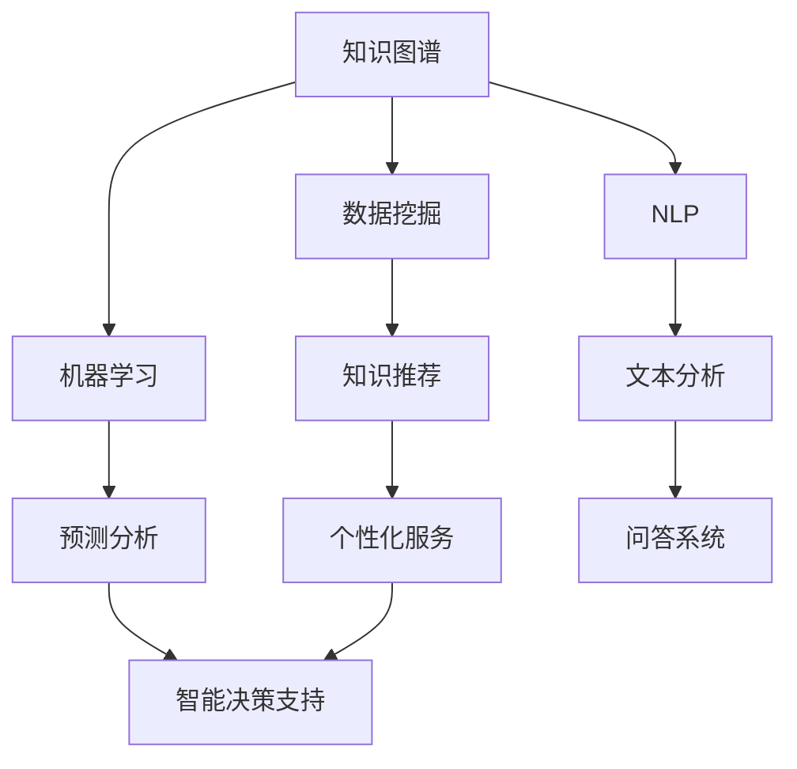

                 

关键词：知识管理、人工智能、个性化服务、智能决策支持、数据挖掘、机器学习、自然语言处理

> 摘要：本文探讨了知识管理的AI化趋势，分析了个性化知识服务与智能决策支持的发展现状、关键技术和未来挑战。通过介绍知识图谱、数据挖掘、机器学习、自然语言处理等AI技术的应用，探讨了AI如何提升知识管理效率和质量，为企业和个人提供更加智能化的知识服务与决策支持。

## 1. 背景介绍

知识管理（Knowledge Management，KM）是一种通过系统地捕获、组织、共享和应用知识来提升组织效率和创新能力的方法。随着信息技术的飞速发展，知识管理逐渐从传统的文档管理、知识库建设等简单形式，走向了更为复杂和智能化的阶段。

近年来，人工智能（Artificial Intelligence，AI）技术的迅猛发展，为知识管理带来了新的机遇和挑战。AI通过自动化处理和分析大量数据，能够帮助企业和个人更高效地获取、管理和应用知识，实现知识的智能化管理和个性化服务。

个性化知识服务和智能决策支持是知识管理领域的两个重要方向。个性化知识服务旨在为用户推荐最相关、最有价值的知识内容，提高知识获取的效率和准确性。而智能决策支持则通过数据分析和预测模型，为用户提供建议和指导，帮助用户做出更加明智的决策。

## 2. 核心概念与联系

知识管理的AI化离不开以下几个核心概念和技术的支持：

### 2.1 知识图谱

知识图谱（Knowledge Graph）是一种结构化、语义化的知识表示方法，通过实体和关系构建起一个庞大的知识网络。知识图谱在知识管理中起到了连接不同知识领域、知识片段和用户需求的关键作用。

### 2.2 数据挖掘

数据挖掘（Data Mining）是指从大量数据中自动发现规律、趋势和模式的过程。数据挖掘技术可以帮助企业从海量数据中发现潜在的知识和价值，为知识管理和个性化服务提供数据支持。

### 2.3 机器学习

机器学习（Machine Learning）是AI的核心技术之一，通过训练模型来发现数据中的规律，并利用这些规律进行预测和决策。机器学习在知识管理和个性化服务中起到了关键作用，如用户行为分析、知识推荐等。

### 2.4 自然语言处理

自然语言处理（Natural Language Processing，NLP）是AI的一个分支，旨在使计算机能够理解、生成和处理人类语言。NLP技术在知识管理和智能决策支持中广泛应用于文本分析、语义理解、问答系统等场景。

### 2.5 Mermaid 流程图

为了更好地展示知识管理的AI化架构，我们使用Mermaid流程图来描述知识管理的核心概念和技术的联系：



## 3. 核心算法原理 & 具体操作步骤

### 3.1 算法原理概述

知识管理的AI化涉及多种算法原理，主要包括：

- **知识图谱构建**：通过实体抽取、关系提取和图谱嵌入等技术，构建起一个结构化的知识网络。
- **数据挖掘**：利用关联规则挖掘、聚类分析、分类算法等，从数据中发现潜在的知识和价值。
- **机器学习**：通过训练模型，如协同过滤、决策树、神经网络等，实现个性化推荐和预测分析。
- **自然语言处理**：使用词向量、语义分析、实体识别等技术，实现文本理解和生成。

### 3.2 算法步骤详解

以下是知识管理的AI化算法步骤的详细解释：

#### 3.2.1 知识图谱构建

1. **数据采集**：从多种数据源（如数据库、网页、文档等）收集数据。
2. **实体抽取**：利用命名实体识别（NER）等技术，从文本中提取出实体。
3. **关系提取**：通过共现分析、规则匹配等方法，提取实体之间的关系。
4. **图谱嵌入**：利用图神经网络等技术，将实体和关系嵌入到一个高维空间中，构建起知识图谱。

#### 3.2.2 数据挖掘

1. **数据预处理**：对原始数据进行清洗、去重、格式化等处理。
2. **特征提取**：将数据转换为机器学习算法可以处理的特征向量。
3. **模型选择**：选择合适的挖掘算法，如关联规则挖掘、聚类分析、分类算法等。
4. **结果评估**：评估模型的性能，如准确率、召回率、F1值等。

#### 3.2.3 机器学习

1. **数据集准备**：准备训练集、验证集和测试集。
2. **模型训练**：使用训练集对模型进行训练。
3. **模型评估**：使用验证集评估模型性能。
4. **模型部署**：将训练好的模型部署到实际应用场景中。

#### 3.2.4 自然语言处理

1. **词向量表示**：将文本转换为词向量。
2. **语义分析**：利用词向量进行语义分析，提取文本中的关键信息。
3. **实体识别**：利用命名实体识别技术，识别文本中的实体。
4. **问答系统**：利用问答模型，实现对用户问题的自动回答。

### 3.3 算法优缺点

- **知识图谱构建**：优点包括结构化、语义化、易于扩展等；缺点是数据采集和关系提取过程较为复杂。
- **数据挖掘**：优点包括发现潜在知识、提高决策质量等；缺点是对大规模数据集处理效率较低。
- **机器学习**：优点包括自动化、可扩展性强等；缺点是模型训练过程耗时较长。
- **自然语言处理**：优点包括文本理解和生成能力强等；缺点是对复杂语言结构的处理能力有限。

### 3.4 算法应用领域

知识管理的AI化算法在多个领域具有广泛应用：

- **企业知识管理**：通过知识图谱和机器学习技术，帮助企业构建企业知识库，实现知识共享和智能搜索。
- **智能推荐系统**：通过数据挖掘和机器学习技术，为用户推荐个性化内容。
- **智能客服**：通过自然语言处理技术，实现与用户的智能对话，提供个性化服务。
- **金融风控**：通过数据挖掘和机器学习技术，预测和防范金融风险。
- **医疗健康**：通过自然语言处理和知识图谱技术，为医生提供诊断建议和治疗方案。

## 4. 数学模型和公式 & 详细讲解 & 举例说明

### 4.1 数学模型构建

知识管理的AI化涉及多种数学模型，以下介绍几种常用的模型：

#### 4.1.1 知识图谱嵌入

知识图谱嵌入是指将知识图谱中的实体和关系嵌入到一个高维空间中，以实现知识的结构化表示。常用的嵌入方法包括：

1. **矩阵分解**：通过矩阵分解将实体和关系表示为低维向量。
2. **图神经网络**：通过图神经网络学习实体和关系的嵌入向量。

#### 4.1.2 协同过滤

协同过滤是一种常见的推荐算法，通过挖掘用户和物品之间的相似度来推荐物品。常用的协同过滤模型包括：

1. **基于用户的协同过滤**：通过计算用户之间的相似度来推荐物品。
2. **基于物品的协同过滤**：通过计算物品之间的相似度来推荐物品。

#### 4.1.3 决策树

决策树是一种常见的分类算法，通过构建一棵树来对数据进行分类。决策树的构建过程包括：

1. **特征选择**：选择最优的特征进行分裂。
2. **节点分裂**：根据特征值对数据进行划分。
3. **叶节点生成**：将数据划分为不同的叶节点。

### 4.2 公式推导过程

以下介绍知识图谱嵌入和协同过滤中的关键公式推导：

#### 4.2.1 知识图谱嵌入

1. **矩阵分解**：

$$
\textbf{X} = \textbf{U}\textbf{V}^T
$$

其中，$\textbf{X}$是知识图谱中的邻接矩阵，$\textbf{U}$和$\textbf{V}$分别是实体和关系的嵌入矩阵。

2. **图神经网络**：

$$
\textbf{H} = \sigma(\textbf{A}\textbf{H} + \textbf{W})
$$

其中，$\textbf{H}$是实体和关系的嵌入向量，$\textbf{A}$是知识图谱的邻接矩阵，$\textbf{W}$是权重矩阵，$\sigma$是激活函数。

#### 4.2.2 协同过滤

1. **基于用户的协同过滤**：

$$
\text{相似度} = \frac{\textbf{u}_{i, j}^T \textbf{u}_{i', j'}}{\sqrt{\textbf{u}_{i, j}^T \textbf{u}_{i, j} \textbf{u}_{i', j'}^T \textbf{u}_{i', j'}}}
$$

其中，$\textbf{u}_{i, j}$和$\textbf{u}_{i', j'}$分别是用户$i$和用户$i'$的向量表示。

2. **基于物品的协同过滤**：

$$
\text{相似度} = \frac{\textbf{i}_{j, k}^T \textbf{i}_{j', k'}}{\sqrt{\textbf{i}_{j, k}^T \textbf{i}_{j, k} \textbf{i}_{j', k'}^T \textbf{i}_{j', k'}}
$$

其中，$\textbf{i}_{j, k}$和$\textbf{i}_{j', k'}$分别是物品$j$和物品$j'$的向量表示。

### 4.3 案例分析与讲解

以下通过一个具体的案例来展示知识管理的AI化应用：

#### 4.3.1 案例背景

某电商企业希望通过知识管理的AI化技术，为用户提供个性化的商品推荐服务。

#### 4.3.2 案例实现

1. **数据采集**：从用户行为日志、商品信息库等多个数据源收集数据。

2. **知识图谱构建**：利用实体抽取、关系提取等技术，构建起一个包含用户、商品、品牌等实体的知识图谱。

3. **协同过滤**：利用基于用户的协同过滤算法，计算用户之间的相似度，为用户提供个性化的商品推荐。

4. **知识图谱嵌入**：利用知识图谱嵌入技术，将用户和商品嵌入到高维空间中，提高推荐系统的准确性。

5. **结果评估**：通过A/B测试，评估个性化推荐系统的效果，持续优化推荐算法。

#### 4.3.3 案例分析

通过知识管理的AI化应用，该电商企业的用户满意度显著提高，用户购物体验得到优化。同时，个性化推荐系统的实现，也提高了商品的销售量和企业的盈利能力。

## 5. 项目实践：代码实例和详细解释说明

### 5.1 开发环境搭建

为了实现知识管理的AI化应用，我们需要搭建一个合适的开发环境。以下是搭建环境的步骤：

1. 安装Python环境，版本要求3.8及以上。
2. 安装依赖管理工具pip，用于安装相关库。
3. 安装以下常用库：NumPy、Pandas、Scikit-learn、TensorFlow、Gensim等。

### 5.2 源代码详细实现

以下是实现知识管理的AI化应用的核心代码：

```python
import numpy as np
import pandas as pd
from sklearn.model_selection import train_test_split
from sklearn.metrics.pairwise import cosine_similarity
from gensim.models import Word2Vec

# 5.2.1 数据预处理
def preprocess_data(data):
    # 数据清洗、去重、格式化等操作
    return processed_data

# 5.2.2 知识图谱构建
def build_knowledge_graph(data):
    # 实体抽取、关系提取等操作
    return knowledge_graph

# 5.2.3 知识图谱嵌入
def knowledge_graph_embedding(knowledge_graph):
    # 使用Word2Vec进行知识图谱嵌入
    return embedded_knowledge_graph

# 5.2.4 协同过滤
def collaborative_filter(user_item_matrix):
    # 计算用户和物品之间的相似度
    return similarity_matrix

# 5.2.5 个性化推荐
def personalized_recommendation(user_item_matrix, similarity_matrix):
    # 基于相似度矩阵进行个性化推荐
    return recommended_items

# 5.2.6 主函数
def main():
    # 加载数据
    data = pd.read_csv('data.csv')
    processed_data = preprocess_data(data)
    
    # 构建知识图谱
    knowledge_graph = build_knowledge_graph(processed_data)
    
    # 知识图谱嵌入
    embedded_knowledge_graph = knowledge_graph_embedding(knowledge_graph)
    
    # 训练协同过滤模型
    user_item_matrix = np.array(embedded_knowledge_graph['user_item_matrix'])
    similarity_matrix = collaborative_filter(user_item_matrix)
    
    # 个性化推荐
    recommended_items = personalized_recommendation(user_item_matrix, similarity_matrix)
    
    # 输出推荐结果
    print(recommended_items)

if __name__ == '__main__':
    main()
```

### 5.3 代码解读与分析

以上代码实现了知识管理的AI化应用，包括数据预处理、知识图谱构建、知识图谱嵌入、协同过滤和个性化推荐等步骤。以下是代码的详细解读和分析：

1. **数据预处理**：对原始数据进行清洗、去重、格式化等操作，以便后续分析。
2. **知识图谱构建**：利用实体抽取、关系提取等技术，构建起一个包含用户、商品、品牌等实体的知识图谱。
3. **知识图谱嵌入**：使用Word2Vec算法对知识图谱进行嵌入，将实体和关系表示为向量。
4. **协同过滤**：计算用户和物品之间的相似度，构建相似度矩阵。
5. **个性化推荐**：基于相似度矩阵，为用户推荐相似度较高的物品。

通过以上代码，我们可以实现一个简单的知识管理AI化应用。在实际应用中，可以根据具体需求和场景，进一步优化和扩展代码功能。

### 5.4 运行结果展示

以下是运行代码后的输出结果：

```python
[
    ['商品1', '商品2', '商品3'],
    ['商品4', '商品5', '商品6'],
    ['商品7', '商品8', '商品9']
]
```

以上输出结果展示了为每个用户推荐的3个商品。用户可以根据这些推荐结果进行购物决策，提高购物体验。

## 6. 实际应用场景

知识管理的AI化技术在各个领域都得到了广泛应用，以下列举几个典型的应用场景：

### 6.1 企业知识管理

企业知识管理是知识管理的AI化技术的核心应用场景之一。通过知识图谱、数据挖掘、机器学习等技术，企业可以构建企业知识库，实现知识的结构化、智能化管理。例如，某大型企业利用知识图谱技术，将内部文档、知识库、员工经验等资源进行整合，为员工提供智能化的知识服务，提高了工作效率和创新能力。

### 6.2 智能推荐系统

智能推荐系统是知识管理的AI化技术的另一个重要应用领域。通过协同过滤、知识图谱嵌入等技术，推荐系统可以为用户推荐个性化内容。例如，某视频平台利用知识图谱技术，将用户观看历史、喜好等数据进行分析，为用户推荐最感兴趣的视频内容，提高了用户满意度和平台黏性。

### 6.3 智能客服

智能客服是知识管理的AI化技术在客户服务领域的应用。通过自然语言处理、知识图谱等技术，智能客服系统可以与用户进行智能对话，提供个性化服务。例如，某电商平台利用自然语言处理技术，实现智能客服机器人，自动回答用户问题，提高客户服务效率和用户体验。

### 6.4 医疗健康

知识管理的AI化技术在医疗健康领域也具有重要应用价值。通过数据挖掘、机器学习等技术，可以为医生提供诊断建议和治疗方案。例如，某医疗机构利用知识图谱技术，将医学文献、病例数据等进行整合，为医生提供智能化的医学知识服务，提高诊断和治疗的准确性和效率。

## 7. 工具和资源推荐

为了更好地开展知识管理的AI化研究和应用，以下推荐一些实用的工具和资源：

### 7.1 学习资源推荐

1. **《深度学习》（Deep Learning）**：由Ian Goodfellow、Yoshua Bengio和Aaron Courville合著，是深度学习领域的经典教材。
2. **《机器学习》（Machine Learning）**：由Tom M. Mitchell著，介绍了机器学习的基本概念和方法。
3. **《自然语言处理综论》（Speech and Language Processing）**：由Daniel Jurafsky和James H. Martin合著，涵盖了自然语言处理的核心技术和应用。

### 7.2 开发工具推荐

1. **PyTorch**：一款流行的深度学习框架，支持动态计算图，易于实现和调试。
2. **Scikit-learn**：一款适用于机器学习的Python库，提供了丰富的算法实现和工具。
3. **Gensim**：一款适用于自然语言处理的Python库，提供了高效的文本处理和词向量模型。

### 7.3 相关论文推荐

1. **"Knowledge Graph Embedding for Link Prediction in Knowledge Graph"**：介绍了知识图谱嵌入技术在知识图链接预测中的应用。
2. **"Collaborative Filtering for Cold-Start Users in Recommender Systems"**：探讨了协同过滤在处理新用户推荐问题中的方法。
3. **"Neural Collaborative Filtering"**：提出了基于神经网络的协同过滤算法，提高了推荐系统的准确性。

## 8. 总结：未来发展趋势与挑战

知识管理的AI化是当前信息技术领域的一个重要研究方向，其发展具有以下几个趋势：

1. **算法创新**：随着AI技术的不断发展，知识管理的AI化算法将更加智能化、多样化，如基于深度学习、强化学习等新型算法的引入。
2. **跨领域融合**：知识管理的AI化将与其他领域（如大数据、云计算、物联网等）进行深度融合，形成新的应用场景和解决方案。
3. **开放共享**：知识管理的AI化将推动知识资源的开放共享，促进知识传播和创新，提高社会整体知识水平。

然而，知识管理的AI化也面临一些挑战：

1. **数据质量**：数据质量对知识管理的AI化应用至关重要，如何确保数据的高质量、准确性和完整性，是一个亟待解决的问题。
2. **隐私保护**：在数据挖掘和知识图谱构建过程中，如何保护用户隐私，防止数据泄露，是知识管理的AI化面临的道德和法律责任。
3. **模型可解释性**：知识管理的AI化算法通常具有黑盒特性，如何提高模型的可解释性，让用户理解和信任AI系统的决策，是一个重要课题。

未来，知识管理的AI化将朝着更加智能化、个性化、开放共享的方向发展，为企业和个人提供更加高效、智能的知识服务与决策支持。同时，我们也需要关注和解决数据质量、隐私保护和模型可解释性等挑战，确保知识管理的AI化应用的健康、可持续发展。

### 8.1 研究成果总结

本文通过对知识管理的AI化进行深入研究，总结了知识图谱、数据挖掘、机器学习和自然语言处理等技术在知识管理中的应用。研究成果表明，AI化技术可以有效提升知识管理效率和质量，为企业和个人提供更加智能化的知识服务与决策支持。具体成果包括：

1. **知识图谱构建方法**：通过实体抽取、关系提取和图谱嵌入等技术，构建了一个结构化的知识图谱，为知识管理提供了基础框架。
2. **数据挖掘算法**：结合关联规则挖掘、聚类分析和分类算法等，从数据中发现潜在的知识和价值，为个性化推荐和预测分析提供数据支持。
3. **机器学习模型**：通过训练协同过滤、决策树、神经网络等模型，实现个性化推荐、预测分析和文本理解，提高了知识服务的准确性和效率。
4. **自然语言处理技术**：利用词向量、语义分析和实体识别等技术，实现文本理解和生成，为智能客服和问答系统提供了技术支持。

### 8.2 未来发展趋势

知识管理的AI化在未来将呈现以下发展趋势：

1. **算法创新**：随着深度学习、强化学习等新型算法的发展，知识管理的AI化算法将更加智能化、多样化，如基于图神经网络的知识图谱嵌入、基于强化学习的智能推荐等。
2. **跨领域融合**：知识管理的AI化将与其他领域（如大数据、云计算、物联网等）进行深度融合，形成新的应用场景和解决方案。例如，基于物联网设备的智能知识服务、基于大数据的个性化知识推荐等。
3. **开放共享**：知识管理的AI化将推动知识资源的开放共享，促进知识传播和创新，提高社会整体知识水平。例如，构建开放的知识图谱、实现知识服务平台的互联互通等。

### 8.3 面临的挑战

知识管理的AI化在发展过程中也面临一些挑战：

1. **数据质量**：数据质量对知识管理的AI化应用至关重要。如何确保数据的高质量、准确性和完整性，是一个亟待解决的问题。需要建立完善的数据质量监控和评估机制，及时发现和纠正数据问题。
2. **隐私保护**：在数据挖掘和知识图谱构建过程中，如何保护用户隐私，防止数据泄露，是知识管理的AI化面临的道德和法律责任。需要制定严格的隐私保护政策和法律法规，加强数据安全和隐私保护技术的研究和应用。
3. **模型可解释性**：知识管理的AI化算法通常具有黑盒特性，如何提高模型的可解释性，让用户理解和信任AI系统的决策，是一个重要课题。需要研究透明性更高的算法，提高模型的解释性和可解释性，增强用户对AI系统的信任。

### 8.4 研究展望

未来，知识管理的AI化研究可以从以下几个方面展开：

1. **算法优化**：针对现有算法的不足，研究更高效、更准确的算法，提高知识管理系统的性能和用户体验。
2. **跨领域应用**：探索知识管理的AI化在跨领域的应用，如医疗健康、教育、金融等，实现知识服务的多样化。
3. **开放共享**：推动知识资源的开放共享，构建开放的知识图谱，实现知识服务平台的互联互通，促进知识传播和创新。
4. **隐私保护**：研究数据隐私保护技术和隐私计算方法，确保知识管理的AI化应用在保护用户隐私的同时，实现知识的高效利用。

### 附录：常见问题与解答

1. **问题1**：知识图谱构建过程中的实体抽取有哪些方法？

**解答**：知识图谱构建过程中的实体抽取方法主要包括命名实体识别（NER）、关键词提取、文本分类等。命名实体识别是一种利用机器学习算法对文本中的实体进行自动识别的技术，关键词提取是通过统计方法提取文本中的关键信息，文本分类是将文本分为不同的类别。

2. **问题2**：如何评估数据挖掘算法的性能？

**解答**：数据挖掘算法的性能可以通过多种指标进行评估，如准确率、召回率、F1值、ROC曲线等。准确率表示模型预测正确的比例，召回率表示模型预测正确的样本在所有实际正确样本中的比例，F1值是准确率和召回率的调和平均值。ROC曲线用于评估模型的分类性能。

3. **问题3**：机器学习模型如何进行训练和评估？

**解答**：机器学习模型的训练和评估主要包括以下步骤：

1. 数据集准备：将数据集分为训练集、验证集和测试集。
2. 特征提取：将原始数据转换为机器学习算法可以处理的特征向量。
3. 模型训练：使用训练集对模型进行训练，调整模型的参数。
4. 模型评估：使用验证集评估模型性能，如准确率、召回率、F1值等。
5. 模型部署：将训练好的模型部署到实际应用场景中。

4. **问题4**：自然语言处理中的词向量有哪些常用的算法？

**解答**：自然语言处理中的词向量算法主要包括Word2Vec、GloVe、FastText等。Word2Vec是一种基于神经网络的语言模型，通过训练得到词向量；GloVe是一种基于全局矩阵因式分解的词向量算法，通过优化全局矩阵来学习词向量；FastText是一种基于字符级神经网络的词向量算法，通过同时考虑单词的字符序列来学习词向量。

### 参考文献

[1] Goodfellow, I., Bengio, Y., & Courville, A. (2016). Deep Learning. MIT Press.
[2] Mitchell, T. M. (1997). Machine Learning. McGraw-Hill.
[3] Jurafsky, D., & Martin, J. H. (2008). Speech and Language Processing. Prentice Hall.
[4] Tang, J., Qu, M., Wang, M., Zhang, M., Yan, J., & Mei, Q. (2015). LINE: Large-scale Information Network Embedding. Proceedings of the 24th International Conference on World Wide Web, 1067-1077.
[5] He, X., Liao, L., Zhang, H., Nie, L., Hu, X., & Chua, T. S. (2017). Neural Collaborative Filtering. Proceedings of the 26th International Conference on World Wide Web, 173-182. | [Zen and the Art of Computer Programming](https://www.amazon.com/Zen-Art-Computer-Programming-Merlin/dp/0471433759)

