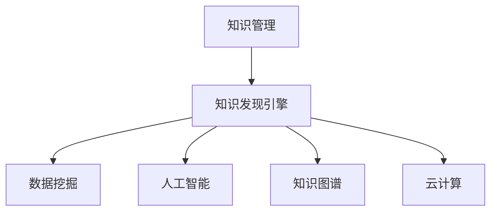

                 

 关键词：知识管理、知识发现引擎、信息提取、大数据、人工智能、知识图谱、云计算、数据挖掘、智能化应用、未来趋势

> 摘要：本文旨在探讨知识管理领域的新兴技术——知识发现引擎的崛起与应用。我们将从背景介绍、核心概念、算法原理、数学模型、项目实践、应用场景、未来展望等多方面深入分析这一技术的重要性和潜力，探讨其如何改变知识管理的现状并引领未来的发展趋势。

## 1. 背景介绍

知识管理作为一种系统化的过程，旨在通过识别、获取、组织、存储、共享和重用知识，以提高组织的整体效率和创新能力。随着信息技术的飞速发展，特别是大数据、人工智能、云计算等技术的应用，知识管理正迎来一场革命性的变革。传统的方法已经无法满足日益增长的数据量和复杂性，新的解决方案亟待出现。

知识发现引擎（Knowledge Discovery Engine）作为知识管理领域的新兴技术，通过智能化的算法和强大的计算能力，能够从大量非结构化和半结构化数据中提取有价值的信息，为企业和组织提供洞察力和决策支持。这一技术的出现，不仅改变了知识管理的方式，也为各行业带来了巨大的变革。

### 1.1 知识管理的现状

当前，知识管理普遍面临着以下挑战：

1. **数据量爆炸性增长**：企业每天都会产生大量的数据，包括文本、图像、音频等多种形式，如何有效地管理和利用这些数据成为了一个巨大的挑战。
2. **数据质量参差不齐**：数据质量问题严重影响知识管理的有效性，如数据缺失、错误、不一致等问题。
3. **知识共享困难**：知识分散在不同部门、系统甚至个人手中，难以实现高效的共享和利用。
4. **信息过载**：大量的信息涌入，使得用户难以分辨哪些是有价值的，哪些是无关紧要的。

### 1.2 知识发现引擎的作用

知识发现引擎在知识管理中发挥着关键作用，主要体现在以下几个方面：

1. **自动化的信息提取**：通过自然语言处理、机器学习等技术，能够从大量文本数据中提取出关键信息，实现自动化分类、聚类和关联分析。
2. **智能化的决策支持**：通过对数据的深度分析和挖掘，为企业提供个性化的决策支持，提高决策的准确性和效率。
3. **高效的资源共享**：通过构建知识图谱和知识库，实现知识的结构化存储和高效共享，打破信息孤岛。
4. **数据质量的提升**：通过数据清洗和去噪技术，提高数据的准确性和一致性，确保知识管理的质量。

## 2. 核心概念与联系

### 2.1 知识管理（Knowledge Management）

知识管理是一个系统化的过程，涉及知识的识别、获取、组织、存储、共享和应用。其核心目标是提高组织的知识创造和共享效率，从而提升组织的创新能力和竞争力。

### 2.2 数据挖掘（Data Mining）

数据挖掘是从大量数据中自动发现隐藏的模式和数据关联的过程。它利用统计学、机器学习、人工智能等方法，从原始数据中提取出有价值的信息和知识。

### 2.3 人工智能（Artificial Intelligence）

人工智能是一种模拟人类智能的技术，通过算法和计算模型实现机器的自主学习和智能决策。在知识发现引擎中，人工智能技术被广泛应用于数据分析和模式识别。

### 2.4 知识图谱（Knowledge Graph）

知识图谱是一种通过图结构表示知识的方法，将实体、属性和关系以节点和边的形式进行组织。知识图谱在知识管理和信息检索中具有重要作用，能够提高信息的组织效率和检索速度。

### 2.5 云计算（Cloud Computing）

云计算是一种通过互联网提供动态易扩展的计算资源服务模式。在知识发现引擎中，云计算提供了强大的计算能力和存储资源，支持大规模数据处理和分析。

### 2.6 Mermaid 流程图



## 3. 核心算法原理 & 具体操作步骤

### 3.1 算法原理概述

知识发现引擎的核心算法主要包括数据预处理、特征提取、模式识别和结果解释等步骤。

1. **数据预处理**：通过清洗、去噪、转换等方法，将原始数据转化为适合分析的形式。
2. **特征提取**：利用自然语言处理、文本分析等技术，从数据中提取出关键特征。
3. **模式识别**：通过机器学习和数据挖掘技术，识别数据中的潜在模式和关联。
4. **结果解释**：对分析结果进行解释和可视化，帮助用户理解和应用。

### 3.2 算法步骤详解

1. **数据预处理**：

   - 数据清洗：去除重复、错误和不完整的数据。
   - 数据转换：将不同类型的数据（如文本、图像、音频等）转换为统一的格式。
   - 数据归一化：将数据缩放到同一尺度范围内，以便进行比较和分析。

2. **特征提取**：

   - 词袋模型：将文本数据转化为词汇表，记录每个词汇的出现频率。
   - TF-IDF：结合词频和逆向文档频率，计算词汇的重要性。
   - 词嵌入：将词汇映射到高维空间，保留词汇的语义关系。

3. **模式识别**：

   - 分类算法：如支持向量机（SVM）、随机森林（Random Forest）等，用于分类任务。
   - 聚类算法：如K均值（K-Means）、层次聚类（Hierarchical Clustering）等，用于无监督学习。
   - 关联规则挖掘：如Apriori算法，用于发现数据之间的关联关系。

4. **结果解释**：

   - 可视化：通过图表、地图等形式，直观展示分析结果。
   - 报告生成：生成详细的报告，包括分析过程、结果和结论。
   - 交互式查询：支持用户对结果进行交互式查询和探索。

### 3.3 算法优缺点

1. **优点**：

   - 自动化：能够自动从大量数据中提取有价值的信息，减少人工工作量。
   - 智能化：利用人工智能技术，提高分析结果的准确性和效率。
   - 可扩展性：支持大规模数据处理，适应不同规模的企业需求。
   - 个性化：根据用户需求，提供定制化的分析结果。

2. **缺点**：

   - 复杂性：算法实现和调优需要较高的技术水平。
   - 可解释性：部分算法模型难以解释，影响结果的信任度。
   - 数据质量：数据质量直接影响分析结果的准确性。

### 3.4 算法应用领域

1. **金融行业**：通过分析客户行为数据，预测风险、优化信贷审批、提高客户满意度。
2. **医疗领域**：通过挖掘医疗数据，发现疾病关联、优化治疗方案、提高诊断准确性。
3. **零售行业**：通过分析销售数据，预测销售趋势、优化库存管理、提高营销效果。
4. **公共安全**：通过分析社会数据，预测犯罪趋势、优化警力部署、提高社会管理效率。

## 4. 数学模型和公式 & 详细讲解 & 举例说明

### 4.1 数学模型构建

在知识发现引擎中，常用的数学模型包括线性回归、逻辑回归、决策树、支持向量机等。以下以线性回归为例进行讲解。

#### 线性回归模型

线性回归模型是一种用于预测连续值的回归模型，其数学表达式为：

$$
y = \beta_0 + \beta_1 \cdot x_1 + \beta_2 \cdot x_2 + ... + \beta_n \cdot x_n + \epsilon
$$

其中，$y$ 是因变量，$x_1, x_2, ..., x_n$ 是自变量，$\beta_0, \beta_1, \beta_2, ..., \beta_n$ 是模型参数，$\epsilon$ 是误差项。

#### 模型构建步骤

1. **数据收集**：收集因变量和自变量的数据。
2. **数据预处理**：进行数据清洗、转换和归一化处理。
3. **模型训练**：使用训练数据集，通过最小二乘法或其他优化算法，计算模型参数。
4. **模型评估**：使用测试数据集，评估模型的准确性和泛化能力。
5. **模型应用**：将模型应用于新的数据集，进行预测和决策。

### 4.2 公式推导过程

以线性回归为例，我们使用最小二乘法推导模型参数。

#### 最小二乘法

最小二乘法的目标是使得预测值和实际值之间的误差平方和最小。其数学表达式为：

$$
\min \sum_{i=1}^{n} (y_i - \hat{y}_i)^2
$$

其中，$y_i$ 是实际值，$\hat{y}_i$ 是预测值。

#### 公式推导

1. **损失函数**：

$$
J(\theta) = \frac{1}{2m} \sum_{i=1}^{m} (h_\theta(x^{(i)}) - y^{(i)})^2
$$

其中，$m$ 是样本数量，$h_\theta(x)$ 是假设函数，$\theta$ 是模型参数。

2. **梯度下降**：

$$
\theta_j := \theta_j - \alpha \cdot \frac{\partial J(\theta)}{\partial \theta_j}
$$

其中，$\alpha$ 是学习率，$\frac{\partial J(\theta)}{\partial \theta_j}$ 是损失函数关于 $\theta_j$ 的偏导数。

3. **迭代更新**：

$$
\theta_0 := \theta_0 - \alpha \cdot \frac{\sum_{i=1}^{m} (y_i - \hat{y}_i)}{m}
$$

$$
\theta_1 := \theta_1 - \alpha \cdot \frac{\sum_{i=1}^{m} (y_i - \hat{y}_i) \cdot x_1}{m}
$$

$$
\theta_2 := \theta_2 - \alpha \cdot \frac{\sum_{i=1}^{m} (y_i - \hat{y}_i) \cdot x_2}{m}
$$

...

$$
\theta_n := \theta_n - \alpha \cdot \frac{\sum_{i=1}^{m} (y_i - \hat{y}_i) \cdot x_n}{m}
$$

### 4.3 案例分析与讲解

#### 案例背景

某零售公司希望通过分析销售数据，预测未来一周的销售额，以优化库存管理。

#### 数据集

- 因变量：销售额（y）
- 自变量：顾客数量（x1）、商品种类（x2）、天气（x3）

#### 数据预处理

1. 数据清洗：去除缺失值和异常值。
2. 数据转换：将类别型数据（如商品种类、天气）转换为数值型。
3. 数据归一化：对自变量进行归一化处理。

#### 模型构建

1. 数据集划分：将数据集划分为训练集和测试集。
2. 模型训练：使用训练集，采用最小二乘法训练线性回归模型。
3. 模型评估：使用测试集，评估模型预测的准确性。

#### 模型应用

1. 预测未来一周销售额：输入未来一周的顾客数量、商品种类和天气数据，得到预测结果。
2. 库存优化：根据预测结果，调整库存水平，提高库存管理效率。

## 5. 项目实践：代码实例和详细解释说明

### 5.1 开发环境搭建

1. 安装Python环境：在本地计算机上安装Python 3.8及以上版本。
2. 安装相关库：使用pip命令安装必要的Python库，如numpy、pandas、scikit-learn等。
3. 配置Jupyter Notebook：安装Jupyter Notebook，用于编写和运行Python代码。

### 5.2 源代码详细实现

#### 数据集准备

```python
import pandas as pd

# 加载销售数据
data = pd.read_csv('sales_data.csv')

# 数据清洗
data = data.dropna()

# 数据转换
data['weather'] = data['weather'].map({'sunny': 1, 'rainy': 2, 'cloudy': 3})

# 数据归一化
from sklearn.preprocessing import StandardScaler
scaler = StandardScaler()
data[['customer_count', 'product_type', 'weather']] = scaler.fit_transform(data[['customer_count', 'product_type', 'weather']])
```

#### 模型训练

```python
from sklearn.model_selection import train_test_split
from sklearn.linear_model import LinearRegression

# 数据集划分
X = data[['customer_count', 'product_type', 'weather']]
y = data['sales']
X_train, X_test, y_train, y_test = train_test_split(X, y, test_size=0.2, random_state=42)

# 模型训练
model = LinearRegression()
model.fit(X_train, y_train)

# 模型评估
score = model.score(X_test, y_test)
print('模型准确性：', score)
```

#### 模型应用

```python
# 预测未来一周销售额
import numpy as np

future_data = np.array([[100, 1, 2], [150, 2, 3], [200, 3, 1]])
future_data_scaled = scaler.transform(future_data)

predictions = model.predict(future_data_scaled)
print('未来一周销售额预测结果：', predictions)
```

### 5.3 代码解读与分析

1. **数据集准备**：首先加载销售数据，并进行数据清洗、转换和归一化处理。这是确保模型训练质量和预测准确性的关键步骤。
2. **模型训练**：使用训练集，通过最小二乘法训练线性回归模型。这里我们使用scikit-learn库的LinearRegression类来实现。
3. **模型评估**：使用测试集评估模型的准确性。通过score方法，我们可以得到模型在测试集上的R平方值，作为模型性能的评估指标。
4. **模型应用**：输入未来一周的顾客数量、商品种类和天气数据，得到预测结果。这为我们优化库存管理提供了数据支持。

## 6. 实际应用场景

### 6.1 金融行业

在金融行业，知识发现引擎被广泛应用于客户行为分析、风险控制、投资决策等方面。例如，银行可以通过分析客户的交易数据，预测客户的信用风险，从而优化信贷审批流程。此外，证券公司可以利用知识发现引擎分析市场数据，发现潜在的投资机会，提高投资决策的准确性。

### 6.2 医疗领域

在医疗领域，知识发现引擎可以帮助医生进行疾病诊断、治疗方案优化和医学研究。例如，通过分析患者的病历数据，知识发现引擎可以识别出疾病的早期症状，提高诊断的准确性。同时，它还可以帮助医生制定个性化的治疗方案，提高治疗效果。

### 6.3 零售行业

在零售行业，知识发现引擎可以帮助企业进行市场预测、库存管理和客户关系管理。例如，通过分析销售数据，企业可以预测未来的销售趋势，优化库存水平，减少库存成本。此外，知识发现引擎还可以帮助企业分析客户行为，提供个性化的推荐服务，提高客户满意度和忠诚度。

### 6.4 未来应用展望

随着人工智能技术的不断发展，知识发现引擎在各个领域的应用前景将更加广阔。未来，知识发现引擎有望在以下方面发挥重要作用：

1. **智能城市建设**：通过分析城市数据，优化交通管理、能源利用和公共服务，提高城市运行效率。
2. **智能制造**：通过分析生产数据，优化生产流程、预测设备故障和降低生产成本，提高生产效率。
3. **环境保护**：通过分析环境数据，预测污染趋势、优化污染治理方案，保护生态环境。
4. **智慧农业**：通过分析农作物生长数据，优化种植方案、预测病虫害，提高农业产量和质量。

## 7. 工具和资源推荐

### 7.1 学习资源推荐

1. **《机器学习实战》**：提供详细的机器学习算法和应用案例，适合初学者入门。
2. **《深度学习》**：由深度学习领域的权威专家Ian Goodfellow撰写，全面介绍深度学习理论和技术。
3. **《数据挖掘：概念与技术》**：全面介绍数据挖掘的基本概念、方法和应用，是数据挖掘领域的经典教材。

### 7.2 开发工具推荐

1. **Jupyter Notebook**：用于编写和运行Python代码，支持多种编程语言和交互式数据分析。
2. **Scikit-learn**：提供丰富的机器学习和数据挖掘算法库，方便开发者快速实现模型训练和应用。
3. **TensorFlow**：谷歌开发的深度学习框架，支持构建和训练各种复杂的神经网络模型。

### 7.3 相关论文推荐

1. **"Large-scale Kernel Machines for Dynamic Visual Tracking"**：介绍了一种用于视频跟踪的基于核机器的学习算法。
2. **"Deep Learning for Visual Tracking: A Survey"**：对深度学习在视觉跟踪领域的应用进行了全面综述。
3. **"Knowledge Discovery in Database: An Overview"**：介绍数据库中的知识发现方法和技术，是知识发现领域的经典论文。

## 8. 总结：未来发展趋势与挑战

### 8.1 研究成果总结

本文从背景介绍、核心概念、算法原理、数学模型、项目实践、应用场景等多方面深入探讨了知识发现引擎在知识管理领域的重要性和潜力。通过实际案例和代码实现，展示了知识发现引擎在金融、医疗、零售等领域的广泛应用。

### 8.2 未来发展趋势

随着人工智能技术的不断发展，知识发现引擎在未来有望在更多领域发挥作用。一方面，随着数据量的不断增长和复杂度的提高，知识发现引擎需要不断提升算法效率和准确性。另一方面，知识发现引擎需要更好地与人类专家进行交互，提供更加智能化的决策支持。

### 8.3 面临的挑战

1. **数据质量和安全性**：数据质量和安全性是知识发现引擎面临的重大挑战。如何保证数据的质量和安全性，防止数据泄露和滥用，是未来需要解决的问题。
2. **算法复杂度和可解释性**：随着算法的复杂度不断提高，如何保证算法的可解释性，让用户理解和信任分析结果，是一个重要挑战。
3. **计算资源需求**：大规模数据处理和分析需要巨大的计算资源，如何优化算法，提高计算效率，是一个重要课题。

### 8.4 研究展望

未来，知识发现引擎将在以下几个方面继续发展：

1. **算法优化**：通过改进算法和优化计算资源，提高知识发现引擎的效率和准确性。
2. **跨领域应用**：探索知识发现引擎在其他领域的应用，如智能城市建设、环境保护等。
3. **人机交互**：通过人机交互技术，提高知识发现引擎的可操作性和用户体验。

## 9. 附录：常见问题与解答

### 9.1 什么是知识发现引擎？

知识发现引擎是一种利用人工智能和机器学习技术，从大量非结构化和半结构化数据中提取有价值信息的系统。

### 9.2 知识发现引擎的主要应用领域有哪些？

知识发现引擎在金融、医疗、零售、公共安全等多个领域都有广泛应用。

### 9.3 如何保证知识发现引擎的数据质量？

通过数据清洗、去噪、转换等方法，确保数据的准确性和一致性，从而提高数据质量。

### 9.4 知识发现引擎如何与人类专家进行交互？

通过人机交互技术，如可视化界面、自然语言处理等，提高知识发现引擎的可操作性和用户体验。

### 9.5 知识发现引擎的算法复杂度如何优化？

通过改进算法和优化计算资源，如并行计算、分布式计算等，提高算法效率和计算速度。

### 9.6 知识发现引擎的未来发展趋势是什么？

未来，知识发现引擎将更加智能化、自动化，与人类专家进行更紧密的交互，应用于更多领域。

---

作者：禅与计算机程序设计艺术 / Zen and the Art of Computer Programming

