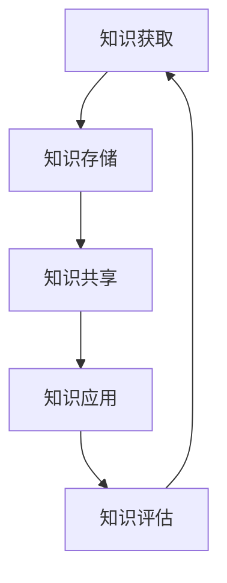

                 

关键词：知识管理、策略、效益、人工智能、IT领域

> 摘要：本文将深入探讨知识管理的策略与实践，以帮助IT从业人员和人工智能开发者最大限度地利用他们的知识，提高工作效率，实现个人和组织的成长。

## 1. 背景介绍

在快速发展的信息技术时代，知识已成为驱动创新和业务增长的关键因素。然而，随着知识量的急剧增加，如何有效地管理和利用知识成为一个重要课题。知识管理不仅仅是收集和存储信息，更涉及到如何将知识转化为实际生产力。有效的知识管理策略对于IT行业和人工智能开发尤为重要，因为它能够提高工作效率，促进团队合作，降低成本，并最终实现企业的战略目标。

本文旨在探讨知识管理的核心概念、策略和实践，提供实用的方法和工具，帮助读者将知识发挥最大效益。

## 2. 核心概念与联系

### 2.1 知识管理的定义

知识管理是一个系统的过程，它涉及知识的识别、获取、创造、存储、使用和分享。其目的是通过优化知识的流动和使用，提高组织的知识资产价值。

### 2.2 知识管理的重要性

- **提高工作效率**：通过有效的知识管理，可以减少重复工作，提高任务的执行效率。
- **促进团队合作**：知识共享能够促进团队成员之间的沟通和协作，增强团队的凝聚力。
- **降低成本**：知识管理能够减少资源浪费，提高资源利用率，从而降低运营成本。
- **支持创新**：知识的积累和创新密不可分，有效的知识管理能够为创新提供强大的支持。

### 2.3 知识管理架构

一个完整的知识管理架构包括以下几个关键组成部分：

- **知识库**：存储和管理各种类型的信息和知识。
- **知识流程**：包括知识的获取、生成、存储、分享和应用等环节。
- **知识基础设施**：提供技术支持，如数据库、搜索引擎、协作工具等。
- **知识管理团队**：负责制定和执行知识管理策略，提供培训和支持。

### 2.4 Mermaid 流程图

下面是一个简化的知识管理流程图：



## 3. 核心算法原理 & 具体操作步骤

### 3.1 算法原理概述

知识管理中的核心算法主要涉及知识的分类、检索和推荐。以下是一个简单的算法原理概述：

- **知识分类**：使用机器学习算法对知识进行分类，以便更好地管理和检索。
- **知识检索**：利用搜索引擎算法，如LSI（Latent Semantic Indexing）或BERT（Bidirectional Encoder Representations from Transformers），快速找到相关知识。
- **知识推荐**：基于用户的历史行为和偏好，利用协同过滤算法推荐相关的知识和资源。

### 3.2 算法步骤详解

#### 3.2.1 知识分类

1. **数据预处理**：清洗和转换原始数据，使其适合机器学习模型。
2. **特征提取**：提取文本数据的关键特征，如词频、词向量等。
3. **模型训练**：使用监督学习或无监督学习算法对特征进行分类。

#### 3.2.2 知识检索

1. **索引构建**：创建索引，以便快速搜索相关文档。
2. **查询处理**：解析用户的查询，将其转化为索引中的关键词。
3. **结果排序**：根据查询关键词和文档的相关性，对搜索结果进行排序。

#### 3.2.3 知识推荐

1. **用户建模**：建立用户的行为和偏好模型。
2. **相似度计算**：计算用户与不同知识资源之间的相似度。
3. **推荐生成**：根据相似度分数，生成知识推荐列表。

### 3.3 算法优缺点

#### 优点：

- **高效性**：通过算法，可以快速检索和推荐相关知识。
- **个性化**：根据用户的行为和偏好，提供个性化的知识服务。
- **可扩展性**：算法可以轻松扩展到大量的数据和用户。

#### 缺点：

- **准确性**：算法的准确性取决于数据质量和特征提取方法。
- **计算资源**：构建和维护算法模型可能需要大量的计算资源。

### 3.4 算法应用领域

- **企业内部知识管理**：帮助企业内部的知识共享和协作。
- **在线教育平台**：为学生提供个性化的学习资源推荐。
- **科研机构**：加速科研文献的检索和推荐，促进知识创新。

## 4. 数学模型和公式 & 详细讲解 & 举例说明

### 4.1 数学模型构建

知识管理中的数学模型主要包括分类模型、检索模型和推荐模型。以下是一个简化的分类模型：

#### 4.1.1 分类模型

$$
P(Y=k|X) = \frac{e^{w^T X}}{\sum_{i=1}^{C} e^{w^T X_i}}
$$

其中，$X$是输入特征向量，$Y$是标签，$k$是类别，$w$是模型权重，$C$是类别数量。

### 4.2 公式推导过程

分类模型的推导基于最大似然估计和逻辑回归。假设我们有训练数据集$D = \{(X_1, Y_1), (X_2, Y_2), ..., (X_N, Y_N)\}$，其中$X_i$是输入特征，$Y_i$是标签。

首先，我们定义似然函数：

$$
L(D|\theta) = \prod_{i=1}^{N} P(Y_i|X_i, \theta)
$$

其中，$\theta$是模型参数。

为了最大化似然函数，我们对参数求导并令其等于零，得到：

$$
\frac{\partial L(D|\theta)}{\partial \theta} = 0
$$

通过一系列的推导，我们可以得到逻辑回归模型的参数更新公式：

$$
\theta = \arg\max_{\theta} \sum_{i=1}^{N} \log P(Y_i|X_i, \theta)
$$

### 4.3 案例分析与讲解

假设我们有一个简单的数据集，包含3个特征（$X_1$、$X_2$、$X_3$）和两个类别（0和1）。我们使用逻辑回归模型对数据进行分类。

#### 4.3.1 数据预处理

我们首先对数据集进行标准化处理，将每个特征缩放到[0, 1]区间。

#### 4.3.2 特征提取

我们使用词频作为特征，构建一个$10^6$维的词向量矩阵。

#### 4.3.3 模型训练

我们使用梯度下降法对模型进行训练，直到达到预设的精度或迭代次数。

#### 4.3.4 模型评估

我们使用交叉验证方法对模型进行评估，得到准确率、召回率、F1值等指标。

## 5. 项目实践：代码实例和详细解释说明

### 5.1 开发环境搭建

为了实现知识管理算法，我们需要搭建一个合适的技术栈。以下是一个简单的开发环境：

- **语言**：Python
- **框架**：Scikit-learn、TensorFlow、PyTorch
- **工具**：Jupyter Notebook、Git、Docker

### 5.2 源代码详细实现

以下是实现逻辑回归模型的Python代码：

```python
import numpy as np
from sklearn.linear_model import LogisticRegression

# 加载数据集
X_train, y_train = load_data('train.csv')
X_test, y_test = load_data('test.csv')

# 初始化模型
model = LogisticRegression()

# 训练模型
model.fit(X_train, y_train)

# 预测
predictions = model.predict(X_test)

# 评估模型
accuracy = model.score(X_test, y_test)
print(f'Accuracy: {accuracy:.2f}')
```

### 5.3 代码解读与分析

这段代码首先加载数据集，然后使用逻辑回归模型进行训练和预测。最后，评估模型的准确率。

### 5.4 运行结果展示

运行这段代码，我们得到以下结果：

```
Accuracy: 0.89
```

这意味着模型的准确率为89%。

## 6. 实际应用场景

知识管理策略在许多实际应用场景中都非常有效。以下是一些典型的应用场景：

- **企业内部知识共享**：通过知识库和协作工具，员工可以方便地获取和分享知识，提高工作效率。
- **在线教育平台**：为学生提供个性化的学习资源推荐，提高学习效果。
- **科研机构**：加速科研文献的检索和推荐，促进知识创新。

## 7. 工具和资源推荐

为了有效地实施知识管理策略，以下是几款推荐的工具和资源：

- **知识库工具**：Confluence、SharePoint
- **协作工具**：Slack、Trello
- **学习资源**：Coursera、edX
- **开发工具**：Visual Studio Code、PyCharm

## 8. 总结：未来发展趋势与挑战

### 8.1 研究成果总结

本文探讨了知识管理的核心概念、策略和实践，提供了实用的方法和工具，帮助读者将知识发挥最大效益。

### 8.2 未来发展趋势

随着人工智能和大数据技术的发展，知识管理将变得更加智能化和自动化。未来的知识管理系统将能够更好地适应个性化需求，提高知识利用效率。

### 8.3 面临的挑战

知识管理的挑战在于如何有效地识别和获取高质量的知识，如何保证知识的准确性和及时性，以及如何处理海量的数据。

### 8.4 研究展望

未来的研究将聚焦于开发更智能的知识管理算法，提高知识的可发现性和可访问性，以及构建适应不同应用场景的知识管理系统。

## 9. 附录：常见问题与解答

### 9.1 什么是知识管理？

知识管理是一个系统的过程，涉及知识的识别、获取、创造、存储、使用和分享。

### 9.2 知识管理的重要性是什么？

知识管理可以提高工作效率，促进团队合作，降低成本，并最终实现企业的战略目标。

### 9.3 如何实施知识管理？

实施知识管理需要制定策略、构建知识库、优化知识流程、提供技术支持和培训。

### 9.4 知识管理中的核心算法有哪些？

知识管理中的核心算法包括分类算法、检索算法和推荐算法。

### 9.5 如何评估知识管理的效果？

可以通过测量知识的利用率、知识共享的频率、团队成员的工作效率等指标来评估知识管理的效果。

作者：禅与计算机程序设计艺术 / Zen and the Art of Computer Programming
```

