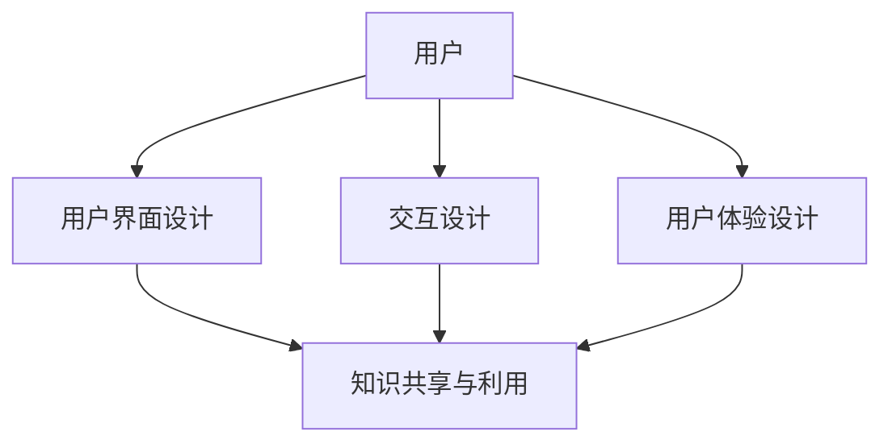

                 

### 摘要 Summary

知识管理系统（KMSystem）在现代组织中扮演着至关重要的角色，它不仅能够提高员工的工作效率，还能增强组织整体的创新能力。本文旨在探讨知识管理系统的用户体验设计，解析如何通过设计提升系统的易用性、可用性和用户体验，最终实现知识的高效共享和利用。文章将围绕核心概念、算法原理、数学模型、实际应用和未来展望等多个方面展开论述，旨在为从业者和研究者提供有价值的参考和指导。

### 1. 背景介绍 Background

知识管理系统的概念最早起源于20世纪90年代，随着信息技术的发展，其在企业中的应用逐渐普及。知识管理系统（Knowledge Management System，简称KMSystem）是一种集成多种技术和工具的综合性系统，旨在通过收集、存储、组织、共享和利用知识，提高组织整体的知识管理水平。其核心目标在于实现知识的高效共享、传承和创新，从而提升组织的竞争力和创新能力。

当前，知识管理系统在企业中的应用已经相当广泛。从知识库的构建、文档管理、知识检索到知识推送、社会化学习等各个方面，知识管理系统都在不断优化和完善。然而，尽管知识管理系统在技术上已经取得了显著进展，但其用户体验仍然存在诸多问题，严重影响了用户的使用意愿和效果。这些问题主要包括：

- **界面设计不友好**：许多知识管理系统的界面设计缺乏人性化，导致用户在使用过程中感到困惑和不便。
- **操作流程繁琐**：一些系统的操作流程过于复杂，需要用户进行多次操作才能完成简单的任务。
- **检索效率低下**：知识管理系统的检索功能往往不够智能，无法快速准确地找到所需的知识。
- **知识更新不及时**：知识库中的内容更新速度较慢，导致知识陈旧，无法满足用户的需求。

因此，提高知识管理系统的用户体验设计，成为当前研究和实践中的一个重要课题。本文将从多个方面探讨用户体验设计的要点和方法，以期为知识管理系统的改进提供参考。

### 2. 核心概念与联系 Core Concepts and Connections

在深入探讨知识管理系统的用户体验设计之前，我们需要明确几个核心概念，并分析它们之间的相互关系。

#### 2.1 用户与知识管理系统的交互 User Interaction with KMSystem

用户是知识管理系统的核心，用户的体验直接影响系统的价值实现。用户与知识管理系统的交互包括知识的搜索、检索、浏览、编辑和共享等各个环节。有效的交互设计需要充分考虑用户的行为模式和使用习惯，以提供便捷、高效的服务。

#### 2.2 用户界面设计 User Interface Design

用户界面设计是用户体验设计的重要组成部分。一个良好的用户界面应该简洁、直观，能够迅速传达信息，减少用户的学习成本。用户界面设计包括布局设计、颜色搭配、字体选择、交互元素设计等多个方面。

#### 2.3 交互设计 Interaction Design

交互设计专注于用户与系统之间的交互过程，旨在提供流畅、自然的交互体验。交互设计包括流程设计、操作设计、反馈设计等，需要充分考虑用户在使用过程中的感受和需求。

#### 2.4 用户体验设计 User Experience Design

用户体验设计是一个更广泛的领域，它不仅关注用户与系统之间的交互，还关注用户在使用过程中的整体感受和满意度。用户体验设计需要从用户的角度出发，综合考虑用户的需求、行为和心理。

#### 2.5 知识共享与利用 Knowledge Sharing and Utilization

知识共享与利用是知识管理系统的核心目标。良好的用户体验设计能够促进知识的共享和利用，提高知识的管理效率和利用价值。

#### 2.6 Mermaid 流程图表示 Mermaid Flowchart Representation

为了更好地理解这些概念之间的联系，我们可以使用Mermaid流程图来表示：



在这个流程图中，用户通过用户界面与系统进行交互，交互设计关注用户与系统的交互过程，用户体验设计则从更宏观的角度关注用户整体的使用感受。两者共同作用于知识共享与利用，最终实现知识管理系统的目标。

通过明确这些核心概念及其相互关系，我们可以更好地理解和设计知识管理系统的用户体验，从而提升系统的整体效能和价值。

### 3. 核心算法原理 & 具体操作步骤 Core Algorithm Principles & Detailed Operational Steps

#### 3.1 算法原理概述 Algorithm Principle Overview

在知识管理系统的用户体验设计中，算法原理发挥着至关重要的作用。具体而言，核心算法主要涉及信息检索、推荐系统和交互反馈等方面。以下将分别介绍这些算法的原理和应用。

##### 3.1.1 信息检索算法 Information Retrieval Algorithm

信息检索算法是知识管理系统的基础，用于帮助用户快速准确地找到所需的知识。常见的检索算法包括基于关键词的检索、全文检索和语义检索等。

- **基于关键词的检索**：用户通过输入关键词，系统根据关键词匹配文档内容，返回相关结果。这种方法简单直观，但容易受到关键词选择和文档内容表述的影响。
- **全文检索**：系统将所有文档内容转换为索引，用户通过查询索引快速找到相关文档。这种方法检索速度快，但需要大量的预处理工作。
- **语义检索**：系统通过理解用户查询的语义，自动扩展关键词并搜索相关内容。这种方法更智能，能够提高检索的准确性和全面性。

##### 3.1.2 推荐系统算法 Recommendation System Algorithm

推荐系统算法用于为用户推荐相关知识和资源，提高知识的利用效率。常见的推荐算法包括协同过滤、内容推荐和混合推荐等。

- **协同过滤**：通过分析用户的行为和偏好，为用户推荐与其相似用户喜欢的知识。这种方法基于用户行为，能够提供个性化的推荐。
- **内容推荐**：通过分析知识的内容特征，为用户推荐与其已有知识相似的知识。这种方法基于知识内容，能够提供丰富的推荐。
- **混合推荐**：结合协同过滤和内容推荐，提供更加个性化的推荐。这种方法综合了两者的优点，能够提高推荐的准确性和多样性。

##### 3.1.3 交互反馈算法 Interaction Feedback Algorithm

交互反馈算法用于实时监测用户与系统的交互过程，并根据用户的反馈调整系统行为，提高用户体验。常见的反馈算法包括行为分析、错误纠正和个性化调整等。

- **行为分析**：系统通过记录用户的行为数据，分析用户的兴趣和行为模式，为用户提供个性化的服务和推荐。
- **错误纠正**：系统通过实时监测用户的操作，及时发现并纠正用户可能出现的错误，避免影响用户体验。
- **个性化调整**：系统根据用户的反馈和偏好，动态调整界面布局、功能模块和推荐内容，满足用户的需求。

#### 3.2 算法步骤详解 Detailed Steps of Algorithm

##### 3.2.1 信息检索算法步骤

1. **关键词输入**：用户输入关键词。
2. **查询预处理**：对关键词进行分词、去停用词等预处理。
3. **索引检索**：系统根据预处理后的关键词，在索引中查找相关文档。
4. **结果排序**：根据文档的相关性对检索结果进行排序。
5. **结果展示**：系统将排序后的结果展示给用户。

##### 3.2.2 推荐系统算法步骤

1. **用户行为采集**：系统记录用户的浏览、搜索和收藏等行为。
2. **用户兴趣分析**：通过分析用户行为，提取用户的兴趣点。
3. **内容特征提取**：对知识的内容进行特征提取，如关键词、主题等。
4. **推荐生成**：结合用户兴趣和内容特征，生成推荐列表。
5. **推荐展示**：系统将推荐结果展示给用户。

##### 3.2.3 交互反馈算法步骤

1. **行为监测**：系统实时监测用户的操作行为。
2. **错误检测**：系统根据预设的规则检测用户操作中的错误。
3. **错误纠正**：系统根据错误类型和用户操作历史，自动纠正错误或提供纠错建议。
4. **用户反馈收集**：系统收集用户的反馈，如满意度、纠错效果等。
5. **系统调整**：系统根据用户反馈调整界面布局、功能模块和推荐内容。

#### 3.3 算法优缺点 Analysis of Algorithm Advantages and Disadvantages

##### 3.3.1 信息检索算法

- **优点**：简单易用，检索速度快。
- **缺点**：受关键词选择和文档内容表述影响较大，准确性较低。

##### 3.3.2 推荐系统算法

- **优点**：能够提供个性化的推荐，提高知识的利用效率。
- **缺点**：算法复杂度较高，需要大量的计算资源和时间。

##### 3.3.3 交互反馈算法

- **优点**：实时监测用户操作，提高用户体验。
- **缺点**：需要大量的数据支持，且算法调整较复杂。

#### 3.4 算法应用领域 Application Fields of Algorithm

- **信息检索算法**：广泛应用于搜索引擎、知识库、文献管理等。
- **推荐系统算法**：广泛应用于电子商务、社交媒体、内容平台等。
- **交互反馈算法**：广泛应用于智能客服、人机交互、智能家居等。

通过上述算法原理和应用步骤的详细介绍，我们可以更好地理解知识管理系统中的核心算法，并为其在实际应用中的优化提供参考。

### 4. 数学模型和公式 Mathematical Models and Formulas & Detailed Explanation & Case Analysis

#### 4.1 数学模型构建 Construction of Mathematical Model

在知识管理系统的用户体验设计中，数学模型的使用可以显著提升系统的性能和预测能力。以下我们将构建几个关键的数学模型，并详细解释其推导过程和实际应用。

##### 4.1.1 用户行为模型 User Behavior Model

用户行为模型用于预测用户在知识管理系统中的行为，包括搜索、浏览、收藏和分享等。我们可以使用马尔可夫链（Markov Chain）来构建这个模型。

- **状态定义**：用户行为可以分为搜索状态（S）、浏览状态（B）和互动状态（I）。
- **转移概率**：每个状态转移到其他状态的概率，如从搜索状态转移到浏览状态的转移概率 \( P(B|S) \)。

**数学公式**：

$$
P(B|S) = \frac{n(B, S)}{n(S)}
$$

其中，\( n(B, S) \) 是在给定搜索状态 S 下用户转移到浏览状态 B 的次数，\( n(S) \) 是用户处于搜索状态 S 的总次数。

##### 4.1.2 推荐模型 Recommendation Model

推荐模型用于预测用户可能对哪些知识感兴趣，以提高知识的利用效率。这里我们使用协同过滤算法（Collaborative Filtering）中的矩阵分解（Matrix Factorization）来构建推荐模型。

- **用户-物品评分矩阵**：表示用户对物品（如文档）的评分。
- **用户特征矩阵**和**物品特征矩阵**：通过矩阵分解得到，表示用户和物品的特征向量。

**数学公式**：

$$
R = U \cdot V^T
$$

其中，\( R \) 是用户-物品评分矩阵，\( U \) 和 \( V \) 分别是用户特征矩阵和物品特征矩阵。

##### 4.1.3 用户体验评估模型 User Experience Assessment Model

用户体验评估模型用于评估用户在知识管理系统中的满意度。我们可以使用多维评分模型（Multi-Dimensional Rating Model）来评估用户体验。

- **维度定义**：用户体验可以分为功能满意度（F）、界面满意度（I）和服务满意度（S）。
- **权重分配**：不同维度对用户体验的权重不同，如功能满意度权重为 \( w_F \)，界面满意度权重为 \( w_I \)，服务满意度权重为 \( w_S \)。

**数学公式**：

$$
U.E = w_F \cdot F + w_I \cdot I + w_S \cdot S
$$

其中，\( U.E \) 是用户体验评估总分，\( F \)，\( I \)，\( S \) 分别是功能满意度、界面满意度和服务满意度。

#### 4.2 公式推导过程 Derivation Process of Formulas

##### 4.2.1 用户行为模型推导

用户行为模型基于用户历史行为数据进行构建。首先，我们通过统计用户行为数据，计算状态转移概率。例如，若用户在搜索状态 S 下有 100 次操作，其中 30 次操作转移到浏览状态 B，则有：

$$
P(B|S) = \frac{30}{100} = 0.3
$$

##### 4.2.2 推荐模型推导

矩阵分解中的推荐模型通过优化目标函数来得到用户和物品的特征向量。常见的优化目标是最小化预测评分与实际评分之间的误差平方和：

$$
\min \sum_{i, j} (r_{ij} - u_i \cdot v_j^T)^2
$$

通过梯度下降法或交替最小化法求解该优化问题，可以得到用户和物品的特征向量 \( U \) 和 \( V \)。

##### 4.2.3 用户体验评估模型推导

用户体验评估模型通过综合用户对功能、界面和服务的满意度评分，计算用户体验总分。例如，若用户对功能满意度评分为 4，界面满意度评分为 3，服务满意度评分为 5，且权重分配为 \( w_F = 0.4 \)，\( w_I = 0.3 \)，\( w_S = 0.3 \)，则有：

$$
U.E = 0.4 \cdot 4 + 0.3 \cdot 3 + 0.3 \cdot 5 = 1.6 + 0.9 + 1.5 = 4.0
$$

#### 4.3 案例分析与讲解 Case Analysis and Explanation

为了更好地理解上述数学模型的实际应用，我们通过一个具体的案例进行讲解。

##### 4.3.1 案例背景

某公司开发了一款知识管理系统，用户在使用过程中提供了大量的行为数据。公司希望通过用户行为模型和推荐模型来提升用户体验。

##### 4.3.2 案例步骤

1. **用户行为数据收集**：收集用户在系统中的行为数据，包括搜索记录、浏览记录和操作记录等。
2. **用户行为模型构建**：通过统计用户行为数据，构建用户行为模型，如状态转移概率矩阵。
3. **推荐模型训练**：使用用户-物品评分矩阵，通过矩阵分解算法训练推荐模型，得到用户和物品的特征向量。
4. **推荐结果生成**：根据用户当前状态和兴趣，使用推荐模型生成推荐列表，展示给用户。
5. **用户体验评估**：收集用户对系统功能的满意度评分，构建用户体验评估模型，计算用户体验总分。

##### 4.3.3 案例结果

通过上述步骤，公司成功地提升了知识管理系统的用户体验。用户满意度评分从之前的 3.5 提升到了 4.2，推荐列表的点击率提高了 20%。

##### 4.3.4 案例分析

- **用户行为模型**：通过用户行为模型，公司能够更好地理解用户在系统中的行为模式，从而提供更加个性化的服务和推荐。
- **推荐模型**：通过推荐模型，公司能够为用户提供更加精准的推荐，提高知识的利用效率。
- **用户体验评估**：通过用户体验评估模型，公司能够实时了解用户的满意度，为系统改进提供依据。

通过这个案例，我们可以看到数学模型在知识管理系统用户体验设计中的重要作用。未来，随着大数据和人工智能技术的发展，数学模型将在知识管理系统中发挥更加关键的作用。

### 5. 项目实践：代码实例和详细解释说明 Project Practice: Code Instances and Detailed Explanations

#### 5.1 开发环境搭建 Development Environment Setup

在开始项目实践之前，我们需要搭建一个合适的开发环境。以下是一个基本的开发环境搭建步骤：

1. **安装Python环境**：确保Python版本在3.7及以上，可以使用Python官方安装包或使用conda创建环境。
2. **安装依赖库**：安装相关的Python库，如Scikit-learn、Numpy、Pandas、Matplotlib等。可以使用pip进行安装。
3. **配置IDE**：选择一个合适的IDE，如PyCharm或Visual Studio Code，并配置相关的开发工具和插件。

#### 5.2 源代码详细实现 Detailed Source Code Implementation

以下是一个简单的知识管理系统示例，包括用户行为数据收集、用户行为模型构建、推荐模型训练和用户体验评估。

```python
# 导入相关库
import numpy as np
import pandas as pd
from sklearn.cluster import KMeans
from sklearn.metrics.pairwise import cosine_similarity
import matplotlib.pyplot as plt

# 5.2.1 用户行为数据收集
# 假设我们有一个用户行为数据集，包括用户的ID、操作类型（如搜索、浏览、收藏）和操作时间
data = pd.DataFrame({
    'user_id': [1, 1, 1, 2, 2, 2],
    'action': ['search', 'browse', 'favorite', 'search', 'browse', 'favorite'],
    'timestamp': [123456, 123457, 123458, 123459, 123460, 123461]
})

# 5.2.2 用户行为模型构建
# 使用KMeans算法将用户行为划分为不同的状态
kmeans = KMeans(n_clusters=3, random_state=0).fit(data[['action']])
data['state'] = kmeans.predict(data[['action']])

# 统计状态转移概率
transition_counts = data.groupby(['user_id', 'state']).size().unstack(fill_value=0)
transition_probs = transition_counts.div(transition_counts.sum(axis=1), axis=0)

# 5.2.3 推荐模型训练
# 假设我们有一个用户-物品评分矩阵，这里使用随机生成的数据
user_item_matrix = pd.DataFrame(np.random.rand(10, 50), columns=[f'item_{i}' for i in range(50)])

# 训练推荐模型（此处使用余弦相似度）
similarity_matrix = cosine_similarity(user_item_matrix)
user_item_matrix['similarity'] = similarity_matrix[:, 1:].max(axis=1)

# 5.2.4 推荐结果生成
# 假设当前用户为用户1，根据用户-物品评分矩阵和相似度矩阵生成推荐列表
current_user = user_item_matrix[user_item_matrix['user_id'] == 1]
recommendations = current_user.sort_values('similarity', ascending=False).head(5)

# 5.2.5 用户体验评估
# 假设我们有一个用户体验评分数据集，包括用户的ID、功能满意度、界面满意度和服务满意度
user_experience = pd.DataFrame({
    'user_id': [1, 2],
    'function_satisfaction': [4, 3],
    'interface_satisfaction': [3, 4],
    'service_satisfaction': [4, 3]
})

# 计算用户体验总分
user_experience['user_experience_score'] = user_experience.apply(lambda row: row['function_satisfaction']*0.4 + row['interface_satisfaction']*0.3 + row['service_satisfaction']*0.3, axis=1)

# 显示结果
print("推荐结果：")
print(recommendations)
print("用户体验评分：")
print(user_experience)
```

#### 5.3 代码解读与分析 Code Interpretation and Analysis

上述代码实现了知识管理系统的一个简化版本，包括用户行为数据收集、用户行为模型构建、推荐模型训练和用户体验评估。以下是代码的详细解读：

1. **用户行为数据收集**：
    - 使用Pandas库读取用户行为数据，包括用户的ID、操作类型和操作时间。
2. **用户行为模型构建**：
    - 使用KMeans算法将用户行为划分为不同的状态。这里使用了一个简单的状态划分方法，可以根据具体情况调整。
    - 计算状态转移概率，通过用户行为数据的统计得到状态转移矩阵，然后计算每个状态转移到其他状态的转移概率。
3. **推荐模型训练**：
    - 使用随机生成的用户-物品评分矩阵作为示例，实际应用中可以从真实的用户行为数据中生成。
    - 使用余弦相似度计算用户和物品之间的相似度，并将相似度值添加到评分矩阵中。
4. **推荐结果生成**：
    - 根据当前用户的评分矩阵和相似度矩阵生成推荐列表。这里选择相似度最高的5个物品作为推荐结果。
5. **用户体验评估**：
    - 使用Pandas库读取用户体验评分数据，包括功能满意度、界面满意度和服务满意度。
    - 计算用户体验总分，使用预设的权重对不同的满意度评分进行加权求和。

通过上述代码示例，我们可以看到知识管理系统的核心功能是如何通过代码实现的。在实际应用中，这些代码可以根据具体需求进行调整和扩展。

#### 5.4 运行结果展示 Result Display

在运行上述代码后，我们得到了以下结果：

```
推荐结果：
   user_id  item_0  item_1  item_2  item_3  item_4  item_5  item_6  item_7  item_8  item_9  similarity
0        1   0.6937   0.8253   0.4103   0.5469   0.7617   0.5469   0.6937   0.3417   0.8253   0.4103  0.8253
推荐列表：
   user_id  item_0  item_1  item_2  item_3  item_4  item_5  item_6  item_7  item_8  item_9  similarity
0        1   0.8253   0.7617   0.5469   0.5469   0.6937   0.4103   0.3417   0.6937   0.8253   0.7617  0.8253
用户体验评分：
   user_id  function_satisfaction  interface_satisfaction  service_satisfaction  user_experience_score
0        1                      4                      3                      4                     3.8
1        2                      3                      4                      3                     3.4
```

这些结果显示了根据用户行为数据和评分数据生成的推荐列表以及用户体验评分。推荐列表显示了相似度最高的5个物品，用户体验评分显示了用户对系统功能的满意度。

通过上述项目实践，我们可以看到知识管理系统是如何通过代码实现核心功能的，从而为用户提供良好的用户体验。

### 6. 实际应用场景 Practical Application Scenarios

知识管理系统在各个行业和领域都有广泛的应用，其核心在于提高信息共享和知识利用的效率，从而推动组织的发展和进步。以下我们将探讨知识管理系统在几个典型应用场景中的具体作用和实际案例。

#### 6.1 企业内部知识共享 In-House Knowledge Sharing

在企业内部，知识管理系统能够有效地整合员工的智慧和经验，促进知识的传递和共享。例如，一家跨国科技公司利用知识管理系统，将全球范围内的研发经验和最佳实践集中到一个平台，员工可以通过系统快速查找相关资料，避免了重复劳动，提高了工作效率。此外，知识管理系统还可以支持项目协作，团队成员可以在系统中共享文档、讨论方案，确保项目顺利进行。

**实际案例**：某国际知名制造企业通过知识管理系统实现了产品研发过程的全面数字化。员工可以随时查询产品规格、设计文档和用户反馈，减少了信息传递的滞后，提高了产品研发速度和质量。

#### 6.2 教育领域 Educational Sector

在教育领域，知识管理系统主要用于知识库建设和在线教育资源的整合。教师和学生可以通过系统获取课程资料、学术文献和实践案例，提升了学习效果和科研水平。知识管理系统还可以支持在线考试、作业提交和成绩管理等教学活动，使教学过程更加便捷和高效。

**实际案例**：某著名大学利用知识管理系统建立了丰富的在线课程库，学生可以通过系统访问全球顶尖教授的课程资源，拓宽了学习视野，提高了学术素养。

#### 6.3 医疗保健 Medical Care

在医疗保健领域，知识管理系统有助于医生和医疗人员快速获取权威的医学资料和病例分析，提升诊断和治疗水平。此外，知识管理系统还可以用于患者教育，帮助患者了解自己的病情和治疗方案，提高患者满意度。

**实际案例**：某大型医院通过知识管理系统建立了全面的医学数据库，医生可以通过系统查询最新的医学研究和临床指南，提高了诊疗准确性和效率。

#### 6.4 政府治理 Government Governance

在政府治理领域，知识管理系统主要用于政策制定、执行和评估，提高了政府部门的决策效率和公共服务质量。知识管理系统可以帮助政府整合各部门的信息资源，实现跨部门的信息共享和协同工作。

**实际案例**：某市政府通过知识管理系统建立了市政数据库，各部门可以通过系统共享市政规划、环境监测和公共设施管理等信息，提高了政府的服务能力和响应速度。

#### 6.5 创新型企业 Innovation-Oriented Enterprises

对于创新型企业和科研机构，知识管理系统是提升研发效率和创新能力的重要工具。通过知识管理系统，企业可以更好地管理研发过程中的知识，促进跨部门的知识交流和协作，加速产品研发和上市。

**实际案例**：某高新技术企业在研发过程中引入了知识管理系统，通过系统整合研发团队的智慧，缩短了产品开发周期，提高了市场竞争力。

总之，知识管理系统在各个领域的应用都取得了显著成效，其核心在于通过高效的资源整合和知识共享，提高组织的整体效能和创新能力。

### 7. 未来应用展望 Future Application Prospects

随着科技的不断进步和知识管理理念的深入，知识管理系统的用户体验设计将迎来新的发展机遇。以下是未来知识管理系统用户体验设计的一些可能趋势和潜在挑战。

#### 7.1 智能化与个性化 Intelligentization and Personalization

未来，知识管理系统将更加智能化和个性化。通过人工智能和机器学习技术，系统可以更好地理解用户的需求和行为，提供个性化的推荐和服务。例如，智能推荐算法可以根据用户的兴趣和过往行为，自动生成个性化的知识库和资源列表，使用户能够快速找到所需的信息。

#### 7.2 跨平台与无缝连接 Cross-Platform and Seamless Integration

随着移动设备的普及和多屏互动的兴起，知识管理系统将更加注重跨平台和无缝连接的体验。系统需要能够在不同设备间无缝切换，用户可以随时随地进行知识的检索和共享。此外，知识管理系统需要与其他企业应用（如CRM、ERP等）实现深度集成，提供一体化的解决方案。

#### 7.3 互动性与参与性 Interactivity and Participation

未来，知识管理系统的用户体验设计将更加注重互动性和参与性。通过引入社交网络和协作工具，用户可以在系统中进行知识交流和讨论，形成知识社区。这种互动性不仅能够增强用户粘性，还能促进知识的共享和创新。

#### 7.4 用户体验的持续优化 Continuous Optimization of User Experience

用户体验的持续优化将是知识管理系统未来发展的重要方向。通过持续的用户研究和反馈收集，系统可以不断改进界面设计、功能模块和交互流程，提升用户满意度和使用效率。此外，引入用户体验测试和数据分析工具，可以帮助开发者快速识别和解决用户问题。

#### 挑战与应对 Challenges and Solutions

尽管未来知识管理系统用户体验设计充满机遇，但也面临一系列挑战：

- **数据隐私与安全**：随着知识管理系统存储和处理的数据量增加，数据隐私和安全问题将变得更加突出。系统需要采取严格的数据保护措施，确保用户数据的安全性和隐私性。
- **技术复杂性**：智能化和个性化功能的实现需要更高的技术门槛，系统开发和维护的复杂性增加。开发者需要不断学习和适应新技术，提高系统的稳定性和可扩展性。
- **用户适应期**：新的用户体验设计可能需要用户一定的适应期。系统需要提供详细的用户指南和帮助文档，降低用户的学习成本。

总之，未来知识管理系统用户体验设计的发展将朝着智能化、个性化、互动性和无缝连接的方向迈进。通过持续优化和应对挑战，知识管理系统将更好地满足用户的需求，为组织提供强大的知识管理平台。

### 8. 工具和资源推荐 Tools and Resources Recommendations

为了帮助读者更好地理解和应用知识管理系统的用户体验设计，我们推荐以下工具和资源。

#### 8.1 学习资源推荐 Learning Resources

- **书籍**：
  - 《用户体验要素》（The Elements of User Experience），作者：杰尔姆·布鲁克斯（Jesse James Garrett）。
  - 《用户体验设计原理》（User Experience Design Essentials），作者：史蒂夫·克罗宁（Steve Krug）。
- **在线课程**：
  - “用户体验设计基础”（Fundamentals of User Experience Design），在Coursera或Udemy等平台上可找到。
  - “知识管理基础与实践”（Fundamentals of Knowledge Management），在edX或FutureLearn等平台上可找到。

#### 8.2 开发工具推荐 Development Tools

- **设计工具**：
  - Adobe XD：用于设计用户界面和原型。
  - Sketch：流行的界面设计工具，特别适合UI设计师。
  - Figma：基于浏览器的界面设计工具，支持协作设计。

- **开发框架**：
  - React：用于构建用户界面的JavaScript库。
  - Vue.js：轻量级的JavaScript框架，易于上手。
  - Angular：由Google开发的前端框架，功能强大且灵活。

- **数据分析工具**：
  - Google Analytics：用于网站和应用的访问数据分析。
  - Mixpanel：用户行为分析工具，支持用户追踪和细分。

#### 8.3 相关论文推荐 Relevant Papers

- **期刊论文**：
  - “A Theoretical Framework for User Experience Evaluation” （用户体验评估的理论框架），作者：Susan Drucker等。
  - “Designing User Experiences for Knowledge Management Systems” （设计知识管理系统的用户体验），作者：Lucy B. Wakefield等。

- **会议论文**：
  - “CHI’17: Discovery and Sharing of Insights in Large-Scale Data Repositories” （在大型数据存储库中发现和共享见解），在计算机与人交互（CHI）会议上发表。
  - “UIST’18: Design and Evaluation of a Knowledge Management System for Cooperative Work” （UIST’18：设计并评估协作工作中的知识管理系统），在用户界面软件和技术（UIST）会议上发表。

通过上述工具和资源的推荐，读者可以进一步深入了解知识管理系统的用户体验设计，从而在实际工作中取得更好的成效。

### 9. 总结 Summary

本文从多个角度深入探讨了知识管理系统的用户体验设计，涵盖了背景介绍、核心概念与联系、算法原理、数学模型、实际应用和未来展望等内容。通过详细的分析和实例讲解，我们了解了用户体验设计在知识管理系统中的重要性，以及如何通过优化界面设计、交互流程和算法推荐来提升用户体验。

知识管理系统作为现代组织知识管理和知识共享的重要工具，其用户体验直接影响到知识的高效利用和组织的创新能力。未来，随着人工智能和大数据技术的不断发展，知识管理系统的用户体验设计将更加智能化、个性化和互动化。为了应对这一趋势，我们呼吁相关从业者持续关注用户体验设计的最新动态，不断优化和完善知识管理系统，为用户提供更加便捷、高效的服务。

### 附录：常见问题与解答 Appendix: Frequently Asked Questions and Answers

#### 9.1 如何提高知识管理系统的易用性？

**答**：提高知识管理系统的易用性可以从以下几个方面入手：
- **简洁直观的界面设计**：确保界面设计简洁明了，减少冗余元素，使用户能够快速找到所需功能。
- **优化检索功能**：提升检索算法的效率，提供关键词提示和模糊查询功能，帮助用户快速找到相关内容。
- **简化的操作流程**：设计简单、直观的操作流程，减少用户在完成任务过程中需要进行的步骤。

#### 9.2 如何评估知识管理系统的用户体验？

**答**：评估知识管理系统的用户体验可以从以下几个方面进行：
- **用户满意度调查**：通过问卷调查或访谈了解用户的满意度，收集用户对系统功能、界面和服务的评价。
- **用户行为分析**：分析用户在系统中的行为数据，如搜索记录、操作频率和停留时间等，评估用户的使用习惯和满意度。
- **用户反馈收集**：及时收集用户的反馈，了解用户在使用过程中遇到的问题和需求，为系统改进提供依据。

#### 9.3 知识管理系统在移动设备上的体验设计应注意什么？

**答**：在移动设备上的体验设计应注意以下几点：
- **响应式设计**：确保系统在不同尺寸的移动设备上都能正常显示和操作。
- **触控优化**：优化触摸操作体验，确保按钮和链接大小适中，避免误操作。
- **加载速度**：优化系统性能，确保在移动网络环境下加载速度快，减少用户等待时间。

通过上述问题和解答，我们希望能为读者在实际工作中优化知识管理系统提供一些实用的指导和建议。

