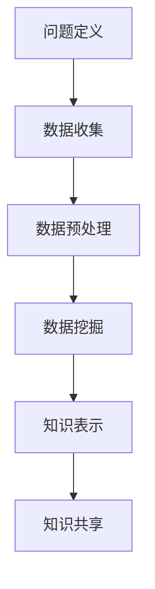

                 

关键词：知识管理、知识发现引擎、商业化应用、人工智能、大数据、算法

> 摘要：本文将深入探讨知识管理解决方案中的关键组件——知识发现引擎，分析其在商业环境中的应用及其商业化路径。文章将涵盖知识发现引擎的核心概念、算法原理、数学模型、项目实践以及未来发展趋势。

## 1. 背景介绍

在当今信息爆炸的时代，如何有效地管理和利用知识资源已成为企业、研究机构和政府等各个领域的重要课题。传统的知识管理手段，如文档管理、数据库存储和共享平台，已经难以满足快速变化的市场需求和日益增长的数据量。知识发现引擎（Knowledge Discovery Engine）作为一种新型的知识管理工具，应运而生，它通过先进的算法和数据分析技术，从大量数据中提取有价值的信息和洞见，为决策提供支持。

知识管理是指通过系统地收集、组织、存储、检索和应用知识，以提高组织效率和创新能力的过程。而知识发现引擎则是知识管理中的重要环节，它能够自动识别数据中的潜在模式和关联，帮助用户快速发现知识，实现知识的共享和利用。

知识发现引擎的应用领域广泛，包括但不限于金融、医疗、零售、制造业等。在金融领域，知识发现引擎可以用于市场预测、风险分析和客户行为研究；在医疗领域，它可以用于疾病诊断、治疗方案优化和药物研发；在零售和制造业，它可以用于需求预测、库存管理和供应链优化。

## 2. 核心概念与联系

### 2.1 知识管理

知识管理（Knowledge Management, KM）是一种通过系统的方法和工具来识别、捕捉、存储、分享和应用组织内外部知识的活动。知识管理不仅仅是简单地收集和存储信息，它更强调知识的创造、共享和应用，以实现组织的知识资源最大化。

### 2.2 知识发现引擎

知识发现引擎是一种基于人工智能和大数据分析技术的高级工具，它能够从大规模数据集中自动识别出隐藏的模式、关联和趋势，从而生成新的知识。知识发现引擎通常包括以下几个关键模块：

1. **数据采集**：从各种数据源（如数据库、网络、传感器等）收集数据。
2. **数据预处理**：清洗、转换和整合数据，使其适合进一步分析。
3. **数据挖掘**：应用各种算法和技术（如聚类、分类、关联分析等）挖掘数据中的隐藏模式。
4. **知识表示**：将挖掘出的知识以易于理解和利用的形式表示出来。
5. **知识共享**：通过共享平台和工具将知识传播给组织内部和外部的相关人员。

### 2.3 知识发现流程

知识发现流程包括以下几个步骤：

1. **问题定义**：明确知识发现的目标和问题。
2. **数据收集**：确定数据来源，收集相关数据。
3. **数据预处理**：清洗和转换数据，去除噪声和冗余。
4. **数据挖掘**：选择合适的算法和技术进行数据挖掘。
5. **知识评估**：评估挖掘结果的有效性和价值。
6. **知识应用**：将挖掘出的知识应用于实际问题中。

### 2.4 Mermaid 流程图

以下是一个简化的知识发现引擎的 Mermaid 流程图，展示了其核心概念和模块之间的关系：



## 3. 核心算法原理 & 具体操作步骤

### 3.1 算法原理概述

知识发现引擎的核心在于其算法，这些算法能够从大规模数据中提取有价值的信息。常见的知识发现算法包括：

1. **聚类算法**：用于将数据集分成多个类别，使同一类别内的数据尽可能相似，不同类别之间的数据尽可能不同。
2. **分类算法**：用于将数据集分成预定义的类别，通过学习已有数据的类别标签来预测新数据的类别。
3. **关联规则挖掘**：用于发现数据之间的关联关系，如频繁项集挖掘。
4. **异常检测**：用于识别数据中的异常值或异常模式。

### 3.2 算法步骤详解

#### 3.2.1 数据收集

数据收集是知识发现的第一步，数据的质量和完整性直接影响后续的挖掘结果。数据可以从多种来源获取，如数据库、网络爬虫、传感器等。

#### 3.2.2 数据预处理

数据预处理包括数据清洗、数据转换和数据整合。数据清洗旨在去除错误、重复和噪声数据，确保数据的一致性和准确性。数据转换涉及将数据转换为适合挖掘分析的格式，如数值化、标准化等。数据整合则是将来自多个数据源的数据进行合并，形成统一的数据集。

#### 3.2.3 数据挖掘

数据挖掘阶段，根据特定的业务需求和数据特点选择合适的算法进行挖掘。常见的算法包括K-means聚类、决策树分类、Apriori算法等。

#### 3.2.4 知识表示

知识表示是将挖掘出的结果以易于理解和利用的形式展示给用户。常见的知识表示方法包括可视化、表格、报告等。

#### 3.2.5 知识共享

知识共享是将知识传播给组织内部和外部的相关人员。知识共享可以通过共享平台、邮件、会议等多种方式实现。

### 3.3 算法优缺点

每种算法都有其优缺点，选择合适的算法需要根据具体业务需求和数据特点进行。以下是一些常见算法的优缺点：

1. **K-means聚类**：
   - 优点：简单易实现，计算效率高。
   - 缺点：对初始聚类中心敏感，可能收敛到局部最优解。
2. **决策树分类**：
   - 优点：易于理解和解释，对非线性数据有较好的表现。
   - 缺点：过拟合问题严重，对大量特征数据敏感。
3. **Apriori算法**：
   - 优点：简单有效，适用于发现频繁项集。
   - 缺点：计算复杂度高，对稀疏数据不敏感。

### 3.4 算法应用领域

知识发现引擎的算法广泛应用于各个领域，如：

1. **金融**：用于市场预测、风险管理和客户细分。
2. **医疗**：用于疾病诊断、治疗方案优化和药物研发。
3. **零售**：用于需求预测、库存管理和市场营销。
4. **制造业**：用于质量检测、供应链优化和生产调度。

## 4. 数学模型和公式 & 详细讲解 & 举例说明

### 4.1 数学模型构建

知识发现引擎中的算法通常涉及到复杂的数学模型。以下是一些常见算法的数学模型：

1. **K-means聚类**：
   - 目标函数：最小化聚类中心之间的距离平方和。
   - 公式：$$ J = \sum_{i=1}^{k} \sum_{x \in S_i} \|x - \mu_i\|^2 $$
   - 其中，$J$ 为目标函数，$k$ 为聚类个数，$S_i$ 为第 $i$ 个聚类，$\mu_i$ 为聚类中心。

2. **决策树分类**：
   - 目标函数：最大化分类准确率。
   - 公式：$$ accuracy = \frac{TP + TN}{TP + TN + FP + FN} $$
   - 其中，$TP$、$TN$、$FP$ 和 $FN$ 分别为真正例、真负例、假正例和假负例。

3. **Apriori算法**：
   - 目标函数：最小化支持度和置信度。
   - 公式：$$ support(A \cup B) = \frac{count(A \cup B)}{count(D)} $$
   - $$ confidence(A \rightarrow B) = \frac{count(A \cap B)}{count(A)} $$
   - 其中，$A$ 和 $B$ 为频繁项集，$D$ 为数据集，$count$ 为计数函数。

### 4.2 公式推导过程

以下是 K-means 聚类算法目标函数的推导过程：

1. **初始设置**：随机选择 $k$ 个聚类中心 $\mu_1, \mu_2, ..., \mu_k$。
2. **迭代步骤**：
   - 对于每个数据点 $x$，计算其到各个聚类中心的距离，选择距离最小的聚类中心作为其归属。
   - 更新聚类中心，计算所有数据点的均值。
3. **目标函数**：最小化聚类中心之间的距离平方和。

### 4.3 案例分析与讲解

#### 4.3.1 K-means 聚类算法案例分析

假设有一个包含100个数据点的数据集，我们要将其划分为5个聚类。以下是一个简化的案例：

1. **数据集**：
   ```
   [[1, 2], [2, 2], [2, 3], [3, 3], [3, 4], [4, 4], [4, 5], [5, 5], [5, 6], [6, 6],
   [6, 7], [7, 7], [7, 8], [8, 8], [8, 9], [9, 9], [9, 10], [10, 10],
   [10, 11], [11, 11], [11, 12], [12, 12], [12, 13], [13, 13], [13, 14],
   [14, 14], [14, 15], [15, 15], [15, 16], [16, 16], [16, 17], [17, 17],
   [17, 18], [18, 18], [18, 19], [19, 19], [19, 20], [20, 20], [20, 21],
   [21, 21], [21, 22], [22, 22], [22, 23], [23, 23], [23, 24], [24, 24],
   [24, 25], [25, 25], [25, 26], [26, 26], [26, 27], [27, 27], [27, 28],
   [28, 28], [28, 29], [29, 29], [29, 30], [30, 30]]
   ```
2. **初始聚类中心**：随机选择5个数据点作为初始聚类中心。
3. **迭代过程**：
   - 第一次迭代：计算每个数据点到5个聚类中心的距离，选择距离最小的聚类中心作为归属。
   - 第二次迭代：根据归属重新计算聚类中心。
   - 重复迭代，直到聚类中心不再变化或满足停止条件。
4. **结果**：最终得到5个聚类，每个聚类中的数据点具有相似的特征。

#### 4.3.2 决策树分类算法案例分析

假设我们要对一组鸢尾花（Iris）数据集进行分类，数据集包含3个类别，每个类别有50个样本。以下是一个简化的案例：

1. **数据集**：
   ```
   [[5.1, 3.5, 1.4, 0.2], [4.9, 3.0, 1.4, 0.2], [5.0, 3.6, 1.4, 0.2], ...]
   ```
2. **类别**：[“setosa”, “versicolor”, “virginica”]
3. **迭代过程**：
   - 选择一个特征进行划分，选择使得信息增益最大的特征。
   - 根据划分结果，将数据集划分为多个子集。
   - 对每个子集，递归地选择特征进行划分，直到满足停止条件（如最大深度、信息增益小于阈值等）。
4. **结果**：生成一棵决策树，每个叶节点对应一个类别。

## 5. 项目实践：代码实例和详细解释说明

### 5.1 开发环境搭建

在开始项目实践之前，需要搭建一个适合知识发现引擎开发的开发环境。以下是一个基本的开发环境搭建步骤：

1. **安装Python**：Python是一种广泛用于数据分析和机器学习的编程语言。下载并安装Python，版本建议为3.8及以上。
2. **安装Jupyter Notebook**：Jupyter Notebook是一种交互式开发环境，用于编写和运行Python代码。可以使用pip命令安装：
   ```
   pip install notebook
   ```
3. **安装相关库**：安装用于数据分析和机器学习的常用库，如NumPy、Pandas、Scikit-learn等。可以使用pip命令安装：
   ```
   pip install numpy pandas scikit-learn matplotlib
   ```

### 5.2 源代码详细实现

以下是一个使用Python和Scikit-learn库实现K-means聚类算法的示例代码：

```python
import numpy as np
import pandas as pd
from sklearn.cluster import KMeans
import matplotlib.pyplot as plt

# 5.2.1 数据集加载
data = pd.read_csv("iris_data.csv")
X = data.iloc[:, :4]  # 选择前4个特征

# 5.2.2 K-means聚类
kmeans = KMeans(n_clusters=3, random_state=0)
kmeans.fit(X)
labels = kmeans.predict(X)

# 5.2.3 结果可视化
plt.scatter(X[:, 0], X[:, 1], c=labels, s=50, cmap='viridis')
centers = kmeans.cluster_centers_
plt.scatter(centers[:, 0], centers[:, 1], c='red', s=200, alpha=0.5)
plt.title("K-means Clustering")
plt.xlabel("Petal Length (cm)")
plt.ylabel("Petal Width (cm)")
plt.show()
```

### 5.3 代码解读与分析

以上代码实现了K-means聚类算法的基本流程：

1. **数据加载**：使用Pandas库加载CSV文件格式的鸢尾花数据集。
2. **聚类**：使用Scikit-learn库的KMeans类实现聚类过程，设置聚类个数为3。
3. **结果可视化**：使用Matplotlib库将聚类结果可视化，展示每个数据点的类别和聚类中心。

### 5.4 运行结果展示

运行上述代码后，将生成一个可视化图形，展示鸢尾花数据集的K-means聚类结果。每个数据点根据其所属类别以不同颜色标记，聚类中心以红色标记。

## 6. 实际应用场景

知识发现引擎在实际应用中具有广泛的应用场景，以下是一些典型的应用案例：

### 6.1 金融领域

在金融领域，知识发现引擎可以用于：

1. **市场预测**：分析历史市场数据，预测未来市场走势，为投资决策提供支持。
2. **风险管理**：挖掘交易数据，识别潜在的金融风险，如欺诈交易和信用风险。
3. **客户细分**：分析客户行为数据，将客户划分为不同的细分市场，制定针对性的营销策略。

### 6.2 医疗领域

在医疗领域，知识发现引擎可以用于：

1. **疾病诊断**：通过分析病人的病史、检查结果和生物信息数据，辅助医生进行疾病诊断。
2. **治疗方案优化**：分析大量病例数据，为医生提供最佳治疗方案的建议。
3. **药物研发**：挖掘药物和疾病之间的关系，发现潜在的药物靶点，加速药物研发过程。

### 6.3 零售领域

在零售领域，知识发现引擎可以用于：

1. **需求预测**：分析历史销售数据，预测未来商品需求，优化库存管理。
2. **市场营销**：分析客户购买行为数据，制定个性化的营销策略，提高客户转化率。
3. **供应链优化**：挖掘供应链数据，优化供应链流程，降低成本，提高效率。

### 6.4 未来应用展望

随着大数据和人工智能技术的不断发展，知识发现引擎在未来将具有更广泛的应用前景：

1. **智能城市**：通过分析城市数据，优化城市管理和公共服务，提高城市居民的生活质量。
2. **工业4.0**：在智能制造领域，知识发现引擎可以用于优化生产流程、提高生产效率和质量。
3. **物联网**：通过分析物联网设备收集的大量数据，实现智能家居、智能交通、智能物流等领域的智能化。

## 7. 工具和资源推荐

### 7.1 学习资源推荐

1. **《机器学习》**：作者：周志华
2. **《深度学习》**：作者：Ian Goodfellow、Yoshua Bengio、Aaron Courville
3. **《数据挖掘：实用工具和技术》**：作者：Mohamed Medhat Gaber、Besmira Nushi、Padhraic Smyth

### 7.2 开发工具推荐

1. **Jupyter Notebook**：交互式开发环境，适用于数据分析和机器学习项目。
2. **Python**：广泛用于数据分析和机器学习的编程语言。
3. **Scikit-learn**：Python机器学习库，提供丰富的算法和工具。

### 7.3 相关论文推荐

1. **"K-Means Clustering"**：作者：MacQueen, J. B.
2. **"Decision Trees for Classification and Regression"**：作者：Quinlan, J. R.
3. **"Association Rule Learning"**：作者：Rudiments of Equivalence Class Mining Algorithms

## 8. 总结：未来发展趋势与挑战

### 8.1 研究成果总结

知识发现引擎在近年来取得了显著的研究成果，包括：

1. **算法优化**：针对不同的数据特点和业务需求，开发出多种高效的算法。
2. **应用拓展**：知识发现引擎在金融、医疗、零售等领域的应用取得成功。
3. **系统集成**：知识发现引擎与其他技术（如大数据、物联网等）的集成，实现更广泛的应用。

### 8.2 未来发展趋势

未来知识发现引擎的发展趋势包括：

1. **算法创新**：结合深度学习、强化学习等新技术，开发更强大的算法。
2. **跨领域应用**：进一步拓展知识发现引擎的应用领域，实现更广泛的应用。
3. **智能化**：通过人工智能技术，实现知识发现过程的自动化和智能化。

### 8.3 面临的挑战

知识发现引擎在发展过程中也面临一些挑战：

1. **数据质量**：数据质量直接影响挖掘结果，如何保证数据质量是一个重要问题。
2. **算法复杂度**：随着数据规模的增大，算法复杂度成为一个挑战，如何提高算法效率是一个重要课题。
3. **隐私保护**：在处理敏感数据时，如何保护用户隐私是一个关键问题。

### 8.4 研究展望

未来研究应重点关注以下几个方面：

1. **算法优化**：针对不同类型的数据和业务场景，开发更高效的算法。
2. **系统集成**：实现知识发现引擎与其他技术的深度融合，提高系统的整体性能。
3. **智能化**：通过人工智能技术，实现知识发现过程的智能化和自动化。

## 9. 附录：常见问题与解答

### 9.1 什么是知识发现引擎？

知识发现引擎是一种基于人工智能和大数据分析技术的高级工具，它能够从大规模数据集中自动识别出隐藏的模式、关联和趋势，从而生成新的知识。

### 9.2 知识发现引擎有哪些应用领域？

知识发现引擎广泛应用于金融、医疗、零售、制造业等领域，如市场预测、疾病诊断、需求预测和供应链优化等。

### 9.3 如何保证知识发现引擎的数据质量？

保证数据质量是知识发现引擎成功的关键。可以通过数据清洗、去重、标准化等手段来提高数据质量。

### 9.4 知识发现引擎与其他技术有什么区别？

知识发现引擎是大数据分析和机器学习技术在知识管理领域的应用，与其他技术（如大数据平台、机器学习平台等）相比，更专注于知识的发现和利用。

### 9.5 知识发现引擎的发展前景如何？

知识发现引擎具有广泛的应用前景，随着大数据和人工智能技术的发展，其应用领域将不断拓展，智能化程度将不断提高。未来知识发现引擎将在各行各业中发挥重要作用。

### 结论

知识发现引擎作为知识管理解决方案的重要组成部分，具有广泛的应用前景和重要的研究价值。本文对其核心概念、算法原理、数学模型、项目实践和未来发展趋势进行了深入探讨，希望对读者有所启发。

作者：禅与计算机程序设计艺术 / Zen and the Art of Computer Programming
----------------------------------------------------------------


