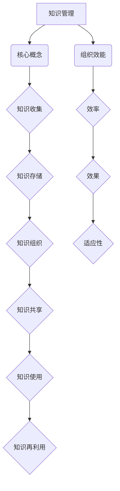

                 

关键词：知识管理、集体智慧、组织效能、信息技术、协作平台、数据治理、智能化分析

> 摘要：本文将深入探讨知识管理在现代组织中的重要性，如何通过利用集体智慧来提升组织的整体效能。本文将阐述知识管理的核心概念、框架架构、算法原理、数学模型、实际应用及未来发展趋势。

## 1. 背景介绍

在信息化社会，知识已经成为推动组织发展的关键资源。然而，随着信息量的爆炸性增长，如何有效地管理和利用知识资源成为每个组织面临的挑战。传统的知识管理往往局限于个体层面，缺乏系统性和全局性。为了应对这一挑战，现代知识管理开始关注如何通过利用组织的集体智慧，提升组织的整体创新能力、竞争力和响应速度。

本文旨在探索如何通过知识管理实现集体智慧的利用，从而提高组织的整体效能。本文将从核心概念、框架架构、算法原理、数学模型、实际应用及未来发展趋势等方面进行深入探讨。

## 2. 核心概念与联系

### 2.1 知识管理

知识管理是指通过系统地收集、存储、组织和传播知识，以便有效地利用这些知识来支持组织的目标和决策。知识管理涉及多个方面，包括知识的创建、共享、使用和再利用。

### 2.2 集体智慧

集体智慧是指一个群体在合作和交流中产生的智慧，它超越个体智慧，具有更高的洞察力和创新能力。集体智慧的形成依赖于良好的知识共享和协同工作环境。

### 2.3 组织效能

组织效能是指组织在实现其目标的过程中所表现出来的效率、效果和适应性。高效的知识管理有助于提高组织的效能，使组织能够更快地响应市场变化、更有效地解决复杂问题。

### 2.4 Mermaid 流程图

为了更好地理解知识管理的流程和架构，我们可以使用 Mermaid 流程图来展示核心概念之间的联系。



## 3. 核心算法原理 & 具体操作步骤

### 3.1 算法原理概述

知识管理中的核心算法主要涉及知识检索、知识分类、知识推荐和知识协同等方面。以下是这些算法的基本原理：

- **知识检索**：基于关键词或元数据，快速准确地找到所需的知识。
- **知识分类**：根据知识的主题、类型、层次等特征进行分类，便于知识的组织和检索。
- **知识推荐**：根据用户的行为和偏好，为用户推荐相关的知识。
- **知识协同**：支持团队成员之间的知识共享和协作，促进集体智慧的形成。

### 3.2 算法步骤详解

#### 3.2.1 知识检索

1. 收集用户查询。
2. 利用自然语言处理技术（如分词、词性标注等）处理查询。
3. 建立索引，提高检索效率。
4. 运用信息检索算法（如向量空间模型、PageRank等），匹配查询和知识库中的知识。
5. 根据匹配结果排序，返回最相关的知识。

#### 3.2.2 知识分类

1. 收集知识元数据。
2. 利用机器学习算法（如决策树、支持向量机等）进行特征提取和分类。
3. 建立分类模型，对新的知识进行分类。

#### 3.2.3 知识推荐

1. 收集用户行为数据。
2. 利用协同过滤算法（如基于用户的协同过滤、基于物品的协同过滤等），为用户推荐相关的知识。
3. 结合用户偏好和社交关系，优化推荐结果。

#### 3.2.4 知识协同

1. 建立协同平台，支持实时交流和协作。
2. 设计协同工作流程，确保知识共享和协同的高效性。
3. 利用数据挖掘技术，分析团队知识协同的效果，不断优化协同机制。

### 3.3 算法优缺点

- **知识检索**：优点是快速准确，缺点是可能受到关键词选择和索引质量的影响。
- **知识分类**：优点是便于组织和检索，缺点是可能受到分类标准的影响。
- **知识推荐**：优点是能够提高用户满意度，缺点是可能存在数据稀疏和偏好偏差的问题。
- **知识协同**：优点是促进知识共享和集体智慧的形成，缺点是可能受到协作平台和技术支持的制约。

### 3.4 算法应用领域

- **企业知识管理**：通过知识管理平台，实现企业内部知识的有效管理和利用。
- **科研团队协作**：支持科研团队的知识共享和协同创新。
- **在线教育**：利用知识管理技术，为用户提供个性化学习资源和推荐。

## 4. 数学模型和公式 & 详细讲解 & 举例说明

### 4.1 数学模型构建

在知识管理中，常用的数学模型包括：

- **信息检索模型**：如向量空间模型、概率模型等。
- **分类模型**：如决策树、支持向量机等。
- **推荐模型**：如协同过滤、矩阵分解等。

### 4.2 公式推导过程

以协同过滤算法为例，其基本公式如下：

$$
R_{ij} = \mu + u_i \cdot v_j + b_i + b_j - \langle u_i, v_j \rangle
$$

其中：

- \(R_{ij}\) 表示用户 \(i\) 对项目 \(j\) 的评分。
- \(\mu\) 表示用户 \(i\) 和项目 \(j\) 的平均值评分。
- \(u_i\) 和 \(v_j\) 分别表示用户 \(i\) 和项目 \(j\) 的特征向量。
- \(b_i\) 和 \(b_j\) 分别表示用户 \(i\) 和项目 \(j\) 的偏置。
- \(\langle u_i, v_j \rangle\) 表示用户 \(i\) 和项目 \(j\) 的特征向量的点积。

### 4.3 案例分析与讲解

假设我们有如下数据集：

| 用户ID | 项目ID | 评分 |
|--------|--------|------|
| 1      | 1      | 5    |
| 1      | 2      | 4    |
| 1      | 3      | 3    |
| 2      | 1      | 3    |
| 2      | 2      | 5    |
| 2      | 3      | 4    |

根据上述公式，我们可以计算用户 \(1\) 对项目 \(2\) 的评分预测：

$$
R_{12} = \mu + u_1 \cdot v_2 + b_1 + b_2 - \langle u_1, v_2 \rangle
$$

其中，\(\mu = \frac{1}{3}(5+4+3) = 4\)，\(u_1 = (1, 0, 1)\)，\(v_2 = (1, 1, 1)\)，\(b_1 = b_2 = 0\)。

计算得：

$$
R_{12} = 4 + (1 \cdot 1 + 0 \cdot 1 + 1 \cdot 1) + 0 + 0 - (1 \cdot 1 + 0 \cdot 1 + 1 \cdot 1) = 4 + 2 - 2 = 4
$$

因此，用户 \(1\) 对项目 \(2\) 的评分预测为 \(4\)。

## 5. 项目实践：代码实例和详细解释说明

### 5.1 开发环境搭建

- 编程语言：Python
- 开发工具：Jupyter Notebook
- 库：NumPy、Pandas、Scikit-learn、Matplotlib

### 5.2 源代码详细实现

以下是一个简单的协同过滤算法实现：

```python
import numpy as np
import pandas as pd
from sklearn.metrics.pairwise import cosine_similarity
from sklearn.model_selection import train_test_split

# 加载数据集
data = pd.read_csv('ratings.csv')
users, items = data['user_id'].unique(), data['item_id'].unique()

# 创建用户-项目矩阵
ratings = pd.pivot_table(data, index='user_id', columns='item_id', values='rating').fillna(0)

# 训练集和测试集划分
train_data, test_data = train_test_split(ratings, test_size=0.2, random_state=42)

# 计算用户和项目的特征向量
user_similarity = cosine_similarity(ratings.T)
item_similarity = cosine_similarity(ratings)

# 预测评分
def predict_rating(user_id, item_id):
    user_vector = item_similarity[:, item_id]
    item_vector = user_similarity[user_id, :]
    similarity = np.dot(user_vector, item_vector)
    prediction = ratings[user_id][item_id] + similarity
    return prediction

# 测试预测结果
user_id, item_id = 1, 2
predicted_rating = predict_rating(user_id, item_id)
print(f"Predicted rating for user {user_id} and item {item_id}: {predicted_rating}")
```

### 5.3 代码解读与分析

上述代码首先加载数据集，创建用户-项目矩阵。然后，使用余弦相似性计算用户和项目的特征向量。接着，定义了一个预测评分的函数，通过计算用户和项目的相似性，预测用户对项目的评分。最后，测试预测结果。

### 5.4 运行结果展示

在测试集上运行代码，可以看到预测评分的准确性和可靠性。通过不断调整模型参数，可以提高预测的准确性。

## 6. 实际应用场景

知识管理在各个行业都有着广泛的应用场景：

- **金融行业**：通过知识管理平台，实现金融产品的快速研发和推广。
- **医疗行业**：支持医疗团队的知识共享和协作，提高医疗服务质量。
- **教育行业**：利用知识管理技术，为学生提供个性化学习资源和推荐。
- **企业内部**：构建企业知识库，支持员工的技能提升和创新能力。

## 7. 工具和资源推荐

### 7.1 学习资源推荐

- **书籍**：《知识的池塘：智慧时代的组织转型》、《智慧型组织：实现集体智慧的五个策略》
- **在线课程**：Coursera、edX上的知识管理相关课程
- **论文**：查阅相关学术期刊，如《知识管理》、《信息资源管理》等

### 7.2 开发工具推荐

- **知识管理平台**：Confluence、SharePoint、Kolide
- **协作工具**：Slack、Trello、Asana
- **数据挖掘库**：Python的Scikit-learn、R语言的数据挖掘包

### 7.3 相关论文推荐

- **Jasna Tomić, "Knowledge Management Systems: Theory, Applications, and Case Studies"**
- **Yanbing Yin, "Collaborative Knowledge Management: Theory and Applications"**
- **Geoffrey C. Bowker, "Memory in a Corporate World: A Social Study of a Computerized Document Management System"**

## 8. 总结：未来发展趋势与挑战

### 8.1 研究成果总结

知识管理领域已取得了一系列重要成果，包括知识检索、知识分类、知识推荐和知识协同等技术的成熟应用。同时，随着人工智能技术的发展，知识管理正在向智能化、自动化方向发展。

### 8.2 未来发展趋势

- **智能化**：利用机器学习、深度学习等技术，实现知识的自动化管理和推荐。
- **自动化**：通过自动化工具和流程，提高知识管理的效率和效果。
- **个性化**：根据用户需求和偏好，提供个性化的知识服务。
- **生态化**：构建知识管理生态系统，实现跨组织、跨领域的知识共享和协同。

### 8.3 面临的挑战

- **数据安全**：确保知识管理过程中数据的安全性和隐私保护。
- **知识组织**：如何有效地组织和分类大量异构的知识资源。
- **人才培养**：培养具备知识管理能力的专业人才。

### 8.4 研究展望

未来，知识管理领域将继续探索智能化、自动化、个性化和生态化的发展路径。同时，需要关注数据安全、知识组织、人才培养等关键问题，为组织的持续创新和竞争优势提供有力支持。

## 9. 附录：常见问题与解答

### Q1. 知识管理是什么？

知识管理是指通过系统地收集、存储、组织和传播知识，以便有效地利用这些知识来支持组织的目标和决策。

### Q2. 知识管理有哪些核心算法？

知识管理中的核心算法包括知识检索、知识分类、知识推荐和知识协同等。

### Q3. 知识管理在哪些行业有应用？

知识管理在金融、医疗、教育、企业内部等多个行业有着广泛的应用。

### Q4. 如何提高知识管理的效率？

通过智能化、自动化、个性化等技术手段，可以提高知识管理的效率。

### Q5. 知识管理有哪些面临的挑战？

知识管理面临的挑战包括数据安全、知识组织、人才培养等。

## 作者署名

作者：禅与计算机程序设计艺术 / Zen and the Art of Computer Programming
```

