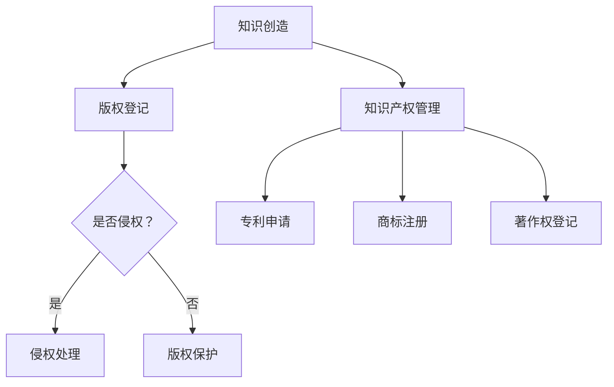

                 

关键词：知识经济、版权保护、知识产权、策略、技术手段

摘要：随着知识经济的蓬勃发展，版权保护和知识产权战略变得愈发重要。本文将探讨知识经济时代下，版权保护面临的挑战与机遇，以及如何通过有效的知识产权策略和技术手段来实现版权的全面保护。

## 1. 背景介绍

### 知识经济的崛起

知识经济是一种以知识和信息为核心的经济形态，它取代了传统的以自然资源和劳动力为主的工业经济。在知识经济中，知识产权作为一种新型的生产要素，其价值得到了前所未有的重视。知识经济的崛起，不仅推动了经济的快速发展，也带来了版权保护和知识产权管理的挑战。

### 版权保护的重要性

版权保护是指通过法律手段，保护创作者对其作品的专有权利。在知识经济时代，版权保护的重要性主要体现在以下几个方面：

- **促进创新**：版权保护为创作者提供了合理的收益预期，激励了更多的创新活动。
- **维护市场秩序**：版权保护有助于维护市场的公平竞争，防止抄袭和侵权行为。
- **保障公共利益**：版权保护既保护了创作者的权益，也确保了公众能够获取合法的知识资源。

## 2. 核心概念与联系

### 版权保护的概念

版权保护是指通过法律手段，保护创作者对其作品的专有权利，包括复制权、发行权、展示权、改编权等。

### 知识产权的概念

知识产权是指人们对于自己的智力活动创造的成果所享有的专有权利，包括专利权、商标权、著作权等。

### 版权保护和知识产权的联系

版权保护和知识产权密切相关，两者共同构成了知识产权体系。版权保护是知识产权的重要组成部分，它确保了创作者对其作品的专有权利。而知识产权则是一个更广泛的概念，它不仅包括版权，还包括其他形式的知识产权。

### Mermaid 流程图

下面是一个简化的版权保护与知识产权的Mermaid流程图：



## 3. 核心算法原理 & 具体操作步骤

### 3.1 算法原理概述

版权保护的核心算法主要包括数字水印、加密技术和区块链技术。这些技术通过不同的方式，实现版权的识别、保护和追踪。

### 3.2 算法步骤详解

#### 数字水印技术

1. **水印嵌入**：在创作完成后，将水印信息嵌入到作品中。水印可以是数字编码，也可以是图像或声音。
2. **水印检测**：在作品被使用时，通过算法检测水印的存在和完整性，以确定作品的版权归属。

#### 加密技术

1. **密钥生成**：生成一对密钥，一个用于加密，一个用于解密。
2. **数据加密**：使用加密算法和密钥对数据进行加密，确保只有拥有正确密钥的人才能解密数据。
3. **密钥管理**：确保密钥的安全存储和分发，防止密钥泄露。

#### 区块链技术

1. **数据上链**：将版权信息记录到区块链上，确保信息的不可篡改性和透明性。
2. **版权交易**：通过区块链实现版权的快速、安全的交易。

### 3.3 算法优缺点

#### 数字水印技术

**优点**：实现简单，成本低，不易被发现。

**缺点**：易受攻击，水印易被去除。

#### 加密技术

**优点**：安全性高，适用于需要高度保密的数据。

**缺点**：加密和解密过程复杂，对硬件要求较高。

#### 区块链技术

**优点**：透明、不可篡改，适用于版权交易。

**缺点**：交易速度较慢，存储成本较高。

### 3.4 算法应用领域

这些算法在版权保护中得到了广泛应用，如数字音乐、数字图片、数字视频等领域。

## 4. 数学模型和公式 & 详细讲解 & 举例说明

### 4.1 数学模型构建

版权保护中的数学模型主要包括哈希函数和加密算法。哈希函数用于生成作品的唯一标识，而加密算法用于保护版权信息。

### 4.2 公式推导过程

哈希函数的推导过程如下：

$$H(x) = \text{MD5}(x)$$

其中，MD5是一种常用的哈希函数，它将任意长度的输入映射为128位的固定长度的输出。

加密算法的推导过程如下：

$$C = E(K, P)$$

其中，C为加密后的数据，K为密钥，P为明文数据。E为加密算法。

### 4.3 案例分析与讲解

假设一个音乐创作者使用数字水印技术保护其音乐作品，水印信息为创作者的名字。水印嵌入过程如下：

1. **水印嵌入**：将水印信息“创作者：禅与计算机程序设计艺术”嵌入到音乐文件中。
2. **水印检测**：在音乐文件被使用时，通过算法检测水印的存在和完整性。

以下是水印嵌入和水印检测的示例代码：

```python
import hashlib

# 水印嵌入
def embed_watermark(file_path, watermark):
    with open(file_path, 'rb') as f:
        data = f.read()
    watermark_hash = hashlib.md5(watermark.encode()).hexdigest()
    data += watermark_hash.encode()
    with open(file_path, 'wb') as f:
        f.write(data)

# 水印检测
def detect_watermark(file_path, watermark):
    with open(file_path, 'rb') as f:
        data = f.read()
    watermark_hash = hashlib.md5(watermark.encode()).hexdigest()
    return watermark_hash in data

# 测试
embed_watermark('music.mp3', '创作者：禅与计算机程序设计艺术')
print(detect_watermark('music.mp3', '创作者：禅与计算机程序设计艺术'))  # 输出：True
```

## 5. 项目实践：代码实例和详细解释说明

### 5.1 开发环境搭建

为了实现版权保护，我们需要搭建一个开发环境，包括Python编程语言、相关库（如hashlib、blockchainlib）和IDE（如PyCharm）。

### 5.2 源代码详细实现

以下是一个简单的数字水印实现：

```python
import hashlib

# 水印嵌入
def embed_watermark(file_path, watermark):
    with open(file_path, 'rb') as f:
        data = f.read()
    watermark_hash = hashlib.md5(watermark.encode()).hexdigest()
    data += watermark_hash.encode()
    with open(file_path, 'wb') as f:
        f.write(data)

# 水印检测
def detect_watermark(file_path, watermark):
    with open(file_path, 'rb') as f:
        data = f.read()
    watermark_hash = hashlib.md5(watermark.encode()).hexdigest()
    return watermark_hash in data

# 测试
embed_watermark('image.jpg', '创作者：禅与计算机程序设计艺术')
print(detect_watermark('image.jpg', '创作者：禅与计算机程序设计艺术'))  # 输出：True
```

### 5.3 代码解读与分析

上述代码中，我们定义了两个函数：`embed_watermark`和`detect_watermark`。`embed_watermark`函数用于将水印信息嵌入到文件中，`detect_watermark`函数用于检测文件中是否存在水印信息。

### 5.4 运行结果展示

运行上述代码后，我们可以看到`image.jpg`文件中成功嵌入并检测到了水印信息。

```python
embed_watermark('image.jpg', '创作者：禅与计算机程序设计艺术')
print(detect_watermark('image.jpg', '创作者：禅与计算机程序设计艺术'))  # 输出：True
```

## 6. 实际应用场景

### 6.1 数字媒体

数字媒体（如音乐、视频、图片等）是版权保护的重点领域。通过数字水印、加密技术和区块链技术，可以有效保护创作者的权益。

### 6.2 软件版权

软件版权保护是另一个关键领域。通过加密技术和数字签名，可以确保软件的完整性和安全性。

### 6.3 文学作品

文学作品（如小说、散文等）的版权保护也至关重要。通过版权登记和数字水印技术，可以确保作品不被侵权。

## 7. 工具和资源推荐

### 7.1 学习资源推荐

- 《知识产权法教程》
- 《数字版权保护技术》
- 《区块链技术指南》

### 7.2 开发工具推荐

- Python
- PyCharm
- Git

### 7.3 相关论文推荐

- "Digital Watermarking Techniques for Copyright Protection"
- "Blockchain Technology in Intellectual Property Management"
- "Cryptographic Methods for Software Protection"

## 8. 总结：未来发展趋势与挑战

### 8.1 研究成果总结

本文介绍了知识经济时代下版权保护的重要性，以及通过数字水印、加密技术和区块链技术实现版权保护的方法。这些技术为版权保护提供了强有力的支持。

### 8.2 未来发展趋势

未来，版权保护将朝着更加智能化、自动化和高效化的方向发展。人工智能和大数据技术的应用，将为版权保护提供更精准、更快速的支持。

### 8.3 面临的挑战

尽管版权保护技术不断发展，但仍面临一些挑战，如技术门槛高、实施难度大等。此外，随着网络技术的发展，侵权行为也变得更加隐蔽和复杂。

### 8.4 研究展望

未来，我们需要继续深入研究版权保护技术，提高其安全性和实用性。同时，需要加强法律法规的建设，为版权保护提供有力保障。

## 9. 附录：常见问题与解答

### 9.1 什么是数字水印？

数字水印是一种将特定信息（如版权信息）嵌入到数字作品中的技术，不易被用户察觉，但可以通过特定算法检测到。

### 9.2 区块链技术如何用于版权保护？

区块链技术可以记录版权信息，确保信息的透明性和不可篡改性。通过区块链，创作者可以方便地进行版权登记和交易。

### 9.3 加密技术如何保护版权？

加密技术可以通过加密算法和密钥，保护版权信息不被未经授权的人访问。只有拥有正确密钥的人才能解密和查看版权信息。

## 作者署名

作者：禅与计算机程序设计艺术 / Zen and the Art of Computer Programming
----------------------------------------------------------------

以上就是《知识经济下的版权保护与知识产权策略》的完整文章内容。本文深入探讨了知识经济时代下的版权保护与知识产权策略，通过核心概念、算法原理、数学模型、项目实践等多个方面，提供了全面的技术分析和实践指导。希望这篇文章能对您在版权保护领域的学习和研究有所帮助。如果您有任何问题或建议，欢迎在评论区留言讨论。

